# API 接口文档

<cite>
**本文引用的文件**
- [backend/app/main.py](file://backend/app/main.py)
- [backend/app/api/v1/endpoints/auth.py](file://backend/app/api/v1/endpoints/auth.py)
- [backend/app/api/v1/endpoints/monitor.py](file://backend/app/api/v1/endpoints/monitor.py)
- [backend/app/api/v1/endpoints/diagnosis_v2.py](file://backend/app/api/v1/endpoints/diagnosis_v2.py)
- [backend/app/api/v1/endpoints/tuning.py](file://backend/app/api/v1/endpoints/tuning.py)
- [backend/app/api/v1/endpoints/handling.py](file://backend/app/api/v1/endpoints/handling.py)
- [backend/app/api/v1/endpoints/reports.py](file://backend/app/api/v1/endpoints/reports.py)
- [backend/app/api/v1/endpoints/performance.py](file://backend/app/api/v1/endpoints/performance.py)
- [backend/app/api/v1/endpoints/realtime.py](file://backend/app/api/v1/endpoints/realtime.py)
- [backend/app/api/v1/endpoints/ws_realtime.py](file://backend/app/api/v1/endpoints/ws_realtime.py)
</cite>

## 目录
1. [简介](#简介)
2. [项目结构](#项目结构)
3. [核心组件](#核心组件)
4. [架构总览](#架构总览)
5. [详细组件分析](#详细组件分析)
6. [依赖关系分析](#依赖关系分析)
7. [性能与限流](#性能与限流)
8. [故障排查指南](#故障排查指南)
9. [结论](#结论)
10. [附录：OpenAPI、版本与兼容性](#附录openapi版本与兼容性)

## 简介
本文件为 CLPM-MVP 后端 RESTful API 的完整接口文档，覆盖认证授权、监控、评估、诊断、整定、处置、报告等模块，并说明数据查询分页机制、实时通信（WebSocket）协议、错误处理策略、速率限制以及 OpenAPI 规范与版本管理。所有端点统一以 /api/v1 前缀暴露，响应体采用 ApiResponse 包装。

## 项目结构
后端基于 FastAPI 构建，路由按业务模块拆分到 app/api/v1/endpoints 下，统一由 main.py 注册并挂载到 /api/v1。鉴权、权限校验、数据库会话、异常处理、中间件（请求ID、幂等、速率限制）在入口集中配置。

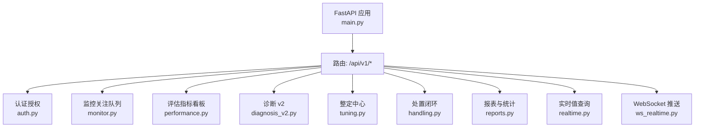

图表来源
- [backend/app/main.py:31-92](file://backend/app/main.py#L31-L92)

章节来源
- [backend/app/main.py:1-12](file://backend/app/main.py#L1-L12)
- [backend/app/main.py:31-92](file://backend/app/main.py#L31-L92)

## 核心组件
- 认证授权：登录、刷新、登出、当前用户信息、密码修改、RBAC 测试。
- 监控：统一关注队列（预警/恶化/数据质量）、工作台摘要。
- 评估：指标配置、引擎规则、全局看板、低效回路排行、统计报表导出、快照列表与等级分布。
- 诊断：发起诊断（异步）、记录列表与详情、算子元数据、CSV 导出、复核与处置建议。
- 整定：方法信息、模型辨识（同步/异步）、PID 整定、仿真对比、任务管理与进度、知识库。
- 处置：建议与工单双实体状态机流转、KPI 前后对比预览、聚合统计。
- 报表：配置管理、生成任务、管理总览、诊断统计、收益报告、阶段锁定、PDF 导出。
- 实时：Redis 缓存读取 Tag 实时值；WebSocket 订阅实时推送。

章节来源
- [backend/app/api/v1/endpoints/auth.py:1-148](file://backend/app/api/v1/endpoints/auth.py#L1-L148)
- [backend/app/api/v1/endpoints/monitor.py:1-98](file://backend/app/api/v1/endpoints/monitor.py#L1-L98)
- [backend/app/api/v1/endpoints/performance.py:1-542](file://backend/app/api/v1/endpoints/performance.py#L1-L542)
- [backend/app/api/v1/endpoints/diagnosis_v2.py:1-845](file://backend/app/api/v1/endpoints/diagnosis_v2.py#L1-L845)
- [backend/app/api/v1/endpoints/tuning.py:1-774](file://backend/app/api/v1/endpoints/tuning.py#L1-L774)
- [backend/app/api/v1/endpoints/handling.py:1-800](file://backend/app/api/v1/endpoints/handling.py#L1-L800)
- [backend/app/api/v1/endpoints/reports.py:1-480](file://backend/app/api/v1/endpoints/reports.py#L1-L480)
- [backend/app/api/v1/endpoints/realtime.py:1-69](file://backend/app/api/v1/endpoints/realtime.py#L1-L69)
- [backend/app/api/v1/endpoints/ws_realtime.py:1-136](file://backend/app/api/v1/endpoints/ws_realtime.py#L1-L136)

## 架构总览
整体调用链：客户端 → FastAPI 路由 → 依赖注入（DB、用户、权限）→ 服务层 → 数据源（PostgreSQL/TDengine/Redis/Celery）。异步任务通过 Celery Beat/Worker 执行，WebSocket 通过 Redis Pub/Sub 转发实时消息。

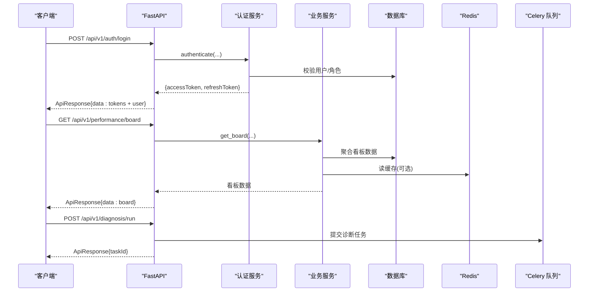

图表来源
- [backend/app/api/v1/endpoints/auth.py:69-114](file://backend/app/api/v1/endpoints/auth.py#L69-L114)
- [backend/app/api/v1/endpoints/performance.py:134-164](file://backend/app/api/v1/endpoints/performance.py#L134-L164)
- [backend/app/api/v1/endpoints/diagnosis_v2.py:190-312](file://backend/app/api/v1/endpoints/diagnosis_v2.py#L190-L312)

## 详细组件分析

### 认证授权接口
- 登录
  - 方法/路径：POST /api/v1/auth/login
  - 认证：无需
  - 请求体：用户名、密码、是否记住我
  - 响应：access_token、refresh_token、token_type、expires_in、user
- 刷新令牌
  - 方法/路径：POST /api/v1/auth/refresh
  - 认证：无需（需有效 refresh token）
  - 请求体：refreshToken
  - 响应：新 access_token、refresh_token、token_type、expires_in
- 登出
  - 方法/路径：POST /api/v1/auth/logout
  - 认证：需要（Bearer Token）
  - 响应：成功
- 当前用户
  - 方法/路径：GET /api/v1/auth/me
  - 认证：需要
  - 响应：用户信息、权限、默认首页
- 修改密码
  - 方法/路径：PUT /api/v1/auth/password
  - 认证：需要
  - 请求体：旧密码、新密码
  - 响应：成功（提示重新登录）
- RBAC 测试
  - 方法/路径：GET /api/v1/auth/rbac-test
  - 认证：ADMIN 角色

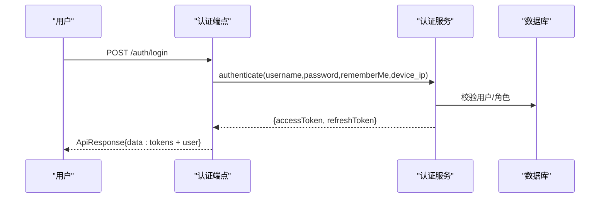

图表来源
- [backend/app/api/v1/endpoints/auth.py:69-114](file://backend/app/api/v1/endpoints/auth.py#L69-L114)

章节来源
- [backend/app/api/v1/endpoints/auth.py:1-148](file://backend/app/api/v1/endpoints/auth.py#L1-L148)

### 监控模块接口
- 统一关注队列
  - 方法/路径：GET /api/v1/monitor/attention
  - 认证：需要
  - 查询参数：plantNodeId、source、priority、status、loopId、keyword、page、pageSize
  - 响应：分页结果（items、total、page、pageSize）
- 工作台摘要
  - 方法/路径：GET /api/v1/monitor/loops/{loop_id}/summary
  - 认证：需要（特定角色）
  - 响应：首屏所需全部摘要（部分失败时 partial=true）

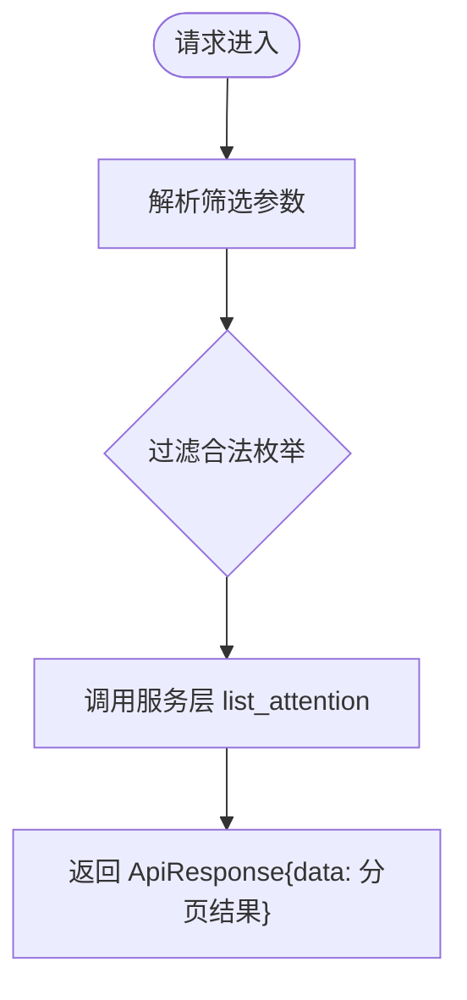

图表来源
- [backend/app/api/v1/endpoints/monitor.py:43-80](file://backend/app/api/v1/endpoints/monitor.py#L43-L80)

章节来源
- [backend/app/api/v1/endpoints/monitor.py:1-98](file://backend/app/api/v1/endpoints/monitor.py#L1-L98)

### 评估模块接口
- 指标配置
  - GET /api/v1/performance/metrics
  - PUT /api/v1/performance/metrics/{metric_id}（仅 ADMIN）
- 引擎规则
  - GET /api/v1/performance/rules
  - PUT /api/v1/performance/rules/{rule_id}（仅 ADMIN）
- 全局看板
  - GET /api/v1/performance/board（支持时间窗、装置节点筛选）
- 低效回路排行
  - GET /api/v1/performance/ranking（支持排序、分页 offset/limit）
- 统计报表
  - GET /api/v1/performance/analytics（时间范围、粒度、指标键）
  - POST /api/v1/performance/analytics/export（CSV 导出）
- 快照列表与等级分布
  - GET /api/v1/performance/loops/snapshots（多条件筛选、latestOnly、排序、分页）
  - GET /api/v1/performance/grade-distribution（按等级聚合）

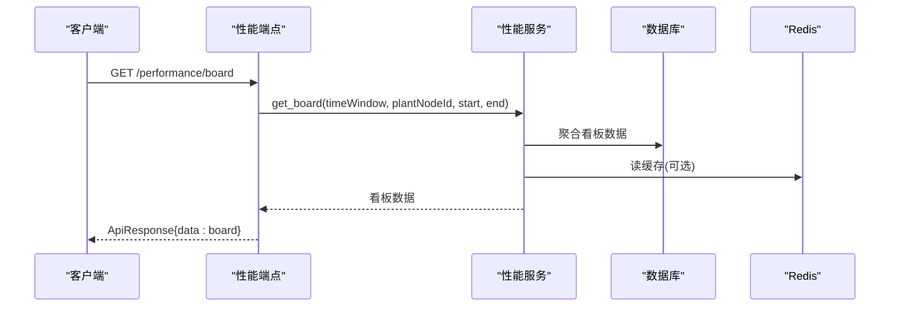

图表来源
- [backend/app/api/v1/endpoints/performance.py:134-164](file://backend/app/api/v1/endpoints/performance.py#L134-L164)

章节来源
- [backend/app/api/v1/endpoints/performance.py:1-542](file://backend/app/api/v1/endpoints/performance.py#L1-L542)

### 诊断模块接口（v2）
- 发起诊断
  - POST /api/v1/diagnosis/run
  - 认证：IC_ENGINEER/PE_ENGINEER/ADMIN
  - 请求体：loopIds、timeWindow（preset/start/end）、operatorGroup、operators（可选）
  - 响应：taskId、accepted
- 诊断记录列表
  - GET /api/v1/diagnosis/runs（筛选：loopId、category、severity、status、reviewStatus、taskId、startTime、endTime；分页）
- 诊断详情
  - GET /api/v1/diagnosis/runs/{run_id}
- 算子元数据
  - GET /api/v1/diagnosis/operators
- CSV 导出
  - GET /api/v1/diagnosis/export（筛选同列表）
- 复核与处置建议
  - POST /api/v1/diagnosis/runs/{run_id}/review
  - GET/POST/PUT/DELETE /api/v1/diagnosis/runs/actions/{action_id}
- 每回路最新诊断概览
  - GET /api/v1/diagnosis/runs/latest（支持 plantNodeId、loopId）

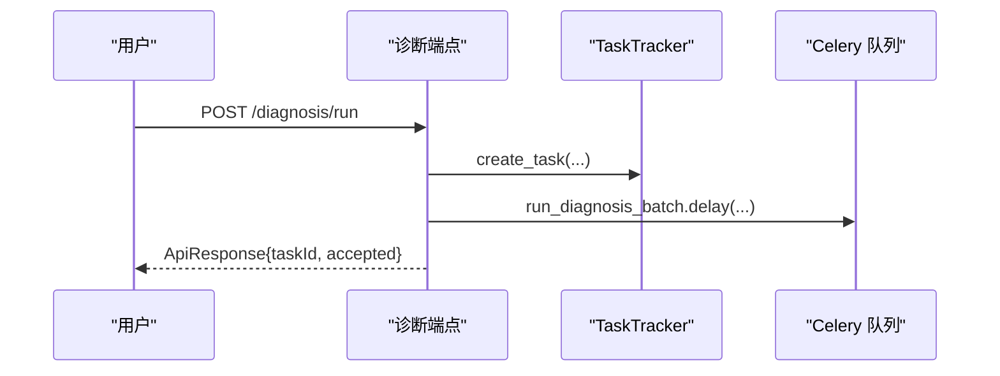

图表来源
- [backend/app/api/v1/endpoints/diagnosis_v2.py:190-312](file://backend/app/api/v1/endpoints/diagnosis_v2.py#L190-L312)

章节来源
- [backend/app/api/v1/endpoints/diagnosis_v2.py:1-845](file://backend/app/api/v1/endpoints/diagnosis_v2.py#L1-L845)

### 整定模块接口
- 方法信息
  - GET /api/v1/tuning/methods
- 模型辨识
  - POST /api/v1/tuning/identify（同步，阶跃实验路径）
  - POST /api/v1/tuning/identify/history（异步，历史数据辨识；STEP_ONLY 走同步分支）
  - POST /api/v1/tuning/identify/segments（可辨识片段预览）
- PID 整定与仿真
  - POST /api/v1/tuning/tune（推荐 PID 计算）
  - POST /api/v1/tuning/simulate（闭环仿真）
  - POST /api/v1/tuning/compare（多 PID 对比仿真）
- 效果验证
  - GET /api/v1/tuning/verification/data（前后窗曲线与 KPI 快照）
- 任务管理
  - GET /api/v1/tuning/tasks（分页+筛选）
  - GET /api/v1/tuning/tasks/{task_id}（详情）
  - GET /api/v1/tuning/tasks/{task_id}/status（进度）
  - POST /api/v1/tuning/tasks/{task_id}/cancel（取消）
  - POST /api/v1/tuning/tasks（保存任务）
- 历史统计与知识库
  - GET /api/v1/tuning/history
  - GET /api/v1/tuning/knowledge-base（分页+筛选）
  - GET /api/v1/tuning/knowledge-base/similar（相似案例推荐）
  - GET /api/v1/tuning/knowledge-base/{entry_id}（条目详情）

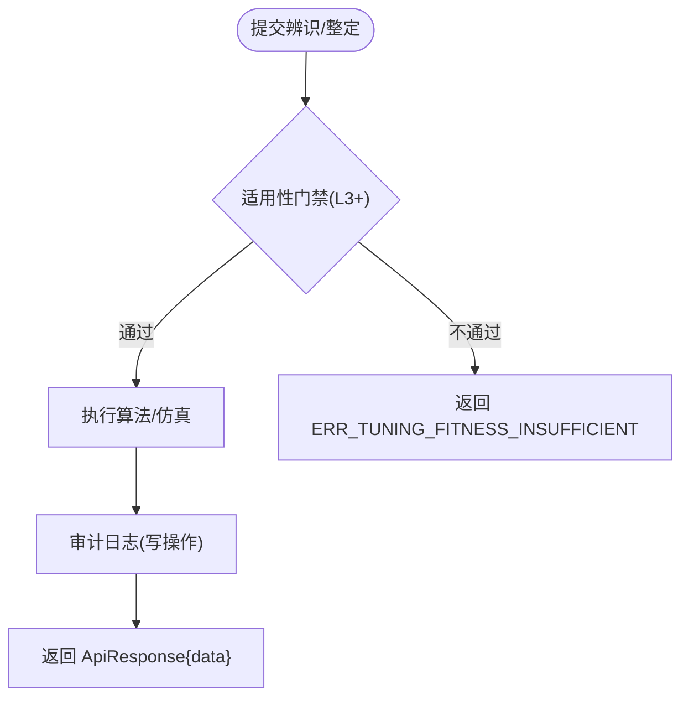

图表来源
- [backend/app/api/v1/endpoints/tuning.py:97-129](file://backend/app/api/v1/endpoints/tuning.py#L97-L129)
- [backend/app/api/v1/endpoints/tuning.py:269-316](file://backend/app/api/v1/endpoints/tuning.py#L269-L316)

章节来源
- [backend/app/api/v1/endpoints/tuning.py:1-774](file://backend/app/api/v1/endpoints/tuning.py#L1-L774)

### 处置模块接口
- 建议侧
  - GET /api/v1/handling/suggestions（分页+筛选+状态分组排序）
  - POST /api/v1/handling/suggestions（手动新增）
  - POST /api/v1/handling/suggestions/{id}/accept（接受）
  - POST /api/v1/handling/suggestions/{id}/reject（驳回）
  - POST /api/v1/handling/suggestions/{id}/ignore（忽略）
  - POST /api/v1/handling/suggestions/convert（转工单）
- 工单侧
  - GET /api/v1/handling/orders（分页+筛选+状态分组排序）
  - GET /api/v1/handling/orders/{id}（详情+来源建议摘要）
  - POST /api/v1/handling/orders（新建工单）
  - POST /api/v1/handling/orders/{id}/start（开工）
  - POST /api/v1/handling/orders/{id}/feedback（反馈）
  - POST /api/v1/handling/orders/{id}/submit（提交验证）
  - POST /api/v1/handling/orders/{id}/verify（验证结论）
  - POST /api/v1/handling/orders/{id}/cancel（作废）
  - POST /api/v1/handling/orders/{id}/kpi-comparison（KPI 前后对比预览）
- 聚合
  - GET /api/v1/handling/loops（档案聚合）
  - GET /api/v1/handling/statistics（统计）

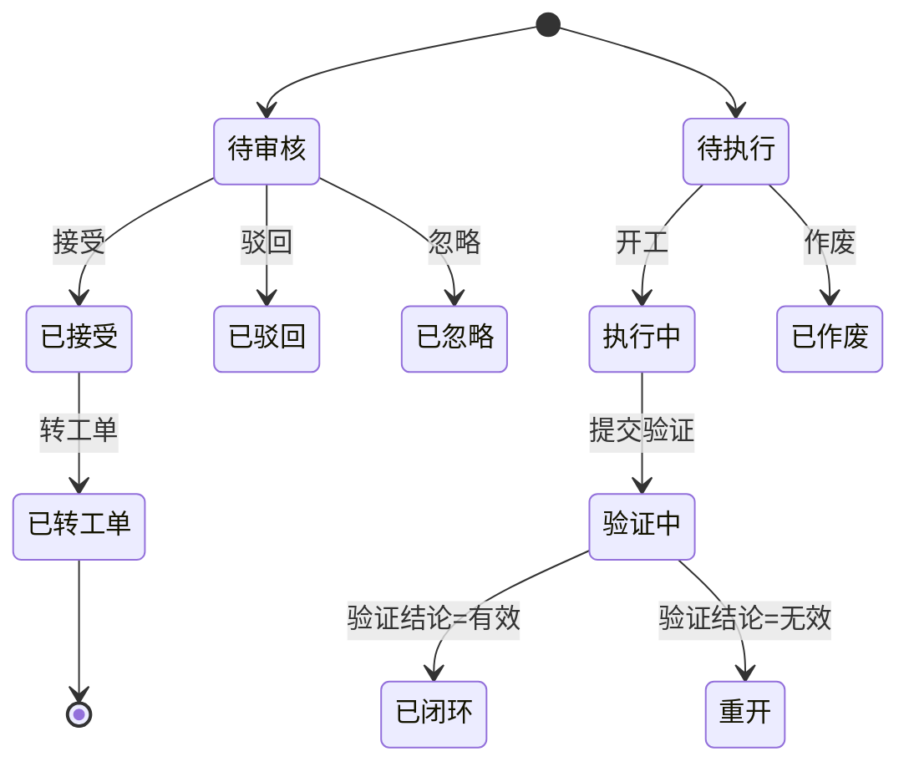

图表来源
- [backend/app/api/v1/endpoints/handling.py:75-92](file://backend/app/api/v1/endpoints/handling.py#L75-L92)

章节来源
- [backend/app/api/v1/endpoints/handling.py:1-800](file://backend/app/api/v1/endpoints/handling.py#L1-L800)

### 报表模块接口
- 配置管理（仅 ADMIN）
  - GET /api/v1/reports/configs
  - POST /api/v1/reports/configs
  - PUT /api/v1/reports/configs/{config_id}
- 生成与任务
  - POST /api/v1/reports/generate（异步）
  - GET /api/v1/reports/tasks/{task_id}（任务状态）
- 统计与总览
  - GET /api/v1/reports/overview（S1/S2/S3 自适应）
  - GET /api/v1/reports/diagnosis-statistics（诊断统计）
  - GET /api/v1/reports/benefit（收益报告）
- 阶段锁定
  - GET /api/v1/reports/stage-lock
  - PUT /api/v1/reports/stage-lock（仅 ADMIN）
- PDF 导出（异步）
  - POST /api/v1/reports/export-pdf
  - GET /api/v1/reports/export-tasks/{task_id}（状态）
  - GET /api/v1/reports/export-download/{task_id}（下载）

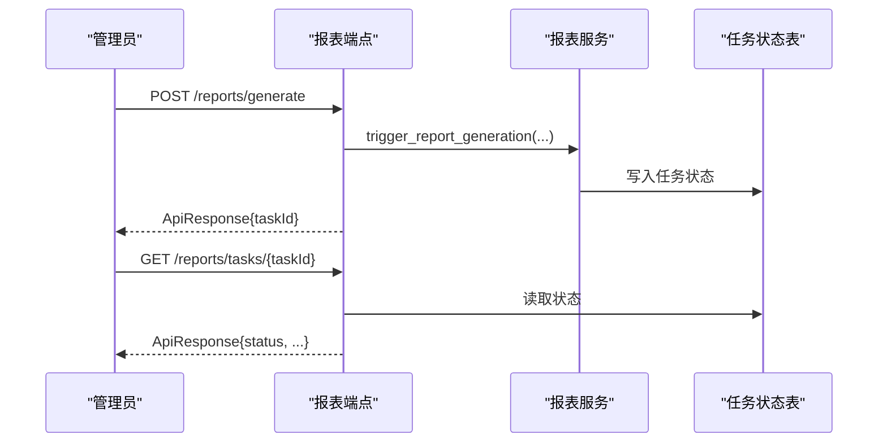

图表来源
- [backend/app/api/v1/endpoints/reports.py:166-190](file://backend/app/api/v1/endpoints/reports.py#L166-L190)

章节来源
- [backend/app/api/v1/endpoints/reports.py:1-480](file://backend/app/api/v1/endpoints/reports.py#L1-L480)

### 实时数据与 WebSocket
- 实时值查询
  - GET /api/v1/realtime?tagCodes=...
  - 认证：需要
  - 响应：items（tagCode、value、quality、collectTime）
- WebSocket 实时推送
  - WS /api/v1/ws/realtime?token=...
  - 认证：query 参数传递 access token，校验签名、类型、黑名单
  - 消息格式：JSON，包含 tagCode/value/quality/collectTime；服务端每 30 秒发送 {"type":"ping"}

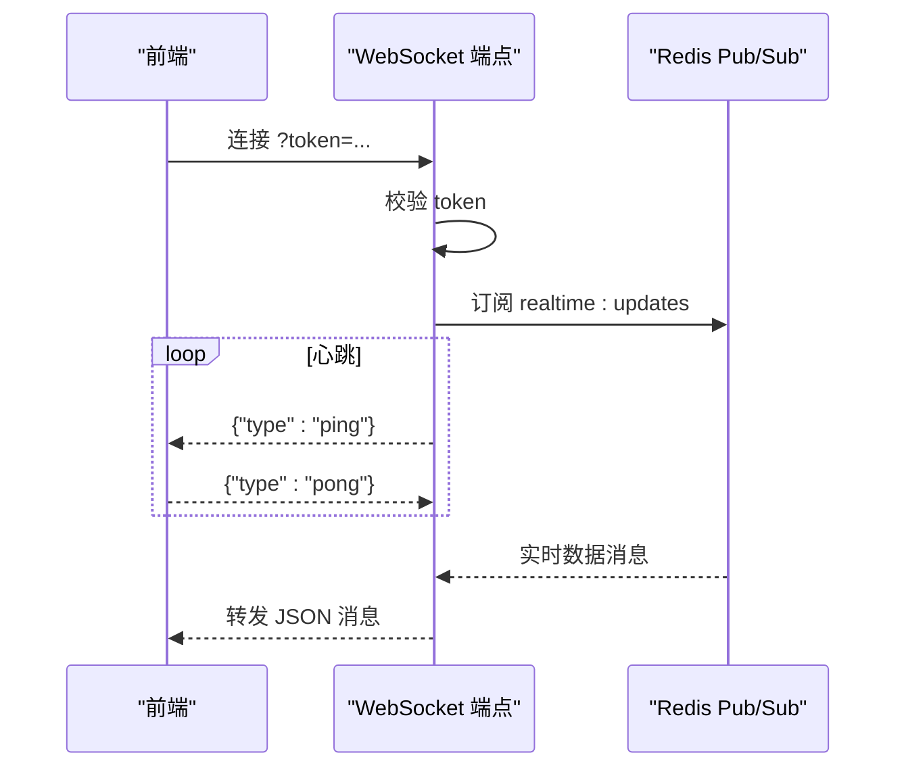

图表来源
- [backend/app/api/v1/endpoints/ws_realtime.py:36-77](file://backend/app/api/v1/endpoints/ws_realtime.py#L36-L77)
- [backend/app/api/v1/endpoints/ws_realtime.py:83-136](file://backend/app/api/v1/endpoints/ws_realtime.py#L83-L136)
- [backend/app/api/v1/endpoints/realtime.py:35-69](file://backend/app/api/v1/endpoints/realtime.py#L35-L69)

章节来源
- [backend/app/api/v1/endpoints/realtime.py:1-69](file://backend/app/api/v1/endpoints/realtime.py#L1-L69)
- [backend/app/api/v1/endpoints/ws_realtime.py:1-136](file://backend/app/api/v1/endpoints/ws_realtime.py#L1-L136)

## 依赖关系分析
- 路由注册：main.py 将各模块 router 挂载至 /api/v1。
- 鉴权与权限：依赖 app.api.deps 提供 get_current_user、require_roles、require_perms。
- 数据访问：依赖 app.core.db 提供 AsyncSessionLocal/get_db。
- 异步任务：诊断、整定、报表等通过 Celery 队列调度。
- 实时通道：RealtimeSubscriber 写入 Redis Pub/Sub，WebSocket 端点订阅并推送。

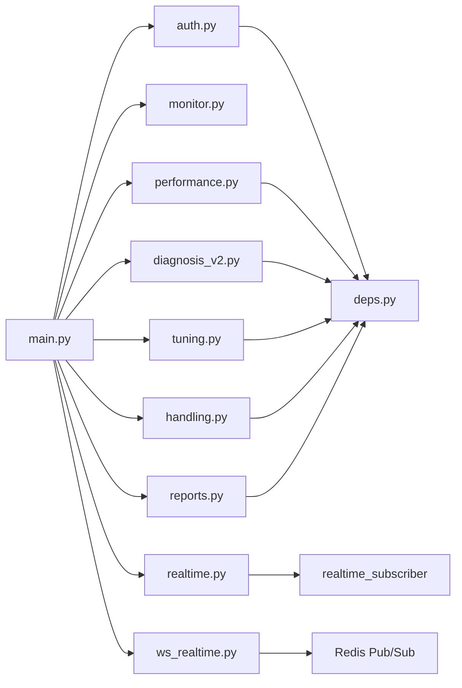

图表来源
- [backend/app/main.py:31-92](file://backend/app/main.py#L31-L92)
- [backend/app/api/v1/endpoints/ws_realtime.py:27-30](file://backend/app/api/v1/endpoints/ws_realtime.py#L27-L30)

章节来源
- [backend/app/main.py:31-92](file://backend/app/main.py#L31-L92)

## 性能与限流
- 速率限制：应用集成 RateLimitMiddleware，用于控制请求频率，防止滥用。
- 缓存：性能看板使用 Redis 缓存（5 分钟），减少数据库压力。
- 异步任务：长耗时操作（诊断、辨识、报表生成、PDF 导出）通过 Celery 异步执行，避免阻塞 HTTP 请求。
- 分页：多数列表接口支持 page/pageSize 或 limit/offset，避免一次性拉取大量数据。

章节来源
- [backend/app/main.py:97-102](file://backend/app/main.py#L97-L102)
- [backend/app/api/v1/endpoints/performance.py:134-164](file://backend/app/api/v1/endpoints/performance.py#L134-L164)

## 故障排查指南
- 常见错误码
  - 400 参数错误：ERR_PARAM、非法枚举、时间窗非法、必填字段缺失。
  - 401/403 认证/权限：未携带 token、token 过期、角色不足。
  - 404 资源不存在：诊断记录、工单、知识库条目等。
  - 429 速率限制：触发 RateLimitMiddleware。
  - 500 内部错误：服务异常、数据库/缓存不可用。
- 诊断流程
  - 检查请求头是否携带 Authorization: Bearer <token>。
  - 检查 query 参数是否符合枚举与格式要求。
  - 查看响应体中的 code/message/data 定位问题。
  - 对异步任务，通过 taskId 轮询状态。
- 实时通道
  - WebSocket 连接失败：检查 token 是否为 access 类型且未被拉黑。
  - 无消息：确认 RealtimeSubscriber 正常写入 Redis Pub/Sub。

章节来源
- [backend/app/api/v1/endpoints/diagnosis_v2.py:111-128](file://backend/app/api/v1/endpoints/diagnosis_v2.py#L111-L128)
- [backend/app/api/v1/endpoints/handling.py:109-127](file://backend/app/api/v1/endpoints/handling.py#L109-L127)
- [backend/app/api/v1/endpoints/ws_realtime.py:36-77](file://backend/app/api/v1/endpoints/ws_realtime.py#L36-L77)

## 结论
本 API 文档覆盖了 CLPM-MVP 后端的核心能力：认证授权、监控、评估、诊断、整定、处置、报表与实时通信。通过统一的 ApiResponse 封装、严格的参数校验与权限控制、异步任务与缓存优化，确保系统在高并发场景下的稳定性与可扩展性。建议在生产环境结合速率限制、监控告警与日志审计进行运维保障。

## 附录：OpenAPI、版本与兼容性
- OpenAPI 文档：应用启动后提供 /docs 与 /redoc 页面，自动生成 OpenAPI 规范。
- 版本管理：所有业务接口以 /api/v1 前缀标识版本，便于后续演进与兼容。
- 向后兼容：新增字段通常以可选形式添加；删除或变更字段需通过版本升级与迁移策略。
- 调试工具：可使用浏览器开发者工具、curl、Postman 或 Swagger UI（/docs）进行调试与测试。

章节来源
- [backend/app/main.py:1-12](file://backend/app/main.py#L1-L12)