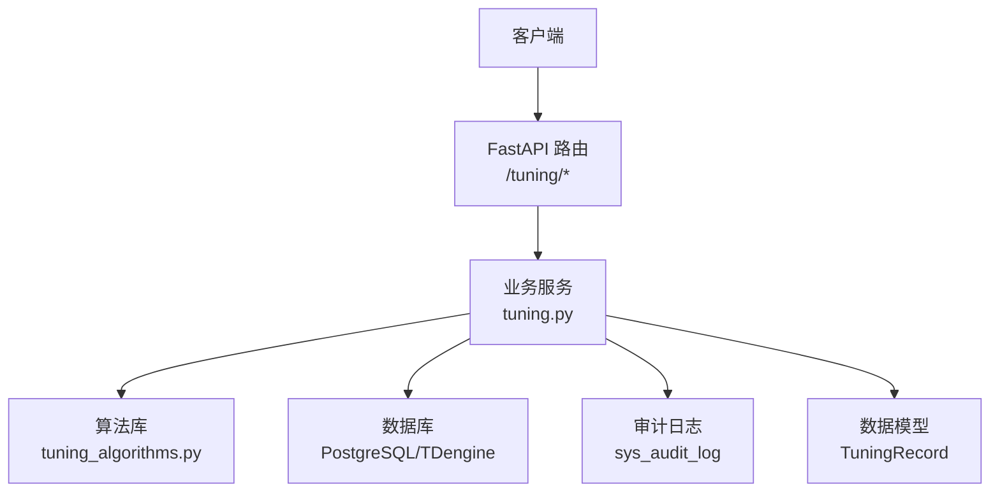
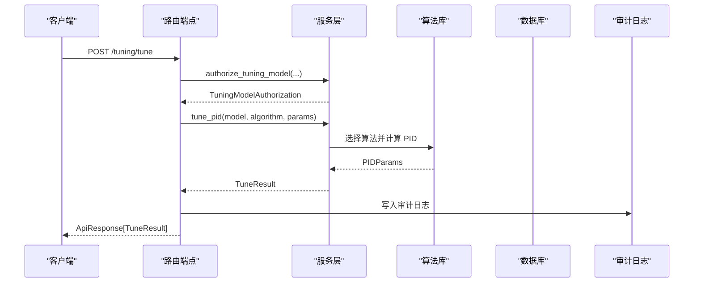
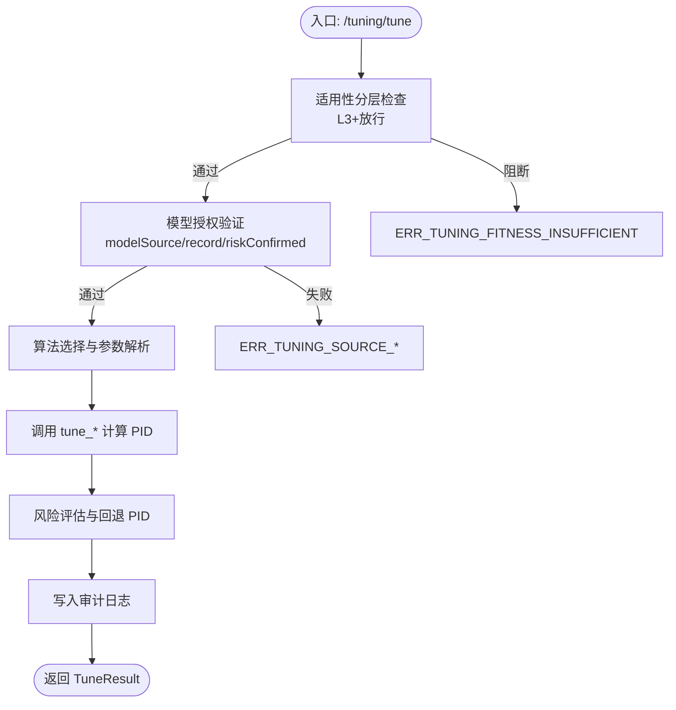
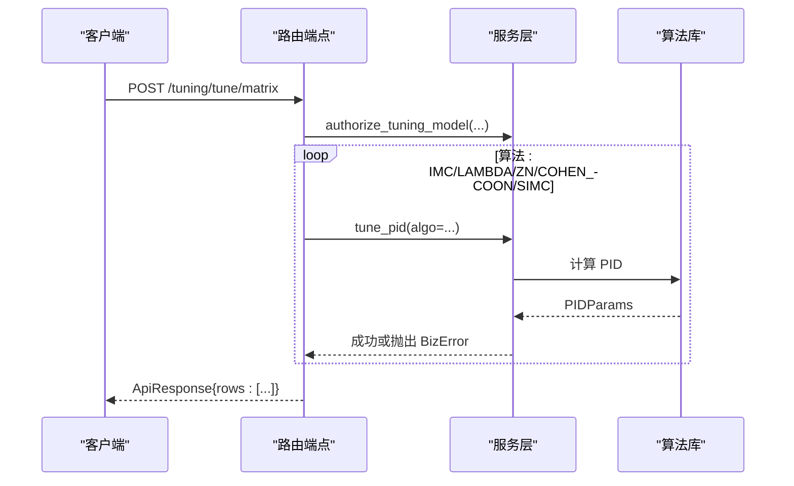
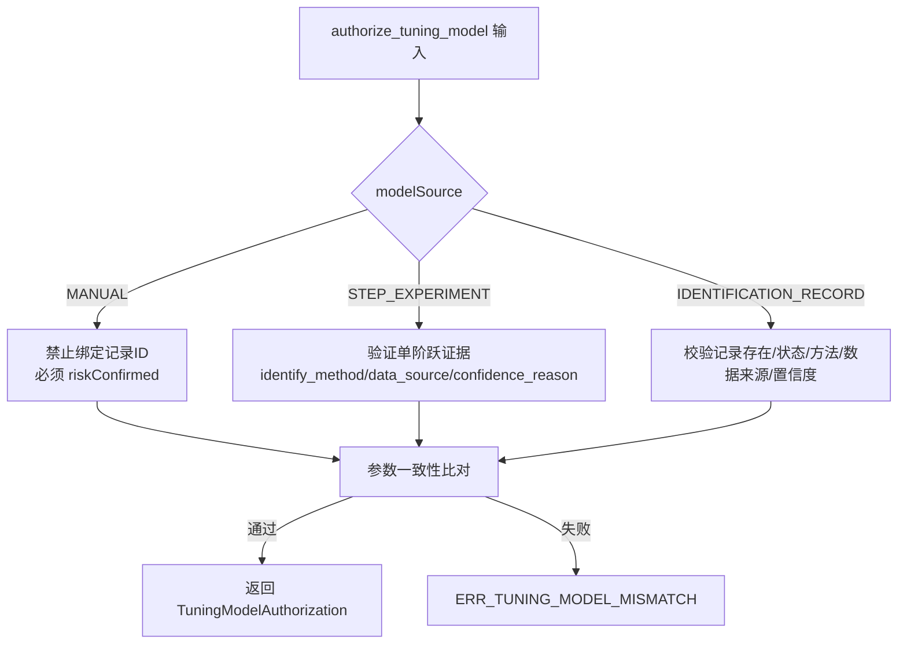
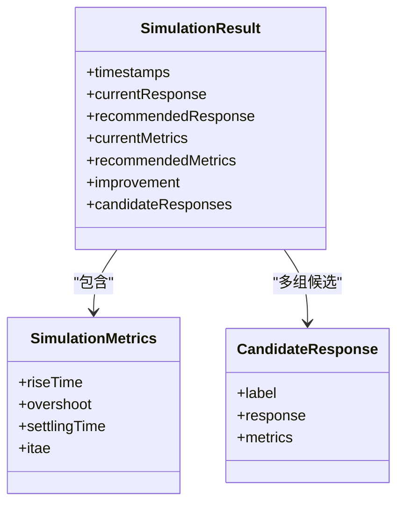
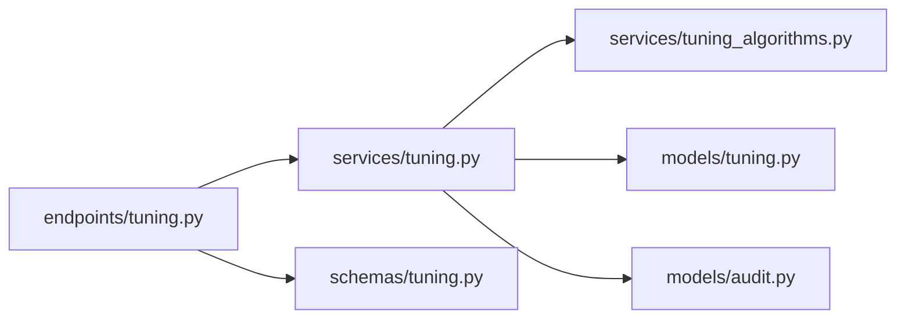

# PID 整定接口

<cite>
**本文引用的文件**
- [backend/app/api/v1/endpoints/tuning.py](file://backend/app/api/v1/endpoints/tuning.py)
- [backend/app/services/tuning.py](file://backend/app/services/tuning.py)
- [backend/app/services/tuning_algorithms.py](file://backend/app/services/tuning_algorithms.py)
- [backend/app/schemas/tuning.py](file://backend/app/schemas/tuning.py)
- [backend/app/models/tuning.py](file://backend/app/models/tuning.py)
- [backend/app/models/audit.py](file://backend/app/models/audit.py)
</cite>

## 目录
1. [简介](#简介)
2. [项目结构](#项目结构)
3. [核心组件](#核心组件)
4. [架构总览](#架构总览)
5. [详细组件分析](#详细组件分析)
6. [依赖关系分析](#依赖关系分析)
7. [性能考量](#性能考量)
8. [故障排查指南](#故障排查指南)
9. [结论](#结论)
10. [附录](#附录)

## 简介
本文件面向 CLPM-MVP 的 PID 整定能力，提供完整的 API 文档与实现说明。内容覆盖：
- 单算法整定接口：IMC/LAMBDA/ZN/COHEN_COON/SIMC 的选择、参数计算逻辑、与当前 PID 的对比分析。
- 全算法矩阵整定接口：多算法并行计算、失败处理机制、结果汇总展示。
- 模型授权验证机制：模型来源确认、风险评估、审计日志记录。
- 适用性分层检查、参数边界验证、异常处理策略。
- 各算法适用场景、参数调优建议、效果评估方法。

## 项目结构
PID 整定相关代码主要分布在以下模块：
- API 层：路由定义、请求校验、权限控制、审计日志写入。
- 服务层：模型辨识、PID 整定、闭环仿真、任务管理、片段预览等。
- 算法层：FOPDT/SOPDT/IPDT 辨识、五种 PID 整定算法、闭环仿真（RK4 + 增量式 PID）。
- 数据模型与 Schema：数据库表结构与 Pydantic 请求/响应契约。

图表来源
- [backend/app/api/v1/endpoints/tuning.py:1-774](file://backend/app/api/v1/endpoints/tuning.py#L1-L774)
- [backend/app/services/tuning.py:1-1785](file://backend/app/services/tuning.py#L1-L1785)
- [backend/app/services/tuning_algorithms.py:1-1083](file://backend/app/services/tuning_algorithms.py#L1-L1083)
- [backend/app/models/tuning.py:1-115](file://backend/app/models/tuning.py#L1-L115)
- [backend/app/models/audit.py:1-39](file://backend/app/models/audit.py#L1-L39)

章节来源
- [backend/app/api/v1/endpoints/tuning.py:1-774](file://backend/app/api/v1/endpoints/tuning.py#L1-L774)
- [backend/app/schemas/tuning.py:1-522](file://backend/app/schemas/tuning.py#L1-L522)

## 核心组件
- 路由端点：
  - GET /tuning/methods：返回可用整定方法与参数元信息。
  - POST /tuning/identify：阶跃实验路径的模型辨识（同步）。
  - POST /tuning/identify/history：历史数据辨识（Phase 2，异步任务）。
  - POST /tuning/identify/segments：可辨识片段预览（激励检测）。
  - POST /tuning/tune：单算法 PID 整定。
  - POST /tuning/tune/matrix：全算法矩阵整定（一次计算 IMC/LAMBDA/ZN/COHEN_COON/SIMC）。
  - POST /tuning/simulate：闭环仿真（支持多 PID 对比）。
  - POST /tuning/compare：多 PID 对比仿真（独立 schema）。
  - GET /tuning/tasks：任务列表（分页+筛选）。
  - GET /tuning/tasks/{taskId}：任务详情。
  - GET /tuning/tasks/{taskId}/status：异步任务进度查询。
  - POST /tuning/tasks/{taskId}/cancel：取消异步任务。
  - POST /tuning/tasks：保存整定任务。
  - GET /tuning/history：整定历史统计。
- 服务函数：
  - authorize_tuning_model：模型来源与可信度门禁。
  - identify_model / identify_model_from_history：模型辨识（阶跃/历史）。
  - tune_pid：按算法计算推荐 PID。
  - run_simulation / _simulate_multi_pid：闭环仿真与多 PID 对比。
  - list_tuning_tasks / get_tuning_task_detail / create_tuning_task：任务管理。
- 算法函数：
  - identify_fopdt / identify_sopdt / identify_ipdt：过程对象辨识。
  - tune_imc / tune_lambda / tune_zn / tune_cohen_coon / tune_simc：PID 整定。
  - simulate_closed_loop：基于 RK4 的闭环仿真与指标提取。

章节来源
- [backend/app/api/v1/endpoints/tuning.py:136-774](file://backend/app/api/v1/endpoints/tuning.py#L136-L774)
- [backend/app/services/tuning.py:104-298](file://backend/app/services/tuning.py#L104-L298)
- [backend/app/services/tuning_algorithms.py:497-653](file://backend/app/services/tuning_algorithms.py#L497-L653)

## 架构总览
整体流程从 API 路由进入，经服务层进行模型授权、辨识、整定与仿真，最终落库并记录审计日志。矩阵整定在单次请求中循环调用单算法整定，失败不阻断其他行。

图表来源
- [backend/app/api/v1/endpoints/tuning.py:269-316](file://backend/app/api/v1/endpoints/tuning.py#L269-L316)
- [backend/app/services/tuning.py:1188-1277](file://backend/app/services/tuning.py#L1188-L1277)
- [backend/app/services/tuning_algorithms.py:497-653](file://backend/app/services/tuning_algorithms.py#L497-L653)
- [backend/app/models/audit.py:15-39](file://backend/app/models/audit.py#L15-L39)

## 详细组件分析

### 单算法整定接口（POST /tuning/tune）
- 功能：基于已授权的模型参数，使用指定算法（IMC/LAMBDA/ZN/COHEN_COON/SIMC）计算推荐 PID，并返回与当前 PID 的对比、风险评估与单位转换说明。
- 关键步骤：
  - 适用性分层检查：通过 fitness 门禁阻止 L0/L1/L2 回路进入整定。
  - 模型授权验证：校验 modelSource、sourceRecordId、riskConfirmed，确保模型来源可信且参数未被替换。
  - 算法选择与参数计算：根据 algorithm 字段调用对应算法函数，解析算法参数（如 lambdaRatio、controllerType、tauCRatio）。
  - 对比分析与风险评估：若传入 currentPid，则生成 rollbackPid；同时评估风险等级（LOW/MEDIUM/HIGH）与因素。
  - 审计日志：记录操作类型、目标、变更后值等。

图表来源
- [backend/app/api/v1/endpoints/tuning.py:97-128](file://backend/app/api/v1/endpoints/tuning.py#L97-L128)
- [backend/app/api/v1/endpoints/tuning.py:269-316](file://backend/app/api/v1/endpoints/tuning.py#L269-L316)
- [backend/app/services/tuning.py:104-298](file://backend/app/services/tuning.py#L104-L298)
- [backend/app/services/tuning.py:1188-1277](file://backend/app/services/tuning.py#L1188-L1277)

章节来源
- [backend/app/api/v1/endpoints/tuning.py:269-316](file://backend/app/api/v1/endpoints/tuning.py#L269-L316)
- [backend/app/services/tuning.py:1188-1277](file://backend/app/services/tuning.py#L1188-L1277)
- [backend/app/schemas/tuning.py:224-268](file://backend/app/schemas/tuning.py#L224-L268)

### 全算法矩阵整定接口（POST /tuning/tune/matrix）
- 功能：一次性对 IMC/LAMBDA/ZN/COHEN_COON/SIMC 五个算法进行整定计算，单行失败不影响其他行，前端可对失败行置灰。
- 关键步骤：
  - 模型授权验证：同单算法接口。
  - 循环调用 tune_pid：依次执行五个算法，捕获 BizError 与通用异常，构造 rows 列表。
  - 结果汇总：返回包含每个算法 ok/result/error 的结构化结果。

图表来源
- [backend/app/api/v1/endpoints/tuning.py:319-358](file://backend/app/api/v1/endpoints/tuning.py#L319-L358)
- [backend/app/services/tuning.py:1188-1277](file://backend/app/services/tuning.py#L1188-L1277)

章节来源
- [backend/app/api/v1/endpoints/tuning.py:319-358](file://backend/app/api/v1/endpoints/tuning.py#L319-L358)
- [backend/app/schemas/tuning.py:270-290](file://backend/app/schemas/tuning.py#L270-L290)

### 模型授权验证机制
- 模型来源确认：
  - MANUAL：不允许绑定 source_record_id，必须显式 riskConfirmed。
  - STEP_EXPERIMENT：需服务端已验证的单阶跃证据（identify_method 以 STEP_ 开头，data_source 为 STEP_EXPERIMENT 或 fallback_step，confidence_reason 含 STEP_VALIDATION_PASSED=TRUE）。
  - IDENTIFICATION_RECORD：需存在且状态为 IDENTIFIED/SIMULATED/COMPLETED，identify_method 为 HISTORICAL_ARX/ARMAX/IV，data_source 为 HISTORY，置信度 A/B 直接放行，C 需 riskConfirmed，D/E/INCONCLUSIVE 拒绝。
- 参数一致性校验：比较请求模型参数与服务端持久化参数（K/tau/theta 或 T1/T2/theta），防止替换辨识结果。
- 风险确认：MANUAL 与 C 级辨识结果需要显式确认风险后方可进入推荐链。
- 审计日志：整定与任务创建时写入 sys_audit_log，记录操作人、操作类型、目标与变更值。

图表来源
- [backend/app/services/tuning.py:104-298](file://backend/app/services/tuning.py#L104-L298)
- [backend/app/models/audit.py:15-39](file://backend/app/models/audit.py#L15-L39)

章节来源
- [backend/app/services/tuning.py:104-298](file://backend/app/services/tuning.py#L104-L298)
- [backend/app/models/audit.py:15-39](file://backend/app/models/audit.py#L15-L39)

### 适用性分层检查与参数边界验证
- 适用性分层检查：
  - 在写端点（识别、整定、仿真）前检查回路 fitness 等级，L0/L1/L2 阻断，要求 L3+。
  - 若 fitness 查询异常或未计算快照，则暂放过。
- 参数边界验证：
  - 阶跃辨识：要求有效 MV/PV 对齐数据点不少于阈值，检测到唯一真实 MV 阶跃，前后平台稳定，PV 响应显著。
  - SOPDT 辨识：非线性最小二乘优化，要求收敛或 SSE 与拟合度门槛满足，参数物理意义合法（T1/T2>0，θ≥0）。
  - 整定算法：K≠0，时间常数与滞后非负，控制器类型合法。
- 异常处理策略：
  - 统一抛出 BizError，携带错误码与消息，便于前端提示与重试。
  - 矩阵整定中单算法异常不阻断其余行，仅标记该行失败。

章节来源
- [backend/app/api/v1/endpoints/tuning.py:97-128](file://backend/app/api/v1/endpoints/tuning.py#L97-L128)
- [backend/app/services/tuning.py:865-992](file://backend/app/services/tuning.py#L865-L992)
- [backend/app/services/tuning_algorithms.py:310-389](file://backend/app/services/tuning_algorithms.py#L310-L389)
- [backend/app/services/tuning.py:1188-1277](file://backend/app/services/tuning.py#L1188-L1277)

### 各算法的适用场景、参数调优建议与效果评估
- IMC（内模控制）：
  - 适用场景：一阶加纯滞后过程，平衡性能与鲁棒性。
  - 参数调优：lambdaRatio 增大更稳健但响应变慢；减小提升响应速度但可能振荡。
  - 效果评估：关注上升时间、超调量、稳定时间与 ITAE 改善幅度。
- LAMBDA（期望闭环时间常数）：
  - 适用场景：一阶自调节过程，PI 控制为主。
  - 参数调优：lambdaRatio 增大降低振荡、提高鲁棒性；过小易振荡。
  - 效果评估：稳定时间缩短与超调量降低为主要改善方向。
- ZN（Ziegler-Nichols 开环反应曲线法）：
  - 适用场景：大多数工业过程，快速整定起点。
  - 参数调优：controllerType 可选 P/PI/PID；PID 通常用于较大滞后系统。
  - 效果评估：对比当前 PID 的 ITAE 与超调量变化。
- COHEN_COON（大滞后系统整定）：
  - 适用场景：θ/τ > 0.5 的大滞后系统，优于 Z-N。
  - 参数调优：controllerType 影响积分与微分作用强度；注意 θ/τ 范围外精度下降。
  - 效果评估：稳定时间与超调量的权衡。
- SIMC（简化 IMC）：
  - 适用场景：工程实用性强，FOPDT 下 PI 控制。
  - 参数调优：tauCRatio 增大提高鲁棒性；过小可能振荡。
  - 效果评估：稳定时间缩短与超调量降低为主要改善方向。

章节来源
- [backend/app/services/tuning_algorithms.py:497-653](file://backend/app/services/tuning_algorithms.py#L497-L653)
- [backend/app/services/tuning_algorithms.py:1006-1062](file://backend/app/services/tuning_algorithms.py#L1006-L1062)
- [backend/app/services/tuning_algorithms.py:920-988](file://backend/app/services/tuning_algorithms.py#L920-L988)

### 闭环仿真与多 PID 对比
- 闭环仿真：
  - 使用 RK4 数值积分与增量式 PID，支持 FOPDT/SOPDT 被控对象。
  - 自动细分子步以保证稳定性（子步长 ≤ 最快时间常数/4）。
  - 输出 timestamps/currentResponse/recommendedResponse/currentMetrics/recommendedMetrics/improvement。
- 多 PID 对比：
  - compare 端点要求至少 2 组候选 PID，currentPid 可选作为基线。
  - 返回 candidateResponses，每组含 label/response/metrics。

图表来源
- [backend/app/schemas/tuning.py:347-375](file://backend/app/schemas/tuning.py#L347-L375)
- [backend/app/services/tuning_algorithms.py:660-749](file://backend/app/services/tuning_algorithms.py#L660-L749)
- [backend/app/services/tuning_algorithms.py:920-988](file://backend/app/services/tuning_algorithms.py#L920-L988)

章节来源
- [backend/app/api/v1/endpoints/tuning.py:366-448](file://backend/app/api/v1/endpoints/tuning.py#L366-L448)
- [backend/app/services/tuning.py:1370-1486](file://backend/app/services/tuning.py#L1370-L1486)
- [backend/app/services/tuning_algorithms.py:660-988](file://backend/app/services/tuning_algorithms.py#L660-L988)

## 依赖关系分析
- 路由依赖服务层：所有 /tuning/* 路由均调用 services.tuning 中的函数完成业务逻辑。
- 服务层依赖算法库：辨识与整定算法集中在 tuning_algorithms.py，仿真与指标提取亦在此。
- 数据模型与 Schema：TuningRecord 存储整定任务与辨识元数据；Pydantic Schema 约束请求/响应格式。
- 审计日志：SysAuditLog 记录关键操作的审计信息。

图表来源
- [backend/app/api/v1/endpoints/tuning.py:1-774](file://backend/app/api/v1/endpoints/tuning.py#L1-L774)
- [backend/app/services/tuning.py:1-1785](file://backend/app/services/tuning.py#L1-L1785)
- [backend/app/services/tuning_algorithms.py:1-1083](file://backend/app/services/tuning_algorithms.py#L1-L1083)
- [backend/app/models/tuning.py:1-115](file://backend/app/models/tuning.py#L1-L115)
- [backend/app/models/audit.py:1-39](file://backend/app/models/audit.py#L1-L39)
- [backend/app/schemas/tuning.py:1-522](file://backend/app/schemas/tuning.py#L1-L522)

章节来源
- [backend/app/api/v1/endpoints/tuning.py:1-774](file://backend/app/api/v1/endpoints/tuning.py#L1-L774)
- [backend/app/services/tuning.py:1-1785](file://backend/app/services/tuning.py#L1-L1785)

## 性能考量
- 仿真步长自适应细分：当 sim_step 超过最快时间常数的 1/4 时，自动细分为多个子步，保证 RK4 精度与稳定性。
- 数据预处理与重采样：SP/MODE 信号按 PVOP 网格重采样，避免乱序与缺失导致的误差。
- 矩阵整定串行计算：当前实现为顺序调用五个算法，若需更高吞吐可考虑并发（需注意资源与一致性）。
- 数据库查询优化：任务列表查询使用分页与条件过滤，减少不必要的数据传输。

[本节为通用指导，不直接分析具体文件]

## 故障排查指南
- 常见错误码与原因：
  - ERR_TUNING_FITNESS_INSUFFICIENT：回路适用性分层不足（L0/L1/L2），需先处理控制状态或诊断后再尝试整定。
  - ERR_TUNING_SOURCE_REQUIRED/INVALID：模型来源缺失或不支持，需明确 modelSource 并提供可验证凭据。
  - ERR_TUNING_SOURCE_NOT_FOUND/UNVERIFIED：模型记录不存在或未完成辨识验证。
  - ERR_TUNING_LOOP_MISMATCH：请求回路与模型来源记录的回路不一致。
  - ERR_TUNING_MODEL_MISMATCH：请求模型参数与服务端辨识记录不一致。
  - ERR_TUNING_THETA_HEURISTIC_BLOCKED：纯滞后参数来自启发估计，不得进入推荐链。
  - ERR_TUNING_STEP_EVIDENCE_REQUIRED：阶跃实验缺少服务端已验证的单阶跃证据。
  - ERR_TUNING_DATA_INSUFFICIENT：有效数据点不足或阶跃无效。
  - ERR_INVALID_ALGORITHM：不支持的整定算法。
- 排查步骤：
  - 检查 fitness 等级与回路状态。
  - 确认 modelSource 与 sourceRecordId 正确，且记录状态已完成辨识。
  - 核对模型参数是否与服务端一致，避免替换。
  - 查看辨识结果与置信度等级，必要时重新辨识或调整窗口。
  - 对于矩阵整定，定位失败行并单独调试该算法。

章节来源
- [backend/app/api/v1/endpoints/tuning.py:97-128](file://backend/app/api/v1/endpoints/tuning.py#L97-L128)
- [backend/app/services/tuning.py:104-298](file://backend/app/services/tuning.py#L104-L298)
- [backend/app/services/tuning.py:865-992](file://backend/app/services/tuning.py#L865-L992)
- [backend/app/services/tuning.py:1188-1277](file://backend/app/services/tuning.py#L1188-L1277)

## 结论
CLPM-MVP 的 PID 整定功能提供了完整的单算法与矩阵整定接口，具备严格的模型授权验证、适用性分层检查、参数边界验证与异常处理策略。通过闭环仿真与多 PID 对比，用户可直观评估不同算法的效果并进行调优。建议在实施过程中结合风险评估与审计日志，确保变更可控与可追溯。

[本节为总结性内容，不直接分析具体文件]

## 附录
- API 清单与请求/响应示例请参考 schemas 定义与路由注释。
- 算法数学公式与实现细节参见 tuning_algorithms.py 中的函数注释。
- 数据库表结构与约束参见 models/tuning.py。

[本节为补充信息，不直接分析具体文件]