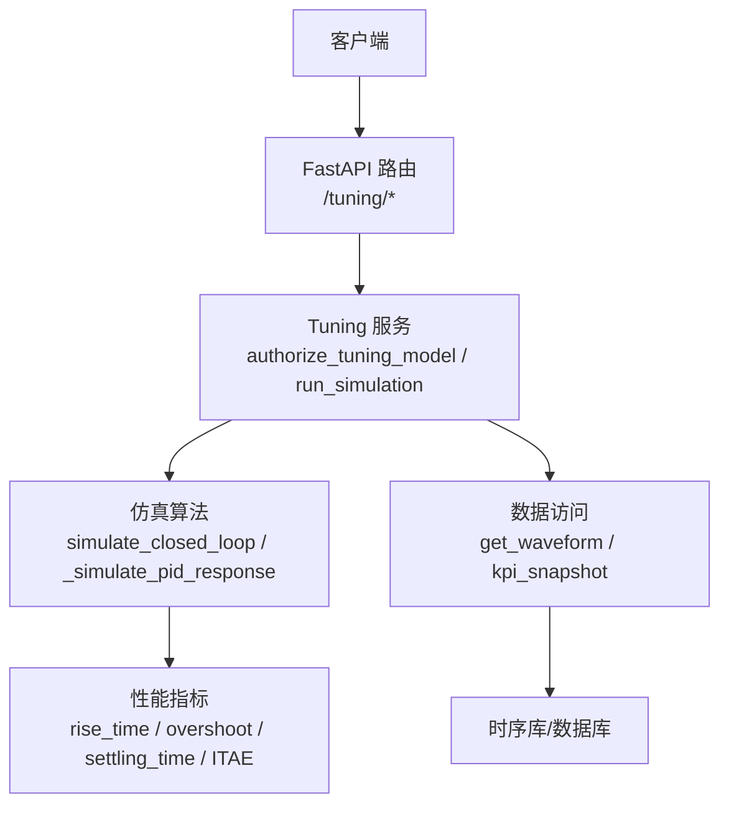
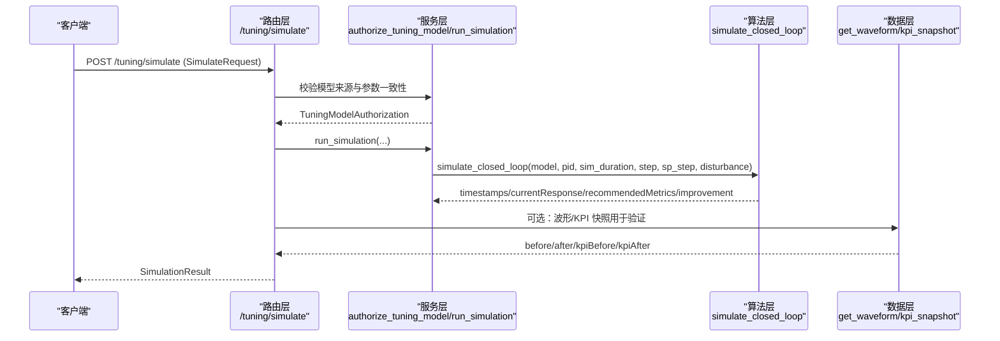
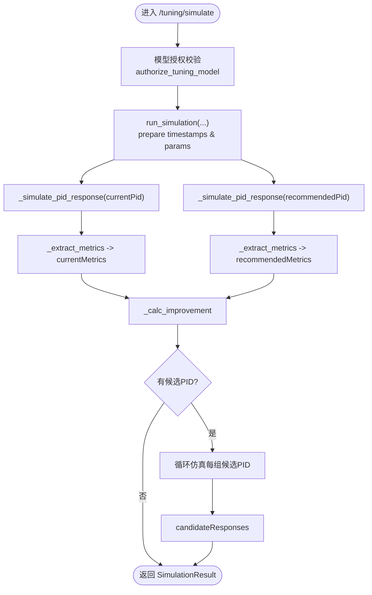
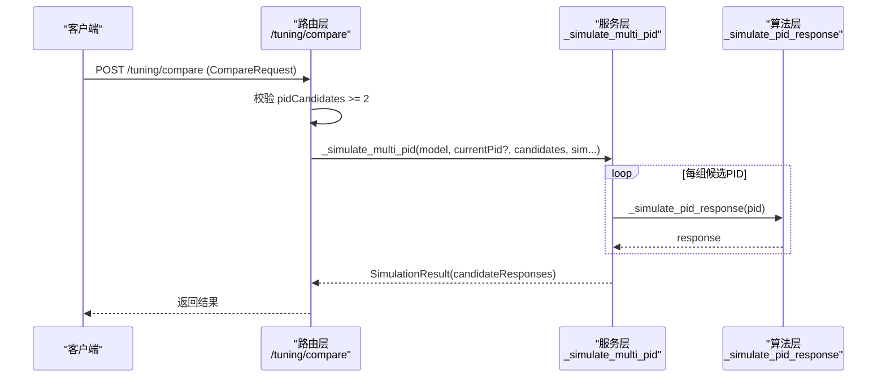
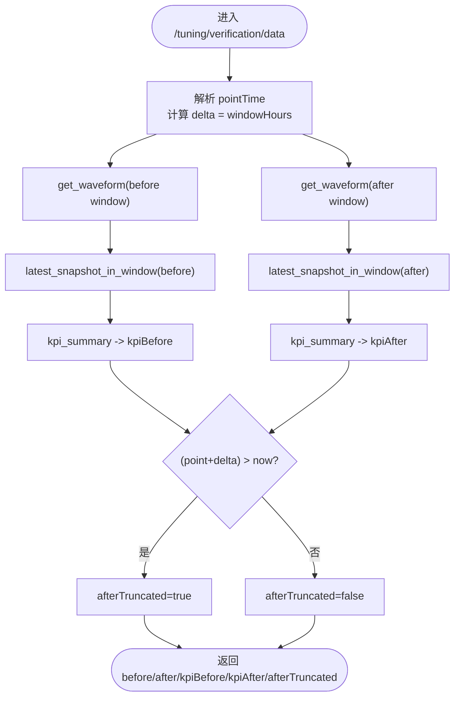
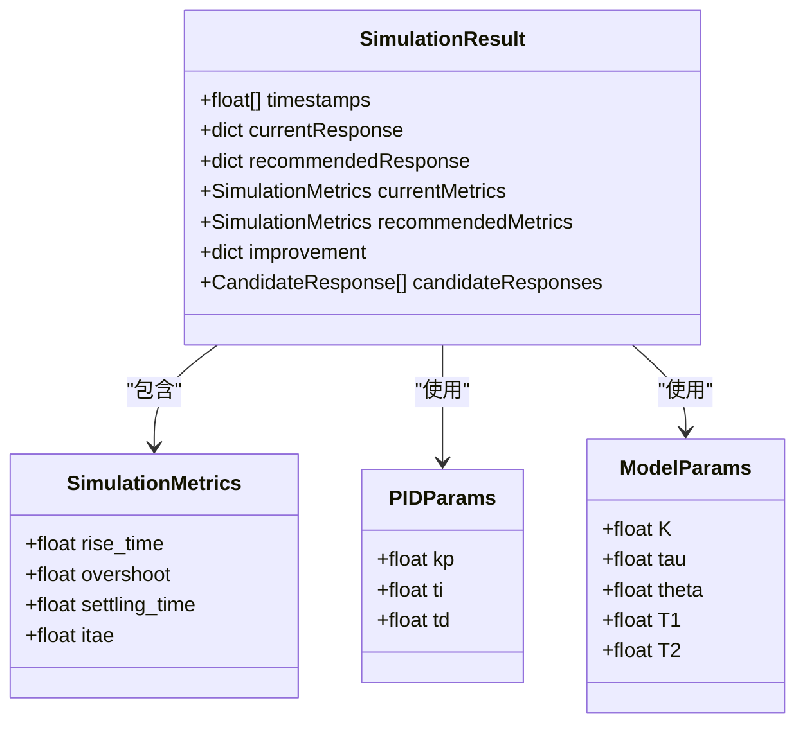
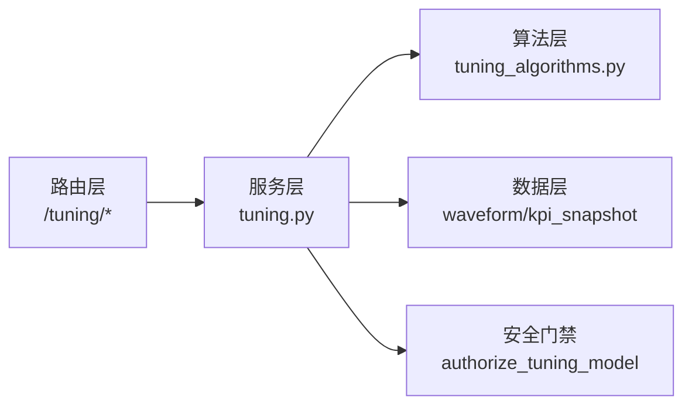

# 仿真对比接口

<cite>
**本文引用的文件**
- [backend/app/api/v1/endpoints/tuning.py](file://backend/app/api/v1/endpoints/tuning.py)
- [backend/app/services/tuning_algorithms.py](file://backend/app/services/tuning_algorithms.py)
- [backend/app/schemas/tuning.py](file://backend/app/schemas/tuning.py)
- [backend/app/services/tuning.py](file://backend/app/services/tuning.py)
- [backend/app/api/v1/endpoints/handling.py](file://backend/app/api/v1/endpoints/handling.py)
- [backend/app/services/kpi_snapshot.py](file://backend/app/services/kpi_snapshot.py)
- [backend/app/services/waveform.py](file://backend/app/services/waveform.py)
</cite>

## 目录
1. [简介](#简介)
2. [项目结构](#项目结构)
3. [核心组件](#核心组件)
4. [架构总览](#架构总览)
5. [详细组件分析](#详细组件分析)
6. [依赖关系分析](#依赖关系分析)
7. [性能考虑](#性能考虑)
8. [故障排查指南](#故障排查指南)
9. [结论](#结论)
10. [附录：API 契约与参数说明](#附录api-契约与参数说明)

## 简介
本文件面向 CLPM-MVP 闭环仿真功能，提供“仿真对比接口”的完整 API 文档。内容覆盖：
- 单 PID 仿真接口：阶跃响应模拟、扰动类型设置、仿真参数配置、响应曲线生成
- 多 PID 对比仿真接口：候选 PID 参数对比、性能指标计算、可视化数据输出
- 效果验证数据接口：前后窗口数据获取、KPI 快照对比、实时数据截断处理
- 仿真模型选择、数值计算方法、性能优化策略
- 仿真结果解读指南、参数调优建议、故障排查方法

## 项目结构
后端通过 FastAPI 暴露整定与仿真相关端点，核心链路如下：
- 路由层：/tuning/simulate、/tuning/compare、/tuning/verification/data
- 服务层：模型授权校验、历史/阶跃辨识、PID 整定、闭环仿真
- 算法层：FOPDT/SOPDT/IPDT 模型、RK4 积分、增量式 PID、性能指标计算
- 数据层：波形拉取（SP/PV/OP）、KPI 快照查询

图表来源
- [backend/app/api/v1/endpoints/tuning.py:366-448](file://backend/app/api/v1/endpoints/tuning.py#L366-L448)
- [backend/app/services/tuning.py:104-297](file://backend/app/services/tuning.py#L104-L297)
- [backend/app/services/tuning_algorithms.py:660-749](file://backend/app/services/tuning_algorithms.py#L660-L749)

章节来源
- [backend/app/api/v1/endpoints/tuning.py:1-17](file://backend/app/api/v1/endpoints/tuning.py#L1-L17)
- [backend/app/schemas/tuning.py:297-375](file://backend/app/schemas/tuning.py#L297-L375)

## 核心组件
- 路由端点
  - POST /tuning/simulate：单 PID 对比（当前 vs 推荐），支持多候选 PID
  - POST /tuning/compare：多 PID 对比（≥2 组候选）
  - GET /tuning/verification/data：效果验证前后窗数据 + KPI 快照
- 服务逻辑
  - authorize_tuning_model：模型来源可信度门禁（IDENTIFICATION_RECORD/STEP_EXPERIMENT/MANUAL）
  - run_simulation/_simulate_multi_pid：封装仿真调用与候选集处理
- 算法实现
  - simulate_closed_loop：闭环仿真入口（RK4 + 增量式 PID）
  - _simulate_pid_response：单组 PID 阶跃响应仿真（FOPDT/SOPDT）
  - _extract_metrics/_calc_improvement：性能指标与改善幅度计算
- 数据访问
  - get_waveform：拉取 SP/PV/OP 波形
  - latest_snapshot_in_window/kpi_summary：窗口内最新 KPI 快照摘要

章节来源
- [backend/app/api/v1/endpoints/tuning.py:366-509](file://backend/app/api/v1/endpoints/tuning.py#L366-L509)
- [backend/app/services/tuning.py:104-297](file://backend/app/services/tuning.py#L104-L297)
- [backend/app/services/tuning_algorithms.py:660-749](file://backend/app/services/tuning_algorithms.py#L660-L749)
- [backend/app/api/v1/endpoints/handling.py:303-339](file://backend/app/api/v1/endpoints/handling.py#L303-L339)

## 架构总览
下图展示从请求到响应的关键调用链，包括模型授权、仿真执行、指标计算与数据拉取。

图表来源
- [backend/app/api/v1/endpoints/tuning.py:366-402](file://backend/app/api/v1/endpoints/tuning.py#L366-L402)
- [backend/app/services/tuning.py:104-297](file://backend/app/services/tuning.py#L104-L297)
- [backend/app/services/tuning_algorithms.py:660-749](file://backend/app/services/tuning_algorithms.py#L660-L749)

## 详细组件分析

### 单 PID 仿真接口（POST /tuning/simulate）
- 功能
  - 基于已授权的模型（FOPDT/SOPDT/IPDT）与当前/推荐 PID 进行闭环仿真
  - 支持多组候选 PID（pidCandidates），返回 candidateResponses
  - 输出响应曲线与性能指标，并计算改善幅度
- 输入（SimulateRequest）
  - modelType/modelParams：模型类型与参数（FOPDT 含 K/tau/theta；SOPDT 含 K/T1/T2/theta）
  - currentPid/recommendedPid：当前与推荐 PID（kp/ti/td）
  - pidCandidates：可选的多组候选 PID（label + kp/ti/td）
  - simDuration/simStep/setpointStep/disturbanceType：仿真时长、步长、设定值阶跃幅值、扰动类型（step/none）
  - loopId/sourceRecordId/modelSource/riskConfirmed：模型来源与风险确认
- 输出（SimulationResult）
  - timestamps/currentResponse/recommendedResponse
  - currentMetrics/recommendedMetrics/improvement
  - candidateResponses（当传入 pidCandidates 时）
- 关键流程
  - 路由层解析请求并调用 authorize_tuning_model 完成模型来源校验
  - 服务层将 pidCandidates 转为 dict 列表透传至 run_simulation
  - 算法层执行 simulate_closed_loop，内部对每组 PID 调用 _simulate_pid_response
  - 指标提取与改善幅度计算由 _extract_metrics/_calc_improvement 完成

图表来源
- [backend/app/api/v1/endpoints/tuning.py:366-402](file://backend/app/api/v1/endpoints/tuning.py#L366-L402)
- [backend/app/services/tuning_algorithms.py:660-749](file://backend/app/services/tuning_algorithms.py#L660-L749)

章节来源
- [backend/app/api/v1/endpoints/tuning.py:366-402](file://backend/app/api/v1/endpoints/tuning.py#L366-L402)
- [backend/app/schemas/tuning.py:297-375](file://backend/app/schemas/tuning.py#L297-L375)
- [backend/app/services/tuning_algorithms.py:660-749](file://backend/app/services/tuning_algorithms.py#L660-L749)

### 多 PID 对比仿真接口（POST /tuning/compare）
- 功能
  - 独立 schema CompareRequest，要求至少 2 组候选 PID
  - 可选 currentPid 作为基线对比
  - 返回 candidateResponses（每组 PID 的响应曲线与指标）
- 输入（CompareRequest）
  - modelType/modelParams：模型类型与参数
  - currentPid：可选基线 PID
  - pidCandidates：必填且 ≥2 组（label + kp/ti/td）
  - simDuration/simStep/setpointStep：仿真参数
  - loopId/sourceRecordId/modelSource/riskConfirmed：模型来源与风险确认
- 输出（SimulationResult）
  - candidateResponses：多组候选 PID 的 response 与 metrics
  - 若提供 currentPid，可包含 currentResponse/currentMetrics 等
- 关键流程
  - 路由层校验 pidCandidates 数量
  - 服务层调用 _simulate_multi_pid（内部复用仿真逻辑）
  - 算法层批量仿真并计算指标

图表来源
- [backend/app/api/v1/endpoints/tuning.py:405-448](file://backend/app/api/v1/endpoints/tuning.py#L405-L448)
- [backend/app/schemas/tuning.py:320-375](file://backend/app/schemas/tuning.py#L320-L375)

章节来源
- [backend/app/api/v1/endpoints/tuning.py:405-448](file://backend/app/api/v1/endpoints/tuning.py#L405-L448)
- [backend/app/schemas/tuning.py:320-375](file://backend/app/schemas/tuning.py#L320-L375)

### 效果验证数据接口（GET /tuning/verification/data）
- 功能
  - 获取指定回路在 pointTime 前后 windowHours 的 SP/PV/OP 波形
  - 返回窗口内最新 KPI 快照摘要（kpiBefore/kpiAfter）
  - afterTruncated 指示后窗是否被当前时刻截断（前端标注“数据截至当前时刻”）
- 输入
  - loopId：回路 ID
  - pointTime：ISO 8601 时间（naive UTC 或带时区）
  - windowHours：仅支持 1/2/4/8/24/72/168
- 输出
  - before/after：波形数据
  - kpiBefore/kpiAfter：KPI 快照摘要（无快照为 null）
  - afterTruncated：布尔值，表示后窗是否超出当前时刻
- 关键流程
  - 解析 pointTime，计算前后窗时间范围
  - 调用 get_waveform 拉取波形
  - 调用 latest_snapshot_in_window 获取窗口内最新 KPI 快照
  - 比较 pointTime+window 与当前时间，标记 afterTruncated

图表来源
- [backend/app/api/v1/endpoints/tuning.py:471-509](file://backend/app/api/v1/endpoints/tuning.py#L471-L509)
- [backend/app/api/v1/endpoints/handling.py:303-339](file://backend/app/api/v1/endpoints/handling.py#L303-L339)

章节来源
- [backend/app/api/v1/endpoints/tuning.py:471-509](file://backend/app/api/v1/endpoints/tuning.py#L471-L509)
- [backend/app/api/v1/endpoints/handling.py:303-339](file://backend/app/api/v1/endpoints/handling.py#L303-L339)

### 仿真模型选择与数值计算方法
- 模型类型
  - FOPDT：一阶加纯滞后 G(s)=K·exp(-θs)/(τs+1)
  - SOPDT：二阶加纯滞后 G(s)=K·exp(-θs)/((T1·s+1)(T2·s+1))
  - IPDT：积分过程 G(s)=K·exp(-θs)/s
- 数值方法
  - 闭环仿真使用四阶 Runge-Kutta（RK4）积分
  - PID 采用增量式实现，消除设定值阶跃时的微分冲击（derivative kick）
  - 支持 FOPDT/SOPDT 两种对象模型的解析解/递推计算
- 性能指标
  - 上升时间（rise_time）、超调量（overshoot）、稳定时间（settling_time）、ITAE 积分误差
  - 改善幅度通过当前与推荐指标的百分比变化计算

图表来源
- [backend/app/schemas/tuning.py:207-375](file://backend/app/schemas/tuning.py#L207-L375)
- [backend/app/services/tuning_algorithms.py:61-78](file://backend/app/services/tuning_algorithms.py#L61-L78)

章节来源
- [backend/app/services/tuning_algorithms.py:660-749](file://backend/app/services/tuning_algorithms.py#L660-L749)
- [backend/app/services/tuning_algorithms.py:957-998](file://backend/app/services/tuning_algorithms.py#L957-L998)

### 性能优化策略
- 数据预处理与重采样
  - 通过 DataPlanner 获取 PV/OP/SP 时序，并进行线性插值与零阶保持重采样，确保网格对齐
  - MODE 信号采用零阶保持，避免状态码插值产生无意义中间值
- 仿真效率
  - 使用 RK4 与增量式 PID，减少数值误差与计算开销
  - 支持多候选 PID 并行仿真，批量计算指标
- 缓存与索引
  - 利用 L1DataBlockCache 与 Redis 缓存提升数据访问效率
  - KPI 快照按窗口查询，限制返回最新一条记录

章节来源
- [backend/app/services/tuning.py:305-437](file://backend/app/services/tuning.py#L305-L437)
- [backend/app/services/tuning.py:505-642](file://backend/app/services/tuning.py#L505-L642)

## 依赖关系分析
- 路由层依赖服务层进行模型授权与仿真编排
- 服务层依赖算法层执行具体仿真与指标计算
- 数据层依赖波形与 KPI 快照服务，支撑效果验证
- 安全门禁：authorize_tuning_model 强制模型来源可信度校验，防止伪造或降级

图表来源
- [backend/app/api/v1/endpoints/tuning.py:366-448](file://backend/app/api/v1/endpoints/tuning.py#L366-L448)
- [backend/app/services/tuning.py:104-297](file://backend/app/services/tuning.py#L104-L297)

章节来源
- [backend/app/api/v1/endpoints/tuning.py:366-448](file://backend/app/api/v1/endpoints/tuning.py#L366-L448)
- [backend/app/services/tuning.py:104-297](file://backend/app/services/tuning.py#L104-L297)

## 性能考虑
- 仿真步长与时长
  - simStep 越小，精度越高但计算量越大；建议根据系统动态特性选择合理步长（如 0.1~1s）
  - simDuration 应覆盖主要动态过程（如上升、超调、稳定阶段）
- 数据窗口大小
  - windowHours 影响波形与快照数据量；大窗口可能带来 I/O 压力
- 指标计算复杂度
  - ITAE 为 O(n)，rise/settling 检测需遍历响应序列；候选 PID 越多，计算量线性增长
- 缓存与并发
  - 利用 DataPlanner 缓存与 Redis 降低重复查询开销
  - 多候选 PID 仿真可考虑异步化或批处理

[本节为通用性能指导，不直接分析具体文件]

## 故障排查指南
- 模型来源错误
  - ERR_TUNING_SOURCE_REQUIRED：未提供 sourceRecordId 或 modelSource
  - ERR_TUNING_SOURCE_INVALID：不支持的来源或来源与记录不一致
  - ERR_TUNING_MODEL_MISMATCH：请求模型参数与服务端记录不一致
- 数据不足或无效
  - ERR_TUNING_DATA_INSUFFICIENT：预处理后数据点不足（PV/OP < 50）
  - 波形为空：检查 loopId 与时间窗口是否正确
- 仿真异常
  - 参数越界：tau<=0、theta<0 会被修正；若仍异常，检查模型参数合理性
  - 指标缺失：rise/settling 可能为 None，需检查响应是否达到稳态
- 效果验证问题
  - afterTruncated=true：后窗超出当前时刻，属正常现象
  - kpiBefore/kpiAfter=null：窗口内无有效快照，需检查 KPI 计算任务是否运行

章节来源
- [backend/app/services/tuning.py:104-297](file://backend/app/services/tuning.py#L104-L297)
- [backend/app/api/v1/endpoints/tuning.py:471-509](file://backend/app/api/v1/endpoints/tuning.py#L471-L509)

## 结论
本接口提供了完整的闭环仿真能力，支持单 PID 与多 PID 对比，结合模型授权与安全门禁，确保仿真结果的可靠性与可追溯性。通过合理的仿真参数配置与性能优化策略，可有效评估 PID 整定效果，并为工程实施提供决策依据。

[本节为总结性内容，不直接分析具体文件]

## 附录：API 契约与参数说明

### POST /tuning/simulate
- 请求体（SimulateRequest）
  - modelType：FOPDT/SOPDT/IPDT
  - modelParams：K/tau/theta 或 K/T1/T2/theta
  - currentPid/recommendedPid：kp/ti/td
  - pidCandidates：可选，多组候选 PID（label + kp/ti/td）
  - simDuration/simStep/setpointStep/disturbanceType：仿真时长、步长、阶跃幅值、扰动类型（step/none）
  - loopId/sourceRecordId/modelSource/riskConfirmed：模型来源与风险确认
- 响应体（SimulationResult）
  - timestamps/currentResponse/recommendedResponse
  - currentMetrics/recommendedMetrics/improvement
  - candidateResponses（当传入 pidCandidates 时）

章节来源
- [backend/app/schemas/tuning.py:297-375](file://backend/app/schemas/tuning.py#L297-L375)
- [backend/app/api/v1/endpoints/tuning.py:366-402](file://backend/app/api/v1/endpoints/tuning.py#L366-L402)

### POST /tuning/compare
- 请求体（CompareRequest）
  - modelType/modelParams：模型类型与参数
  - currentPid：可选基线 PID
  - pidCandidates：必填且 ≥2 组（label + kp/ti/td）
  - simDuration/simStep/setpointStep：仿真参数
  - loopId/sourceRecordId/modelSource/riskConfirmed：模型来源与风险确认
- 响应体（SimulationResult）
  - candidateResponses：多组候选 PID 的 response 与 metrics

章节来源
- [backend/app/schemas/tuning.py:320-375](file://backend/app/schemas/tuning.py#L320-L375)
- [backend/app/api/v1/endpoints/tuning.py:405-448](file://backend/app/api/v1/endpoints/tuning.py#L405-L448)

### GET /tuning/verification/data
- 查询参数
  - loopId：回路 ID
  - pointTime：ISO 8601 时间
  - windowHours：1/2/4/8/24/72/168
- 响应体
  - before/after：波形数据
  - kpiBefore/kpiAfter：KPI 快照摘要
  - afterTruncated：布尔值，表示后窗是否被截断

章节来源
- [backend/app/api/v1/endpoints/tuning.py:471-509](file://backend/app/api/v1/endpoints/tuning.py#L471-L509)
- [backend/app/api/v1/endpoints/handling.py:303-339](file://backend/app/api/v1/endpoints/handling.py#L303-L339)