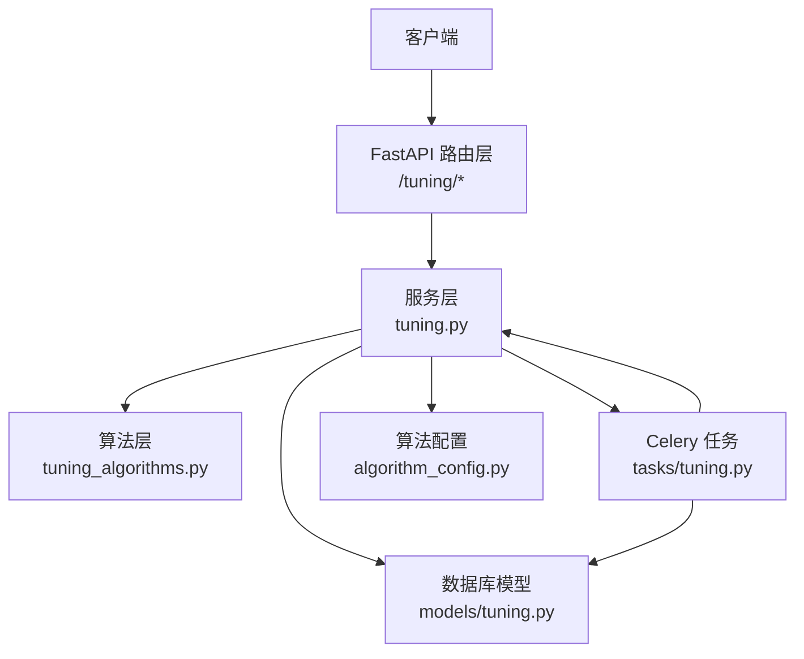
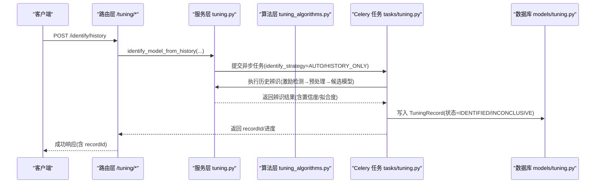
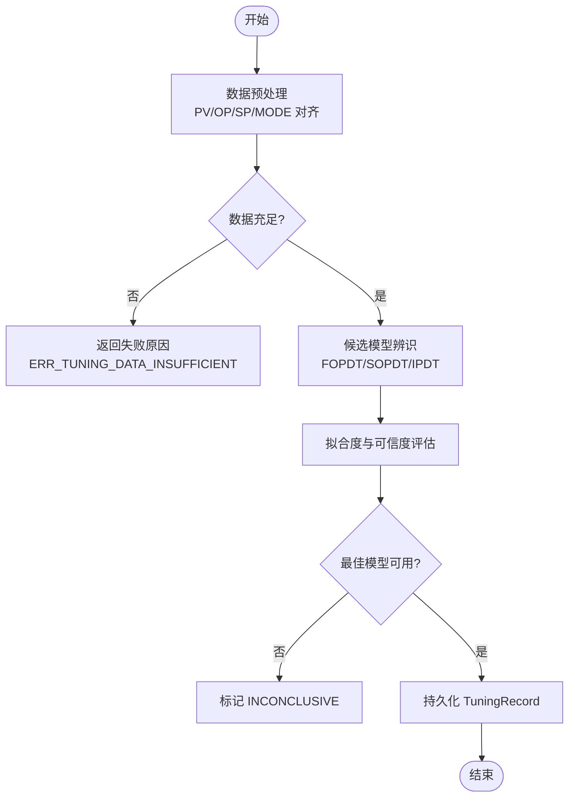
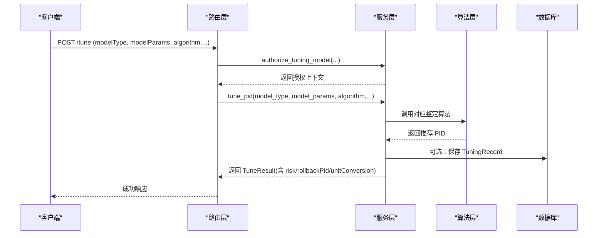
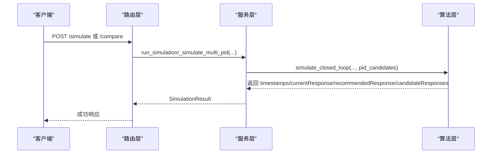
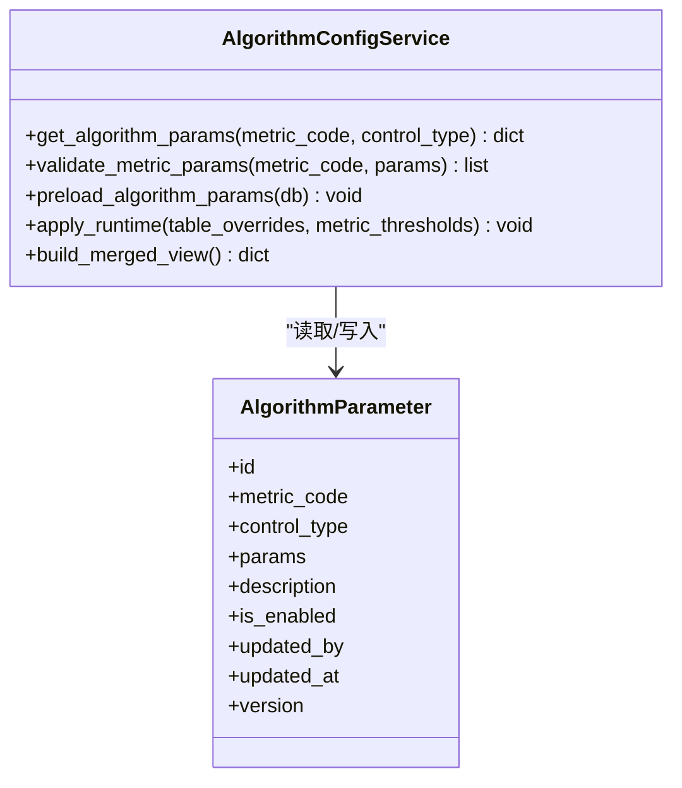
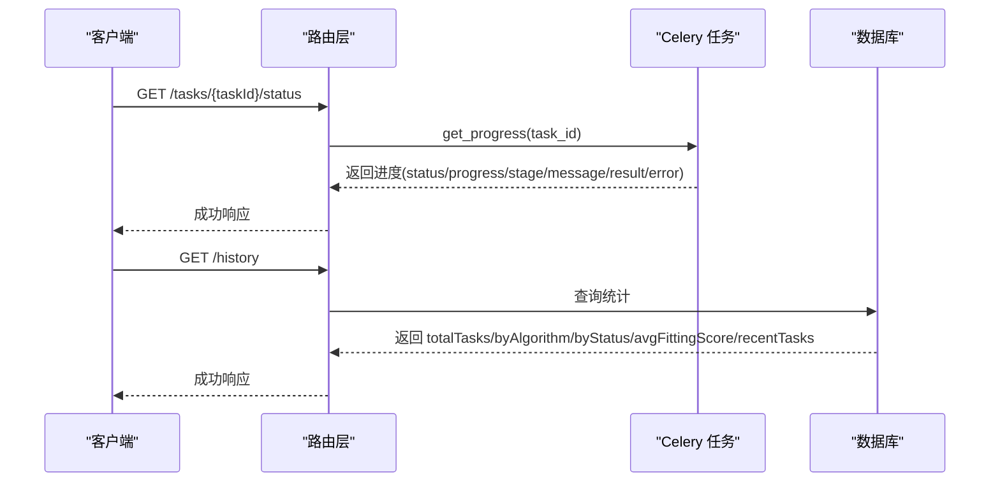
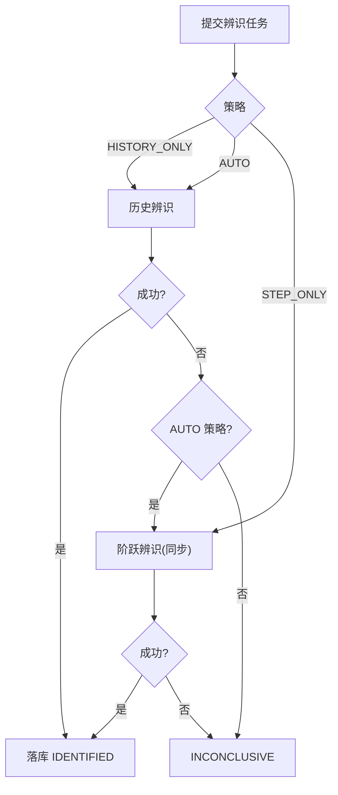
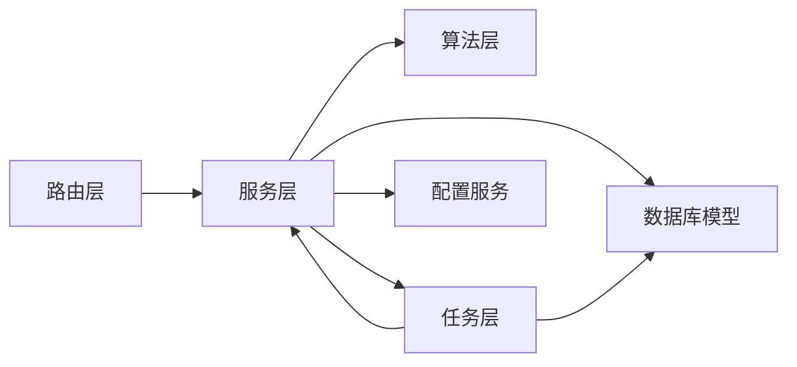

# 回路整定接口

<cite>
**本文引用的文件**
- [backend/app/api/v1/endpoints/tuning.py](file://backend/app/api/v1/endpoints/tuning.py)
- [backend/app/schemas/tuning.py](file://backend/app/schemas/tuning.py)
- [backend/app/services/tuning.py](file://backend/app/services/tuning.py)
- [backend/app/services/tuning_algorithms.py](file://backend/app/services/tuning_algorithms.py)
- [backend/app/tasks/tuning.py](file://backend/app/tasks/tuning.py)
- [backend/app/models/tuning.py](file://backend/app/models/tuning.py)
- [backend/app/services/algorithm_config.py](file://backend/app/services/algorithm_config.py)
- [backend/app/models/algorithm_parameter.py](file://backend/app/models/algorithm_parameter.py)
</cite>

## 目录
1. [简介](#简介)
2. [项目结构](#项目结构)
3. [核心组件](#核心组件)
4. [架构总览](#架构总览)
5. [详细组件分析](#详细组件分析)
6. [依赖关系分析](#依赖关系分析)
7. [性能考虑](#性能考虑)
8. [故障排查指南](#故障排查指南)
9. [结论](#结论)
10. [附录](#附录)

## 简介
本文件为 CLPM-MVP 回路整定模块的 API 文档，覆盖以下能力：
- 模型辨识接口：数据采集、模型选择、参数估计、拟合度评估。
- PID 整定接口：整定算法选择、参数计算、仿真验证、效果对比。
- 算法配置接口：算法库管理、参数模板、版本控制。
- 整定历史记录接口：执行跟踪、结果归档、对比分析。
- 自动化与批量处理机制：异步任务、矩阵整定、异常处理。
- 结果解读与调优建议：基于仿真指标与可信度等级给出可操作建议。

## 项目结构
后端围绕 FastAPI 路由层、服务层、算法实现层、Celery 异步任务层以及数据库模型与 Schema 组织：
- 路由层：定义 RESTful 端点，负责鉴权、请求校验、调用服务层、记录审计日志。
- 服务层：封装业务逻辑（模型授权、历史数据辨识、PID 整定、仿真、片段预览等）。
- 算法层：实现 FOPDT/SOPDT/IPDT 辨识、IMC/LAMBDA/ZN/COHEN_COON/SIMC 整定、闭环仿真。
- 任务层：Celery 异步任务，承载历史辨识与整定+仿真流水线，写入进度与结果。
- 模型与 Schema：统一数据结构与约束，支撑前端契约与数据库持久化。

图表来源
- [backend/app/api/v1/endpoints/tuning.py:1-17](file://backend/app/api/v1/endpoints/tuning.py#L1-L17)
- [backend/app/services/tuning.py:1-10](file://backend/app/services/tuning.py#L1-L10)
- [backend/app/services/tuning_algorithms.py:1-11](file://backend/app/services/tuning_algorithms.py#L1-L11)
- [backend/app/tasks/tuning.py:1-14](file://backend/app/tasks/tuning.py#L1-L14)
- [backend/app/models/tuning.py:1-8](file://backend/app/models/tuning.py#L1-L8)
- [backend/app/services/algorithm_config.py:1-13](file://backend/app/services/algorithm_config.py#L1-L13)

章节来源
- [backend/app/api/v1/endpoints/tuning.py:1-17](file://backend/app/api/v1/endpoints/tuning.py#L1-L17)
- [backend/app/services/tuning.py:1-10](file://backend/app/services/tuning.py#L1-L10)

## 核心组件
- 路由端点：提供模型辨识、PID 整定、仿真对比、任务管理、历史统计、知识库查询等能力。
- 服务函数：模型授权、历史数据辨识、片段预览、PID 整定、多 PID 仿真、任务创建与查询。
- 算法实现：FOPDT/SOPDT/IPDT 辨识；IMC/LAMBDA/ZN/COHEN_COON/SIMC 整定；闭环仿真与指标提取。
- 异步任务：历史辨识与整定+仿真流水线，支持 AUTO/HISTORY_ONLY/STEP_ONLY 策略与进度上报。
- 配置系统：三层合并（默认值 + 表覆盖 + 指标级覆盖），运行时缓存与元数据校验。
- 数据模型：整定记录、状态机、约束、扩展字段（辨识元数据、多 PID 对比、人工实施清单）。

章节来源
- [backend/app/api/v1/endpoints/tuning.py:136-774](file://backend/app/api/v1/endpoints/tuning.py#L136-L774)
- [backend/app/services/tuning.py:104-737](file://backend/app/services/tuning.py#L104-L737)
- [backend/app/services/tuning_algorithms.py:85-800](file://backend/app/services/tuning_algorithms.py#L85-L800)
- [backend/app/tasks/tuning.py:96-727](file://backend/app/tasks/tuning.py#L96-L727)
- [backend/app/models/tuning.py:31-115](file://backend/app/models/tuning.py#L31-L115)
- [backend/app/services/algorithm_config.py:30-439](file://backend/app/services/algorithm_config.py#L30-L439)

## 架构总览
端到端流程包括：
- 模型辨识：同步阶跃路径或异步历史路径（含激励检测、预处理、候选模型并行辨识、可信度评估）。
- PID 整定：单算法或全矩阵算法一次计算，输出推荐 PID 与风险评估。
- 仿真验证：当前 PID vs 推荐 PID，支持多候选对比，输出响应曲线与指标。
- 任务管理：异步任务提交、进度查询、取消、结果归档。
- 配置与版本：算法参数模板与版本控制，保障热更新与可追溯。

图表来源
- [backend/app/api/v1/endpoints/tuning.py:181-242](file://backend/app/api/v1/endpoints/tuning.py#L181-L242)
- [backend/app/services/tuning.py:645-737](file://backend/app/services/tuning.py#L645-L737)
- [backend/app/tasks/tuning.py:154-338](file://backend/app/tasks/tuning.py#L154-L338)
- [backend/app/models/tuning.py:31-115](file://backend/app/models/tuning.py#L31-L115)

## 详细组件分析

### 模型辨识接口
- 数据采集：通过 DataPlanner 获取 PV/OP/SP/MODE 时序，完成 8 步预处理与重采样对齐。
- 模型选择：支持 FOPDT/SOPDT/IPDT 候选模型并行辨识，自动选择最佳模型。
- 参数估计：两点法/面积法（FOPDT）、非线性最小二乘（SOPDT）、线性回归（IPDT）。
- 拟合度评估：R²、残差检验、激励分数、可信度等级（A/B/C/D/E/INCONCLUSIVE）。

图表来源
- [backend/app/services/tuning.py:325-437](file://backend/app/services/tuning.py#L325-L437)
- [backend/app/services/tuning.py:645-737](file://backend/app/services/tuning.py#L645-L737)
- [backend/app/services/tuning_algorithms.py:85-489](file://backend/app/services/tuning_algorithms.py#L85-L489)
- [backend/app/tasks/tuning.py:154-338](file://backend/app/tasks/tuning.py#L154-L338)

章节来源
- [backend/app/api/v1/endpoints/tuning.py:150-261](file://backend/app/api/v1/endpoints/tuning.py#L150-L261)
- [backend/app/services/tuning.py:645-737](file://backend/app/services/tuning.py#L645-L737)
- [backend/app/services/tuning_algorithms.py:85-489](file://backend/app/services/tuning_algorithms.py#L85-L489)
- [backend/app/tasks/tuning.py:154-338](file://backend/app/tasks/tuning.py#L154-L338)

### PID 整定接口
- 算法选择：IMC/LAMBDA/ZN/COHEN_COON/SIMC，支持单算法与全矩阵整定。
- 参数计算：基于模型参数与算法公式计算推荐 PID（含回退 PID 与单位转换说明）。
- 风险评估：根据模型可信度、参数变化幅度等生成风险等级与建议。
- 仿真验证：闭环仿真对比当前 PID 与推荐 PID，输出上升时间、超调、稳定时间、ITAE 等指标。

图表来源
- [backend/app/api/v1/endpoints/tuning.py:269-316](file://backend/app/api/v1/endpoints/tuning.py#L269-L316)
- [backend/app/services/tuning.py:104-297](file://backend/app/services/tuning.py#L104-L297)
- [backend/app/services/tuning_algorithms.py:497-652](file://backend/app/services/tuning_algorithms.py#L497-L652)
- [backend/app/models/tuning.py:31-115](file://backend/app/models/tuning.py#L31-L115)

章节来源
- [backend/app/api/v1/endpoints/tuning.py:269-358](file://backend/app/api/v1/endpoints/tuning.py#L269-L358)
- [backend/app/services/tuning_algorithms.py:497-652](file://backend/app/services/tuning_algorithms.py#L497-L652)
- [backend/app/schemas/tuning.py:224-290](file://backend/app/schemas/tuning.py#L224-L290)

### 仿真与对比接口
- 单组对比：当前 PID vs 推荐 PID，输出响应曲线与改善幅度。
- 多 PID 对比：至少 2 组候选 PID，分别仿真并返回 candidateResponses。
- 指标提取：上升时间、超调量、稳定时间、ITAE 等，便于量化评估。

图表来源
- [backend/app/api/v1/endpoints/tuning.py:366-448](file://backend/app/api/v1/endpoints/tuning.py#L366-L448)
- [backend/app/services/tuning_algorithms.py:660-749](file://backend/app/services/tuning_algorithms.py#L660-L749)
- [backend/app/schemas/tuning.py:297-375](file://backend/app/schemas/tuning.py#L297-L375)

章节来源
- [backend/app/api/v1/endpoints/tuning.py:366-448](file://backend/app/api/v1/endpoints/tuning.py#L366-L448)
- [backend/app/services/tuning_algorithms.py:660-749](file://backend/app/services/tuning_algorithms.py#L660-L749)
- [backend/app/schemas/tuning.py:297-375](file://backend/app/schemas/tuning.py#L297-L375)

### 算法配置接口
- 算法库管理：维护指标代码与控制类型对应的算法参数模板。
- 参数模板：默认值 + 表覆盖 + 指标级覆盖，三层合并，运行时缓存。
- 版本控制：每次修改递增 version，支持回滚与审计。

图表来源
- [backend/app/models/algorithm_parameter.py:50-79](file://backend/app/models/algorithm_parameter.py#L50-L79)
- [backend/app/services/algorithm_config.py:30-439](file://backend/app/services/algorithm_config.py#L30-L439)

章节来源
- [backend/app/services/algorithm_config.py:30-439](file://backend/app/services/algorithm_config.py#L30-L439)
- [backend/app/models/algorithm_parameter.py:50-79](file://backend/app/models/algorithm_parameter.py#L50-L79)

### 整定历史记录接口
- 执行跟踪：异步任务进度查询（PENDING/RUNNING/SUCCESS/FAILED），阶段信息（excitation/nonparametric/identify...）。
- 结果归档：TuningRecord 存储模型类型、算法、推荐 PID、拟合度、辨识元数据、多 PID 对比结果。
- 对比分析：历史统计（按算法/状态分布、平均拟合度）、最近任务列表。

图表来源
- [backend/app/api/v1/endpoints/tuning.py:550-658](file://backend/app/api/v1/endpoints/tuning.py#L550-L658)
- [backend/app/tasks/tuning.py:182-336](file://backend/app/tasks/tuning.py#L182-L336)
- [backend/app/models/tuning.py:31-115](file://backend/app/models/tuning.py#L31-L115)

章节来源
- [backend/app/api/v1/endpoints/tuning.py:517-658](file://backend/app/api/v1/endpoints/tuning.py#L517-L658)
- [backend/app/tasks/tuning.py:182-336](file://backend/app/tasks/tuning.py#L182-L336)
- [backend/app/models/tuning.py:31-115](file://backend/app/models/tuning.py#L31-L115)

### 整定流程自动化、批量处理与异常处理
- 自动化：异步任务编排（历史辨识 → 可信度评估 → 落库），AUTO 策略在历史失败时降级到阶跃实验路径。
- 批量处理：全矩阵整定（一次调用计算 IMC/LAMBDA/ZN/COHEN_COON/SIMC），单行失败不阻断。
- 异常处理：业务错误码（如 ERR_TUNING_DATA_INSUFFICIENT、ERR_TUNING_FITNESS_INSUFFICIENT），任务失败标记 INCONCLUSIVE，支持取消与重试策略。

图表来源
- [backend/app/tasks/tuning.py:96-151](file://backend/app/tasks/tuning.py#L96-L151)
- [backend/app/tasks/tuning.py:154-338](file://backend/app/tasks/tuning.py#L154-L338)
- [backend/app/api/v1/endpoints/tuning.py:181-242](file://backend/app/api/v1/endpoints/tuning.py#L181-L242)

章节来源
- [backend/app/tasks/tuning.py:96-338](file://backend/app/tasks/tuning.py#L96-L338)
- [backend/app/api/v1/endpoints/tuning.py:319-358](file://backend/app/api/v1/endpoints/tuning.py#L319-L358)

## 依赖关系分析
- 路由层依赖服务层进行业务编排，服务层依赖算法层实现具体计算。
- 异步任务与服务层共享辨识与整定逻辑，确保一致性与可追溯性。
- 配置服务为算法与指标计算提供参数模板与运行时缓存，避免频繁查库。
- 数据库模型约束保证数据完整性（模型类型、算法枚举、状态机）。

图表来源
- [backend/app/api/v1/endpoints/tuning.py:1-17](file://backend/app/api/v1/endpoints/tuning.py#L1-L17)
- [backend/app/services/tuning.py:1-10](file://backend/app/services/tuning.py#L1-L10)
- [backend/app/services/tuning_algorithms.py:1-11](file://backend/app/services/tuning_algorithms.py#L1-L11)
- [backend/app/tasks/tuning.py:1-14](file://backend/app/tasks/tuning.py#L1-L14)
- [backend/app/services/algorithm_config.py:1-13](file://backend/app/services/algorithm_config.py#L1-L13)
- [backend/app/models/tuning.py:1-8](file://backend/app/models/tuning.py#L1-L8)

章节来源
- [backend/app/api/v1/endpoints/tuning.py:1-17](file://backend/app/api/v1/endpoints/tuning.py#L1-L17)
- [backend/app/services/tuning.py:1-10](file://backend/app/services/tuning.py#L1-L10)

## 性能考虑
- 数据预处理：DataPlanner 复用 L1 缓存与 MetricDataBundleAssembler，减少重复 IO。
- 重采样优化：线性插值与零阶保持，避免无意义中间值，提升 MODE 信号质量。
- 算法效率：FOPDT 两点法/面积法 O(n)，SOPDT 非线性最小二乘收敛阈值控制，SIMC/IMC 解析解快速计算。
- 并发与异步：Celery 任务隔离长耗时计算，支持进度上报与取消，避免阻塞主线程。
- 配置缓存：算法参数合并后进程内缓存，热更新不查库，降低延迟。

[本节为通用性能指导，无需特定文件引用]

## 故障排查指南
- 数据不足：ERR_TUNING_DATA_INSUFFICIENT，检查窗口长度与有效数据率。
- 适用性分层不足：ERR_TUNING_FITNESS_INSUFFICIENT，需先改善控制状态（手动主导/OP饱和/无激励）。
- 模型来源不可信：ERR_TUNING_SOURCE_REQUIRED/ERR_TUNING_SOURCE_UNVERIFIED/ERR_TUNING_MODEL_MISMATCH，确认 sourceRecordId 与模型参数一致性。
- 纯滞后启发估计：ERR_TUNING_THETA_HEURISTIC_BLOCKED，避免使用 HEURISTIC_2TS 进入推荐链。
- 阶跃证据缺失：ERR_TUNING_STEP_EVIDENCE_REQUIRED，确保服务端已验证的单阶跃证据。
- 任务失败：查看进度 message/error，必要时调整数据窗口或算法参数。

章节来源
- [backend/app/api/v1/endpoints/tuning.py:97-128](file://backend/app/api/v1/endpoints/tuning.py#L97-L128)
- [backend/app/services/tuning.py:104-297](file://backend/app/services/tuning.py#L104-L297)
- [backend/app/tasks/tuning.py:192-216](file://backend/app/tasks/tuning.py#L192-L216)

## 结论
CLPM-MVP 回路整定模块提供了完整的模型辨识、PID 整定、仿真对比与历史记录管理能力，结合异步任务与配置系统，实现了高可用、可追溯、可扩展的整定流水线。通过严格的安全门禁与可信度评估，确保推荐参数的安全性与有效性；通过矩阵整定与多 PID 对比，提升方案选择的科学性与鲁棒性。

[本节为总结性内容，无需特定文件引用]

## 附录
- API 端点速览：
  - 模型辨识：POST /tuning/identify、POST /tuning/identify/history、POST /tuning/identify/segments
  - PID 整定：POST /tuning/tune、POST /tuning/tune/matrix
  - 仿真对比：POST /tuning/simulate、POST /tuning/compare
  - 任务管理：GET /tuning/tasks、GET /tuning/tasks/{task_id}、GET /tuning/tasks/{task_id}/status、POST /tuning/tasks/{task_id}/cancel、POST /tuning/tasks
  - 历史统计：GET /tuning/history
  - 知识库：GET /tuning/knowledge-base、GET /tuning/knowledge-base/similar、GET /tuning/knowledge-base/{entry_id}

- 结果解读与调优建议：
  - 拟合度 R² 低：检查数据质量与激励强度，调整数据窗口或方法（两点法/面积法）。
  - 超调过大：增大积分时间或采用 SIMC/IMC 更保守参数；检查模型 θ 是否合理。
  - 稳定时间过长：适当增大比例增益或减小 λ/τc；关注扰动与负载变化。
  - 风险等级高：优先选择稳健算法（SIMC/IMC），并结合知识库相似案例参考。

[本节为补充信息，无需特定文件引用]