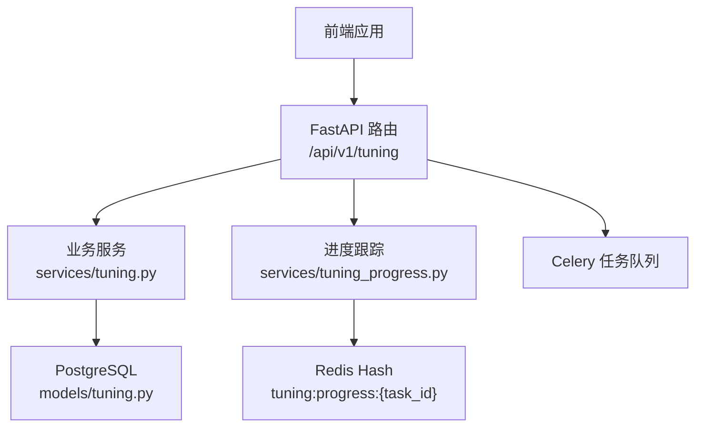
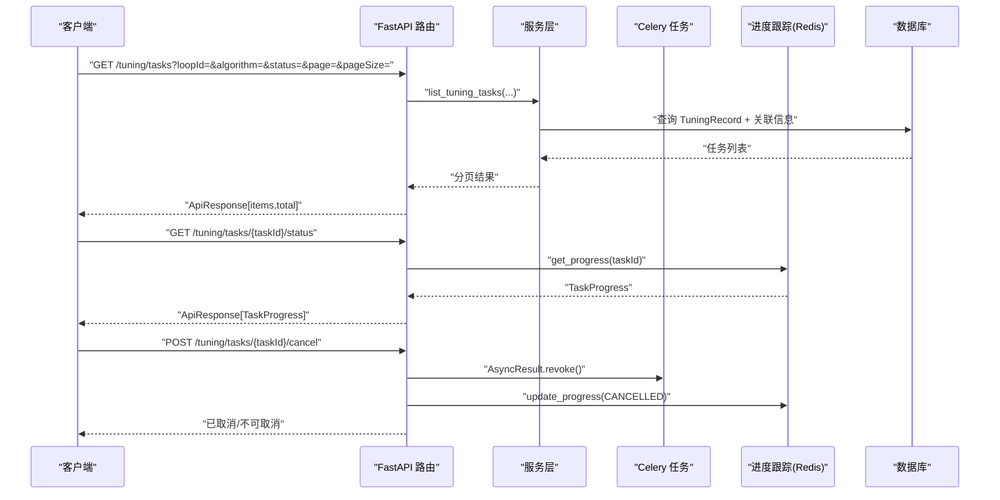
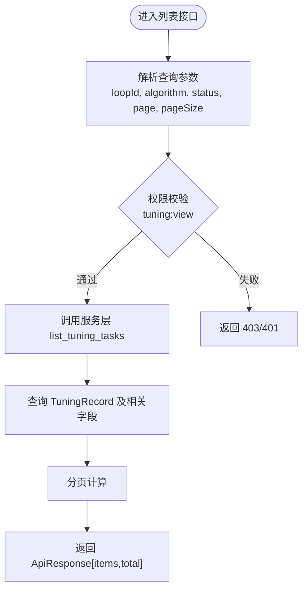
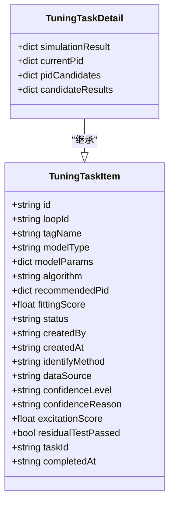
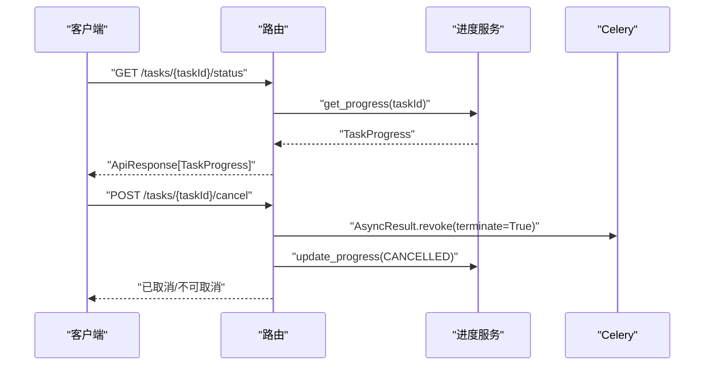
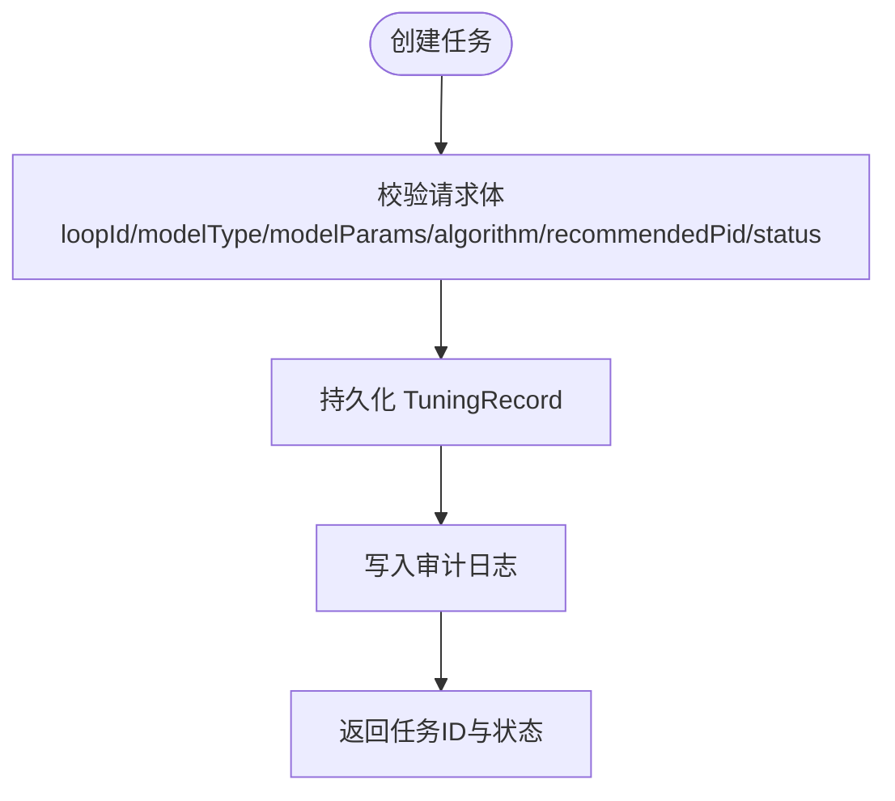
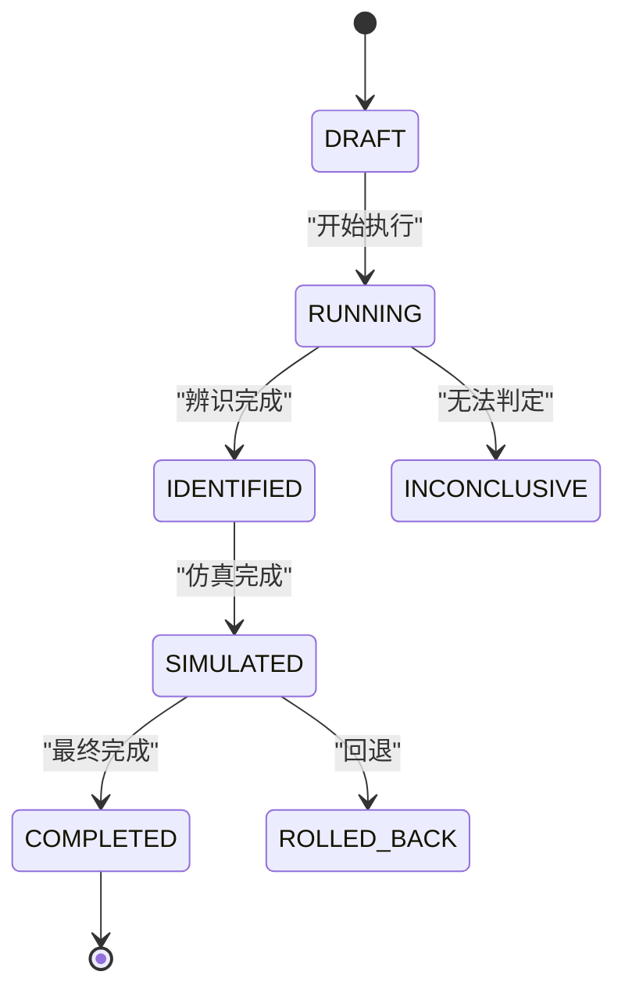
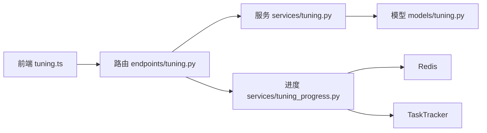

# 整定任务管理接口

<cite>
**本文引用的文件**
- [backend/app/api/v1/endpoints/tuning.py](file://backend/app/api/v1/endpoints/tuning.py)
- [backend/app/schemas/tuning.py](file://backend/app/schemas/tuning.py)
- [backend/app/models/tuning.py](file://backend/app/models/tuning.py)
- [backend/app/services/tuning.py](file://backend/app/services/tuning.py)
- [backend/app/services/tuning_progress.py](file://backend/app/services/tuning_progress.py)
- [backend/app/schemas/task.py](file://backend/app/schemas/task.py)
- [frontend/apps/web-antd/src/api/tuning.ts](file://frontend/apps/web-antd/src/api/tuning.ts)
</cite>

## 目录
1. [简介](#简介)
2. [项目结构](#项目结构)
3. [核心组件](#核心组件)
4. [架构总览](#架构总览)
5. [详细组件分析](#详细组件分析)
6. [依赖关系分析](#依赖关系分析)
7. [性能考虑](#性能考虑)
8. [故障排查指南](#故障排查指南)
9. [结论](#结论)
10. [附录](#附录)

## 简介
本文件面向 CLPM-MVP 的“整定任务管理”能力，聚焦以下目标：
- 任务列表查询：分页、状态过滤、算法分类、时间范围（通过模型辨识记录关联的时间窗）。
- 任务详情获取：执行历史、参数记录、结果归档、版本追溯。
- 异步任务控制：进度查询、任务取消、状态同步、错误处理。
- 生命周期与权限：任务状态机、RBAC 权限、审计日志。
- 调度策略与批量：Celery 异步任务、阶段化进度、统一 TaskTracker 桥接。
- 监控告警：基于 Prometheus/Grafana 的指标与告警配置建议。

## 项目结构
后端采用 FastAPI 路由 + Pydantic Schema + Service 分层；整定任务相关代码主要分布在：
- API 层：/api/v1/tuning/* 路由定义
- 数据模型：tuning_record 表及约束
- 服务层：模型授权、辨识、仿真、任务 CRUD、进度跟踪
- 异步任务：Celery 任务与进度存储（Redis）
- 前端：调用 /tuning/tasks 等接口进行轮询与控制

图表来源
- [backend/app/api/v1/endpoints/tuning.py:517-643](file://backend/app/api/v1/endpoints/tuning.py#L517-L643)
- [backend/app/services/tuning.py:104-297](file://backend/app/services/tuning.py#L104-L297)
- [backend/app/services/tuning_progress.py:1-84](file://backend/app/services/tuning_progress.py#L1-L84)
- [backend/app/models/tuning.py:31-115](file://backend/app/models/tuning.py#L31-L115)

章节来源
- [backend/app/api/v1/endpoints/tuning.py:1-17](file://backend/app/api/v1/endpoints/tuning.py#L1-L17)
- [backend/app/schemas/tuning.py:1-13](file://backend/app/schemas/tuning.py#L1-L13)

## 核心组件
- 任务列表与详情
  - GET /api/v1/tuning/tasks：分页 + 筛选（loopId、algorithm、status、page/pageSize）
  - GET /api/v1/tuning/tasks/{task_id}：任务详情（含模型、PID、仿真结果、辨识元数据）
- 异步任务控制
  - GET /api/v1/tuning/tasks/{task_id}/status：按 Celery taskId 查询进度（PENDING/RUNNING/SUCCESS/FAILED/CANCELLED）
  - POST /api/v1/tuning/tasks/{task_id}/cancel：取消 PENDING/RUNNING/STARTED 的任务
- 任务创建与保存
  - POST /api/v1/tuning/tasks：保存整定任务（含模型、算法、推荐 PID、仿真结果、辨识元数据）
- 权限与审计
  - 读接口需 tuning:view 权限
  - 写接口需 ADMIN/IC_ENGINEER/EXPERT 角色
  - 关键写操作写入 SysAuditLog（如 CREATE_TUNING_TASK、TUNE_PID）

章节来源
- [backend/app/api/v1/endpoints/tuning.py:517-643](file://backend/app/api/v1/endpoints/tuning.py#L517-L643)
- [backend/app/schemas/tuning.py:382-455](file://backend/app/schemas/tuning.py#L382-L455)
- [backend/app/models/tuning.py:31-115](file://backend/app/models/tuning.py#L31-L115)

## 架构总览
整定任务管理的请求-响应流程如下：

图表来源
- [backend/app/api/v1/endpoints/tuning.py:517-600](file://backend/app/api/v1/endpoints/tuning.py#L517-L600)
- [backend/app/services/tuning_progress.py:70-84](file://backend/app/services/tuning_progress.py#L70-L84)

## 详细组件分析

### 任务列表查询接口
- 路径：GET /api/v1/tuning/tasks
- 查询参数
  - loopId：回路 ID 筛选（可选）
  - algorithm：算法筛选（可选）
  - status：状态筛选（可选）
  - page：页码（默认 1）
  - pageSize：每页条数（默认 20，最大 100）
- 权限：tuning:view
- 返回：包含 items 与 total 的分页数据
- 说明
  - 支持按回路、算法、状态组合筛选
  - 时间范围筛选可通过“模型辨识记录”的 time_window_start/time_window_end 在数据库层实现（由服务层封装），API 不直接暴露时间参数

图表来源
- [backend/app/api/v1/endpoints/tuning.py:517-536](file://backend/app/api/v1/endpoints/tuning.py#L517-L536)
- [backend/app/schemas/tuning.py:382-405](file://backend/app/schemas/tuning.py#L382-L405)

章节来源
- [backend/app/api/v1/endpoints/tuning.py:517-536](file://backend/app/api/v1/endpoints/tuning.py#L517-L536)
- [backend/app/schemas/tuning.py:382-405](file://backend/app/schemas/tuning.py#L382-L405)

### 任务详情获取接口
- 路径：GET /api/v1/tuning/tasks/{task_id}
- 权限：tuning:view
- 返回：TuningTaskDetail（含基础信息与扩展字段）
- 关键字段
  - 基本信息：id、loopId、tagName、modelType、modelParams、algorithm、recommendedPid、fittingScore、status、createdBy、createdAt
  - 辨识元数据：identifyMethod、dataSource、confidenceLevel、confidenceReason、excitationScore、residualTestPassed
  - 多 PID 对比：pidCandidates、candidateResults
  - 仿真结果：simulationResult、currentPid
  - 异步任务：taskId、completedAt
- 版本追溯
  - 通过 process_model_version_id 关联过程模型版本，结合 identify_method/data_source/confidence_level 可追溯数据来源与可信度

图表来源
- [backend/app/schemas/tuning.py:382-415](file://backend/app/schemas/tuning.py#L382-L415)
- [backend/app/models/tuning.py:31-115](file://backend/app/models/tuning.py#L31-L115)

章节来源
- [backend/app/api/v1/endpoints/tuning.py:539-547](file://backend/app/api/v1/endpoints/tuning.py#L539-L547)
- [backend/app/schemas/tuning.py:382-415](file://backend/app/schemas/tuning.py#L382-L415)
- [backend/app/models/tuning.py:31-115](file://backend/app/models/tuning.py#L31-L115)

### 异步任务控制接口
- 进度查询
  - 路径：GET /api/v1/tuning/tasks/{task_id}/status
  - 说明：task_id 为 Celery 任务 ID；返回 TaskProgress（status、progress、stage、message、result/error）
  - 权限：tuning:view
- 任务取消
  - 路径：POST /api/v1/tuning/tasks/{task_id}/cancel
  - 说明：仅对 PENDING/RUNNING/STARTED 状态有效；取消后同步更新 tuning_progress 与 Celery 任务状态
  - 权限：ADMIN/IC_ENGINEER/EXPERT
- 状态同步
  - 通过 services/tuning_progress.py 维护 Redis Hash 进度，并在终态时桥接到统一 TaskTracker（粗粒度状态）
- 错误处理
  - 若进度不存在返回 404（ERR_TUNING_TASK_NOT_FOUND）
  - 取消失败或任务已结束返回当前状态

图表来源
- [backend/app/api/v1/endpoints/tuning.py:550-600](file://backend/app/api/v1/endpoints/tuning.py#L550-L600)
- [backend/app/services/tuning_progress.py:70-84](file://backend/app/services/tuning_progress.py#L70-L84)

章节来源
- [backend/app/api/v1/endpoints/tuning.py:550-600](file://backend/app/api/v1/endpoints/tuning.py#L550-L600)
- [backend/app/services/tuning_progress.py:1-84](file://backend/app/services/tuning_progress.py#L1-L84)

### 任务创建与保存接口
- 路径：POST /api/v1/tuning/tasks
- 权限：ADMIN/IC_ENGINEER/EXPERT
- 功能：保存整定任务（含模型类型、参数、算法、推荐 PID、当前 PID、拟合度、仿真结果、辨识元数据、多 PID 对比信息等）
- 审计：写入 SysAuditLog（operation_type=CREATE_TUNING_TASK）

图表来源
- [backend/app/api/v1/endpoints/tuning.py:602-643](file://backend/app/api/v1/endpoints/tuning.py#L602-L643)
- [backend/app/models/tuning.py:31-115](file://backend/app/models/tuning.py#L31-L115)

章节来源
- [backend/app/api/v1/endpoints/tuning.py:602-643](file://backend/app/api/v1/endpoints/tuning.py#L602-L643)
- [backend/app/schemas/tuning.py:417-438](file://backend/app/schemas/tuning.py#L417-L438)

### 任务生命周期管理
- 任务状态机（TuningRecord.status）
  - DRAFT → RUNNING → IDENTIFIED → SIMULATED → COMPLETED
  - INCONCLUSIVE / ROLLED_BACK 作为异常或回退状态
  - 兼容旧枚举：PENDING / APPLIED / VERIFIED
- 识别方法与数据来源
  - identify_method：HISTORICAL_ARX / HISTORICAL_ARMAX / HISTORICAL_IV / STEP_*
  - data_source：HISTORY / STEP_EXPERIMENT / fallback_step
- 可信度等级
  - confidence_level：A/B/C/D/E/INCONCLUSIVE
- 版本追溯
  - process_model_version_id 关联过程模型版本，确保参数与来源可追踪

图表来源
- [backend/app/models/tuning.py:88-115](file://backend/app/models/tuning.py#L88-L115)
- [backend/app/schemas/tuning.py:47-61](file://backend/app/schemas/tuning.py#L47-L61)

章节来源
- [backend/app/models/tuning.py:88-115](file://backend/app/models/tuning.py#L88-L115)
- [backend/app/schemas/tuning.py:47-61](file://backend/app/schemas/tuning.py#L47-L61)

### 权限控制机制
- 读取接口：require_perms("tuning:view")
- 写入接口：require_roles("ADMIN", "IC_ENGINEER", "EXPERT")
- 模型授权：authorize_tuning_model 强制校验模型来源、记录存在性、参数一致性、可信度门槛与风险确认

章节来源
- [backend/app/api/v1/endpoints/tuning.py:150-178](file://backend/app/api/v1/endpoints/tuning.py#L150-L178)
- [backend/app/services/tuning.py:104-297](file://backend/app/services/tuning.py#L104-L297)

### 审计日志记录
- 写操作审计：CREATE_TUNING_TASK、TUNE_PID
- 字段包括：operator、operation_type、target_type、target_id、after_value、operated_at
- 审计写入 SysAuditLog，事务提交保证一致性

章节来源
- [backend/app/api/v1/endpoints/tuning.py:299-316](file://backend/app/api/v1/endpoints/tuning.py#L299-L316)
- [backend/app/api/v1/endpoints/tuning.py:631-643](file://backend/app/api/v1/endpoints/tuning.py#L631-L643)

### 任务调度策略与批量处理
- 异步任务：Celery 任务用于历史辨识（AUTO/HISTORY_ONLY），STEP_ONLY 走同步路径
- 阶段化进度：excitation → nonparametric → identify → order_selection → discrete_to_continuous → tune → simulate
- 统一桥接：init_progress 创建 TUNING 类型任务并桥接到 TaskTracker，使整定任务出现在统一任务列表并获得终态通知
- 批量处理：矩阵整定（/tune/matrix）一次计算多种算法，单行失败不阻断整体

章节来源
- [backend/app/api/v1/endpoints/tuning.py:181-242](file://backend/app/api/v1/endpoints/tuning.py#L181-L242)
- [backend/app/api/v1/endpoints/tuning.py:319-358](file://backend/app/api/v1/endpoints/tuning.py#L319-L358)
- [backend/app/services/tuning_progress.py:1-84](file://backend/app/services/tuning_progress.py#L1-L84)

### 监控告警配置
- 指标采集：Celery 任务执行耗时、成功率、失败率、队列积压
- 告警规则：任务长时间 RUNNING、失败率突增、进度停滞
- 可视化：Grafana Dashboard 展示任务健康度与吞吐

（本节为通用实践建议，不直接引用具体代码文件）

## 依赖关系分析
- API 层依赖服务层与模型层
- 服务层依赖数据库会话、DataPlanner、算法栈、进度跟踪
- 进度跟踪依赖 Redis，并与 TaskTracker 桥接
- 前端通过 REST 调用 API，轮询进度并控制任务

图表来源
- [backend/app/api/v1/endpoints/tuning.py:517-643](file://backend/app/api/v1/endpoints/tuning.py#L517-L643)
- [backend/app/services/tuning.py:104-297](file://backend/app/services/tuning.py#L104-L297)
- [backend/app/services/tuning_progress.py:1-84](file://backend/app/services/tuning_progress.py#L1-L84)
- [frontend/apps/web-antd/src/api/tuning.ts:237-282](file://frontend/apps/web-antd/src/api/tuning.ts#L237-L282)

章节来源
- [backend/app/api/v1/endpoints/tuning.py:517-643](file://backend/app/api/v1/endpoints/tuning.py#L517-L643)
- [backend/app/services/tuning.py:104-297](file://backend/app/services/tuning.py#L104-L297)
- [backend/app/services/tuning_progress.py:1-84](file://backend/app/services/tuning_progress.py#L1-L84)
- [frontend/apps/web-antd/src/api/tuning.ts:237-282](file://frontend/apps/web-antd/src/api/tuning.ts#L237-L282)

## 性能考虑
- 分页与筛选：合理设置 pageSize（≤100），避免大结果集
- 进度查询：Redis 读取轻量，适合高频轮询
- 矩阵整定：单算法失败不阻断，提升整体可用性
- 数据预处理：DataPlanner 复用缓存与高效查询，减少重复 IO
- 并发控制：Celery 任务限流与重试策略，避免资源争用

（本节提供通用指导，不直接分析具体文件）

## 故障排查指南
- 进度不存在：检查 task_id 是否为 Celery 任务 ID；确认 init_progress 是否被调用
- 取消无效：确认任务状态是否为 PENDING/RUNNING/STARTED；终态不可取消
- 模型授权失败：检查 modelSource、sourceRecordId、riskConfirmed 与可信度等级
- 审计缺失：确认写操作是否触发 SysAuditLog 写入与事务提交

章节来源
- [backend/app/api/v1/endpoints/tuning.py:550-600](file://backend/app/api/v1/endpoints/tuning.py#L550-L600)
- [backend/app/services/tuning.py:104-297](file://backend/app/services/tuning.py#L104-L297)

## 结论
整定任务管理模块提供了完整的任务生命周期管理能力，涵盖列表查询、详情获取、异步控制、权限与审计、调度与批量处理。通过清晰的 API 契约、严格的服务端授权与进度跟踪，确保了生产环境的安全性与可观测性。建议在生产部署中完善监控告警与性能调优，进一步提升系统稳定性与用户体验。

## 附录
- 常用接口速查
  - 列表：GET /api/v1/tuning/tasks
  - 详情：GET /api/v1/tuning/tasks/{task_id}
  - 进度：GET /api/v1/tuning/tasks/{task_id}/status
  - 取消：POST /api/v1/tuning/tasks/{task_id}/cancel
  - 创建：POST /api/v1/tuning/tasks
- 前端调用示例
  - 方法信息、阶跃辨识、历史辨识、进度查询、取消任务等接口封装见前端 API 文件

章节来源
- [frontend/apps/web-antd/src/api/tuning.ts:237-282](file://frontend/apps/web-antd/src/api/tuning.ts#L237-L282)