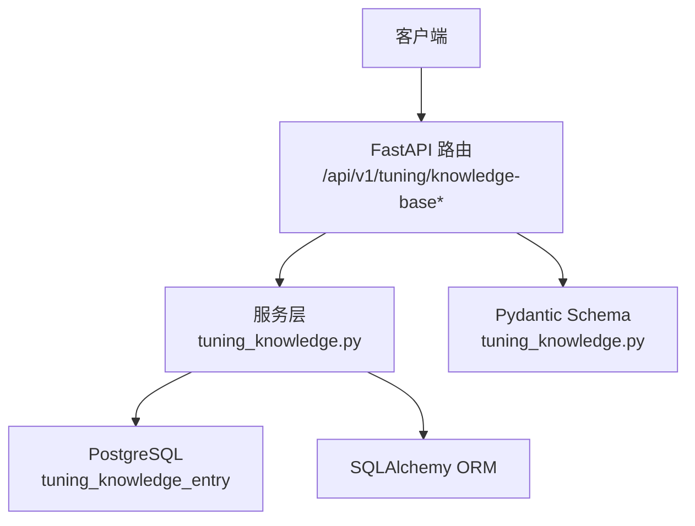
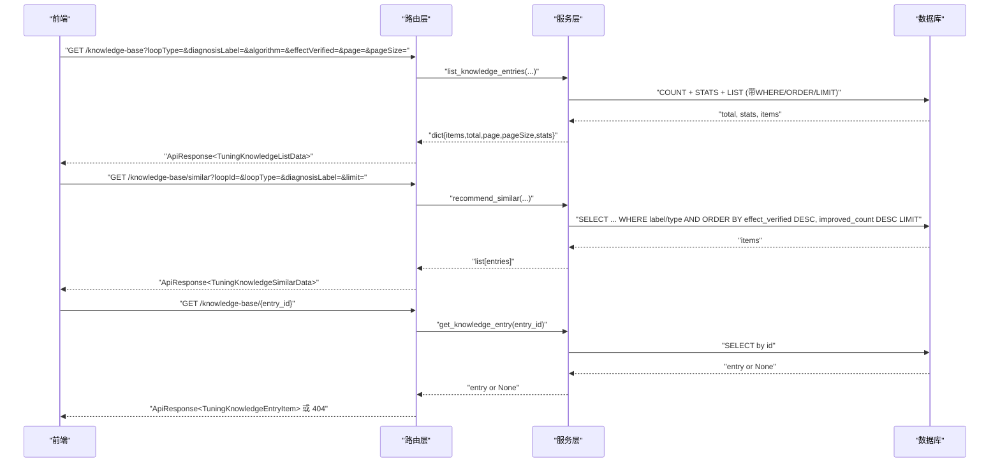
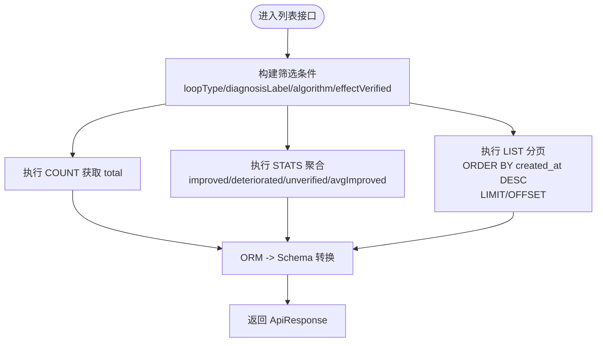
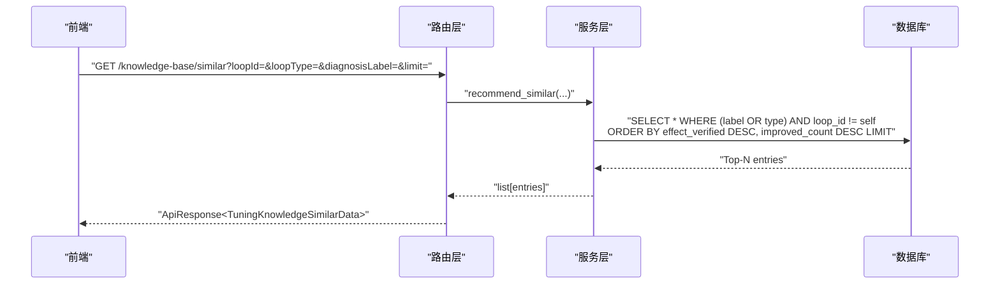
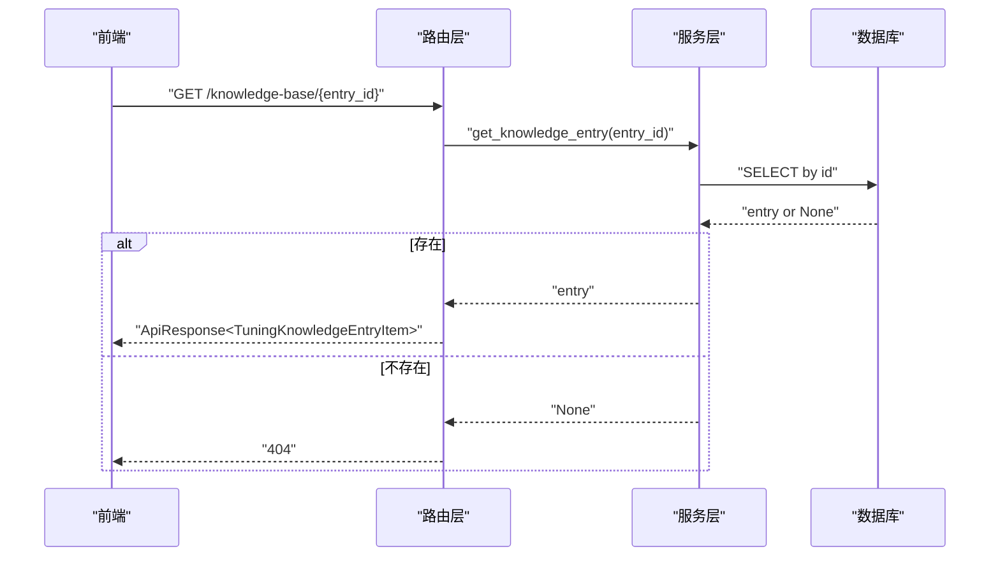
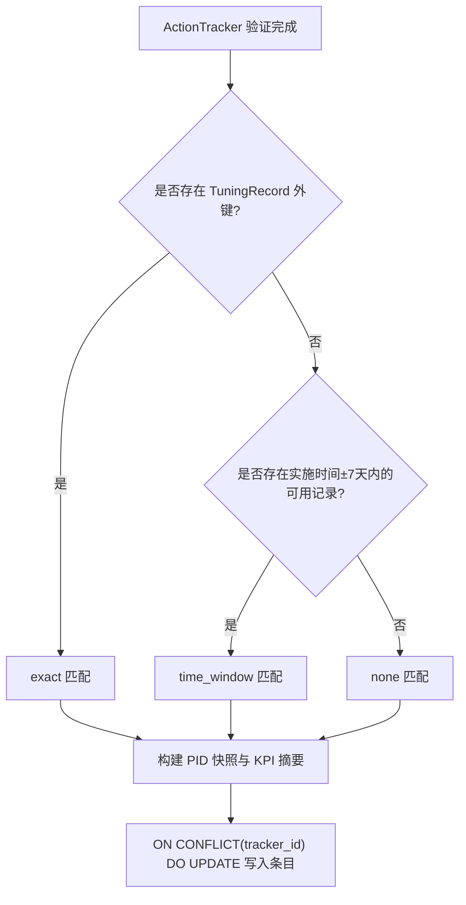
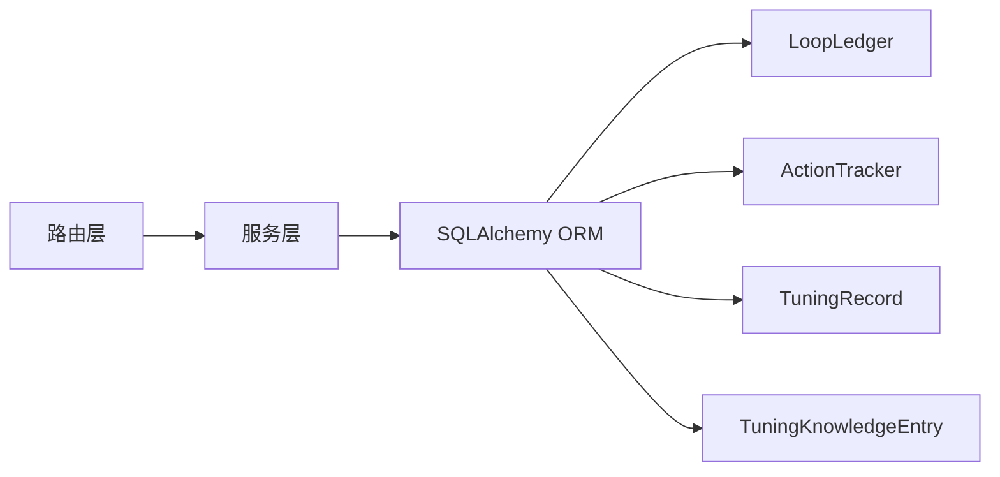

# 整定知识库接口

<cite>
**本文引用的文件**
- [backend/app/api/v1/endpoints/tuning.py](file://backend/app/api/v1/endpoints/tuning.py)
- [backend/app/services/tuning_knowledge.py](file://backend/app/services/tuning_knowledge.py)
- [backend/app/models/tuning_knowledge.py](file://backend/app/models/tuning_knowledge.py)
- [backend/app/schemas/tuning_knowledge.py](file://backend/app/schemas/tuning_knowledge.py)
- [backend/tests/test_api_tuning_knowledge.py](file://backend/tests/test_api_tuning_knowledge.py)
</cite>

## 目录
1. [简介](#简介)
2. [项目结构](#项目结构)
3. [核心组件](#核心组件)
4. [架构总览](#架构总览)
5. [详细组件分析](#详细组件分析)
6. [依赖关系分析](#依赖关系分析)
7. [性能考虑](#性能考虑)
8. [故障排查指南](#故障排查指南)
9. [结论](#结论)
10. [附录](#附录)

## 简介
本文件为 CLPM-MVP 的“整定知识库”能力提供面向 API 使用者的完整文档，覆盖：
- 知识库列表接口：多维度筛选（控制类型、问题类型、算法、效果）、分页查询、统计信息。
- 相似案例推荐接口：智能匹配策略、优先级排序、结果展示。
- 知识库条目详情接口：完整记录查看与关键字段说明。
- 知识沉淀机制、案例标注规范、质量评估标准。
- 知识库维护指南、最佳实践分享、经验传承方法。

## 项目结构
整定知识库功能由以下层次组成：
- 路由层：FastAPI 端点定义与参数校验、权限控制、响应封装。
- 服务层：业务逻辑（列表查询、统计聚合、相似推荐、条目生成）。
- 模型层：数据库表结构与索引设计。
- Schema 层：请求/响应数据契约（camelCase 字段）。
- 测试层：端到端用例验证行为与边界条件。

**图表来源**
- [backend/app/api/v1/endpoints/tuning.py:699-773](file://backend/app/api/v1/endpoints/tuning.py#L699-L773)
- [backend/app/services/tuning_knowledge.py:179-316](file://backend/app/services/tuning_knowledge.py#L179-L316)
- [backend/app/models/tuning_knowledge.py:31-105](file://backend/app/models/tuning_knowledge.py#L31-L105)
- [backend/app/schemas/tuning_knowledge.py:15-88](file://backend/app/schemas/tuning_knowledge.py#L15-L88)

**章节来源**
- [backend/app/api/v1/endpoints/tuning.py:699-773](file://backend/app/api/v1/endpoints/tuning.py#L699-L773)
- [backend/app/services/tuning_knowledge.py:179-316](file://backend/app/services/tuning_knowledge.py#L179-L316)
- [backend/app/models/tuning_knowledge.py:31-105](file://backend/app/models/tuning_knowledge.py#L31-L105)
- [backend/app/schemas/tuning_knowledge.py:15-88](file://backend/app/schemas/tuning_knowledge.py#L15-L88)

## 核心组件
- 路由端点
  - GET /api/v1/tuning/knowledge-base：知识库列表（支持筛选+分页+全局统计）
  - GET /api/v1/tuning/knowledge-base/similar：相似案例推荐
  - GET /api/v1/tuning/knowledge-base/{entry_id}：知识库条目详情
- 服务函数
  - list_knowledge_entries：构建筛选条件、计算 total 与 stats、分页返回
  - recommend_similar：按诊断标签/回路类型匹配，优先改善案例并降序
  - get_knowledge_entry：按 id 获取单条记录
  - generate_knowledge_entry：在 ActionTracker 验证完成时幂等生成不可变快照
- 数据模型
  - TuningKnowledgeEntry：存储冗余字段（loop_type、control_type、diagnosis_label 等），含多索引优化查询
- 数据契约
  - TuningKnowledgeEntryItem/TuningKnowledgeListData/TuningKnowledgeSimilarData：统一 camelCase 响应结构

**章节来源**
- [backend/app/api/v1/endpoints/tuning.py:699-773](file://backend/app/api/v1/endpoints/tuning.py#L699-L773)
- [backend/app/services/tuning_knowledge.py:76-176](file://backend/app/services/tuning_knowledge.py#L76-L176)
- [backend/app/services/tuning_knowledge.py:179-316](file://backend/app/services/tuning_knowledge.py#L179-L316)
- [backend/app/models/tuning_knowledge.py:31-105](file://backend/app/models/tuning_knowledge.py#L31-L105)
- [backend/app/schemas/tuning_knowledge.py:15-88](file://backend/app/schemas/tuning_knowledge.py#L15-L88)

## 架构总览
整体调用链从前端到后端再到数据库，关键路径如下：
- 列表查询：路由接收筛选与分页参数 → 服务层组装 SQL → 执行 count/stats/list → 返回结构化响应。
- 相似推荐：路由接收 loopId/loopType/diagnosisLabel → 服务层过滤与排序 → 返回 Top-N 条目。
- 详情查询：路由接收 entry_id → 服务层按 id 查询 → 返回条目或 404。

**图表来源**
- [backend/app/api/v1/endpoints/tuning.py:699-773](file://backend/app/api/v1/endpoints/tuning.py#L699-L773)
- [backend/app/services/tuning_knowledge.py:179-316](file://backend/app/services/tuning_knowledge.py#L179-L316)

## 详细组件分析

### 知识库列表接口
- 端点
  - GET /api/v1/tuning/knowledge-base
- 权限
  - 需要 tuning:view 权限
- 查询参数
  - loopType：控制类型筛选
  - diagnosisLabel：问题类型筛选
  - algorithm：算法筛选
  - effectVerified：效果筛选（True=改善，False=恶化）
  - page：页码（≥1）
  - pageSize：每页条数（1–100）
- 响应体
  - data.items：条目列表（驼峰字段）
  - data.total：总条数
  - data.page/pageSize：当前页与大小
  - data.stats：当前筛选条件下的全局统计（非当前页）
    - total：总数
    - improvedCount：改善案例数
    - deterioratedCount：恶化案例数
    - unverifiedCount：未验证案例数
    - avgImprovedMetrics：平均改善指标数（保留两位小数）
- 处理逻辑
  - 使用相同 WHERE 条件分别执行 COUNT、STATS 聚合、LIST 分页
  - 排序：按创建时间倒序
  - 统计：count(case(effect_verified)) 与 avg(improved_count) 聚合
- 错误与边界
  - page < 1 触发参数校验失败（422）
  - 空结果仍返回 stats（计数为 0，avg 为 null）

**图表来源**
- [backend/app/services/tuning_knowledge.py:179-265](file://backend/app/services/tuning_knowledge.py#L179-L265)
- [backend/app/api/v1/endpoints/tuning.py:699-727](file://backend/app/api/v1/endpoints/tuning.py#L699-L727)

**章节来源**
- [backend/app/api/v1/endpoints/tuning.py:699-727](file://backend/app/api/v1/endpoints/tuning.py#L699-L727)
- [backend/app/services/tuning_knowledge.py:179-265](file://backend/app/services/tuning_knowledge.py#L179-L265)
- [backend/tests/test_api_tuning_knowledge.py:68-221](file://backend/tests/test_api_tuning_knowledge.py#L68-L221)

### 相似案例推荐接口
- 端点
  - GET /api/v1/tuning/knowledge-base/similar
- 权限
  - 需要 tuning:view 权限
- 查询参数
  - loopId：当前回路 ID（用于排除自身）
  - loopType：控制类型（当 loopId 为空时参与匹配）
  - diagnosisLabel：问题类型（当 loopId 为空时参与匹配）
  - limit：返回条数（1–20）
- 匹配与排序
  - 匹配优先级：diagnosis_label 相同 > loop_type 相同（OR 条件）
  - 排序优先级：effect_verified=True 优先；其次 improved_count 降序
  - 排除自身：若传入 loopId，则排除该 loop_id 的记录
- 响应体
  - data.items：相似条目列表（驼峰字段）
  - data.total：返回条数
- 典型用途
  - 在详情页或列表项中展示“类似场景的成功/改善案例”，辅助决策

**图表来源**
- [backend/app/services/tuning_knowledge.py:279-316](file://backend/app/services/tuning_knowledge.py#L279-L316)
- [backend/app/api/v1/endpoints/tuning.py:730-751](file://backend/app/api/v1/endpoints/tuning.py#L730-L751)

**章节来源**
- [backend/app/api/v1/endpoints/tuning.py:730-751](file://backend/app/api/v1/endpoints/tuning.py#L730-L751)
- [backend/app/services/tuning_knowledge.py:279-316](file://backend/app/services/tuning_knowledge.py#L279-L316)
- [backend/tests/test_api_tuning_knowledge.py:228-312](file://backend/tests/test_api_tuning_knowledge.py#L228-L312)

### 知识库条目详情接口
- 端点
  - GET /api/v1/tuning/knowledge-base/{entry_id}
- 权限
  - 需要 tuning:view 权限
- 路径参数
  - entry_id：知识库条目唯一标识
- 响应体
  - data：条目对象（驼峰字段），包含 PID 变化、KPI 摘要、匹配方式、时间戳等
- 错误处理
  - 不存在时返回 404（BizError: ERR_NOT_FOUND）

**图表来源**
- [backend/app/services/tuning_knowledge.py:268-276](file://backend/app/services/tuning_knowledge.py#L268-L276)
- [backend/app/api/v1/endpoints/tuning.py:754-773](file://backend/app/api/v1/endpoints/tuning.py#L754-L773)

**章节来源**
- [backend/app/api/v1/endpoints/tuning.py:754-773](file://backend/app/api/v1/endpoints/tuning.py#L754-L773)
- [backend/app/services/tuning_knowledge.py:268-276](file://backend/app/services/tuning_knowledge.py#L268-L276)
- [backend/tests/test_api_tuning_knowledge.py:319-380](file://backend/tests/test_api_tuning_knowledge.py#L319-L380)

### 知识沉淀机制
- 触发时机
  - ActionTracker 验证完成时，通过 generate_knowledge_entry 聚合生成不可变快照
- 数据来源
  - ActionTracker（诊断标签、严重度、PID 变化、KPI 对比摘要）
  - TuningRecord（可选，模型类型、算法、识别方法、置信度、当前 PID）
  - LoopLedger（控制类型、回路类型、标签名）
- 幂等性
  - 基于 tracker_id 的唯一约束，重复生成时 ON CONFLICT DO UPDATE 刷新
- 匹配策略
  - exact：通过外键精确关联 TuningRecord
  - time_window：实施时间前后 7 天窗口内查找最近可用 TuningRecord
  - none：无有效 TuningRecord 关联
- 输出字段
  - 冗余字段避免后续 JOIN，保证快照稳定性
  - match_source 标记匹配方式，便于前端展示与追溯

**图表来源**
- [backend/app/services/tuning_knowledge.py:35-73](file://backend/app/services/tuning_knowledge.py#L35-L73)
- [backend/app/services/tuning_knowledge.py:76-176](file://backend/app/services/tuning_knowledge.py#L76-L176)

**章节来源**
- [backend/app/services/tuning_knowledge.py:35-176](file://backend/app/services/tuning_knowledge.py#L35-L176)

### 案例标注规范
- 标签维度
  - loop_type：控制类型（如流量、压力等）
  - diagnosis_label：问题类型（如振荡、过激等）
  - severity：严重度（LOW/MEDIUM/HIGH）
- PID 变化
  - pid_before：来自 TuningRecord.current_pid
  - pid_after：来自 ActionTracker.new_pid_* 组合
- 效果验证
  - effect_verified：是否已验证改善/恶化
  - improved_count/deteriorated_count：改善/恶化指标数量
- 匹配方式
  - match_source：exact/time_window/none

**章节来源**
- [backend/app/models/tuning_knowledge.py:61-85](file://backend/app/models/tuning_knowledge.py#L61-L85)
- [backend/app/services/tuning_knowledge.py:106-151](file://backend/app/services/tuning_knowledge.py#L106-L151)

### 质量评估标准
- 统计口径
  - improvedCount：effect_verified = True 的数量
  - deterioratedCount：effect_verified = False 的数量
  - unverifiedCount：effect_verified IS NULL 的数量
  - avgImprovedMetrics：improved_count 的平均值（仅计入非空且非验证缺失）
- 一致性保障
  - total 与 stats 使用完全相同的 WHERE 条件，避免翻页导致的 KPI 跳变

**章节来源**
- [backend/app/services/tuning_knowledge.py:197-252](file://backend/app/services/tuning_knowledge.py#L197-L252)

## 依赖关系分析
- 路由依赖
  - 依赖服务层函数进行业务处理
  - 依赖 Pydantic Schema 进行响应建模
- 服务依赖
  - 依赖 SQLAlchemy ORM 访问 PostgreSQL
  - 依赖其他模型（LoopLedger、ActionTracker、TuningRecord）进行数据聚合
- 索引优化
  - 针对 loop_type、diagnosis_label、effect_verified、tracker_id 建立索引，提升列表与推荐查询性能

**图表来源**
- [backend/app/api/v1/endpoints/tuning.py:699-773](file://backend/app/api/v1/endpoints/tuning.py#L699-L773)
- [backend/app/services/tuning_knowledge.py:179-316](file://backend/app/services/tuning_knowledge.py#L179-L316)
- [backend/app/models/tuning_knowledge.py:93-105](file://backend/app/models/tuning_knowledge.py#L93-L105)

**章节来源**
- [backend/app/models/tuning_knowledge.py:93-105](file://backend/app/models/tuning_knowledge.py#L93-L105)

## 性能考虑
- 查询优化
  - 使用独立 COUNT、STATS、LIST 三句 SQL，避免 N+1 与复杂聚合
  - 利用索引 idx_tke_loop_type_label、idx_tke_label、idx_tke_effect 加速筛选
- 分页策略
  - 使用 OFFSET/LIMIT 实现分页，默认 pageSize=20，最大 100
- 统计聚合
  - 使用 case/count/avg 一次性聚合，减少多次往返
- 相似度推荐
  - 限制返回条数（limit 1–20），避免大结果集
- 幂等写入
  - ON CONFLICT DO UPDATE 避免重复插入，降低写放大

[本节为通用性能建议，不直接分析具体文件]

## 故障排查指南
- 常见错误
  - 404：条目不存在（ERR_NOT_FOUND）
  - 422：参数校验失败（如 page < 1）
- 排查步骤
  - 检查请求参数是否符合枚举与范围约束
  - 确认用户具备 tuning:view 权限
  - 核对数据库中是否存在对应条目与筛选条件匹配
  - 查看日志中的警告（如缺少 loop_id、loop 不存在）
- 定位要点
  - 列表接口：确认筛选条件与索引命中
  - 推荐接口：确认 loopId 排除自身、匹配条件正确
  - 详情接口：确认 entry_id 有效性

**章节来源**
- [backend/app/api/v1/endpoints/tuning.py:754-773](file://backend/app/api/v1/endpoints/tuning.py#L754-L773)
- [backend/app/services/tuning_knowledge.py:88-101](file://backend/app/services/tuning_knowledge.py#L88-L101)
- [backend/tests/test_api_tuning_knowledge.py:213-221](file://backend/tests/test_api_tuning_knowledge.py#L213-L221)

## 结论
整定知识库接口提供了完整的知识库管理能力：
- 列表接口支持多维度筛选与分页，并提供一致的全局统计，避免前端 KPI 跳变。
- 相似推荐采用“诊断标签优先、回路类型兜底”的策略，并以改善效果与改善指标数排序，提升推荐相关性。
- 详情接口提供完整记录视图，便于回溯与学习。
- 知识沉淀机制确保每条验证完成的行动都可沉淀为不可变快照，形成可复用经验资产。
- 通过合理的索引设计与幂等写入，兼顾了查询性能与数据一致性。

[本节为总结性内容，不直接分析具体文件]

## 附录

### API 参考速查
- 列表
  - GET /api/v1/tuning/knowledge-base
  - 参数：loopType、diagnosisLabel、algorithm、effectVerified、page、pageSize
  - 响应：data.items、data.total、data.page、data.pageSize、data.stats
- 相似推荐
  - GET /api/v1/tuning/knowledge-base/similar
  - 参数：loopId、loopType、diagnosisLabel、limit
  - 响应：data.items、data.total
- 详情
  - GET /api/v1/tuning/knowledge-base/{entry_id}
  - 响应：data（条目对象）

**章节来源**
- [backend/app/api/v1/endpoints/tuning.py:699-773](file://backend/app/api/v1/endpoints/tuning.py#L699-L773)
- [backend/app/schemas/tuning_knowledge.py:15-88](file://backend/app/schemas/tuning_knowledge.py#L15-L88)

### 数据模型概览
- 主表：tuning_knowledge_entry
- 关键字段
  - tracker_id：来源 tracker（唯一）
  - tuning_record_id：关联整定记录（可空）
  - loop_id：回路标识
  - loop_type/control_type/tag_name：冗余字段
  - diagnosis_label/severity：问题类型与严重度
  - model_type/algorithm/identify_method/confidence_level：整定元数据
  - pid_before/pid_after：PID 变化
  - kpi_summary/effect_verified/improved_count/deteriorated_count：效果与改善幅度
  - match_source：匹配方式（exact/time_window/none）
  - implemented_at/verified_at/created_at：时间戳

**章节来源**
- [backend/app/models/tuning_knowledge.py:31-105](file://backend/app/models/tuning_knowledge.py#L31-L105)

### 维护指南与最佳实践
- 维护建议
  - 定期审查未验证案例（unverifiedCount），推动闭环验证
  - 关注恶化案例（deterioratedCount），复盘原因并优化策略
  - 对 avgImprovedMetrics 下降趋势进行分析，识别潜在风险
- 最佳实践
  - 在相似推荐中结合 loopType 与 diagnosisLabel，提高匹配精度
  - 合理设置 pageSize，避免过大分页影响性能
  - 使用幂等写入保障重复任务下的数据一致性
- 经验传承
  - 将高改善案例纳入知识库，作为模板与参考
  - 对典型问题类型沉淀诊断标签与处置流程，形成组织记忆

[本节为通用指导，不直接分析具体文件]