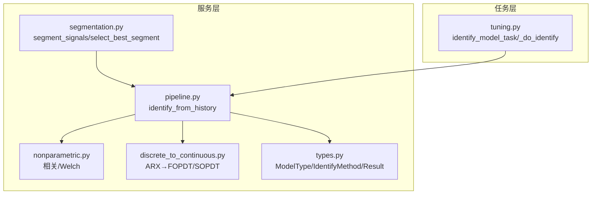
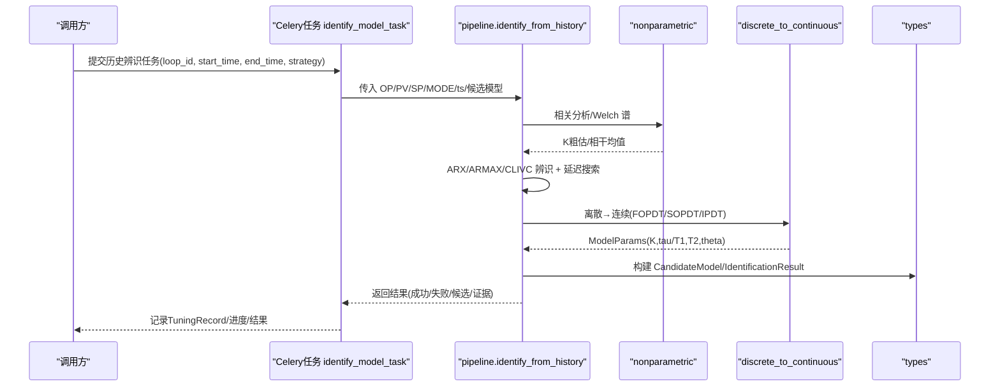
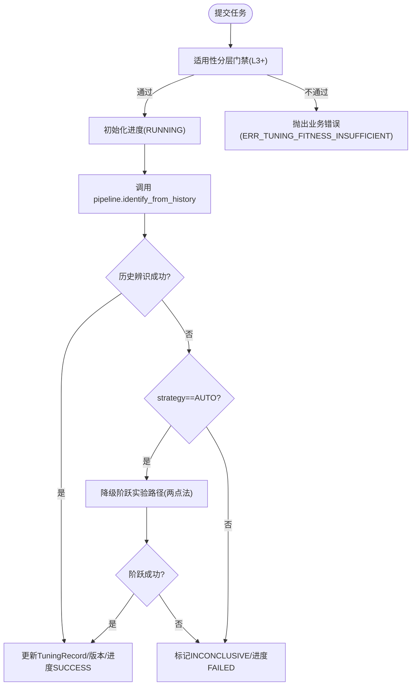
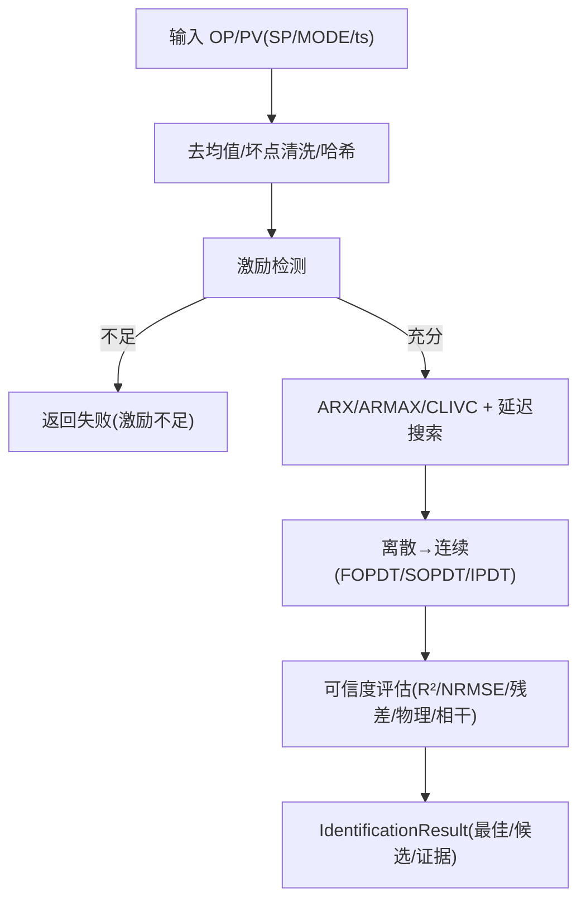
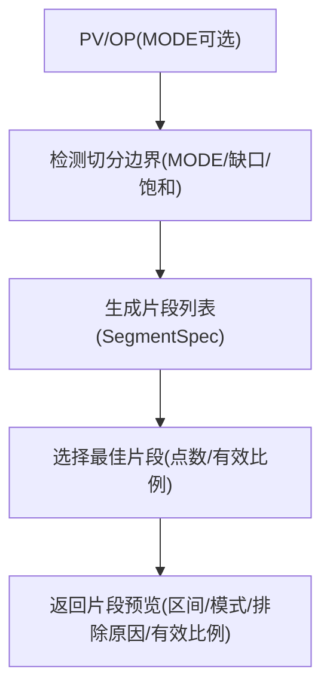
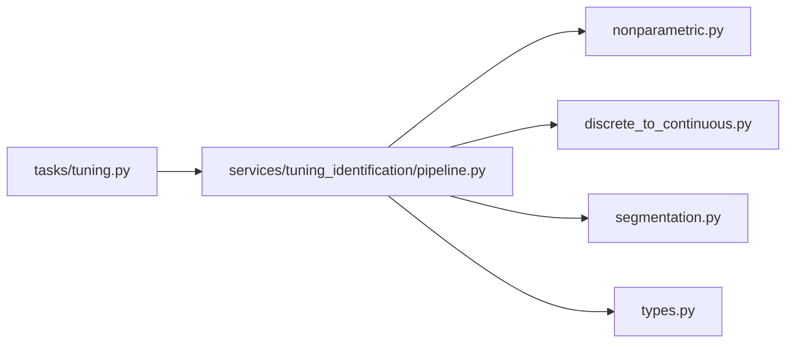

# 模型辨识接口

<cite>
**本文引用的文件**
- [pipeline.py](file://backend/app/services/tuning_identification/pipeline.py)
- [types.py](file://backend/app/services/tuning_identification/types.py)
- [segmentation.py](file://backend/app/services/tuning_identification/segmentation.py)
- [nonparametric.py](file://backend/app/services/tuning_identification/nonparametric.py)
- [discrete_to_continuous.py](file://backend/app/services/tuning_identification/discrete_to_continuous.py)
- [tuning.py](file://backend/app/tasks/tuning.py)
</cite>

## 目录
1. [简介](#简介)
2. [项目结构](#项目结构)
3. [核心组件](#核心组件)
4. [架构总览](#架构总览)
5. [详细组件分析](#详细组件分析)
6. [依赖关系分析](#依赖关系分析)
7. [性能考量](#性能考量)
8. [故障排查指南](#故障排查指南)
9. [结论](#结论)
10. [附录：请求与响应示例、集成要点](#附录请求与响应示例集成要点)

## 简介
本文件面向 CLPM-MVP 的“模型辨识”能力，提供完整的 API 级说明，覆盖以下能力：
- 阶跃实验路径的同步辨识接口：数据采集、FOPDT/SOPDT/IPDT 模型选择、参数估计算法、拟合度评估指标。
- 历史数据辨识的异步任务接口：Celery 任务提交、进度查询、任务取消、自动降级策略（AUTO/HISTORY_ONLY/STEP_ONLY）。
- 可辨识片段预览接口：激励检测、片段识别、质量评估。
- 适用性分层门禁机制（L3+）、错误处理策略、性能优化方案。
- 完整请求/响应示例与集成指南。

## 项目结构
后端将辨识算法栈封装在 services/tuning_identification 下，并通过 tasks/tuning.py 暴露 Celery 异步任务；类型定义集中在 types.py；片段切分与预览逻辑在 segmentation.py；非参数估计与离散→连续转换分别在 nonparametric.py 与 discrete_to_continuous.py。

图表来源
- [pipeline.py:209-658](file://backend/app/services/tuning_identification/pipeline.py#L209-L658)
- [segmentation.py:45-106](file://backend/app/services/tuning_identification/segmentation.py#L45-L106)
- [nonparametric.py:34-103](file://backend/app/services/tuning_identification/nonparametric.py#L34-L103)
- [discrete_to_continuous.py:17-107](file://backend/app/services/tuning_identification/discrete_to_continuous.py#L17-L107)
- [types.py:10-27](file://backend/app/services/tuning_identification/types.py#L10-L27)
- [tuning.py:154-404](file://backend/app/tasks/tuning.py#L154-L404)

章节来源
- [pipeline.py:209-658](file://backend/app/services/tuning_identification/pipeline.py#L209-L658)
- [types.py:10-27](file://backend/app/services/tuning_identification/types.py#L10-L27)
- [segmentation.py:45-106](file://backend/app/services/tuning_identification/segmentation.py#L45-L106)
- [nonparametric.py:34-103](file://backend/app/services/tuning_identification/nonparametric.py#L34-L103)
- [discrete_to_continuous.py:17-107](file://backend/app/services/tuning_identification/discrete_to_continuous.py#L17-L107)
- [tuning.py:154-404](file://backend/app/tasks/tuning.py#L154-L404)

## 核心组件
- 算法栈编排（pipeline）：串联激励检测→非参数粗估→参数化辨识（ARX/ARMAX/IV）→阶次选择→离散→连续→可信度评估，输出 IdentificationResult。
- 类型与结果（types）：统一模型类型（FOPDT/SOPDT/IPDT）、辨识方法、置信度等级、证据与不确定性等数据结构及序列化。
- 片段切分（segmentation）：按 MODE/缺口/饱和事件切分，标注排除原因，支持最佳片段选择。
- 非参数估计（nonparametric）：互相关估计脉冲响应、Welch 谱估计频率响应与相干。
- 离散→连续（discrete_to_continuous）：ARX/IV/ARMAX 参数到 FOPDT/SOPDT 连续参数的转换。
- 异步任务（tasks/tuning）：Celery 任务 identify_model_task，含进度更新、结果落库、AUTO 降级策略。

章节来源
- [pipeline.py:209-658](file://backend/app/services/tuning_identification/pipeline.py#L209-L658)
- [types.py:10-27](file://backend/app/services/tuning_identification/types.py#L10-L27)
- [segmentation.py:45-106](file://backend/app/services/tuning_identification/segmentation.py#L45-L106)
- [nonparametric.py:34-103](file://backend/app/services/tuning_identification/nonparametric.py#L34-L103)
- [discrete_to_continuous.py:17-107](file://backend/app/services/tuning_identification/discrete_to_continuous.py#L17-L107)
- [tuning.py:154-404](file://backend/app/tasks/tuning.py#L154-L404)

## 架构总览

图表来源
- [tuning.py:154-404](file://backend/app/tasks/tuning.py#L154-L404)
- [pipeline.py:209-658](file://backend/app/services/tuning_identification/pipeline.py#L209-L658)
- [nonparametric.py:34-103](file://backend/app/services/tuning_identification/nonparametric.py#L34-L103)
- [discrete_to_continuous.py:17-107](file://backend/app/services/tuning_identification/discrete_to_continuous.py#L17-L107)
- [types.py:221-273](file://backend/app/services/tuning_identification/types.py#L221-L273)

## 详细组件分析

### 历史数据辨识（异步任务）
- 入口：Celery 任务 identify_model_task，内部通过 _do_identify 执行异步流程。
- 前置门禁：任务内对回路适用性进行 L3+ 检查，不满足则抛出业务错误并终止。
- 主流程：
  - 初始化进度（excitation 阶段）。
  - 调用 identify_model_from_history（对应 pipeline.identify_from_history）。
  - 若策略为 AUTO 且历史辨识失败/数据不足，自动降级至阶跃实验路径（两步法），并在结果中标注 dataSource=fallback_step。
  - 更新 TuningRecord 状态（IDENTIFIED/INCONCLUSIVE），写入 process_model_version。
  - 更新进度为 SUCCESS/FAILED，并返回 recordId 与结果摘要。
- 进度字段：stage 包含 excitation、discrete_to_continuous 等；status 包含 RUNNING/SUCCESS/FAILED；progress 百分比。
- 取消：当前实现未暴露显式取消接口；如需取消，需结合 Celery 管理工具或上层编排。

图表来源
- [tuning.py:154-404](file://backend/app/tasks/tuning.py#L154-L404)
- [pipeline.py:209-658](file://backend/app/services/tuning_identification/pipeline.py#L209-L658)

章节来源
- [tuning.py:154-404](file://backend/app/tasks/tuning.py#L154-L404)

### 阶跃实验路径（同步辨识）
- 输入：OP/PV 时序（可选 SP/MODE/ts），以及候选模型类型（默认 FOPDT+SOPDT，IPDT 走专用分支）。
- 预处理：去均值、坏点清洗（小缺口线性插值，大缺口取最长有效段）、数据快照哈希。
- 激励检测：基于条件数与显著变化次数判定是否充分。
- 参数化辨识：
  - ARX/ARMAX 基线；当存在 SP 激励时启用 CLIVC（闭环一致 IV）。
  - 延迟 d 搜索（BIC 选优），训练集/验证集/测试集时间顺序分割（短数据退化 70/30）。
  - IPDT 使用专用差分辨识分支。
- 离散→连续：ARX/IV/ARMAX 参数转换为 FOPDT/SOPDT 连续参数；SOPDT 要求过阻尼（实极点）。
- 可信度评估：
  - 验证集自由仿真 R²、NRMSE。
  - 残差检验三轨制（R²≥0.999 直接通过；ARMAX 用 LB 白性；ARX/IV 用残差-输入独立性）。
  - 物理可行性（负增益/NMP 零点）与非参数一致性（符号/量级）作为封顶信号。
  - Welch 相干辅助门禁（低相干封顶 C）。
  - 启发式 theta（2Ts）封顶 C。
- 输出：IdentificationResult（best_model/candidates/evidence），包含 AIC/BIC、参数不确定度（ARX/CLIVC 解析协方差+Monte Carlo 传播）。

图表来源
- [pipeline.py:209-658](file://backend/app/services/tuning_identification/pipeline.py#L209-L658)
- [discrete_to_continuous.py:17-107](file://backend/app/services/tuning_identification/discrete_to_continuous.py#L17-L107)
- [nonparametric.py:34-103](file://backend/app/services/tuning_identification/nonparametric.py#L34-L103)
- [types.py:221-273](file://backend/app/services/tuning_identification/types.py#L221-L273)

章节来源
- [pipeline.py:209-658](file://backend/app/services/tuning_identification/pipeline.py#L209-L658)
- [discrete_to_continuous.py:17-107](file://backend/app/services/tuning_identification/discrete_to_continuous.py#L17-L107)
- [nonparametric.py:34-103](file://backend/app/services/tuning_identification/nonparametric.py#L34-L103)
- [types.py:221-273](file://backend/app/services/tuning_identification/types.py#L221-L273)

### 可辨识片段预览（激励检测与片段识别）
- 片段切分：依据 MODE 切换、PV/OP 数据缺口、OP 饱和事件边界切分，生成 SegmentSpec（含主导模式、排除原因、有效样本比例、点数）。
- 排除规则：手动模式、数据缺口（有效样本<50%）、OP 饱和（长时间贴近上下限）、片段太短（<50点）。
- 最佳片段选择：优先点数最多，其次有效样本比例最高。
- 激励检测：在 pipeline 层基于条件数与显著变化次数评估激励充分性，用于后续可信度评估。

图表来源
- [segmentation.py:45-106](file://backend/app/services/tuning_identification/segmentation.py#L45-L106)
- [segmentation.py:149-242](file://backend/app/services/tuning_identification/segmentation.py#L149-L242)
- [pipeline.py:355-364](file://backend/app/services/tuning_identification/pipeline.py#L355-L364)

章节来源
- [segmentation.py:45-106](file://backend/app/services/tuning_identification/segmentation.py#L45-L106)
- [segmentation.py:149-242](file://backend/app/services/tuning_identification/segmentation.py#L149-L242)
- [pipeline.py:355-364](file://backend/app/services/tuning_identification/pipeline.py#L355-L364)

### 模型类型与辨识方法
- 模型类型：FOPDT（一阶滞后）、SOPDT（二阶滞后）、IPDT（积分过程）。
- 辨识方法：HISTORICAL_ARX、HISTORICAL_ARMAX、HISTORICAL_IV、STEP_TWO_POINT、STEP_AREA、STEP_NLS。
- 置信度等级：A/B/C/D/E/INCONCLUSIVE，用于区分算法可信度与平台数据可信度。

章节来源
- [types.py:10-27](file://backend/app/services/tuning_identification/types.py#L10-L27)
- [types.py:29-47](file://backend/app/services/tuning_identification/types.py#L29-L47)

## 依赖关系分析
- pipeline 依赖：
  - nonparametric（相关分析、Welch 谱）
  - discrete_to_continuous（离散→连续）
  - segmentation（片段切分，供预览与筛选）
  - types（统一数据结构）
- tasks/tuning 依赖：
  - pipeline（历史辨识）
  - 数据库（TuningRecord/process_model_version）
  - 进度服务（Redis-based progress）

图表来源
- [tuning.py:154-404](file://backend/app/tasks/tuning.py#L154-L404)
- [pipeline.py:209-658](file://backend/app/services/tuning_identification/pipeline.py#L209-L658)
- [nonparametric.py:34-103](file://backend/app/services/tuning_identification/nonparametric.py#L34-L103)
- [discrete_to_continuous.py:17-107](file://backend/app/services/tuning_identification/discrete_to_continuous.py#L17-L107)
- [segmentation.py:45-106](file://backend/app/services/tuning_identification/segmentation.py#L45-L106)
- [types.py:10-27](file://backend/app/services/tuning_identification/types.py#L10-L27)

章节来源
- [tuning.py:154-404](file://backend/app/tasks/tuning.py#L154-L404)
- [pipeline.py:209-658](file://backend/app/services/tuning_identification/pipeline.py#L209-L658)

## 性能考量
- 数据清洗：小缺口线性插值避免整段丢弃，提升可用数据率；大缺口取最长有效段保证稳定性。
- 训练/验证/测试分割：时间顺序保留自相关，短数据退化减少过拟合风险。
- 延迟搜索范围：d_max 上限 60 且不超过数据长度 1/4，平衡精度与计算开销。
- 非参数辅助：相关分析与 Welch 谱仅用于初值与辅助门禁，避免额外计算成为瓶颈。
- 参数不确定度：仅对 ARX/CLIVC 使用解析协方差+Monte Carlo 传播，其他方法暂不计算以降低开销。
- 物理可行性与一致性：快速门控（负增益/NMP/符号矛盾）尽早降低无效候选的计算成本。

[本节为通用性能建议，不直接分析具体代码行]

## 故障排查指南
- 适用性分层不足（L3+）：任务内会抛出 ERR_TUNING_FITNESS_INSUFFICIENT，需先改善控制状态。
- 激励不足：返回 reason 包含激励检测结果，需检查数据窗口或调整采集策略。
- 数据不足/清洗后有效点不足：提示原始点数、插值/剔除点数，需扩大窗口或改善数据质量。
- 离散→连续转换失败：常见于不稳定系统或复极点（SOPDT 仅适用于过阻尼），需改用 FOPDT 或振荡模型。
- 物理可行性未通过：负增益/NMP 零点将被标记并封顶置信度，需人工复核。
- 低相干：Welch 相干低于阈值将封顶置信度，提示弱线性/低信噪比。
- 任务异常：TuningRecord 状态置 INCONCLUSIVE，查看进度 message 与 error 字段定位问题。

章节来源
- [tuning.py:192-216](file://backend/app/tasks/tuning.py#L192-L216)
- [pipeline.py:236-292](file://backend/app/services/tuning_identification/pipeline.py#L236-L292)
- [pipeline.py:468-484](file://backend/app/services/tuning_identification/pipeline.py#L468-L484)
- [pipeline.py:543-558](file://backend/app/services/tuning_identification/pipeline.py#L543-L558)

## 结论
本接口体系以 pipeline 为核心，串联激励检测、非参数粗估、参数化辨识、离散→连续与可信度评估，形成稳健的过程对象辨识流水线；通过 Celery 异步任务提供可扩展的历史辨识能力，并内置 AUTO 降级策略保障可用性；片段预览与激励检测为前端交互与数据治理提供支撑；L3+ 门禁与多道门控（物理可行性、一致性、相干）确保结果可信。建议在集成时严格遵循数据质量与窗口选择规范，充分利用证据与不确定性信息指导后续整定与运维。

[本节为总结性内容，不直接分析具体代码行]

## 附录：请求与响应示例、集成要点

### 异步历史辨识任务（Celery）
- 任务名：app.tasks.tuning.identify_model_task
- 关键参数：
  - loop_id：回路 ID
  - start_time/end_time：ISO 8601 时间窗
  - candidate_model_types：["FOPDT","SOPDT","IPDT"] 子集
  - theta_estimate：纯滞后预估值（秒，可选）
  - created_by：创建人
  - identify_strategy：AUTO/HISTORY_ONLY（STEP_ONLY 由端点同步拦截，不会进入此任务）
  - created_by_id：用户 ID（桥接 TaskTracker）
- 进度查询：通过 Redis-based 进度服务（task_id → status/stage/message/progress/result）
- 任务取消：当前未暴露显式取消接口，需借助 Celery 管理工具或上层编排
- 结果落库：TuningRecord 状态 IDENTIFIED/INCONCLUSIVE，process_model_version 写入模型版本

章节来源
- [tuning.py:358-404](file://backend/app/tasks/tuning.py#L358-L404)
- [tuning.py:154-338](file://backend/app/tasks/tuning.py#L154-L338)

### 同步阶跃辨识（pipeline 入口）
- 函数：pipeline.identify_from_history
- 输入：op/pv/sp(mode)/ts/theta_estimate/candidate_models
- 输出：IdentificationResult（success/best_model/candidates/evidence/reason/theta_source）
- 关键指标：fittingScore（验证集 R²×100）、confidenceLevel、residualTestPassed、aic/bic、parameterUncertainty、cleaningStats

章节来源
- [pipeline.py:209-658](file://backend/app/services/tuning_identification/pipeline.py#L209-L658)
- [types.py:221-273](file://backend/app/services/tuning_identification/types.py#L221-L273)

### 片段预览（segmentation）
- 函数：segmentation.segment_signals / select_best_segment
- 输入：pv/op/mode/op_min/op_max/min_segment_points
- 输出：SegmentSpec 列表（start_idx/end_idx/mode_label/is_auto/exclusion_reason/valid_sample_ratio/point_count）
- 用途：前端展示可辨识片段、引导用户选择合适窗口

章节来源
- [segmentation.py:45-106](file://backend/app/services/tuning_identification/segmentation.py#L45-L106)
- [segmentation.py:149-242](file://backend/app/services/tuning_identification/segmentation.py#L149-L242)

### 集成要点
- 数据准备：确保 OP/PV 同轴、采样周期 ts 为正有限值；必要时提供 SP 以启用 CLIVC。
- 窗口选择：优先选择 AUTO 模式、无饱和、有效样本比例高的片段；避免手动干预与启停过渡段。
- 策略选择：
  - HISTORY_ONLY：仅历史数据辨识，失败即返回 INCONCLUSIVE。
  - AUTO：历史失败/数据不足自动降级阶跃实验路径，结果标注 fallback_step。
  - STEP_ONLY：由同步端点拦截，不走本异步任务。
- 结果使用：关注 confidenceLevel、residualTestPassed、evidence.r2Val/nrmseVal、parameterUncertainty；对 C 级及以下结果谨慎用于整定。
- 监控与排障：利用进度 stage/message/error 与 TuningRecord.confidence_reason 定位问题；必要时调整数据窗口或改善数据质量。

[本节为集成实践建议，不直接分析具体代码行]