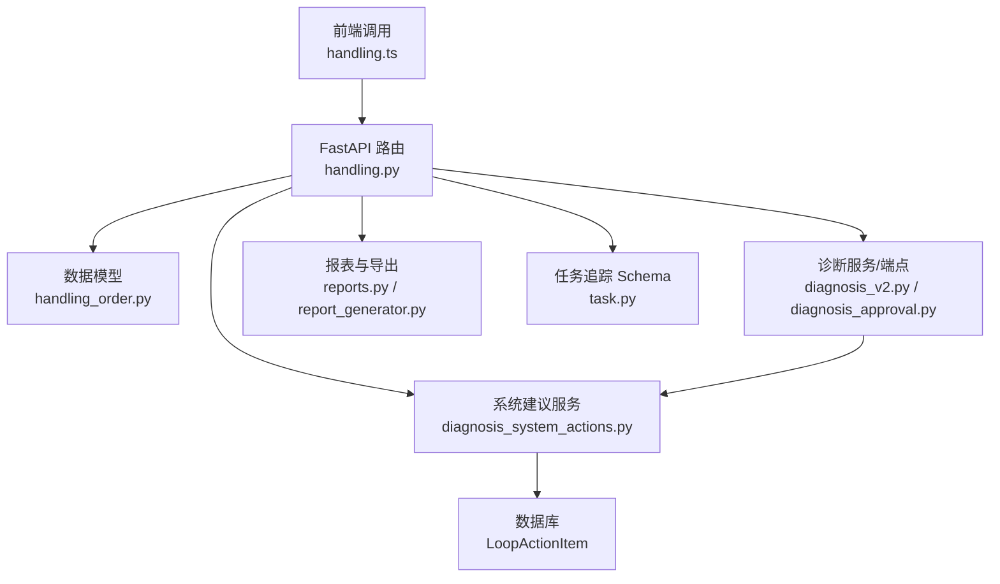
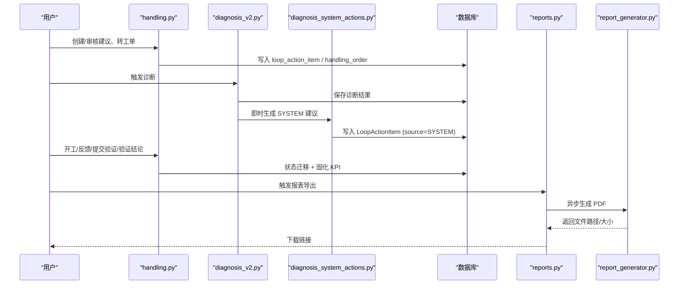
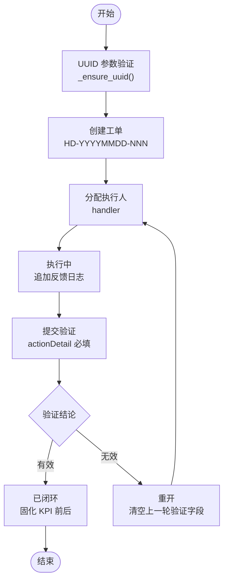
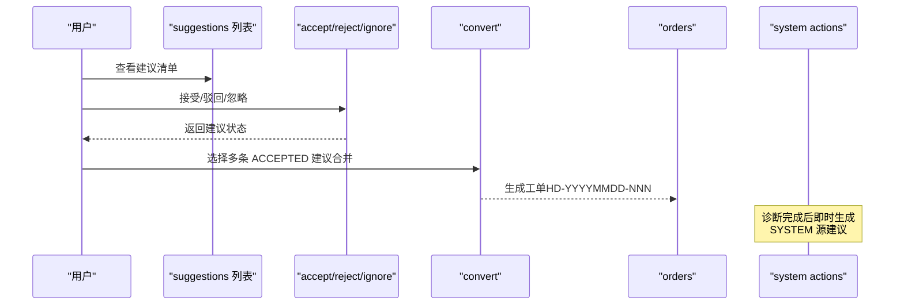
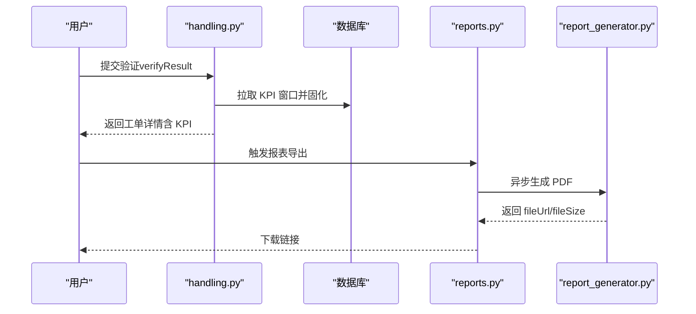
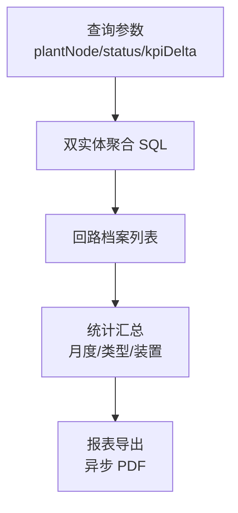
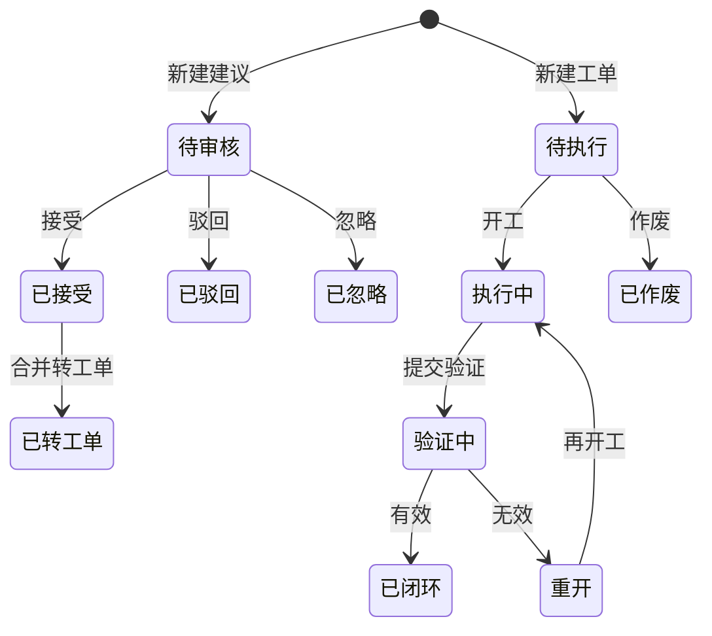
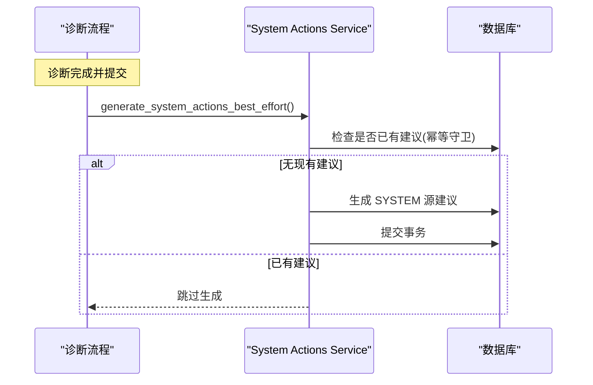
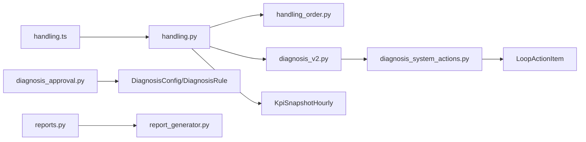

# 处置工作流接口

<cite>
**本文引用的文件**
- [handling.py](file://backend/app/api/v1/endpoints/handling.py)
- [handling_order.py](file://backend/app/models/handling_order.py)
- [diagnosis_v2.py](file://backend/app/api/v1/endpoints/diagnosis_v2.py)
- [diagnosis_approval.py](file://backend/app/services/diagnosis_approval.py)
- [diagnosis_system_actions.py](file://backend/app/services/diagnosis_system_actions.py)
- [task.py](file://backend/app/schemas/task.py)
- [report_generator.py](file://backend/app/tasks/report_generator.py)
- [reports.py](file://backend/app/api/v1/endpoints/reports.py)
- [handling.ts](file://frontend/apps/web-antd/src/api/handling.ts)
</cite>

## 更新摘要
**变更内容**
- 增强了 UUID 参数验证和防御性编程，防止因格式错误的 ID 导致 500 错误
- 新增了 diagnosis_system_actions.py 服务，在数据库提交后立即生成 SYSTEM 源诊断建议
- 更新了处置建议生成机制，从懒生成改为即时生成，确保处置工作台始终有数据
- 增强了错误处理机制，提供更友好的错误响应

## 目录
1. [简介](#简介)
2. [项目结构](#项目结构)
3. [核心组件](#核心组件)
4. [架构总览](#架构总览)
5. [详细组件分析](#详细组件分析)
6. [依赖关系分析](#依赖关系分析)
7. [性能考虑](#性能考虑)
8. [故障排查指南](#故障排查指南)
9. [结论](#结论)
10. [附录：API 清单与状态机](#附录api-清单与状态机)

## 简介
本文件为 CLPM-MVP 处置工作流模块的完整 API 文档，覆盖以下能力：
- 工单管理：创建工单、分配任务、状态跟踪、完成确认
- 建议审核：诊断建议提交、审核流程、审批记录
- 效果验证：验证数据采集、效果评估、报告生成
- 归档管理：历史归档、统计查询、报表导出
- 工作流状态机、权限控制、消息通知机制说明
- 处置流程最佳实践与问题处理指南

**最新更新**：增强了系统健壮性和用户体验，通过 UUID 参数验证防止 500 错误，并通过即时建议生成确保处置工作台数据的实时可用性。

## 项目结构
处置工作流后端以 FastAPI 路由组织，核心在 handling 端点；数据模型定义在 handling_order；建议与诊断联动通过 diagnosis 相关端点与服务；新增的 diagnosis_system_actions 服务负责即时生成 SYSTEM 源诊断建议；报表与异步任务由 report generator 与 reports 端点支撑；前端调用封装在 handling.ts。

**图表来源**
- [handling.py:1-30](file://backend/app/api/v1/endpoints/handling.py#L1-L30)
- [handling_order.py:1-10](file://backend/app/models/handling_order.py#L1-L10)
- [diagnosis_v2.py:377-418](file://backend/app/api/v1/endpoints/diagnosis_v2.py#L377-L418)
- [diagnosis_approval.py:1-10](file://backend/app/services/diagnosis_approval.py#L1-L10)
- [diagnosis_system_actions.py:1-119](file://backend/app/services/diagnosis_system_actions.py#L1-L119)
- [reports.py:397-424](file://backend/app/api/v1/endpoints/reports.py#L397-L424)
- [report_generator.py:161-196](file://backend/app/tasks/report_generator.py#L161-L196)
- [task.py:1-13](file://backend/app/schemas/task.py#L1-L13)

**章节来源**
- [handling.py:1-30](file://backend/app/api/v1/endpoints/handling.py#L1-L30)
- [handling_order.py:1-10](file://backend/app/models/handling_order.py#L1-L10)

## 核心组件
- 处置建议（LoopActionItem）：建议生命周期 PENDING → ACCEPTED/REJECTED/IGNORED，可合并转工单
- 处置工单（HandlingOrder）：执行闭环载体，PENDING → EXECUTING → VERIFYING → CLOSED/REOPENED，支持 CANCELLED
- KPI 前后对比：基于 started_at/submitted_at 窗口拉取快照，验证时固化
- 诊断复核：对诊断运行结果进行人工复核并重新带出系统建议
- 配置变更审批：关键配置变更双人确认审批后自动应用
- 报表导出：异步 PDF 导出，任务状态与下载链接管理
- **新增**：系统建议即时生成：诊断完成后立即生成 SYSTEM 源处置建议，无需等待懒加载

**章节来源**
- [handling.py:75-95](file://backend/app/api/v1/endpoints/handling.py#L75-L95)
- [handling_order.py:22-35](file://backend/app/models/handling_order.py#L22-L35)
- [handling.py:300-362](file://backend/app/api/v1/endpoints/handling.py#L300-L362)
- [diagnosis_v2.py:377-418](file://backend/app/api/v1/endpoints/diagnosis_v2.py#L377-L418)
- [diagnosis_approval.py:33-89](file://backend/app/services/diagnosis_approval.py#L33-L89)
- [diagnosis_system_actions.py:46-119](file://backend/app/services/diagnosis_system_actions.py#L46-L119)
- [reports.py:397-424](file://backend/app/api/v1/endpoints/reports.py#L397-L424)

## 架构总览
处置工作流采用"双实体"设计：建议侧负责审核流转，工单侧负责执行闭环。KPI 快照作为效果验证依据，诊断复核驱动建议重算，新增的系统建议服务确保诊断完成后立即生成处置建议，报表导出提供离线产物。

**图表来源**
- [handling.py:625-787](file://backend/app/api/v1/endpoints/handling.py#L625-L787)
- [handling.py:996-1179](file://backend/app/api/v1/endpoints/handling.py#L996-L1179)
- [diagnosis_v2.py:377-418](file://backend/app/api/v1/endpoints/diagnosis_v2.py#L377-L418)
- [diagnosis_system_actions.py:100-119](file://backend/app/services/diagnosis_system_actions.py#L100-L119)
- [diagnosis_approval.py:107-185](file://backend/app/services/diagnosis_approval.py#L107-L185)
- [reports.py:397-424](file://backend/app/api/v1/endpoints/reports.py#L397-L424)
- [report_generator.py:161-196](file://backend/app/tasks/report_generator.py#L161-L196)

## 详细组件分析

### 工单管理接口
- 创建工单：手动新建或从已接受建议合并转工单；生成当日唯一编号 HD-YYYYMMDD-NNN，并发冲突重试一次
- 分配任务：开工时填写 handler（缺省当前用户），TUNING 类型可回填 pidBefore
- 状态跟踪：清单分页、按状态分组排序；详情包含 action_detail、feedback_log、KPI 固化、来源建议摘要
- 完成确认：提交验证后进入 VERIFYING，验证结论 EFFECTIVE/INEFFECTIVE 决定 CLOSED/REOPENED，并回写整定记录状态
- **增强**：UUID 参数验证：所有路径参数都经过 _ensure_uuid 函数验证，防止格式错误的 ID 导致 500 错误

**图表来源**
- [handling.py:113-120](file://backend/app/api/v1/endpoints/handling.py#L113-L120)
- [handling.py:394-402](file://backend/app/api/v1/endpoints/handling.py#L394-L402)
- [handling.py:996-1040](file://backend/app/api/v1/endpoints/handling.py#L996-L1040)
- [handling.py:1043-1083](file://backend/app/api/v1/endpoints/handling.py#L1043-L1083)
- [handling.py:1107-1133](file://backend/app/api/v1/endpoints/handling.py#L1107-L1133)
- [handling.py:1136-1179](file://backend/app/api/v1/endpoints/handling.py#L1136-L1179)

**章节来源**
- [handling.py:625-787](file://backend/app/api/v1/endpoints/handling.py#L625-L787)
- [handling.py:866-993](file://backend/app/api/v1/endpoints/handling.py#L866-L993)
- [handling.py:996-1179](file://backend/app/api/v1/endpoints/handling.py#L996-L1179)
- [handling_order.py:38-94](file://backend/app/models/handling_order.py#L38-L94)

### 建议审核接口
- 诊断建议提交：支持手动新增建议（source=MANUAL）与系统建议（来自诊断）
- 审核流程：接受（PENDING→ACCEPTED）、驳回（PENDING→REJECTED）、忽略（PENDING→IGNORED）
- 审批记录：记录审核人/时间、原因；多建议可合并转工单（ACCEPTED→CONVERTED）
- **改进**：系统建议即时生成：诊断完成后立即生成 SYSTEM 源处置建议，无需等待懒加载

**图表来源**
- [handling.py:552-622](file://backend/app/api/v1/endpoints/handling.py#L552-L622)
- [handling.py:625-714](file://backend/app/api/v1/endpoints/handling.py#L625-L714)
- [handling.py:717-787](file://backend/app/api/v1/endpoints/handling.py#L717-L787)
- [diagnosis_system_actions.py:100-119](file://backend/app/services/diagnosis_system_actions.py#L100-L119)

**章节来源**
- [handling.py:552-714](file://backend/app/api/v1/endpoints/handling.py#L552-L714)
- [handling.py:717-787](file://backend/app/api/v1/endpoints/handling.py#L717-L787)

### 效果验证接口
- 验证数据采集：VERIFYING 阶段可预览 KPI 前后对比（started_at ±24h、submitted_at ±24h）
- 效果评估：验证结论 EFFECTIVE/INEFFECTIVE，服务端固化 kpi_before/kpi_after
- 报告生成：通过报表导出任务异步生成 PDF，返回文件路径与大小

**图表来源**
- [handling.py:1202-1227](file://backend/app/api/v1/endpoints/handling.py#L1202-L1227)
- [handling.py:1136-1179](file://backend/app/api/v1/endpoints/handling.py#L1136-L1179)
- [reports.py:397-424](file://backend/app/api/v1/endpoints/reports.py#L397-L424)
- [report_generator.py:161-196](file://backend/app/tasks/report_generator.py#L161-L196)

**章节来源**
- [handling.py:1202-1227](file://backend/app/api/v1/endpoints/handling.py#L1202-L1227)
- [handling.py:1136-1179](file://backend/app/api/v1/endpoints/handling.py#L1136-L1179)
- [reports.py:397-424](file://backend/app/api/v1/endpoints/reports.py#L397-L424)
- [report_generator.py:161-196](file://backend/app/tasks/report_generator.py#L161-L196)

### 归档管理接口
- 历史归档：按回路聚合（建议五态分布 + 工单六态分布 + 闭环率 + 最近闭环 KPI delta）
- 统计查询：月度趋势、类型分布、装置分布、Top 重开回路
- 报表导出：PDF 导出任务，状态管理与下载

**图表来源**
- [handling.py:1234-1285](file://backend/app/api/v1/endpoints/handling.py#L1234-L1285)
- [handling.py:1350-1449](file://backend/app/api/v1/endpoints/handling.py#L1350-L1449)
- [handling.py:1452-1599](file://backend/app/api/v1/endpoints/handling.py#L1452-L1599)
- [reports.py:397-424](file://backend/app/api/v1/endpoints/reports.py#L397-L424)

**章节来源**
- [handling.py:1234-1449](file://backend/app/api/v1/endpoints/handling.py#L1234-L1449)
- [handling.py:1452-1599](file://backend/app/api/v1/endpoints/handling.py#L1452-L1599)
- [reports.py:397-424](file://backend/app/api/v1/endpoints/reports.py#L397-L424)

### 工作流状态机
- 建议状态机：PENDING → ACCEPTED/REJECTED/IGNORED；ACCEPTED → CONVERTED
- 工单状态机：PENDING → EXECUTING → VERIFYING → CLOSED/REOPENED；PENDING → CANCELLED
- 终态不可重开（CONVERTED/REJECTED/IGNORED/CLOSED/CANCELLED）

**图表来源**
- [handling.py:75-92](file://backend/app/api/v1/endpoints/handling.py#L75-L92)
- [handling_order.py:34-35](file://backend/app/models/handling_order.py#L34-L35)

**章节来源**
- [handling.py:75-92](file://backend/app/api/v1/endpoints/handling.py#L75-L92)
- [handling_order.py:34-35](file://backend/app/models/handling_order.py#L34-L35)

### 权限控制
- 建议与工单操作角色：IC_ENGINEER、PE_ENGINEER、ADMIN
- 诊断复核角色：诊断触发角色集合
- 配置变更审批：双人确认（审批人不能与申请人相同）

**章节来源**
- [handling.py:60-61](file://backend/app/api/v1/endpoints/handling.py#L60-L61)
- [diagnosis_v2.py:377-383](file://backend/app/api/v1/endpoints/diagnosis_v2.py#L377-L383)
- [diagnosis_approval.py:107-145](file://backend/app/services/diagnosis_approval.py#L107-L145)

### 消息通知
- 任务通知：任务状态变化（SUCCESS/FAILED）通过任务追踪器生成通知，系统任务不向个人推送
- 预警通知：规则引擎创建跟踪工单后发布站内信 WebSocket 推送（按角色广播）

**章节来源**
- [task.py:124-168](file://backend/app/schemas/task.py#L124-L168)
- [test_api_tasks.py:1639-1676](file://backend/tests/test_api_tasks.py#L1639-L1676)
- [dispatcher.py:180-225](file://backend/app/services/alert_rule_engine/dispatcher.py#L180-L225)

### 系统建议即时生成服务
**新增功能**：diagnosis_system_actions.py 服务实现了诊断完成后立即生成 SYSTEM 源处置建议的功能。

- **核心功能**：根据诊断结论或人工复核结果自动生成标准处置建议
- **幂等保护**：内置幂等守卫，避免重复生成建议
- **容错处理**：使用 best_effort 模式，生成失败不影响主诊断流程
- **分类映射**：支持多种诊断类别（参数问题、阀门问题、仪表问题等）的标准建议模板

**图表来源**
- [diagnosis_system_actions.py:100-119](file://backend/app/services/diagnosis_system_actions.py#L100-L119)
- [diagnosis_system_actions.py:46-97](file://backend/app/services/diagnosis_system_actions.py#L46-L97)

**章节来源**
- [diagnosis_system_actions.py:1-119](file://backend/app/services/diagnosis_system_actions.py#L1-L119)

## 依赖关系分析
- handling.py 依赖 handling_order.py 模型、diagnosis_v2.py 分类标签、KPI 快照表
- diagnosis_approval.py 依赖诊断配置/规则/触发器模型，并在审批通过后自动应用变更
- **新增**：diagnosis_system_actions.py 被诊断编排器和任务引用，实现即时建议生成
- reports.py 与 report_generator.py 协作完成异步 PDF 导出
- 前端 handling.ts 封装了所有处置工作流 API 调用

**图表来源**
- [handling.py:44-56](file://backend/app/api/v1/endpoints/handling.py#L44-L56)
- [handling_order.py:38-94](file://backend/app/models/handling_order.py#L38-L94)
- [diagnosis_approval.py:24-28](file://backend/app/services/diagnosis_approval.py#L24-L28)
- [diagnosis_system_actions.py:23-25](file://backend/app/services/diagnosis_system_actions.py#L23-L25)
- [reports.py:397-424](file://backend/app/api/v1/endpoints/reports.py#L397-L424)
- [report_generator.py:161-196](file://backend/app/tasks/report_generator.py#L161-L196)
- [handling.ts:553-633](file://frontend/apps/web-antd/src/api/handling.ts#L553-L633)

**章节来源**
- [handling.py:44-56](file://backend/app/api/v1/endpoints/handling.py#L44-L56)
- [handling_order.py:38-94](file://backend/app/models/handling_order.py#L38-L94)
- [diagnosis_approval.py:24-28](file://backend/app/services/diagnosis_approval.py#L24-L28)
- [diagnosis_system_actions.py:23-25](file://backend/app/services/diagnosis_system_actions.py#L23-L25)
- [reports.py:397-424](file://backend/app/api/v1/endpoints/reports.py#L397-L424)
- [report_generator.py:161-196](file://backend/app/tasks/report_generator.py#L161-L196)
- [handling.ts:553-633](file://frontend/apps/web-antd/src/api/handling.ts#L553-L633)

## 性能考虑
- 编号生成：order_no 使用 COUNT+1，并发冲突时重试一次，避免唯一约束失败
- 窗口查询：KPI 前后窗口仅取最新一条有 score 的记录，减少 IO
- 聚合查询：双实体聚合使用子查询与 HAVING 语义，避免多次往返
- 异步导出：PDF 生成走 Celery 任务，避免阻塞请求
- **优化**：UUID 验证前置：在数据库查询前进行参数验证，避免无效查询
- **优化**：系统建议幂等：避免重复生成建议，减少数据库写入压力

**章节来源**
- [handling.py:394-402](file://backend/app/api/v1/endpoints/handling.py#L394-L402)
- [handling.py:323-362](file://backend/app/api/v1/endpoints/handling.py#L323-L362)
- [handling.py:1234-1285](file://backend/app/api/v1/endpoints/handling.py#L1234-L1285)
- [handling.py:113-120](file://backend/app/api/v1/endpoints/handling.py#L113-L120)
- [diagnosis_system_actions.py:55-61](file://backend/app/services/diagnosis_system_actions.py#L55-L61)
- [reports.py:397-424](file://backend/app/api/v1/endpoints/reports.py#L397-L424)

## 故障排查指南
- 状态非法：ERR_STATE 400，检查当前状态是否允许该动作
- 参数错误：ERR_PARAM 400，检查必填字段与枚举值
- **新增**：UUID 格式错误：ERR_PARAM 400，检查 ID 是否为有效的 UUID 格式
- 未找到资源：ERR_NOT_FOUND 404，检查 ID 是否存在
- 并发冲突：order_no 唯一约束冲突，自动重试一次；若仍失败需检查并发量
- 报表导出失败：检查导出任务状态与错误信息，确认存储路径与权限
- **新增**：系统建议生成失败：检查日志中的即时生成错误，但不影响主诊断流程

**章节来源**
- [handling.py:109-127](file://backend/app/api/v1/endpoints/handling.py#L109-L127)
- [handling.py:113-120](file://backend/app/api/v1/endpoints/handling.py#L113-L120)
- [handling.py:280-297](file://backend/app/api/v1/endpoints/handling.py#L280-L297)
- [handling.py:753-787](file://backend/app/api/v1/endpoints/handling.py#L753-L787)
- [diagnosis_system_actions.py:112-118](file://backend/app/services/diagnosis_system_actions.py#L112-L118)
- [reports.py:397-424](file://backend/app/api/v1/endpoints/reports.py#L397-L424)

## 结论
处置工作流模块通过"建议-工单"双实体实现完整的诊断到执行的闭环，结合 KPI 窗口验证、诊断复核、配置审批与报表导出，形成可审计、可追溯、可扩展的处置体系。**最新更新**增强了系统的健壮性和用户体验：通过 UUID 参数验证防止 500 错误，通过即时建议生成确保处置工作台数据的实时可用性。建议在生产环境中关注并发编号生成、KPI 窗口数据质量、异步任务稳定性以及系统建议生成的可靠性。

## 附录：API 清单与状态机
- 建议侧：GET/POST /handling/suggestions，POST /handling/suggestions/{id}/accept|reject|ignore，POST /handling/suggestions/convert
- 工单侧：GET/POST /handling/orders，POST /handling/orders/{id}/start|feedback|submit|verify|cancel，GET /handling/orders/{id}，POST /handling/orders/{id}/kpi-comparison
- 聚合与统计：GET /handling/loops，GET /handling/statistics
- 诊断复核：POST /diagnosis/runs/{run_id}/review
- 配置审批：CRUD 变更请求，审批通过后自动应用
- 报表导出：异步 PDF 生成，任务状态与下载
- **新增**：系统建议生成：诊断完成后自动触发，无需手动调用

**章节来源**
- [handling.py:552-787](file://backend/app/api/v1/endpoints/handling.py#L552-L787)
- [handling.py:866-1227](file://backend/app/api/v1/endpoints/handling.py#L866-L1227)
- [handling.py:1350-1599](file://backend/app/api/v1/endpoints/handling.py#L1350-L1599)
- [diagnosis_v2.py:377-418](file://backend/app/api/v1/endpoints/diagnosis_v2.py#L377-L418)
- [diagnosis_approval.py:33-185](file://backend/app/services/diagnosis_approval.py#L33-L185)
- [diagnosis_system_actions.py:46-119](file://backend/app/services/diagnosis_system_actions.py#L46-L119)
- [reports.py:397-424](file://backend/app/api/v1/endpoints/reports.py#L397-L424)
- [report_generator.py:161-196](file://backend/app/tasks/report_generator.py#L161-L196)