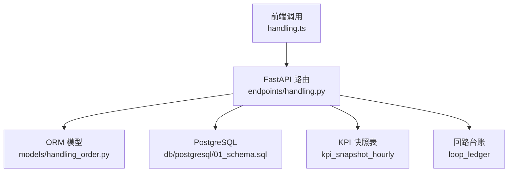
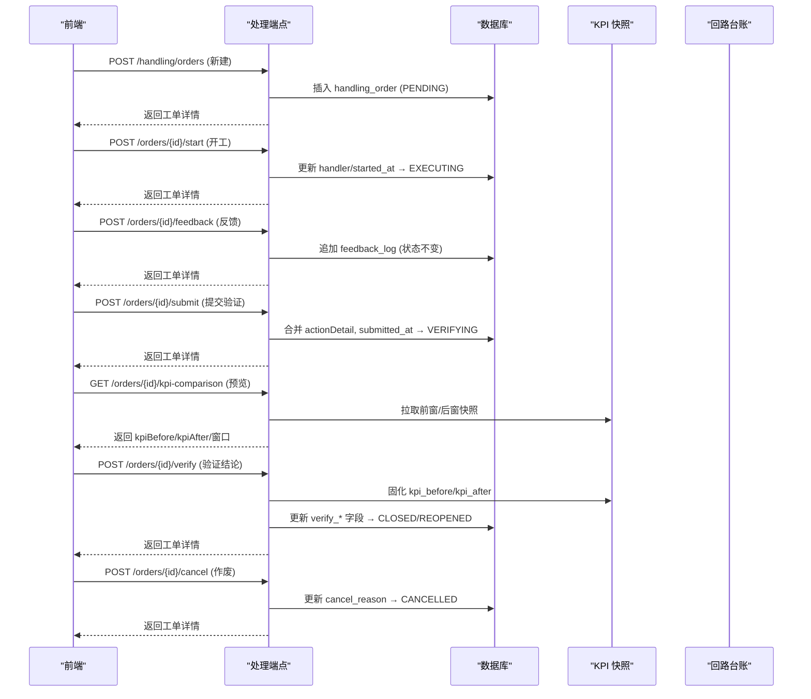
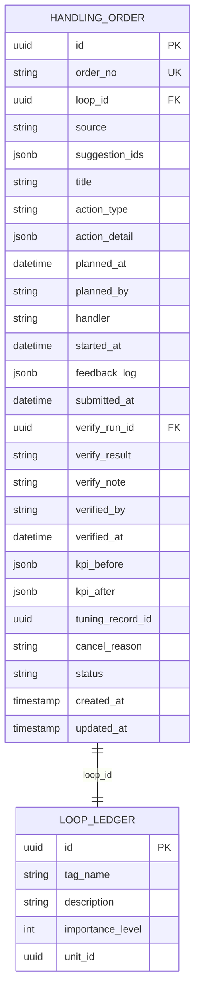
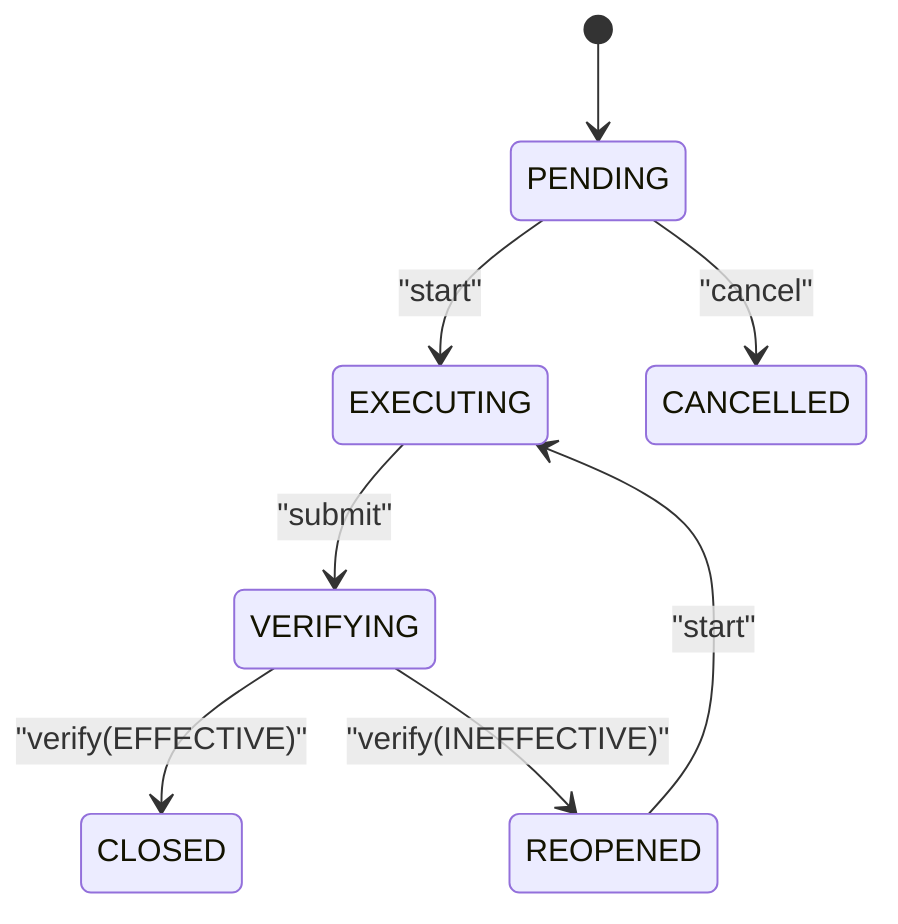
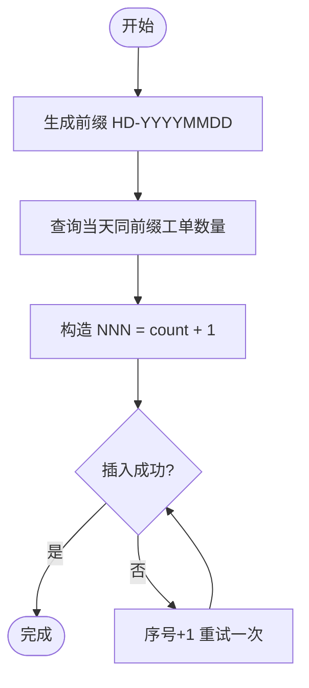
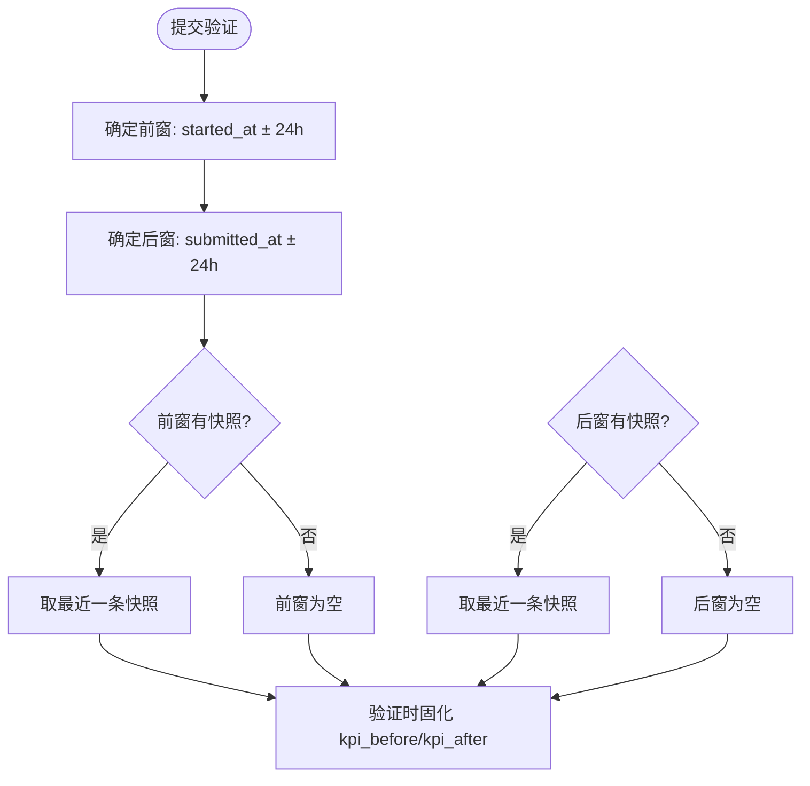
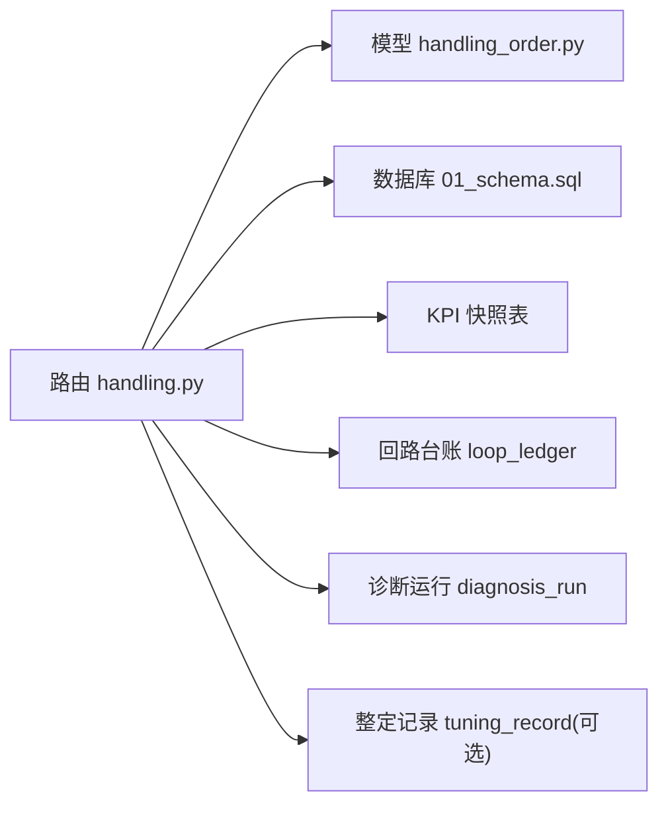

# 工单管理接口

<cite>
**本文引用的文件**
- [handling_order.py](file://backend/app/models/handling_order.py)
- [handling.py](file://backend/app/api/v1/endpoints/handling.py)
- [01_schema.sql](file://db/postgresql/01_schema.sql)
- [handling.ts](file://frontend/apps/web-antd/src/api/handling.ts)
- [constants.ts](file://frontend/apps/web-antd/src/views/handling/constants.ts)
- [test_handling_api.py](file://backend/tests/test_handling_api.py)
</cite>

## 目录
1. [简介](#简介)
2. [项目结构](#项目结构)
3. [核心组件](#核心组件)
4. [架构总览](#架构总览)
5. [详细组件分析](#详细组件分析)
6. [依赖关系分析](#依赖关系分析)
7. [性能考虑](#性能考虑)
8. [故障排查指南](#故障排查指南)
9. [结论](#结论)
10. [附录](#附录)

## 简介
本文件为 CLPM-MVP 处置工作流模块的“工单管理”能力提供完整 API 文档，覆盖工单的创建、开工、反馈、提交验证、效果验证、作废等全生命周期操作；明确状态机流转与类型枚举；说明工单编号生成规则（HD-YYYYMMDD-NNN，按日重置序号）；给出工单详情查询、反馈日志追加、KPI 前后对比等关键功能；并阐述工单与回路的关联关系及数据完整性保证机制。

## 项目结构
处置模块采用 FastAPI 路由 + SQLAlchemy ORM 模型 + PostgreSQL 持久化的分层设计：
- 模型层：定义工单实体、约束与索引
- 服务/端点层：实现业务校验、状态机迁移、KPI 窗口计算与聚合统计
- 前端调用层：封装各端点的请求方法，统一返回格式

图表来源
- [handling.py:1-30](file://backend/app/api/v1/endpoints/handling.py#L1-L30)
- [handling_order.py:1-121](file://backend/app/models/handling_order.py#L1-L121)
- [01_schema.sql:1724-1742](file://db/postgresql/01_schema.sql#L1724-L1742)

章节来源
- [handling.py:1-30](file://backend/app/api/v1/endpoints/handling.py#L1-L30)
- [handling_order.py:1-121](file://backend/app/models/handling_order.py#L1-L121)
- [01_schema.sql:1724-1742](file://db/postgresql/01_schema.sql#L1724-L1742)

## 核心组件
- 工单模型 HandlingOrder：定义字段、约束、索引与注释，包含状态机、类型枚举、KPI 快照字段、关联回路等
- 处置模块 API：建议侧与工单侧的 CRUD 与状态迁移，含编号生成、过滤排序、聚合统计
- 数据库约束：通过 CheckConstraint 强制状态、类型、来源、验证结果合法取值
- 前端 API 封装：统一调用后端 /handling/* 端点

章节来源
- [handling_order.py:22-35](file://backend/app/models/handling_order.py#L22-L35)
- [handling_order.py:43-120](file://backend/app/models/handling_order.py#L43-L120)
- [handling.py:60-95](file://backend/app/api/v1/endpoints/handling.py#L60-L95)
- [handling.ts:590-633](file://frontend/apps/web-antd/src/api/handling.ts#L590-L633)

## 架构总览
处置模块围绕“建议→工单→执行→验证→闭环/重开/作废”的主线展开，关键流程如下：

图表来源
- [handling.py:996-1040](file://backend/app/api/v1/endpoints/handling.py#L996-L1040)
- [handling.py:1043-1083](file://backend/app/api/v1/endpoints/handling.py#L1043-L1083)
- [handling.py:1086-1104](file://backend/app/api/v1/endpoints/handling.py#L1086-L1104)
- [handling.py:1107-1133](file://backend/app/api/v1/endpoints/handling.py#L1107-L1133)
- [handling.py:1202-1227](file://backend/app/api/v1/endpoints/handling.py#L1202-L1227)
- [handling.py:1136-1179](file://backend/app/api/v1/endpoints/handling.py#L1136-L1179)
- [handling.py:1182-1199](file://backend/app/api/v1/endpoints/handling.py#L1182-L1199)

## 详细组件分析

### 工单模型与数据完整性
- 主键与编号：order_no 唯一，格式 HD-YYYYMMDD-NNN，按日重置序号，服务端生成
- 关联回路：loop_id 外键指向 loop_ledger，级联删除
- 来源与类型：source 限定 DIAGNOSIS/MANUAL；action_type 限定 8 类
- 状态机：status 限定 PENDING/EXECUTING/VERIFYING/CLOSED/REOPENED/CANCELLED
- 验证结果：verify_result 限定 EFFECTIVE/INEFFECTIVE
- 索引：按 status+updated_at、loop_id、planned_at 优化查询

图表来源
- [handling_order.py:43-120](file://backend/app/models/handling_order.py#L43-L120)
- [01_schema.sql:1724-1742](file://db/postgresql/01_schema.sql#L1724-L1742)

章节来源
- [handling_order.py:22-35](file://backend/app/models/handling_order.py#L22-L35)
- [handling_order.py:43-120](file://backend/app/models/handling_order.py#L43-L120)
- [01_schema.sql:1724-1742](file://db/postgresql/01_schema.sql#L1724-L1742)

### 工单状态机
- 初始态：PENDING（待执行）
- 执行态：EXECUTING（执行中）
- 验证态：VERIFYING（验证中）
- 终态：CLOSED（已闭环）、CANCELLED（已作废）
- 重开态：REOPENED（可再次开工进入新一轮）

图表来源
- [handling_order.py:34-35](file://backend/app/models/handling_order.py#L34-L35)
- [handling_order.py:92-94](file://backend/app/models/handling_order.py#L92-L94)
- [handling.py:1043-1083](file://backend/app/api/v1/endpoints/handling.py#L1043-L1083)
- [handling.py:1107-1133](file://backend/app/api/v1/endpoints/handling.py#L1107-L1133)
- [handling.py:1136-1179](file://backend/app/api/v1/endpoints/handling.py#L1136-L1179)
- [handling.py:1182-1199](file://backend/app/api/v1/endpoints/handling.py#L1182-L1199)

章节来源
- [handling_order.py:34-35](file://backend/app/models/handling_order.py#L34-L35)
- [handling_order.py:92-94](file://backend/app/models/handling_order.py#L92-L94)
- [handling.py:1043-1083](file://backend/app/api/v1/endpoints/handling.py#L1043-L1083)
- [handling.py:1107-1133](file://backend/app/api/v1/endpoints/handling.py#L1107-L1133)
- [handling.py:1136-1179](file://backend/app/api/v1/endpoints/handling.py#L1136-L1179)
- [handling.py:1182-1199](file://backend/app/api/v1/endpoints/handling.py#L1182-L1199)

### 工单类型枚举
- TUNING：参数整定
- VALVE：阀门检修
- INSTRUMENT：仪表校验
- LINK：链路修复
- PROCESS：工艺调整
- UTILIZATION：恢复投用
- RECONFIG：组态改造
- OTHER：其他

章节来源
- [handling_order.py:22-32](file://backend/app/models/handling_order.py#L22-L32)
- [handling.py:64-73](file://backend/app/api/v1/endpoints/handling.py#L64-L73)

### 工单编号生成规则
- 格式：HD-YYYYMMDD-NNN
- 规则：按当日日期作为前缀，序号基于当天已有工单数量 +1 生成
- 并发安全：若唯一冲突则自动 bump 序号重试一次

图表来源
- [handling.py:394-402](file://backend/app/api/v1/endpoints/handling.py#L394-L402)
- [handling.py:753-787](file://backend/app/api/v1/endpoints/handling.py#L753-L787)
- [handling.py:1013-1040](file://backend/app/api/v1/endpoints/handling.py#L1013-L1040)

章节来源
- [handling.py:394-402](file://backend/app/api/v1/endpoints/handling.py#L394-L402)
- [handling.py:753-787](file://backend/app/api/v1/endpoints/handling.py#L753-L787)
- [handling.py:1013-1040](file://backend/app/api/v1/endpoints/handling.py#L1013-L1040)

### 工单与回路的关联关系
- 每个工单必须关联一个回路（loop_id），用于后续 KPI 快照拉取与效果评估
- 清单与详情会回填回路位号、描述、重要性等级、装置路径等信息
- 数据完整性由外键约束与存在性校验共同保障

章节来源
- [handling_order.py:48-53](file://backend/app/models/handling_order.py#L48-L53)
- [handling.py:405-411](file://backend/app/api/v1/endpoints/handling.py#L405-L411)
- [handling.py:969-993](file://backend/app/api/v1/endpoints/handling.py#L969-L993)

### 工单详情查询
- 获取单个工单详情，包含：基础信息、action_detail、feedback_log、KPI 固化快照、来源建议摘要、回路信息等
- 列表支持分页与多维筛选（状态、类型、来源、回路、处置人、关键词、计划时间、装置节点）

章节来源
- [handling.py:866-937](file://backend/app/api/v1/endpoints/handling.py#L866-L937)
- [handling.py:969-993](file://backend/app/api/v1/endpoints/handling.py#L969-L993)
- [handling.ts:590-601](file://frontend/apps/web-antd/src/api/handling.ts#L590-L601)

### 反馈日志追加
- 在 EXECUTING 状态下可多次追加反馈，每条记录包含时间、操作人、内容
- 反馈不改变工单状态，仅扩展执行过程的可追溯信息

章节来源
- [handling.py:1086-1104](file://backend/app/api/v1/endpoints/handling.py#L1086-L1104)
- [handling_order.py:70-71](file://backend/app/models/handling_order.py#L70-L71)
- [test_handling_api.py:645-672](file://backend/tests/test_handling_api.py#L645-L672)

### KPI 前后对比
- 窗口定义：前窗 [started_at - 24h, started_at]，后窗 [submitted_at, submitted_at + 24h]
- 预览接口：仅在 VERIFYING 阶段可用，实时拉取快照，不落库
- 固化时机：在 verify 时写入 kpi_before/kpi_after，供后续统计与展示

图表来源
- [handling.py:323-362](file://backend/app/api/v1/endpoints/handling.py#L323-L362)
- [handling.py:1202-1227](file://backend/app/api/v1/endpoints/handling.py#L1202-L1227)
- [handling.py:1164-1179](file://backend/app/api/v1/endpoints/handling.py#L1164-L1179)

章节来源
- [handling.py:323-362](file://backend/app/api/v1/endpoints/handling.py#L323-L362)
- [handling.py:1202-1227](file://backend/app/api/v1/endpoints/handling.py#L1202-L1227)
- [handling.py:1164-1179](file://backend/app/api/v1/endpoints/handling.py#L1164-L1179)

### 状态迁移与错误码
- 所有写端点在 commit 后 refresh 再序列化，避免懒加载导致的 500
- 非法状态迁移统一返回 ERR_STATE 400，参数错误返回 ERR_PARAM 400
- 终态不可重开（CLOSED/CANCELLED）

章节来源
- [handling.py:26-29](file://backend/app/api/v1/endpoints/handling.py#L26-L29)
- [handling.py:109-127](file://backend/app/api/v1/endpoints/handling.py#L109-L127)
- [handling.py:1043-1083](file://backend/app/api/v1/endpoints/handling.py#L1043-L1083)
- [handling.py:1107-1133](file://backend/app/api/v1/endpoints/handling.py#L1107-L1133)
- [handling.py:1136-1179](file://backend/app/api/v1/endpoints/handling.py#L1136-L1179)
- [handling.py:1182-1199](file://backend/app/api/v1/endpoints/handling.py#L1182-L1199)

## 依赖关系分析
- 路由层依赖：当前用户鉴权、数据库会话、异常工具、模型与 Schema
- 模型依赖：HandlingOrder 依赖 LoopLedger、DiagnosisRun、TuningRecord（可选软依赖）
- 外部依赖：PostgreSQL 约束与索引、KPI 快照表、诊断运行记录表

图表来源
- [handling.py:44-56](file://backend/app/api/v1/endpoints/handling.py#L44-L56)
- [handling_order.py:48-89](file://backend/app/models/handling_order.py#L48-L89)
- [01_schema.sql:1724-1742](file://db/postgresql/01_schema.sql#L1724-L1742)

章节来源
- [handling.py:44-56](file://backend/app/api/v1/endpoints/handling.py#L44-L56)
- [handling_order.py:48-89](file://backend/app/models/handling_order.py#L48-L89)
- [01_schema.sql:1724-1742](file://db/postgresql/01_schema.sql#L1724-L1742)

## 性能考虑
- 列表查询使用状态分组排序 SQL 与索引（status+updated_at DESC）提升排序性能
- 装置节点递归下钻使用 WITH RECURSIVE 子查询一次性获取单元 ID 集合
- KPI 窗口查询限制为最近一条有效快照，减少 IO 压力
- 并发编号生成通过唯一约束兜底与一次重试，降低锁竞争影响

章节来源
- [handling.py:484-488](file://backend/app/api/v1/endpoints/handling.py#L484-L488)
- [handling.py:454-472](file://backend/app/api/v1/endpoints/handling.py#L454-L472)
- [handling.py:323-339](file://backend/app/api/v1/endpoints/handling.py#L323-L339)
- [handling.py:394-402](file://backend/app/api/v1/endpoints/handling.py#L394-L402)

## 故障排查指南
- 状态迁移失败：检查当前状态是否允许该动作，确认未处于终态
- 参数错误：核对必填字段（如 content、actionDetail、verifyResult、cancelReason）
- 编号冲突：系统会自动重试一次，若仍失败需检查并发写入或数据库唯一约束
- KPI 对比为空：确认窗口内是否存在有效快照，或窗口边界是否正确
- 权限问题：确保当前用户具备 IC_ENGINEER/PE_ENGINEER/ADMIN 角色

章节来源
- [handling.py:109-127](file://backend/app/api/v1/endpoints/handling.py#L109-L127)
- [handling.py:394-402](file://backend/app/api/v1/endpoints/handling.py#L394-L402)
- [handling.py:1202-1227](file://backend/app/api/v1/endpoints/handling.py#L1202-L1227)
- [handling.py:60-61](file://backend/app/api/v1/endpoints/handling.py#L60-L61)

## 结论
本模块以严格的数据库约束与服务端状态机校验为核心，结合 KPI 窗口化前后对比，实现了从建议到工单再到闭环的全链路可追溯管理。通过清晰的类型枚举、编号生成规则与丰富的查询聚合能力，既保证了数据一致性，又提升了运维与决策效率。

## 附录

### API 端点一览（工单侧）
- 创建工单：POST /handling/orders
- 开工：POST /handling/orders/{id}/start
- 执行反馈：POST /handling/orders/{id}/feedback
- 提交验证：POST /handling/orders/{id}/submit
- 验证结论：POST /handling/orders/{id}/verify
- 作废：POST /handling/orders/{id}/cancel
- KPI 前后对比预览：POST /handling/orders/{id}/kpi-comparison
- 工单清单：GET /handling/orders
- 工单详情：GET /handling/orders/{id}

章节来源
- [handling.py:996-1040](file://backend/app/api/v1/endpoints/handling.py#L996-L1040)
- [handling.py:1043-1083](file://backend/app/api/v1/endpoints/handling.py#L1043-L1083)
- [handling.py:1086-1104](file://backend/app/api/v1/endpoints/handling.py#L1086-L1104)
- [handling.py:1107-1133](file://backend/app/api/v1/endpoints/handling.py#L1107-L1133)
- [handling.py:1136-1179](file://backend/app/api/v1/endpoints/handling.py#L1136-L1179)
- [handling.py:1182-1199](file://backend/app/api/v1/endpoints/handling.py#L1182-L1199)
- [handling.py:1202-1227](file://backend/app/api/v1/endpoints/handling.py#L1202-L1227)
- [handling.py:866-937](file://backend/app/api/v1/endpoints/handling.py#L866-L937)
- [handling.py:969-993](file://backend/app/api/v1/endpoints/handling.py#L969-L993)
- [handling.ts:590-633](file://frontend/apps/web-antd/src/api/handling.ts#L590-L633)

### 前端常量映射
- 工单状态中文名与颜色：待执行/执行中/验证中/已闭环/重开/已作废
- 工单来源：建议转化/手动新建

章节来源
- [constants.ts:204-242](file://frontend/apps/web-antd/src/views/handling/constants.ts#L204-L242)