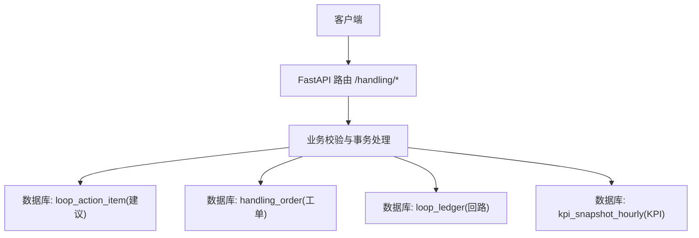
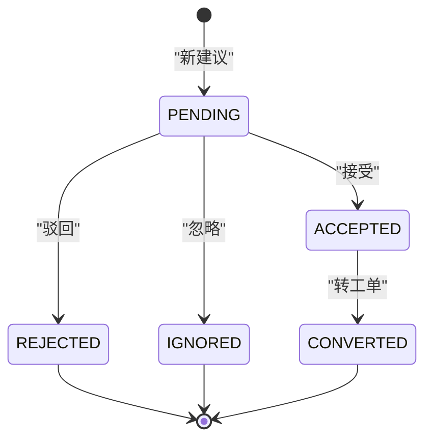
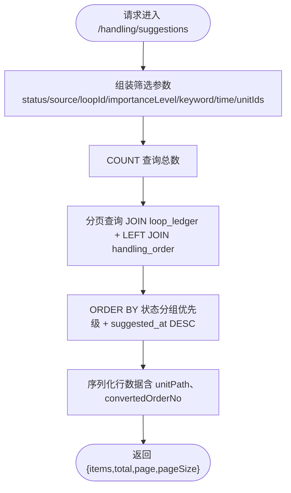
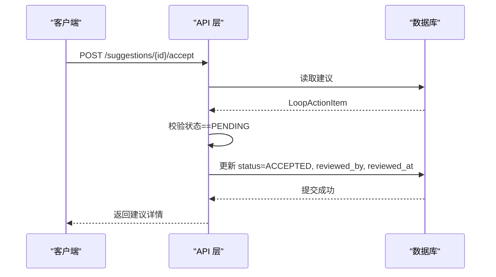
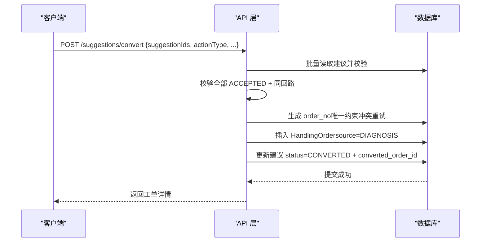
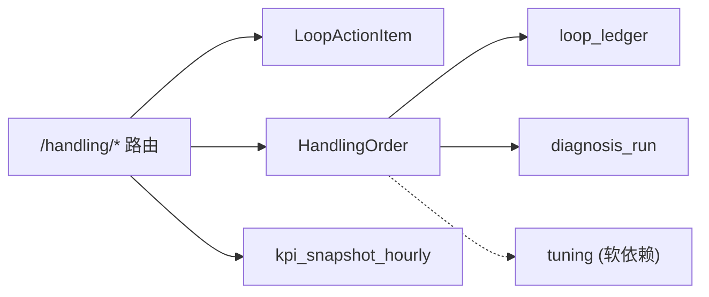

# 建议管理接口

<cite>
**本文引用的文件**
- [handling.py](file://backend/app/api/v1/endpoints/handling.py)
- [handling_order.py](file://backend/app/models/handling_order.py)
- [loop_action_item.py](file://backend/app/models/loop_action_item.py)
- [test_handling_api.py](file://backend/tests/test_handling_api.py)
</cite>

## 目录
1. [简介](#简介)
2. [项目结构](#项目结构)
3. [核心组件](#核心组件)
4. [架构总览](#架构总览)
5. [详细组件分析](#详细组件分析)
6. [依赖关系分析](#依赖关系分析)
7. [性能考虑](#性能考虑)
8. [故障排查指南](#故障排查指南)
9. [结论](#结论)
10. [附录：API 清单与参数说明](#附录api-清单与参数说明)

## 简介
本文件为 CLPM-MVP 处置工作流模块的“建议管理”子系统的 API 文档，覆盖建议的创建、审核（接受/驳回/忽略）、转工单等全生命周期操作；阐述建议状态机与来源区分；说明审核流程中的角色权限控制；提供建议清单的分页、筛选、排序能力说明；并给出多建议合并转工单的批量处理逻辑。

## 项目结构
建议管理功能位于处置模块 v2.0 的双实体设计中：
- 建议实体：LoopActionItem（建议本体，承载诊断或人工录入的建议）
- 工单实体：HandlingOrder（处置执行载体，由建议转化或人工新建）
- 处置 API：/handling/* 端点统一暴露建议与工单的操作能力

图表来源
- [handling.py:1-800](file://backend/app/api/v1/endpoints/handling.py#L1-L800)
- [handling_order.py:1-121](file://backend/app/models/handling_order.py#L1-L121)

章节来源
- [handling.py:1-800](file://backend/app/api/v1/endpoints/handling.py#L1-L800)
- [handling_order.py:1-121](file://backend/app/models/handling_order.py#L1-L121)

## 核心组件
- 建议模型（LoopActionItem）：承载建议内容、来源、重要性级别、状态、审核信息等字段，用于建议的创建、审核与转换。
- 工单模型（HandlingOrder）：承载处置执行闭环所需信息，包括来源（DIAGNOSIS/MANUAL）、关联建议集合、计划时间、执行人、验证结果、KPI 前后快照等。
- 处置 API（/handling/*）：提供建议与工单的全部读写与流转能力，包含强状态机校验、权限控制、分页筛选与排序。

章节来源
- [handling_order.py:1-121](file://backend/app/models/handling_order.py#L1-L121)
- [handling.py:1-800](file://backend/app/api/v1/endpoints/handling.py#L1-L800)

## 架构总览
建议管理遵循“建议→工单”的双阶段工作流：
- 建议阶段：支持 SYSTEM（系统诊断生成）与 MANUAL（人工录入）两种来源；PENDING 待审核 → ACCEPTED/REJECTED/IGNORED/CONVERTED。
- 工单阶段：由 ACCEPTED 建议批量转工单（可多合一），或 MANUAL 直接新建工单；PENDING → EXECUTING → VERIFYING → CLOSED/REOPENED/CANCELLED。

图表来源
- [handling.py:75-92](file://backend/app/api/v1/endpoints/handling.py#L75-L92)

章节来源
- [handling.py:75-92](file://backend/app/api/v1/endpoints/handling.py#L75-L92)

## 详细组件分析

### 建议状态机与来源
- 来源区分
  - SYSTEM：由诊断流程生成的建议（run_id 非空）。
  - MANUAL：人工录入的建议（run_id 为空，source=MANUAL）。
- 状态机
  - PENDING（待审核）→ ACCEPTED（已接受）/ REJECTED（已驳回）/ IGNORED（已忽略）/ CONVERTED（已转工单）。
  - 终态：REJECTED、IGNORED、CONVERTED 不可重开。
- 状态校验
  - 所有写操作均进行状态迁移合法性校验，非法迁移返回 ERR_STATE 400。

章节来源
- [handling.py:75-92](file://backend/app/api/v1/endpoints/handling.py#L75-L92)
- [handling.py:113-127](file://backend/app/api/v1/endpoints/handling.py#L113-L127)

### 权限控制（审核与流转）
- 允许的角色：IC_ENGINEER、PE_ENGINEER、ADMIN。
- 所有建议审核与工单流转端点通过 require_roles 守卫，未授权返回 403。

章节来源
- [handling.py:60-62](file://backend/app/api/v1/endpoints/handling.py#L60-L62)

### 建议清单查询（分页、筛选、排序）
- 分页
  - page（默认 1）、pageSize（默认 20，最大 100）。
- 筛选条件
  - status：多值逗号分隔（如 PENDING,ACCEPTED）。
  - source：SYSTEM 或 MANUAL。
  - loopId：按回路过滤。
  - importanceLevel：1~3 的重要性级别。
  - keyword：模糊匹配回路位号与建议内容。
  - startTime/endTime：ISO 时间范围。
  - plantNodeId：装置节点递归下钻到单元（unit_id 列表）。
- 排序
  - 状态分组优先：PENDING → ACCEPTED → 其他；同组内按 suggested_at 降序。
- 返回字段
  - 包含建议本体字段、回路标签名/描述、重要性级别、单位路径、状态中文名、审核人/时间、拒绝/忽略原因、已转工单编号 convertedOrderNo 等。

图表来源
- [handling.py:522-622](file://backend/app/api/v1/endpoints/handling.py#L522-L622)

章节来源
- [handling.py:522-622](file://backend/app/api/v1/endpoints/handling.py#L522-L622)

### 建议创建（手动新增）
- 入口：POST /handling/suggestions
- 必填：loopId、content（strip 后非空）。
- 可选：basis、priority（1~5）。
- 行为：
  - 校验回路存在性。
  - 创建 LoopActionItem：run_id 置空、source=MANUAL、status=PENDING、suggested_by=当前用户。
  - 提交后刷新并返回建议详情。

章节来源
- [handling.py:625-655](file://backend/app/api/v1/endpoints/handling.py#L625-L655)

### 建议审核（接受/驳回/忽略）
- 接受：POST /handling/suggestions/{id}/accept
  - 仅 PENDING → ACCEPTED；记录 reviewed_by/reviewed_at。
- 驳回：POST /handling/suggestions/{id}/reject
  - 仅 PENDING → REJECTED；rejectedReason 必填。
- 忽略：POST /handling/suggestions/{id}/ignore
  - 仅 PENDING → IGNORED；ignoreReason 必填。
- 错误处理
  - 非 PENDING 状态调用对应动作返回 ERR_STATE 400。
  - 缺失必填理由返回 ERR_PARAM 400。

图表来源
- [handling.py:657-672](file://backend/app/api/v1/endpoints/handling.py#L657-L672)

章节来源
- [handling.py:657-694](file://backend/app/api/v1/endpoints/handling.py#L657-L694)
- [handling.py:697-714](file://backend/app/api/v1/endpoints/handling.py#L697-L714)

### 建议转工单（批量合并）
- 入口：POST /handling/suggestions/convert
- 规则
  - suggestionIds ≥ 1，无重复；全部为 ACCEPTED；同一 loop_id。
  - actionType 必填且属于 8 类枚举。
  - order_no 按日重置序号生成（HD-YYYYMMDD-NNN），并发冲突时重试一次。
  - 多建议合并为一单，各自回链 converted_order_id，状态转为 CONVERTED。
- 返回：工单详情（含 suggestion_ids、action_type、planned_at 等）。

图表来源
- [handling.py:717-787](file://backend/app/api/v1/endpoints/handling.py#L717-L787)

章节来源
- [handling.py:717-787](file://backend/app/api/v1/endpoints/handling.py#L717-L787)

### 工单侧能力概览（与建议联动）
- 工单清单：GET /handling/orders（分页/筛选/状态分组排序）。
- 工单详情：GET /handling/orders/{id}（含来源建议摘要数组）。
- 手动新建工单：POST /handling/orders（source=MANUAL）。
- 开工：POST /handling/orders/{id}/start（PENDING/REOPENED → EXECUTING）。
- 执行反馈：POST /handling/orders/{id}/feedback（追加 feedback_log）。
- 提交验证：POST /handling/orders/{id}/submit（EXECUTING → VERIFYING，TUNING 需 pidAfter）。
- 验证结论：POST /handling/orders/{id}/verify（VERIFYING → CLOSED/REOPENED，固化 KPI）。
- 作废：POST /handling/orders/{id}/cancel（PENDING → CANCELLED）。

章节来源
- [handling.py:1-30](file://backend/app/api/v1/endpoints/handling.py#L1-L30)

## 依赖关系分析
- 模型依赖
  - HandlingOrder 依赖 loop_ledger（回路）、diagnosis_run（复诊记录）、tuning（整定记录，软依赖）。
  - LoopActionItem 作为建议本体，被建议清单与转工单流程使用。
- 服务依赖
  - 处置 API 依赖认证与角色守卫（require_roles）。
  - KPI 窗口计算依赖 kpi_snapshot_hourly。
- 外部模块
  - 整定模块为软依赖，禁用时跳过回写。

图表来源
- [handling_order.py:1-121](file://backend/app/models/handling_order.py#L1-L121)
- [handling.py:365-387](file://backend/app/api/v1/endpoints/handling.py#L365-L387)

章节来源
- [handling_order.py:1-121](file://backend/app/models/handling_order.py#L1-L121)
- [handling.py:365-387](file://backend/app/api/v1/endpoints/handling.py#L365-L387)

## 性能考虑
- 建议清单采用原生 SQL 拼接 WHERE 与 ORDER BY，避免 N+1 查询；unit_path 通过一次性加载 plant_node 树构建。
- 工单编号生成使用 COUNT 前缀匹配，并发冲突时重试一次，降低锁竞争。
- KPI 窗口查询限制为窗口内最新一条有 score 的记录，减少扫描量。
- 整定模块回写为软依赖，禁用时跳过，避免不必要 I/O。

[本节为通用性能指导，不直接分析具体代码文件]

## 故障排查指南
- 常见错误码
  - ERR_PARAM：参数校验失败（如必填缺失、枚举非法）。
  - ERR_STATE：状态迁移非法（如非 PENDING 尝试接受/驳回/忽略）。
  - ERR_NOT_FOUND：建议或工单不存在。
- 排查要点
  - 检查建议/工单当前状态是否符合预期。
  - 确认 role 是否具备 IC_ENGINEER/PE_ENGINEER/ADMIN 之一。
  - 转工单时确保 suggestionIds 全部为 ACCEPTED 且同回路。
  - 工单提交验证时 TUNING 类型必须携带 pidAfter。
- 日志与审计
  - 审核与流转会记录 reviewed_by/verified_by 及时间戳，便于追溯。

章节来源
- [handling.py:109-127](file://backend/app/api/v1/endpoints/handling.py#L109-L127)
- [handling.py:657-714](file://backend/app/api/v1/endpoints/handling.py#L657-L714)
- [handling.py:717-787](file://backend/app/api/v1/endpoints/handling.py#L717-L787)

## 结论
建议管理模块以“建议→工单”双实体为核心，严格的状态机与角色权限保障业务流程安全可控；提供完善的清单查询与筛选排序能力；支持多建议合并转工单与 KPI 效果评估；整体设计兼顾可扩展性与生产可用性。

[本节为总结性内容，不直接分析具体代码文件]

## 附录：API 清单与参数说明

### 建议侧
- GET /handling/suggestions
  - 查询参数：status、source、plantNodeId、loopId、importanceLevel、keyword、startTime、endTime、page、pageSize。
  - 返回：items（建议列表）、total、page、pageSize。
- POST /handling/suggestions
  - 请求体：loopId（必填）、content（必填）、basis、priority。
- POST /handling/suggestions/{id}/accept
  - 仅 PENDING → ACCEPTED。
- POST /handling/suggestions/{id}/reject
  - 仅 PENDING → REJECTED；rejectedReason 必填。
- POST /handling/suggestions/{id}/ignore
  - 仅 PENDING → IGNORED；ignoreReason 必填。
- POST /handling/suggestions/convert
  - 请求体：suggestionIds（≥1，无重复，全部 ACCEPTED，同回路）、actionType（必填，8 类枚举）、plannedAt、handler、title。

章节来源
- [handling.py:552-787](file://backend/app/api/v1/endpoints/handling.py#L552-L787)

### 工单侧
- GET /handling/orders
  - 分页/筛选/状态分组排序。
- GET /handling/orders/{id}
  - 详情（含来源建议摘要）。
- POST /handling/orders
  - 手动新建（source=MANUAL）。
- POST /handling/orders/{id}/start
  - 开工（PENDING/REOPENED → EXECUTING）。
- POST /handling/orders/{id}/feedback
  - 执行反馈（追加 feedback_log）。
- POST /handling/orders/{id}/submit
  - 提交验证（EXECUTING → VERIFYING，TUNING 需 pidAfter）。
- POST /handling/orders/{id}/verify
  - 验证结论（VERIFYING → CLOSED/REOPENED，固化 KPI）。
- POST /handling/orders/{id}/cancel
  - 作废（PENDING → CANCELLED）。

章节来源
- [handling.py:1-30](file://backend/app/api/v1/endpoints/handling.py#L1-L30)