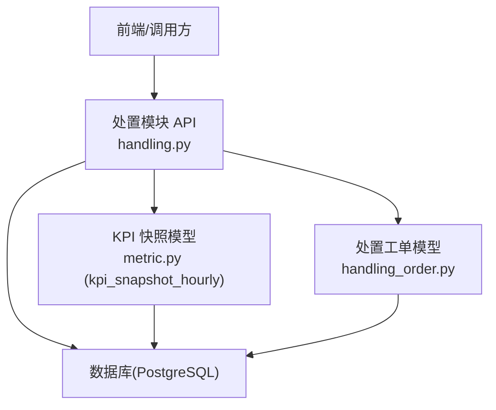
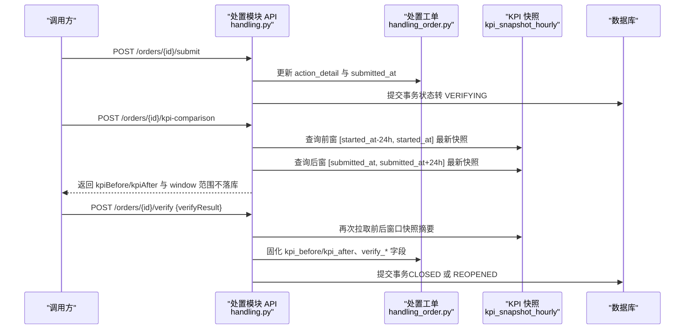
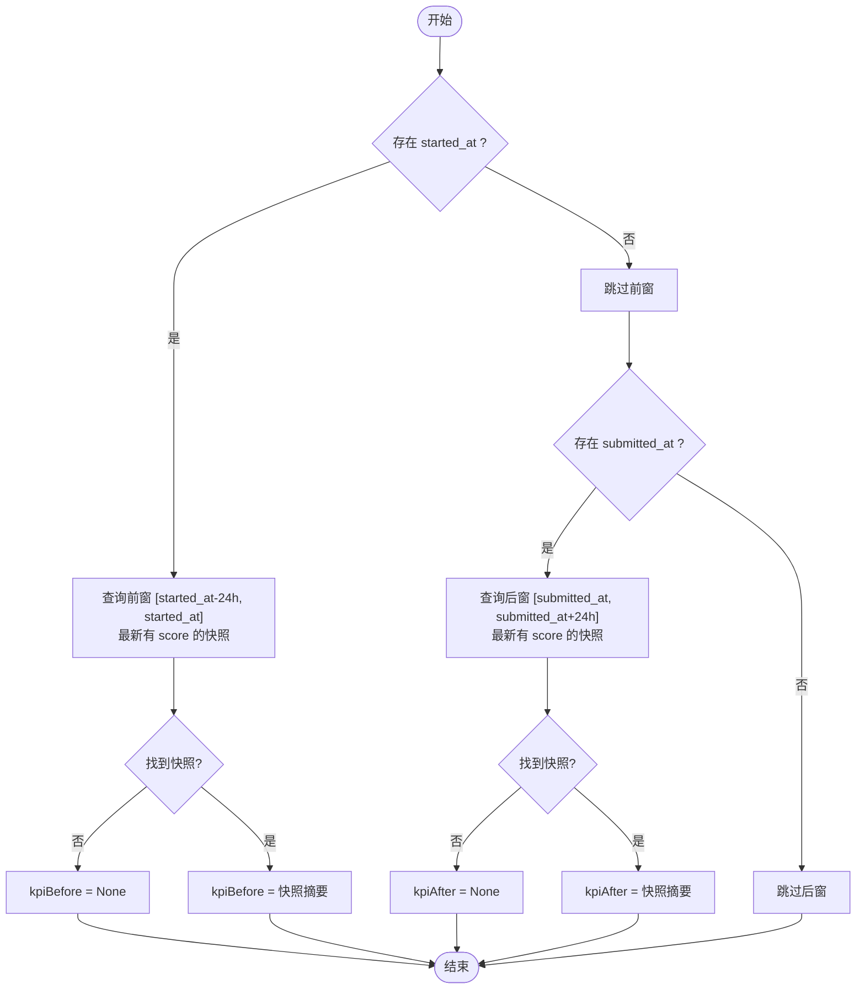
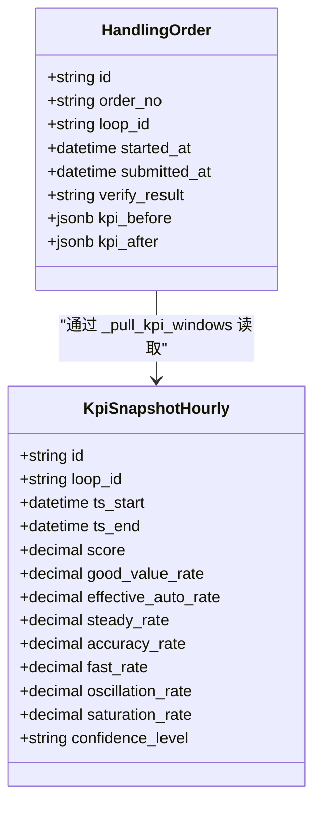
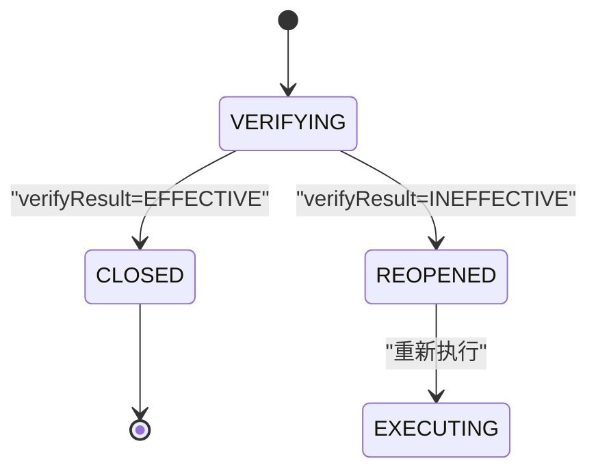
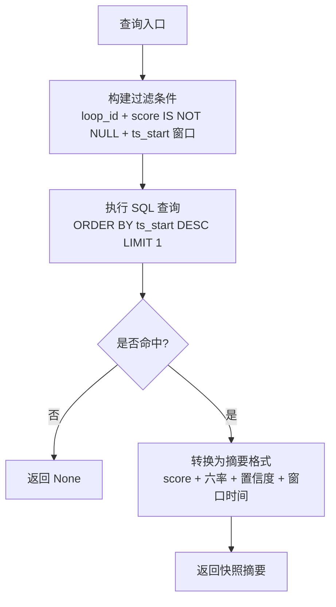
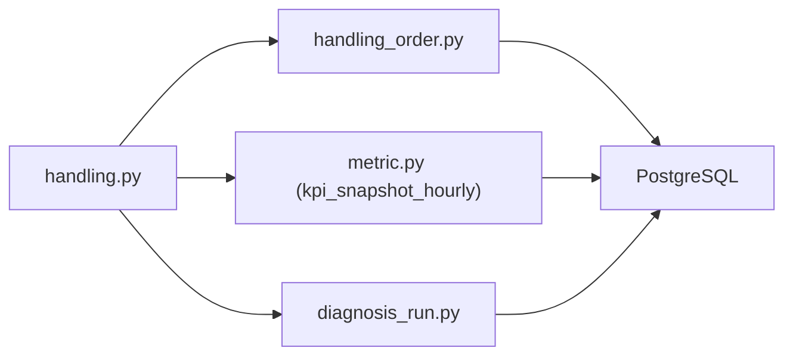

# 效果验证接口

<cite>
**本文引用的文件**
- [handling.py](file://backend/app/api/v1/endpoints/handling.py)
- [handling_order.py](file://backend/app/models/handling_order.py)
- [metric.py](file://backend/app/models/metric.py)
</cite>

## 目录
1. [简介](#简介)
2. [项目结构](#项目结构)
3. [核心组件](#核心组件)
4. [架构总览](#架构总览)
5. [详细组件分析](#详细组件分析)
6. [依赖关系分析](#依赖关系分析)
7. [性能考量](#性能考量)
8. [故障排查指南](#故障排查指南)
9. [结论](#结论)
10. [附录：API 使用说明](#附录api-使用说明)

## 简介
本章节面向 CLPM-MVP 处置工作流模块的“效果验证”能力，聚焦以下目标：
- KPI 验证窗口机制：前窗 [started_at - 24h, started_at] 与后窗 [submitted_at, submitted_at + 24h] 的数据采集规则。
- KPI 指标体系：score 综合评分、goodValueRate 良好值率、effectiveAutoRate 有效自动率、steadyRate 稳定率、accuracyRate 准确率、fastRate 快速率等六率指标。
- 验证结果判定：EFFECTIVE（有效）与 INEFFECTIVE（无效）的判断逻辑及状态流转。
- KPI 快照数据来源：kpi_snapshot_hourly 表的最新记录查询机制。
- 数据隔离原则：处置执行期数据不参与对比。
- KPI 对比预览接口：在不落库的情况下进行效果评估的使用说明。

## 项目结构
效果验证相关代码集中在处置模块 API 端点与模型定义中：
- 处置工作流 API：位于后端 API v1 端点 handling.py，提供工单提交验证、验证结论、KPI 前后对比预览等接口。
- 处置工单模型：handling_order.py，定义了工单实体、状态机、验证字段与 KPI 固化字段。
- KPI 快照模型：metric.py 中的 kpi_snapshot_hourly，承载每小时性能评估快照，作为 KPI 对比的数据源。

图表来源
- [handling.py:1202-1227](file://backend/app/api/v1/endpoints/handling.py#L1202-L1227)
- [handling_order.py:38-121](file://backend/app/models/handling_order.py#L38-L121)
- [metric.py:62-148](file://backend/app/models/metric.py#L62-L148)

章节来源
- [handling.py:1-120](file://backend/app/api/v1/endpoints/handling.py#L1-L120)
- [handling_order.py:1-121](file://backend/app/models/handling_order.py#L1-L121)
- [metric.py:1-148](file://backend/app/models/metric.py#L1-L148)

## 核心组件
- 处置工作流端点（handling.py）
  - 提交验证：POST /orders/{id}/submit，将工单从 EXECUTING 转入 VERIFYING，并合并 actionDetail。
  - 验证结论：POST /orders/{id}/verify，在 VERIFYING 状态下写入 verifyResult（EFFECTIVE/INEFFECTIVE），同时固化 kpi_before/kpi_after。
  - KPI 对比预览：POST /orders/{id}/kpi-comparison，在 VERIFYING 状态下实时拉取前后窗口 KPI 快照摘要，不落库。
- 处置工单模型（handling_order.py）
  - 关键字段：started_at、submitted_at、verify_result、verify_note、verified_by、verified_at、kpi_before、kpi_after。
  - 约束：verify_result 仅允许 EFFECTIVE 或 INEFFECTIVE。
- KPI 快照模型（metric.py）
  - 表：kpi_snapshot_hourly，包含 score、good_value_rate、effective_auto_rate、steady_rate、accuracy_rate、fast_rate 等指标字段，以及 ts_start、ts_end、confidence_level 等元信息。
  - 唯一性：loop_id + ts_start 唯一，确保每小时一条快照。

章节来源
- [handling.py:1107-1179](file://backend/app/api/v1/endpoints/handling.py#L1107-L1179)
- [handling_order.py:38-121](file://backend/app/models/handling_order.py#L38-L121)
- [metric.py:62-148](file://backend/app/models/metric.py#L62-L148)

## 架构总览
效果验证流程围绕“窗口化 KPI 快照对比”展开：
- 前窗：以 started_at 为界，取 [started_at - 24h, started_at] 内最新的有 score 的快照作为基线。
- 后窗：以 submitted_at 为界，取 [submitted_at, submitted_at + 24h] 内最新的有 score 的快照作为效果。
- 两侧窗口隔离：处置执行期（started_at 到 submitted_at 之间）的数据不参与对比。
- 验证结论：服务端在 verify 时固化 kpi_before/kpi_after，并依据 verifyResult 决定闭环或重开。

图表来源
- [handling.py:1107-1179](file://backend/app/api/v1/endpoints/handling.py#L1107-L1179)
- [handling.py:1202-1227](file://backend/app/api/v1/endpoints/handling.py#L1202-L1227)
- [metric.py:62-148](file://backend/app/models/metric.py#L62-L148)

## 详细组件分析

### KPI 验证窗口机制
- 前窗：[started_at - 24h, started_at]，用于获取开工前的基线快照。
- 后窗：[submitted_at, submitted_at + 24h]，用于获取提交验证后的线上效果快照。
- 窗口不足或无快照：对应侧返回 None，表示无法计算对比。
- 数据隔离：处置执行期（started_at 至 submitted_at）数据不参与对比，避免干扰。

图表来源
- [handling.py:323-362](file://backend/app/api/v1/endpoints/handling.py#L323-L362)

章节来源
- [handling.py:323-362](file://backend/app/api/v1/endpoints/handling.py#L323-L362)

### KPI 指标体系
- 指标字段（来自 kpi_snapshot_hourly）：
  - score：综合评分
  - good_value_rate：良好值率
  - effective_auto_rate：有效自动率
  - steady_rate：稳定率
  - accuracy_rate：准确率
  - fast_rate：快速率
  - 其他扩展指标：oscillation_rate、saturation_rate、valid_rate、confidence_level 等
- 快照摘要输出：_kpi_summary 函数将上述指标转换为统一格式，供前后对比使用。

图表来源
- [metric.py:62-148](file://backend/app/models/metric.py#L62-L148)
- [handling_order.py:38-121](file://backend/app/models/handling_order.py#L38-L121)
- [handling.py:300-320](file://backend/app/api/v1/endpoints/handling.py#L300-L320)

章节来源
- [metric.py:62-148](file://backend/app/models/metric.py#L62-L148)
- [handling.py:300-320](file://backend/app/api/v1/endpoints/handling.py#L300-L320)

### 验证结果判定与状态流转
- verifyResult 取值：EFFECTIVE（有效）、INEFFECTIVE（无效）。
- 状态流转：
  - EFFECTIVE：工单状态转为 CLOSED（已闭环），并回写整定记录状态为 VERIFIED（若为 TUNING 类型）。
  - INEFFECTIVE：工单状态转为 REOPENED（重开），并回写整定记录状态为 SIMULATED（若为 TUNING 类型）。
- 固化数据：在 verify 时，服务端会再次拉取前后窗口快照摘要并写入 kpi_before/kpi_after。

图表来源
- [handling.py:1136-1179](file://backend/app/api/v1/endpoints/handling.py#L1136-L1179)
- [handling_order.py:38-121](file://backend/app/models/handling_order.py#L38-L121)

章节来源
- [handling.py:1136-1179](file://backend/app/api/v1/endpoints/handling.py#L1136-L1179)
- [handling_order.py:38-121](file://backend/app/models/handling_order.py#L38-L121)

### KPI 快照数据来源与查询机制
- 数据源：kpi_snapshot_hourly 表，按 loop_id 与 ts_start 维度存储每小时快照。
- 查询策略：
  - 过滤条件：loop_id 匹配、score 非空、ts_start 落在指定窗口内。
  - 排序与限制：按 ts_start 降序，limit 1，取窗口内最新一条。
- 索引优化：idx_kpi_snapshot_loop_id、idx_kpi_snapshot_ts_start、idx_kpi_snapshot_ts_loop 提升查询性能。

图表来源
- [handling.py:323-339](file://backend/app/api/v1/endpoints/handling.py#L323-L339)
- [metric.py:125-148](file://backend/app/models/metric.py#L125-L148)

章节来源
- [handling.py:323-339](file://backend/app/api/v1/endpoints/handling.py#L323-L339)
- [metric.py:125-148](file://backend/app/models/metric.py#L125-L148)

### 数据隔离原则
- 前窗与后窗分别以 started_at 与 submitted_at 为界，确保处置执行期（started_at 到 submitted_at 之间）的数据不参与对比。
- 若窗口不足或无快照，对应侧返回 None，避免误判。

章节来源
- [handling.py:342-362](file://backend/app/api/v1/endpoints/handling.py#L342-L362)

## 依赖关系分析
- 处置模块 API 依赖：
  - 处置工单模型（handling_order.py）：读取/更新工单状态与验证字段。
  - KPI 快照模型（metric.py）：读取 kpi_snapshot_hourly 快照摘要。
  - 诊断运行模型（diagnosis_run.py）：可选关联 verifyRunId。
- 数据库层：
  - PostgreSQL：存储处置工单与 KPI 快照，利用索引优化窗口查询。

图表来源
- [handling.py:44-56](file://backend/app/api/v1/endpoints/handling.py#L44-L56)
- [handling_order.py:38-121](file://backend/app/models/handling_order.py#L38-L121)
- [metric.py:62-148](file://backend/app/models/metric.py#L62-L148)

章节来源
- [handling.py:44-56](file://backend/app/api/v1/endpoints/handling.py#L44-L56)

## 性能考量
- 窗口查询优化：
  - 使用 idx_kpi_snapshot_loop_id、idx_kpi_snapshot_ts_start、idx_kpi_snapshot_ts_loop 索引加速。
  - 限制为 limit 1，减少返回数据量。
- 快照摘要转换：
  - 轻量级 JSONB 序列化，避免额外计算开销。
- 并发与一致性：
  - 提交验证与验证结论均在事务中完成，保证数据一致性。
  - 工单编号生成具备重试机制，避免唯一冲突导致失败。

章节来源
- [metric.py:125-148](file://backend/app/models/metric.py#L125-L148)
- [handling.py:394-402](file://backend/app/api/v1/endpoints/handling.py#L394-L402)

## 故障排查指南
- 常见错误：
  - ERR_PARAM：参数校验失败（如 verifyResult 非法、actionDetail 缺失）。
  - ERR_STATE：状态不允许操作（如在非 VERIFYING 状态调用验证接口）。
  - ERR_NOT_FOUND：资源不存在（如建议或工单 ID 无效）。
- 排查步骤：
  - 检查工单状态是否为 VERIFYING。
  - 确认 started_at 与 submitted_at 是否存在且合理。
  - 验证 kpi_snapshot_hourly 表中是否有对应窗口的快照记录。
  - 查看日志中的 BizError 消息定位具体问题。

章节来源
- [handling.py:109-127](file://backend/app/api/v1/endpoints/handling.py#L109-L127)
- [handling.py:280-297](file://backend/app/api/v1/endpoints/handling.py#L280-L297)

## 结论
效果验证功能通过严格的窗口化 KPI 快照对比，确保处置前后的效果评估客观、可追溯。其核心优势包括：
- 明确的前后窗定义与数据隔离原则，避免处置执行期数据干扰。
- 完整的六率指标体系，支持多维度效果评估。
- 灵活的验证结果判定与状态流转，支持闭环与重开。
- 不落地库的 KPI 对比预览，便于前置评估与决策。

## 附录：API 使用说明

### 提交验证
- 方法：POST
- 路径：/orders/{order_id}/submit
- 描述：将工单从 EXECUTING 转入 VERIFYING，合并 actionDetail，设置 submitted_at。
- 请求体：actionDetail（必填，TUNING 类型需包含 pidAfter）。
- 响应：工单详情（含状态、时间戳、actionDetail）。

章节来源
- [handling.py:1107-1133](file://backend/app/api/v1/endpoints/handling.py#L1107-L1133)

### 验证结论
- 方法：POST
- 路径：/orders/{order_id}/verify
- 描述：在 VERIFYING 状态下写入 verifyResult（EFFECTIVE/INEFFECTIVE），固化 kpi_before/kpi_after，并更新工单状态。
- 请求体：verifyResult（必填）、verifyNote（可选）、verifyRunId（可选）。
- 响应：工单详情（含验证结果、KPI 快照摘要）。

章节来源
- [handling.py:1136-1179](file://backend/app/api/v1/endpoints/handling.py#L1136-L1179)

### KPI 前后对比预览
- 方法：POST
- 路径：/orders/{order_id}/kpi-comparison
- 描述：在 VERIFYING 状态下实时拉取前后窗口 KPI 快照摘要，不落库。
- 响应：
  - id、orderNo、loopId
  - kpiBefore：前窗快照摘要（可能为 None）
  - kpiAfter：后窗快照摘要（可能为 None）
  - window：前后窗时间范围（beforeStart/beforeEnd/afterStart/afterEnd）

章节来源
- [handling.py:1202-1227](file://backend/app/api/v1/endpoints/handling.py#L1202-L1227)