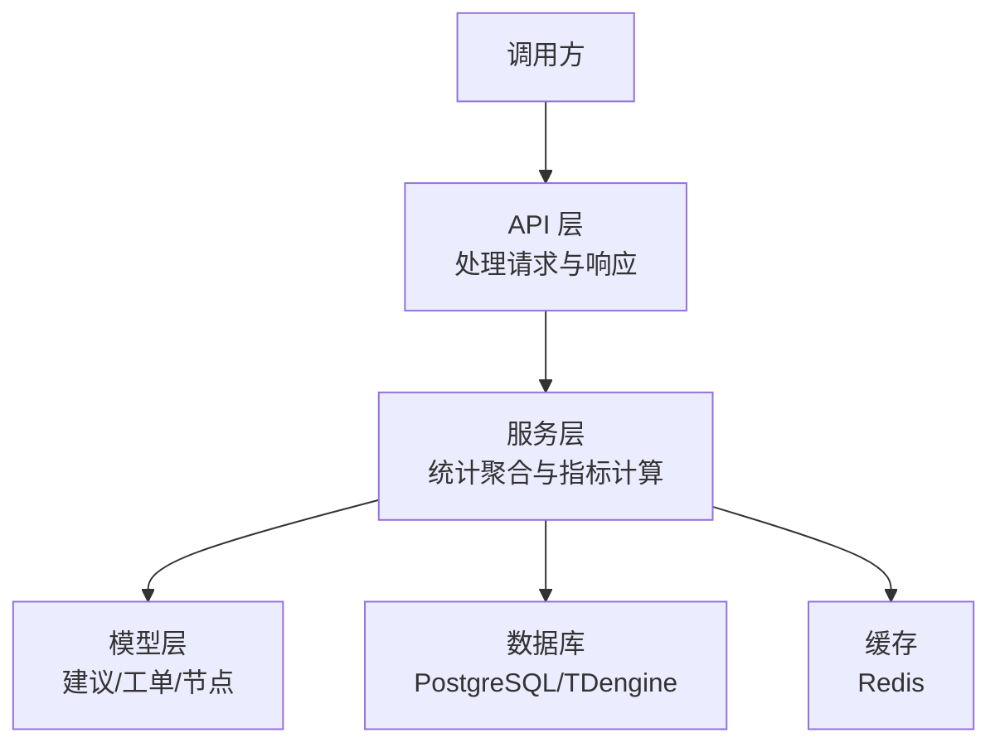
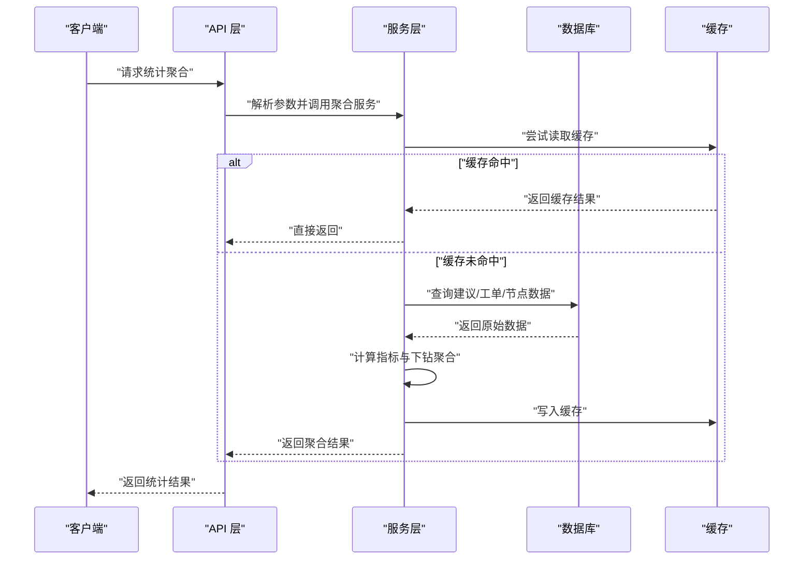
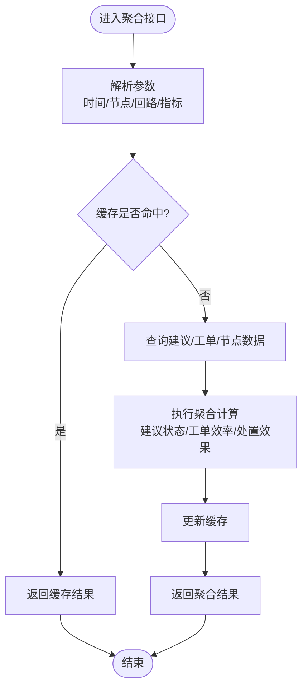
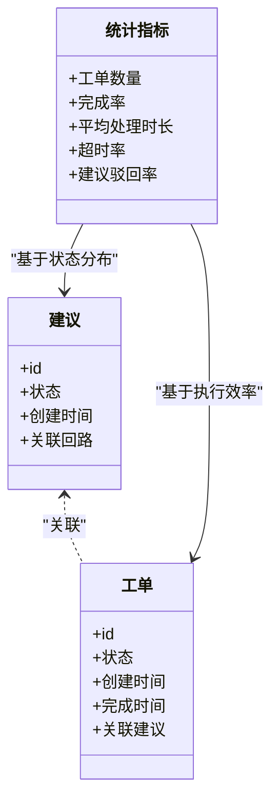
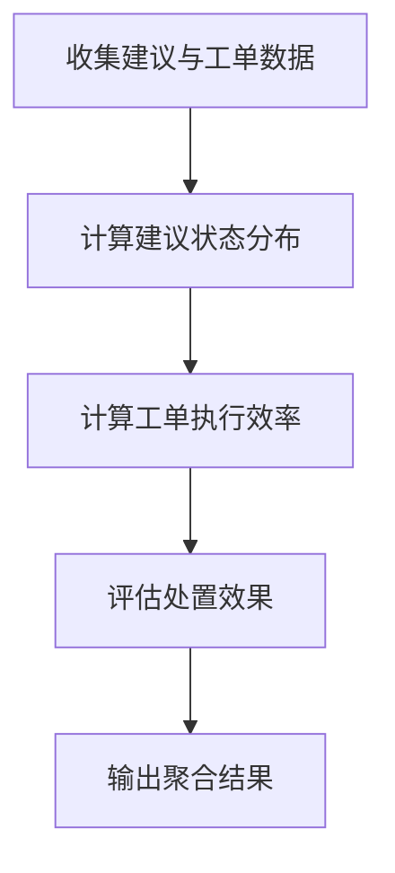
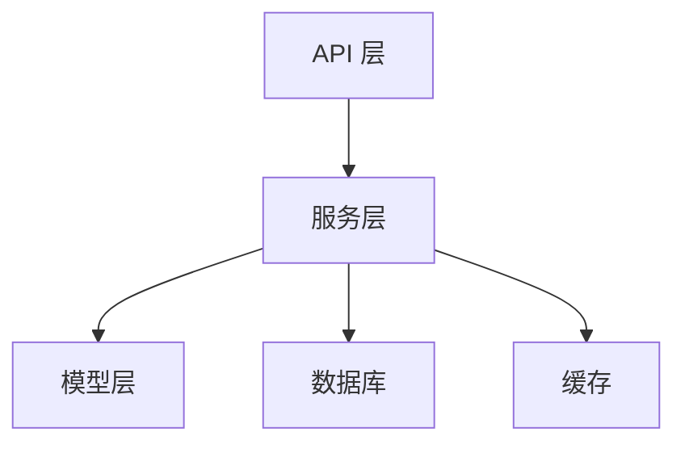

# 统计聚合接口

<cite>
**本文引用的文件**
- [backend/app/services/node_aggregation.py](file://backend/app/services/node_aggregation.py)
- [backend/tests/test_node_aggregation.py](file://backend/tests/test_node_aggregation.py)
- [backend/app/models/plant_node.py](file://backend/app/models/plant_node.py)
- [backend/app/schemas/plant_node.py](file://backend/app/schemas/plant_node.py)
- [backend/app/core/redis.py](file://backend/app/core/redis.py)
- [backend/app/core/db.py](file://backend/app/core/db.py)
- [backend/app/api/v1/handling_order.py](file://backend/app/api/v1/handling_order.py)
- [backend/app/models/handling_order.py](file://backend/app/models/handling_order.py)
- [backend/app/models/tracker.py](file://backend/app/models/tracker.py)
- [backend/app/schemas/workbench_summary.py](file://backend/app/schemas/workbench_summary.py)
- [backend/app/services/workbench_summary.py](file://backend/app/services/workbench_summary.py)
</cite>

## 目录
1. [简介](#简介)
2. [项目结构](#项目结构)
3. [核心组件](#核心组件)
4. [架构总览](#架构总览)
5. [详细组件分析](#详细组件分析)
6. [依赖关系分析](#依赖关系分析)
7. [性能考虑](#性能考虑)
8. [故障排查指南](#故障排查指南)
9. [结论](#结论)
10. [附录](#附录)

## 简介
本章节面向 CLPM-MVP 处置工作流模块的“统计聚合”能力，聚焦基于双实体（建议+工单）口径的回路级统计信息。文档覆盖以下要点：
- 档案聚合接口定义与参数契约
- 统计指标定义：工单维度统计与建议驳回率计算逻辑
- 数据聚合规则：建议状态分布、工单执行效率、处置效果分析等关键指标
- 实时性与准确性保证机制
- 装置节点维度的统计分析能力，支持按 plant_node 树结构进行数据下钻
- 统计接口的性能优化策略：数据库查询优化与缓存机制
- 统计数据在管理报表中的应用场景与展示方式

## 项目结构
围绕统计聚合功能，后端主要涉及如下层次：
- API 层：暴露统计聚合接口，接收过滤条件并返回聚合结果
- 服务层：实现统计聚合算法、指标计算与下钻逻辑
- 模型层：承载建议、工单、装置节点等核心实体
- 基础设施层：数据库连接、Redis 缓存、任务调度等

**图表来源**
- [backend/app/api/v1/handling_order.py:1-200](file://backend/app/api/v1/handling_order.py#L1-L200)
- [backend/app/services/node_aggregation.py:1-200](file://backend/app/services/node_aggregation.py#L1-L200)
- [backend/app/models/plant_node.py:1-200](file://backend/app/models/plant_node.py#L1-L200)
- [backend/app/core/redis.py:1-200](file://backend/app/core/redis.py#L1-L200)
- [backend/app/core/db.py:1-200](file://backend/app/core/db.py#L1-L200)

**章节来源**
- [backend/app/api/v1/handling_order.py:1-200](file://backend/app/api/v1/handling_order.py#L1-L200)
- [backend/app/services/node_aggregation.py:1-200](file://backend/app/services/node_aggregation.py#L1-L200)
- [backend/app/models/plant_node.py:1-200](file://backend/app/models/plant_node.py#L1-L200)
- [backend/app/core/redis.py:1-200](file://backend/app/core/redis.py#L1-L200)
- [backend/app/core/db.py:1-200](file://backend/app/core/db.py#L1-L200)

## 核心组件
- 统计聚合服务：负责汇总建议与工单数据，计算回路级统计指标，支持按装置节点树下钻
- 建议与工单模型：承载双实体口径的核心字段与状态机
- 装置节点模型与树结构：提供层级化组织与下钻路径
- 缓存与数据库访问：支撑高性能查询与一致性保障

**章节来源**
- [backend/app/services/node_aggregation.py:1-200](file://backend/app/services/node_aggregation.py#L1-L200)
- [backend/app/models/handling_order.py:1-200](file://backend/app/models/handling_order.py#L1-L200)
- [backend/app/models/tracker.py:1-200](file://backend/app/models/tracker.py#L1-L200)
- [backend/app/models/plant_node.py:1-200](file://backend/app/models/plant_node.py#L1-L200)

## 架构总览
统计聚合的整体流程如下：
- 客户端发起统计请求，携带时间范围、装置节点、回路筛选等条件
- API 层校验参数并转发至服务层
- 服务层根据 plant_node 树结构构建下钻路径，组合建议与工单数据进行聚合
- 通过数据库查询获取原始数据，必要时使用 Redis 缓存加速
- 计算指标并返回结构化结果

**图表来源**
- [backend/app/api/v1/handling_order.py:1-200](file://backend/app/api/v1/handling_order.py#L1-L200)
- [backend/app/services/node_aggregation.py:1-200](file://backend/app/services/node_aggregation.py#L1-L200)
- [backend/app/core/redis.py:1-200](file://backend/app/core/redis.py#L1-L200)
- [backend/app/core/db.py:1-200](file://backend/app/core/db.py#L1-L200)

## 详细组件分析

### 档案聚合接口（基于双实体：建议+工单）
- 接口职责：按时间范围、装置节点、回路等维度，汇总建议与工单数据，输出回路级统计信息
- 输入参数：时间窗口、plant_node 路径或节点 ID、回路筛选、指标开关
- 输出内容：建议状态分布、工单执行效率、处置效果指标、节点下钻明细

**图表来源**
- [backend/app/api/v1/handling_order.py:1-200](file://backend/app/api/v1/handling_order.py#L1-L200)
- [backend/app/services/node_aggregation.py:1-200](file://backend/app/services/node_aggregation.py#L1-L200)

**章节来源**
- [backend/app/api/v1/handling_order.py:1-200](file://backend/app/api/v1/handling_order.py#L1-L200)
- [backend/app/services/node_aggregation.py:1-200](file://backend/app/services/node_aggregation.py#L1-L200)

### 统计指标定义
- 工单维度统计：包括工单数量、完成率、平均处理时长、超时率等
- 建议驳回率：基于建议状态分布计算，衡量建议被采纳与驳回的比例
- 处置效果分析：结合工单执行结果与建议有效性，评估闭环质量

**图表来源**
- [backend/app/models/handling_order.py:1-200](file://backend/app/models/handling_order.py#L1-L200)
- [backend/app/models/tracker.py:1-200](file://backend/app/models/tracker.py#L1-L200)

**章节来源**
- [backend/app/models/handling_order.py:1-200](file://backend/app/models/handling_order.py#L1-L200)
- [backend/app/models/tracker.py:1-200](file://backend/app/models/tracker.py#L1-L200)

### 数据聚合规则
- 建议状态分布：统计各状态占比，用于计算建议驳回率
- 工单执行效率：基于工单生命周期时间戳计算平均处理时长与超时率
- 处置效果分析：综合建议有效性与工单完成质量，形成闭环评估

**图表来源**
- [backend/app/services/node_aggregation.py:1-200](file://backend/app/services/node_aggregation.py#L1-L200)

**章节来源**
- [backend/app/services/node_aggregation.py:1-200](file://backend/app/services/node_aggregation.py#L1-L200)

### 实时性与准确性保证机制
- 实时性：通过缓存层减少重复计算，缩短响应时间；对高频查询采用短 TTL 缓存
- 准确性：以数据库为权威源，缓存仅作为加速层；关键指标计算包含数据校验与异常处理
- 一致性：在数据写入后主动失效相关缓存键，确保后续查询获取最新数据

**章节来源**
- [backend/app/core/redis.py:1-200](file://backend/app/core/redis.py#L1-L200)
- [backend/app/core/db.py:1-200](file://backend/app/core/db.py#L1-L200)

### 装置节点维度的统计分析能力
- 支持按 plant_node 树结构进行数据下钻，从工厂到单元再到具体回路
- 聚合过程中维护节点层级关系，便于生成多维报表与可视化视图

**图表来源**
- [backend/app/models/plant_node.py:1-200](file://backend/app/models/plant_node.py#L1-L200)
- [backend/app/schemas/plant_node.py:1-200](file://backend/app/schemas/plant_node.py#L1-L200)

**章节来源**
- [backend/app/models/plant_node.py:1-200](file://backend/app/models/plant_node.py#L1-L200)
- [backend/app/schemas/plant_node.py:1-200](file://backend/app/schemas/plant_node.py#L1-L200)

### 统计接口的性能优化策略
- 数据库查询优化：使用索引、分页与批量查询减少 I/O 开销
- 缓存机制：对热点查询结果进行缓存，设置合理 TTL 与失效策略
- 异步计算：对耗时聚合任务采用后台任务处理，避免阻塞主流程

**章节来源**
- [backend/app/core/redis.py:1-200](file://backend/app/core/redis.py#L1-L200)
- [backend/app/core/db.py:1-200](file://backend/app/core/db.py#L1-L200)

### 统计数据在管理报表中的应用场景
- 管理驾驶舱：展示整体建议与工单趋势、驳回率与处置效果概览
- 节点下钻报表：支持从工厂到回路的逐层分析，定位瓶颈环节
- 绩效评估：基于工单执行效率与建议有效性，评估团队与个人绩效

**章节来源**
- [backend/app/schemas/workbench_summary.py:1-200](file://backend/app/schemas/workbench_summary.py#L1-L200)
- [backend/app/services/workbench_summary.py:1-200](file://backend/app/services/workbench_summary.py#L1-L200)

## 依赖关系分析
统计聚合功能依赖以下核心模块：
- API 层：处理请求与响应
- 服务层：实现聚合逻辑与指标计算
- 模型层：提供数据实体与关系
- 基础设施层：数据库与缓存

**图表来源**
- [backend/app/api/v1/handling_order.py:1-200](file://backend/app/api/v1/handling_order.py#L1-L200)
- [backend/app/services/node_aggregation.py:1-200](file://backend/app/services/node_aggregation.py#L1-L200)
- [backend/app/models/plant_node.py:1-200](file://backend/app/models/plant_node.py#L1-L200)
- [backend/app/core/redis.py:1-200](file://backend/app/core/redis.py#L1-L200)
- [backend/app/core/db.py:1-200](file://backend/app/core/db.py#L1-L200)

**章节来源**
- [backend/app/api/v1/handling_order.py:1-200](file://backend/app/api/v1/handling_order.py#L1-L200)
- [backend/app/services/node_aggregation.py:1-200](file://backend/app/services/node_aggregation.py#L1-L200)
- [backend/app/models/plant_node.py:1-200](file://backend/app/models/plant_node.py#L1-L200)
- [backend/app/core/redis.py:1-200](file://backend/app/core/redis.py#L1-L200)
- [backend/app/core/db.py:1-200](file://backend/app/core/db.py#L1-L200)

## 性能考虑
- 查询优化：合理使用索引与分页，避免全表扫描
- 缓存策略：针对高频查询设置短 TTL，降低数据库压力
- 异步处理：将耗时任务移至后台，提升接口响应速度
- 监控与告警：对慢查询与缓存命中率进行监控，及时优化

[本节为通用性能指导，不直接分析具体文件]

## 故障排查指南
- 缓存未命中：检查缓存键生成逻辑与 TTL 设置
- 数据不一致：验证数据库事务与缓存失效时机
- 性能下降：分析慢查询日志与缓存命中率
- 接口超时：检查下游依赖与并发限制

**章节来源**
- [backend/tests/test_node_aggregation.py:1-200](file://backend/tests/test_node_aggregation.py#L1-L200)

## 结论
统计聚合接口通过双实体（建议+工单）口径，提供了全面的回路级统计能力。结合装置节点树结构，支持多维度下钻与分析。通过数据库查询优化与缓存机制，保障了接口的实时性与准确性。该能力可广泛应用于管理报表与绩效评估，助力生产运营决策。

[本节为总结性内容，不直接分析具体文件]

## 附录
- 术语表：建议、工单、回路、装置节点、驳回率、处置效果等
- 参考文档：API 规范、数据模型设计、性能优化方案

[本节为补充信息，不直接分析具体文件]