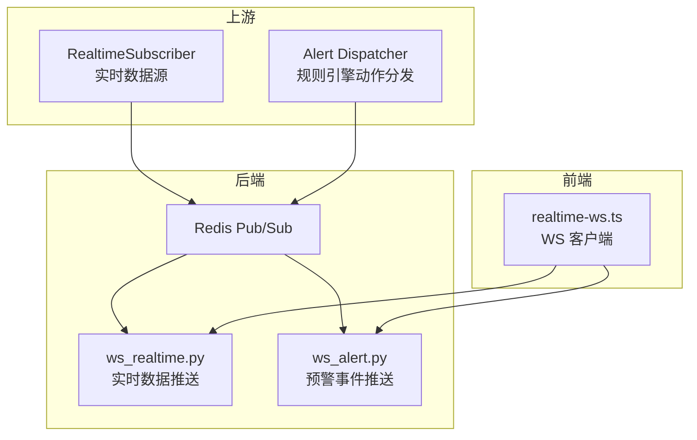
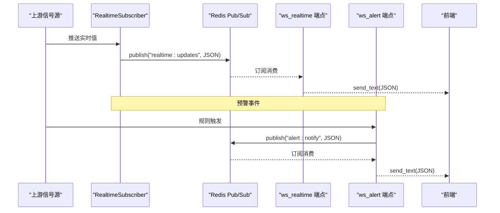
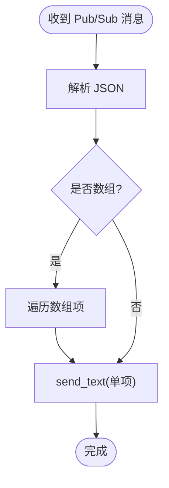
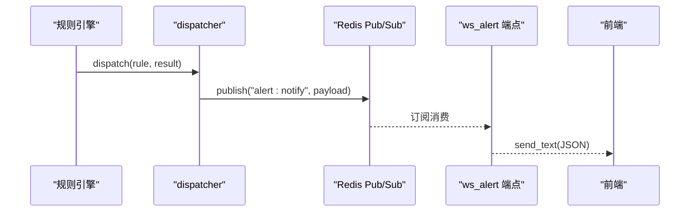
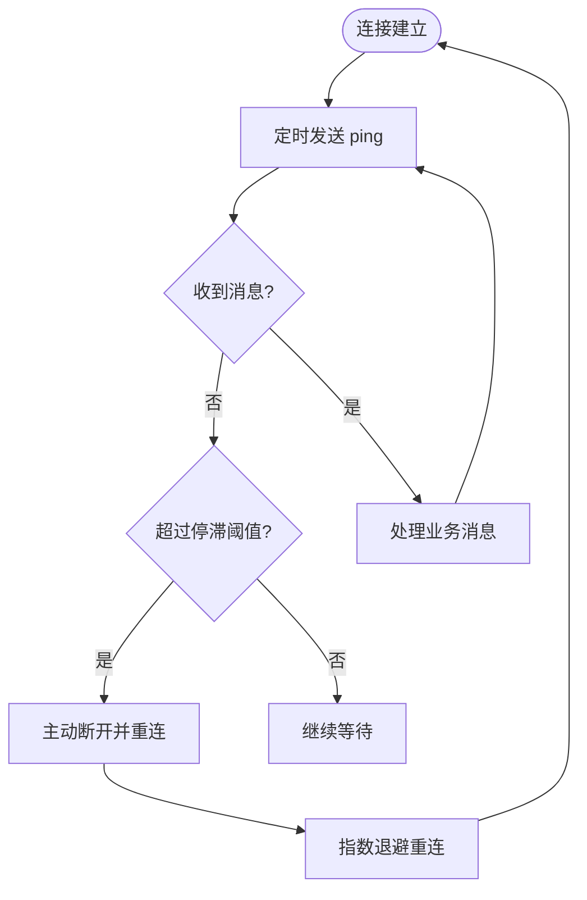
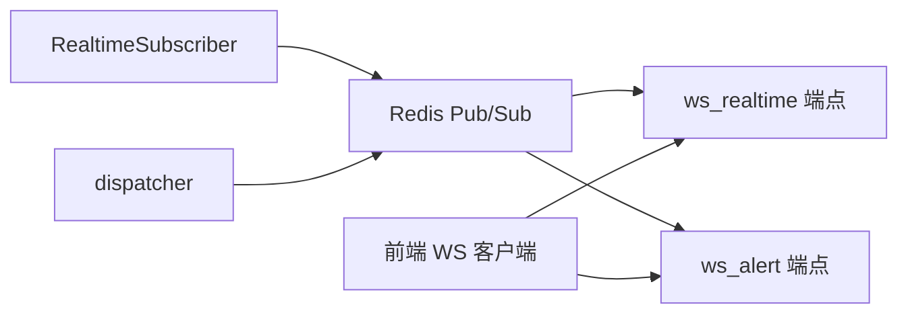

# 实时通信接口

<cite>
**本文引用的文件**
- [ws_realtime.py](file://backend/app/api/v1/endpoints/ws_realtime.py)
- [ws_alert.py](file://backend/app/api/v1/endpoints/ws_alert.py)
- [realtime_subscriber.py](file://backend/app/services/data_source/realtime_subscriber.py)
- [dispatcher.py](file://backend/app/services/alert_rule_engine/dispatcher.py)
- [realtime-ws.ts](file://frontend/apps/web-antd/src/utils/realtime-ws.ts)
</cite>

## 目录
1. [简介](#简介)
2. [项目结构](#项目结构)
3. [核心组件](#核心组件)
4. [架构总览](#架构总览)
5. [详细组件分析](#详细组件分析)
6. [依赖关系分析](#依赖关系分析)
7. [性能考虑](#性能考虑)
8. [故障排查指南](#故障排查指南)
9. [结论](#结论)
10. [附录](#附录)

## 简介
本文件为 CLPM-MVP 实时通信模块的 API 文档，覆盖 WebSocket 连接、认证握手、心跳保活；实时数据推送（订阅、频道、消息格式）；告警事件推送（级别、类型、通知策略）；实时状态同步（变更通知、批量更新、增量同步）；以及连接管理、断线重连与负载均衡实现。同时提供前端集成示例与调试工具使用方法。

## 项目结构
后端通过两个独立的 WebSocket 端点对外提供服务：
- 实时数据推送：/api/v1/ws/realtime
- 预警事件推送：/api/v1/ws/alerts

两者均基于 Redis Pub/Sub 作为中间广播通道，由上游服务写入消息，WebSocket 端点订阅并转发给已连接的客户端。

图表来源
- [ws_realtime.py:1-136](file://backend/app/api/v1/endpoints/ws_realtime.py#L1-L136)
- [ws_alert.py:1-129](file://backend/app/api/v1/endpoints/ws_alert.py#L1-L129)
- [realtime_subscriber.py:1-1364](file://backend/app/services/data_source/realtime_subscriber.py#L1-L1364)
- [dispatcher.py:1-362](file://backend/app/services/alert_rule_engine/dispatcher.py#L1-L362)
- [realtime-ws.ts:1-230](file://frontend/apps/web-antd/src/utils/realtime-ws.ts#L1-L230)

章节来源
- [ws_realtime.py:1-136](file://backend/app/api/v1/endpoints/ws_realtime.py#L1-L136)
- [ws_alert.py:1-129](file://backend/app/api/v1/endpoints/ws_alert.py#L1-L129)

## 核心组件
- 实时数据推送端点：订阅实时数据频道，将单条或批量 Tag 值更新推送至前端。
- 预警事件推送端点：订阅预警通知频道，将规则触发事件推送至前端。
- 实时数据订阅器：连接上游 SignalR Hub，接收实时数据，缓存到 Redis 并发布到 Pub/Sub，支持断点续传与看门狗。
- 规则引擎动作分发：执行 CREATE_EVENT/NOTIFY 等动作，发布预警通知到 Redis。
- 前端 WS 客户端：封装连接、认证、心跳、自动重连与消息回调。

章节来源
- [ws_realtime.py:1-136](file://backend/app/api/v1/endpoints/ws_realtime.py#L1-L136)
- [ws_alert.py:1-129](file://backend/app/api/v1/endpoints/ws_alert.py#L1-L129)
- [realtime_subscriber.py:1-1364](file://backend/app/services/data_source/realtime_subscriber.py#L1-L1364)
- [dispatcher.py:1-362](file://backend/app/services/alert_rule_engine/dispatcher.py#L1-L362)
- [realtime-ws.ts:1-230](file://frontend/apps/web-antd/src/utils/realtime-ws.ts#L1-L230)

## 架构总览
整体数据流如下：
- 实时数据：上游 SignalR Hub → RealtimeSubscriber → Redis Pub/Sub("realtime:updates") → ws_realtime 端点 → 前端
- 预警事件：规则引擎评估 → dispatcher._notify → Redis Pub/Sub("alert:notify") → ws_alert 端点 → 前端

图表来源
- [realtime_subscriber.py:599-621](file://backend/app/services/data_source/realtime_subscriber.py#L599-L621)
- [ws_realtime.py:83-117](file://backend/app/api/v1/endpoints/ws_realtime.py#L83-L117)
- [dispatcher.py:215-244](file://backend/app/services/alert_rule_engine/dispatcher.py#L215-L244)
- [ws_alert.py:86-110](file://backend/app/api/v1/endpoints/ws_alert.py#L86-L110)

## 详细组件分析

### WebSocket 连接与认证
- 连接地址
  - 实时数据：ws://host/api/v1/ws/realtime?token=...
  - 预警事件：ws://host/api/v1/ws/alerts?token=...
- 认证流程
  - 从 query 参数读取 token
  - 解码 JWT，校验签名与有效期
  - 要求 type == "access"，拒绝 refresh token
  - 检查 jti 是否在黑名单中
  - 认证失败返回关闭码 4001 与原因“认证失败”
- 连接建立
  - 认证通过后调用 accept()
  - 记录客户端标识并输出日志

章节来源
- [ws_realtime.py:36-77](file://backend/app/api/v1/endpoints/ws_realtime.py#L36-L77)
- [ws_alert.py:39-80](file://backend/app/api/v1/endpoints/ws_alert.py#L39-L80)

### 心跳保活
- 服务端每 30 秒发送 {"type":"ping"}
- 前端收到 ping 可忽略（不处理业务），用于检测连接存活
- 若需要，前端可回复 {"type":"pong"}（当前前端未显式回复，不影响连通性）

章节来源
- [ws_realtime.py:87-96](file://backend/app/api/v1/endpoints/ws_realtime.py#L87-L96)
- [ws_alert.py:90-99](file://backend/app/api/v1/endpoints/ws_alert.py#L90-L99)
- [realtime-ws.ts:166-177](file://frontend/apps/web-antd/src/utils/realtime-ws.ts#L166-L177)

### 实时数据推送：订阅、频道与消息格式
- 频道
  - 频道名："realtime:updates"
  - 生产者：RealtimeSubscriber 在缓存值后发布
  - 消费者：ws_realtime 端点订阅并转发
- 消息格式
  - 单条对象：{"tagCode": "...", "value": "...", "quality": 1, "collectTime": "..."}
  - 批量数组：服务端兼容解析数组，逐条转发给前端
- 前端处理
  - 解析 JSON，跳过 {"type":"ping"}
  - 通过 onMessage 回调处理业务逻辑

图表来源
- [ws_realtime.py:100-117](file://backend/app/api/v1/endpoints/ws_realtime.py#L100-L117)
- [realtime_subscriber.py:599-621](file://backend/app/services/data_source/realtime_subscriber.py#L599-L621)

章节来源
- [ws_realtime.py:1-136](file://backend/app/api/v1/endpoints/ws_realtime.py#L1-L136)
- [realtime_subscriber.py:599-621](file://backend/app/services/data_source/realtime_subscriber.py#L599-L621)
- [realtime-ws.ts:166-177](file://frontend/apps/web-antd/src/utils/realtime-ws.ts#L166-L177)

### 告警事件推送：级别、类型与通知策略
- 事件字段
  - type: "alert"
  - ruleCode / ruleName：规则标识与名称
  - loopId：回路 ID
  - severity：严重度（如 WARN，支持升级）
  - triggeredValue / triggeredAt：触发值与时间
  - snapshot：条件快照
  - eventId：可选，用于深链定位
- 通知策略
  - 通过 Redis Pub/Sub 频道 "alert:notify" 广播
  - 按角色（ADMIN、IC_ENGINEER）递增徽章计数
  - 可联动触发诊断任务（TRIGGER_DIAGNOSIS）

图表来源
- [dispatcher.py:40-102](file://backend/app/services/alert_rule_engine/dispatcher.py#L40-L102)
- [dispatcher.py:215-244](file://backend/app/services/alert_rule_engine/dispatcher.py#L215-L244)
- [ws_alert.py:66-110](file://backend/app/api/v1/endpoints/ws_alert.py#L66-L110)

章节来源
- [ws_alert.py:1-129](file://backend/app/api/v1/endpoints/ws_alert.py#L1-L129)
- [dispatcher.py:1-362](file://backend/app/services/alert_rule_engine/dispatcher.py#L1-L362)

### 实时状态同步：变更通知、批量更新与增量同步
- 变更通知
  - 每次 Tag 值变化都会发布到 Pub/Sub，前端按需渲染
- 批量更新
  - 当上游以数组形式推送时，服务端逐条转发，前端依次处理
- 增量同步
  - 前端仅处理收到的增量消息，无需全量拉取
  - 低频信号（SP/MODE/PID_*）通过周期刷新保证最新值

章节来源
- [realtime_subscriber.py:512-584](file://backend/app/services/data_source/realtime_subscriber.py#L512-L584)
- [ws_realtime.py:100-117](file://backend/app/api/v1/endpoints/ws_realtime.py#L100-L117)

### 连接管理与断线重连
- 前端重连策略
  - 指数退避：初始 3s，最大 30s
  - 手动重连：清除定时器后立即重连
  - 连接状态三态：offline / online / reconnecting
- 后端健康保障
  - 心跳 ping 保活
  - 上游连接看门狗：无消息超时主动断开并重连
  - 断点续传：进程重启后根据 checkpoint 自动补数

图表来源
- [realtime_subscriber.py:323-463](file://backend/app/services/data_source/realtime_subscriber.py#L323-L463)
- [realtime-ws.ts:205-223](file://frontend/apps/web-antd/src/utils/realtime-ws.ts#L205-L223)

章节来源
- [realtime_subscriber.py:323-463](file://backend/app/services/data_source/realtime_subscriber.py#L323-L463)
- [realtime-ws.ts:20-223](file://frontend/apps/web-antd/src/utils/realtime-ws.ts#L20-L223)

### 负载均衡与多实例部署
- 水平扩展
  - 多个 ws_realtime/ws_alert 实例均可订阅同一 Redis 频道，天然支持横向扩展
- 幂等与去重
  - 前端对重复消息进行幂等处理（按 tagCode + collectTime）
  - 预警事件包含 eventId，便于前端去重与深链定位
- 资源隔离
  - 每个连接独立维护心跳任务与 Pub/Sub 订阅，避免相互影响

章节来源
- [ws_realtime.py:83-117](file://backend/app/api/v1/endpoints/ws_realtime.py#L83-L117)
- [ws_alert.py:86-110](file://backend/app/api/v1/endpoints/ws_alert.py#L86-L110)
- [dispatcher.py:215-244](file://backend/app/services/alert_rule_engine/dispatcher.py#L215-L244)

## 依赖关系分析
- 实时数据链路
  - RealtimeSubscriber 依赖 Redis 缓存与 Pub/Sub
  - ws_realtime 端点依赖 Redis Pub/Sub 与 JWT 鉴权
- 预警事件链路
  - dispatcher 依赖数据库会话、Redis Pub/Sub 与用户角色查询
  - ws_alert 端点依赖 Redis Pub/Sub 与 JWT 鉴权
- 前端依赖
  - realtime-ws.ts 依赖环境变量配置的后端地址与 token

图表来源
- [realtime_subscriber.py:599-621](file://backend/app/services/data_source/realtime_subscriber.py#L599-L621)
- [ws_realtime.py:83-117](file://backend/app/api/v1/endpoints/ws_realtime.py#L83-L117)
- [dispatcher.py:215-244](file://backend/app/services/alert_rule_engine/dispatcher.py#L215-L244)
- [ws_alert.py:86-110](file://backend/app/api/v1/endpoints/ws_alert.py#L86-L110)

章节来源
- [realtime_subscriber.py:599-621](file://backend/app/services/data_source/realtime_subscriber.py#L599-L621)
- [ws_realtime.py:83-117](file://backend/app/api/v1/endpoints/ws_realtime.py#L83-L117)
- [dispatcher.py:215-244](file://backend/app/services/alert_rule_engine/dispatcher.py#L215-L244)
- [ws_alert.py:86-110](file://backend/app/api/v1/endpoints/ws_alert.py#L86-L110)

## 性能考虑
- 高吞吐
  - 使用 Redis Pub/Sub 解耦生产与消费，支持多实例并行
- 低延迟
  - 单条消息直接转发，批量消息逐条转发，减少序列化开销
- 可靠性
  - 心跳保活与看门狗机制确保连接活跃
  - 断点续传与分布式锁避免重复补数
- 前端优化
  - 指数退避重连降低瞬时压力
  - 连接状态三态便于 UI 展示与策略切换

[本节为通用指导，不直接分析具体文件]

## 故障排查指南
- 认证失败
  - 检查 token 是否为 access 类型且未加入黑名单
  - 确认 query 参数正确传递
- 无消息推送
  - 确认上游已发布到对应频道
  - 检查 Redis Pub/Sub 订阅是否正常
- 频繁断线
  - 查看心跳与看门狗日志，确认上游是否停滞
  - 检查网络与反向代理配置
- 数据缺失
  - 检查断点续传 checkpoint 与补数任务状态
  - 关注补数失败重试与分布式锁占用情况

章节来源
- [ws_realtime.py:36-77](file://backend/app/api/v1/endpoints/ws_realtime.py#L36-L77)
- [ws_alert.py:39-80](file://backend/app/api/v1/endpoints/ws_alert.py#L39-L80)
- [realtime_subscriber.py:323-463](file://backend/app/services/data_source/realtime_subscriber.py#L323-L463)
- [realtime_subscriber.py:688-769](file://backend/app/services/data_source/realtime_subscriber.py#L688-L769)

## 结论
CLPM-MVP 实时通信模块通过 Redis Pub/Sub 实现了高内聚、低耦合的实时数据与预警事件推送能力。WebSocket 端点负责认证、心跳与消息转发；RealtimeSubscriber 提供健壮的上游接入、缓存与断点续传；dispatcher 统一动作分发与通知策略。前端封装了连接、重连与消息处理，满足监控与告警场景需求。该架构易于水平扩展与运维排障。

## 附录

### API 定义速查
- 实时数据推送
  - 地址：/api/v1/ws/realtime?token=...
  - 消息：{"tagCode","value","quality","collectTime"}
  - 批量：数组形式逐项转发
- 预警事件推送
  - 地址：/api/v1/ws/alerts?token=...
  - 消息：{"type":"alert","ruleCode","ruleName","loopId","severity","triggeredValue","triggeredAt","snapshot","eventId"}

章节来源
- [ws_realtime.py:1-136](file://backend/app/api/v1/endpoints/ws_realtime.py#L1-L136)
- [ws_alert.py:1-129](file://backend/app/api/v1/endpoints/ws_alert.py#L1-L129)

### 前端集成示例
- 初始化与连接
  - 从环境变量获取后端地址，构造 ws URL
  - 传入 token 建立连接
- 监听消息
  - 注册 onMessage 回调，解析 JSON，跳过 ping
- 重连与状态
  - 使用 status 属性判断 online/reconnecting/offline
  - 手动 reconnect 触发立即重连

章节来源
- [realtime-ws.ts:52-87](file://frontend/apps/web-antd/src/utils/realtime-ws.ts#L52-L87)
- [realtime-ws.ts:104-139](file://frontend/apps/web-antd/src/utils/realtime-ws.ts#L104-L139)
- [realtime-ws.ts:141-199](file://frontend/apps/web-antd/src/utils/realtime-ws.ts#L141-L199)

### 调试工具使用方法
- 浏览器开发者工具
  - Network → WS 面板查看连接、消息与心跳
- 后端日志
  - 观察连接建立、断开与异常日志
  - 关注 Pub/Sub 订阅与发布日志
- 上游与 Redis
  - 确认上游已发布到对应频道
  - 使用 Redis 客户端订阅频道验证消息流转

章节来源
- [ws_realtime.py:77-136](file://backend/app/api/v1/endpoints/ws_realtime.py#L77-L136)
- [ws_alert.py:80-129](file://backend/app/api/v1/endpoints/ws_alert.py#L80-L129)
- [realtime_subscriber.py:599-621](file://backend/app/services/data_source/realtime_subscriber.py#L599-L621)