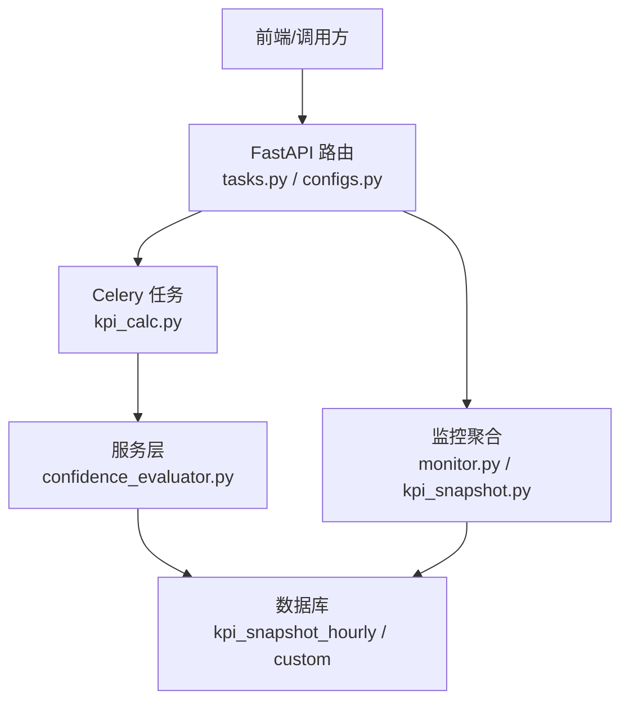
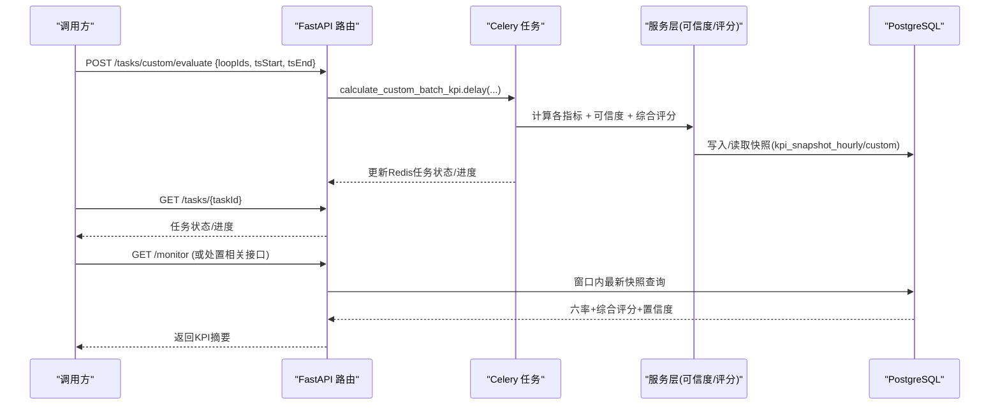
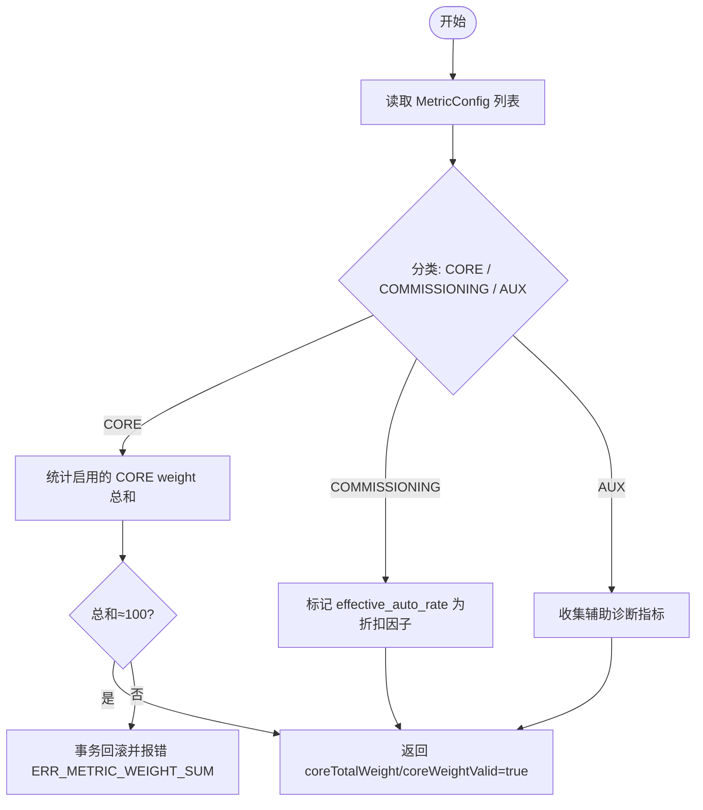
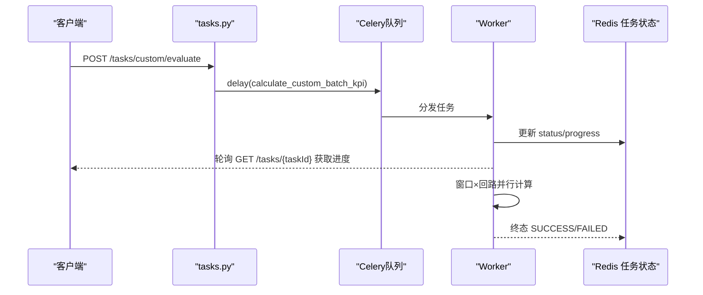
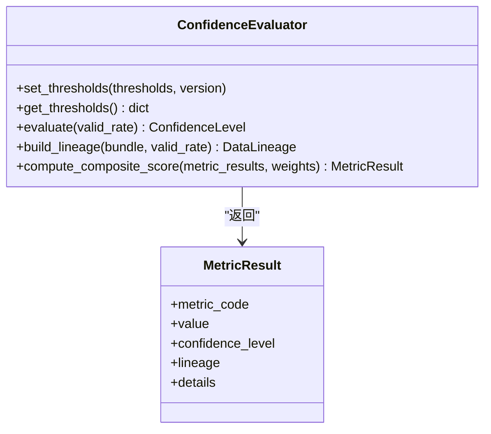
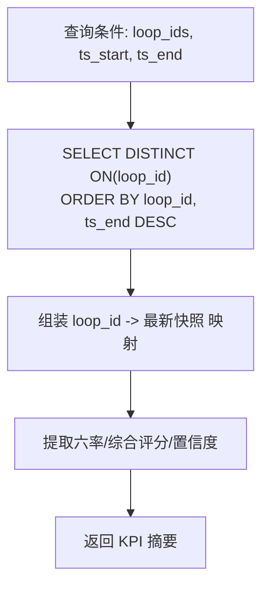
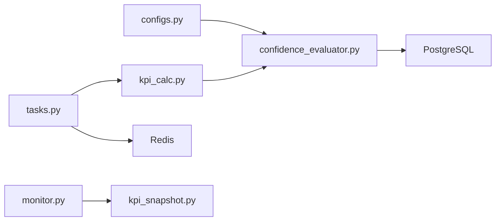

# KPI指标计算接口

<cite>
**本文引用的文件**
- [configs.py](file://backend/app/api/v1/endpoints/configs.py)
- [tasks.py](file://backend/app/api/v1/endpoints/tasks.py)
- [kpi_calc.py](file://backend/app/tasks/kpi_calc.py)
- [confidence_evaluator.py](file://backend/app/services/confidence_evaluator.py)
- [monitor.py](file://backend/app/services/monitor.py)
- [handling.py](file://backend/app/api/v1/endpoints/handling.py)
- [kpi_snapshot.py](file://backend/app/services/kpi_snapshot.py)
- [c3bee6758850_add_fitness_fields_to_kpi_snapshots.py](file://backend/alembic/versions/c3bee6758850_add_fitness_fields_to_kpi_snapshots.py)
- [test_b6_composite_score.py](file://backend/tests/compliance/test_b6_composite_score.py)
- [openapi_baseline.json](file://backend/tests/golden/openapi_baseline.json)
</cite>

## 目录
1. [简介](#简介)
2. [项目结构](#项目结构)
3. [核心组件](#核心组件)
4. [架构总览](#架构总览)
5. [详细组件分析](#详细组件分析)
6. [依赖关系分析](#依赖关系分析)
7. [性能考虑](#性能考虑)
8. [故障排查指南](#故障排查指南)
9. [结论](#结论)
10. [附录](#附录)

## 简介
本文件面向CLPM-MVP的KPI指标计算接口，围绕六大核心KPI（good_value_rate、auto_mode_rate、effective_auto_rate、steady_rate、accuracy_rate、oscillation_rate）的计算逻辑与参数配置进行说明；阐述权重配置接口的分配规则、总和校验与动态调整能力；解释适用性评估算法（L0-L4分级、数据质量要求、置信度评估）；并覆盖批量计算、异步任务处理、缓存策略、大数据量优化（分页、时间范围过滤、装置节点筛选）等高级能力。

## 项目结构
后端通过API层暴露指标配置与任务管理接口，任务由Celery异步执行，服务层实现可信度评估与综合评分，快照持久化到PostgreSQL，查询聚合由监控服务完成。关键路径：
- 指标配置：GET/PUT /api/v1/configs/metrics
- 任务触发：POST /api/v1/tasks/custom/evaluate、/api/v1/tasks/standard/evaluate
- 结果读取：监控服务从快照表聚合返回六率与综合评分

图表来源
- [tasks.py:691-746](file://backend/app/api/v1/endpoints/tasks.py#L691-L746)
- [tasks.py:754-803](file://backend/app/api/v1/endpoints/tasks.py#L754-L803)
- [kpi_calc.py:1556-1620](file://backend/app/tasks/kpi_calc.py#L1556-L1620)
- [confidence_evaluator.py:252-475](file://backend/app/services/confidence_evaluator.py#L252-L475)
- [monitor.py:668-682](file://backend/app/services/monitor.py#L668-L682)
- [kpi_snapshot.py:25-69](file://backend/app/services/kpi_snapshot.py#L25-L69)

章节来源
- [tasks.py:691-803](file://backend/app/api/v1/endpoints/tasks.py#L691-L803)
- [configs.py:384-567](file://backend/app/api/v1/endpoints/configs.py#L384-L567)
- [monitor.py:668-682](file://backend/app/services/monitor.py#L668-L682)
- [kpi_snapshot.py:25-69](file://backend/app/services/kpi_snapshot.py#L25-L69)

## 核心组件
- 指标配置接口：提供“3+1+8”三段式指标配置的批量获取与更新，含核心权重总和校验与缓存失效。
- 任务编排接口：标准评估与自定义批量评估，支持并发控制、进度追踪与超时清扫。
- 可信度评估器：基于有效数据率判定A/B/C/D/E等级，构建数据血缘，计算综合评分P。
- 快照聚合：从小时级快照表按窗口取最新记录，输出六率与综合评分。

章节来源
- [configs.py:384-567](file://backend/app/api/v1/endpoints/configs.py#L384-L567)
- [tasks.py:691-803](file://backend/app/api/v1/endpoints/tasks.py#L691-L803)
- [confidence_evaluator.py:165-221](file://backend/app/services/confidence_evaluator.py#L165-L221)
- [kpi_snapshot.py:25-69](file://backend/app/services/kpi_snapshot.py#L25-L69)

## 架构总览

图表来源
- [tasks.py:754-803](file://backend/app/api/v1/endpoints/tasks.py#L754-L803)
- [kpi_calc.py:1556-1620](file://backend/app/tasks/kpi_calc.py#L1556-L1620)
- [confidence_evaluator.py:252-475](file://backend/app/services/confidence_evaluator.py#L252-L475)
- [kpi_snapshot.py:48-69](file://backend/app/services/kpi_snapshot.py#L48-L69)
- [handling.py:303-339](file://backend/app/api/v1/endpoints/handling.py#L303-L339)

## 详细组件分析

### 指标配置接口（权重与分类）
- 三段式结构：3项核心指标（accuracy_rate、fast_rate、steady_rate）、1项投用指标（effective_auto_rate，作为折扣因子R）、8项辅助诊断指标（含good_value_rate、oscillation_rate、saturation_rate等）。
- 权重分配规则：
  - 仅对3项核心指标生效weight字段；投用与辅助指标weight固定为None。
  - 批量更新时，启用且配置了weight的核心指标权重总和必须为100%，否则事务回滚并返回错误码。
  - 运行时权重映射优先级：MetricConfig.weight > LoopTypeWeight模板 > None（使用默认权重）。
- 动态调整：
  - 更新成功后会失效指标配置缓存，确保后续计算使用最新权重。
  - 权重归一化：当总和不为100但全部有效时，系统按比例归一化后再参与计算。

图表来源
- [configs.py:192-239](file://backend/app/api/v1/endpoints/configs.py#L192-L239)
- [configs.py:384-427](file://backend/app/api/v1/endpoints/configs.py#L384-L427)
- [configs.py:435-567](file://backend/app/api/v1/endpoints/configs.py#L435-L567)

章节来源
- [configs.py:192-239](file://backend/app/api/v1/endpoints/configs.py#L192-L239)
- [configs.py:384-567](file://backend/app/api/v1/endpoints/configs.py#L384-L567)

### 批量计算与异步任务
- 标准评估：POST /tasks/standard/evaluate 触发全量回路每小时KPI计算，结果写入标准快照表，参与聚合。
- 自定义批量评估：POST /tasks/custom/evaluate 支持指定回路ID、时间范围，结果写入自定义快照表，不参与聚合。
- 并发控制：单用户最多3个活跃自定义任务，系统上限20；使用Lua原子脚本占用槽位，失败返回429。
- 进度与状态：任务状态机 PENDING→RUNNING→SUCCESS/FAILED/CANCELLED；支持超时清扫（RUNNING超过阈值自动置FAIL）。
- 子任务拆分：回填场景按小时窗口拆分子任务，配合worker并发与进程级fan-out提升吞吐。

图表来源
- [tasks.py:691-746](file://backend/app/api/v1/endpoints/tasks.py#L691-L746)
- [tasks.py:754-803](file://backend/app/api/v1/endpoints/tasks.py#L754-L803)
- [tasks.py:311-373](file://backend/app/api/v1/endpoints/tasks.py#L311-L373)
- [kpi_calc.py:2835-2868](file://backend/app/tasks/kpi_calc.py#L2835-L2868)

章节来源
- [tasks.py:691-803](file://backend/app/api/v1/endpoints/tasks.py#L691-L803)
- [tasks.py:311-373](file://backend/app/api/v1/endpoints/tasks.py#L311-L373)
- [kpi_calc.py:2835-2868](file://backend/app/tasks/kpi_calc.py#L2835-L2868)

### 可信度评估与综合评分
- 可信度等级：基于有效数据率valid_rate判定A/B/C/D/E，E级视为不可计算（INCONCLUSIVE）。阈值可动态配置并通过Redis pub/sub多进程同步。
- 数据血缘：记录采样频率、聚合策略、质量策略、tag组、数据块ID、valid_rate、预处理版本、算法版本。
- 综合评分公式：P = (A·a + F·f + S·s)/(a+f+s) × R/100，其中R为effective_auto_rate；权重a/f/s来自配置或模板；缺失或E级核心指标将导致整体INCONCLUSIVE。
- 默认权重模板：STABLE(0.2/0.3/0.5)、SLOW(0.3/0.1/0.6)、FAST(0.2/0.5/0.3)、LOGIC(a=0)。

图表来源
- [confidence_evaluator.py:95-157](file://backend/app/services/confidence_evaluator.py#L95-L157)
- [confidence_evaluator.py:165-221](file://backend/app/services/confidence_evaluator.py#L165-L221)
- [confidence_evaluator.py:223-250](file://backend/app/services/confidence_evaluator.py#L223-L250)
- [confidence_evaluator.py:252-475](file://backend/app/services/confidence_evaluator.py#L252-L475)

章节来源
- [confidence_evaluator.py:165-221](file://backend/app/services/confidence_evaluator.py#L165-L221)
- [confidence_evaluator.py:223-250](file://backend/app/services/confidence_evaluator.py#L223-L250)
- [confidence_evaluator.py:252-475](file://backend/app/services/confidence_evaluator.py#L252-L475)
- [test_b6_composite_score.py:1-35](file://backend/tests/compliance/test_b6_composite_score.py#L1-L35)

### 快照聚合与KPI摘要
- 窗口内最新快照：在给定ts_start/ts_end范围内，按loop_id取score非空且ts_start最大的记录。
- 摘要字段：score、goodValueRate、effectiveAutoRate、steadyRate、accuracyRate、fastRate、oscillationRate、saturationRate、confidenceLevel、时间窗起止。
- 批量查询优化：使用DISTINCT ON按loop_id去重并按ts_end降序取最新一条，减少网络与内存开销。

图表来源
- [monitor.py:668-682](file://backend/app/services/monitor.py#L668-L682)
- [kpi_snapshot.py:25-69](file://backend/app/services/kpi_snapshot.py#L25-L69)
- [handling.py:303-339](file://backend/app/api/v1/endpoints/handling.py#L303-L339)

章节来源
- [monitor.py:668-682](file://backend/app/services/monitor.py#L668-L682)
- [kpi_snapshot.py:25-69](file://backend/app/services/kpi_snapshot.py#L25-L69)
- [handling.py:303-339](file://backend/app/api/v1/endpoints/handling.py#L303-L339)

### 适用性评估（L0-L4分级）
- L0 不可评估：数据严重不足/质量E级/信号缺失 → 不计算KPI，标记“数据不可用”。
- L1 可监视不可评估：有实时数据但历史不够，或自控率<20%，或手动占比>80% → 只展示监视，不生成评分。
- L2 可评估不可诊断：数据够、有自动运行，但OP饱和或SP-PV持续大偏差 → 计算基础KPI，诊断允许但提示异常。
- L3 可诊断不可整定：数据和控制正常，但无有效激励或响应太弱 → 诊断正常，整定入口禁用。
- L4 可优化：数据充分、控制正常、有有效激励 → 全链路开放。
- 判定规则示例：DATA_INSUFFICIENT、MANUAL_DOMINANT、LOW_AUTO_RATE、OP_SATURATED、SP_PV_DEVIATION、NO_EXCITATION、WEAK_RESPONSE、FIT。

章节来源
- [c3bee6758850_add_fitness_fields_to_kpi_snapshots.py:24-49](file://backend/alembic/versions/c3bee6758850_add_fitness_fields_to_kpi_snapshots.py#L24-L49)

## 依赖关系分析
- 配置依赖：MetricConfig.weight 影响综合评分权重；更新后需失效缓存。
- 任务依赖：tasks.py 通过 Celery 调度 kpi_calc 任务；任务状态与进度存储在 Redis。
- 服务依赖：confidence_evaluator 提供可信度与评分；monitor/kpi_snapshot 负责快照聚合。
- 外部依赖：PostgreSQL（快照与配置）、Redis（任务状态、并发控制、阈值广播）、Celery（异步执行）。

图表来源
- [configs.py:384-567](file://backend/app/api/v1/endpoints/configs.py#L384-L567)
- [tasks.py:691-803](file://backend/app/api/v1/endpoints/tasks.py#L691-L803)
- [kpi_calc.py:1556-1620](file://backend/app/tasks/kpi_calc.py#L1556-L1620)
- [monitor.py:668-682](file://backend/app/services/monitor.py#L668-L682)
- [kpi_snapshot.py:25-69](file://backend/app/services/kpi_snapshot.py#L25-L69)

章节来源
- [configs.py:384-567](file://backend/app/api/v1/endpoints/configs.py#L384-L567)
- [tasks.py:691-803](file://backend/app/api/v1/endpoints/tasks.py#L691-L803)
- [kpi_calc.py:1556-1620](file://backend/app/tasks/kpi_calc.py#L1556-L1620)
- [monitor.py:668-682](file://backend/app/services/monitor.py#L668-L682)
- [kpi_snapshot.py:25-69](file://backend/app/services/kpi_snapshot.py#L25-L69)

## 性能考虑
- 批量计算与并发：
  - 自定义任务并发限制：单用户≤3，系统≤20，避免资源争用。
  - 回填任务按小时窗口拆分子任务，结合worker并发与进程级fan-out提升吞吐。
- 查询优化：
  - 使用DISTINCT ON在数据库层去重，减少回传行数。
  - 窗口内最新快照查询按ts_start倒序limit 1，降低IO。
- 缓存策略：
  - 指标配置更新后失效缓存，保证计算一致性。
  - 可信度阈值通过Redis pub/sub多进程同步，避免重启加载延迟。
- 大数据量处理建议：
  - 分页查询：OpenAPI定义page参数用于列表分页。
  - 时间范围过滤：通过tsStart/tsEnd限定窗口，缩小计算范围。
  - 装置节点筛选：支持plantNodeId过滤，减少回路规模。
  - 指标裁剪：自定义任务可指定metrics，仅计算必要指标。

章节来源
- [tasks.py:691-803](file://backend/app/api/v1/endpoints/tasks.py#L691-L803)
- [kpi_calc.py:2835-2868](file://backend/app/tasks/kpi_calc.py#L2835-L2868)
- [monitor.py:668-682](file://backend/app/services/monitor.py#L668-L682)
- [openapi_baseline.json:5026-5068](file://backend/tests/golden/openapi_baseline.json#L5026-L5068)
- [openapi_baseline.json:7217-7265](file://backend/tests/golden/openapi_baseline.json#L7217-L7265)

## 故障排查指南
- 权重配置错误：
  - 现象：批量更新返回ERR_METRIC_WEIGHT_SUM。
  - 处理：检查启用的核心指标weight总和是否为100%；未启用或null不计入。
- 任务并发超限：
  - 现象：429 TOO_MANY_REQUESTS。
  - 处理：等待其他任务结束或降低并发；检查是否有僵尸任务未及时释放。
- RUNNING超时：
  - 现象：任务长时间RUNNING无进展。
  - 处理：系统会自动清扫并置FAIL；检查worker健康与队列堆积。
- 快照为空：
  - 现象：KPI摘要为None。
  - 处理：确认窗口内是否存在score非空的快照；检查计算任务是否成功。

章节来源
- [configs.py:499-513](file://backend/app/api/v1/endpoints/configs.py#L499-L513)
- [tasks.py:781-803](file://backend/app/api/v1/endpoints/tasks.py#L781-L803)
- [tasks.py:311-373](file://backend/app/api/v1/endpoints/tasks.py#L311-L373)
- [kpi_snapshot.py:25-69](file://backend/app/services/kpi_snapshot.py#L25-L69)

## 结论
本接口体系以“配置-任务-服务-快照”四层架构实现KPI指标计算与评估，具备高可扩展性与强一致性保障。通过严格的权重校验、动态阈值同步、窗口化快照聚合与异步任务编排，满足大规模工业场景下的性能与可靠性需求。建议在生产环境中合理设置时间窗口、装置节点筛选与指标裁剪，并结合分页与并发控制优化查询与计算负载。

## 附录
- 六率与综合评分字段说明：
  - good_value_rate：好值率（辅助诊断）
  - auto_mode_rate：自控率（辅助诊断）
  - effective_auto_rate：有效自控率（折扣因子R）
  - steady_rate：稳定率（核心指标之一）
  - accuracy_rate：准确率（核心指标之一）
  - oscillation_rate：振荡率（辅助诊断）
  - fast_rate：快速率（核心指标之一）
  - saturation_rate：饱和率（辅助诊断）
  - score：综合评分（加权平均×R/100）
- 置信度等级：
  - A/B/C/D/E，E级表示不可计算（INCONCLUSIVE），将导致综合评分留空。

章节来源
- [kpi_snapshot.py:25-69](file://backend/app/services/kpi_snapshot.py#L25-L69)
- [handling.py:303-339](file://backend/app/api/v1/endpoints/handling.py#L303-L339)
- [confidence_evaluator.py:165-221](file://backend/app/services/confidence_evaluator.py#L165-L221)
- [confidence_evaluator.py:252-475](file://backend/app/services/confidence_evaluator.py#L252-L475)