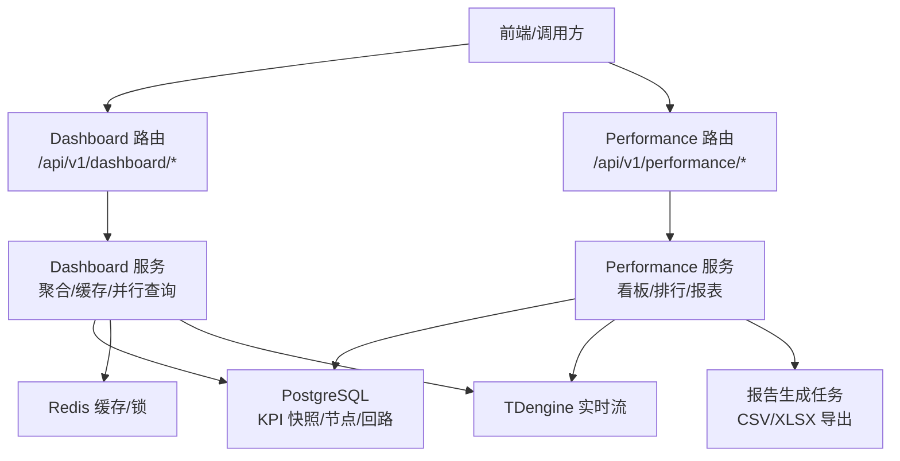
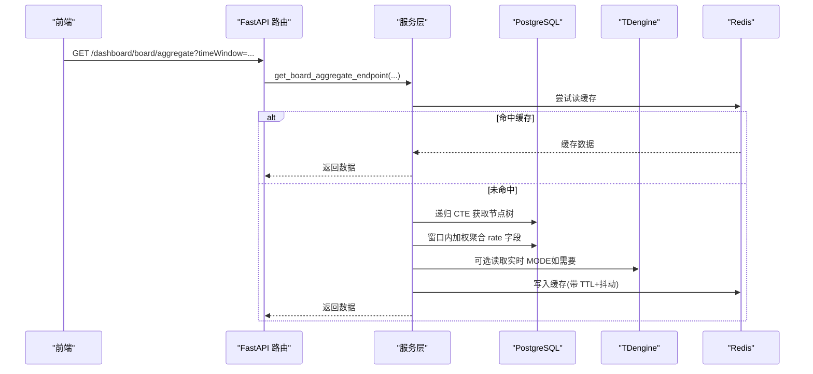
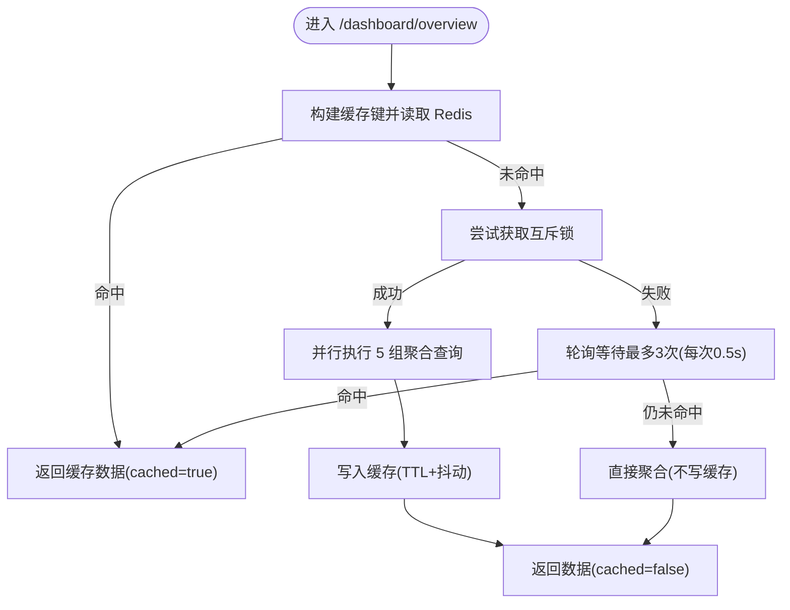
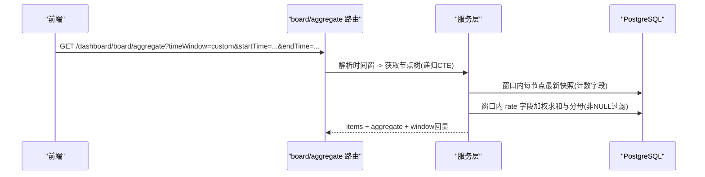
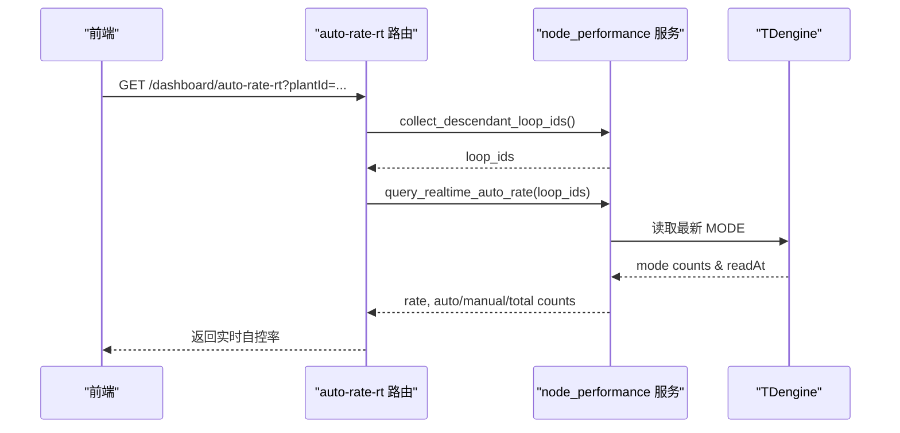
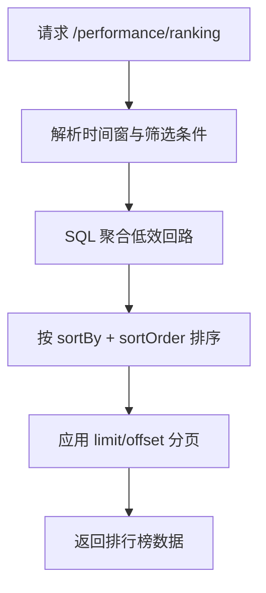
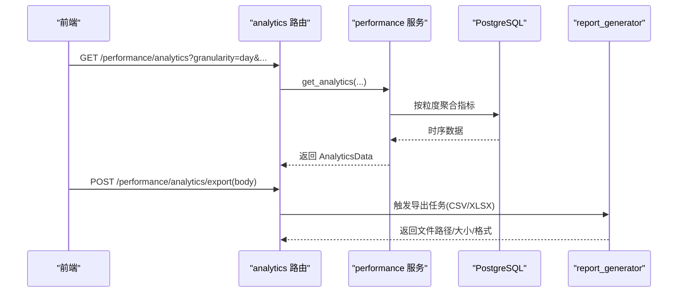
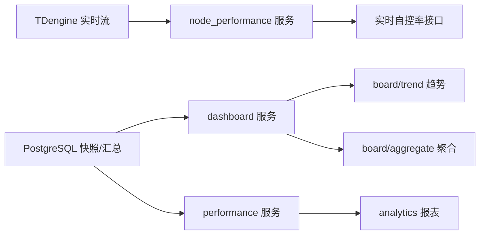
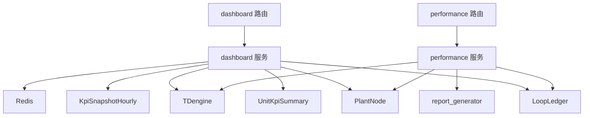

# 仪表盘聚合接口

<cite>
**本文引用的文件**
- [backend/app/api/v1/endpoints/dashboard.py](file://backend/app/api/v1/endpoints/dashboard.py)
- [backend/app/services/dashboard.py](file://backend/app/services/dashboard.py)
- [backend/app/schemas/dashboard.py](file://backend/app/schemas/dashboard.py)
- [backend/app/api/v1/endpoints/performance.py](file://backend/app/api/v1/endpoints/performance.py)
- [backend/app/services/performance.py](file://backend/app/services/performance.py)
- [backend/app/models/loop.py](file://backend/app/models/loop.py)
- [backend/app/models/metric.py](file://backend/app/models/metric.py)
- [backend/app/models/plant_node.py](file://backend/app/models/plant_node.py)
- [backend/app/models/unit_kpi_summary.py](file://backend/app/models/unit_kpi_summary.py)
- [backend/app/core/redis.py](file://backend/app/core/redis.py)
- [backend/app/services/node_performance.py](file://backend/app/services/node_performance.py)
- [backend/app/services/trend_service.py](file://backend/app/services/trend_service.py)
- [backend/app/tasks/report_generator.py](file://backend/app/tasks/report_generator.py)
</cite>

## 目录
1. [简介](#简介)
2. [项目结构](#项目结构)
3. [核心组件](#核心组件)
4. [架构总览](#架构总览)
5. [详细组件分析](#详细组件分析)
6. [依赖关系分析](#依赖关系分析)
7. [性能考虑](#性能考虑)
8. [故障排查指南](#故障排查指南)
9. [结论](#结论)
10. [附录](#附录)

## 简介
本文件为 CLPM-MVP 仪表盘聚合接口的权威 API 文档，覆盖以下能力：
- 全局看板接口：系统概览数据、关键指标汇总、实时自控率统计。
- 多维度分析接口：按装置/单元筛选、时间窗口配置、趋势对比分析。
- 排名查询接口：低效回路排行、排序字段配置、分页查询支持。
- 统计分析接口：报表数据生成、CSV 导出功能、粒度控制（小时/天/周/月）。
- 缓存与性能：Redis 缓存策略、数据聚合算法、性能优化技巧。
- 实时监控与历史分析：实时监控数据获取、历史数据分析、可视化数据准备。

## 项目结构
后端采用 FastAPI 路由 + Service 服务层 + SQLAlchemy 模型的分层架构。仪表盘相关能力主要分布在：
- 路由层：dashboard、performance 两个模块提供对外 HTTP 端点。
- 服务层：dashboard、performance、node_performance、trend_service 等封装业务逻辑与聚合计算。
- 模型层：plant_node、loop、metric、unit_kpi_summary 等描述数据实体。
- 缓存层：core.redis 提供 Redis 客户端用于缓存与互斥锁。
- 任务层：report_generator 负责报表导出（CSV/XLSX）的异步任务实现。

图表来源
- [backend/app/api/v1/endpoints/dashboard.py:41-65](file://backend/app/api/v1/endpoints/dashboard.py#L41-L65)
- [backend/app/api/v1/endpoints/performance.py:134-164](file://backend/app/api/v1/endpoints/performance.py#L134-L164)
- [backend/app/services/dashboard.py:56-115](file://backend/app/services/dashboard.py#L56-L115)
- [backend/app/services/performance.py:1-50](file://backend/app/services/performance.py#L1-L50)

章节来源
- [backend/app/api/v1/endpoints/dashboard.py:1-80](file://backend/app/api/v1/endpoints/dashboard.py#L1-L80)
- [backend/app/api/v1/endpoints/performance.py:1-52](file://backend/app/api/v1/endpoints/performance.py#L1-L52)

## 核心组件
- 工作台聚合（Overview）：返回 6 大 KPI 卡片、低效回路 Top 10、趋势摘要、待处理异常；支持按装置筛选、粒度 day/week/month；Redis 缓存 5 分钟并带 dogpile 锁防抖。
- 节点级聚合看板（Board Aggregate/Trend）：按节点递归聚合子节点 KPI，支持多种时间窗（last_8_hours/last_24_hours/last_72_hours/last_168_hours/today/yesterday/last_7_days/last_30_days/custom），rate 字段按 evaluated_loops 加权平均。
- 实时自控率（Auto Rate RT）：从 TDengine 最新 MODE 值计算自控率，支持递归聚合子孙节点回路。
- 全局看板（Performance Board）：跨模块的全厂/装置级 KPI 汇总，带缓存。
- 低效回路排行（Ranking）：支持多排序字段、方向、分页 offset/limit。
- 统计分析（Analytics）：按小时/天/周/月粒度聚合指标，支持 CSV 导出。

章节来源
- [backend/app/api/v1/endpoints/dashboard.py:41-65](file://backend/app/api/v1/endpoints/dashboard.py#L41-L65)
- [backend/app/api/v1/endpoints/dashboard.py:116-187](file://backend/app/api/v1/endpoints/dashboard.py#L116-L187)
- [backend/app/api/v1/endpoints/dashboard.py:195-388](file://backend/app/api/v1/endpoints/dashboard.py#L195-L388)
- [backend/app/api/v1/endpoints/dashboard.py:554-782](file://backend/app/api/v1/endpoints/dashboard.py#L554-L782)
- [backend/app/api/v1/endpoints/performance.py:134-164](file://backend/app/api/v1/endpoints/performance.py#L134-L164)
- [backend/app/api/v1/endpoints/performance.py:172-214](file://backend/app/api/v1/endpoints/performance.py#L172-L214)
- [backend/app/api/v1/endpoints/performance.py:222-263](file://backend/app/api/v1/endpoints/performance.py#L222-L263)

## 架构总览
仪表盘聚合通过路由层接收请求，服务层执行并行 SQL 聚合、Redis 缓存与降级、以及 TDengine 实时数据读取。节点级聚合使用 PostgreSQL 递归 CTE 聚合子节点，并按 evaluated_loops 进行加权平均，确保父子节点不重复计数。

图表来源
- [backend/app/api/v1/endpoints/dashboard.py:554-782](file://backend/app/api/v1/endpoints/dashboard.py#L554-L782)
- [backend/app/services/dashboard.py:707-761](file://backend/app/services/dashboard.py#L707-L761)
- [backend/app/services/node_performance.py:1-200](file://backend/app/services/node_performance.py#L1-L200)

## 详细组件分析

### 全局看板接口（工作台聚合）
- 端点：GET /api/v1/dashboard/overview
- 参数：
  - plantId：按装置/单元筛选（可选）
  - granularity：day/week/month（默认 day）
- 响应包含：
  - filter_scope：plant_id、plant_name、granularity、user_role
  - kpi_cards：auto_mode_rate、steady_rate、composite_score、alarm_count、operation_count、good_value_rate（每项含 value/unit/trend/delta）
  - inefficient_loops：低效回路 Top 10（SPONSOR 角色为空）
  - trend_summary：最近 7 天每日综合评分
  - pending_alerts：待处理异常数
  - cached：是否来自缓存
- 行为：
  - 角色数据范围：ADMIN/EXPERT 全厂；IC_ENGINEER/PE_ENGINEER 装置级；SPONSOR 工厂级汇总（无低效回路列表）
  - Redis 缓存 key 含 plant_id + granularity + user_role，TTL 5 分钟，带随机抖动避免惊群
  - 并发保护：dogpile 锁，失败时轮询等待或优雅降级直接聚合

图表来源
- [backend/app/services/dashboard.py:56-115](file://backend/app/services/dashboard.py#L56-L115)
- [backend/app/services/dashboard.py:707-761](file://backend/app/services/dashboard.py#L707-L761)

章节来源
- [backend/app/api/v1/endpoints/dashboard.py:41-65](file://backend/app/api/v1/endpoints/dashboard.py#L41-L65)
- [backend/app/services/dashboard.py:56-115](file://backend/app/services/dashboard.py#L56-L115)
- [backend/app/schemas/dashboard.py:110-125](file://backend/app/schemas/dashboard.py#L110-L125)

### 多维度分析接口（节点级聚合看板与趋势）
- 端点：
  - GET /api/v1/dashboard/board/aggregate：节点级聚合 KPI（可启用 timeWindow）
  - GET /api/v1/dashboard/board/trend：节点级聚合趋势（小时粒度）
- 时间窗：
  - last_8_hours/last_24_hours/last_72_hours/last_168_hours/today/yesterday/last_7_days/last_30_days/custom
  - custom 需同时传入 startTime 与 endTime（ISO 8601）
- 聚合口径：
  - rate 类字段按 evaluated_loops 加权平均
  - 计数字段（totalLoops/evaluatedLoops/inconclusiveLoops/excludedLoops/status）取窗口内最新快照
  - 递归聚合当前节点及所有下属 UNIT 节点，避免父子重复计数
- 响应：
  - board/aggregate：items（各节点明细）、aggregate（聚合值）、timeWindow/windowStart/windowEnd（当启用窗口时）
  - board/trend：timestamps、avgScore、autoModeRate、stabilityRate、fastRate、accuracyRate、evaluatedLoops、totalLoops

图表来源
- [backend/app/api/v1/endpoints/dashboard.py:396-451](file://backend/app/api/v1/endpoints/dashboard.py#L396-L451)
- [backend/app/api/v1/endpoints/dashboard.py:469-551](file://backend/app/api/v1/endpoints/dashboard.py#L469-L551)
- [backend/app/api/v1/endpoints/dashboard.py:554-782](file://backend/app/api/v1/endpoints/dashboard.py#L554-L782)

章节来源
- [backend/app/api/v1/endpoints/dashboard.py:195-388](file://backend/app/api/v1/endpoints/dashboard.py#L195-L388)
- [backend/app/api/v1/endpoints/dashboard.py:396-451](file://backend/app/api/v1/endpoints/dashboard.py#L396-L451)
- [backend/app/api/v1/endpoints/dashboard.py:469-551](file://backend/app/api/v1/endpoints/dashboard.py#L469-L551)
- [backend/app/api/v1/endpoints/dashboard.py:554-782](file://backend/app/api/v1/endpoints/dashboard.py#L554-L782)

### 实时自控率统计
- 端点：GET /api/v1/dashboard/auto-rate-rt
- 行为：
  - 收集活跃回路 ID（支持递归聚合子孙节点）
  - 从 TDengine 读取最新 MODE 值计算自控率
  - 若不可用或无 MODE 数据，返回 rate=null 并附带提示信息
- 响应字段：rate、autoCount、manualCount、totalCount、modeCounts（0-4 五种模式）、readAt（最新采集时间）

图表来源
- [backend/app/api/v1/endpoints/dashboard.py:116-187](file://backend/app/api/v1/endpoints/dashboard.py#L116-L187)
- [backend/app/services/node_performance.py:1-200](file://backend/app/services/node_performance.py#L1-L200)

章节来源
- [backend/app/api/v1/endpoints/dashboard.py:116-187](file://backend/app/api/v1/endpoints/dashboard.py#L116-L187)

### 排名查询接口（低效回路排行）
- 端点：GET /api/v1/performance/ranking
- 参数：
  - plantNodeId：按装置/单元筛选（可选）
  - timeWindow：today/yesterday/last_8_hours/last_24_hours/last_72_hours/last_168_hours/last_7_days/last_30_days/custom
  - startTime/endTime：custom 时必填
  - limit：返回条数（1-100）
  - offset：偏移量（配合 limit 实现分页拉全量）
  - sortBy：score/steady_rate/good_value_rate
  - sortOrder：asc/desc
- 行为：
  - 根据时间窗与筛选条件聚合低效回路
  - 支持排序字段与方向
  - 支持 offset/limit 分页，解决 >100 回路时的统计问题

图表来源
- [backend/app/api/v1/endpoints/performance.py:172-214](file://backend/app/api/v1/endpoints/performance.py#L172-L214)

章节来源
- [backend/app/api/v1/endpoints/performance.py:172-214](file://backend/app/api/v1/endpoints/performance.py#L172-L214)

### 统计分析接口（报表与导出）
- 端点：
  - GET /api/v1/performance/analytics：报表数据
  - POST /api/v1/performance/analytics/export：导出 CSV
- 参数：
  - startTime/endTime：起止时间（ISO 8601）
  - plantNodeId：装置/单元筛选（可选）
  - metricKey：指标键（如 score/good_value_rate 等）
  - granularity：hour/day/week/month
- 行为：
  - analytics：按粒度聚合指标，返回时序数据
  - export：生成 CSV 内容并下载（UTF-8 BOM）
  - 后台任务 report_generator 支持 CSV/XLSX 导出，保存至临时目录并返回文件信息

图表来源
- [backend/app/api/v1/endpoints/performance.py:222-263](file://backend/app/api/v1/endpoints/performance.py#L222-L263)
- [backend/app/tasks/report_generator.py:454-498](file://backend/app/tasks/report_generator.py#L454-L498)

章节来源
- [backend/app/api/v1/endpoints/performance.py:222-263](file://backend/app/api/v1/endpoints/performance.py#L222-L263)
- [backend/app/tasks/report_generator.py:454-498](file://backend/app/tasks/report_generator.py#L454-L498)

### 实时监控数据获取与历史数据分析
- 实时监控：
  - 通过 node_performance.query_realtime_auto_rate 从 TDengine 读取最新 MODE 值，计算自控率与模式分布
  - 支持递归聚合子孙节点回路，保证装置级视图正确性
- 历史分析：
  - dashboard/trend 与 dashboard/aggregate 基于 unit_kpi_summary 表，按小时聚合，填充缺失小时序列
  - performance/analytics 支持 hour/day/week/month 粒度聚合，便于趋势对比与报表生成

图表来源
- [backend/app/services/node_performance.py:1-200](file://backend/app/services/node_performance.py#L1-L200)
- [backend/app/api/v1/endpoints/dashboard.py:195-388](file://backend/app/api/v1/endpoints/dashboard.py#L195-L388)
- [backend/app/api/v1/endpoints/dashboard.py:554-782](file://backend/app/api/v1/endpoints/dashboard.py#L554-L782)
- [backend/app/api/v1/endpoints/performance.py:222-263](file://backend/app/api/v1/endpoints/performance.py#L222-L263)

章节来源
- [backend/app/api/v1/endpoints/dashboard.py:116-187](file://backend/app/api/v1/endpoints/dashboard.py#L116-L187)
- [backend/app/api/v1/endpoints/dashboard.py:195-388](file://backend/app/api/v1/endpoints/dashboard.py#L195-L388)
- [backend/app/api/v1/endpoints/dashboard.py:554-782](file://backend/app/api/v1/endpoints/dashboard.py#L554-L782)
- [backend/app/api/v1/endpoints/performance.py:222-263](file://backend/app/api/v1/endpoints/performance.py#L222-L263)

## 依赖关系分析
- 路由层依赖服务层：dashboard.py 路由依赖 services.dashboard；performance.py 路由依赖 services.performance。
- 服务层依赖模型层：使用 LoopLedger、PlantNode、UnitKpiSummary、KpiSnapshotHourly 等模型进行查询与聚合。
- 实时数据依赖 TDengine：node_performance 服务通过 TDengine 获取 MODE 值。
- 缓存依赖 Redis：dashboard 服务使用 Redis 缓存与互斥锁。
- 任务依赖报告生成器：performance 导出 CSV 由 report_generator 任务完成。

图表来源
- [backend/app/api/v1/endpoints/dashboard.py:41-65](file://backend/app/api/v1/endpoints/dashboard.py#L41-L65)
- [backend/app/api/v1/endpoints/performance.py:134-164](file://backend/app/api/v1/endpoints/performance.py#L134-L164)
- [backend/app/services/dashboard.py:123-200](file://backend/app/services/dashboard.py#L123-L200)
- [backend/app/services/performance.py:1-50](file://backend/app/services/performance.py#L1-L50)

章节来源
- [backend/app/api/v1/endpoints/dashboard.py:41-65](file://backend/app/api/v1/endpoints/dashboard.py#L41-L65)
- [backend/app/api/v1/endpoints/performance.py:134-164](file://backend/app/api/v1/endpoints/performance.py#L134-L164)
- [backend/app/services/dashboard.py:123-200](file://backend/app/services/dashboard.py#L123-L200)
- [backend/app/services/performance.py:1-50](file://backend/app/services/performance.py#L1-L50)

## 性能考虑
- 并行查询：dashboard 服务使用 asyncio.gather 并行执行 5 组独立查询，每组使用独立 AsyncSession，避免单会话竞争。
- 加权聚合：board/aggregate 与 board/trend 对 rate 字段使用 evaluated_loops 作为权重，确保多节点聚合准确且避免父子重复计数。
- 时间窗填充：board/trend 生成完整小时序列，缺失小时以 None 填充，保证前端时序图连续性。
- 缓存策略：
  - Redis 缓存 key 含 plant_id、granularity、user_role，TTL 5 分钟，写入时带 ±30s 抖动避免集中过期。
  - dogpile 锁防止缓存击穿，失败时轮询等待或直接降级查询。
- 实时数据：TDengine 提供最新 MODE 值，减少数据库压力，提升实时性。
- 分页与限制：ranking 接口支持 limit/offset，避免一次性返回过大结果集。

[本节为通用性能指导，无需特定文件引用]

## 故障排查指南
- 实时自控率为 null：
  - 检查 TDengine 连接与 MODE 数据是否存在
  - 确认回路 ID 列表是否为空（无活跃回路）
- 缓存未命中或降级：
  - 检查 Redis 可用性，查看日志中的“读取/写入工作台缓存失败”警告
  - 确认 dogpile 锁获取失败后的轮询逻辑是否生效
- 聚合结果为空或异常：
  - 检查时间窗解析是否正确（custom 需同时传入 startTime/endTime）
  - 验证节点树递归 CTE 是否返回预期 UNIT 节点
  - 确认 unit_kpi_summary 表中是否存在对应时间范围的快照

章节来源
- [backend/app/api/v1/endpoints/dashboard.py:116-187](file://backend/app/api/v1/endpoints/dashboard.py#L116-L187)
- [backend/app/services/dashboard.py:707-761](file://backend/app/services/dashboard.py#L707-L761)
- [backend/app/api/v1/endpoints/dashboard.py:396-451](file://backend/app/api/v1/endpoints/dashboard.py#L396-L451)

## 结论
CLPM-MVP 仪表盘聚合接口通过清晰的路由与服务分层、严谨的时间窗与加权聚合算法、高效的 Redis 缓存与并行查询、以及 TDengine 实时数据接入，提供了稳定、可扩展的看板与报表能力。建议在生产环境中关注 Redis 与 TDengine 的健康状态，合理设置缓存 TTL 与滚动窗口，以确保高并发下的性能与准确性。

[本节为总结性内容，无需特定文件引用]

## 附录
- 数据模型参考：
  - LoopLedger：回路台账
  - PlantNode：工厂/区域/单元节点
  - UnitKpiSummary：单元级 KPI 汇总快照
  - KpiSnapshotHourly：回路小时级 KPI 快照
- 常用时间窗与粒度：
  - 时间窗：last_8_hours/last_24_hours/last_72_hours/last_168_hours/today/yesterday/last_7_days/last_30_days/custom
  - 粒度：hour/day/week/month

[本节为概念性说明，无需特定文件引用]