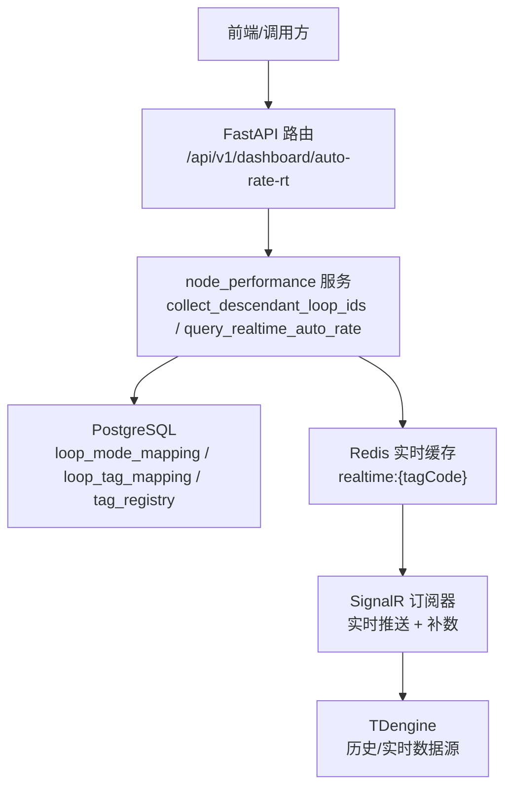
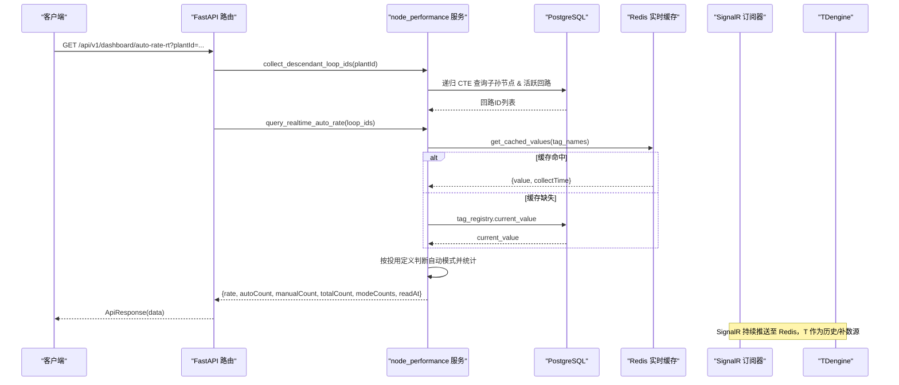
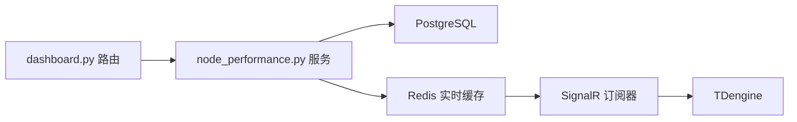

# 实时自控率接口

<cite>
**本文引用的文件**
- [backend/app/api/v1/endpoints/dashboard.py](file://backend/app/api/v1/endpoints/dashboard.py)
- [backend/app/services/node_performance.py](file://backend/app/services/node_performance.py)
- [backend/app/services/data_source/realtime_subscriber.py](file://backend/app/services/data_source/realtime_subscriber.py)
- [backend/tests/test_phase3_new_endpoints.py](file://backend/tests/test_phase3_new_endpoints.py)
</cite>

## 目录
1. [简介](#简介)
2. [项目结构](#项目结构)
3. [核心组件](#核心组件)
4. [架构总览](#架构总览)
5. [详细组件分析](#详细组件分析)
6. [依赖关系分析](#依赖关系分析)
7. [性能考虑](#性能考虑)
8. [故障排查指南](#故障排查指南)
9. [结论](#结论)
10. [附录](#附录)

## 简介
本接口提供“实时自控率”能力：从 TDengine（经 SignalR 订阅器缓存）获取各回路最新 MODE 值，结合回路的投用定义（哪些 MODE 算自动），计算当前时刻的自控率百分比，并返回模式分布与数据新鲜度。支持按节点筛选，递归包含该节点及其所有下属节点的回路。

- 接口路径：GET /api/v1/dashboard/auto-rate-rt
- 刷新频率：每分钟刷新（SignalR 低频角色刷新策略）
- 数据来源优先级：Redis 实时缓存（SignalR 维护）→ PostgreSQL tag_registry.current_value（AAS 同步写入，可能过期）
- 无可用数据或 TDengine/SignalR 不可用时，返回 rate=null 并附带提示信息

## 项目结构
该功能涉及三层协作：
- API 层：路由定义、参数校验、结果封装
- 服务层：递归收集回路、查询实时 MODE、统计自控率
- 数据源层：SignalR 实时订阅器维护 Redis 缓存，供服务层读取

图表来源
- [backend/app/api/v1/endpoints/dashboard.py:116-187](file://backend/app/api/v1/endpoints/dashboard.py#L116-L187)
- [backend/app/services/node_performance.py:62-225](file://backend/app/services/node_performance.py#L62-L225)
- [backend/app/services/data_source/realtime_subscriber.py:1-100](file://backend/app/services/data_source/realtime_subscriber.py#L1-L100)

章节来源
- [backend/app/api/v1/endpoints/dashboard.py:1-187](file://backend/app/api/v1/endpoints/dashboard.py#L1-L187)
- [backend/app/services/node_performance.py:62-225](file://backend/app/services/node_performance.py#L62-L225)
- [backend/app/services/data_source/realtime_subscriber.py:1-100](file://backend/app/services/data_source/realtime_subscriber.py#L1-L100)

## 核心组件
- 路由端点：负责解析 plantId 参数，递归收集回路 ID，调用服务层计算实时自控率，并统一封装响应
- 服务函数：
  - collect_descendant_loop_ids：使用 PostgreSQL 递归 CTE 收集指定节点及所有子孙节点下的活跃回路 ID
  - query_realtime_auto_rate：批量读取 MODE 值（优先 Redis 实时缓存，缺失则回退数据库），按投用定义判断自动模式，统计自控率与模式分布
- 实时订阅器：通过 SignalR 订阅实时数据，维护 Redis 缓存 key realtime:{tagCode}，TTL 为 1 小时；对低频角色（如 MODE）定期刷新，保障缓存新鲜度

章节来源
- [backend/app/api/v1/endpoints/dashboard.py:116-187](file://backend/app/api/v1/endpoints/dashboard.py#L116-L187)
- [backend/app/services/node_performance.py:62-225](file://backend/app/services/node_performance.py#L62-L225)
- [backend/app/services/data_source/realtime_subscriber.py:1-100](file://backend/app/services/data_source/realtime_subscriber.py#L1-L100)

## 架构总览
请求处理时序如下：

图表来源
- [backend/app/api/v1/endpoints/dashboard.py:116-187](file://backend/app/api/v1/endpoints/dashboard.py#L116-L187)
- [backend/app/services/node_performance.py:95-225](file://backend/app/services/node_performance.py#L95-L225)
- [backend/app/services/data_source/realtime_subscriber.py:1-100](file://backend/app/services/data_source/realtime_subscriber.py#L1-L100)

## 详细组件分析

### 接口定义与参数
- 方法：GET
- 路径：/api/v1/dashboard/auto-rate-rt
- 查询参数：
  - plantId：可选。按节点筛选；为空时统计全厂；递归包含所有下属节点
- 认证：需要当前用户上下文（由依赖注入提供）

章节来源
- [backend/app/api/v1/endpoints/dashboard.py:116-121](file://backend/app/api/v1/endpoints/dashboard.py#L116-L121)

### 返回数据结构
- rate：自控率百分比（0-100），浮点数；无可用数据时为 null
- autoCount：自动模式回路数（整数）
- manualCount：手动模式回路数（整数）
- totalCount：有效回路总数（整数）
- modeCounts：五种模式的回路数分布（键为字符串化的 0/1/2/3/4，值为整数）
- readAt：数据最新时间（ISO 字符串），取自实时缓存 collectTime 的最大值；若全部回退到数据库值则为 None，表示实时流中断或数据可能过期

章节来源
- [backend/app/api/v1/endpoints/dashboard.py:122-187](file://backend/app/api/v1/endpoints/dashboard.py#L122-L187)
- [backend/app/services/node_performance.py:110-225](file://backend/app/services/node_performance.py#L110-L225)

### 递归聚合机制
- 当传入 plantId 时，使用 PostgreSQL 递归 CTE 遍历 plant_node 树，收集该节点及其所有子孙节点下挂载的回路 ID（仅 is_active=True）
- 未传 plantId 时，直接查询全厂活跃回路
- 后续统计基于这些回路 ID 进行

章节来源
- [backend/app/services/node_performance.py:62-87](file://backend/app/services/node_performance.py#L62-L87)
- [backend/app/api/v1/endpoints/dashboard.py:141-149](file://backend/app/api/v1/endpoints/dashboard.py#L141-L149)

### MODE 取值与自动模式判定
- 批量查询每个回路的 MODE tag 映射（loop_tag_mapping → tag_registry.tag_name）
- 读取最新 MODE 值：
  - 优先从 Redis 实时缓存（SignalR 订阅器维护）读取，key 为 realtime:{tagCode}，包含 value 与 collectTime
  - 缺失时回退到 tag_registry.current_value（AAS 同步写入，可能过期）
- 根据 loop_mode_mapping 中 is_auto=true 的 mode_value 集合判断是否算自动模式；若无配置，回退默认集合 {1,2,3}
- 统计：
  - valid_count：有有效 MODE 值的回路数
  - auto_count：处于自动模式的回路数
  - mode_counts：0-4 各模式的计数
  - rate = auto_count / valid_count * 100

章节来源
- [backend/app/services/node_performance.py:127-225](file://backend/app/services/node_performance.py#L127-L225)

### 实时数据获取与回退机制
- 实时缓存：SignalR 订阅器连接模拟 SignalR Hub，接收 updateRealValues 消息，将值写入 Redis 缓存，TTL 为 1 小时
- 低频角色刷新：MODE 等低频信号每 60 秒重新订阅以刷新缓存，避免前端显示空白
- 断线重连与看门狗：无消息超时断开重连，指数退避
- 断点续传（Gap Backfill）：检测缺口后触发后台补数任务，调用历史导入接口，覆盖 TDengine 同 ts 数据，并触发受影响小时的 KPI 回算
- 回退路径：Redis 缺失 → tag_registry.current_value → 无数据则返回 rate=null

章节来源
- [backend/app/services/data_source/realtime_subscriber.py:1-100](file://backend/app/services/data_source/realtime_subscriber.py#L1-L100)
- [backend/app/services/node_performance.py:153-183](file://backend/app/services/node_performance.py#L153-L183)

### 错误处理与边界条件
- 无活跃回路：返回 rate=null，totalCount=0，modeCounts 全 0，readAt=None，message 提示“无活跃回路”
- 无 MODE 数据或实时流中断：返回 rate=null，message 提示“TDengine 不可用或无 MODE 数据”
- 无效 MODE 值：跳过该回路，不参与统计
- 全部回退数据库值：readAt=None，表示实时流中断或数据可能过期

章节来源
- [backend/app/api/v1/endpoints/dashboard.py:151-176](file://backend/app/api/v1/endpoints/dashboard.py#L151-L176)
- [backend/app/services/node_performance.py:149-209](file://backend/app/services/node_performance.py#L149-L209)

### 实时监控场景示例
- 仪表盘半圆径向展示：前端每秒轮询该接口，展示 rate 与 modeCounts 饼图，readAt 用于标注数据新鲜度
- 装置级监控：传入 plantId，查看该装置及其下属单元的实时自控率
- 告警联动：当 readAt 长时间为 None 或 rate 突降，触发告警检查 SignalR 连接与 TDengine 数据链路

章节来源
- [backend/app/api/v1/endpoints/dashboard.py:116-187](file://backend/app/api/v1/endpoints/dashboard.py#L116-L187)
- [backend/tests/test_phase3_new_endpoints.py:320-334](file://backend/tests/test_phase3_new_endpoints.py#L320-L334)

## 依赖关系分析
- 路由依赖：
  - 数据库会话（AsyncSession）
  - 当前用户（权限控制）
  - 服务模块 node_performance
- 服务依赖：
  - PostgreSQL：loop_mode_mapping、loop_tag_mapping、tag_registry
  - Redis：实时缓存（SignalR 维护）
  - SignalR 订阅器：实时数据推送与补数
- 外部系统：
  - TDengine：历史/实时数据源（通过 SignalR 订阅器间接访问）

图表来源
- [backend/app/api/v1/endpoints/dashboard.py:116-187](file://backend/app/api/v1/endpoints/dashboard.py#L116-L187)
- [backend/app/services/node_performance.py:95-225](file://backend/app/services/node_performance.py#L95-L225)
- [backend/app/services/data_source/realtime_subscriber.py:1-100](file://backend/app/services/data_source/realtime_subscriber.py#L1-L100)

章节来源
- [backend/app/api/v1/endpoints/dashboard.py:116-187](file://backend/app/api/v1/endpoints/dashboard.py#L116-L187)
- [backend/app/services/node_performance.py:95-225](file://backend/app/services/node_performance.py#L95-L225)
- [backend/app/services/data_source/realtime_subscriber.py:1-100](file://backend/app/services/data_source/realtime_subscriber.py#L1-L100)

## 性能考虑
- 递归 CTE 查询：在 PostgreSQL 侧完成节点树遍历与回路过滤，减少应用层开销
- 批量读取 MODE 值：一次性获取所有 tag 的最新值，降低网络往返
- Redis 缓存：高频读取走内存，降低数据库压力；TTL 1 小时保证数据新鲜度
- 低频角色刷新：MODE 每 60 秒刷新，平衡实时性与资源消耗
- 回退机制：缓存缺失时快速回退数据库，保证可用性
- 建议：
  - 合理设置 plantId 范围，避免全厂大集合导致响应变慢
  - 监控 Redis 命中率与 SignalR 连接状态
  - 关注 readAt 变化，及时定位数据链路问题

[本节为通用指导，不直接分析具体文件]

## 故障排查指南
- 现象：rate=null，totalCount=0
  - 检查是否存在活跃回路（is_active=True）
  - 检查 loop_tag_mapping 是否正确配置 MODE tag
- 现象：readAt=None
  - 检查 SignalR 订阅器是否在线，Redis 是否有 realtime:{tagCode} 数据
  - 检查 tag_registry.current_value 是否为空
- 现象：modeCounts 异常
  - 检查 loop_mode_mapping 中 is_auto 配置是否符合预期
  - 检查 MODE 值类型转换（int(float(value))）是否成功
- 现象：频繁回退数据库
  - 检查 SignalR 连接稳定性与看门狗超时设置
  - 检查 Gap Backfill 任务是否正常运行

章节来源
- [backend/app/api/v1/endpoints/dashboard.py:151-176](file://backend/app/api/v1/endpoints/dashboard.py#L151-L176)
- [backend/app/services/node_performance.py:149-209](file://backend/app/services/node_performance.py#L149-L209)
- [backend/app/services/data_source/realtime_subscriber.py:1-100](file://backend/app/services/data_source/realtime_subscriber.py#L1-L100)

## 结论
该接口通过“递归节点筛选 + 实时 MODE 缓存 + 投用定义判定”的组合，提供了高可用的实时自控率能力。其设计兼顾了实时性（SignalR + Redis）、可靠性（多源回退、断点续传）与可扩展性（节点递归聚合）。在生产环境中，建议结合 readAt 与模式分布进行监控与告警，确保数据链路的稳定与准确。

[本节为总结，不直接分析具体文件]

## 附录
- 相关测试用例：验证无活跃回路时的行为
- 参考文档：FDS v5.1 §5.3.6, UIUX v5.3 ①

章节来源
- [backend/tests/test_phase3_new_endpoints.py:320-334](file://backend/tests/test_phase3_new_endpoints.py#L320-L334)