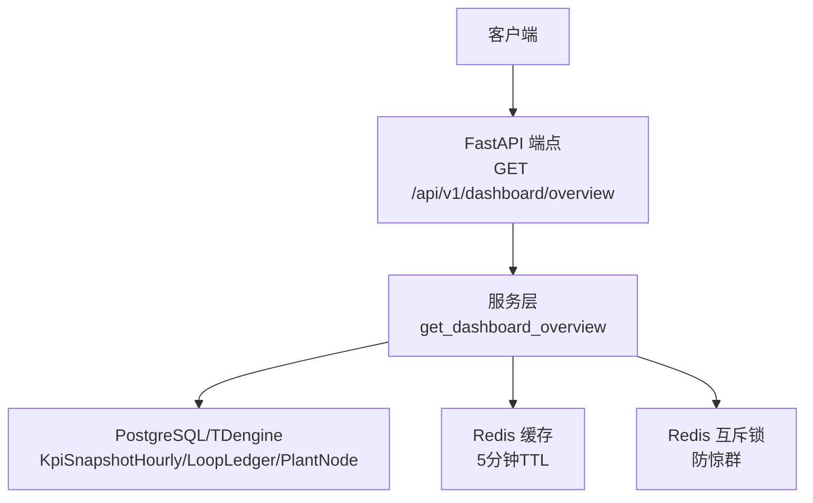
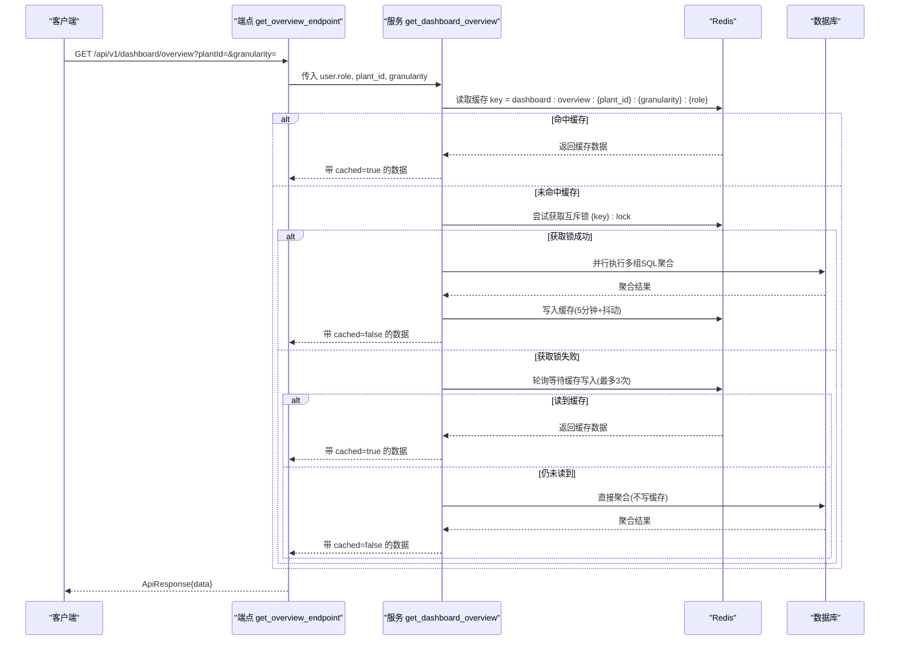
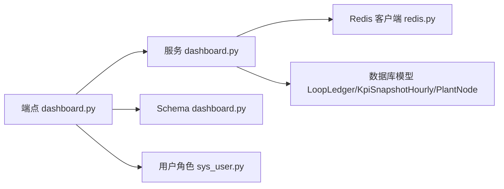

# 工作台聚合接口

<cite>
**本文引用的文件**
- [backend/app/api/v1/endpoints/dashboard.py](file://backend/app/api/v1/endpoints/dashboard.py)
- [backend/app/services/dashboard.py](file://backend/app/services/dashboard.py)
- [backend/app/schemas/dashboard.py](file://backend/app/schemas/dashboard.py)
- [backend/app/core/redis.py](file://backend/app/core/redis.py)
- [backend/app/models/sys_user.py](file://backend/app/models/sys_user.py)
- [backend/tests/test_dashboard.py](file://backend/tests/test_dashboard.py)
</cite>

## 目录
1. [简介](#简介)
2. [项目结构](#项目结构)
3. [核心组件](#核心组件)
4. [架构总览](#架构总览)
5. [详细组件分析](#详细组件分析)
6. [依赖关系分析](#依赖关系分析)
7. [性能考虑](#性能考虑)
8. [故障排查指南](#故障排查指南)
9. [结论](#结论)
10. [附录](#附录)

## 简介
本文档面向 CLPM-MVP 工作台聚合接口 GET /api/v1/dashboard/overview，说明其功能、参数、角色权限、Redis 缓存策略、请求与响应数据结构、错误处理及性能优化建议。该接口返回：
- 6 大 KPI 指标（自控投用率、平稳率、综合评分、报警次数、操作频次、好值率）
- 低效回路 Top 10（按综合评分升序）
- 趋势数据（最近 7 天每日综合评分）
- 异常信息（待处理诊断与跟踪器数量）

## 项目结构
该接口由三层构成：
- API 层：定义路由、参数校验与统一响应封装
- 服务层：实现聚合计算、并行查询、角色过滤与 Redis 缓存
- 模型与 Schema：定义数据库模型与响应结构

图表来源
- [backend/app/api/v1/endpoints/dashboard.py:41-65](file://backend/app/api/v1/endpoints/dashboard.py#L41-L65)
- [backend/app/services/dashboard.py:56-115](file://backend/app/services/dashboard.py#L56-L115)
- [backend/app/core/redis.py:130-137](file://backend/app/core/redis.py#L130-L137)

章节来源
- [backend/app/api/v1/endpoints/dashboard.py:1-65](file://backend/app/api/v1/endpoints/dashboard.py#L1-L65)
- [backend/app/services/dashboard.py:1-115](file://backend/app/services/dashboard.py#L1-L115)

## 核心组件
- 端点函数：接收 plantId、granularity、当前用户角色，调用服务层聚合并返回统一成功响应
- 服务函数：构建缓存 key、尝试读缓存、获取互斥锁、并行执行多组 SQL 聚合、写缓存并返回结果
- 缓存模块：基于 Redis 的异步客户端，支持 TTL 与抖动、互斥锁、异常降级
- 权限控制：依据用户角色决定数据范围与是否返回低效回路列表
- Schema：定义响应体字段结构与类型约束

章节来源
- [backend/app/api/v1/endpoints/dashboard.py:41-65](file://backend/app/api/v1/endpoints/dashboard.py#L41-L65)
- [backend/app/services/dashboard.py:56-115](file://backend/app/services/dashboard.py#L56-L115)
- [backend/app/schemas/dashboard.py:100-119](file://backend/app/schemas/dashboard.py#L100-L119)
- [backend/app/core/redis.py:130-137](file://backend/app/core/redis.py#L130-L137)

## 架构总览

图表来源
- [backend/app/api/v1/endpoints/dashboard.py:41-65](file://backend/app/api/v1/endpoints/dashboard.py#L41-L65)
- [backend/app/services/dashboard.py:56-115](file://backend/app/services/dashboard.py#L56-L115)
- [backend/app/services/dashboard.py:711-761](file://backend/app/services/dashboard.py#L711-L761)

## 详细组件分析

### 接口定义与参数
- 路径与方法：GET /api/v1/dashboard/overview
- 查询参数
  - plantId：可选，按装置/单元筛选
  - granularity：时间粒度，day（最近24小时）、week（最近7天）、month（最近30天），默认 day
- 认证与鉴权：通过当前登录用户角色进行数据范围控制
- 响应包装：统一 ApiResponse.success(data=...)

章节来源
- [backend/app/api/v1/endpoints/dashboard.py:41-65](file://backend/app/api/v1/endpoints/dashboard.py#L41-L65)

### 角色权限与数据范围
- ADMIN/EXPERT：全厂数据
- IC_ENGINEER/PE_ENGINEER：装置级数据
- SPONSOR：工厂级汇总，仅返回 KPI 卡片，不返回低效回路列表
- 角色来源于 sys_user.role，受数据库约束限制为固定枚举

章节来源
- [backend/app/services/dashboard.py:42-45](file://backend/app/services/dashboard.py#L42-L45)
- [backend/app/models/sys_user.py:40-44](file://backend/app/models/sys_user.py#L40-L44)

### 缓存策略
- 缓存键：dashboard:overview:{plant_id}:{granularity}:{role}
- 过期时间：5 分钟（300 秒），写入时加入 ±30 秒抖动避免集中过期
- 互斥锁：使用 SET key 1 NX EX 10 防止并发重复计算
- 降级策略：Redis 不可用时跳过缓存，直接查询数据库；读/写失败均记录警告日志并继续

章节来源
- [backend/app/services/dashboard.py:31-33](file://backend/app/services/dashboard.py#L31-L33)
- [backend/app/services/dashboard.py:711-761](file://backend/app/services/dashboard.py#L711-L761)
- [backend/app/core/redis.py:130-137](file://backend/app/core/redis.py#L130-L137)

### 聚合逻辑与并行查询
- 并行任务：KPI 卡片、计数、趋势摘要、待处理异常、低效回路（SPONSOR 跳过）
- 每个任务在独立 AsyncSession 中执行，避免会话竞争
- 时间窗口：根据 granularity 计算 current_start/previous_start，用于同比对比
- 趋势摘要：最近 7 天每日综合评分平均值
- 低效回路：取时间窗内每个回路的最新快照，按综合评分升序取前 10

章节来源
- [backend/app/services/dashboard.py:123-200](file://backend/app/services/dashboard.py#L123-L200)
- [backend/app/services/dashboard.py:244-363](file://backend/app/services/dashboard.py#L244-L363)
- [backend/app/services/dashboard.py:480-553](file://backend/app/services/dashboard.py#L480-L553)

### 响应数据结构
- filter_scope：包含 plant_id、plant_name、granularity、user_role
- kpi_cards：6 个 KPI 卡片，每个含 value、unit、trend、delta
- inefficient_loops：低效回路列表项（SPONSOR 为空）
- trend_summary：dates 与 composite_scores（最近 7 天）
- pending_alerts：open_diagnoses、open_trackers
- cached：布尔值，指示本次响应是否来自缓存

章节来源
- [backend/app/schemas/dashboard.py:100-119](file://backend/app/schemas/dashboard.py#L100-L119)
- [backend/app/services/dashboard.py:189-200](file://backend/app/services/dashboard.py#L189-L200)

### 请求示例与响应示例
- 请求示例
  - GET /api/v1/dashboard/overview?plantId=装置UUID&granularity=week
  - GET /api/v1/dashboard/overview?granularity=month
- 响应示例（简化）
  - code: "0"
  - data:
    - filter_scope: { plant_id, plant_name, granularity, user_role }
    - kpi_cards: { auto_mode_rate, steady_rate, composite_score, alarm_count, operation_count, good_value_rate }
    - inefficient_loops: [ { loop_id, loop_tag, loop_name, plant_name, composite_score, diagnosis_labels, key_metric } ]
    - trend_summary: { dates, composite_scores }
    - pending_alerts: { open_diagnoses, open_trackers }
    - cached: true/false

章节来源
- [backend/tests/test_dashboard.py:132-182](file://backend/tests/test_dashboard.py#L132-L182)
- [backend/app/schemas/dashboard.py:21-119](file://backend/app/schemas/dashboard.py#L21-L119)

### 错误处理
- 参数校验：由 FastAPI Query 自动校验，granularity 默认 day
- 角色权限：服务层根据 role 决定是否查询低效回路
- Redis 异常：读/写/锁操作异常时记录警告并降级为直查
- 无数据场景：当无活跃回路或无快照时返回空集合或零值，保证前端稳定渲染

章节来源
- [backend/app/services/dashboard.py:720-761](file://backend/app/services/dashboard.py#L720-L761)
- [backend/app/api/v1/endpoints/dashboard.py:41-65](file://backend/app/api/v1/endpoints/dashboard.py#L41-L65)

## 依赖关系分析

图表来源
- [backend/app/api/v1/endpoints/dashboard.py:41-65](file://backend/app/api/v1/endpoints/dashboard.py#L41-L65)
- [backend/app/services/dashboard.py:56-115](file://backend/app/services/dashboard.py#L56-L115)
- [backend/app/core/redis.py:130-137](file://backend/app/core/redis.py#L130-L137)
- [backend/app/models/sys_user.py:40-44](file://backend/app/models/sys_user.py#L40-L44)

章节来源
- [backend/app/api/v1/endpoints/dashboard.py:41-65](file://backend/app/api/v1/endpoints/dashboard.py#L41-L65)
- [backend/app/services/dashboard.py:56-115](file://backend/app/services/dashboard.py#L56-L115)

## 性能考虑
- 并行查询：使用 asyncio.gather 并行执行 5 组独立查询，提升吞吐
- SQL 聚合：采用 date_trunc + GROUP BY + avg/sum 减少应用层计算
- 缓存策略：5 分钟 TTL + 抖动，降低热点 key 同时过期压力
- 互斥锁：dogpile 模式避免缓存击穿
- 连接隔离：每个并行任务使用独立 AsyncSession，避免会话竞争
- 降级机制：Redis 不可用时自动回退到数据库直查，保障可用性

章节来源
- [backend/app/services/dashboard.py:147-183](file://backend/app/services/dashboard.py#L147-L183)
- [backend/app/services/dashboard.py:711-761](file://backend/app/services/dashboard.py#L711-L761)

## 故障排查指南
- 现象：接口响应慢
  - 检查 Redis 是否可用，若不可用将走直查路径
  - 检查数据库负载与索引，确认 KpiSnapshotHourly 与 LoopLedger 关联查询效率
- 现象：缓存未命中
  - 核对缓存 key 是否包含正确的 plant_id、granularity、user_role
  - 检查互斥锁是否被其他请求持有，轮询等待是否超时
- 现象：低效回路为空
  - 确认当前角色是否为 SPONSOR（该角色不返回低效回路）
  - 检查时间窗内是否存在 SUCCESS 状态的快照
- 现象：趋势数据缺失
  - 检查最近 7 天是否有有效快照，确认 status 为 SUCCESS
- 现象：KPI 卡片值为空
  - 检查对应字段在快照中是否为 NULL，服务层会返回 None 并标记趋势为 stable

章节来源
- [backend/app/services/dashboard.py:720-761](file://backend/app/services/dashboard.py#L720-L761)
- [backend/app/services/dashboard.py:317-363](file://backend/app/services/dashboard.py#L317-L363)
- [backend/app/services/dashboard.py:480-553](file://backend/app/services/dashboard.py#L480-L553)

## 结论
GET /api/v1/dashboard/overview 提供了工作台所需的核心聚合能力，具备清晰的参数配置、严格的角色权限控制、健壮的 Redis 缓存与降级策略，以及高效的并行查询与 SQL 聚合。通过合理的缓存键设计与互斥锁机制，系统在高并发下仍能保持稳定与高性能。

## 附录

### 接口规范速览
- 方法：GET
- 路径：/api/v1/dashboard/overview
- 查询参数
  - plantId：可选，装置/单元 UUID
  - granularity：day/week/month，默认 day
- 响应体
  - code：字符串状态码
  - data：对象，包含 filter_scope、kpi_cards、inefficient_loops、trend_summary、pending_alerts、cached

章节来源
- [backend/app/api/v1/endpoints/dashboard.py:41-65](file://backend/app/api/v1/endpoints/dashboard.py#L41-L65)
- [backend/app/schemas/dashboard.py:100-119](file://backend/app/schemas/dashboard.py#L100-L119)

### 角色与数据范围对照表
- ADMIN/EXPERT：全厂数据，包含低效回路列表
- IC_ENGINEER/PE_ENGINEER：装置级数据，包含低效回路列表
- SPONSOR：工厂级汇总，不包含低效回路列表

章节来源
- [backend/app/services/dashboard.py:42-45](file://backend/app/services/dashboard.py#L42-L45)
- [backend/app/models/sys_user.py:40-44](file://backend/app/models/sys_user.py#L40-L44)

### 缓存键与TTL
- 键模板：dashboard:overview:{plant_id}:{granularity}:{role}
- TTL：300 秒（±30 秒抖动）
- 互斥锁：{cache_key}:lock，NX + EX 10

章节来源
- [backend/app/services/dashboard.py:31-33](file://backend/app/services/dashboard.py#L31-L33)
- [backend/app/services/dashboard.py:711-761](file://backend/app/services/dashboard.py#L711-L761)