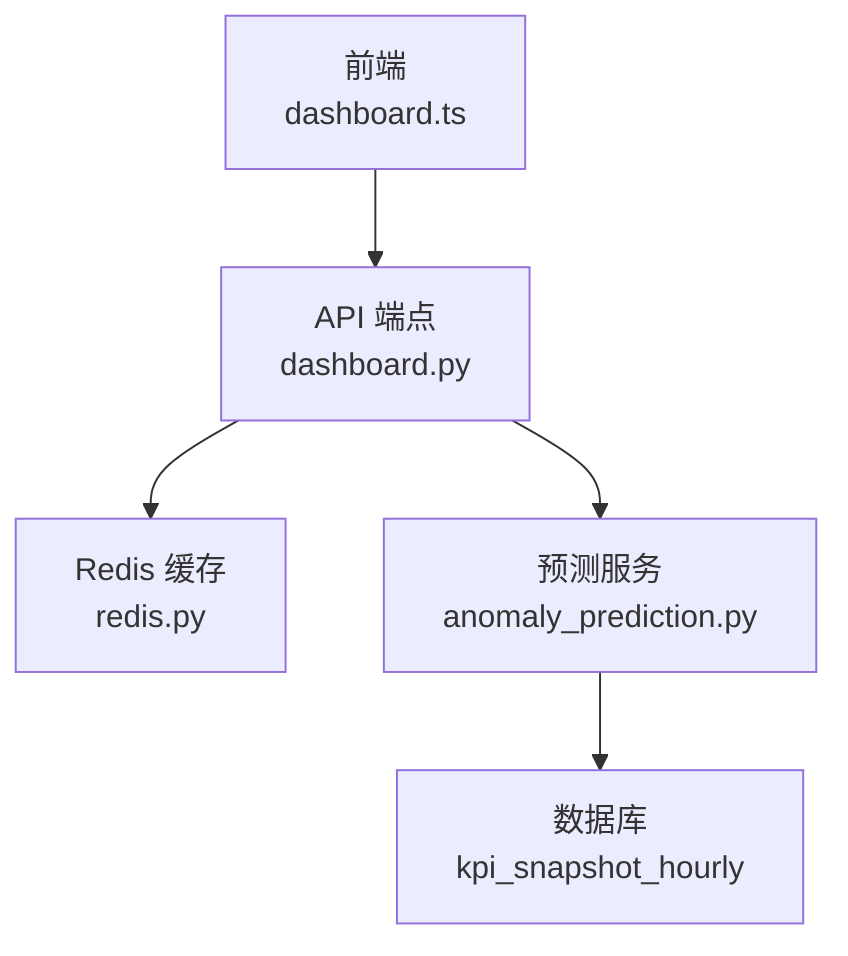
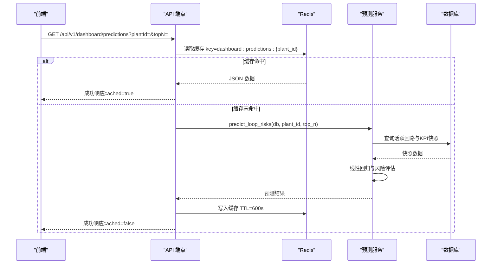
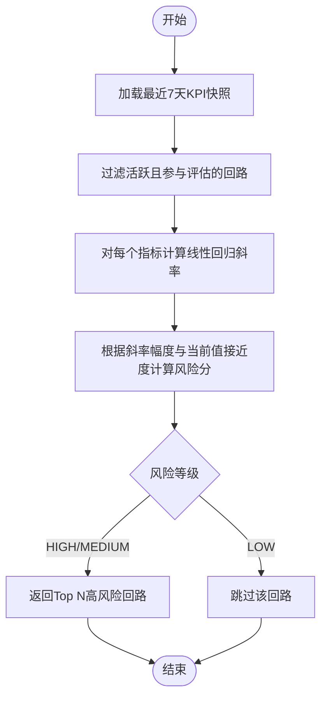
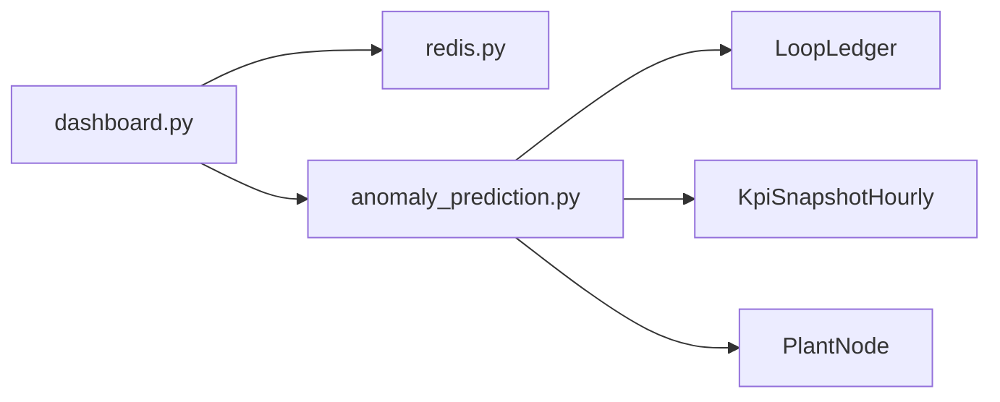

# 异常预测接口

<cite>
**本文引用的文件**
- [backend/app/api/v1/endpoints/dashboard.py](file://backend/app/api/v1/endpoints/dashboard.py)
- [backend/app/services/anomaly_prediction.py](file://backend/app/services/anomaly_prediction.py)
- [backend/app/core/redis.py](file://backend/app/core/redis.py)
- [backend/tests/test_anomaly_prediction.py](file://backend/tests/test_anomaly_prediction.py)
- [frontend/apps/web-antd/src/api/dashboard.ts](file://frontend/apps/web-antd/src/api/dashboard.ts)
</cite>

## 目录
1. [简介](#简介)
2. [项目结构](#项目结构)
3. [核心组件](#核心组件)
4. [架构总览](#架构总览)
5. [详细组件分析](#详细组件分析)
6. [依赖关系分析](#依赖关系分析)
7. [性能考量](#性能考量)
8. [故障排查指南](#故障排查指南)
9. [结论](#结论)
10. [附录](#附录)

## 简介
本接口提供“异常预测与提前预警”能力，基于历史 KPI 快照趋势（线性回归）预测未来 24 小时内可能出问题的控制回路，并按风险等级排序返回高风险回路。该接口支持按装置筛选、限制返回的高风险回路数量，并通过 Redis 缓存提升查询性能。

## 项目结构
- API 路由定义：后端在 dashboard 路由下暴露 /api/v1/dashboard/predictions 端点。
- 业务服务：anomaly_prediction 服务实现预测算法与数据聚合。
- 缓存层：Redis 客户端封装，用于缓存预测结果。
- 前端调用：web-antd 通过 getPredictionsApi 调用该接口。

图表来源
- [backend/app/api/v1/endpoints/dashboard.py:793-844](file://backend/app/api/v1/endpoints/dashboard.py#L793-L844)
- [backend/app/services/anomaly_prediction.py:273-387](file://backend/app/services/anomaly_prediction.py#L273-L387)
- [backend/app/core/redis.py:130-137](file://backend/app/core/redis.py#L130-L137)
- [frontend/apps/web-antd/src/api/dashboard.ts:426-438](file://frontend/apps/web-antd/src/api/dashboard.ts#L426-L438)

章节来源
- [backend/app/api/v1/endpoints/dashboard.py:793-844](file://backend/app/api/v1/endpoints/dashboard.py#L793-L844)
- [backend/app/services/anomaly_prediction.py:273-387](file://backend/app/services/anomaly_prediction.py#L273-L387)
- [backend/app/core/redis.py:130-137](file://backend/app/core/redis.py#L130-L137)
- [frontend/apps/web-antd/src/api/dashboard.ts:426-438](file://frontend/apps/web-antd/src/api/dashboard.ts#L426-L438)

## 核心组件
- API 端点：GET /api/v1/dashboard/predictions
  - 参数：plantId（可选，按装置筛选）、topN（默认10，范围1-50）
  - 权限：登录用户可访问
  - 缓存：Redis 10 分钟，键包含 plant_id
  - 数据源：kpi_snapshot_hourly（status=SUCCESS）
- 预测服务：predict_loop_risks
  - 输入：数据库会话、plant_id、top_n
  - 输出：predictions、totalLoopsAnalyzed、highRiskCount、mediumRiskCount、generatedAt、forecastHorizonHours
- 风险评估：综合风险分（0~100），等级划分 HIGH≥60、MEDIUM≥30、LOW<30
- 趋势分析：对 score、oscillation_rate、saturation_rate、steady_rate 进行线性回归，计算斜率与24小时预测值

章节来源
- [backend/app/api/v1/endpoints/dashboard.py:793-844](file://backend/app/api/v1/endpoints/dashboard.py#L793-L844)
- [backend/app/services/anomaly_prediction.py:38-65](file://backend/app/services/anomaly_prediction.py#L38-L65)
- [backend/app/services/anomaly_prediction.py:273-387](file://backend/app/services/anomaly_prediction.py#L273-L387)

## 架构总览
请求从前端发起，经 API 端点校验参数并尝试读取 Redis 缓存；若命中则直接返回；否则调用预测服务进行批量趋势分析与风险评估，并将结果写入 Redis 缓存后返回。

图表来源
- [backend/app/api/v1/endpoints/dashboard.py:793-844](file://backend/app/api/v1/endpoints/dashboard.py#L793-L844)
- [backend/app/services/anomaly_prediction.py:273-387](file://backend/app/services/anomaly_prediction.py#L273-L387)
- [backend/app/core/redis.py:130-137](file://backend/app/core/redis.py#L130-L137)

## 详细组件分析

### API 端点：GET /api/v1/dashboard/predictions
- 功能：基于最近7天 KPI 快照趋势（线性回归），预测未来24小时可能出问题的回路，返回高风险回路列表（按风险分降序），仅含 MEDIUM+HIGH 等级。
- 参数：
  - plantId：字符串，可选。为空时分析全厂。
  - topN：整数，默认10，范围1-50。返回的高风险回路数。
- 权限：所有登录用户可访问。
- 缓存策略：
  - Redis 键格式：dashboard:predictions:{plant_id}
  - TTL：600秒（10分钟）
  - 命中时返回 cached=true，未命中时 cached=false
- 数据源：kpi_snapshot_hourly（status=SUCCESS）
- 风险等级：
  - HIGH（≥60分）：多个指标显著恶化，建议立即关注
  - MEDIUM（≥30分）：部分指标有恶化趋势，建议密切观察
  - LOW（<30分）：不返回

章节来源
- [backend/app/api/v1/endpoints/dashboard.py:793-844](file://backend/app/api/v1/endpoints/dashboard.py#L793-L844)

### 预测算法原理
- 数据窗口：最近7天的小时级 KPI 快照（status=SUCCESS）
- 关键指标：
  - score：综合评分，下降为风险
  - oscillation_rate：振荡率，上升为风险
  - saturation_rate：饱和率，上升为风险
  - steady_rate：平稳率，下降为风险
- 趋势分析：最小二乘线性回归，计算斜率与截距，预测24小时后值
- 风险评估：
  - 权重：score下降权重最高，其次振荡率上升、平稳率下降、饱和率上升
  - 当前值接近度：越接近告警阈值，风险叠加越大
  - 综合风险分：0~100，等级划分 HIGH≥60、MEDIUM≥30、LOW<30
- 返回 Top N 高风险回路，按风险分降序排列

图表来源
- [backend/app/services/anomaly_prediction.py:38-65](file://backend/app/services/anomaly_prediction.py#L38-L65)
- [backend/app/services/anomaly_prediction.py:107-145](file://backend/app/services/anomaly_prediction.py#L107-L145)
- [backend/app/services/anomaly_prediction.py:153-251](file://backend/app/services/anomaly_prediction.py#L153-L251)
- [backend/app/services/anomaly_prediction.py:273-387](file://backend/app/services/anomaly_prediction.py#L273-L387)

章节来源
- [backend/app/services/anomaly_prediction.py:38-65](file://backend/app/services/anomaly_prediction.py#L38-L65)
- [backend/app/services/anomaly_prediction.py:107-145](file://backend/app/services/anomaly_prediction.py#L107-L145)
- [backend/app/services/anomaly_prediction.py:153-251](file://backend/app/services/anomaly_prediction.py#L153-L251)
- [backend/app/services/anomaly_prediction.py:273-387](file://backend/app/services/anomaly_prediction.py#L273-L387)

### Redis 缓存策略
- 键命名：dashboard:predictions:{plant_id}，按装置分键存储
- TTL：600秒（10分钟）
- 行为：
  - 首次请求：计算预测结果并写入缓存
  - 后续请求：命中缓存直接返回，减少数据库压力
  - 异常降级：Redis 不可用时跳过缓存，直接计算

章节来源
- [backend/app/api/v1/endpoints/dashboard.py:789-844](file://backend/app/api/v1/endpoints/dashboard.py#L789-L844)
- [backend/app/core/redis.py:130-137](file://backend/app/core/redis.py#L130-L137)

### 置信度评估与风险等级分类
- 置信度：预测结果中包含 trends 字段，展示各指标的 current_value、slope、projected_value、is_risky，可用于前端置信度可视化
- 风险等级：
  - HIGH：≥60分，多个指标显著恶化
  - MEDIUM：≥30分，部分指标有恶化趋势
  - LOW：<30分，不返回
- 预警阈值：
  - 综合评分 < 60 为低效
  - 振荡率 > 20% 为异常
  - 饱和率 > 20% 为异常
  - 平稳率 < 80% 为异常

章节来源
- [backend/app/services/anomaly_prediction.py:51-65](file://backend/app/services/anomaly_prediction.py#L51-L65)
- [backend/app/services/anomaly_prediction.py:259-265](file://backend/app/services/anomaly_prediction.py#L259-L265)
- [backend/app/services/anomaly_prediction.py:472-495](file://backend/app/services/anomaly_prediction.py#L472-L495)

### 业务应用场景与前端可视化建议
- 应用场景：
  - 驾驶舱预警卡片：展示高风险回路数量与等级分布
  - 回路详情页：展示趋势图与预测值，辅助运维决策
  - 巡检任务生成：自动创建高风险回路处理工单
- 前端可视化建议：
  - 使用折线图展示各指标的历史趋势与预测线
  - 使用热力图或颜色标记风险等级（红/黄/绿）
  - 提供筛选器：按装置、时间窗、风险等级过滤
  - 交互：点击回路跳转详情，显示风险因素与诊断标签

章节来源
- [frontend/apps/web-antd/src/api/dashboard.ts:426-438](file://frontend/apps/web-antd/src/api/dashboard.ts#L426-L438)
- [backend/app/services/anomaly_prediction.py:472-495](file://backend/app/services/anomaly_prediction.py#L472-L495)

## 依赖关系分析
- API 端点依赖：
  - Redis 客户端：用于缓存读写
  - 预测服务：实现核心算法
  - 数据库会话：查询 KPI 快照与回路信息
- 预测服务依赖：
  - 模型：LoopLedger、KpiSnapshotHourly、PlantNode
  - 工具函数：线性回归、风险评估、数据转换

图表来源
- [backend/app/api/v1/endpoints/dashboard.py:793-844](file://backend/app/api/v1/endpoints/dashboard.py#L793-L844)
- [backend/app/services/anomaly_prediction.py:273-387](file://backend/app/services/anomaly_prediction.py#L273-L387)
- [backend/app/core/redis.py:130-137](file://backend/app/core/redis.py#L130-L137)

章节来源
- [backend/app/api/v1/endpoints/dashboard.py:793-844](file://backend/app/api/v1/endpoints/dashboard.py#L793-L844)
- [backend/app/services/anomaly_prediction.py:273-387](file://backend/app/services/anomaly_prediction.py#L273-L387)
- [backend/app/core/redis.py:130-137](file://backend/app/core/redis.py#L130-L137)

## 性能考量
- 缓存命中率：合理设置 plantId 与 topN，避免频繁刷新导致缓存失效
- 数据量控制：topN 最大50，避免返回过多数据影响前端渲染
- 数据库查询优化：仅查询 status=SUCCESS 的快照，减少无效数据
- 异常降级：Redis 不可用时自动降级为直接计算，保证可用性

[本节为通用性能指导，无需特定文件引用]

## 故障排查指南
- 缓存问题：
  - 检查 Redis 连接配置与网络连通性
  - 验证缓存键是否正确包含 plant_id
- 数据缺失：
  - 确认 kpi_snapshot_hourly 表中有 SUCCESS 状态的快照
  - 检查回路是否处于活跃状态且参与评估
- 算法异常：
  - 数据点不足（少于12个）将跳过预测
  - 线性回归失败（方差为零）将返回 None

章节来源
- [backend/app/services/anomaly_prediction.py:44-46](file://backend/app/services/anomaly_prediction.py#L44-L46)
- [backend/app/services/anomaly_prediction.py:113-138](file://backend/app/services/anomaly_prediction.py#L113-L138)
- [backend/tests/test_anomaly_prediction.py:57-73](file://backend/tests/test_anomaly_prediction.py#L57-L73)

## 结论
该接口通过线性回归与风险评估算法，实现对控制回路潜在异常的提前预警。结合 Redis 缓存与灵活的参数配置，既保证了性能又满足了不同场景的筛选需求。前端可通过丰富的可视化手段展示预测结果，辅助运维人员快速定位与处理高风险回路。

[本节为总结性内容，无需特定文件引用]

## 附录
- 测试覆盖：单元测试验证线性回归、风险分计算、主流程与 API 端点
- 扩展建议：
  - 增加更多指标（如好值率、报警次数）参与风险评估
  - 引入机器学习模型替代线性回归，提升预测准确率
  - 支持自定义阈值配置，适应不同装置的业务需求

章节来源
- [backend/tests/test_anomaly_prediction.py:1-287](file://backend/tests/test_anomaly_prediction.py#L1-L287)