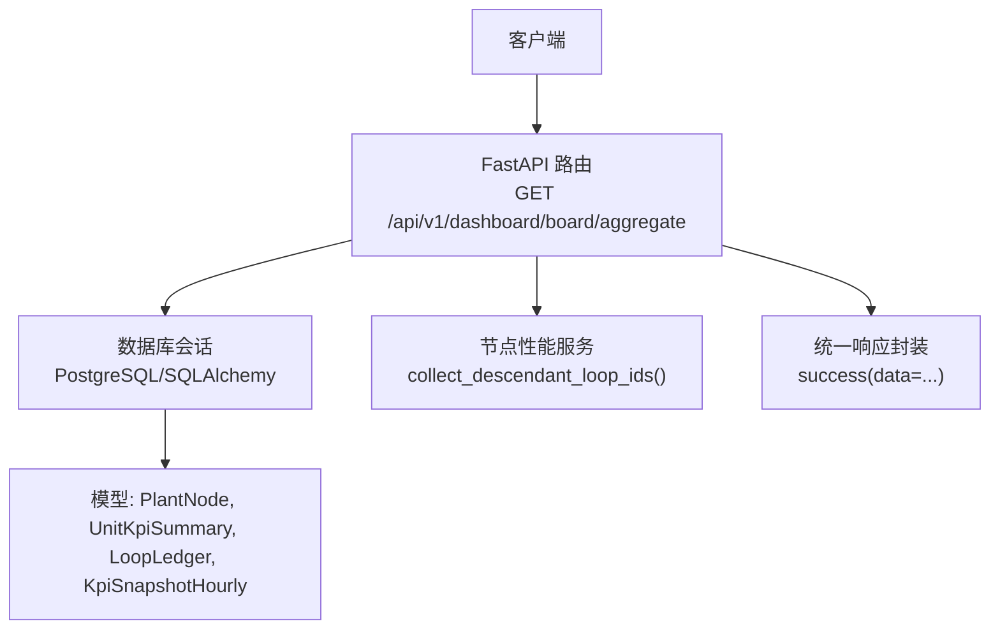
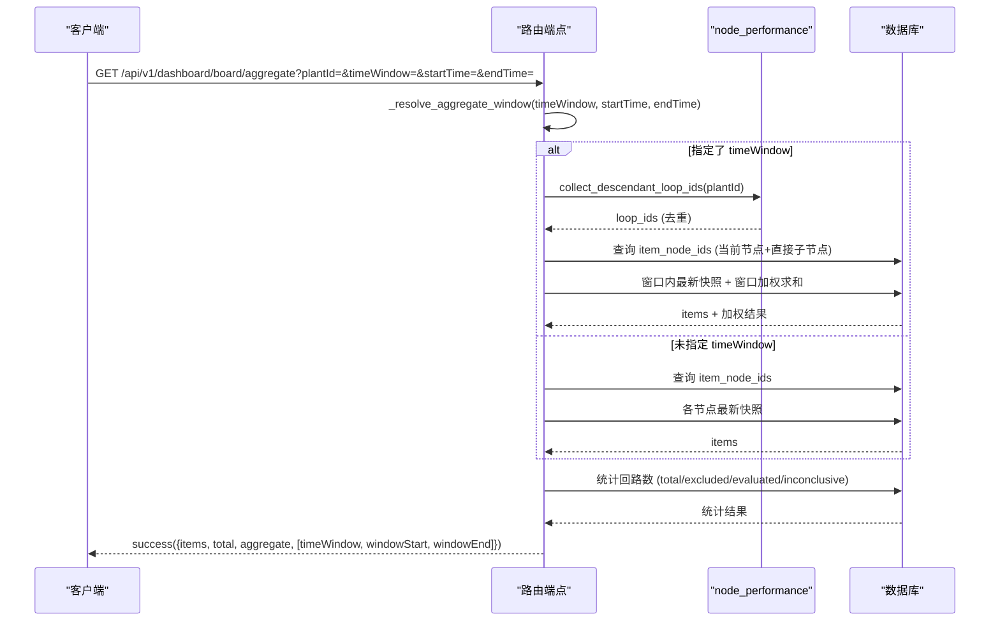
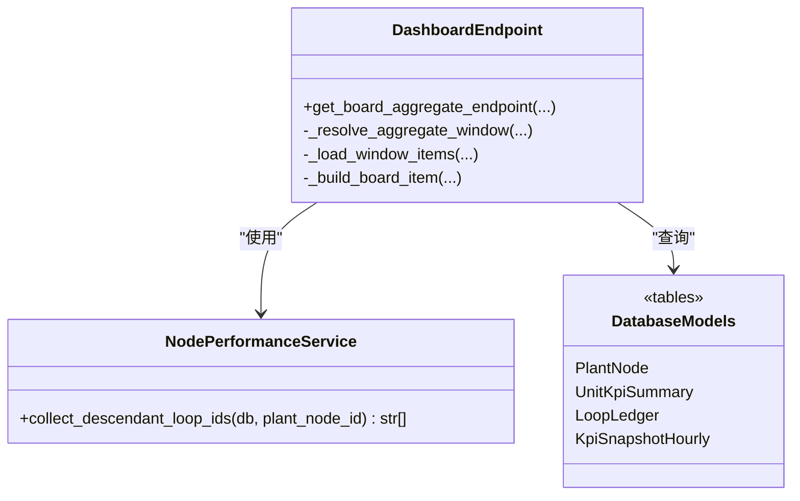
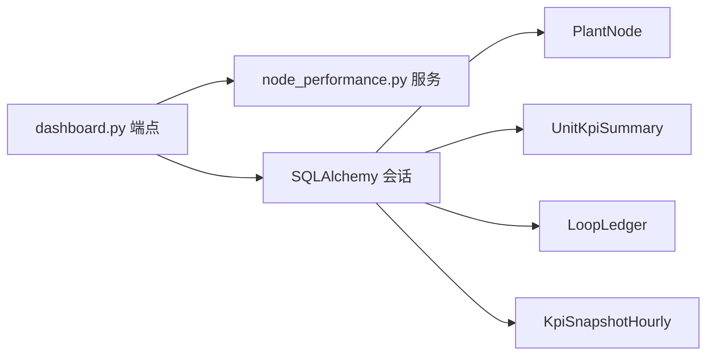

# 节点级聚合接口

<cite>
**本文引用的文件**
- [backend/app/api/v1/endpoints/dashboard.py](file://backend/app/api/v1/endpoints/dashboard.py)
- [backend/app/services/node_performance.py](file://backend/app/services/node_performance.py)
- [backend/tests/test_dashboard_board.py](file://backend/tests/test_dashboard_board.py)
</cite>

## 目录
1. [简介](#简介)
2. [项目结构](#项目结构)
3. [核心组件](#核心组件)
4. [架构总览](#架构总览)
5. [详细组件分析](#详细组件分析)
6. [依赖关系分析](#依赖关系分析)
7. [性能考量](#性能考量)
8. [故障排查指南](#故障排查指南)
9. [结论](#结论)
10. [附录：API 使用示例与错误处理](#附录api-使用示例与错误处理)

## 简介
本接口用于返回“节点及其下属节点的聚合 KPI 快照”，支持两种时间窗口模式：
- 缺省模式：取每个节点的最新快照（现状）
- 窗口模式：按指定时间范围进行加权平均计算，并回显统计窗口信息

该接口适用于装置/单元/工厂等多层级节点视图，能够递归聚合当前节点及其所有下属节点的数据。

## 项目结构
- 路由定义位于后端 API 层，负责参数校验、权限控制、调用服务逻辑与响应封装
- 业务逻辑集中在 dashboard 端点文件中，包含时间窗解析、窗口加权、回路去重统计等
- 节点下属回路收集通过 node_performance 服务完成，确保不重复统计父子节点下的回路
- 测试用例覆盖时间窗解析与两种模式的输出行为

图表来源
- [backend/app/api/v1/endpoints/dashboard.py:554-782](file://backend/app/api/v1/endpoints/dashboard.py#L554-L782)
- [backend/app/services/node_performance.py:62-87](file://backend/app/services/node_performance.py#L62-L87)

章节来源
- [backend/app/api/v1/endpoints/dashboard.py:554-782](file://backend/app/api/v1/endpoints/dashboard.py#L554-L782)
- [backend/app/services/node_performance.py:62-87](file://backend/app/services/node_performance.py#L62-L87)

## 核心组件
- 路由端点：GET /api/v1/dashboard/board/aggregate
- 时间窗解析：_resolve_aggregate_window
- 窗口明细加载：_load_window_items
- 回路收集：collect_descendant_loop_ids
- 聚合计算：weighted_avg（优先取当前节点自身汇总行，否则按 evaluatedLoops 加权）
- 回路统计：totalLoops、evaluatedLoops、inconclusiveLoops、excludedLoops

章节来源
- [backend/app/api/v1/endpoints/dashboard.py:396-451](file://backend/app/api/v1/endpoints/dashboard.py#L396-L451)
- [backend/app/api/v1/endpoints/dashboard.py:469-551](file://backend/app/api/v1/endpoints/dashboard.py#L469-L551)
- [backend/app/api/v1/endpoints/dashboard.py:554-782](file://backend/app/api/v1/endpoints/dashboard.py#L554-L782)
- [backend/app/services/node_performance.py:62-87](file://backend/app/services/node_performance.py#L62-L87)

## 架构总览
请求进入 FastAPI 路由后，根据 plantId 和 timeWindow 决定数据获取策略：
- 若未指定 timeWindow：查询每个节点的最新快照
- 若指定 timeWindow：对 rate 字段执行窗口内 evaluated_loops 加权平均；计数字段取窗口内最新快照；同时统计 totalLoops、evaluatedLoops、inconclusiveLoops、excludedLoops
- 最终组装 items（节点明细）、aggregate（聚合值）、以及可选的 timeWindow/windowStart/windowEnd

图表来源
- [backend/app/api/v1/endpoints/dashboard.py:554-782](file://backend/app/api/v1/endpoints/dashboard.py#L554-L782)
- [backend/app/services/node_performance.py:62-87](file://backend/app/services/node_performance.py#L62-L87)

## 详细组件分析

### 时间窗口模式
- 支持的时间窗：last_8_hours、last_24_hours、last_72_hours、last_168_hours、today、yesterday、last_7_days、last_30_days、custom
- custom 需同时提供 startTime 与 endTime（ISO 8601）
- 未识别的值会回退到最近 24 小时
- 窗口边界基于 UTC 计算，today/yesterday 等日历日语义按北京时间（UTC+8）对齐

章节来源
- [backend/app/api/v1/endpoints/dashboard.py:396-451](file://backend/app/api/v1/endpoints/dashboard.py#L396-L451)

### 加权平均计算
- 每个 rate 字段使用独立的非 NULL 分母进行加权平均
- 分子为 SUM(field * evaluated_loops)，分母为 SUM(evaluated_loops) FILTER (field IS NOT NULL)
- 当某字段在部分快照为 NULL 时，仅对非 NULL 快照的 evaluated_loops 计入分母，避免被稀释
- 窗口模式下，rate 字段来自 _load_window_items 的独立字段加权；缺省模式下直接使用最新快照值

章节来源
- [backend/app/api/v1/endpoints/dashboard.py:469-551](file://backend/app/api/v1/endpoints/dashboard.py#L469-L551)

### 回路统计逻辑
- totalLoops：去重后的活跃回路总数（通过 collect_descendant_loop_ids 获取）
- excludedLoops：include_in_evaluation=false 的回路数
- evaluatedLoops：窗口内存在 SUCCESS 快照且 include_in_evaluation=true 的去重回路数
- inconclusiveLoops：窗口内仅有 INCONCLUSIVE 快照且无 SUCCESS 快照的去重回路数
- 窗口模式下，统计边界由 timeWindow 决定；缺省模式下，evaluated/inconclusive 统计近 24 小时

章节来源
- [backend/app/api/v1/endpoints/dashboard.py:676-734](file://backend/app/api/v1/endpoints/dashboard.py#L676-L734)
- [backend/app/services/node_performance.py:62-87](file://backend/app/services/node_performance.py#L62-L87)

### 计数字段处理策略（窗口模式）
- 计数字段（totalLoops、evaluatedLoops、inconclusiveLoops、excludedLoops、status 等）取自窗口内最新快照行
- snapshotTime 为窗口内最新快照时间
- 若窗口内 evaluated_loops 合计为 0，则对应 rate 字段返回 None

章节来源
- [backend/app/api/v1/endpoints/dashboard.py:469-551](file://backend/app/api/v1/endpoints/dashboard.py#L469-L551)
- [backend/tests/test_dashboard_board.py:236-259](file://backend/tests/test_dashboard_board.py#L236-L259)

### 聚合结果的结构化输出
- items：节点明细列表（当前节点及其直接子节点），每项包含 nodeId、nodeName、snapshotTime、各类 rate、计数字段等
- total：items 数量
- aggregate：聚合值（nodeId、nodeName、各类 rate、totalLoops、evaluatedLoops、inconclusiveLoops、excludedLoops）
- 窗口模式下额外回显 timeWindow、windowStart、windowEnd

章节来源
- [backend/app/api/v1/endpoints/dashboard.py:736-782](file://backend/app/api/v1/endpoints/dashboard.py#L736-L782)

### 类图（代码级）

图表来源
- [backend/app/api/v1/endpoints/dashboard.py:396-782](file://backend/app/api/v1/endpoints/dashboard.py#L396-L782)
- [backend/app/services/node_performance.py:62-87](file://backend/app/services/node_performance.py#L62-L87)

## 依赖关系分析
- 路由依赖数据库会话与用户认证
- 窗口模式依赖 node_performance 服务进行回路收集，避免父子节点重复计数
- 聚合计算依赖 unit_kpi_summary 表中的 rate 与 evaluated_loops 字段
- 回路统计依赖 loop_ledger 与 kpi_snapshot_hourly 表的状态与时间戳

图表来源
- [backend/app/api/v1/endpoints/dashboard.py:554-782](file://backend/app/api/v1/endpoints/dashboard.py#L554-L782)
- [backend/app/services/node_performance.py:62-87](file://backend/app/services/node_performance.py#L62-L87)

章节来源
- [backend/app/api/v1/endpoints/dashboard.py:554-782](file://backend/app/api/v1/endpoints/dashboard.py#L554-L782)
- [backend/app/services/node_performance.py:62-87](file://backend/app/services/node_performance.py#L62-L87)

## 性能考量
- 使用 PostgreSQL 递归 CTE 收集节点下属回路，避免 N+1 查询
- 窗口加权采用 SQL 聚合（SUM 与 FILTER），减少应用层计算开销
- 仅列出当前节点及其直接子节点作为 items，降低响应体大小
- 聚合值优先取当前节点自身的 unit_kpi_summary 行（已持久化的权威口径），避免重复计算

[本节为通用性能讨论，不直接分析具体文件]

## 故障排查指南
- 若 TDengine 不可用或无 MODE 数据，实时自控率接口会返回 rate=null；但 board/aggregate 仍可从数据库返回结果
- 若窗口内 evaluated_loops 合计为 0，rate 字段将返回 None，前端应做空值处理
- 若 plantId 不存在或无下属节点，items 为空，aggregate 可能为空或零值
- 若自定义时间窗缺少 startTime 或 endTime，_resolve_aggregate_window 将返回 None，回退到缺省模式

章节来源
- [backend/app/api/v1/endpoints/dashboard.py:554-782](file://backend/app/api/v1/endpoints/dashboard.py#L554-L782)
- [backend/tests/test_dashboard_board.py:172-259](file://backend/tests/test_dashboard_board.py#L172-L259)

## 结论
GET /api/v1/dashboard/board/aggregate 提供了灵活的节点级聚合能力，支持缺省最新快照与多种时间窗口模式。通过独立的非 NULL 分母加权平均与去重的回路统计，确保了指标的一致性与准确性。配合清晰的响应结构与窗口回显，便于前端展示与分析。

[本节为总结性内容，不直接分析具体文件]

## 附录：API 使用示例与错误处理

### 接口定义
- 方法：GET
- 路径：/api/v1/dashboard/board/aggregate
- 查询参数：
  - plantId：可选，按节点筛选；为空统计全厂；递归包含所有下属节点
  - timeWindow：可选，时间窗；缺省=每节点最新快照（现状）
  - startTime：可选，自定义窗口起始（ISO 8601，custom 时必填）
  - endTime：可选，自定义窗口结束（ISO 8601，custom 时必填）

### 成功响应结构
- data.items：节点明细列表（当前节点及其直接子节点）
  - 关键字段：nodeId、nodeName、snapshotTime、avgScore、autoModeRate、stabilityRate、effectiveAutoRate、accuracyRate、fastRate、goodValueRate、instrumentFaultRate、totalLoops、evaluatedLoops、inconclusiveLoops、excludedLoops、status、algorithmVersion
- data.total：items 数量
- data.aggregate：聚合值
  - 关键字段：nodeId、nodeName、avgScore、autoModeRate、stabilityRate、effectiveAutoRate、accuracyRate、fastRate、goodValueRate、instrumentFaultRate、totalLoops、evaluatedLoops、inconclusiveLoops、excludedLoops
- data.timeWindow、data.windowStart、data.windowEnd：仅在窗口模式下回显

### 时间窗口取值
- last_8_hours、last_24_hours、last_72_hours、last_168_hours
- today、yesterday、last_7_days、last_30_days
- custom（需同时提供 startTime 与 endTime）

### 加权平均规则
- 每个 rate 字段使用独立的非 NULL 分母：SUM(field * evaluated_loops) / SUM(evaluated_loops) FILTER (field IS NOT NULL)
- 若窗口内 evaluated_loops 合计为 0，rate 字段返回 None

### 回路统计规则
- totalLoops：去重后的活跃回路总数
- excludedLoops：include_in_evaluation=false 的回路数
- evaluatedLoops：窗口内有 SUCCESS 快照且 include_in_evaluation=true 的去重回路数
- inconclusiveLoops：窗口内仅有 INCONCLUSIVE 快照且无 SUCCESS 快照的去重回路数

### 错误处理
- 无活跃回路：items 为空，aggregate 为零值或空值
- 窗口无效或缺少必要参数：回退到缺省模式或默认 24 小时窗口
- 数据库不可用：返回空数据或降级响应（依上层异常处理而定）

章节来源
- [backend/app/api/v1/endpoints/dashboard.py:554-782](file://backend/app/api/v1/endpoints/dashboard.py#L554-L782)
- [backend/tests/test_dashboard_board.py:172-259](file://backend/tests/test_dashboard_board.py#L172-L259)