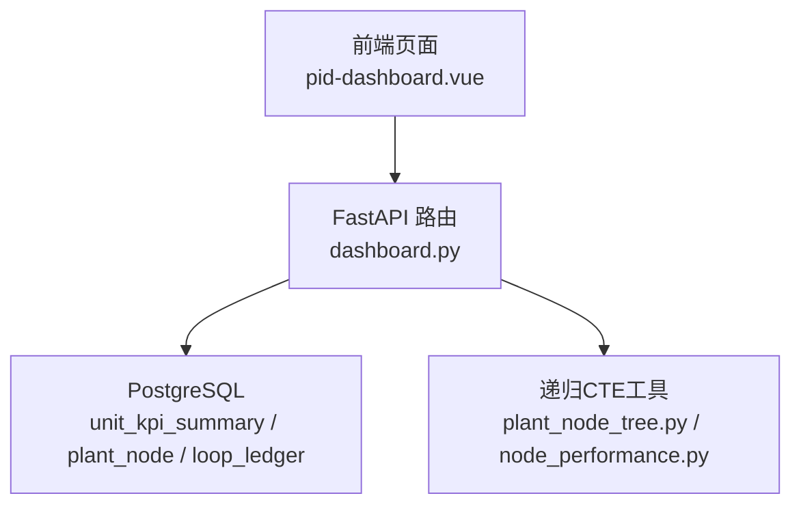
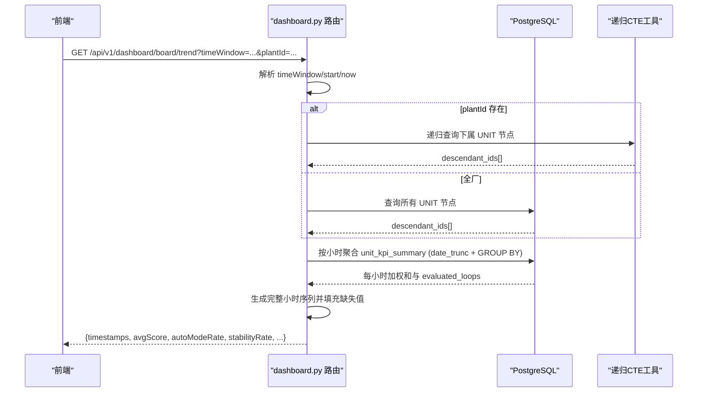
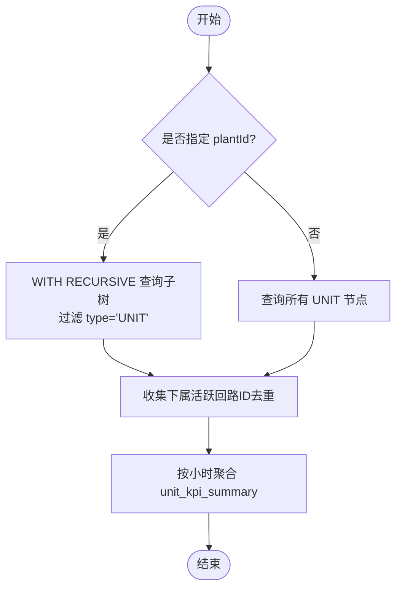
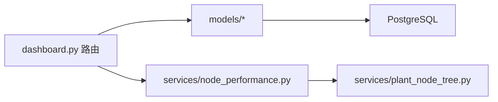

# 节点级趋势接口

<cite>
**本文引用的文件**
- [backend/app/api/v1/endpoints/dashboard.py](file://backend/app/api/v1/endpoints/dashboard.py)
- [backend/app/services/plant_node_tree.py](file://backend/app/services/plant_node_tree.py)
- [backend/app/services/node_performance.py](file://backend/app/services/node_performance.py)
- [backend/app/models/metric.py](file://backend/app/models/metric.py)
- [backend/app/models/unit_kpi_summary.py](file://backend/app/models/unit_kpi_summary.py)
- [backend/app/models/plant_node.py](file://backend/app/models/plant_node.py)
- [backend/app/models/loop.py](file://backend/app/models/loop.py)
- [frontend/apps/web-antd/src/api/dashboard.ts](file://frontend/apps/web-antd/src/api/dashboard.ts)
- [frontend/apps/web-antd/src/views/metric/pid-dashboard.vue](file://frontend/apps/web-antd/src/views/metric/pid-dashboard.vue)
</cite>

## 目录
1. [简介](#简介)
2. [项目结构](#项目结构)
3. [核心组件](#核心组件)
4. [架构总览](#架构总览)
5. [详细组件分析](#详细组件分析)
6. [依赖关系分析](#依赖关系分析)
7. [性能考量](#性能考量)
8. [故障排查指南](#故障排查指南)
9. [结论](#结论)
10. [附录：API 调用示例与最佳实践](#附录api-调用示例与最佳实践)

## 简介
本接口用于返回“当前节点及其所有下属节点”的趋势数据，按小时聚合。支持多种时间窗口（last_8_hours/last_24_hours/last_72_hours/last_168_hours/today/yesterday/last_7_days/last_30_days/custom），并基于 evaluated_loops 进行加权平均计算 avgScore、autoModeRate、stabilityRate、fastRate、accuracyRate 等指标。底层通过 PostgreSQL 递归 CTE 获取当前节点及所有下属 UNIT 级节点，再对 unit_kpi_summary 表按小时聚合，并对缺失小时进行填充。

## 项目结构
该功能位于后端 FastAPI 路由层，核心实现集中在 dashboard 端点文件中；树形递归查询由 plant_node_tree 与 node_performance 提供；数据模型来自 metric、unit_kpi_summary、plant_node、loop 等模型；前端通过 API 客户端调用并在页面中渲染趋势图。

**图表来源**
- [backend/app/api/v1/endpoints/dashboard.py:195-388](file://backend/app/api/v1/endpoints/dashboard.py#L195-L388)
- [backend/app/services/plant_node_tree.py:20-50](file://backend/app/services/plant_node_tree.py#L20-L50)
- [backend/app/services/node_performance.py:1087-1119](file://backend/app/services/node_performance.py#L1087-L1119)

**章节来源**
- [backend/app/api/v1/endpoints/dashboard.py:195-388](file://backend/app/api/v1/endpoints/dashboard.py#L195-L388)
- [backend/app/services/plant_node_tree.py:20-50](file://backend/app/services/plant_node_tree.py#L20-L50)
- [backend/app/services/node_performance.py:1087-1119](file://backend/app/services/node_performance.py#L1087-L1119)

## 核心组件
- 路由端点：GET /api/v1/dashboard/board/trend
- 时间窗口解析：根据 timeWindow 计算 start/now
- 递归节点集合：获取当前节点及所有下属 UNIT 节点
- 小时聚合 SQL：按 date_trunc("hour", snapshot_time) 分组求和与加权
- 时序填充：生成完整小时序列，缺失小时置空或零计数
- 响应封装：统一 ApiResponse.success(data=...)

**章节来源**
- [backend/app/api/v1/endpoints/dashboard.py:195-388](file://backend/app/api/v1/endpoints/dashboard.py#L195-L388)

## 架构总览
请求进入 FastAPI 路由后，解析参数与时间窗口，使用递归 CTE 获取目标节点集合，随后对 unit_kpi_summary 执行按小时聚合，最后将结果映射为时序数组并返回。

**图表来源**
- [backend/app/api/v1/endpoints/dashboard.py:235-388](file://backend/app/api/v1/endpoints/dashboard.py#L235-L388)
- [backend/app/services/plant_node_tree.py:20-50](file://backend/app/services/plant_node_tree.py#L20-L50)
- [backend/app/services/node_performance.py:1087-1119](file://backend/app/services/node_performance.py#L1087-L1119)

## 详细组件分析

### 接口定义与参数
- 路径：GET /api/v1/dashboard/board/trend
- 查询参数
  - plantId: 可选，按节点筛选；为空统计全厂；递归包含所有下属节点
  - timeWindow: 时间窗，默认 today；取值 last_8_hours/last_24_hours/last_72_hours/last_168_hours/today/yesterday/last_7_days/last_30_days/custom
  - startTime: ISO 8601，custom 时必填
  - endTime: ISO 8601，custom 时必填
- 认证：需要当前用户上下文（依赖注入）

**章节来源**
- [backend/app/api/v1/endpoints/dashboard.py:195-225](file://backend/app/api/v1/endpoints/dashboard.py#L195-L225)

### 时间窗口解析
- custom：startTime/endTime 解析为 naive UTC 时间，作为 start/now
- last_8_hours/last_24_hours/last_72_hours/last_168_hours：从 now 向前推对应小时数
- today：start = now - 24h（等价于近24小时口径）
- yesterday：start = now - 2d，now 前移一天
- last_7_days/last_30_days：分别向前推7天/30天
- 未识别值回退到近24小时

注意：board/trend 的时间窗口逻辑与 board/aggregate 的 _resolve_aggregate_window 不同，前者以 naive UTC 计算，后者针对 aggregate 采用北京时间日历日语义。

**章节来源**
- [backend/app/api/v1/endpoints/dashboard.py:227-255](file://backend/app/api/v1/endpoints/dashboard.py#L227-L255)

### 递归 CTE 查询下属节点
- 当指定 plantId：使用 WITH RECURSIVE 查询当前节点及所有子孙节点，并过滤 type='UNIT'，避免 FACTORY/AREA/UNIT 重复累加
- 未指定 plantId：直接查询所有 UNIT 节点
- 同时收集实际回路总数（去重），避免父子节点重复计数

**图表来源**
- [backend/app/api/v1/endpoints/dashboard.py:256-281](file://backend/app/api/v1/endpoints/dashboard.py#L256-L281)
- [backend/app/services/plant_node_tree.py:20-50](file://backend/app/services/plant_node_tree.py#L20-L50)
- [backend/app/services/node_performance.py:1087-1119](file://backend/app/services/node_performance.py#L1087-L1119)

**章节来源**
- [backend/app/api/v1/endpoints/dashboard.py:256-281](file://backend/app/api/v1/endpoints/dashboard.py#L256-L281)

### 小时聚合与加权平均算法
- 数据源：unit_kpi_summary（节点级 KPI 快照表）
- 分组键：date_trunc("hour", snapshot_time)
- 权重：evaluated_loops（参评回路数）
- 加权公式（SQL 层面）：
  - score_weighted_sum = SUM(avg_score * evaluated_loops)
  - auto_weighted_sum = SUM(auto_mode_rate * evaluated_loops)
  - stable_weighted_sum = SUM(stability_rate * evaluated_loops)
  - fast_weighted_sum = SUM(fast_rate * evaluated_loops)
  - acc_weighted_sum = SUM(accuracy_rate * evaluated_loops)
  - total_evaluated = SUM(evaluated_loops)
- 最终均值：各加权总和 / total_evaluated（当 total_evaluated > 0）
- 若 total_evaluated = 0：对应指标返回 None

说明：
- 该加权方式确保回路数量多的节点在聚合中占更大权重，体现“规模代表性”
- 与 node_performance 的小时级 LoopLevelWeight（按回路重要性加权）不同，此处按节点规模加权

**章节来源**
- [backend/app/api/v1/endpoints/dashboard.py:297-331](file://backend/app/api/v1/endpoints/dashboard.py#L297-L331)

### 时序填充与缺失数据处理
- 构建完整小时序列：从 start 对齐到整点，逐小时递增直到 now
- 若某小时有数据：
  - evaluatedLoops = total_evaluated
  - 指标 = round(加权总和 / total_evaluated, 2)
- 若某小时无数据：
  - evaluatedLoops = 0
  - 指标 = None
- 输出字段：
  - timestamps: 小时时间戳列表（ISO 格式，无时区后缀）
  - avgScore/autoModeRate/stabilityRate/fastRate/accuracyRate: 数值或 None
  - evaluatedLoops: 整数列表
  - totalLoops: 去重后的实际回路总数

**章节来源**
- [backend/app/api/v1/endpoints/dashboard.py:333-388](file://backend/app/api/v1/endpoints/dashboard.py#L333-L388)

### 前端集成与渲染
- 前端 API 调用：getBoardTrendApi('/dashboard/board/trend', params)
- 渲染：将 timestamps 转为本地时区显示，totalLoops 用于柱状背景，evaluatedLoops 用于柱状前景
- 时区处理：后端 timestamps 为无时区 ISO8601，前端补 “Z” 标记为 UTC 后按本地时区渲染

**章节来源**
- [frontend/apps/web-antd/src/api/dashboard.ts:410-424](file://frontend/apps/web-antd/src/api/dashboard.ts#L410-L424)
- [frontend/apps/web-antd/src/views/metric/pid-dashboard.vue:457-472](file://frontend/apps/web-antd/src/views/metric/pid-dashboard.vue#L457-L472)

## 依赖关系分析
- 路由依赖：
  - SQLAlchemy 异步会话（AsyncSession）
  - 模型：LoopLedger、KpiSnapshotHourly、PlantNode、UnitKpiSummary
  - 服务：node_performance.collect_descendant_loop_ids（用于回路去重统计）
- 递归 CTE：
  - plant_node_tree.collect_descendant_node_ids（通用递归 CTE）
  - node_performance.batch_collect_descendant_loop_ids（批量树遍历）

**图表来源**
- [backend/app/api/v1/endpoints/dashboard.py:195-388](file://backend/app/api/v1/endpoints/dashboard.py#L195-L388)
- [backend/app/services/node_performance.py:1087-1119](file://backend/app/services/node_performance.py#L1087-L1119)
- [backend/app/services/plant_node_tree.py:20-50](file://backend/app/services/plant_node_tree.py#L20-L50)

**章节来源**
- [backend/app/api/v1/endpoints/dashboard.py:195-388](file://backend/app/api/v1/endpoints/dashboard.py#L195-L388)

## 性能考量
- 使用单次递归 CTE 替代 N 次 round-trip，减少数据库往返
- 按小时聚合使用 SQL GROUP BY + SUM，避免 Python 层循环计算
- 仅聚合 UNIT 级节点，避免 FACTORY/AREA/UNIT 重复累加
- 回路总数去重统计，防止父子节点重复计数
- 缺失小时填充在内存中进行，时间范围越大开销越高，建议合理选择 timeWindow
- 大窗口场景可考虑分页或限制最大时间跨度

[本节为通用性能建议，不直接分析具体文件]

## 故障排查指南
- 无数据返回：检查 plantId 是否存在下属 UNIT 节点；确认 unit_kpi_summary 在时间窗口内有记录
- 指标为 None：对应小时 total_evaluated = 0，表示无参评回路；检查回路是否被排除或未评估
- 时间窗口异常：确认 startTime/endTime 格式正确（ISO 8601），custom 时必须同时提供起止时间
- 递归查询慢：检查 plant_node 层级深度与索引；必要时优化 CTE 或限制查询范围

**章节来源**
- [backend/app/api/v1/endpoints/dashboard.py:256-388](file://backend/app/api/v1/endpoints/dashboard.py#L256-L388)

## 结论
GET /api/v1/dashboard/board/trend 提供了节点级趋势数据的标准化接口，支持多时间窗口、递归聚合、小时粒度与加权平均。通过 PostgreSQL 递归 CTE 与 SQL 聚合，实现了高效、可扩展的趋势查询。前端可据此渲染直观的趋势图，并结合 totalLoops 与 evaluatedLoops 展示覆盖率。

[本节为总结性内容，不直接分析具体文件]

## 附录：API 调用示例与最佳实践

### 请求示例
- 基础调用（今日趋势）
  - GET /api/v1/dashboard/board/trend?timeWindow=today
- 指定装置（含下属节点）
  - GET /api/v1/dashboard/board/trend?plantId={node_id}&timeWindow=last_24_hours
- 自定义时间窗口
  - GET /api/v1/dashboard/board/trend?timeWindow=custom&startTime=2026-07-20T00:00:00Z&endTime=2026-07-21T00:00:00Z

### 响应结构
- timestamps: 小时时间戳数组
- avgScore/autoModeRate/stabilityRate/fastRate/accuracyRate: 数值或 null
- evaluatedLoops: 每小时参评回路数
- totalLoops: 去重后的实际回路总数

### 最佳实践
- 选择合适的 timeWindow：短窗口（如 last_8_hours）适合实时监控，长窗口（如 last_30_days）适合趋势分析
- 使用 plantId 聚焦特定装置，避免全厂查询带来的性能压力
- 前端渲染时正确处理时区：后端 timestamps 为无时区 ISO8601，需补 “Z” 后按本地时区显示
- 监控接口耗时：若响应过慢，检查数据库索引与节点层级深度

**章节来源**
- [frontend/apps/web-antd/src/api/dashboard.ts:410-424](file://frontend/apps/web-antd/src/api/dashboard.ts#L410-L424)
- [frontend/apps/web-antd/src/views/metric/pid-dashboard.vue:457-472](file://frontend/apps/web-antd/src/views/metric/pid-dashboard.vue#L457-L472)