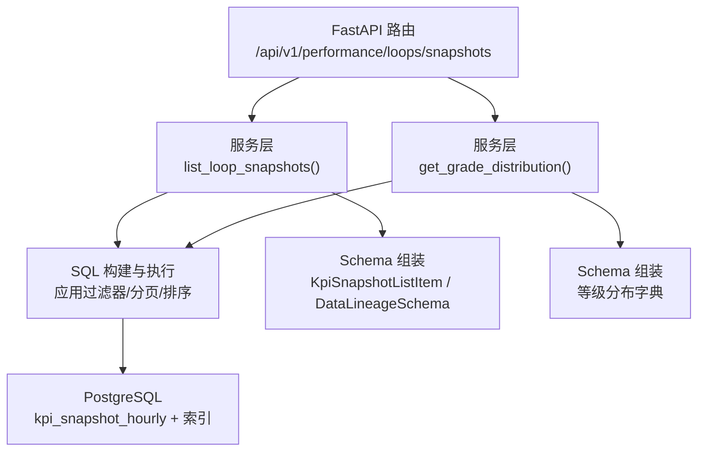
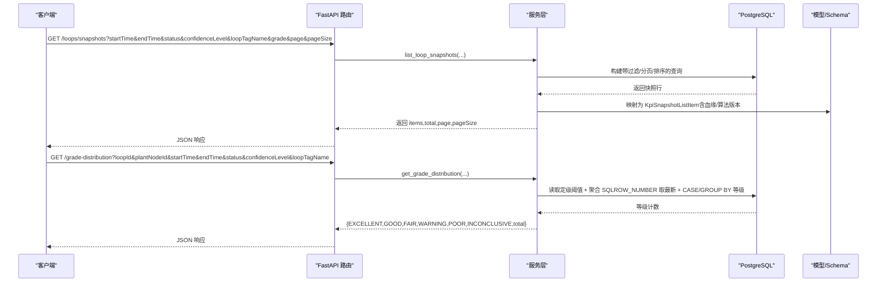
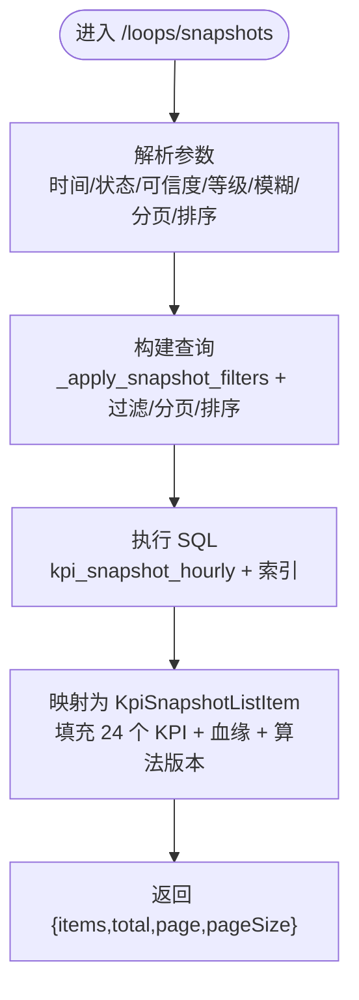
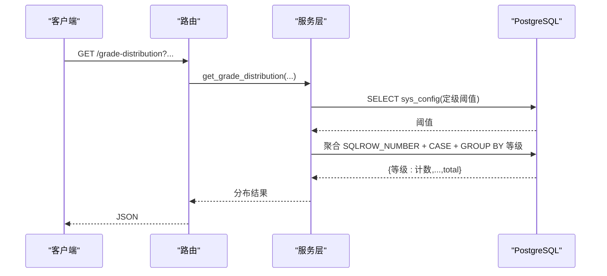
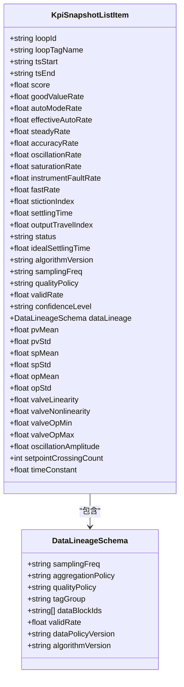
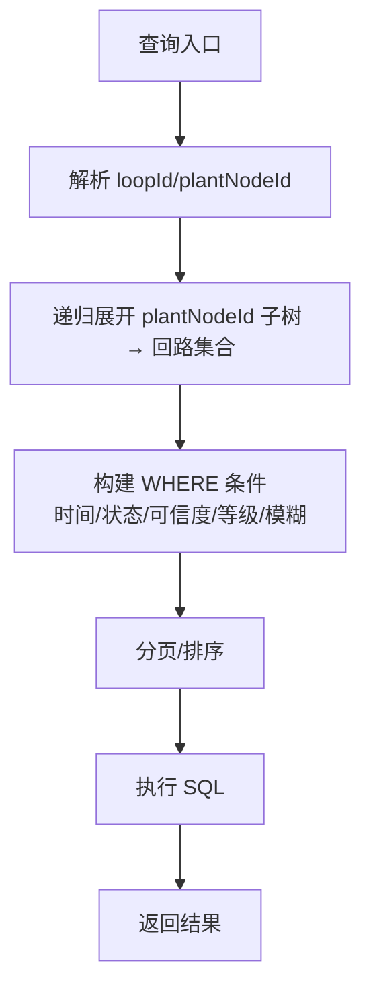
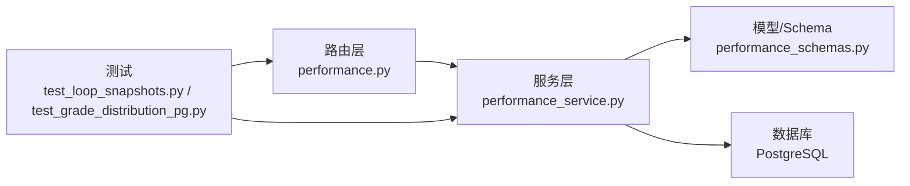

# 快照管理接口

<cite>
**本文引用的文件**
- [performance.py](file://backend/app/api/v1/endpoints/performance.py)
- [performance_service.py](file://backend/app/services/performance.py)
- [performance_schemas.py](file://backend/app/schemas/performance.py)
- [test_loop_snapshots.py](file://backend/tests/test_loop_snapshots.py)
- [test_grade_distribution_pg.py](file://backend/tests/integration/test_grade_distribution_pg.py)
- [openapi_baseline.json](file://backend/tests/golden/openapi_baseline.json)
- [add_kpi_snapshot_indexes.py](file://backend/alembic/versions/b3c4d5e6f7a8_add_kpi_snapshot_indexes.py)
- [align_dds_v4_1_fields.py](file://backend/alembic/versions/p9r0s1t2u3v4_align_dds_v4_1_fields.py)
- [add_v4_data_lineage_and_new_tables.py](file://backend/alembic/versions/k2f3a4b5c6d7_add_v4_data_lineage_and_new_tables.py)
- [node_performance.py](file://backend/app/services/node_performance.py)
</cite>

## 目录
1. [简介](#简介)
2. [项目结构](#项目结构)
3. [核心组件](#核心组件)
4. [架构总览](#架构总览)
5. [详细组件分析](#详细组件分析)
6. [依赖关系分析](#依赖关系分析)
7. [性能考虑](#性能考虑)
8. [故障排查指南](#故障排查指南)
9. [结论](#结论)
10. [附录](#附录)

## 简介
本文件为 CLPM-MVP 的“快照管理接口”提供面向开发与运维的完整 API 文档，聚焦回路小时指标快照查询与性能等级分布两大能力。内容覆盖：
- 时间范围筛选、状态过滤、可信度等级筛选、性能等级筛选
- 快照数据结构：24 个 KPI 字段定义、数据血缘信息、算法版本追踪
- 性能等级分布接口：EXCELLENT/GOOD/FAIR/WARNING/POOR/INCONCLUSIVE 统计与 SQL 层聚合优化
- 高级查询：回路编号模糊搜索、装置节点递归查询、多条件组合筛选
- 大数据量处理：分页查询、排序优化、索引设计建议
- 生命周期与治理：数据保留策略、归档机制、清理规则（基于现有迁移与模型能力的可落地建议）

## 项目结构
与快照管理相关的后端实现主要分布在以下位置：
- API 路由：performance endpoints
- 服务层：performance service（含列表、分布、阈值加载等）
- 数据模型与 Schema：schemas.performance（KPI 快照、血缘、列表响应）
- 测试与基线：单元测试、集成测试、OpenAPI 基线
- 数据库迁移：索引、字段对齐、血缘字段添加

图表来源
- [performance.py:334-538](file://backend/app/api/v1/endpoints/performance.py#L334-L538)
- [performance_service.py:993-1065](file://backend/app/services/performance.py#L993-L1065)
- [performance_schemas.py:303-500](file://backend/app/schemas/performance.py#L303-L500)

章节来源
- [performance.py:1-542](file://backend/app/api/v1/endpoints/performance.py#L1-L542)
- [performance_service.py:1-200](file://backend/app/services/performance.py#L1-L200)
- [performance_schemas.py:1-529](file://backend/app/schemas/performance.py#L1-L529)

## 核心组件
- 快照列表接口：GET /api/v1/performance/loops/snapshots
  - 支持按回路 ID、装置节点、时间范围、状态、可信度、回路编号模糊、性能等级筛选；支持 latestOnly、排序、分页
- 等级分布接口：GET /api/v1/performance/grade-distribution
  - 每回路取最新一条快照，SQL 层 GROUP BY 等级聚合，返回各等级计数与 total
- 数据模型与 Schema
  - KpiSnapshotListItem：包含 24 个 KPI 字段、血缘与算法版本等
  - DataLineageSchema：采样频率、聚合策略、质量策略、tagGroup、dataBlockIds、validRate、dataPolicyVersion、algorithmVersion
- 服务层能力
  - _apply_snapshot_filters：时间/状态/装置/回路过滤
  - _score_to_status：综合评分→五档等级（国标对齐）
  - get_grade_distribution：读取定级阈值并生成聚合 SQL

章节来源
- [performance.py:334-538](file://backend/app/api/v1/endpoints/performance.py#L334-L538)
- [performance_service.py:993-1065](file://backend/app/services/performance.py#L993-L1065)
- [performance_schemas.py:303-500](file://backend/app/schemas/performance.py#L303-L500)

## 架构总览
快照查询与等级分布的核心调用链如下：

图表来源
- [performance.py:370-538](file://backend/app/api/v1/endpoints/performance.py#L370-L538)
- [performance_service.py:993-1065](file://backend/app/services/performance.py#L993-L1065)
- [performance_schemas.py:303-500](file://backend/app/schemas/performance.py#L303-L500)

## 详细组件分析

### 快照列表接口：GET /api/v1/performance/loops/snapshots
- 功能
  - 时间范围筛选：startTime/endTime（ISO 8601），默认近 7 天（服务层逻辑）
  - 状态过滤：SUCCESS/INCONCLUSIVE/PARTIAL
  - 可信度等级筛选：A/B/C/D/E
  - 性能等级筛选：EXCELLENT/GOOD/FAIR/WARNING/POOR/INCONCLUSIVE（服务端按当前定级阈值过滤）
  - 回路编号模糊搜索：loopTagName
  - 装置节点递归查询：通过 plantNodeId 递归获取子孙节点下的回路（见节点性能服务中的 CTE 递归）
  - 多条件组合筛选：上述参数可自由组合
  - 分页与排序：page/pageSize；sortBy=score|tsStart；sortOrder=asc|desc（score 排序时 NULL 置末位）
  - latestOnly：默认 True，每个回路只返回最新一条评估记录；False 返回历史全量
- 请求参数
  - loopId：逗号分隔多个
  - plantNodeId：逗号分隔多个（结合递归子树）
  - startTime/endTime：ISO 8601
  - status：SUCCESS/INCONCLUSIVE/PARTIAL
  - confidenceLevel：A/B/C/D/E
  - loopTagName：模糊匹配
  - grade：EXCELLENT/GOOD/FAIR/WARNING/POOR/INCONCLUSIVE
  - latestOnly：布尔
  - sortBy：score/tsStart
  - sortOrder：asc/desc
  - page：页码（1-based）
  - pageSize：每页条数（1~100）
- 响应结构
  - data.items：KpiSnapshotListItem 数组
  - data.total：总数
  - data.page：当前页
  - data.pageSize：每页大小
- 关键行为
  - 解析 ISO 时间（兼容 Z 后缀），统一转为 naive datetime
  - 将 Decimal/float/None 转换为 float 或 None 输出
  - 组装 dataLineage（snake_case/camelCase 双兼容）
  - 新增 Phase 1 指标：pvMean/pvStd/spMean/spStd/opMean/opStd/valveLinearity/valveNonlinearity/valveOpMin/valveOpMax/oscillationAmplitude/setpointCrossingCount/timeConstant

图表来源
- [performance.py:338-538](file://backend/app/api/v1/endpoints/performance.py#L338-L538)
- [performance_service.py:993-1065](file://backend/app/services/performance.py#L993-L1065)

章节来源
- [performance.py:334-538](file://backend/app/api/v1/endpoints/performance.py#L334-L538)
- [performance_service.py:993-1065](file://backend/app/services/performance.py#L993-L1065)
- [performance_schemas.py:349-500](file://backend/app/schemas/performance.py#L349-L500)
- [test_loop_snapshots.py:175-285](file://backend/tests/test_loop_snapshots.py#L175-L285)
- [test_loop_snapshots.py:577-726](file://backend/tests/test_loop_snapshots.py#L577-L726)

### 性能等级分布接口：GET /api/v1/performance/grade-distribution
- 功能
  - 每回路取最新一条快照（与列表 latestOnly=True 口径一致）
  - SQL 层使用 ROW_NUMBER 定位最新快照，CASE 判定等级，GROUP BY 聚合计数
  - 支持 loopId、plantNodeId、startTime/endTime、status、confidenceLevel、loopTagName 筛选
- 返回结构
  - EXCELLENT/GOOD/FAIR/WARNING/POOR/INCONCLUSIVE：各等级计数
  - total：总回路数（去重后）
- 定级阈值
  - 从系统配置读取当前生效阈值；未配置时使用国标默认阈值
  - 默认阈值（来自服务层函数）：EXCELLENT≥90，GOOD 80~89，FAIR 70~79，WARNING 60~69，POOR<60，无分数则为 INCONCLUSIVE

图表来源
- [performance.py:370-404](file://backend/app/api/v1/endpoints/performance.py#L370-L404)
- [performance_service.py:1043-1065](file://backend/app/services/performance.py#L1043-L1065)
- [test_loop_snapshots.py:725-838](file://backend/tests/test_loop_snapshots.py#L725-L838)
- [test_grade_distribution_pg.py:1-39](file://backend/tests/integration/test_grade_distribution_pg.py#L1-L39)

章节来源
- [performance.py:370-404](file://backend/app/api/v1/endpoints/performance.py#L370-L404)
- [performance_service.py:1043-1065](file://backend/app/services/performance.py#L1043-L1065)
- [test_loop_snapshots.py:725-838](file://backend/tests/test_loop_snapshots.py#L725-L838)
- [test_grade_distribution_pg.py:1-39](file://backend/tests/integration/test_grade_distribution_pg.py#L1-L39)

### 快照数据结构：24 个 KPI 字段、数据血缘、算法版本
- 24 个 KPI 字段（示例）
  - 基础指标：goodValueRate、autoModeRate、effectiveAutoRate、steadyRate、accuracyRate、oscillationRate、saturationRate、instrumentFaultRate、fastRate、stictionIndex、settlingTime、outputTravelIndex
  - Phase 1 新增：pvMean、pvStd、spMean、spStd、opMean、opStd、valveLinearity、valveNonlinearity、valveOpMin、valveOpMax、oscillationAmplitude、setpointCrossingCount、timeConstant
  - 元数据：score、status、idealSettlingTime、algorithmVersion、samplingFreq、qualityPolicy、validRate、confidenceLevel、dataLineage
- 数据血缘（DataLineageSchema）
  - samplingFreq、aggregationPolicy、qualityPolicy、tagGroup、dataBlockIds、validRate、dataPolicyVersion、algorithmVersion
  - 支持 snake_case/camelCase 双键名输入，输出 camelCase
- 算法版本追踪
  - algorithmVersion 字段用于标识计算所用算法版本（如 KPI_CALC_v2.0）
  - 在 UPSERT 更新中确保血缘字段被正确写入/覆盖

图表来源
- [performance_schemas.py:303-500](file://backend/app/schemas/performance.py#L303-L500)
- [performance.py:468-530](file://backend/app/api/v1/endpoints/performance.py#L468-L530)

章节来源
- [performance_schemas.py:303-500](file://backend/app/schemas/performance.py#L303-L500)
- [performance.py:468-530](file://backend/app/api/v1/endpoints/performance.py#L468-L530)
- [test_api_tasks.py:1301-1339](file://backend/tests/test_api_tasks.py#L1301-L1339)

### 高级查询：模糊搜索、递归查询、多条件组合
- 回路编号模糊搜索：loopTagName 参数在服务端进行模糊匹配
- 装置节点递归查询：通过 plantNodeId 递归获取子孙节点下的回路集合（CTE 递归），再对 kpi_snapshot_hourly 进行 in 过滤
- 多条件组合：时间范围、状态、可信度、等级、模糊、装置/回路均可同时生效

图表来源
- [node_performance.py:1087-1126](file://backend/app/services/node_performance.py#L1087-L1126)
- [performance_service.py:993-1021](file://backend/app/services/performance.py#L993-L1021)
- [performance.py:407-466](file://backend/app/api/v1/endpoints/performance.py#L407-L466)

章节来源
- [node_performance.py:1087-1126](file://backend/app/services/node_performance.py#L1087-L1126)
- [performance_service.py:993-1021](file://backend/app/services/performance.py#L993-L1021)
- [performance.py:407-466](file://backend/app/api/v1/endpoints/performance.py#L407-L466)

### 大数据量处理：分页、排序、索引建议
- 分页查询
  - page/pageSize 控制返回规模，避免一次性拉取全量
  - 列表接口默认 latestOnly=True，减少重复数据
- 排序优化
  - sortBy=score 时采用 NULLS LAST，保证空值置末位
  - 默认排序 tsStart DESC，利于最近数据优先展示
- 索引设计建议
  - 复合索引 (loop_id, ts_start)：加速按回路+时间窗口查询
  - 复合索引 (ts_start, status, score)：加速诊断引擎按时间+状态+评分查询
  - 针对 grade 筛选：可在 score 列建立合适索引以支持区间过滤
  - 针对 loopTagName 模糊：可使用 pg_trgm 扩展或全文检索提升 LIKE '%keyword%' 性能

章节来源
- [add_kpi_snapshot_indexes.py:1-45](file://backend/alembic/versions/b3c4d5e6f7a8_add_kpi_snapshot_indexes.py#L1-L45)
- [performance.py:421-466](file://backend/app/api/v1/endpoints/performance.py#L421-L466)
- [performance_service.py:724-748](file://backend/app/services/performance.py#L724-L748)

### 快照生命周期：保留、归档、清理（基于现有能力的可落地方案）
- 数据保留策略（建议）
  - 按时间窗口分层保留：热数据（近 7 天）、温数据（近 30 天）、冷数据（历史归档）
  - 依据业务需求设置不同保留期，例如小时级快照保留 90 天，月度汇总长期保留
- 归档机制（建议）
  - 定期将过期快照迁移至归档表或对象存储，保留必要字段（loop_id、ts_start、score、status、data_lineage 等）
  - 归档完成后删除热表数据，释放空间
- 清理规则（建议）
  - 定时任务按 ts_start 清理超过保留期的快照
  - 清理前校验关联引用（如审计日志、报表），避免破坏一致性
- 说明
  - 当前仓库未提供显式的“保留/归档/清理”任务代码；以上为基于现有模型与迁移的可落地实践建议

[本节为概念性建议，不直接分析具体文件]

## 依赖关系分析
- 路由与服务层解耦：路由仅负责参数解析与响应封装，核心逻辑下沉至服务层
- 服务层与数据库交互：通过 SQLAlchemy 构建查询，利用索引与聚合优化性能
- Schema 与模型：Pydantic Schema 负责序列化/反序列化，支持 snake_case/camelCase 兼容
- 测试保障：单元测试验证参数解析、SQL 生成、响应结构；集成测试验证真实 PG 下聚合与筛选一致性

图表来源
- [performance.py:1-542](file://backend/app/api/v1/endpoints/performance.py#L1-L542)
- [performance_service.py:1-200](file://backend/app/services/performance.py#L1-L200)
- [performance_schemas.py:1-529](file://backend/app/schemas/performance.py#L1-L529)
- [test_loop_snapshots.py:175-838](file://backend/tests/test_loop_snapshots.py#L175-L838)
- [test_grade_distribution_pg.py:1-39](file://backend/tests/integration/test_grade_distribution_pg.py#L1-L39)

章节来源
- [performance.py:1-542](file://backend/app/api/v1/endpoints/performance.py#L1-L542)
- [performance_service.py:1-200](file://backend/app/services/performance.py#L1-L200)
- [performance_schemas.py:1-529](file://backend/app/schemas/performance.py#L1-L529)
- [test_loop_snapshots.py:175-838](file://backend/tests/test_loop_snapshots.py#L175-L838)
- [test_grade_distribution_pg.py:1-39](file://backend/tests/integration/test_grade_distribution_pg.py#L1-L39)

## 性能考虑
- SQL 层聚合：等级分布接口使用 ROW_NUMBER + CASE + GROUP BY，避免全量拉取到 Python 层统计
- 索引优化：(loop_id, ts_start)、(ts_start, status, score) 显著提升常见查询模式
- 分页与排序：latestOnly=True 默认减少数据量；score 排序使用 NULLS LAST 保证稳定性
- 缓存策略：看板数据使用 Redis 缓存（5 分钟），降低热点查询压力
- 递归查询：使用 CTE 一次遍历子树，避免 N 次循环查询

章节来源
- [performance_service.py:724-748](file://backend/app/services/performance.py#L724-L748)
- [performance_service.py:1043-1065](file://backend/app/services/performance.py#L1043-L1065)
- [add_kpi_snapshot_indexes.py:1-45](file://backend/alembic/versions/b3c4d5e6f7a8_add_kpi_snapshot_indexes.py#L1-L45)
- [node_performance.py:1087-1126](file://backend/app/services/node_performance.py#L1087-L1126)

## 故障排查指南
- 认证失败
  - 未携带 Authorization 头或 token 无效将返回 401
- 非法等级参数
  - grade 传入非枚举值会抛出 ERR_INVALID_GRADE
- 时间解析错误
  - startTime/endTime 非 ISO 8601 格式将被忽略或导致查询为空
- 无数据返回
  - 检查筛选条件是否过严；确认时间范围与装置/回路选择是否正确
- 性能问题
  - 检查是否使用了分页；确认索引是否存在；避免大窗口全量查询

章节来源
- [test_loop_snapshots.py:725-838](file://backend/tests/test_loop_snapshots.py#L725-L838)
- [test_grade_distribution_pg.py:231-294](file://backend/tests/integration/test_grade_distribution_pg.py#L231-L294)

## 结论
本接口围绕“快照查询”与“等级分布”提供了高效、可扩展的能力：
- 通过灵活的筛选与分页，满足复杂业务场景
- 通过 SQL 层聚合与索引优化，保障大数据量下的性能
- 通过数据血缘与算法版本追踪，增强可审计性与可追溯性
- 建议结合保留/归档/清理策略，完善数据生命周期治理

[本节为总结性内容，不直接分析具体文件]

## 附录
- OpenAPI 基线参考
  - 快照列表响应结构与字段定义参见 OpenAPI 基线
- 字段对齐与迁移
  - v4.1 字段对齐：fast_response_rate→fast_rate、stiction_coeff→stiction_index、steady_state_time→settling_time、output_travel_index→output_trip_index
  - 数据血缘字段添加：ideal_settling_time、algorithm_version、sampling_freq、quality_policy、valid_rate、confidence_level、data_lineage

章节来源
- [openapi_baseline.json:25934-25993](file://backend/tests/golden/openapi_baseline.json#L25934-L25993)
- [align_dds_v4_1_fields.py:1-47](file://backend/alembic/versions/p9r0s1t2u3v4_align_dds_v4_1_fields.py#L1-L47)
- [add_v4_data_lineage_and_new_tables.py:49-79](file://backend/alembic/versions/k2f3a4b5c6d7_add_v4_data_lineage_and_new_tables.py#L49-L79)