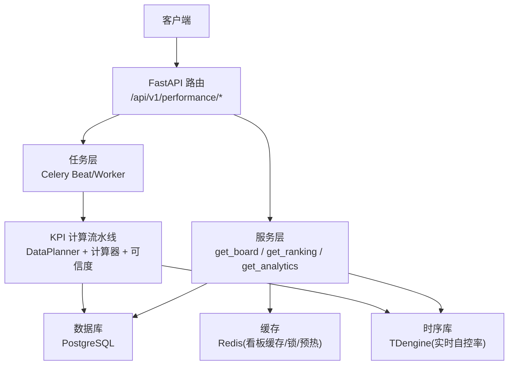
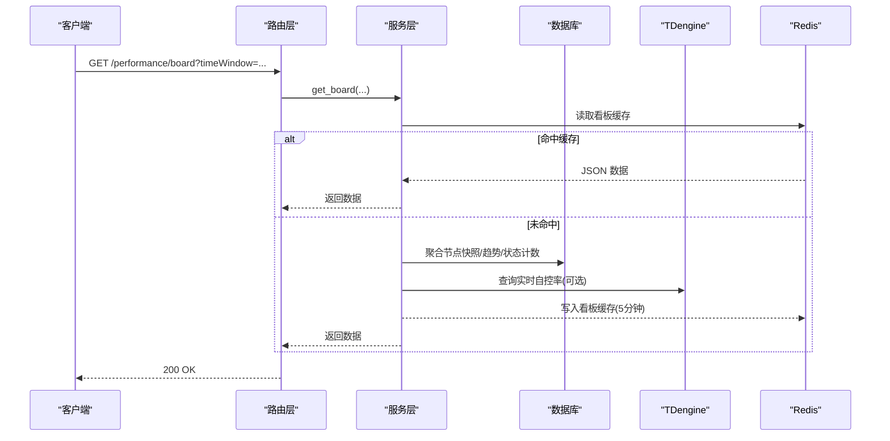
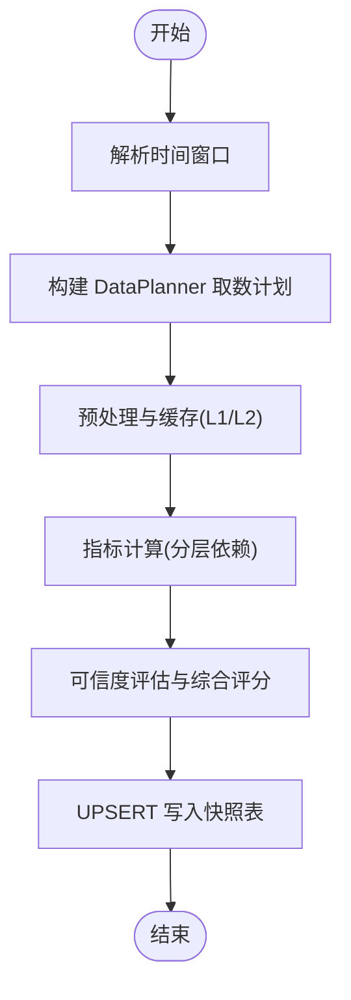
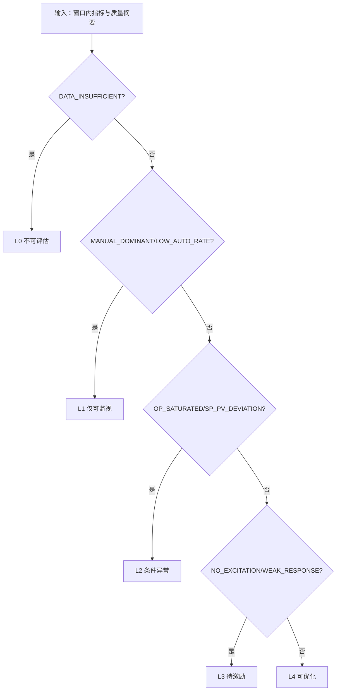
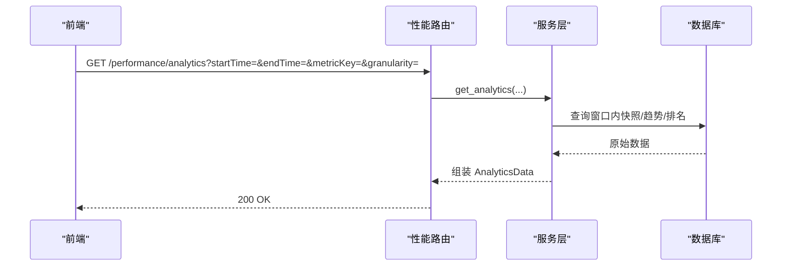
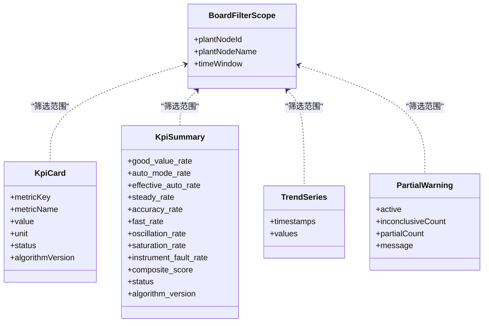
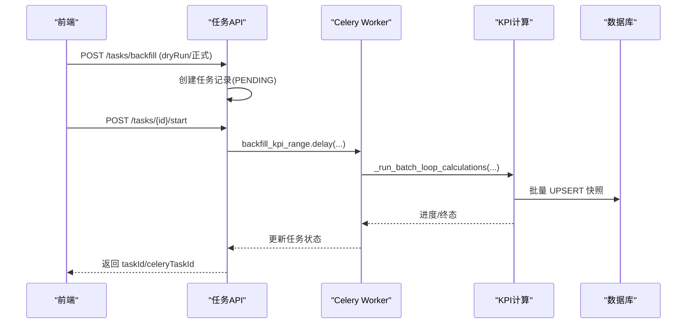
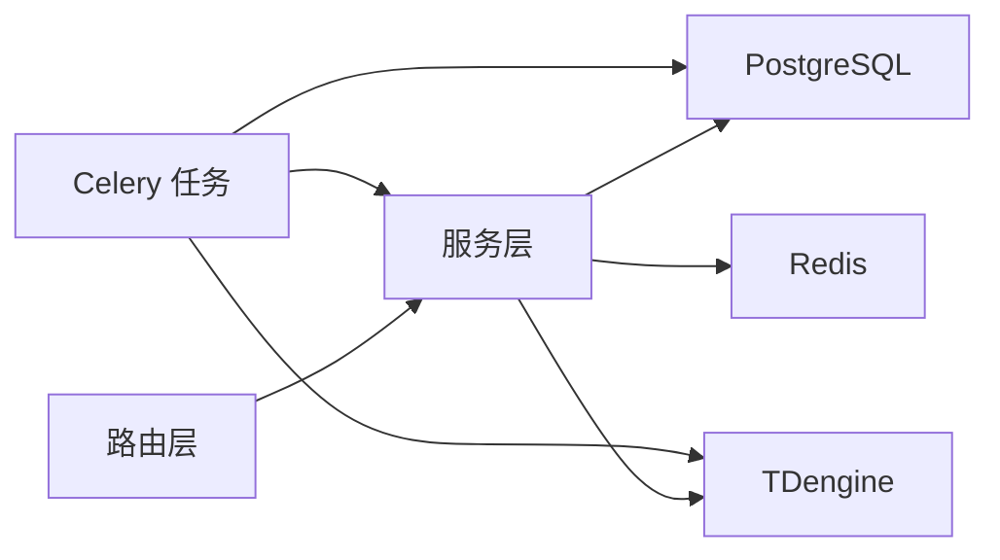

# 性能评估接口

<cite>
**本文引用的文件**
- [performance.py](file://backend/app/api/v1/endpoints/performance.py)
- [performance_service.py](file://backend/app/services/performance.py)
- [performance_schemas.py](file://backend/app/schemas/performance.py)
- [kpi_calc_tasks.py](file://backend/app/tasks/kpi_calc.py)
- [tasks_api.py](file://backend/app/api/v1/endpoints/tasks.py)
- [loop_fitness.py](file://backend/app/services/loop_fitness.py)
- [test_performance.py](file://backend/tests/test_performance.py)
</cite>

## 目录
1. [简介](#简介)
2. [项目结构](#项目结构)
3. [核心组件](#核心组件)
4. [架构总览](#架构总览)
5. [详细组件分析](#详细组件分析)
6. [依赖关系分析](#依赖关系分析)
7. [性能考虑](#性能考虑)
8. [故障排查指南](#故障排查指南)
9. [结论](#结论)
10. [附录](#附录)

## 简介
本文件为 CLPM-MVP 性能评估模块的 API 文档，覆盖以下能力：
- KPI 指标计算接口：指标类型、计算参数、时间范围配置
- 适用性评估接口：L0-L4 分级算法、评估标准、结果解读
- 统计分析接口：多维度分析、趋势对比、排名查询
- 仪表盘聚合接口：系统概览数据、关键指标汇总、可视化数据准备
- 批量计算、异步任务与缓存策略说明
- 性能优化建议与大数据量处理方案

## 项目结构
性能评估相关代码主要分布在以下位置：
- 接口层：FastAPI 路由定义与请求/响应校验
- 服务层：看板聚合、排行、统计报表、CSV 导出等
- 任务层：Celery 定时与手动任务（小时级全量、自定义范围回填）
- 模型与 Schema：统一的数据结构与字段约束
- 适用性评估：L0-L4 判定逻辑与阈值配置

图表来源
- [performance.py:134-164](file://backend/app/api/v1/endpoints/performance.py#L134-L164)
- [performance_service.py:313-451](file://backend/app/services/performance.py#L313-L451)
- [kpi_calc_tasks.py:128-170](file://backend/app/tasks/kpi_calc.py#L128-L170)

章节来源
- [performance.py:1-542](file://backend/app/api/v1/endpoints/performance.py#L1-L542)
- [performance_service.py:1-800](file://backend/app/services/performance.py#L1-L800)
- [kpi_calc_tasks.py:1-800](file://backend/app/tasks/kpi_calc.py#L1-L800)

## 核心组件
- 指标配置与规则管理：提供指标权重、阈值、引擎规则的查询与更新
- 全局看板：按装置/单元或全厂维度聚合 KPI 卡片、汇总、平稳率趋势、部分数据警告与 L0-L4 适用性分布
- 低效回路排行：支持多排序字段、分页偏移、递归节点筛选
- 统计报表：多维度趋势、单元排名、坏演员分布，支持 CSV 导出
- 快照列表：按回路/装置/时间/状态/可信度/等级筛选，支持 latestOnly 与排序
- 异步任务：小时级自动计算、单回路/批量自定义计算、回填任务编排与并发控制
- 缓存策略：看板 Redis 缓存、指标配置缓存失效、小时窗互斥锁、缓存预热

章节来源
- [performance.py:55-263](file://backend/app/api/v1/endpoints/performance.py#L55-L263)
- [performance_service.py:136-451](file://backend/app/services/performance.py#L136-L451)
- [kpi_calc_tasks.py:128-800](file://backend/app/tasks/kpi_calc.py#L128-L800)

## 架构总览

图表来源
- [performance.py:134-164](file://backend/app/api/v1/endpoints/performance.py#L134-L164)
- [performance_service.py:313-451](file://backend/app/services/performance.py#L313-L451)

章节来源
- [performance.py:134-164](file://backend/app/api/v1/endpoints/performance.py#L134-L164)
- [performance_service.py:313-451](file://backend/app/services/performance.py#L313-L451)

## 详细组件分析

### KPI 指标计算接口
- 指标类型与映射
  - 支持 12+ 个指标，涵盖好值率、自控率、有效自控率、平稳率、准确率、快速率、振荡率、饱和率、粘滞指数、输出行程指数、仪表故障率、理想稳态时间、时间常数等
  - 指标代码与数据库列名存在映射关系，例如 steady_rate 对应稳定性指标的计算代码
- 计算参数
  - 时间窗口：支持 today/yesterday/last_8_hours/last_24_hours/last_72_hours/last_168_hours/last_7_days/last_30_days/custom
  - 自定义窗口需传入 startTime/endTime（ISO 8601）
  - 过滤条件：plantNodeId（递归子节点）、status（SUCCESS/INCONCLUSIVE/PARTIAL）、confidenceLevel（A/B/C/D/E）、loopTagName（模糊搜索）、grade（服务端按当前定级阈值过滤）
- 计算流程
  - Celery Beat 每小时触发全量计算；支持单回路/批量自定义计算
  - DataPlanner 负责取数与预处理（L1/L2 缓存），随后调用各指标计算器，最终通过可信度评估与综合评分写入快照表
  - 失败重试、幂等 UPSERT、INCONCLUSIVE 兜底

图表来源
- [kpi_calc_tasks.py:128-170](file://backend/app/tasks/kpi_calc.py#L128-L170)
- [kpi_calc_tasks.py:699-762](file://backend/app/tasks/kpi_calc.py#L699-L762)

章节来源
- [kpi_calc_tasks.py:68-120](file://backend/app/tasks/kpi_calc.py#L68-L120)
- [kpi_calc_tasks.py:128-170](file://backend/app/tasks/kpi_calc.py#L128-L170)
- [kpi_calc_tasks.py:699-762](file://backend/app/tasks/kpi_calc.py#L699-L762)

### 适用性评估接口（L0-L4）
- 分级含义
  - L0 不可评估：数据严重不足/质量 E 级/信号缺失
  - L1 仅可监视：历史不够或自控率低/手动占比高
  - L2 条件异常：OP 饱和或 SP-PV 大偏差
  - L3 待激励：无有效激励或响应太弱
  - L4 可优化：数据充分、控制正常、有有效激励
- 评估标准与标签
  - DATA_INSUFFICIENT → L0
  - MANUAL_DOMINANT / LOW_AUTO_RATE → L1
  - OP_SATURATED / SP_PV_DEVIATION → L2
  - NO_EXCITATION / WEAK_RESPONSE → L3
  - FIT → L4
- 结果解读
  - 返回 fitness_level 与 fitness_tags，用于前端展示与提示
  - 看板中提供 L0-L4 分布统计，辅助整体健康度判断

图表来源
- [loop_fitness.py:32-63](file://backend/app/services/loop_fitness.py#L32-L63)
- [performance_service.py:393-430](file://backend/app/services/performance.py#L393-L430)

章节来源
- [loop_fitness.py:32-63](file://backend/app/services/loop_fitness.py#L32-L63)
- [performance_service.py:393-430](file://backend/app/services/performance.py#L393-L430)

### 统计分析接口
- 多维度分析
  - 支持按 plantNodeId 筛选、metricKey（score/good_value_rate/...）、granularity（hour/day/week/month）
  - 返回 kpiTrend（时间序列）、unitRanking（单元排名）、badActorDistribution（坏演员分布）
- 趋势对比
  - 平稳率趋势、综合评分趋势等多系列折线数据
  - 支持装置/单元/全厂不同粒度
- 排名查询
  - 低效回路排行：支持 score/steady_rate/good_value_rate/fast_rate 排序，asc/desc
  - 支持 limit/offset 分页拉取，解决 >100 回路的统计口径问题

图表来源
- [performance.py:222-241](file://backend/app/api/v1/endpoints/performance.py#L222-L241)
- [performance_service.py:675-800](file://backend/app/services/performance.py#L675-L800)

章节来源
- [performance.py:222-241](file://backend/app/api/v1/endpoints/performance.py#L222-L241)
- [performance_service.py:675-800](file://backend/app/services/performance.py#L675-L800)

### 仪表盘聚合接口
- 系统概览数据
  - filterScope：plantNodeId、plantNodeName、timeWindow
  - kpiCards：8 大 KPI + 综合评分 + 仪表故障率（共 10 张卡片）
  - kpiSummary：加权汇总（含 loop_count、node_count、status、algorithm_version）
- 关键指标汇总
  - 平稳率趋势：按小时聚合
  - 部分数据警告：INCONCLUSIVE 数量提示
  - L0-L4 适用性分布：窗口内每回路最新快照的 fitness_level 统计
- 可视化数据准备
  - timestamps/values 双数组，便于前端直接渲染折线图
  - 支持按装置/单元/全厂切换

图表来源
- [performance_schemas.py:97-159](file://backend/app/schemas/performance.py#L97-L159)
- [performance_service.py:473-613](file://backend/app/services/performance.py#L473-L613)

章节来源
- [performance.py:134-164](file://backend/app/api/v1/endpoints/performance.py#L134-L164)
- [performance_service.py:473-613](file://backend/app/services/performance.py#L473-L613)
- [performance_schemas.py:97-159](file://backend/app/schemas/performance.py#L97-L159)

### 批量计算与异步任务
- 批量计算
  - 自定义批量任务：calculate_custom_batch_kpi，支持 loop_ids、ts_start/ts_end
  - 预加载回路配置与 OP 限位，减少重复 I/O
  - 并发控制：Semaphore 限制同时计算的回路数
- 异步任务
  - 小时级自动计算：calculate_hourly_kpi（Beat 触发）
  - 单回路计算：calculate_loop_kpi
  - 回填任务：创建任务记录（PENDING）→ 启动（RUNNING）→ Celery 执行 → 进度/终态更新
  - 并发限制：BACKFILL 计入 CUSTOM 并发池，Lua 原子占用槽位
- 缓存策略
  - 看板缓存：Redis 键包含 plant_node_id 与 time_window，TTL 5 分钟
  - 指标配置缓存：更新后失效
  - 小时窗互斥锁：同一窗口避免重复计算
  - 缓存预热：prewarm_cache，提前填充 L1/L2 缓存

图表来源
- [tasks_api.py:900-1099](file://backend/app/api/v1/endpoints/tasks.py#L900-L1099)
- [kpi_calc_tasks.py:699-762](file://backend/app/tasks/kpi_calc.py#L699-L762)

章节来源
- [tasks_api.py:900-1099](file://backend/app/api/v1/endpoints/tasks.py#L900-L1099)
- [kpi_calc_tasks.py:699-762](file://backend/app/tasks/kpi_calc.py#L699-L762)

## 依赖关系分析
- 路由与服务解耦：路由仅做参数解析与权限校验，业务逻辑下沉至服务层
- 服务与数据源：PostgreSQL 为主存储，TDengine 用于实时自控率
- 缓存与一致性：看板与指标配置使用 Redis 缓存，写操作后主动失效
- 任务与调度：Celery Beat 与 Worker 分离，Beat 负责调度，Worker 执行计算
- 适用性评估与看板：看板聚合时读取快照中的 fitness_level，形成 L0-L4 分布

图表来源
- [performance.py:134-263](file://backend/app/api/v1/endpoints/performance.py#L134-L263)
- [performance_service.py:313-451](file://backend/app/services/performance.py#L313-L451)
- [kpi_calc_tasks.py:128-170](file://backend/app/tasks/kpi_calc.py#L128-L170)

章节来源
- [performance.py:134-263](file://backend/app/api/v1/endpoints/performance.py#L134-L263)
- [performance_service.py:313-451](file://backend/app/services/performance.py#L313-L451)
- [kpi_calc_tasks.py:128-170](file://backend/app/tasks/kpi_calc.py#L128-L170)

## 性能考虑
- 缓存优先：看板接口默认 5 分钟缓存，显著降低重复聚合开销
- 并发控制：批量计算使用 Semaphore 限制并发，避免数据库连接耗尽
- 窗口化计算：小时级任务与回填任务按窗口切分，提升吞吐与可观测性
- 索引与聚合：排行榜与趋势查询基于快照表，避免跨表大扫描
- 大数据量处理
  - 使用 offset/limit 分页拉取全量，避免单次响应过大
  - 对 >100 回路场景，排行榜支持分页偏移，确保等级分布准确
  - 回填任务支持 dry-run 预览，预估耗时与样本回路名，便于容量规划

章节来源
- [performance_service.py:313-451](file://backend/app/services/performance.py#L313-L451)
- [performance_service.py:675-800](file://backend/app/services/performance.py#L675-L800)
- [test_performance.py:414-441](file://backend/tests/test_performance.py#L414-L441)

## 故障排查指南
- 看板缓存失效
  - 指标配置变更后，服务层会主动失效指标配置缓存
  - 看板缓存键包含 plant_node_id 与 time_window，确认键是否命中
- 小时窗互斥锁
  - 同一窗口已有任务在执行时会跳过本次计算，检查 Redis 锁键与 TTL
- 回填任务并发限制
  - 若收到“并发限制”错误，等待槽位释放或调整并发上限
- 快照状态与可信度
  - INCONCLUSIVE 表示数据不足或质量不达标，检查预处理与数据质量策略
- 日志与监控
  - 关注服务层与任务层的 warning/error 日志，定位具体失败点

章节来源
- [performance_service.py:116-134](file://backend/app/services/performance.py#L116-L134)
- [kpi_calc_tasks.py:182-234](file://backend/app/tasks/kpi_calc.py#L182-L234)
- [tasks_api.py:934-941](file://backend/app/api/v1/endpoints/tasks.py#L934-L941)

## 结论
CLPM-MVP 性能评估模块通过清晰的分层架构与完善的缓存/并发机制，提供了稳定的 KPI 计算、适用性评估、统计分析以及仪表盘聚合能力。接口设计兼顾灵活性与性能，适合大规模回路与长时间窗口的生产环境使用。

## 附录
- 常用时间窗取值：today/yesterday/last_8_hours/last_24_hours/last_72_hours/last_168_hours/last_7_days/last_30_days/custom
- 排序字段白名单：score/steady_rate/good_value_rate/fast_rate
- 快照状态：SUCCESS/INCONCLUSIVE/PARTIAL
- 可信度等级：A/B/C/D/E
- 适用性等级：L0/L1/L2/L3/L4