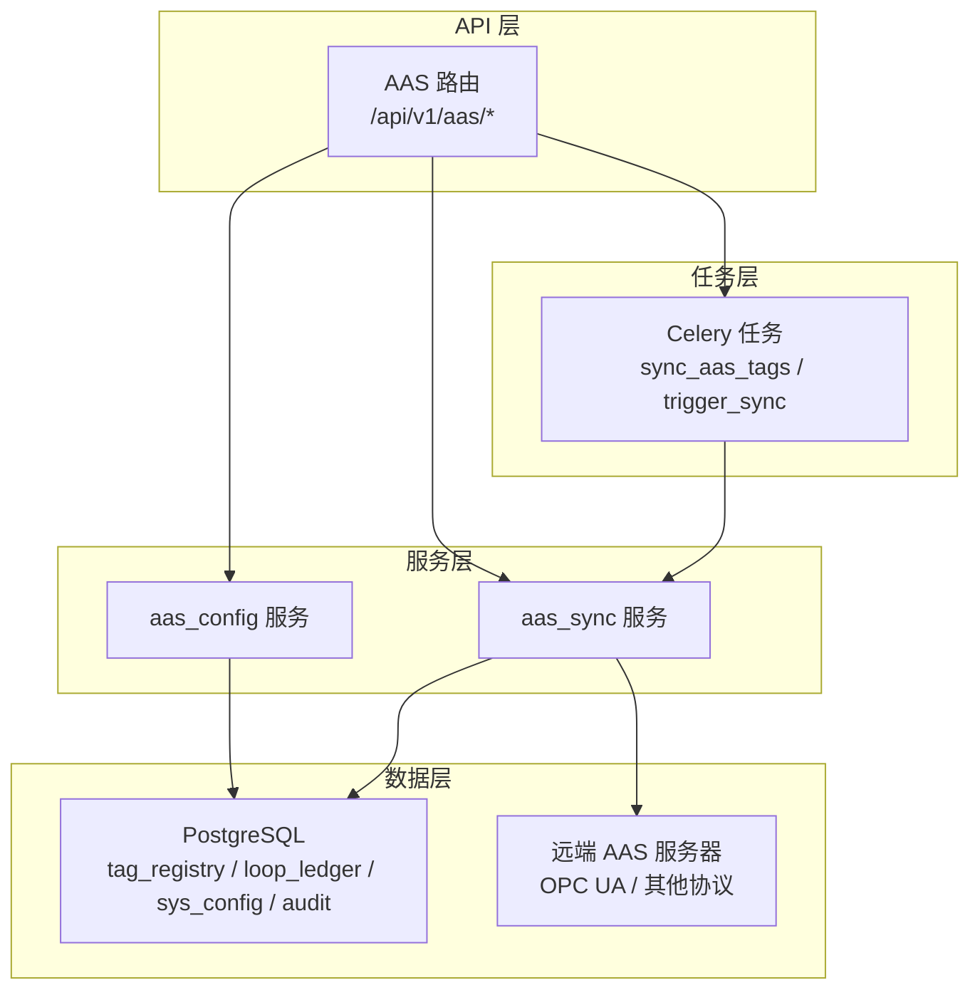
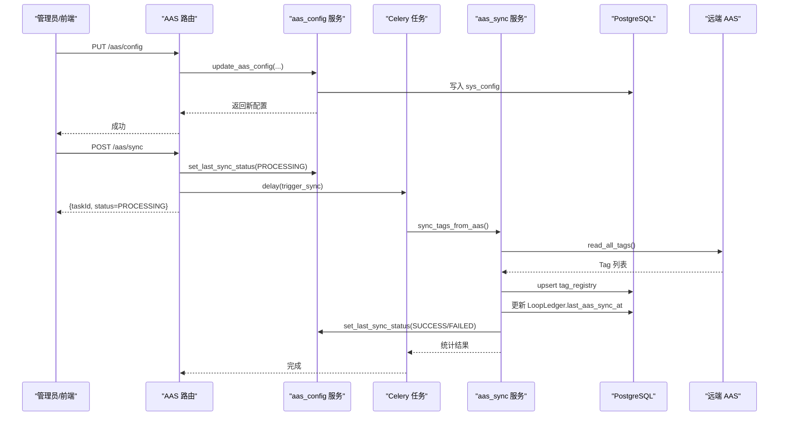
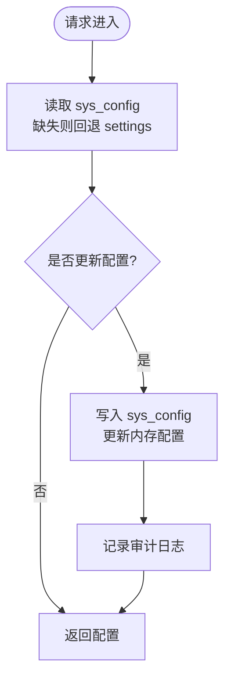
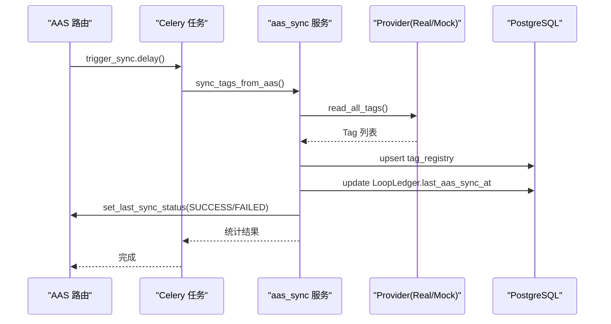
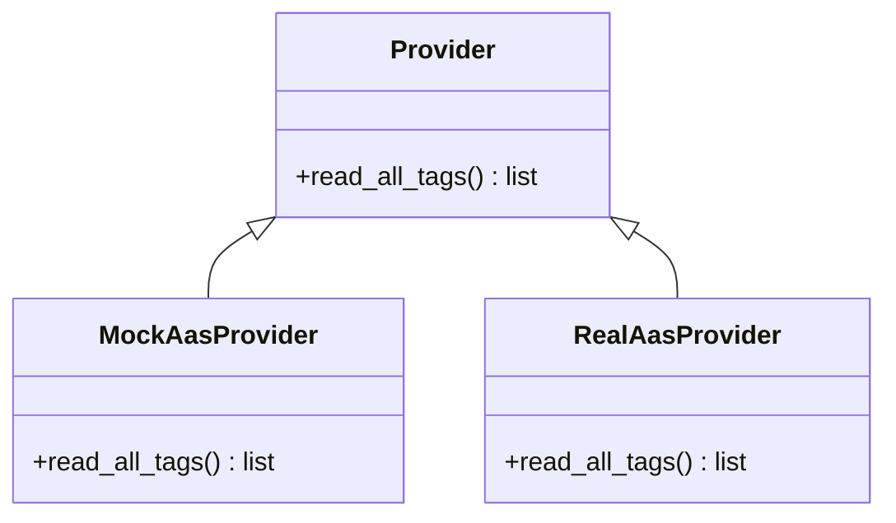
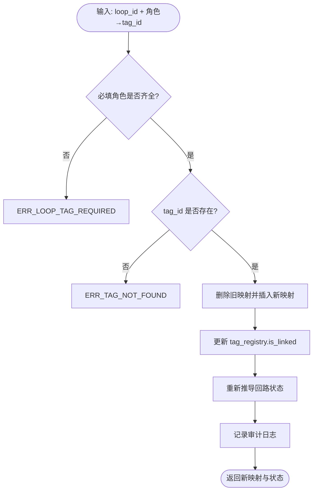
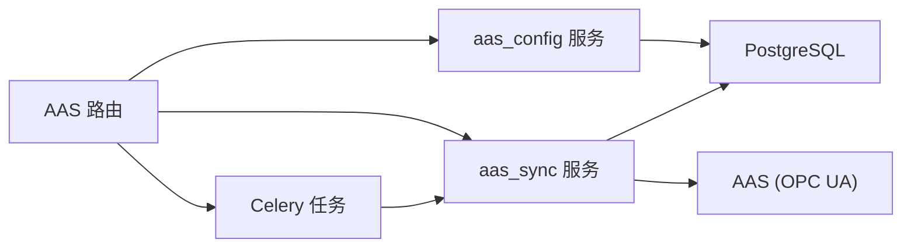

# AAS集成接口

<cite>
**本文引用的文件**
- [backend/app/api/v1/endpoints/aas.py](file://backend/app/api/v1/endpoints/aas.py)
- [backend/app/schemas/aas.py](file://backend/app/schemas/aas.py)
- [backend/app/services/aas_config.py](file://backend/app/services/aas_config.py)
- [backend/app/services/aas_sync.py](file://backend/app/services/aas_sync.py)
- [backend/app/tasks/aas_sync.py](file://backend/app/tasks/aas_sync.py)
- [backend/app/models/tag.py](file://backend/app/models/tag.py)
- [backend/app/models/loop.py](file://backend/app/models/loop.py)
- [backend/app/core/config.py](file://backend/app/core/config.py)
</cite>

## 目录
1. [简介](#简介)
2. [项目结构](#项目结构)
3. [核心组件](#核心组件)
4. [架构总览](#架构总览)
5. [详细组件分析](#详细组件分析)
6. [依赖关系分析](#依赖关系分析)
7. [性能考虑](#性能考虑)
8. [故障诊断指南](#故障诊断指南)
9. [结论](#结论)
10. [附录](#附录)

## 简介
本文件为 CLPM-MVP 的 AAS（Asset Administration Shell）集成接口文档，覆盖以下能力：
- AAS 连接配置接口：支持远端 AAS 系统连接参数配置、认证信息管理、连接测试。
- 数据采集同步接口：定时或触发式从 AAS 采集 Tag 元数据与当前值，包含增量/全量策略、断点续传思路与重试机制。
- 协议适配接口：通过 Provider 抽象实现不同厂商 AAS 的协议适配（默认 OPC UA），并提供 Mock 模式用于开发调试。
- 数据映射接口：将 AAS Tag 模型映射到 CLPM 内部 tag_registry 与回路角色（PV/SP/OP/MODE/PID_P/PID_I/PID_D），并维护关联关系。
- 可靠性保障：错误重试、指数退避、审计日志、状态轮询、任务异步化。
- 集成指南、协议适配规范与故障诊断方法。

## 项目结构
AAS 集成在后端以“API层 → 服务层 → 任务层 → 数据模型”分层组织：
- API 层：FastAPI 路由暴露 REST 接口，负责鉴权、入参校验与响应封装。
- 服务层：封装 AAS 配置读写、连接测试、Tag 同步逻辑与 Provider 选择。
- 任务层：Celery 异步任务执行同步逻辑，支持手动触发与定时调度预留。
- 数据模型：PostgreSQL 中 tag_registry、loop_ledger、sys_config、sys_audit_log 等表承载配置、Tag、回路与审计信息。

**图表来源**
- [backend/app/api/v1/endpoints/aas.py:1-352](file://backend/app/api/v1/endpoints/aas.py#L1-L352)
- [backend/app/services/aas_config.py:1-227](file://backend/app/services/aas_config.py#L1-L227)
- [backend/app/services/aas_sync.py:1-420](file://backend/app/services/aas_sync.py#L1-L420)
- [backend/app/tasks/aas_sync.py:1-104](file://backend/app/tasks/aas_sync.py#L1-L104)

**章节来源**
- [backend/app/api/v1/endpoints/aas.py:1-352](file://backend/app/api/v1/endpoints/aas.py#L1-L352)
- [backend/app/services/aas_config.py:1-227](file://backend/app/services/aas_config.py#L1-L227)
- [backend/app/services/aas_sync.py:1-420](file://backend/app/services/aas_sync.py#L1-L420)
- [backend/app/tasks/aas_sync.py:1-104](file://backend/app/tasks/aas_sync.py#L1-L104)

## 核心组件
- AAS 配置管理：读取/更新 sys_config 中的 AAS 连接参数与安全模式，支持即时生效与审计记录。
- AAS 连接测试：不写库，仅验证连通性与延迟。
- AAS 同步服务：Provider 抽象（Mock/Real），带重试与指数退避；将 AAS Tag 写入 tag_registry，并更新活跃回路的 last_aas_sync_at。
- Celery 任务：封装异步执行，支持手动触发与未来定时调度。
- 数据映射：Tag 到回路角色的映射维护（PV/SP/OP/MODE/PID_P/PID_I/PID_D）。

**章节来源**
- [backend/app/services/aas_config.py:87-216](file://backend/app/services/aas_config.py#L87-L216)
- [backend/app/services/aas_sync.py:131-206](file://backend/app/services/aas_sync.py#L131-L206)
- [backend/app/services/aas_sync.py:248-368](file://backend/app/services/aas_sync.py#L248-L368)
- [backend/app/tasks/aas_sync.py:24-93](file://backend/app/tasks/aas_sync.py#L24-L93)
- [backend/app/services/tag_mapping.py:49-292](file://backend/app/services/tag_mapping.py#L49-L292)

## 架构总览
AAS 集成的端到端流程如下：
- 配置获取/更新：管理员通过 API 读取或修改 AAS 连接参数，服务层持久化至 sys_config 并更新内存配置。
- 连接测试：调用服务层进行只读探测，返回成功/失败与耗时。
- 同步触发：API 设置 PROCESSING 状态后提交 Celery 任务；任务内执行 Provider 读取、入库、统计与状态更新。
- 状态查询：前端轮询 GET /aas/config 或专用状态接口，观察 lastSyncStatus 与 lastSyncAt。

**图表来源**
- [backend/app/api/v1/endpoints/aas.py:58-114](file://backend/app/api/v1/endpoints/aas.py#L58-L114)
- [backend/app/services/aas_config.py:117-216](file://backend/app/services/aas_config.py#L117-L216)
- [backend/app/services/aas_sync.py:248-368](file://backend/app/services/aas_sync.py#L248-L368)
- [backend/app/tasks/aas_sync.py:54-93](file://backend/app/tasks/aas_sync.py#L54-L93)

## 详细组件分析

### AAS 连接配置接口
- 功能：获取/更新 AAS 连接参数（endpoint、安全模式、同步周期、是否启用）、记录审计日志、即时生效。
- 关键行为：
  - 读取时优先 sys_config，缺失回退到全局 settings。
  - 更新时仅写入非空字段，同时刷新内存配置。
  - 提供连接测试接口，不写库，返回 success、latencyMs、message。
- 权限：配置与测试需 ADMIN 角色。

**图表来源**
- [backend/app/services/aas_config.py:87-216](file://backend/app/services/aas_config.py#L87-L216)
- [backend/app/api/v1/endpoints/aas.py:48-84](file://backend/app/api/v1/endpoints/aas.py#L48-L84)

**章节来源**
- [backend/app/api/v1/endpoints/aas.py:48-84](file://backend/app/api/v1/endpoints/aas.py#L48-L84)
- [backend/app/services/aas_config.py:87-216](file://backend/app/services/aas_config.py#L87-L216)
- [backend/app/schemas/aas.py:10-42](file://backend/app/schemas/aas.py#L10-L42)

### 数据采集同步接口
- 功能：从 AAS 拉取 Tag 清单与当前值，写入 tag_registry，并更新活跃回路 last_aas_sync_at。
- 同步策略：
  - 全量扫描 AAS Tag，按 tag_name 去重 upsert。
  - 跳过非法 tag 名（白名单校验），记录跳过明细。
  - 描述字段保护：若已存在且被手工编辑过，避免被 AAS 覆盖。
  - 失败重试：最多 3 次，指数退避。
- 断点续传：通过 lastSyncAt/lastSyncStatus 与 LoopLedger.last_aas_sync_at 体现最近同步时间与范围；当前实现为全量扫描，可按时间窗口扩展增量。
- 任务化：POST /aas/sync 立即返回 taskId，前端可轮询任务状态；任务内部设置 PROCESSING/SUCCESS/FAILED。

**图表来源**
- [backend/app/api/v1/endpoints/aas.py:92-114](file://backend/app/api/v1/endpoints/aas.py#L92-L114)
- [backend/app/tasks/aas_sync.py:54-93](file://backend/app/tasks/aas_sync.py#L54-L93)
- [backend/app/services/aas_sync.py:248-368](file://backend/app/services/aas_sync.py#L248-L368)

**章节来源**
- [backend/app/services/aas_sync.py:248-368](file://backend/app/services/aas_sync.py#L248-L368)
- [backend/app/tasks/aas_sync.py:54-93](file://backend/app/tasks/aas_sync.py#L54-L93)
- [backend/app/models/tag.py:23-70](file://backend/app/models/tag.py#L23-L70)
- [backend/app/models/loop.py:33-187](file://backend/app/models/loop.py#L33-L187)

### 协议适配接口
- 设计：Provider 抽象统一 read_all_tags 接口，支持 MockAasProvider（开发环境）与 RealAasProvider（生产 OPC UA）。
- 扩展性：新增厂商协议只需实现 Provider 并注册到 get_aas_provider。
- 约束：绝对只读，禁止任何写操作到 AAS。

**图表来源**
- [backend/app/services/aas_sync.py:43-124](file://backend/app/services/aas_sync.py#L43-L124)
- [backend/app/services/aas_sync.py:131-195](file://backend/app/services/aas_sync.py#L131-L195)
- [backend/app/services/aas_sync.py:202-206](file://backend/app/services/aas_sync.py#L202-L206)

**章节来源**
- [backend/app/services/aas_sync.py:43-206](file://backend/app/services/aas_sync.py#L43-L206)

### 数据映射接口
- 目标：将 AAS Tag 映射到回路 7 个槽位（PV/SP/OP/MODE 必填，PID_P/PID_I/PID_D 可选）。
- 能力：
  - 查询回路 7 槽位关联状态与 Tag 详情。
  - 批量更新回路 Tag 关联，校验必填与存在性，自动推导回路状态。
  - 维护 tag_registry.is_linked 标记。
- 审计：所有变更写入审计日志。

**图表来源**
- [backend/app/services/tag_mapping.py:118-292](file://backend/app/services/tag_mapping.py#L118-L292)

**章节来源**
- [backend/app/services/tag_mapping.py:49-292](file://backend/app/services/tag_mapping.py#L49-L292)
- [backend/app/models/loop.py:190-221](file://backend/app/models/loop.py#L190-L221)

### 数据同步监控、错误重试与日志记录
- 监控：GET /aas/sync-status 返回 lastSyncAt、lastSyncStatus、enabled、interval、endpoint、mockMode、securityMode 与 Tag 统计（总数、已关联、质量码分布）。
- 重试：_retry_async 对 BizError 与普通异常分别处理，指数退避，最多 3 次。
- 日志：配置更新与 Tag 映射变更均记录审计日志；同步过程记录跳过 Tag 与异常。

**章节来源**
- [backend/app/api/v1/endpoints/aas.py:231-348](file://backend/app/api/v1/endpoints/aas.py#L231-L348)
- [backend/app/services/aas_sync.py:209-245](file://backend/app/services/aas_sync.py#L209-L245)
- [backend/app/services/aas_config.py:64-84](file://backend/app/services/aas_config.py#L64-L84)

## 依赖关系分析
- API 层依赖：
  - 鉴权与数据库会话注入。
  - 服务层：aas_config、aas_sync。
  - 模型：TagRegistry、LoopLedger、SysAuditLog。
- 服务层依赖：
  - 配置中心：settings（AAS_ENDPOINT、AAS_MOCK_MODE、AAS_SYNC_INTERVAL_SECONDS 等）。
  - 数据库：PostgreSQL（tag_registry、loop_ledger、sys_config、audit）。
  - 外部系统：AAS（OPC UA，通过 asyncua）。
- 任务层依赖：
  - Celery 应用与异步执行封装。
  - 服务层：aas_sync.sync_tags_from_aas。

**图表来源**
- [backend/app/api/v1/endpoints/aas.py:1-352](file://backend/app/api/v1/endpoints/aas.py#L1-L352)
- [backend/app/services/aas_config.py:1-227](file://backend/app/services/aas_config.py#L1-L227)
- [backend/app/services/aas_sync.py:1-420](file://backend/app/services/aas_sync.py#L1-L420)
- [backend/app/tasks/aas_sync.py:1-104](file://backend/app/tasks/aas_sync.py#L1-L104)

**章节来源**
- [backend/app/core/config.py:72-79](file://backend/app/core/config.py#L72-L79)
- [backend/app/api/v1/endpoints/aas.py:1-352](file://backend/app/api/v1/endpoints/aas.py#L1-L352)

## 性能考虑
- 批量写入：Tag 同步采用单事务批量 upsert，减少往返开销。
- 重试与退避：网络抖动场景下降低瞬时压力，避免雪崩。
- 只读边界：对 AAS 仅读，避免引入额外写放大。
- 分页与过滤：Tag 列表查询支持关键字、质量码、关联状态过滤与分页，减轻前端渲染压力。
- 超时与限流：TDengine 与远端 API 具备超时与并发限制，AAS 同步可结合业务规模调整批次与并发。

[本节为通用指导，不直接分析具体文件]

## 故障诊断指南
- 连接失败：
  - 检查 AAS_ENDPOINT、AAS_SECURITY_MODE、AAS_MOCK_MODE 配置。
  - 使用 POST /aas/config/test 验证连通性与延迟。
  - 查看 BizError 消息与日志中的重试次数。
- 同步失败：
  - 关注 lastSyncStatus 是否为 FAILED，lastSyncAt 是否更新。
  - 检查 tag 名是否符合白名单，避免 SQL 注入风险。
  - 查看 Celery 任务日志与重试情况。
- 数据不一致：
  - 核对 tag_registry 的 current_value、quality 与 last_sync_at。
  - 确认 LoopLedger.last_aas_sync_at 是否随同步更新。
- 权限问题：
  - 配置与测试需 ADMIN；同步触发需 ADMIN/IC_ENGINEER/PE_ENGINEER。

**章节来源**
- [backend/app/api/v1/endpoints/aas.py:76-114](file://backend/app/api/v1/endpoints/aas.py#L76-L114)
- [backend/app/services/aas_sync.py:371-410](file://backend/app/services/aas_sync.py#L371-L410)
- [backend/app/services/aas_sync.py:248-368](file://backend/app/services/aas_sync.py#L248-L368)
- [backend/app/api/v1/endpoints/aas.py:231-348](file://backend/app/api/v1/endpoints/aas.py#L231-L348)

## 结论
CLPM-MVP 的 AAS 集成提供了完整的配置管理、连接测试、异步同步、协议适配与数据映射能力，并通过重试、审计与状态轮询确保可靠性。当前实现以全量同步为主，可通过时间窗口与断点标记扩展为增量同步。Provider 抽象便于接入更多工业协议，满足多厂商 AAS 集成需求。

[本节为总结，不直接分析具体文件]

## 附录

### API 定义速查
- GET /api/v1/aas/config：获取 AAS 连接配置（ADMIN）
- PUT /api/v1/aas/config：更新 AAS 连接配置（ADMIN）
- POST /api/v1/aas/config/test：测试 AAS 连接（ADMIN）
- POST /api/v1/aas/sync：手动触发 AAS Tag 同步（ADMIN/IC_ENGINEER/PE_ENGINEER）
- GET /api/v1/aas/tags：分页查询 AAS Tag 列表
- GET /api/v1/aas/sync-status：同步服务状态与统计
- GET /api/v1/aas/sync-logs：同步日志列表（分页）

**章节来源**
- [backend/app/api/v1/endpoints/aas.py:48-348](file://backend/app/api/v1/endpoints/aas.py#L48-L348)
- [backend/app/schemas/aas.py:10-85](file://backend/app/schemas/aas.py#L10-L85)

### 配置项说明
- AAS_ENDPOINT：OPC UA 端点 URL
- AAS_MOCK_MODE：是否启用 Mock 模式
- AAS_SYNC_INTERVAL_SECONDS：同步周期（秒）
- AAS_SYNC_ENABLED：是否启用同步
- AAS_SECURITY_MODE：安全模式（None/Sign/SignAndEncrypt）

**章节来源**
- [backend/app/core/config.py:72-79](file://backend/app/core/config.py#L72-L79)

### 数据模型要点
- tag_registry：存储 AAS 同步的 Tag 元数据与当前值、质量码、最后同步时间、是否关联等。
- loop_ledger：回路主表，含 last_aas_sync_at、控制类型、重要等级、复杂回路分组等。
- loop_tag_mapping：回路 7 槽位（PV/SP/OP/MODE/PID_P/PID_I/PID_D）与 Tag 的关联。

**章节来源**
- [backend/app/models/tag.py:23-70](file://backend/app/models/tag.py#L23-L70)
- [backend/app/models/loop.py:33-221](file://backend/app/models/loop.py#L33-L221)