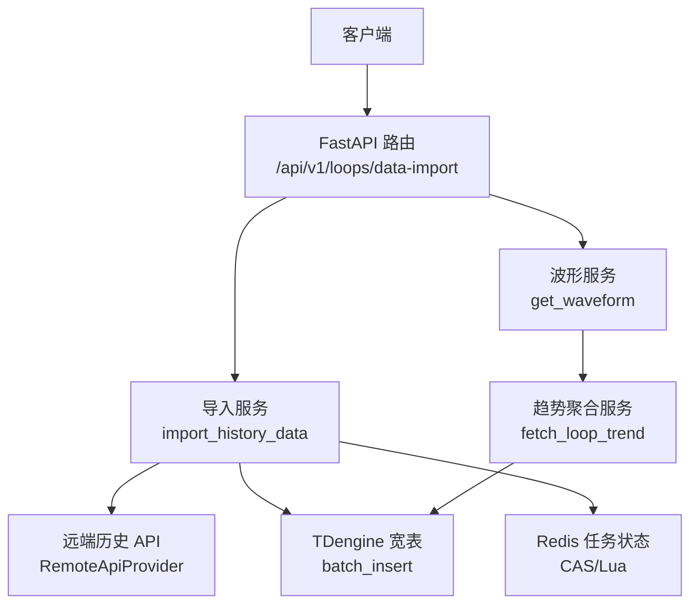
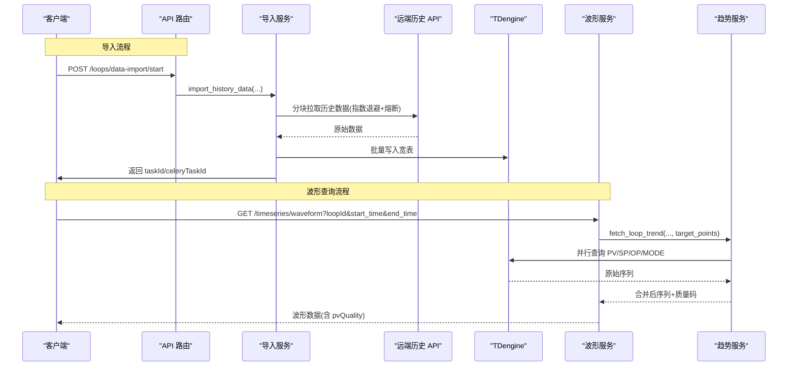
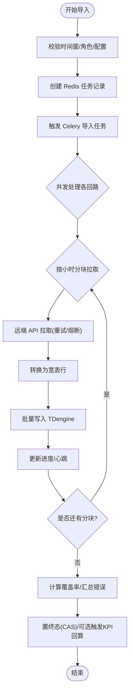
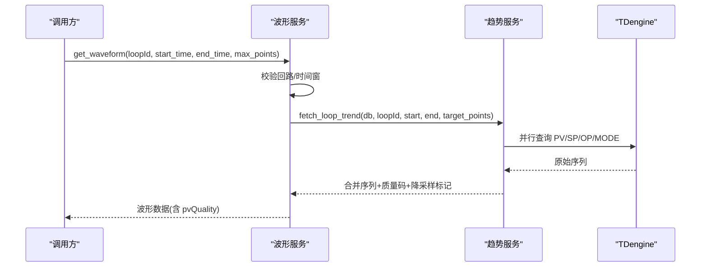
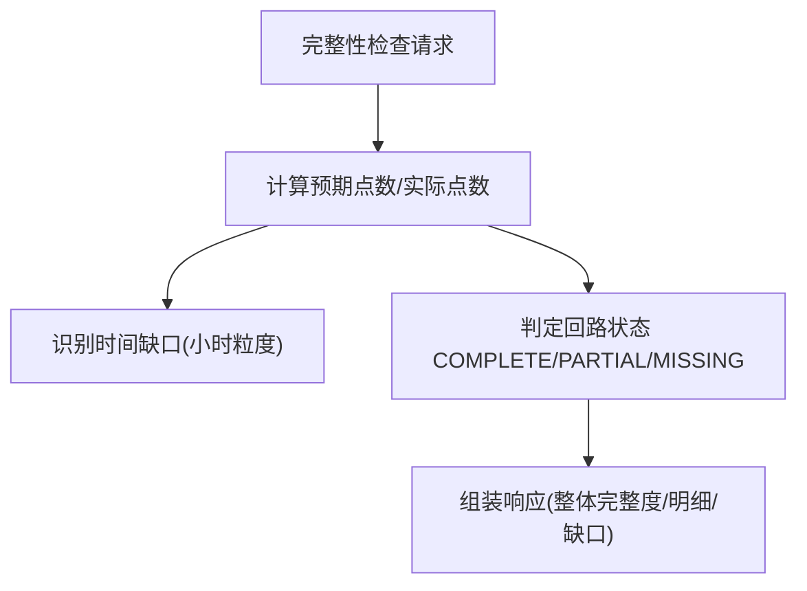
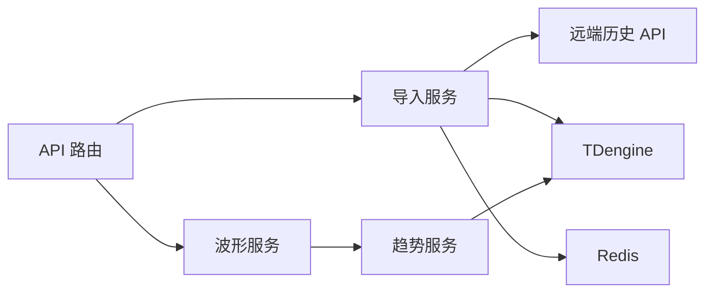

# 回路数据接口

<cite>
**本文引用的文件**
- [loop_data.py](file://backend/app/api/v1/endpoints/loop_data.py)
- [waveform.py](file://backend/app/services/waveform.py)
- [data_import.py](file://backend/app/services/data_import.py)
- [loop_data.py（Schema）](file://backend/app/schemas/loop_data.py)
- [trend_service.py](file://backend/app/services/trend_service.py)
- [tdengine_native.py](file://backend/app/core/tdengine_native.py)
- [remote_api_provider.py](file://backend/app/services/data_source/remote_api_provider.py)
</cite>

## 目录
1. [简介](#简介)
2. [项目结构](#项目结构)
3. [核心组件](#核心组件)
4. [架构总览](#架构总览)
5. [详细组件分析](#详细组件分析)
6. [依赖关系分析](#依赖关系分析)
7. [性能考虑](#性能考虑)
8. [故障排查指南](#故障排查指南)
9. [结论](#结论)
10. [附录](#附录)

## 简介
本文件为 CLPM-MVP 的“回路数据接口”技术文档，聚焦以下能力：
- 时序数据查询：支持按时间范围、采样频率、数据质量过滤的历史数据获取（PV、OP、SV/SP、MODE 等）。
- 批量数据导入：通过远端历史 API 拉取并写入本地 TDengine 宽表，提供任务编排、进度跟踪与回算触发。
- 波形数据接口：面向控制回路的波形图数据，支持缩放、平移、标注等交互所需的点集与质量码。
- 数据质量评估：基于完整性、准确性、一致性进行评分与标记（结合预处理管线与质量码归一化）。
- 性能优化：数据压缩存储、分页查询、并发访问控制、降采样与分块拉取等策略。
- 模板与示例：提供导入请求模板、调用流程说明与常见问题解决方案。

## 项目结构
围绕“回路数据接口”，后端主要涉及如下模块：
- API 层：历史数据导入与完整性检查路由（/api/v1/loops/data-import）。
- 服务层：波形查询服务、趋势聚合服务、历史数据导入服务、远端 API 提供者。
- 数据层：TDengine 宽表写入/查询、Redis 任务状态跟踪。
- 模式层：导入请求/响应、完整性检查请求/响应的 Pydantic Schema。

图表来源
- [loop_data.py:39-154](file://backend/app/api/v1/endpoints/loop_data.py#L39-L154)
- [data_import.py:396-684](file://backend/app/services/data_import.py#L396-L684)
- [waveform.py:146-212](file://backend/app/services/waveform.py#L146-L212)
- [remote_api_provider.py:1-200](file://backend/app/services/data_source/remote_api_provider.py#L1-L200)
- [tdengine_native.py:1-200](file://backend/app/core/tdengine_native.py#L1-L200)

章节来源
- [loop_data.py:39-154](file://backend/app/api/v1/endpoints/loop_data.py#L39-L154)
- [data_import.py:396-684](file://backend/app/services/data_import.py#L396-L684)
- [waveform.py:146-212](file://backend/app/services/waveform.py#L146-L212)

## 核心组件
- 历史数据导入接口
  - 启动导入：校验时间窗、角色权限、远端 API 配置；创建 Redis 任务记录；触发 Celery 任务执行导入；回填 celery_task_id。
  - 完整性检查：对本地 TDengine 宽表做完整性检查，输出整体完整度、时间缺口、回路缺口。
  - 任务管理：列表、状态、取消、删除、触发 KPI 回算。
- 波形数据接口
  - 查询 PV/SP/OP/MODE 序列，限制最大时间窗（30 天），超过阈值时自动 LTTB 降采样，返回质量码（Good/Bad/Unknown）。
- 数据导入服务
  - 动态分块拉取（小时级）、并发控制（信号量）、重试与熔断、覆盖/跳过冲突策略、覆盖率统计、终态 CAS 保护。
- 趋势聚合服务
  - 并行查询多序列、动态采样间隔、合并时间轴、质量码处理与降采样。

章节来源
- [loop_data.py:39-357](file://backend/app/api/v1/endpoints/loop_data.py#L39-L357)
- [waveform.py:146-236](file://backend/app/services/waveform.py#L146-L236)
- [data_import.py:396-800](file://backend/app/services/data_import.py#L396-L800)
- [loop_data.py（Schema）:42-216](file://backend/app/schemas/loop_data.py#L42-L216)

## 架构总览
下图展示从请求到落库/返回的关键路径，包括导入与波形两条主线。

图表来源
- [loop_data.py:39-154](file://backend/app/api/v1/endpoints/loop_data.py#L39-L154)
- [data_import.py:396-684](file://backend/app/services/data_import.py#L396-L684)
- [waveform.py:146-212](file://backend/app/services/waveform.py#L146-L212)
- [remote_api_provider.py:1-200](file://backend/app/services/data_source/remote_api_provider.py#L1-L200)
- [tdengine_native.py:1-200](file://backend/app/core/tdengine_native.py#L1-L200)

## 详细组件分析

### 历史数据导入接口
- 功能要点
  - 时间窗校验：最大 30 天，防止误操作。
  - 冲突策略：overwrite（先 DELETE 再 INSERT，适合手工优先）与 skip（直接 INSERT，依赖 UPSERT）。
  - 任务跟踪：Redis Hash + Lua CAS，防终态被重投覆盖；进度心跳用于清扫器判断活跃任务。
  - 分块拉取：按小时动态分块，目标分块数约 30，单次请求跨度受上限约束，降低远端压力。
  - 并发控制：每回路并发限流（信号量），避免远端瞬时过载。
  - 覆盖率反馈：按预期点数计算覆盖率，低覆盖率回路清单可辅助补数。
  - 可选回算：导入成功后可触发 KPI 回算任务。
- 关键流程
  - 启动导入：参数校验 → 创建任务记录 → 触发 Celery 任务 → 回填 celery_task_id。
  - 任务状态：PENDING → RUNNING → SUCCESS/FAILED/CANCELLED，支持列表、详情、取消、删除。
  - 完整性检查：仅查本地 TDengine，输出整体完整度、时间缺口、回路缺口。

图表来源
- [loop_data.py:39-154](file://backend/app/api/v1/endpoints/loop_data.py#L39-L154)
- [data_import.py:396-684](file://backend/app/services/data_import.py#L396-L684)
- [loop_data.py（Schema）:42-216](file://backend/app/schemas/loop_data.py#L42-L216)

章节来源
- [loop_data.py:39-357](file://backend/app/api/v1/endpoints/loop_data.py#L39-L357)
- [data_import.py:396-800](file://backend/app/services/data_import.py#L396-L800)
- [loop_data.py（Schema）:42-216](file://backend/app/schemas/loop_data.py#L42-L216)

### 波形数据接口
- 功能要点
  - 输入：loopId、start_time、end_time、max_points（默认 5000）。
  - 限制：时间窗不超过 30 天，否则返回错误码。
  - 数据源：通过趋势服务并行查询 PV/SP/OP/MODE，合并时间轴。
  - 质量码：pvQuality 归一化为 Good/Bad/Unknown；当 PV 质量为 Bad 时，pv 值置空。
  - 降采样：超过 max_points 使用 LTTB 多序列共享时间戳降采样，保证前端缩放/平移体验。
- 返回字段
  - loopId、tagName、timeRange、timestamps、pv/sp/op/mode、pvQuality、downsampled、pointCount、sampleInterval。

图表来源
- [waveform.py:146-212](file://backend/app/services/waveform.py#L146-L212)
- [trend_service.py:1-200](file://backend/app/services/trend_service.py#L1-L200)

章节来源
- [waveform.py:146-236](file://backend/app/services/waveform.py#L146-L236)

### 数据质量评估接口
- 能力概述
  - 完整性：对比实际点数与预期点数，输出整体完整度、时间缺口、回路缺口。
  - 准确性/一致性：结合预处理管线中的质量码（Good/Bad/Unknown）与异常检测，形成质量标签。
- 接口入口
  - 完整性检查：POST /loops/data-import/integrity-check，支持指定回路集合、时间范围与期望采样间隔。
- 输出内容
  - overallCompleteness、loopCount、complete/partial/missing 计数、loopDetails、timeGaps、dataSourceUnavailable、failedLoopIds、checkedAt。

图表来源
- [loop_data.py:157-218](file://backend/app/api/v1/endpoints/loop_data.py#L157-L218)
- [loop_data.py（Schema）:139-194](file://backend/app/schemas/loop_data.py#L139-L194)

章节来源
- [loop_data.py:157-218](file://backend/app/api/v1/endpoints/loop_data.py#L157-L218)
- [loop_data.py（Schema）:139-194](file://backend/app/schemas/loop_data.py#L139-L194)

### 批量数据导入（CSV/Excel）说明
- 当前实现
  - 通过“历史数据导入”接口从远端 HTTP API 拉取历史数据并写入 TDengine 宽表，具备任务编排、进度跟踪、覆盖率统计与回算触发能力。
- CSV/Excel 导入建议
  - 若需直接导入 CSV/Excel 文件，可在现有导入服务基础上扩展“文件解析→清洗→转换→批量写入”流水线；复用 data_import.py 的分块、并发、重试与覆盖率统计逻辑。
  - 清洗与转换建议：统一时间戳格式、单位换算、缺失值填充、异常值剔除、质量码映射（Good/Bad/Unknown）。
  - 批量写入：复用 tdengine_native.batch_insert 进行高效写入。

章节来源
- [data_import.py:396-800](file://backend/app/services/data_import.py#L396-L800)
- [tdengine_native.py:1-200](file://backend/app/core/tdengine_native.py#L1-L200)

## 依赖关系分析
- API 路由依赖
  - 导入路由依赖导入服务、Celery 任务、Redis 任务状态。
  - 波形路由依赖波形服务与趋势服务。
- 服务间依赖
  - 导入服务依赖远端 API 提供者（带熔断/限流）、TDengine 写入、Redis 任务跟踪。
  - 波形服务依赖趋势服务（并行查询、动态采样）、TDengine。
- 外部依赖
  - TDengine：宽表存储与高性能查询。
  - Redis：任务状态、进度、CAS 原子更新。
  - 远端历史 API：历史数据源，具备超时/限流/熔断保护。

图表来源
- [loop_data.py:39-154](file://backend/app/api/v1/endpoints/loop_data.py#L39-L154)
- [data_import.py:396-684](file://backend/app/services/data_import.py#L396-L684)
- [waveform.py:146-212](file://backend/app/services/waveform.py#L146-L212)

章节来源
- [loop_data.py:39-154](file://backend/app/api/v1/endpoints/loop_data.py#L39-L154)
- [data_import.py:396-684](file://backend/app/services/data_import.py#L396-L684)
- [waveform.py:146-212](file://backend/app/services/waveform.py#L146-L212)

## 性能考虑
- 数据压缩存储
  - 使用 TDengine 宽表存储，利用其列存与时序索引优势；必要时在应用层对数值进行量化压缩（如定点化）后再写入。
- 分页查询
  - 导入任务列表支持 page/pageSize 分页；波形查询通过 max_points 控制返回点数，配合前端分页/滚动加载。
- 并发访问控制
  - 导入过程使用信号量限制并发（默认 2），避免远端 API 瞬时过载；分块级重试与熔断保护。
- 降采样
  - 波形查询超过阈值时使用 LTTB 多序列共享时间戳降采样，减少传输与渲染开销。
- 动态分块
  - 根据时间范围动态计算分块大小，平衡请求次数与单次数据量，降低远端压力。
- 缓存与热点
  - 趋势服务可对热点回路进行短期缓存；Redis 任务状态提供快速查询。

[本节为通用性能指导，不直接分析具体文件]

## 故障排查指南
- 常见错误与定位
  - 时间格式无效：检查 ISO 8601 格式与时区（Z/+00:00）。
  - 时间范围无效：确保 tsStart < tsEnd，且不超过 30 天。
  - 远端 API 未配置：确认 HISTORY_DATA_API_URL 已设置。
  - 任务不存在/已取消：检查 task_id 与任务状态。
  - 覆盖率低于 90%：查看 loopCoverage 明细，针对缺口时段使用 skip 策略补数。
- 调试建议
  - 查看导入任务 result 字段中的 loopCoverage 与 lowCoverageLoopIds。
  - 检查 Redis 任务状态（status/progress/imported_count/error_count）。
  - 核对 TDengine 子表名与 tag 映射是否正确。
  - 观察远端 API 的 5xx/429 状态码与重试日志。

章节来源
- [loop_data.py:39-357](file://backend/app/api/v1/endpoints/loop_data.py#L39-L357)
- [data_import.py:396-800](file://backend/app/services/data_import.py#L396-L800)

## 结论
CLPM-MVP 的回路数据接口提供了完整的时序数据查询、批量导入、波形展示与质量评估能力。通过分块拉取、并发控制、降采样与 Redis 任务状态跟踪，系统在大规模数据场景下具备良好的稳定性与可扩展性。建议在后续迭代中补充 CSV/Excel 直导能力，并完善质量评估指标（准确性、一致性）的可视化与告警。

[本节为总结性内容，不直接分析具体文件]

## 附录

### API 调用示例（文本描述）
- 启动历史数据导入
  - 方法：POST
  - 路径：/api/v1/loops/data-import/start
  - 请求体关键字段：loopIds、tsStart、tsEnd、interval、conflictStrategy、triggerBackfill
  - 响应：包含 taskId 与 celeryTaskId
- 查询导入任务列表
  - 方法：GET
  - 路径：/api/v1/loops/data-import/tasks?page=1&pageSize=20
- 查询单个导入任务状态
  - 方法：GET
  - 路径：/api/v1/loops/data-import/{task_id}/status
- 取消导入任务
  - 方法：POST
  - 路径：/api/v1/loops/data-import/{task_id}/cancel
- 删除导入任务
  - 方法：DELETE
  - 路径：/api/v1/loops/data-import/{task_id}
- 触发 KPI 回算
  - 方法：POST
  - 路径：/api/v1/loops/data-import/{task_id}/backfill-kpi
- 波形数据查询
  - 方法：GET
  - 路径：/timeseries/waveform?loopId={loopId}&start_time={ISO8601}&end_time={ISO8601}&max_points=5000
- 数据完整性检查
  - 方法：POST
  - 路径：/api/v1/loops/data-import/integrity-check
  - 请求体关键字段：loopIds（可选）、tsStart、tsEnd、expectedInterval

章节来源
- [loop_data.py:39-357](file://backend/app/api/v1/endpoints/loop_data.py#L39-L357)
- [waveform.py:146-212](file://backend/app/services/waveform.py#L146-L212)
- [loop_data.py（Schema）:42-216](file://backend/app/schemas/loop_data.py#L42-L216)

### 数据导入模板（JSON 示例结构）
- 启动导入请求体
  - loopIds: ["loop_1", "loop_2"]
  - tsStart: "2024-01-01T00:00:00Z"
  - tsEnd: "2024-01-01T23:59:59Z"
  - interval: 1
  - conflictStrategy: "overwrite" 或 "skip"
  - triggerBackfill: false
- 完整性检查请求体
  - loopIds: ["loop_1"]（可选）
  - tsStart: "2024-01-01T00:00:00Z"
  - tsEnd: "2024-01-01T23:59:59Z"
  - expectedInterval: 1

章节来源
- [loop_data.py（Schema）:42-216](file://backend/app/schemas/loop_data.py#L42-L216)