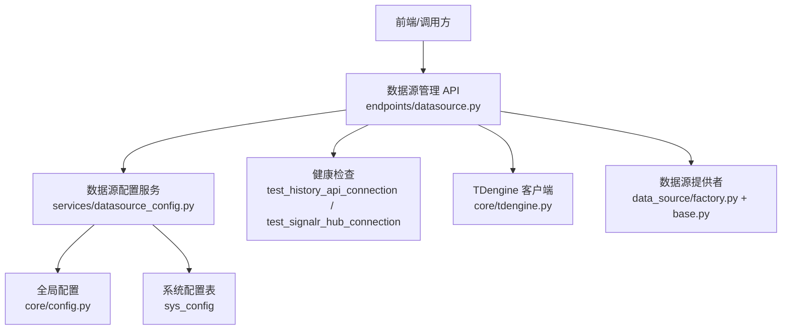
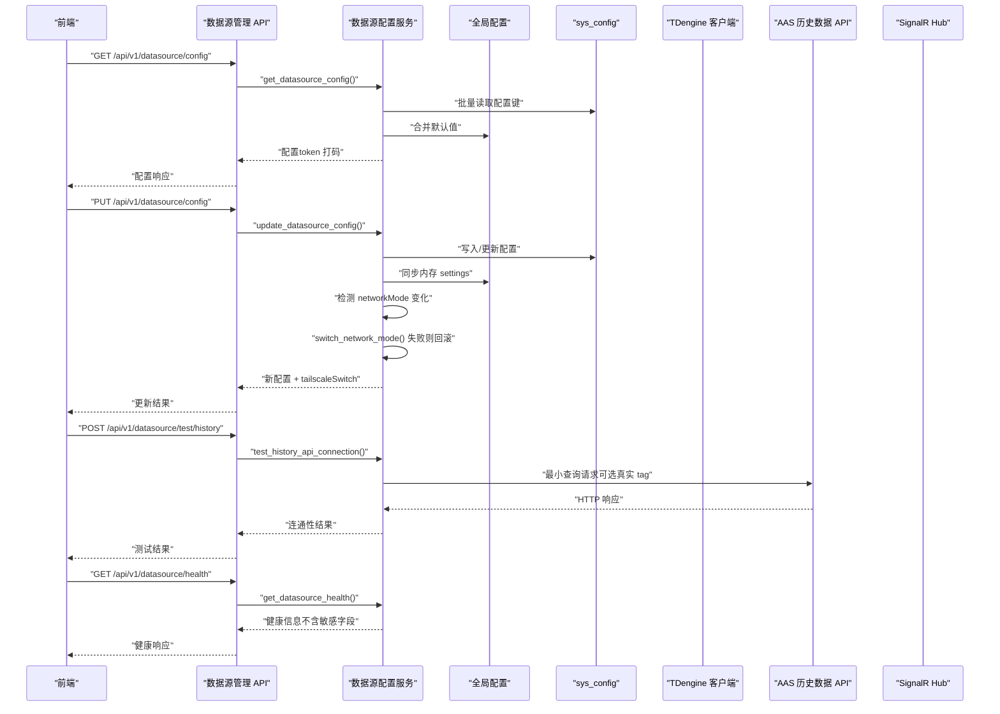
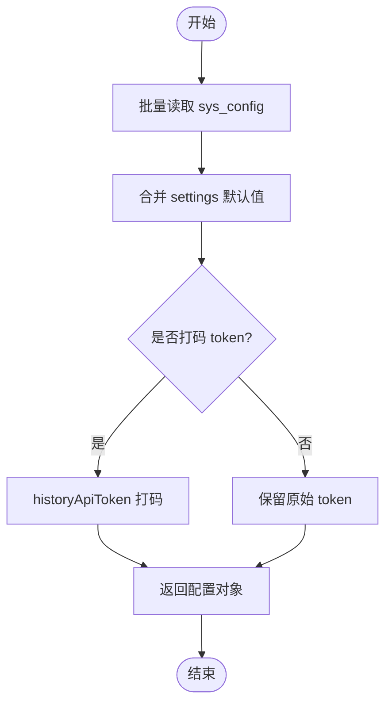
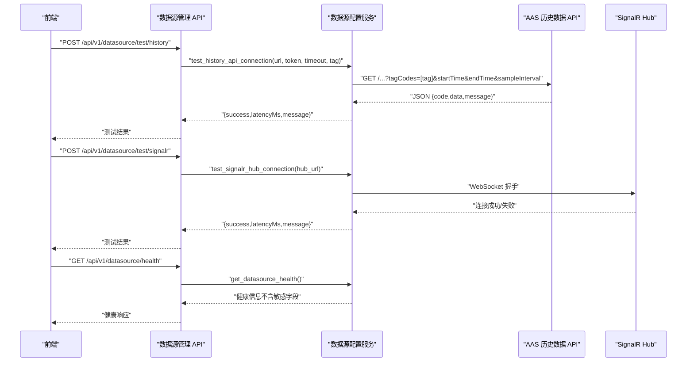
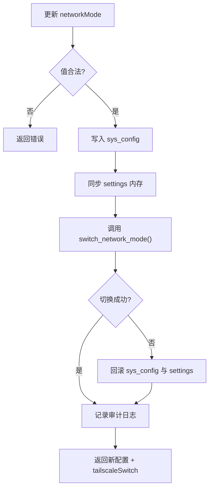
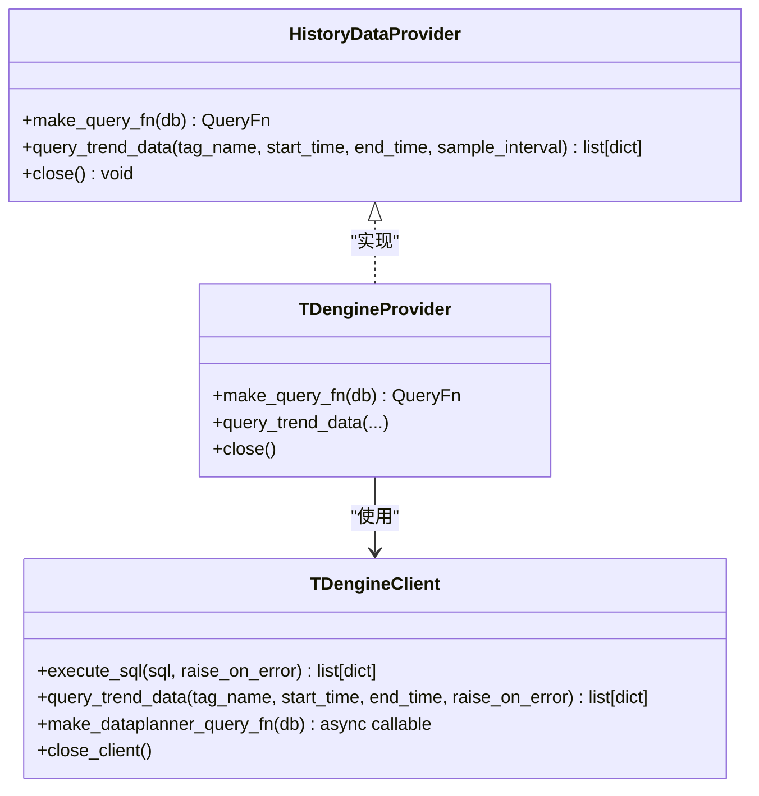
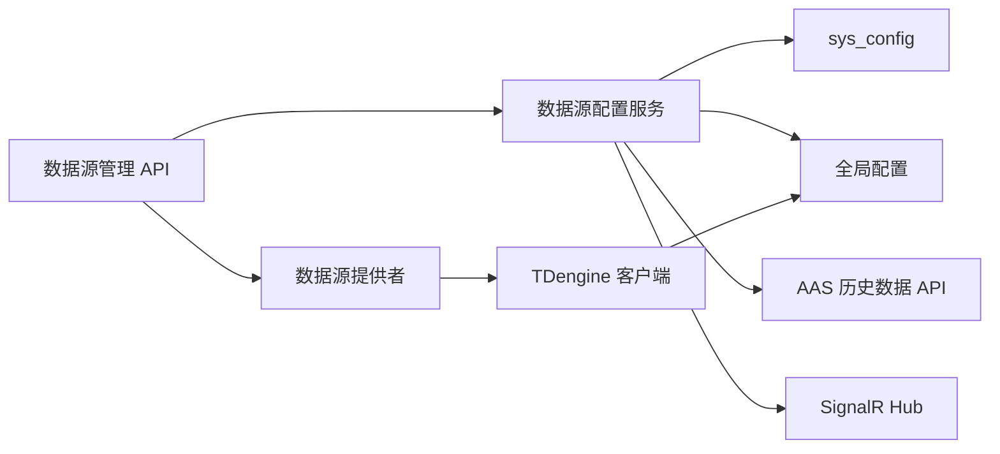

# 数据源管理接口

<cite>
**本文引用的文件**
- [backend/app/services/datasource_config.py](file://backend/app/services/datasource_config.py)
- [backend/app/schemas/datasource.py](file://backend/app/schemas/datasource.py)
- [backend/app/core/config.py](file://backend/app/core/config.py)
- [backend/app/core/tdengine.py](file://backend/app/core/tdengine.py)
- [backend/app/services/data_source/base.py](file://backend/app/services/data_source/base.py)
- [backend/app/services/data_source/factory.py](file://backend/app/services/data_source/factory.py)
- [backend/app/api/v1/endpoints/datasource.py](file://backend/app/api/v1/endpoints/datasource.py)
</cite>

## 目录
1. [简介](#简介)
2. [项目结构](#项目结构)
3. [核心组件](#核心组件)
4. [架构总览](#架构总览)
5. [详细组件分析](#详细组件分析)
6. [依赖关系分析](#依赖关系分析)
7. [性能考量](#性能考量)
8. [故障排查指南](#故障排查指南)
9. [结论](#结论)
10. [附录：API 契约与配置项](#附录api-契约与配置项)

## 简介
本文件为 CLPM-MVP 的“数据源管理接口”完整技术文档，覆盖以下能力：
- 数据源配置管理：支持外部历史数据 API（AAS）与本地 TDengine 的配置、网络模式切换（局域网/公网）、SignalR 实时订阅配置。
- 健康检查：提供历史数据 API 连通性测试、SignalR Hub 连通性测试、链路健康状态查询。
- 运行时切换：支持 networkMode 动态切换（Tailscale），并具备失败回滚机制；Provider 单例在首次调用时创建，dataSourceType 切换需重启后端。
- 监控指标：暴露链路健康信息（网络模式、SignalR 运行态、最近同步时间等）。
- 安全机制：敏感字段打码返回、生产环境强制密码校验、审计日志记录配置变更。
- 最佳实践与排障：连接池、超时、重试、断点续传、Tailscale 切换失败的恢复策略。

说明：当前代码库中未实现 PostgreSQL/TDengine/AAS 多类型数据源的通用“连接池/认证/切换”抽象层；计算类历史数据查询统一走本地 TDengine，远端 AAS 仅用于“历史数据导入”。因此本文档围绕现有实现进行说明，并在必要时给出扩展建议。

## 项目结构
与数据源管理相关的核心位置如下：
- 配置与设置：app/core/config.py（全局 Settings）
- 数据源配置服务：app/services/datasource_config.py（读写 sys_config、同步 settings、连通性测试）
- 数据源协议与工厂：app/services/data_source/base.py、factory.py（HistoryDataProvider 协议与 Provider 获取）
- TDengine 客户端：app/core/tdengine.py（HTTP REST 客户端、SQL 执行、趋势查询、DataPlanner 适配器）
- API Schema：app/schemas/datasource.py（配置、健康、测试结果模型）
- API 路由：app/api/v1/endpoints/datasource.py（对外暴露的 HTTP 接口）

**图示来源**
- [backend/app/api/v1/endpoints/datasource.py](file://backend/app/api/v1/endpoints/datasource.py)
- [backend/app/services/datasource_config.py](file://backend/app/services/datasource_config.py)
- [backend/app/core/config.py](file://backend/app/core/config.py)
- [backend/app/core/tdengine.py](file://backend/app/core/tdengine.py)
- [backend/app/services/data_source/base.py](file://backend/app/services/data_source/base.py)
- [backend/app/services/data_source/factory.py](file://backend/app/services/data_source/factory.py)

**章节来源**
- [backend/app/services/datasource_config.py:1-517](file://backend/app/services/datasource_config.py#L1-L517)
- [backend/app/schemas/datasource.py:1-132](file://backend/app/schemas/datasource.py#L1-L132)
- [backend/app/core/config.py:1-225](file://backend/app/core/config.py#L1-L225)
- [backend/app/core/tdengine.py:1-547](file://backend/app/core/tdengine.py#L1-L547)
- [backend/app/services/data_source/base.py:1-85](file://backend/app/services/data_source/base.py#L1-L85)
- [backend/app/services/data_source/factory.py:1-49](file://backend/app/services/data_source/factory.py#L1-L49)

## 核心组件
- 数据源配置服务（datasource_config.py）
  - 读取/更新 sys_config，映射到全局 settings，支持即时生效与重启生效两类字段。
  - 提供历史数据 API 连通性测试、SignalR Hub 连通性测试、链路健康状态查询。
  - 对 historyApiToken 进行打码返回，审计记录配置变更。
- 全局配置（config.py）
  - 集中管理数据库、TDengine、Redis、AAS、SignalR、断点续传、链路监控等参数。
  - 生产环境强制校验密钥与密码强度。
- TDengine 客户端（tdengine.py）
  - 基于 httpx 的异步客户端，连接复用与限流，SQL 执行封装，趋势数据查询，DataPlanner 适配器。
  - 错误处理：区分“无数据”和“数据源不可用”，支持自动重建 client 以应对 Celery 事件循环变化。
- 数据源提供者（base.py + factory.py）
  - HistoryDataProvider 协议定义统一的查询函数签名。
  - get_provider() 返回全局 TDengineProvider 单例（计算任务一律本地 TDengine）。
- API Schema（schemas/datasource.py）
  - 定义 DataSourceConfigInfo、DataSourceConfigUpdate、DataSourceTestResult、DataSourceHealthInfo 等模型。

**章节来源**
- [backend/app/services/datasource_config.py:1-517](file://backend/app/services/datasource_config.py#L1-L517)
- [backend/app/core/config.py:1-225](file://backend/app/core/config.py#L1-L225)
- [backend/app/core/tdengine.py:1-547](file://backend/app/core/tdengine.py#L1-L547)
- [backend/app/services/data_source/base.py:1-85](file://backend/app/services/data_source/base.py#L1-L85)
- [backend/app/services/data_source/factory.py:1-49](file://backend/app/services/data_source/factory.py#L1-L49)
- [backend/app/schemas/datasource.py:1-132](file://backend/app/schemas/datasource.py#L1-L132)

## 架构总览
当前架构决策：
- 计算类历史数据查询一律使用本地 TDengine（通过 DataPlanner 适配器），不自动降级到远端 API。
- 远端 AAS 历史数据接口仅由“历史数据导入”任务直接调用（独立 HTTP 客户端，不经本层）。
- SignalR 实时数据订阅器作为唯一实时数据来源，可写回本地 TDengine 宽表。
- networkMode 支持运行时切换（lan/wan），失败时回滚 sys_config 与 settings。

**图示来源**
- [backend/app/api/v1/endpoints/datasource.py](file://backend/app/api/v1/endpoints/datasource.py)
- [backend/app/services/datasource_config.py:206-362](file://backend/app/services/datasource_config.py#L206-L362)
- [backend/app/services/datasource_config.py:385-413](file://backend/app/services/datasource_config.py#L385-L413)
- [backend/app/services/datasource_config.py:416-507](file://backend/app/services/datasource_config.py#L416-L507)

## 详细组件分析

### 数据源配置管理
- 读取配置：优先从 sys_config 读取，缺失回退到 settings 默认值；historyApiToken 默认打码返回。
- 更新配置：支持部分更新（None=不变，空串=清空）；networkMode 切换触发 Tailscale 子网路由切换，失败回滚；所有变更写审计日志。
- 启动预载：应用启动时从 sys_config 预载到 settings，确保 SignalR 订阅器等组件读取最新配置。

**图示来源**
- [backend/app/services/datasource_config.py:102-106](file://backend/app/services/datasource_config.py#L102-L106)
- [backend/app/services/datasource_config.py:206-256](file://backend/app/services/datasource_config.py#L206-L256)

**章节来源**
- [backend/app/services/datasource_config.py:102-189](file://backend/app/services/datasource_config.py#L102-L189)
- [backend/app/services/datasource_config.py:206-362](file://backend/app/services/datasource_config.py#L206-L362)
- [backend/app/services/datasource_config.py:365-383](file://backend/app/services/datasource_config.py#L365-L383)

### 数据源健康检查
- 历史数据 API 连通性测试：支持传入真实 tag 或假 tag；测量延迟；业务码校验；超时与异常捕获。
- SignalR Hub 连通性测试：尝试 WebSocket 握手，测量延迟。
- 链路健康状态：返回网络模式、SignalR 运行态、Hub URL、历史 API URL、tailscale 可用性、最近同步时间。

**图示来源**
- [backend/app/services/datasource_config.py:416-507](file://backend/app/services/datasource_config.py#L416-L507)
- [backend/app/services/datasource_config.py:385-413](file://backend/app/services/datasource_config.py#L385-L413)

**章节来源**
- [backend/app/services/datasource_config.py:416-507](file://backend/app/services/datasource_config.py#L416-L507)
- [backend/app/services/datasource_config.py:385-413](file://backend/app/services/datasource_config.py#L385-L413)

### 数据源切换（运行时）
- networkMode 切换：lan（局域网直连）/wan（公网走 Tailscale），失败时回滚 sys_config 与 settings，保持 DB 与实际链路一致。
- dataSourceType 切换：已废止；计算类历史数据查询固定为本地 TDengine，Provider 单例在首次调用时创建，切换需重启后端。
- signalrEnabled 切换：需重启后端（订阅器后台任务在 lifespan 启动时初始化）。

**图示来源**
- [backend/app/services/datasource_config.py:259-362](file://backend/app/services/datasource_config.py#L259-L362)

**章节来源**
- [backend/app/services/datasource_config.py:259-362](file://backend/app/services/datasource_config.py#L259-L362)

### 数据源监控（健康与运行态）
- 健康信息：包含 networkMode、signalrEnabled、signalrSubscriberRunning、signalrHubUrl、historyApiUrl、tailscaleAvailable、lastSyncAt。
- 运行态标记：historyProviderActive 固定为 tdengine；signalrSubscriberRunning 来自订阅器实例状态。

**章节来源**
- [backend/app/services/datasource_config.py:385-413](file://backend/app/services/datasource_config.py#L385-L413)
- [backend/app/services/datasource_config.py:206-256](file://backend/app/services/datasource_config.py#L206-L256)

### 数据源提供者与 TDengine 客户端
- 提供者协议：HistoryDataProvider 定义 make_query_fn 与 query_trend_data 方法，保证 DataPlanner 无需感知具体数据源。
- 工厂：get_provider() 返回全局 TDengineProvider 单例（计算任务一律本地 TDengine）。
- TDengine 客户端：httpx.AsyncClient 单例，连接复用与限流；execute_sql/query_trend_data 封装；DataPlanner 适配器并行查询多个 tag，构建 RawTimeSeries。

**图示来源**
- [backend/app/services/data_source/base.py:1-85](file://backend/app/services/data_source/base.py#L1-L85)
- [backend/app/services/data_source/factory.py:1-49](file://backend/app/services/data_source/factory.py#L1-L49)
- [backend/app/core/tdengine.py:252-547](file://backend/app/core/tdengine.py#L252-L547)

**章节来源**
- [backend/app/services/data_source/base.py:1-85](file://backend/app/services/data_source/base.py#L1-L85)
- [backend/app/services/data_source/factory.py:1-49](file://backend/app/services/data_source/factory.py#L1-L49)
- [backend/app/core/tdengine.py:156-547](file://backend/app/core/tdengine.py#L156-L547)

## 依赖关系分析
- API 层依赖数据源配置服务，服务依赖 sys_config 与全局 settings。
- 健康检查依赖外部 AAS 与 SignalR Hub。
- 数据源提供者依赖 TDengine 客户端，客户端依赖全局配置（host/port/user/password/db）。
- 数据源工厂维护全局 Provider 单例，避免重复创建。

**图示来源**
- [backend/app/api/v1/endpoints/datasource.py](file://backend/app/api/v1/endpoints/datasource.py)
- [backend/app/services/datasource_config.py:1-517](file://backend/app/services/datasource_config.py#L1-L517)
- [backend/app/core/config.py:1-225](file://backend/app/core/config.py#L1-L225)
- [backend/app/core/tdengine.py:1-547](file://backend/app/core/tdengine.py#L1-L547)
- [backend/app/services/data_source/factory.py:1-49](file://backend/app/services/data_source/factory.py#L1-L49)

**章节来源**
- [backend/app/services/datasource_config.py:1-517](file://backend/app/services/datasource_config.py#L1-L517)
- [backend/app/core/config.py:1-225](file://backend/app/core/config.py#L1-L225)
- [backend/app/core/tdengine.py:1-547](file://backend/app/core/tdengine.py#L1-L547)
- [backend/app/services/data_source/factory.py:1-49](file://backend/app/services/data_source/factory.py#L1-L49)

## 性能考量
- 连接复用与限流：TDengine 客户端使用 httpx.AsyncClient 单例，限制最大连接数与 keepalive 过期，减少 TCP 建连开销。
- 并行查询：DataPlanner 适配器对多个 tag 并行查询，降低 RTT 总耗时。
- 超时控制：TDengine REST 阻塞操作超时、历史数据 API 超时、SignalR 心跳与连接超时均显式配置。
- 事件循环兼容：Celery 跨任务 event loop 关闭后自动重建 client，避免“Event loop is closed”错误。
- 断点续传：SignalR 重连后可按阈值自动补全缺口，支持分布式锁防止重复补数。

**章节来源**
- [backend/app/core/tdengine.py:156-224](file://backend/app/core/tdengine.py#L156-L224)
- [backend/app/core/tdengine.py:252-347](file://backend/app/core/tdengine.py#L252-L347)
- [backend/app/core/tdengine.py:376-511](file://backend/app/core/tdengine.py#L376-L511)
- [backend/app/core/config.py:41-124](file://backend/app/core/config.py#L41-L124)

## 故障排查指南
- 历史数据 API 连通性失败
  - 检查 URL、Token、超时配置；使用真实 tag 测试数据查询链路；查看业务码与响应体。
  - 参考：test_history_api_connection。
- SignalR Hub 连通性失败
  - 检查 Hub URL、网络模式（lan/wan）、防火墙与代理；尝试 WebSocket 握手。
  - 参考：test_signalr_hub_connection。
- networkMode 切换失败
  - 查看 tailscaleSwitch 返回的 status 与 message；若失败会自动回滚 sys_config 与 settings。
  - 参考：update_datasource_config 中的回滚逻辑。
- TDengine 查询失败
  - 检查 host/port/user/password/db；查看 execute_sql/query_trend_data 的错误信息；确认 SQL 与标签白名单。
  - 参考：TDengineError 与 _degrade_or_raise。
- 生产环境安全校验失败
  - 检查 JWT_SECRET_KEY、POSTGRES_PASSWORD、TDENGINE_PASSWORD、REDIS_PASSWORD、AAS_SECURITY_MODE。
  - 参考：settings.validate_security。

**章节来源**
- [backend/app/services/datasource_config.py:416-507](file://backend/app/services/datasource_config.py#L416-L507)
- [backend/app/services/datasource_config.py:259-362](file://backend/app/services/datasource_config.py#L259-L362)
- [backend/app/core/tdengine.py:242-347](file://backend/app/core/tdengine.py#L242-L347)
- [backend/app/core/config.py:185-217](file://backend/app/core/config.py#L185-L217)

## 结论
- 当前实现聚焦于“计算类历史数据查询一律本地 TDengine”，并通过数据源配置服务统一管理外部历史数据 API 与 SignalR 实时订阅。
- 提供完善的健康检查、连通性测试、链路健康信息与审计日志，保障可观测性与可维护性。
- 支持 networkMode 运行时切换并具备失败回滚机制；dataSourceType 切换需重启后端。
- 建议在后续扩展中引入更通用的数据源抽象（PostgreSQL/TDengine/AAS 等）与连接池/认证/切换策略，以支撑多数据源场景。

## 附录：API 契约与配置项
- 配置模型
  - DataSourceConfigInfo：包含 dataSourceType、networkMode、historyApiUrl、historyApiToken、historyApiTimeout、signalrHubUrl、signalrEnabled、signalrReconnectInterval、realtimeWritebackEnabled、gapBackfillEnabled、gapBackfillMinGapSeconds、historyProviderActive、signalrSubscriberRunning、tailscaleAvailable、tailscaleSwitch。
  - DataSourceConfigUpdate：支持部分更新，字段语义为 None=不变、空串=清空。
  - DataSourceTestResult：success、latencyMs、message。
  - DataSourceHealthInfo：networkMode、signalrEnabled、signalrSubscriberRunning、signalrHubUrl、historyApiUrl、tailscaleAvailable、lastSyncAt。
- 关键配置项（settings）
  - 数据库：POSTGRES_HOST/PORT/USER/PASSWORD/DB
  - TDengine：TDENGINE_HOST/PORT/USER/PASSWORD/DB/BATCH_SIZE/REST_TIMEOUT/FLUSH_INTERVAL
  - Redis：REDIS_HOST/PORT/PASSWORD/DB
  - AAS：ENDPOINT/MOCK_MODE/SYNC_INTERVAL/SECURITY_MODE/TIMEOUTS
  - 历史数据 API：HISTORY_DATA_API_URL/TOKEN/TIMEOUT
  - 远端 API 保护：REMOTE_API_MAX_CONCURRENCY/CIRCUIT_FAILURES/CIRCUIT_OPEN_SECONDS
  - SignalR：HUB_URL/ENABLED/RECONNECT_INTERVAL/PING_INTERVAL/PING_TIMEOUT/OPEN_TIMEOUT/STALL_TIMEOUT
  - 断点续传：GAP_BACKFILL_ENABLED/MIN_GAP_SECONDS/MAX_HOURS/RETRY_BASE_SECONDS/RETRY_MAX_SECONDS/LOCK_TTL_SECONDS
  - 链路监控：DATA_LINK_CHECK_INTERVAL_MINUTES/FRESHNESS_THRESHOLD_MINUTES

**章节来源**
- [backend/app/schemas/datasource.py:15-131](file://backend/app/schemas/datasource.py#L15-L131)
- [backend/app/core/config.py:25-136](file://backend/app/core/config.py#L25-L136)