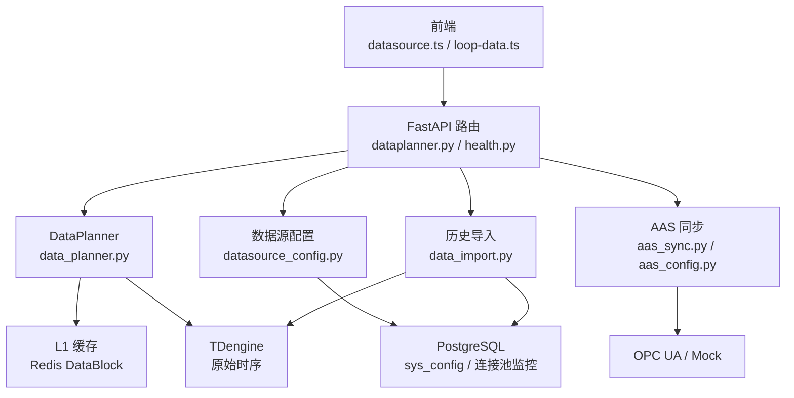
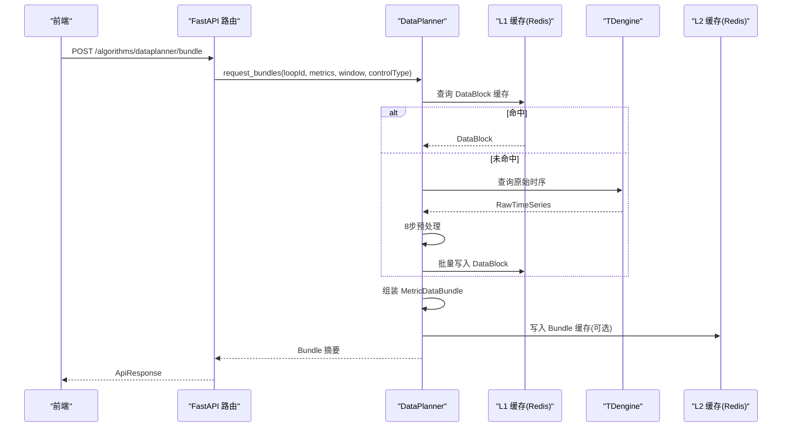
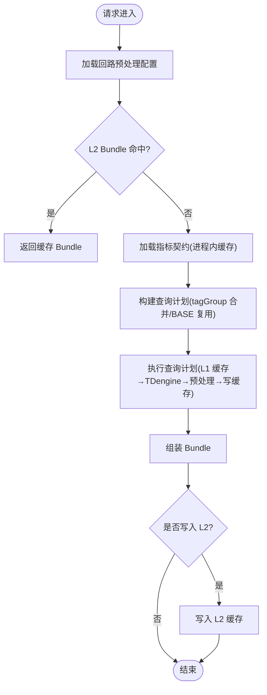
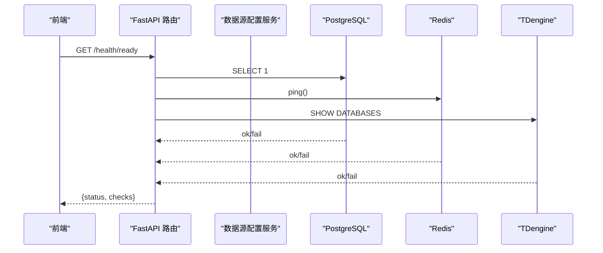
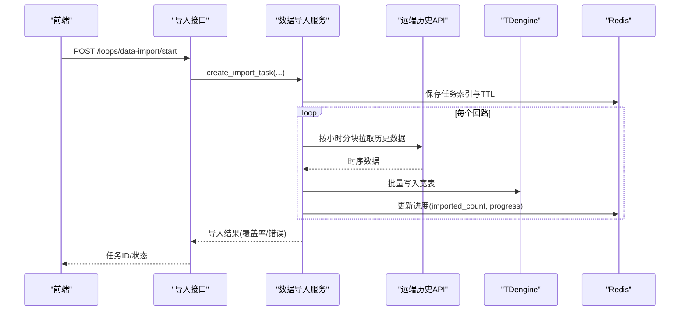
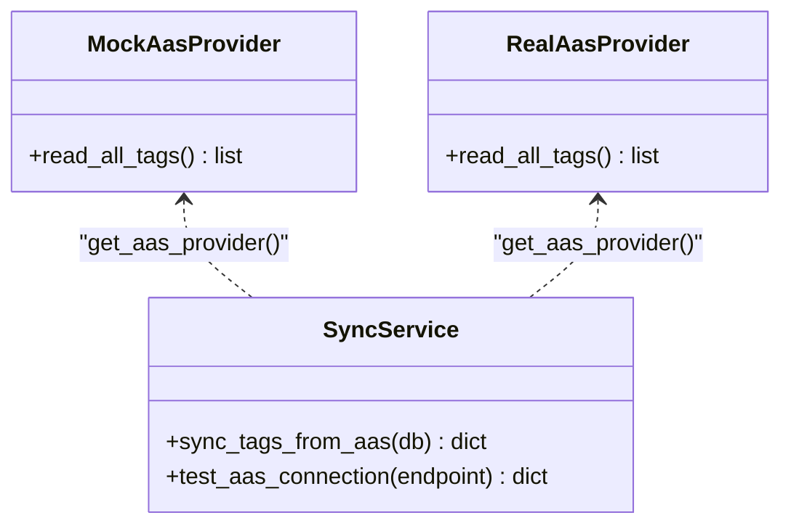
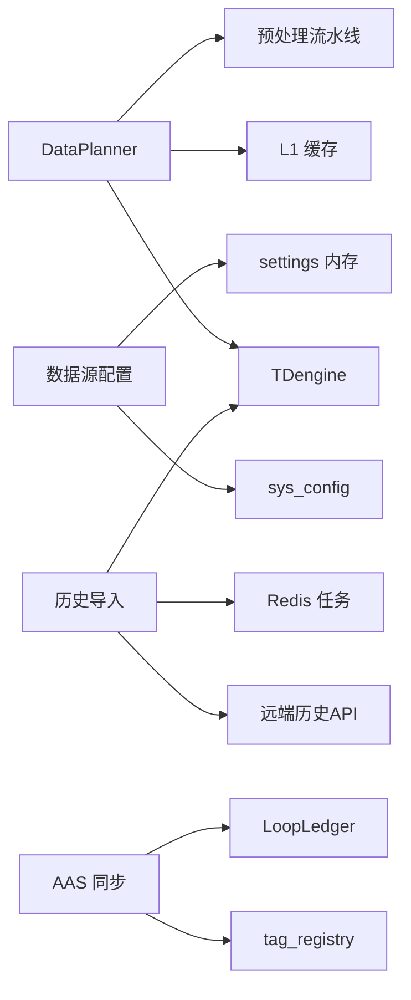

# 数据管理接口

<cite>
**本文引用的文件**
- [backend/app/services/data_planner.py](file://backend/app/services/data_planner.py)
- [backend/app/api/v1/endpoints/dataplanner.py](file://backend/app/api/v1/endpoints/dataplanner.py)
- [backend/app/services/datasource_config.py](file://backend/app/services/datasource_config.py)
- [backend/app/api/v1/endpoints/health.py](file://backend/app/api/v1/endpoints/health.py)
- [backend/app/services/aas_sync.py](file://backend/app/services/aas_sync.py)
- [backend/app/services/aas_config.py](file://backend/app/services/aas_config.py)
- [backend/app/services/data_import.py](file://backend/app/services/data_import.py)
- [frontend/apps/web-antd/src/api/datasource.ts](file://frontend/apps/web-antd/src/api/datasource.ts)
- [frontend/apps/web-antd/src/api/loop-data.ts](file://frontend/apps/web-antd/src/api/loop-data.ts)
</cite>

## 目录
1. [简介](#简介)
2. [项目结构](#项目结构)
3. [核心组件](#核心组件)
4. [架构总览](#架构总览)
5. [详细组件分析](#详细组件分析)
6. [依赖关系分析](#依赖关系分析)
7. [性能考虑](#性能考虑)
8. [故障排查指南](#故障排查指南)
9. [结论](#结论)
10. [附录](#附录)

## 简介
本文件为 CLPM-MVP 数据管理模块的 API 与实现文档，覆盖以下能力：
- 数据规划器接口：数据源配置、查询优化、缓存策略
- 数据源管理接口：数据库连接配置、连接池管理、健康检查
- 回路数据接口：时序数据查询、批量导入、数据清洗
- AAS 集成接口：远端数据采集、协议适配、数据同步
- 数据质量检查、异常处理、性能优化机制
- 数据迁移与备份恢复指南（基于现有脚本与部署脚本）

## 项目结构
数据管理相关代码主要位于后端 services 与 api 层，前端通过 TypeScript API 调用。关键路径：
- 数据规划器服务与接口：services/data_planner.py、api/v1/endpoints/dataplanner.py
- 数据源配置与健康：services/datasource_config.py、api/v1/endpoints/health.py
- AAS 集成：services/aas_sync.py、services/aas_config.py
- 历史数据导入：services/data_import.py
- 前端对接：datasource.ts、loop-data.ts

图表来源
- [backend/app/api/v1/endpoints/dataplanner.py:1-120](file://backend/app/api/v1/endpoints/dataplanner.py#L1-L120)
- [backend/app/services/data_planner.py:150-346](file://backend/app/services/data_planner.py#L150-L346)
- [backend/app/services/datasource_config.py:206-363](file://backend/app/services/datasource_config.py#L206-L363)
- [backend/app/api/v1/endpoints/health.py:26-76](file://backend/app/api/v1/endpoints/health.py#L26-L76)
- [backend/app/services/aas_sync.py:248-368](file://backend/app/services/aas_sync.py#L248-L368)
- [backend/app/services/data_import.py:1-120](file://backend/app/services/data_import.py#L1-L120)

章节来源
- [backend/app/api/v1/endpoints/dataplanner.py:1-120](file://backend/app/api/v1/endpoints/dataplanner.py#L1-L120)
- [backend/app/services/data_planner.py:150-346](file://backend/app/services/data_planner.py#L150-L346)
- [backend/app/services/datasource_config.py:206-363](file://backend/app/services/datasource_config.py#L206-L363)
- [backend/app/api/v1/endpoints/health.py:26-76](file://backend/app/api/v1/endpoints/health.py#L26-L76)
- [backend/app/services/aas_sync.py:248-368](file://backend/app/services/aas_sync.py#L248-L368)
- [backend/app/services/data_import.py:1-120](file://backend/app/services/data_import.py#L1-L120)

## 核心组件
- 数据规划器（DataPlanner）：指标驱动的数据获取与编排，合并查询计划、两级缓存（L1 DataBlock、L2 Bundle）、预处理流水线、Bundle 组装。
- 数据源配置：运行时读写 sys_config，支持网络模式切换、Token 打码、连通性测试、SignalR 状态。
- 健康检查：进程存活、就绪探针、PG 连接池监控。
- AAS 集成：OPC UA/Mock 读取 Tag，增量 upsert 到 tag_registry，更新同步状态。
- 历史数据导入：按小时分块拉取远端历史数据，写入 TDengine 宽表，任务进度与容错。

章节来源
- [backend/app/services/data_planner.py:150-346](file://backend/app/services/data_planner.py#L150-L346)
- [backend/app/services/datasource_config.py:206-363](file://backend/app/services/datasource_config.py#L206-L363)
- [backend/app/api/v1/endpoints/health.py:26-76](file://backend/app/api/v1/endpoints/health.py#L26-L76)
- [backend/app/services/aas_sync.py:248-368](file://backend/app/services/aas_sync.py#L248-L368)
- [backend/app/services/data_import.py:1-120](file://backend/app/services/data_import.py#L1-L120)

## 架构总览
数据流从前端请求进入 FastAPI 路由，路由根据功能分发至对应服务：
- 数据规划器：读取契约 → 构建查询计划 → 查 L1 缓存 → 未命中则查 TDengine + 预处理 → 写缓存 → 组装 Bundle → 可选写 L2 缓存。
- 数据源管理：读/写 sys_config，提供连通性测试与健康信息。
- AAS 集成：读取远端 Tag，upsert 本地注册表，更新同步状态。
- 历史导入：分块拉取远端历史数据，写入 TDengine，维护 Redis 任务进度。

图表来源
- [backend/app/api/v1/endpoints/dataplanner.py:232-311](file://backend/app/api/v1/endpoints/dataplanner.py#L232-L311)
- [backend/app/services/data_planner.py:208-346](file://backend/app/services/data_planner.py#L208-L346)
- [backend/app/services/data_planner.py:512-606](file://backend/app/services/data_planner.py#L512-L606)
- [backend/app/services/data_planner.py:608-674](file://backend/app/services/data_planner.py#L608-L674)

## 详细组件分析

### 数据规划器接口（数据源配置、查询优化、缓存策略）
- 数据源配置接入：通过 provider.make_query_fn(db) 将现有查询层适配为 DataPlanner 所需函数签名；L1/L2 缓存由 Redis 提供。
- 查询优化：
  - 指标契约进程内缓存（TTL 5 分钟），避免重复 DB 查询。
  - 按 tagGroup 合并查询计划，BASE 组复用派生 HF 组，减少 TDengine 查询次数。
  - 并行执行非复用 task（asyncio.gather）。
- 缓存策略：
  - L1 DataBlock 缓存：key 包含时间窗口、采样频率、质量策略、预处理版本、配置版本；空块不写负缓存。
  - L2 Bundle 缓存：key 包含 OP 限位与配置版本；命中直接返回 Bundle 列表，跳过查询与组装。
  - 缓存统计与失效：SCAN 统计键分布与命中率；支持按回路失效。

图表来源
- [backend/app/services/data_planner.py:208-346](file://backend/app/services/data_planner.py#L208-L346)
- [backend/app/services/data_planner.py:352-387](file://backend/app/services/data_planner.py#L352-L387)
- [backend/app/services/data_planner.py:393-495](file://backend/app/services/data_planner.py#L393-L495)
- [backend/app/services/data_planner.py:512-606](file://backend/app/services/data_planner.py#L512-L606)
- [backend/app/api/v1/endpoints/dataplanner.py:319-403](file://backend/app/api/v1/endpoints/dataplanner.py#L319-L403)

章节来源
- [backend/app/services/data_planner.py:150-346](file://backend/app/services/data_planner.py#L150-L346)
- [backend/app/services/data_planner.py:352-387](file://backend/app/services/data_planner.py#L352-L387)
- [backend/app/services/data_planner.py:393-495](file://backend/app/services/data_planner.py#L393-L495)
- [backend/app/services/data_planner.py:512-606](file://backend/app/services/data_planner.py#L512-L606)
- [backend/app/api/v1/endpoints/dataplanner.py:173-224](file://backend/app/api/v1/endpoints/dataplanner.py#L173-L224)
- [backend/app/api/v1/endpoints/dataplanner.py:232-311](file://backend/app/api/v1/endpoints/dataplanner.py#L232-L311)
- [backend/app/api/v1/endpoints/dataplanner.py:319-403](file://backend/app/api/v1/endpoints/dataplanner.py#L319-L403)

### 数据源管理接口（数据库连接配置、连接池管理、健康检查）
- 配置读写：get/update datasources config，字段即时生效或需重启生效；支持 Token 打码与安全回滚。
- 连通性测试：历史数据 API HTTP 连通性与 SignalR Hub WebSocket 握手测试。
- 健康检查：/health（liveness）、/health/ready（readiness 含 PG/Redis/TDengine）、/health/db-connections（PG 连接池监控）。

图表来源
- [backend/app/api/v1/endpoints/health.py:32-76](file://backend/app/api/v1/endpoints/health.py#L32-L76)
- [backend/app/services/datasource_config.py:206-363](file://backend/app/services/datasource_config.py#L206-L363)
- [backend/app/services/datasource_config.py:416-507](file://backend/app/services/datasource_config.py#L416-L507)

章节来源
- [backend/app/services/datasource_config.py:206-363](file://backend/app/services/datasource_config.py#L206-L363)
- [backend/app/services/datasource_config.py:416-507](file://backend/app/services/datasource_config.py#L416-L507)
- [backend/app/api/v1/endpoints/health.py:26-76](file://backend/app/api/v1/endpoints/health.py#L26-L76)
- [backend/app/api/v1/endpoints/health.py:79-138](file://backend/app/api/v1/endpoints/health.py#L79-L138)
- [frontend/apps/web-antd/src/api/datasource.ts:108-144](file://frontend/apps/web-antd/src/api/datasource.ts#L108-L144)

### 回路数据接口（时序数据查询、批量导入、数据清洗）
- 时序数据查询：通过 DataPlanner 的 plan/bundle 接口进行指标驱动的查询与摘要返回；内部使用 L1/L2 缓存与预处理流水线。
- 批量导入：
  - 创建导入任务、分块拉取远端历史数据、写入 TDengine 宽表。
  - 冲突策略：overwrite（先 DELETE 再 INSERT）或 skip（UPSERT）。
  - 动态分块：目标分块数与单次最大跨度限制，降低远端压力。
  - 重试与熔断：可重试状态码与网络异常，指数退避；共享 RemoteApiProvider 守卫。
  - 进度追踪：Redis Hash 存储任务状态与进度，CAS Lua 保证幂等与单调递增。
- 数据清洗：预处理流水线对原始数据进行清洗与有效性判断，生成 DataBlock 并附带质量摘要。

图表来源
- [backend/app/services/data_import.py:1-120](file://backend/app/services/data_import.py#L1-L120)
- [backend/app/services/data_import.py:602-635](file://backend/app/services/data_import.py#L602-L635)
- [frontend/apps/web-antd/src/api/loop-data.ts:115-150](file://frontend/apps/web-antd/src/api/loop-data.ts#L115-L150)

章节来源
- [backend/app/services/data_import.py:1-120](file://backend/app/services/data_import.py#L1-L120)
- [backend/app/services/data_import.py:602-635](file://backend/app/services/data_import.py#L602-L635)
- [frontend/apps/web-antd/src/api/loop-data.ts:115-150](file://frontend/apps/web-antd/src/api/loop-data.ts#L115-L150)

### AAS 集成接口（远端数据采集、协议适配、数据同步）
- 协议适配：MockAasProvider（开发环境）与 RealAasProvider（生产 OPC UA）统一 read_all_tags 接口。
- 数据同步：
  - 读取 AAS Tag，白名单校验非法 tag 名。
  - 与 tag_registry 对比，新增/更新/不变计数。
  - 成功后更新 LoopLedger 活跃回路的 last_aas_sync_at。
  - 更新同步状态（PROCESSING/SUCCESS/FAILED）与完成时间。
- 连接测试：test_aas_connection 支持 Mock 与真实 OPC UA 连通性验证。

图表来源
- [backend/app/services/aas_sync.py:43-124](file://backend/app/services/aas_sync.py#L43-L124)
- [backend/app/services/aas_sync.py:131-195](file://backend/app/services/aas_sync.py#L131-L195)
- [backend/app/services/aas_sync.py:248-368](file://backend/app/services/aas_sync.py#L248-L368)
- [backend/app/services/aas_sync.py:371-410](file://backend/app/services/aas_sync.py#L371-L410)

章节来源
- [backend/app/services/aas_sync.py:248-368](file://backend/app/services/aas_sync.py#L248-L368)
- [backend/app/services/aas_sync.py:371-410](file://backend/app/services/aas_sync.py#L371-L410)
- [backend/app/services/aas_config.py:117-203](file://backend/app/services/aas_config.py#L117-L203)

### 数据质量检查、异常处理、性能优化
- 数据质量：
  - DataBlock 质量摘要（valid_rate、连续段、异常原因码）。
  - 导入覆盖率反馈（imported vs expected points），低覆盖率告警。
- 异常处理：
  - 业务异常 BizError 统一错误码与消息。
  - AAS 同步失败设置 FAILED 状态并记录日志。
  - 导入任务 CAS 防止终态覆盖，进度单调递增。
- 性能优化：
  - 指标契约进程内缓存（5 分钟 TTL）。
  - tagGroup 合并与 BASE 复用，减少 TDengine 查询。
  - L1/L2 两级缓存，Pipeline 批量写入。
  - 预处理线程池释放事件循环。
  - 健康检查与连接池监控辅助定位瓶颈。

章节来源
- [backend/app/services/data_planner.py:352-387](file://backend/app/services/data_planner.py#L352-L387)
- [backend/app/services/data_planner.py:512-606](file://backend/app/services/data_planner.py#L512-L606)
- [backend/app/services/data_import.py:602-635](file://backend/app/services/data_import.py#L602-L635)
- [backend/app/services/aas_sync.py:248-368](file://backend/app/services/aas_sync.py#L248-L368)
- [backend/app/api/v1/endpoints/health.py:79-138](file://backend/app/api/v1/endpoints/health.py#L79-L138)

## 依赖关系分析
- DataPlanner 依赖：
  - L1DataBlockCache（Redis）用于 DataBlock 缓存。
  - MetricDataBundleAssembler 用于 Bundle 组装。
  - PreprocessingPipeline 用于数据清洗与有效性判断。
  - Provider 提供的 TDengine 查询函数。
- 数据源配置依赖：
  - sys_config 表持久化运行时配置。
  - settings 内存同步以即时生效。
  - Tailscale 网络模式切换（成功/失败回滚）。
- AAS 集成依赖：
  - asyncua（生产）或 Mock 提供 Tag 读取。
  - tag_registry 与 LoopLedger 更新。
- 历史导入依赖：
  - RemoteApiProvider 远端历史 API。
  - TDengine 宽表写入。
  - Redis 任务跟踪与进度。

图表来源
- [backend/app/services/data_planner.py:150-346](file://backend/app/services/data_planner.py#L150-L346)
- [backend/app/services/datasource_config.py:206-363](file://backend/app/services/datasource_config.py#L206-L363)
- [backend/app/services/aas_sync.py:248-368](file://backend/app/services/aas_sync.py#L248-L368)
- [backend/app/services/data_import.py:1-120](file://backend/app/services/data_import.py#L1-L120)

章节来源
- [backend/app/services/data_planner.py:150-346](file://backend/app/services/data_planner.py#L150-L346)
- [backend/app/services/datasource_config.py:206-363](file://backend/app/services/datasource_config.py#L206-L363)
- [backend/app/services/aas_sync.py:248-368](file://backend/app/services/aas_sync.py#L248-L368)
- [backend/app/services/data_import.py:1-120](file://backend/app/services/data_import.py#L1-L120)

## 性能考虑
- 查询合并与复用：BASE 组复用派生 HF 组，显著减少 TDengine 查询次数。
- 缓存命中：L1 DataBlock 与 L2 Bundle 两级缓存，减少回源与组装开销。
- 并发与异步：并行执行非复用 task，预处理在线程池执行，避免阻塞事件循环。
- 连接池监控：/health/db-connections 暴露 PG 连接利用率，辅助容量规划。
- 导入分块与重试：动态分块降低远端瞬时压力，指数退避提升鲁棒性。

[本节为通用指导，无需特定文件引用]

## 故障排查指南
- 健康检查：
  - /health 进程存活探针。
  - /health/ready 依赖就绪探针（PG/Redis/TDengine）。
  - /health/db-connections 查看 PG 连接池使用情况。
- 数据源连通性：
  - 历史数据 API 连通性测试（HTTP 与业务码校验）。
  - SignalR Hub 连通性测试（WebSocket 握手）。
- 数据规划器：
  - 缓存统计：查看 L1 缓存命中率、内存占用、键分布。
  - 缓存失效：按回路失效脏数据（量程/控制类型变更后）。
- AAS 同步：
  - 连接测试：Mock/真实 OPC UA 连通性。
  - 同步状态：PROCESSING/SUCCESS/FAILED 轮询。
- 历史导入：
  - 任务状态：创建、查询、取消、删除。
  - 覆盖率：低于阈值告警，定位缺口时段。

章节来源
- [backend/app/api/v1/endpoints/health.py:26-76](file://backend/app/api/v1/endpoints/health.py#L26-L76)
- [backend/app/api/v1/endpoints/health.py:79-138](file://backend/app/api/v1/endpoints/health.py#L79-L138)
- [backend/app/services/datasource_config.py:416-507](file://backend/app/services/datasource_config.py#L416-L507)
- [backend/app/api/v1/endpoints/dataplanner.py:319-403](file://backend/app/api/v1/endpoints/dataplanner.py#L319-L403)
- [backend/app/services/aas_sync.py:371-410](file://backend/app/services/aas_sync.py#L371-L410)
- [frontend/apps/web-antd/src/api/loop-data.ts:115-150](file://frontend/apps/web-antd/src/api/loop-data.ts#L115-L150)

## 结论
CLPM-MVP 数据管理模块通过指标驱动的数据规划器、两级缓存、预处理流水线与健壮的历史导入流程，实现了高效、可扩展的数据采集与处理能力。数据源配置与健康检查提供了运维可见性与稳定性保障，AAS 集成为标签与实时值同步提供了灵活适配。结合连接池监控与任务进度追踪，系统具备良好的可观测性与可维护性。

[本节为总结，无需特定文件引用]

## 附录
- 数据迁移与备份恢复指南：
  - 数据库迁移：使用 Alembic 版本化管理（alembic/versions/*），在部署前执行迁移脚本。
  - 备份恢复：参考 deploy/backup.sh 与 releases/DEPLOY-GUIDE.md 中的备份与回滚流程。
  - 部署脚本：deploy/build-and-deploy.sh、deploy/deploy.sh 用于构建与发布。

章节来源
- [backend/alembic/README](file://backend/alembic/README)
- [deploy/backup.sh](file://deploy/backup.sh)
- [releases/DEPLOY-GUIDE.md](file://releases/DEPLOY-GUIDE.md)