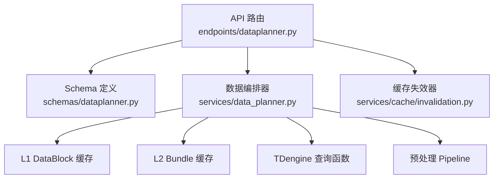
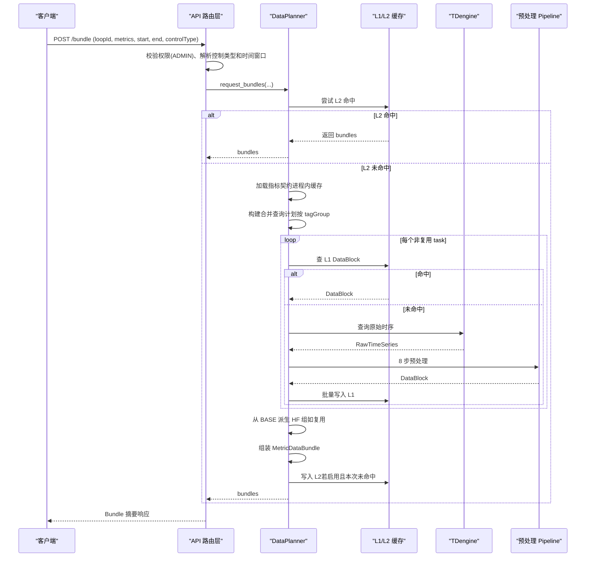
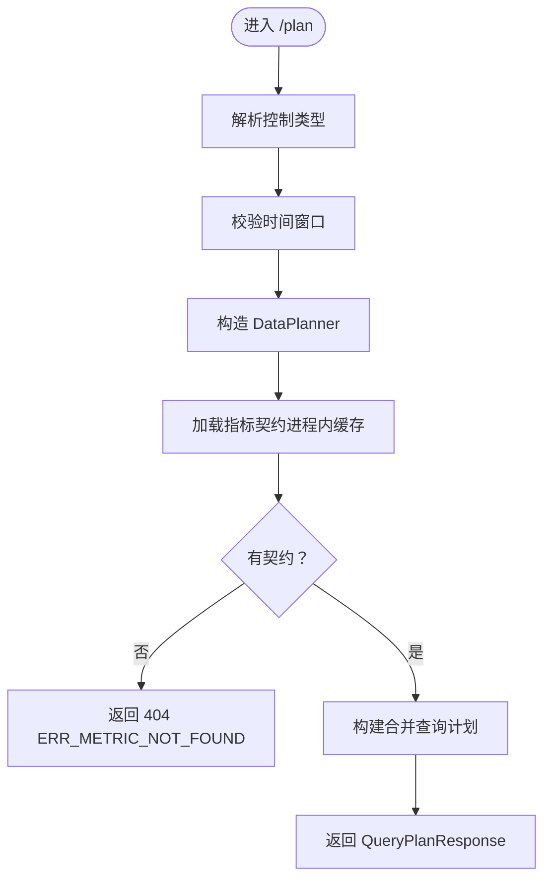
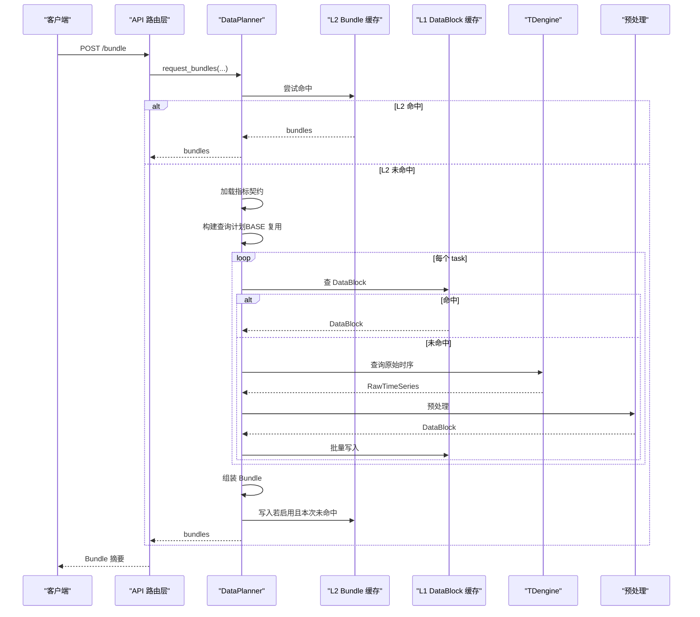
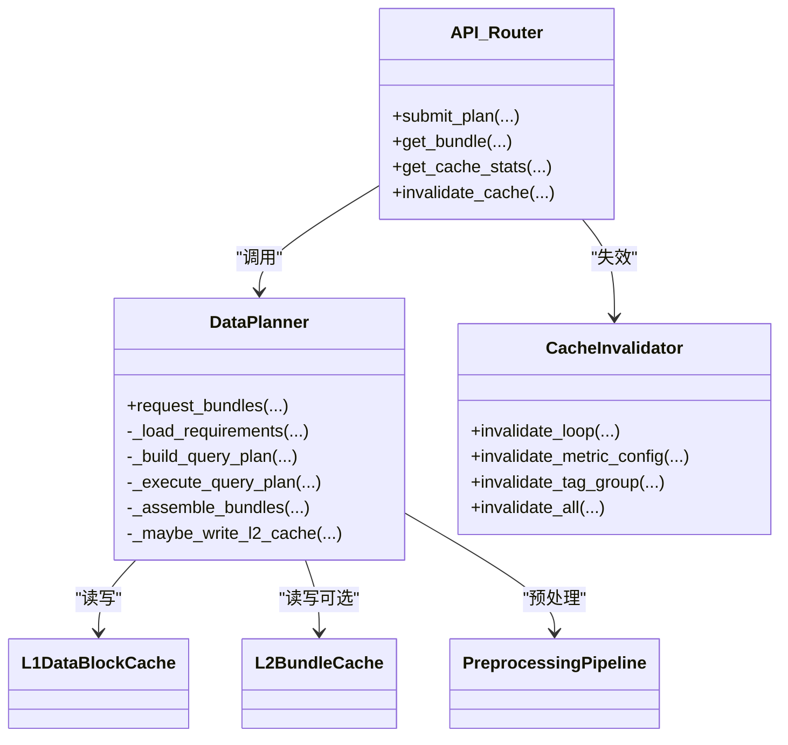

# 数据规划器接口

<cite>
**本文引用的文件**
- [backend/app/api/v1/endpoints/dataplanner.py](file://backend/app/api/v1/endpoints/dataplanner.py)
- [backend/app/schemas/dataplanner.py](file://backend/app/schemas/dataplanner.py)
- [backend/app/services/data_planner.py](file://backend/app/services/data_planner.py)
- [backend/app/services/cache/invalidation.py](file://backend/app/services/cache/invalidation.py)
- [backend/tests/test_api_dataplanner.py](file://backend/tests/test_api_dataplanner.py)
</cite>

## 目录
1. [简介](#简介)
2. [项目结构](#项目结构)
3. [核心组件](#核心组件)
4. [架构总览](#架构总览)
5. [详细组件分析](#详细组件分析)
6. [依赖关系分析](#依赖关系分析)
7. [性能考虑](#性能考虑)
8. [故障排查指南](#故障排查指南)
9. [结论](#结论)
10. [附录：请求与响应示例、调试方法](#附录请求与响应示例调试方法)

## 简介
本文件为 CLPM-MVP 数据规划器（DataPlanner）管理接口的完整技术文档，覆盖以下能力：
- 查询计划提交：POST /api/v1/algorithms/dataplanner/plan
- Bundle 摘要获取：POST /api/v1/algorithms/dataplanner/bundle
- 缓存统计：GET /api/v1/algorithms/dataplanner/cache/stats
- 缓存失效：DELETE /api/v1/algorithms/dataplanner/cache/{loopId}

这些接口仅对 ADMIN 角色开放，返回的是“摘要信息”，不包含完整时序数据。其核心目标是：根据指标数据需求契约构建合并查询计划，执行取数流程（查缓存→未命中查TDengine+预处理→写缓存→组装Bundle），并提供可观测的统计与失效能力。

## 项目结构
数据规划器相关代码主要分布在以下位置：
- API 路由与权限控制：backend/app/api/v1/endpoints/dataplanner.py
- 请求/响应 Schema：backend/app/schemas/dataplanner.py
- 数据编排核心逻辑：backend/app/services/data_planner.py
- 缓存失效策略：backend/app/services/cache/invalidation.py
- 接口行为测试用例：backend/tests/test_api_dataplanner.py

图表来源
- [backend/app/api/v1/endpoints/dataplanner.py:173-311](file://backend/app/api/v1/endpoints/dataplanner.py#L173-L311)
- [backend/app/services/data_planner.py:208-346](file://backend/app/services/data_planner.py#L208-L346)

章节来源
- [backend/app/api/v1/endpoints/dataplanner.py:1-407](file://backend/app/api/v1/endpoints/dataplanner.py#L1-L407)
- [backend/app/schemas/dataplanner.py:1-161](file://backend/app/schemas/dataplanner.py#L1-L161)
- [backend/app/services/data_planner.py:1-1004](file://backend/app/services/data_planner.py#L1-L1004)
- [backend/app/services/cache/invalidation.py:1-211](file://backend/app/services/cache/invalidation.py#L1-L211)
- [backend/tests/test_api_dataplanner.py:1-411](file://backend/tests/test_api_dataplanner.py#L1-L411)

## 核心组件
- DataPlanner：指标驱动的数据编排器，负责读取指标契约、合并查询计划、执行缓存/TDengine 取数、预处理、组装 Bundle，并写入 L1/L2 缓存。
- API 路由层：提供 plan、bundle、cache/stats、cache/{loopId} 四个端点，统一权限校验（ADMIN）、参数解析、错误处理与日志记录。
- 缓存失效器：基于 Redis SCAN + DEL 实现按回路、tagGroup、指标配置变更的精准或全量失效。
- Schema：定义 PlanRequest、QueryPlanResponse、BundleRequest、BundleResponse、CacheStatsResponse 等数据结构。

章节来源
- [backend/app/services/data_planner.py:150-346](file://backend/app/services/data_planner.py#L150-L346)
- [backend/app/api/v1/endpoints/dataplanner.py:173-403](file://backend/app/api/v1/endpoints/dataplanner.py#L173-L403)
- [backend/app/schemas/dataplanner.py:20-149](file://backend/app/schemas/dataplanner.py#L20-L149)
- [backend/app/services/cache/invalidation.py:34-144](file://backend/app/services/cache/invalidation.py#L34-L144)

## 架构总览
数据规划器的整体调用链如下：
- 客户端发起请求到 API 路由层
- 路由层进行权限校验（ADMIN）、参数解析（控制类型、时间窗口）
- 构造 DataPlanner 实例，调用 request_bundles 或内部方法构建查询计划
- DataPlanner 执行：
  - Phase 1：可选 L2 Bundle 缓存命中直接返回
  - Phase 2：加载指标数据需求契约（进程内缓存）
  - Phase 3：按 tagGroup 合并查询计划（BASE 复用优化）
  - Phase 4：查 L1 DataBlock 缓存
  - Phase 5：未命中则查询 TDengine
  - Phase 6：8 步预处理（线程池执行释放事件循环）
  - Phase 7：批量写入 L1 缓存（Pipeline）
  - Phase 8：组装 MetricDataBundle，并写入 L2 缓存（若启用且本次未命中）
- 路由层将 Bundle 摘要封装为响应返回

图表来源
- [backend/app/api/v1/endpoints/dataplanner.py:232-311](file://backend/app/api/v1/endpoints/dataplanner.py#L232-L311)
- [backend/app/services/data_planner.py:208-346](file://backend/app/services/data_planner.py#L208-L346)

## 详细组件分析

### 查询计划提交接口：POST /api/v1/algorithms/dataplanner/plan
- 功能：根据指标数据需求契约构建合并后的查询计划，不执行实际数据查询，仅返回计划摘要用于调试和验证。
- 权限：仅 ADMIN 角色可访问。
- 输入参数：
  - loopId：回路 ID
  - metrics：指标代码列表（如 accuracy_rate、stability_rate）
  - start、end：ISO 8601 时间字符串
  - controlType：控制类型（FC/PC/TC/LC/CC）
- 核心逻辑：
  - 解析控制类型为枚举，校验时间窗口格式与顺序
  - 构造 DataPlanner，读取指标数据需求契约（进程内缓存）
  - 构建合并查询计划（按 tagGroup 分组，支持 BASE 复用）
  - 返回 QueryPlanResponse，包含 queryTasks、totalTagGroups
- 错误处理：
  - 无效控制类型：返回 400，错误码 ERR_INVALID_CONTROL_TYPE
  - 无效时间：返回 400，错误码 ERR_INVALID_TIME
  - 未找到任何指标契约：返回 404，错误码 ERR_METRIC_NOT_FOUND
  - 未认证：返回 401；非 ADMIN：返回 403

图表来源
- [backend/app/api/v1/endpoints/dataplanner.py:173-224](file://backend/app/api/v1/endpoints/dataplanner.py#L173-L224)
- [backend/app/services/data_planner.py:352-495](file://backend/app/services/data_planner.py#L352-L495)

章节来源
- [backend/app/api/v1/endpoints/dataplanner.py:173-224](file://backend/app/api/v1/endpoints/dataplanner.py#L173-L224)
- [backend/app/schemas/dataplanner.py:20-69](file://backend/app/schemas/dataplanner.py#L20-L69)
- [backend/app/services/data_planner.py:352-495](file://backend/app/services/data_planner.py#L352-L495)
- [backend/tests/test_api_dataplanner.py:93-178](file://backend/tests/test_api_dataplanner.py#L93-L178)

### Bundle 摘要获取接口：POST /api/v1/algorithms/dataplanner/bundle
- 功能：执行查询计划的完整流程，返回 Bundle 摘要（不含完整时序数据）。
- 权限：仅 ADMIN 角色可访问。
- 输入参数：同 /plan。
- 核心流程：
  - 解析控制类型和时间窗口
  - 构造 DataPlanner 并调用 request_bundles
  - 内部执行：
    - Phase 1：L2 Bundle 缓存命中直接返回
    - Phase 2：加载指标契约
    - Phase 3：构建合并查询计划（BASE 复用）
    - Phase 4：查 L1 DataBlock 缓存
    - Phase 5：未命中查 TDengine
    - Phase 6：8 步预处理（线程池）
    - Phase 7：批量写入 L1 缓存
    - Phase 8：组装 MetricDataBundle，写入 L2 缓存（若启用且本次未命中）
  - 计算平均有效数据率与可信度等级（A/B/C/D/E）
  - 返回 BundleResponse（bundles、validRate、confidenceLevel）
- 错误处理：
  - DataPlanner 异常：捕获并返回 500，错误码 ERR_DATAPLANNER_FAILED
  - 空 Bundle：返回 validRate=0.0、confidenceLevel="E"

图表来源
- [backend/app/api/v1/endpoints/dataplanner.py:232-311](file://backend/app/api/v1/endpoints/dataplanner.py#L232-L311)
- [backend/app/services/data_planner.py:208-346](file://backend/app/services/data_planner.py#L208-L346)

章节来源
- [backend/app/api/v1/endpoints/dataplanner.py:232-311](file://backend/app/api/v1/endpoints/dataplanner.py#L232-L311)
- [backend/app/schemas/dataplanner.py:77-128](file://backend/app/schemas/dataplanner.py#L77-L128)
- [backend/app/services/data_planner.py:208-346](file://backend/app/services/data_planner.py#L208-L346)
- [backend/tests/test_api_dataplanner.py:185-270](file://backend/tests/test_api_dataplanner.py#L185-L270)

### 缓存统计接口：GET /api/v1/algorithms/dataplanner/cache/stats
- 功能：查看 L1 DataBlock 缓存命中率、内存占用、按 tagGroup 的键数分布。
- 权限：仅 ADMIN 角色可访问。
- 实现方式：
  - 使用 Redis SCAN 遍历 pdb:* Key，统计总数与按 tagGroup 分布
  - 通过 Redis INFO memory 获取内存占用（MB）
  - 通过 Redis INFO stats 计算命中率（keyspace_hits / (hits + misses)）
- 返回结构：
  - totalKeys：总键数
  - hitRate：命中率（0~1）
  - memoryUsageMb：内存占用（MB）
  - byTagGroup：按 tagGroup 分组的键数统计

章节来源
- [backend/app/api/v1/endpoints/dataplanner.py:319-379](file://backend/app/api/v1/endpoints/dataplanner.py#L319-L379)
- [backend/app/schemas/dataplanner.py:136-149](file://backend/app/schemas/dataplanner.py#L136-L149)
- [backend/tests/test_api_dataplanner.py:277-345](file://backend/tests/test_api_dataplanner.py#L277-L345)

### 缓存失效接口：DELETE /api/v1/algorithms/dataplanner/cache/{loopId}
- 功能：失效指定回路的所有 L1/L2/L3 缓存，用于回路配置变更后主动清除脏数据。
- 权限：仅 ADMIN 角色可访问。
- 实现方式：
  - 使用 CacheInvalidator.invalidate_loop(loop_id)
  - 通过 Redis SCAN + DEL 批量删除匹配模式 pdb*:{loopId}:* 的 Key
- 返回结构：
  - loopId：回路 ID
  - deletedKeys：删除的键数量

章节来源
- [backend/app/api/v1/endpoints/dataplanner.py:387-403](file://backend/app/api/v1/endpoints/dataplanner.py#L387-L403)
- [backend/app/services/cache/invalidation.py:52-78](file://backend/app/services/cache/invalidation.py#L52-L78)
- [backend/tests/test_api_dataplanner.py:353-410](file://backend/tests/test_api_dataplanner.py#L353-L410)

## 依赖关系分析
- API 路由层依赖：
  - 权限依赖：require_roles("ADMIN")
  - 数据库会话：get_db
  - Redis 客户端：redis_client
  - DataPlanner：_build_data_planner
  - 缓存失效器：CacheInvalidator
- DataPlanner 依赖：
  - L1DataBlockCache：L1 DataBlock 缓存
  - L2BundleCache：L2 Bundle 缓存（可选）
  - TDengine 查询函数：由数据源工厂提供
  - 预处理 Pipeline：8 步预处理
  - 指标契约表：clpm_metric_data_requirement（进程内缓存）
- 缓存失效器依赖：
  - Redis 客户端：scan、delete

图表来源
- [backend/app/services/data_planner.py:150-346](file://backend/app/services/data_planner.py#L150-L346)
- [backend/app/api/v1/endpoints/dataplanner.py:173-403](file://backend/app/api/v1/endpoints/dataplanner.py#L173-L403)
- [backend/app/services/cache/invalidation.py:34-144](file://backend/app/services/cache/invalidation.py#L34-L144)

章节来源
- [backend/app/services/data_planner.py:150-346](file://backend/app/services/data_planner.py#L150-L346)
- [backend/app/api/v1/endpoints/dataplanner.py:173-403](file://backend/app/api/v1/endpoints/dataplanner.py#L173-L403)
- [backend/app/services/cache/invalidation.py:34-144](file://backend/app/services/cache/invalidation.py#L34-L144)

## 性能考虑
- 指标契约进程内缓存：TTL 300s，避免重复查询数据库。
- tagGroup 复用：所有控制类型的 OP_HF/PVOP_HF/MODE_HF/QUALITY_HF 从 BASE DataBlock 派生，减少 TDengine 查询次数。
- 并行执行：非复用 task 通过 asyncio.gather 并发执行，释放事件循环。
- 预处理线程池：CPU 密集型预处理移至线程池，避免阻塞异步事件循环。
- 批量写入：L1 缓存使用 Pipeline 批量写入，减少网络往返。
- 空 DataBlock 负缓存：空结果不写入 L1，避免 backfill 场景下旧空块命中。
- L2 Bundle 缓存：可选启用，命中后跳过查询与组装，显著降低延迟。
- 缓存统计：使用 Redis SCAN 分页扫描，避免 KEYS 命令阻塞主线程。

[本节为通用性能讨论，无需特定文件引用]

## 故障排查指南
- 权限问题：
  - 未认证：返回 401
  - 非 ADMIN：返回 403
- 参数校验失败：
  - 无效控制类型：ERR_INVALID_CONTROL_TYPE（400）
  - 无效时间或起始时间不早于结束时间：ERR_INVALID_TIME（400）
- 数据契约缺失：
  - 未找到任何指标契约：ERR_METRIC_NOT_FOUND（404）
- 数据获取失败：
  - DataPlanner 异常：ERR_DATAPLANNER_FAILED（500）
- 缓存相关问题：
  - 缓存统计为空：检查 Redis 连接与 INFO 命令可用性
  - 缓存失效无效：确认 loopId 正确，Redis 模式匹配 pdb*:{loopId}:*

章节来源
- [backend/tests/test_api_dataplanner.py:120-178](file://backend/tests/test_api_dataplanner.py#L120-L178)
- [backend/tests/test_api_dataplanner.py:240-270](file://backend/tests/test_api_dataplanner.py#L240-L270)
- [backend/tests/test_api_dataplanner.py:277-345](file://backend/tests/test_api_dataplanner.py#L277-L345)
- [backend/tests/test_api_dataplanner.py:353-410](file://backend/tests/test_api_dataplanner.py#L353-L410)

## 结论
数据规划器接口提供了完整的指标驱动数据获取能力，通过契约化指标需求、合并查询计划、多级缓存与预处理流水线，实现了高性能、可扩展的数据服务。接口设计遵循最小暴露原则（仅返回摘要），并通过严格的权限控制与错误处理保障系统稳定性。缓存统计与失效机制为运维提供了必要的可观测性与可控性。

[本节为总结性内容，无需特定文件引用]

## 附录：请求与响应示例、调试方法

### 查询计划提交：POST /api/v1/algorithms/dataplanner/plan
- 请求体字段：
  - loopId：字符串
  - metrics：字符串数组
  - start：ISO 8601 时间字符串
  - end：ISO 8601 时间字符串
  - controlType：FC/PC/TC/LC/CC
- 成功响应：
  - code：0
  - data：
    - loopId：字符串
    - queryTasks：数组，每项包含 tagGroup、metrics、tagRoles、intervalS、reusedFrom
    - totalTagGroups：整数
- 失败响应：
  - 400：ERR_INVALID_CONTROL_TYPE 或 ERR_INVALID_TIME
  - 404：ERR_METRIC_NOT_FOUND
  - 401：未认证
  - 403：非 ADMIN

章节来源
- [backend/app/schemas/dataplanner.py:38-69](file://backend/app/schemas/dataplanner.py#L38-L69)
- [backend/tests/test_api_dataplanner.py:93-178](file://backend/tests/test_api_dataplanner.py#L93-L178)

### Bundle 摘要获取：POST /api/v1/algorithms/dataplanner/bundle
- 请求体字段：同 /plan
- 成功响应：
  - code：0
  - data：
    - loopId：字符串
    - bundles：数组，每项包含 metricCode、tagGroup、samplingFreq、pointCount、validRate、dataBlockId
    - validRate：浮点数（0~1）
    - confidenceLevel：A/B/C/D/E
- 失败响应：
  - 500：ERR_DATAPLANNER_FAILED
  - 401/403：权限问题

章节来源
- [backend/app/schemas/dataplanner.py:77-128](file://backend/app/schemas/dataplanner.py#L77-L128)
- [backend/tests/test_api_dataplanner.py:185-270](file://backend/tests/test_api_dataplanner.py#L185-L270)

### 缓存统计：GET /api/v1/algorithms/dataplanner/cache/stats
- 成功响应：
  - code：0
  - data：
    - totalKeys：整数
    - hitRate：浮点数（0~1）
    - memoryUsageMb：浮点数（MB）
    - byTagGroup：对象，键为 tagGroup，值为键数
- 失败响应：
  - 401/403：权限问题

章节来源
- [backend/app/schemas/dataplanner.py:136-149](file://backend/app/schemas/dataplanner.py#L136-L149)
- [backend/tests/test_api_dataplanner.py:277-345](file://backend/tests/test_api_dataplanner.py#L277-L345)

### 缓存失效：DELETE /api/v1/algorithms/dataplanner/cache/{loopId}
- 路径参数：loopId
- 成功响应：
  - code：0
  - data：
    - loopId：字符串
    - deletedKeys：整数
- 失败响应：
  - 401/403：权限问题

章节来源
- [backend/tests/test_api_dataplanner.py:353-410](file://backend/tests/test_api_dataplanner.py#L353-L410)

### 调试使用方法
- 使用 curl 或 Postman 发送请求，确保携带有效的 Bearer Token（ADMIN 角色）
- 先调用 /plan 验证查询计划是否正确构建
- 再调用 /bundle 获取 Bundle 摘要，检查 validRate 与 confidenceLevel
- 使用 /cache/stats 观察缓存命中率与内存占用
- 在回路配置变更后，调用 /cache/{loopId} 失效缓存，确保后续请求使用最新数据

[本节为操作指导，无需特定文件引用]