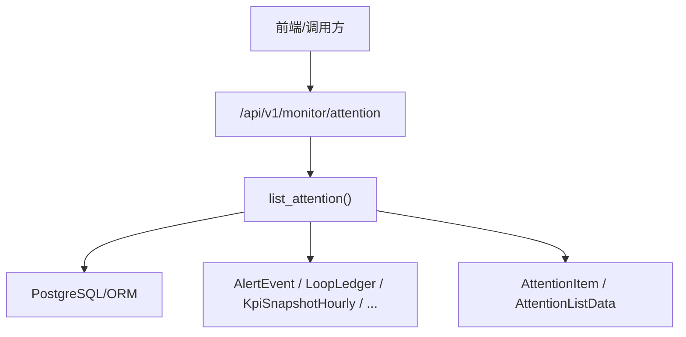
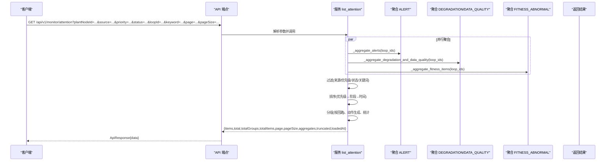
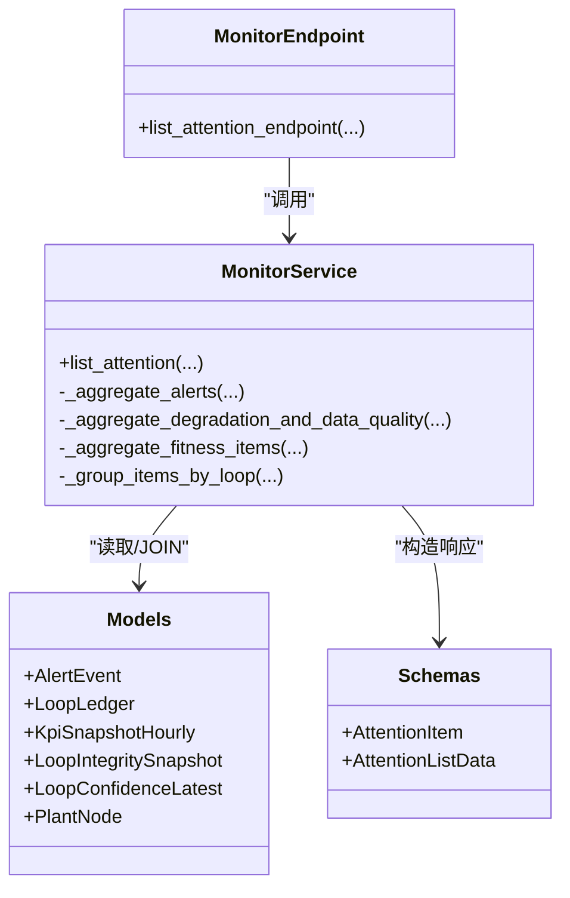

# 关注队列接口

<cite>
**本文引用的文件**
- [backend/app/api/v1/endpoints/monitor.py](file://backend/app/api/v1/endpoints/monitor.py)
- [backend/app/services/monitor_attention.py](file://backend/app/services/monitor_attention.py)
- [backend/app/schemas/monitor.py](file://backend/app/schemas/monitor.py)
- [backend/tests/test_monitor_attention.py](file://backend/tests/test_monitor_attention.py)
</cite>

## 目录
1. [简介](#简介)
2. [项目结构](#项目结构)
3. [核心组件](#核心组件)
4. [架构总览](#架构总览)
5. [详细组件分析](#详细组件分析)
6. [依赖关系分析](#依赖关系分析)
7. [性能与分页](#性能与分页)
8. [错误处理指南](#错误处理指南)
9. [结论](#结论)
10. [附录：API 契约与示例](#附录api-契约与示例)

## 简介
本文件为 CLPM-MVP 监控管理模块的“统一关注队列”查询接口提供完整 API 文档。该接口聚合多来源（ALERT、DEGRADATION、DATA_QUALITY、FITNESS_ABNORMAL）的关注项，支持按装置/单元、来源类型、优先级、状态进行筛选，支持回路精确筛选和关键词模糊查询；返回分组后的关注项列表，并提供分页、排序与聚合统计。

## 项目结构
关注队列功能由三层组成：
- API 层：FastAPI 路由定义请求参数与响应包装
- 服务层：聚合多来源数据、过滤、排序、分组、分页与统计
- 模型/Schemas：定义关注项的数据结构与枚举约束

图表来源
- [backend/app/api/v1/endpoints/monitor.py:43-80](file://backend/app/api/v1/endpoints/monitor.py#L43-L80)
- [backend/app/services/monitor_attention.py:952-1130](file://backend/app/services/monitor_attention.py#L952-L1130)
- [backend/app/schemas/monitor.py:67-110](file://backend/app/schemas/monitor.py#L67-L110)

章节来源
- [backend/app/api/v1/endpoints/monitor.py:1-98](file://backend/app/api/v1/endpoints/monitor.py#L1-L98)
- [backend/app/services/monitor_attention.py:1-1202](file://backend/app/services/monitor_attention.py#L1-L1202)
- [backend/app/schemas/monitor.py:1-110](file://backend/app/schemas/monitor.py#L1-L110)

## 核心组件
- 路由端点：GET /api/v1/monitor/attention
- 服务函数：list_attention(db, plant_node_id, sources, priorities, statuses, loop_id, keyword, page, page_size, role)
- 数据模型：AttentionItem、AttentionListData
- 聚合逻辑：按来源并行聚合、合并、排序、分组、分页、统计

章节来源
- [backend/app/api/v1/endpoints/monitor.py:43-80](file://backend/app/api/v1/endpoints/monitor.py#L43-L80)
- [backend/app/services/monitor_attention.py:952-1130](file://backend/app/services/monitor_attention.py#L952-L1130)
- [backend/app/schemas/monitor.py:67-110](file://backend/app/schemas/monitor.py#L67-L110)

## 架构总览
统一关注队列通过并行聚合多个数据源，再在内存中进行过滤、排序、分组与分页，最终返回结构化结果。

图表来源
- [backend/app/api/v1/endpoints/monitor.py:43-80](file://backend/app/api/v1/endpoints/monitor.py#L43-L80)
- [backend/app/services/monitor_attention.py:1032-1130](file://backend/app/services/monitor_attention.py#L1032-L1130)

## 详细组件分析

### 统一关注队列查询接口
- 路径：GET /api/v1/monitor/attention
- 认证：需要当前用户上下文（角色用于动作生成）
- 查询参数：
  - plantNodeId: 字符串，可选。按装置/单元筛选（递归包含子节点）
  - source: 数组，可选。来源类型筛选：ALERT、DEGRADATION、DATA_QUALITY、FITNESS_ABNORMAL
  - priority: 数组，可选。优先级筛选：URGENT、HIGH、MEDIUM、LOW
  - status: 数组，可选。状态筛选：OPEN、ACKNOWLEDGED、SUPPRESSED、IN_PROGRESS、VERIFYING
  - loopId: 字符串，可选。按回路精确筛选
  - keyword: 字符串，可选。按位号/标题/摘要模糊查询（不区分大小写）
  - page: 整数，默认 1，最小 1
  - pageSize: 整数，默认 20，范围 1–100
- 返回：ApiResponse{data}，data 为 AttentionListData

章节来源
- [backend/app/api/v1/endpoints/monitor.py:43-80](file://backend/app/api/v1/endpoints/monitor.py#L43-L80)

### 关注项数据结构
- attentionId: 字符串，格式 ${source}:${sourceId}
- source: 枚举，来源类型
- sourceId: 字符串，来源原始主键
- loopId: 字符串，回路 ID
- tagName: 字符串，位号
- unitName: 字符串或空，显示名称“装置·单元”
- title: 字符串，一句话摘要
- summary: 字符串，详细摘要
- priority: 枚举，优先级
- sourceSeverity: 字符串或空，来源原始严重等级（如 INFO/WARN/ERROR/CRITICAL）
- status: 枚举，状态
- sourceStatus: 字符串，来源原始状态（便于审计解释）
- rankReasons: 字符串数组，排序原因（至少一条）
- occurredAt: ISO8601 时间
- updatedAt: ISO8601 时间或空
- confidenceLevel: 枚举，可信度等级 A/B/C/D/E
- score: 浮点数或空，评分
- scoreDelta: 浮点数或空，评分变化量
- eventId: 字符串或空，事件 ID
- trackerId: 字符串或空，工单 ID
- taskId: 字符串或空，任务 ID
- primaryAction: 对象，主动作（服务端按角色与来源生成）
- actions: 对象数组，可用动作列表

章节来源
- [backend/app/schemas/monitor.py:67-97](file://backend/app/schemas/monitor.py#L67-L97)
- [backend/app/services/monitor_attention.py:1172-1202](file://backend/app/services/monitor_attention.py#L1172-L1202)

### 分页与排序
- 分页：按“组”分页（每个组代表一个回路的问题集合），total 表示组总数，items 为当前页的组列表
- 排序：
  - 组内项排序：优先级 → 同级阶段（未确认→超期→处理中/验证中→已确认→已抑制）→ 时间倒序
  - 组排序：取组首项排序键
- 截断标志：truncated 指示各来源是否达到内部上限（例如 ALERT/FITNESS_ABNORMAL 单来源最多 500 条），提示需细化筛选条件

章节来源
- [backend/app/services/monitor_attention.py:148-199](file://backend/app/services/monitor_attention.py#L148-L199)
- [backend/app/services/monitor_attention.py:1084-1130](file://backend/app/services/monitor_attention.py#L1084-L1130)

### 聚合逻辑与多来源合并机制
- 数据来源：
  - ALERT：ACTIVE/ACKNOWLEDGED/SUPPRESSED 预警事件
  - DEGRADATION：dayTrend=WORSENED 且 scoreDelta<=-2
  - DATA_QUALITY：完整性 WARNING/CRITICAL 或 可信度 D/E
  - FITNESS_ABNORMAL：适用性异常 L0/L1/L2（每回路最新快照）
- 并行聚合：ALERT 与 (DEGRADATION+DATA_QUALITY) 两大分支并行；DEGRADATION/DATA_QUALITY 内部使用 asyncio.gather 并行 4 次指标查询
- 合并规则：
  - 同回路合并为一组（group），组优先级取最高，组状态/摘要/主动作来自组首项，时间为组内最新
  - 来源 chips 并列，rankReasons 合并去重
  - 动作按角色与来源状态生成（如 Sponsor 无 OPEN_WORKBENCH）
- 统计：
  - bySource/byPriority/byStatus：按项口径计数
  - byGroupPriority/groupCount：按组口径计数
  - openCount/urgentCount/verificationOverdue/dataQualityCount：额外统计

章节来源
- [backend/app/services/monitor_attention.py:381-812](file://backend/app/services/monitor_attention.py#L381-L812)
- [backend/app/services/monitor_attention.py:819-945](file://backend/app/services/monitor_attention.py#L819-L945)
- [backend/app/services/monitor_attention.py:1090-1130](file://backend/app/services/monitor_attention.py#L1090-L1130)

### 筛选与模糊查询
- 装置/单元筛选：通过 plantNodeId 递归查找所有子孙节点对应的回路 IDs
- 回路精确筛选：loopId 直接校验存在性并限定范围
- 来源/优先级/状态：内存过滤（先并行聚合后过滤）
- 关键词模糊：对 tagName/title/summary 进行不区分大小写的包含匹配

章节来源
- [backend/app/services/monitor_attention.py:977-1083](file://backend/app/services/monitor_attention.py#L977-L1083)

### 动作生成与权限
- 根据角色（ADMIN/IC_ENGINEER/PE_ENGINEER/EXPERT/SPONSOR）与来源状态生成 primaryAction 与 actions
- 非 Sponsor 角色默认可进入工作台；Sponsor 仅查看详情与返回概览
- ALERT 来源支持确认、处置、标记误报、查看预警记录等动作（受角色权限控制）

章节来源
- [backend/app/services/monitor_attention.py:247-379](file://backend/app/services/monitor_attention.py#L247-L379)
- [backend/tests/test_monitor_attention.py:337-379](file://backend/tests/test_monitor_attention.py#L337-L379)

## 依赖关系分析

图表来源
- [backend/app/api/v1/endpoints/monitor.py:43-80](file://backend/app/api/v1/endpoints/monitor.py#L43-L80)
- [backend/app/services/monitor_attention.py:952-1130](file://backend/app/services/monitor_attention.py#L952-L1130)
- [backend/app/schemas/monitor.py:67-110](file://backend/app/schemas/monitor.py#L67-L110)

章节来源
- [backend/app/api/v1/endpoints/monitor.py:1-98](file://backend/app/api/v1/endpoints/monitor.py#L1-L98)
- [backend/app/services/monitor_attention.py:1-1202](file://backend/app/services/monitor_attention.py#L1-L1202)
- [backend/app/schemas/monitor.py:1-110](file://backend/app/schemas/monitor.py#L1-L110)

## 性能与分页
- 并行化：ALERT 与 (DEGRADATION+DATA_QUALITY) 并行；DEGRADATION/DATA_QUALITY 内部 4 次指标查询并行
- 名称预加载：JOIN PlantNode 直接带出装置/单元名称，避免额外 name_map 查询
- 单来源上限：ALERT/FITNESS_ABNORMAL 单来源最多 500 条，超出部分通过 truncated 提示细化筛选
- 分页粒度：按“组”分页，减少前端渲染压力；建议 pageSize 10–50
- 缓存优化：分组时缓存动作生成结果，避免重复计算

章节来源
- [backend/app/services/monitor_attention.py:652-697](file://backend/app/services/monitor_attention.py#L652-L697)
- [backend/app/services/monitor_attention.py:386-429](file://backend/app/services/monitor_attention.py#L386-L429)
- [backend/app/services/monitor_attention.py:835-855](file://backend/app/services/monitor_attention.py#L835-L855)

## 错误处理指南
- 非法枚举值：source/priority/status 中的非法值会被静默忽略，不会返回 400
- 无匹配数据：当 plantNodeId 或 loopId 无匹配回路时，返回空结果集（total=0）
- 部分不可用：工作台摘要接口支持 partial=true，但关注队列接口本身失败会返回标准错误（由框架处理）
- 超时/数据库异常：由 FastAPI/SQLAlchemy 抛出，建议前端重试与降级展示

章节来源
- [backend/app/api/v1/endpoints/monitor.py:63-66](file://backend/app/api/v1/endpoints/monitor.py#L63-L66)
- [backend/app/services/monitor_attention.py:1018-1030](file://backend/app/services/monitor_attention.py#L1018-L1030)

## 结论
统一关注队列接口通过并行聚合与智能分组，将多来源关注项整合为以回路为核心的问题视图，并提供灵活的筛选、排序与分页能力。结合角色驱动的动作生成，既满足运维效率又保障权限安全。建议在大数据量场景下配合 plantNodeId/loopId/source/priority/status 等筛选条件，以获得最佳性能与体验。

## 附录：API 契约与示例

### 请求参数说明
- plantNodeId: 字符串，可选。装置/单元 ID（递归包含子节点）
- source: 数组，可选。ALERT、DEGRADATION、DATA_QUALITY、FITNESS_ABNORMAL
- priority: 数组，可选。URGENT、HIGH、MEDIUM、LOW
- status: 数组，可选。OPEN、ACKNOWLEDGED、SUPPRESSED、IN_PROGRESS、VERIFYING
- loopId: 字符串，可选。回路精确筛选
- keyword: 字符串，可选。位号/标题/摘要模糊查询
- page: 整数，默认 1
- pageSize: 整数，默认 20，范围 1–100

章节来源
- [backend/app/api/v1/endpoints/monitor.py:43-59](file://backend/app/api/v1/endpoints/monitor.py#L43-L59)

### 响应字段说明
- items: 数组，当前页的组列表（每个组代表一个回路的问题集合）
- total: 整数，组总数
- totalGroups: 整数，组总数（与 total 一致）
- totalItems: 整数，项总数（分组前）
- page: 整数，当前页
- pageSize: 整数，每页组数
- aggregates: 对象，聚合统计（bySource/byPriority/byStatus/byGroupPriority/groupCount/openCount/urgentCount/verificationOverdue/dataQualityCount）
- truncated: 对象，各来源是否达到上限（如 ALERT/FITNESS_ABNORMAL）
- loadedAt: ISO8601 时间戳

章节来源
- [backend/app/services/monitor_attention.py:1120-1130](file://backend/app/services/monitor_attention.py#L1120-L1130)
- [backend/app/schemas/monitor.py:99-110](file://backend/app/schemas/monitor.py#L99-L110)

### 请求示例
- 基础查询：GET /api/v1/monitor/attention?page=1&pageSize=20
- 按装置/单元筛选：GET /api/v1/monitor/attention?plantNodeId=unit-001
- 按来源与优先级筛选：GET /api/v1/monitor/attention?source=ALERT&priority=URGENT
- 按状态筛选：GET /api/v1/monitor/attention?status=OPEN
- 回路精确筛选：GET /api/v1/monitor/attention?loopId=loop-001
- 关键词模糊查询：GET /api/v1/monitor/attention?keyword=LIC-101

章节来源
- [backend/app/api/v1/endpoints/monitor.py:43-80](file://backend/app/api/v1/endpoints/monitor.py#L43-L80)

### 响应示例（简化）
- items: [
    {
      groupId: "group:loop-001",
      loopId: "loop-001",
      tagName: "LIC-101",
      unitName: "某装置·某单元",
      priority: "URGENT",
      priorityLabel: "紧急",
      status: "OPEN",
      sources: ["ALERT"],
      sourceLabels: ["活跃预警"],
      summary: "预警 R001 · 等 1 项",
      title: "预警 R001",
      updatedAt: "2026-01-01T12:00:00Z",
      isOverdue: false,
      itemCount: 1,
      rankReasons: ["严重预警未确认"],
      primaryAction: {type: "OPEN_WORKBENCH", label: "进入工作台", enabled: true, target: {...}},
      actions: [...],
      children: [...]
    }
  ]
- total: 1
- totalGroups: 1
- totalItems: 1
- page: 1
- pageSize: 20
- aggregates: {bySource: {"ALERT":1}, byPriority: {"URGENT":1}, byStatus: {"OPEN":1}, byGroupPriority: {"URGENT":1}, groupCount: 1, openCount: 1, urgentCount: 1, verificationOverdue: 0, dataQualityCount: 0}
- truncated: {}
- loadedAt: "2026-01-01T12:00:00Z"

章节来源
- [backend/app/services/monitor_attention.py:1120-1130](file://backend/app/services/monitor_attention.py#L1120-L1130)
- [backend/app/schemas/monitor.py:67-110](file://backend/app/schemas/monitor.py#L67-L110)

### 错误处理与边界情况
- 非法枚举值被忽略，不影响其他有效筛选
- 无匹配回路时返回空结果集
- 大结果集时通过 truncated 提示细化筛选条件
- 角色限制影响动作可用性（如 Sponsor 无 OPEN_WORKBENCH）

章节来源
- [backend/app/api/v1/endpoints/monitor.py:63-66](file://backend/app/api/v1/endpoints/monitor.py#L63-L66)
- [backend/app/services/monitor_attention.py:1018-1030](file://backend/app/services/monitor_attention.py#L1018-L1030)
- [backend/tests/test_monitor_attention.py:337-379](file://backend/tests/test_monitor_attention.py#L337-L379)