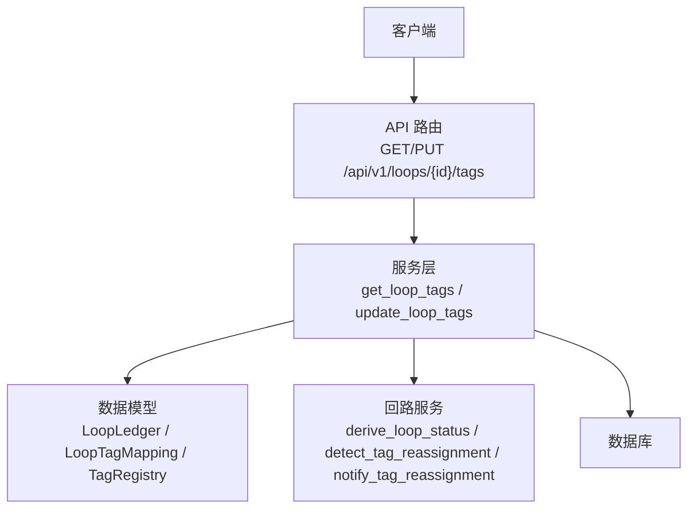
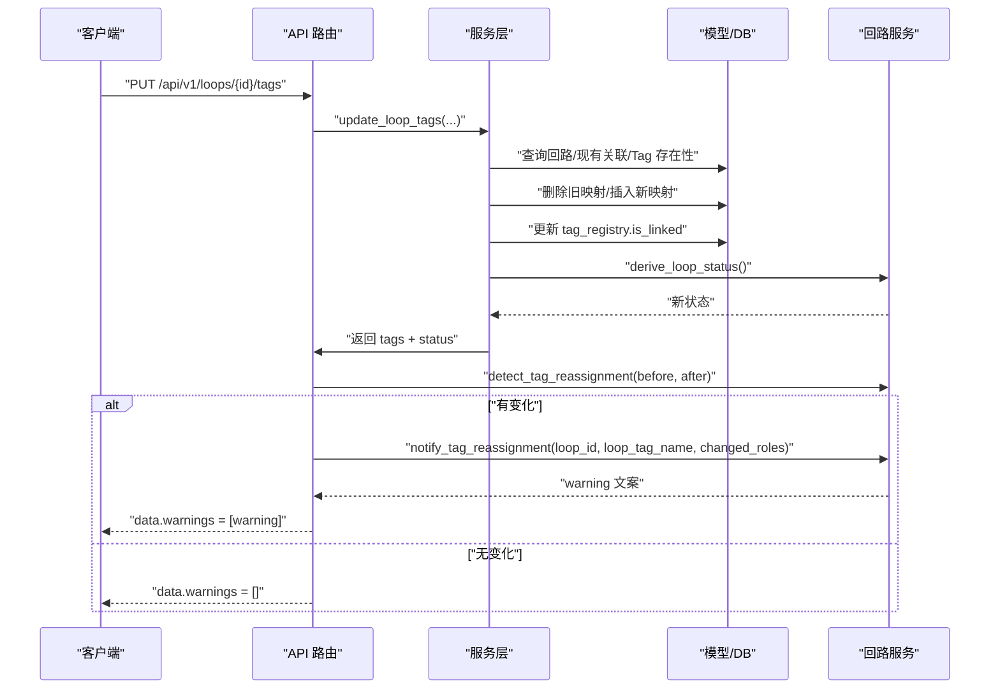
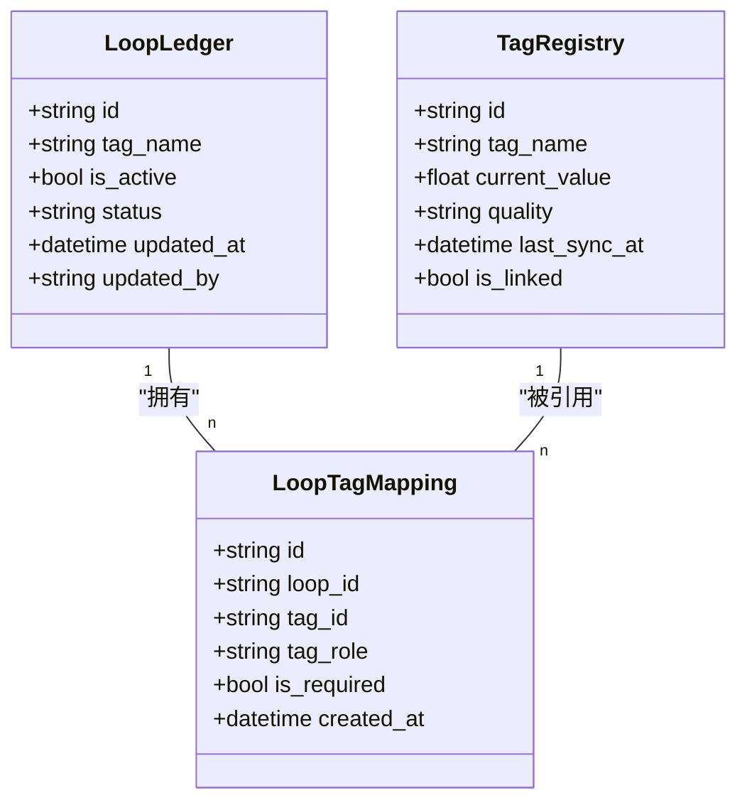
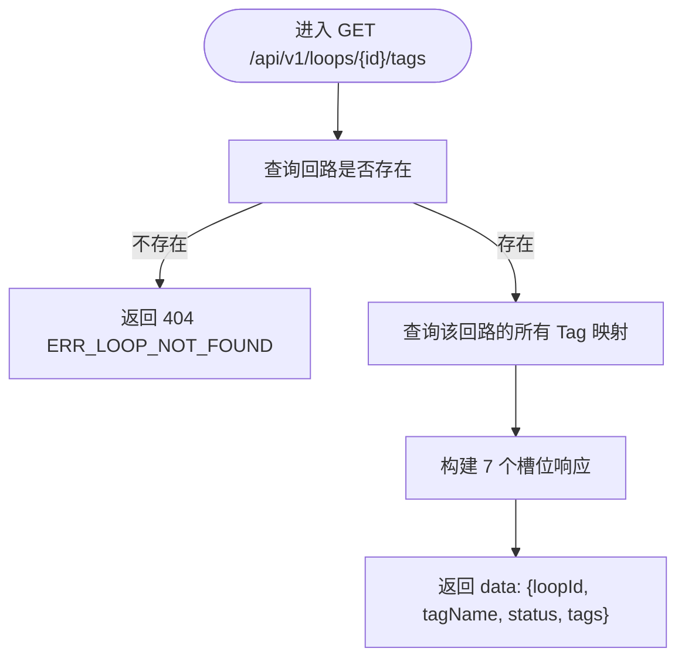
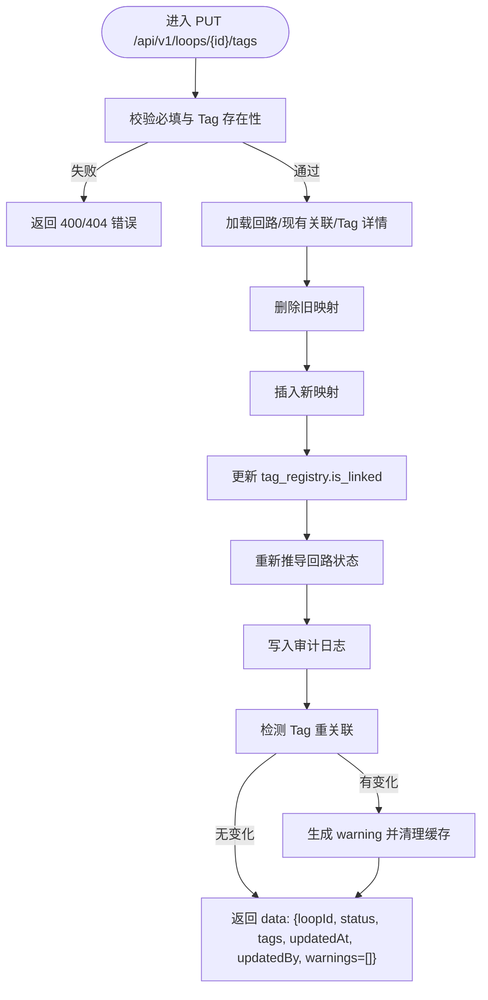
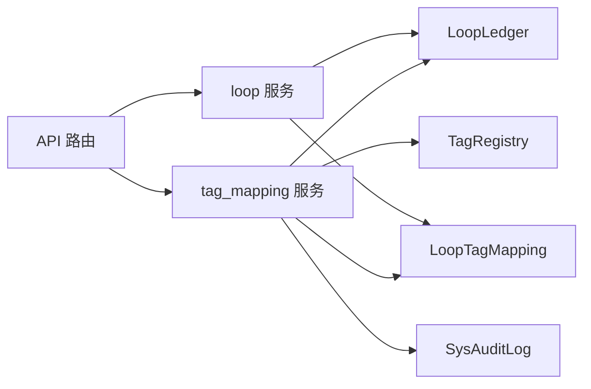

# Tag关联管理

<cite>
**本文引用的文件**
- [backend/app/api/v1/endpoints/loops.py](file://backend/app/api/v1/endpoints/loops.py)
- [backend/app/services/tag_mapping.py](file://backend/app/services/tag_mapping.py)
- [backend/app/schemas/loop.py](file://backend/app/schemas/loop.py)
- [backend/app/models/loop.py](file://backend/app/models/loop.py)
- [backend/app/services/loop.py](file://backend/app/services/loop.py)
- [backend/tests/test_tag_mapping.py](file://backend/tests/test_tag_mapping.py)
</cite>

## 目录
1. [简介](#简介)
2. [项目结构](#项目结构)
3. [核心组件](#核心组件)
4. [架构总览](#架构总览)
5. [详细组件分析](#详细组件分析)
6. [依赖关系分析](#依赖关系分析)
7. [性能考虑](#性能考虑)
8. [故障排查指南](#故障排查指南)
9. [结论](#结论)
10. [附录](#附录)

## 简介
本文件面向 CLPM-MVP 的“回路 Tag 关联管理”能力，聚焦以下目标：
- 说明回路 7 个 Tag 槽位（PV、SP、OP、MODE、PID_P、PID_I、PID_D）的关联关系与必填规则。
- 详细说明获取 Tag 关联状态接口 GET /api/v1/loops/{id}/tags 的返回结构与语义。
- 详细说明批量更新 Tag 关联接口 PUT /api/v1/loops/{id}/tags 的请求体、校验、业务规则与响应。
- 阐述 Tag 重关联检测机制：历史数据孤儿化风险预警与通知流程。
- 提供完整的 Tag 映射示例、错误处理策略与性能优化建议。

## 项目结构
Tag 关联管理涉及 API 层、服务层、模型与 Schema 定义，以及测试用例：
- API 路由：在 loops 路由中暴露 GET/PUT 两个端点，负责鉴权、参数绑定与调用服务。
- 服务实现：tag_mapping.py 实现获取与更新逻辑；loop.py 提供状态推导、重关联检测与缓存失效等通用能力。
- 模型与 Schema：models/loop.py 定义回路台账与 Tag 映射表；schemas/loop.py 定义请求/响应契约。
- 测试：test_tag_mapping.py 覆盖关键路径与边界条件。



图表来源
- [backend/app/api/v1/endpoints/loops.py:463-512](file://backend/app/api/v1/endpoints/loops.py#L463-L512)
- [backend/app/services/tag_mapping.py:49-292](file://backend/app/services/tag_mapping.py#L49-L292)
- [backend/app/services/loop.py:79-126](file://backend/app/services/loop.py#L79-L126)
- [backend/app/models/loop.py:190-221](file://backend/app/models/loop.py#L190-L221)

章节来源
- [backend/app/api/v1/endpoints/loops.py:1-21](file://backend/app/api/v1/endpoints/loops.py#L1-L21)

## 核心组件
- 7 个 Tag 槽位与角色
  - 必填槽位：PV、SP、OP、MODE
  - 可选槽位：PID_P、PID_I、PID_D
  - 全部 7 个角色常量定义见服务层常量集合。
- 状态推导
  - INACTIVE：回路未启用
  - PARTIAL：已启用但缺少任一必填 Tag
  - READY：已启用且所有必填 Tag 均已关联（PID_* 可选）
- 重关联检测与告警
  - 对比变更前后的各角色 tag_name，若发生变化则触发 warning，并清理相关缓存。

章节来源
- [backend/app/services/loop.py:46-64](file://backend/app/services/loop.py#L46-L64)
- [backend/app/services/loop.py:180-200](file://backend/app/services/loop.py#L180-L200)

## 架构总览
Tag 关联管理的端到端流程如下：
- 读取：GET /api/v1/loops/{id}/tags → 查询回路及 7 个槽位的当前绑定情况，附带 Tag 详情与 PV 质量信息。
- 更新：PUT /api/v1/loops/{id}/tags → 校验必填与存在性 → 删除旧映射 → 插入新映射 → 更新 tag_registry.is_linked → 重新推导回路状态 → 审计记录 → 检测重关联并生成警告 → 返回结果。



图表来源
- [backend/app/api/v1/endpoints/loops.py:474-512](file://backend/app/api/v1/endpoints/loops.py#L474-L512)
- [backend/app/services/tag_mapping.py:118-292](file://backend/app/services/tag_mapping.py#L118-L292)
- [backend/app/services/loop.py:79-126](file://backend/app/services/loop.py#L79-L126)

## 详细组件分析

### 槽位管理与数据模型
- 槽位角色集合
  - ALL_ROLES：包含 PV、SP、OP、MODE、PID_P、PID_I、PID_D
  - REQUIRED_ROLES：包含 PV、SP、OP、MODE
- 数据模型
  - LoopLedger：回路台账，含状态字段 status 与启用标志 is_active
  - LoopTagMapping：回路到 Tag 的映射，唯一约束保证每个回路的每个角色仅一条映射
  - TagRegistry：Tag 注册表，含 current_value、quality、last_sync_at、is_linked 等



图表来源
- [backend/app/models/loop.py:33-187](file://backend/app/models/loop.py#L33-L187)
- [backend/app/models/loop.py:190-221](file://backend/app/models/loop.py#L190-L221)

章节来源
- [backend/app/models/loop.py:33-187](file://backend/app/models/loop.py#L33-L187)
- [backend/app/models/loop.py:190-221](file://backend/app/models/loop.py#L190-L221)

### 获取 Tag 关联状态接口（GET /api/v1/loops/{id}/tags）
- 功能
  - 根据回路 ID 返回 7 个槽位的当前绑定情况与状态。
  - 对已绑定的 Tag，返回 tagId、tagName、description、required、associated、currentValue、quality（PV 槽位）、lastSyncAt。
- 行为
  - 若回路不存在，返回 404 与错误码 ERR_LOOP_NOT_FOUND。
  - 未绑定的槽位 associated=false，其余字段为空。
- 权限
  - 需要回路查看权限。



图表来源
- [backend/app/api/v1/endpoints/loops.py:463-471](file://backend/app/api/v1/endpoints/loops.py#L463-L471)
- [backend/app/services/tag_mapping.py:49-115](file://backend/app/services/tag_mapping.py#L49-L115)

章节来源
- [backend/app/api/v1/endpoints/loops.py:463-471](file://backend/app/api/v1/endpoints/loops.py#L463-L471)
- [backend/app/services/tag_mapping.py:49-115](file://backend/app/services/tag_mapping.py#L49-L115)
- [backend/app/schemas/loop.py:394-415](file://backend/app/schemas/loop.py#L394-L415)

### 批量更新 Tag 关联接口（PUT /api/v1/loops/{id}/tags）
- 功能
  - 支持部分或全部槽位的重新绑定。
  - PV、SP、OP、MODE 为必填；缺失时不报错，但会驱动回路状态变为 PARTIAL。
  - PID_P、PID_I、PID_D 为可选。
- 请求体
  - 字段：pv、sp、op、mode、pid_p、pid_i、pid_d，均为字符串或 null。
- 校验与业务规则
  - 全部必填为 null → 返回 400 与错误码 ERR_LOOP_TAG_REQUIRED。
  - 非 null 的 tag_id 必须存在于 tag_registry，否则返回 404 与错误码 ERR_TAG_NOT_FOUND。
  - 更新后重新推导回路状态（READY/PARTIAL/INACTIVE）。
  - 更新 tag_registry.is_linked：解除旧关联时若该 Tag 不再被任何回路引用则置 False；新关联的 Tag 置 True。
- 审计与幂等
  - 写入审计日志，记录 before/after 的映射快照。
  - 通过删除再插入的方式实现“覆盖式更新”，保持每回路每角色唯一映射。
- 权限
  - 需要管理员或工程师角色（ADMIN/IC_ENGINEER/PE_ENGINEER）。



图表来源
- [backend/app/api/v1/endpoints/loops.py:474-512](file://backend/app/api/v1/endpoints/loops.py#L474-L512)
- [backend/app/services/tag_mapping.py:118-292](file://backend/app/services/tag_mapping.py#L118-L292)
- [backend/app/services/loop.py:79-126](file://backend/app/services/loop.py#L79-L126)

章节来源
- [backend/app/api/v1/endpoints/loops.py:474-512](file://backend/app/api/v1/endpoints/loops.py#L474-L512)
- [backend/app/services/tag_mapping.py:118-292](file://backend/app/services/tag_mapping.py#L118-L292)
- [backend/app/schemas/loop.py:379-427](file://backend/app/schemas/loop.py#L379-L427)

### Tag 重关联检测机制（历史数据孤儿化风险预警）
- 触发时机
  - 每次成功执行 PUT /api/v1/loops/{id}/tags 后，比较变更前后各角色的 tag_name。
- 检测逻辑
  - 使用 detect_tag_reassignment(old_role_tags, new_role_tags)，按固定角色顺序比对，返回发生变化的角色列表。
- 通知与缓存失效
  - 若存在变化，构造 warning 文案并记录日志。
  - 清除 tdengine subtable 解析缓存，尝试失效 L1 缓存（失败不影响主流程）。
- 响应
  - 在响应 data.warnings 中追加 warning 文案，提示历史数据在新 subtable 下重新开始，旧数据不可达。

```mermaid
sequenceDiagram
participant API as "API 路由"
participant LOOP as "回路服务"
participant CACHE as "缓存/存储"
API->>LOOP : "detect_tag_reassignment(before, after)"
LOOP-->>API : "changed_roles[]"
alt "changed_roles 非空"
API->>LOOP : "notify_tag_reassignment(loop_id, loop_tag_name, changed_roles)"
LOOP->>CACHE : "清除 subtable 解析缓存"
LOOP->>CACHE : "尝试失效 L1 缓存"
LOOP-->>API : "warning 文案"
API-->>API : "data.warnings = [warning]"
else "无变化"
API-->>API : "data.warnings = []"
end
```

图表来源
- [backend/app/api/v1/endpoints/loops.py:489-512](file://backend/app/api/v1/endpoints/loops.py#L489-L512)
- [backend/app/services/loop.py:79-126](file://backend/app/services/loop.py#L79-L126)

章节来源
- [backend/app/services/loop.py:79-126](file://backend/app/services/loop.py#L79-L126)
- [backend/app/api/v1/endpoints/loops.py:489-512](file://backend/app/api/v1/endpoints/loops.py#L489-L512)

### 完整 Tag 映射示例
- 典型场景
  - PV：过程变量，带 quality 与 lastSyncAt
  - SP：设定值
  - OP：输出
  - MODE：模式（如 Auto/Cascade/Manual）
  - PID_P、PID_I、PID_D：PID 参数
- 示例结构（示意）
  - tags 数组包含 7 项，每项包含 role、tagId、tagName、required、associated、currentValue、quality（PV）、lastSyncAt（PV）
  - 未绑定的槽位 associated=false，其他字段为空
- 注意
  - 实际字段名与类型以 schemas/loop.py 中的 LoopTagSlotInfo 和 LoopTagMappingResponse 为准。

章节来源
- [backend/app/schemas/loop.py:394-415](file://backend/app/schemas/loop.py#L394-L415)
- [backend/app/services/tag_mapping.py:76-115](file://backend/app/services/tag_mapping.py#L76-L115)

### 错误处理策略
- 404 错误
  - 回路不存在：ERR_LOOP_NOT_FOUND
  - 指定 tag_id 不存在于 tag_registry：ERR_TAG_NOT_FOUND
- 400 错误
  - 全部必填 Tag 为 null：ERR_LOOP_TAG_REQUIRED
- 403 错误
  - 无权限用户（如 SPONSOR）尝试更新 Tag 关联
- 其他
  - 权限不足或参数非法由中间件与路由层统一处理

章节来源
- [backend/app/services/tag_mapping.py:141-184](file://backend/app/services/tag_mapping.py#L141-L184)
- [backend/tests/test_tag_mapping.py:76-128](file://backend/tests/test_tag_mapping.py#L76-L128)

### 性能优化建议
- 批量更新时减少重复查询
  - 一次性加载现有映射与 Tag 详情，避免多次往返。
- 索引利用
  - 确保 loop_id、tag_id 索引有效，提升查询与计数效率。
- 缓存失效最小化
  - 仅在检测到 tag_name 变化时清理 subtable 解析缓存与 L1 缓存。
- 并发安全
  - 通过事务与唯一约束保证每回路每角色映射的唯一性。
- 审计日志
  - 将 before/after 快照写入审计表，便于追溯与问题定位。

[本节为通用性能建议，不直接分析具体代码]

## 依赖关系分析
- API 路由依赖
  - 依赖服务层 get_loop_tags/update_loop_tags
  - 依赖回路服务 derive_loop_status/detect_tag_reassignment/notify_tag_reassignment
- 服务层依赖
  - 依赖模型 LoopLedger/LoopTagMapping/TagRegistry
  - 依赖审计日志 SysAuditLog
- 模型约束
  - LoopTagMapping 的 tag_role 限定为 7 个角色之一，且每回路每角色唯一



图表来源
- [backend/app/api/v1/endpoints/loops.py:463-512](file://backend/app/api/v1/endpoints/loops.py#L463-L512)
- [backend/app/services/tag_mapping.py:1-24](file://backend/app/services/tag_mapping.py#L1-L24)
- [backend/app/models/loop.py:190-221](file://backend/app/models/loop.py#L190-L221)

章节来源
- [backend/app/api/v1/endpoints/loops.py:463-512](file://backend/app/api/v1/endpoints/loops.py#L463-L512)
- [backend/app/services/tag_mapping.py:1-24](file://backend/app/services/tag_mapping.py#L1-L24)
- [backend/app/models/loop.py:190-221](file://backend/app/models/loop.py#L190-L221)

## 性能考虑
- 查询优化
  - 获取 Tag 关联时，批量查询 TagRegistry 并按 id 建立映射，减少 N+1 查询。
- 更新优化
  - 先删除再插入，配合唯一约束保证一致性；计数查询用于判断是否可清空 is_linked。
- 缓存策略
  - 仅在 tag_name 变化时清理 subtable 解析缓存与 L1 缓存，避免频繁失效。
- 审计开销
  - 审计日志写入在事务内完成，避免额外网络往返。

[本节为通用性能讨论，不直接分析具体代码]

## 故障排查指南
- 常见问题
  - 404 回路不存在：检查传入的 loop_id 是否正确。
  - 400 必填 Tag 全空：至少提供一个必填槽位（PV/SP/OP/MODE）。
  - 404 Tag 不存在：确认 tag_id 是否在 tag_registry 中。
  - 403 权限不足：确认用户角色是否为 ADMIN/IC_ENGINEER/PE_ENGINEER。
- 历史数据不可达
  - 当 tag_name 发生变更时，TDengine subtable 名称基于新 tag 名，旧数据不可达。请留意响应中的 warnings。
- 缓存不一致
  - 若发现数据异常，检查是否触发了缓存失效；必要时手动重试或等待缓存重建。

章节来源
- [backend/tests/test_tag_mapping.py:76-128](file://backend/tests/test_tag_mapping.py#L76-L128)
- [backend/app/services/loop.py:104-126](file://backend/app/services/loop.py#L104-L126)

## 结论
- Tag 关联管理通过明确的 7 槽位设计与严格的校验规则，保障回路运行数据的完整性与一致性。
- 获取与更新接口提供了清晰的契约与完善的错误处理，便于前端集成与运维排障。
- Tag 重关联检测机制有效预警历史数据孤儿化风险，并通过缓存失效降低不一致影响。
- 建议在大规模更新场景中结合批量操作与缓存策略，进一步提升性能与稳定性。

[本节为总结性内容，不直接分析具体代码]

## 附录
- 接口清单
  - GET /api/v1/loops/{id}/tags：获取回路 7 个 Tag 槽位关联状态
  - PUT /api/v1/loops/{id}/tags：批量更新回路 Tag 关联
- 关键字段
  - 请求体：pv、sp、op、mode、pid_p、pid_i、pid_d
  - 响应体：loopId、status、tags、updatedAt、updatedBy、warnings
- 参考实现
  - API 路由：loops.py
  - 服务实现：tag_mapping.py、loop.py
  - 模型与 Schema：models/loop.py、schemas/loop.py
  - 测试用例：test_tag_mapping.py

章节来源
- [backend/app/api/v1/endpoints/loops.py:463-512](file://backend/app/api/v1/endpoints/loops.py#L463-L512)
- [backend/app/services/tag_mapping.py:49-292](file://backend/app/services/tag_mapping.py#L49-L292)
- [backend/app/services/loop.py:79-126](file://backend/app/services/loop.py#L79-L126)
- [backend/app/schemas/loop.py:379-427](file://backend/app/schemas/loop.py#L379-L427)
- [backend/app/models/loop.py:190-221](file://backend/app/models/loop.py#L190-L221)
- [backend/tests/test_tag_mapping.py:57-128](file://backend/tests/test_tag_mapping.py#L57-L128)