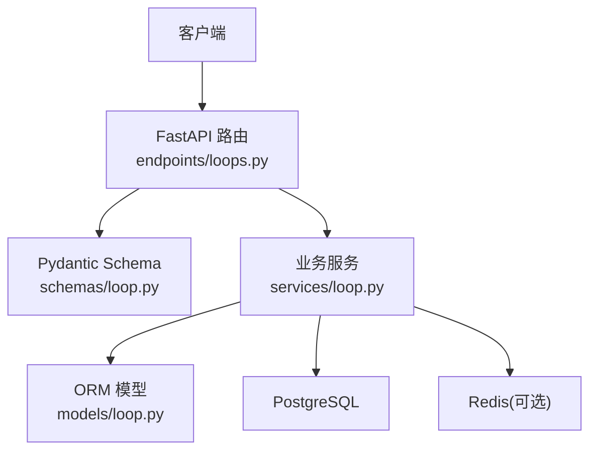
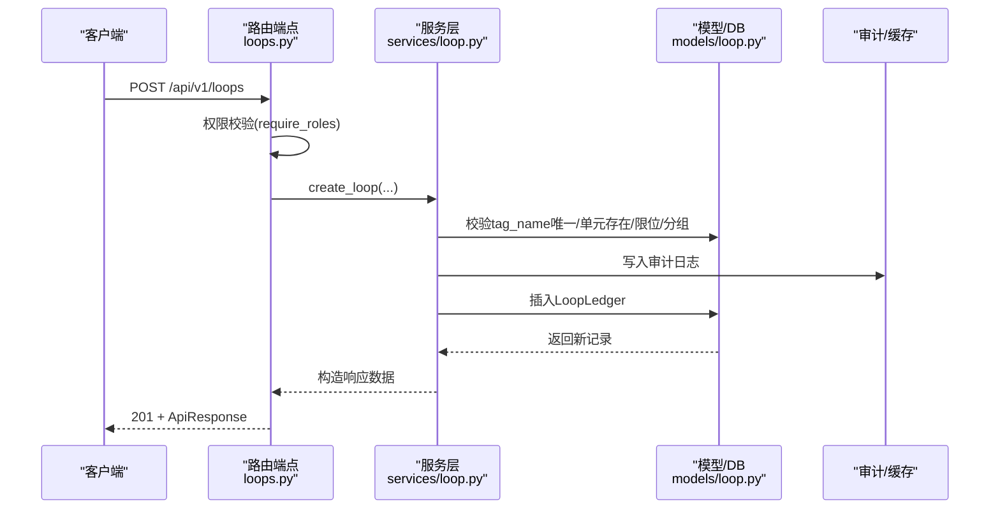
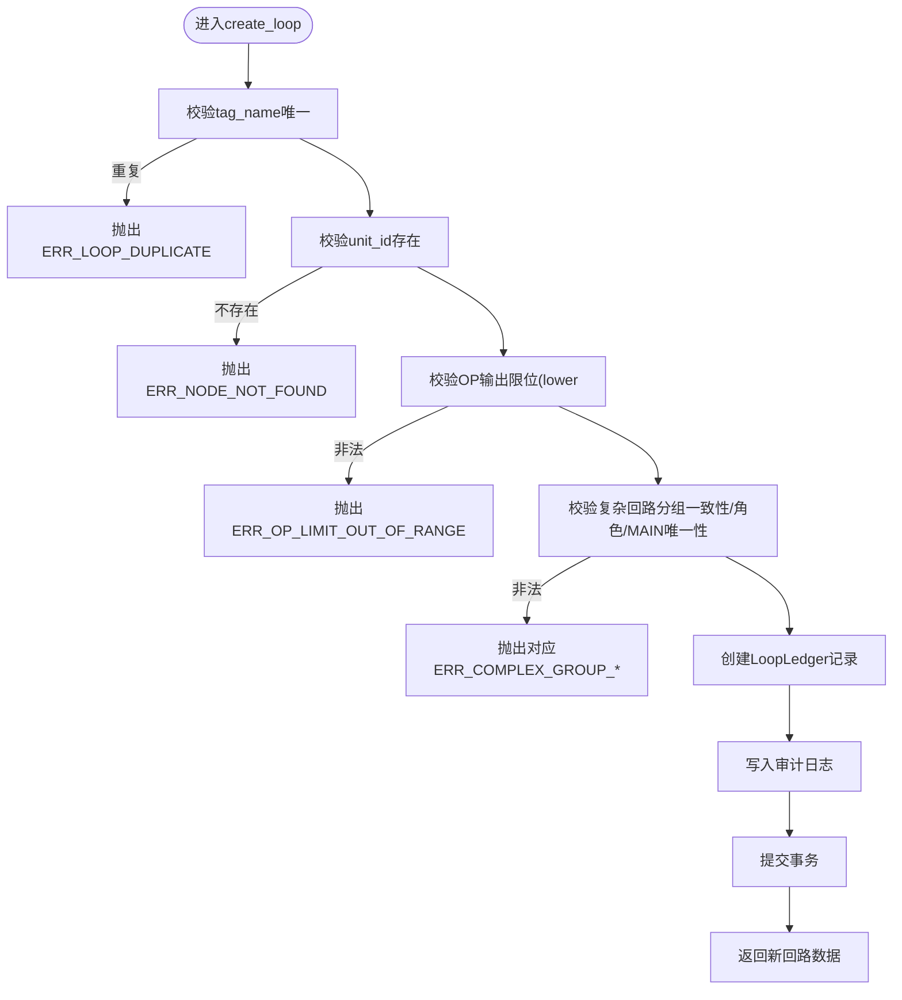
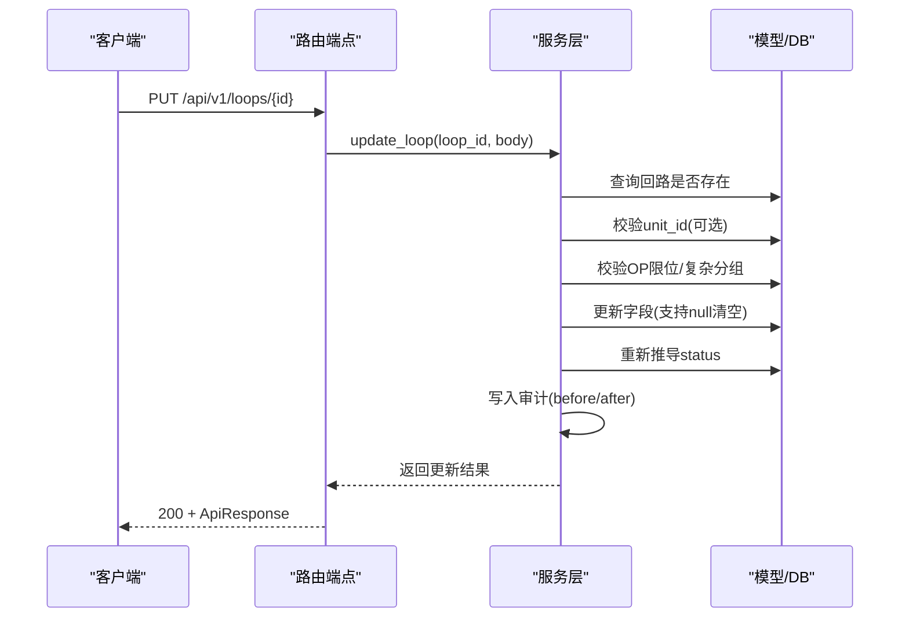
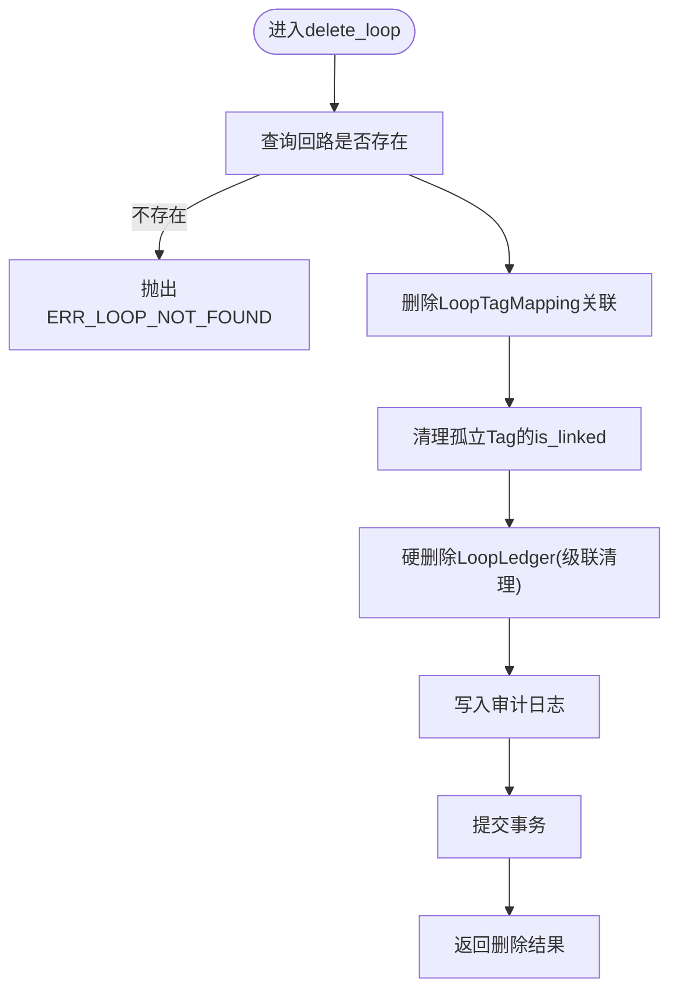
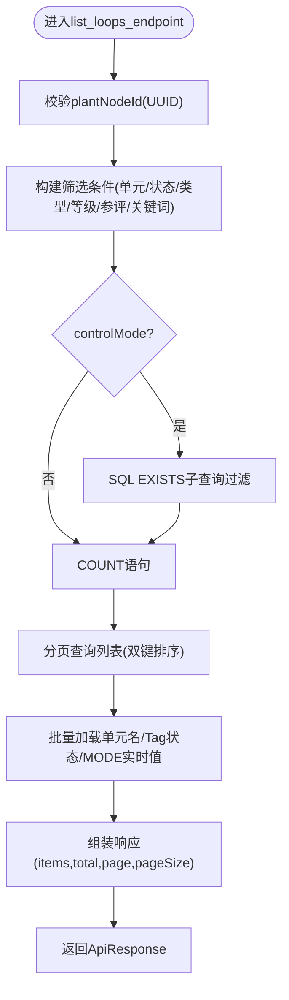
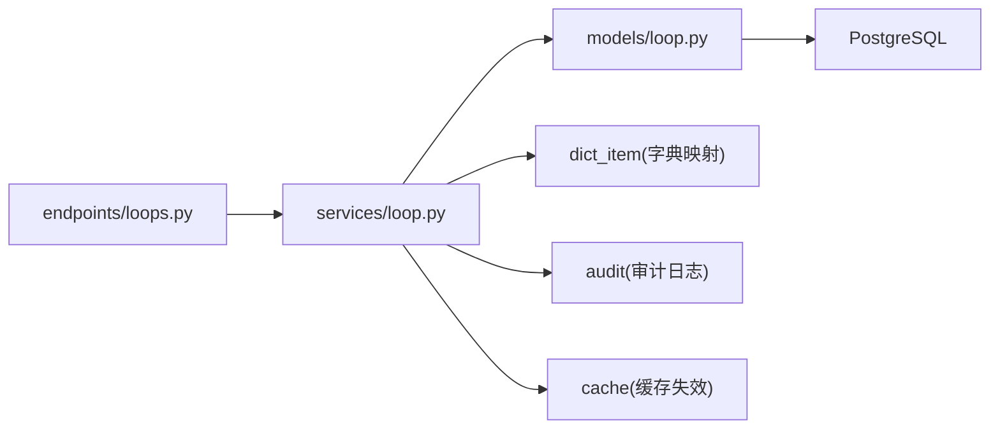

# 回路基础CRUD操作

<cite>
**本文引用的文件**
- [backend/app/api/v1/endpoints/loops.py](file://backend/app/api/v1/endpoints/loops.py)
- [backend/app/schemas/loop.py](file://backend/app/schemas/loop.py)
- [backend/app/models/loop.py](file://backend/app/models/loop.py)
- [backend/app/services/loop.py](file://backend/app/services/loop.py)
</cite>

## 目录
1. [简介](#简介)
2. [项目结构](#项目结构)
3. [核心组件](#核心组件)
4. [架构总览](#架构总览)
5. [详细组件分析](#详细组件分析)
6. [依赖关系分析](#依赖关系分析)
7. [性能考量](#性能考量)
8. [故障排查指南](#故障排查指南)
9. [结论](#结论)
10. [附录](#附录)

## 简介
本文件为 CLPM-MVP 回路的增删改查（CRUD）API 文档，覆盖以下接口：
- 创建回路：POST /api/v1/loops
- 更新回路：PUT /api/v1/loops/{id}
- 删除回路：DELETE /api/v1/loops/{id}
- 查询回路列表：GET /api/v1/loops

文档包含请求参数、响应格式、错误码与权限验证说明，并给出关键流程图与时序图以辅助理解。

## 项目结构
后端采用 FastAPI 路由 + Pydantic Schema + SQLAlchemy ORM + Service 层分层设计：
- API 层：定义路由、鉴权、入参校验与出参封装
- Schema 层：严格定义请求体与响应体字段及约束
- Model 层：数据库表结构与约束
- Service 层：业务逻辑、状态推导、审计日志、缓存失效等

图表来源
- [backend/app/api/v1/endpoints/loops.py:1-75](file://backend/app/api/v1/endpoints/loops.py#L1-L75)
- [backend/app/schemas/loop.py:1-120](file://backend/app/schemas/loop.py#L1-L120)
- [backend/app/models/loop.py:33-187](file://backend/app/models/loop.py#L33-L187)
- [backend/app/services/loop.py:1-65](file://backend/app/services/loop.py#L1-L65)

章节来源
- [backend/app/api/v1/endpoints/loops.py:1-75](file://backend/app/api/v1/endpoints/loops.py#L1-L75)
- [backend/app/schemas/loop.py:1-120](file://backend/app/schemas/loop.py#L1-L120)
- [backend/app/models/loop.py:33-187](file://backend/app/models/loop.py#L33-L187)
- [backend/app/services/loop.py:1-65](file://backend/app/services/loop.py#L1-L65)

## 核心组件
- 路由端点：负责 HTTP 方法、路径、鉴权、参数解析与响应包装
- Schema：定义请求/响应的字段类型、默认值、取值范围与校验规则
- 模型：定义数据库表结构、约束、索引与外键关系
- 服务：实现创建、更新、删除、查询、状态推导、审计、缓存失效等业务逻辑

章节来源
- [backend/app/api/v1/endpoints/loops.py:83-178](file://backend/app/api/v1/endpoints/loops.py#L83-L178)
- [backend/app/schemas/loop.py:45-176](file://backend/app/schemas/loop.py#L45-L176)
- [backend/app/models/loop.py:33-187](file://backend/app/models/loop.py#L33-L187)
- [backend/app/services/loop.py:918-1073](file://backend/app/services/loop.py#L918-L1073)

## 架构总览
下图展示从请求到数据落库的完整调用链，包括鉴权、Schema 校验、Service 处理与数据库操作。

图表来源
- [backend/app/api/v1/endpoints/loops.py:146-178](file://backend/app/api/v1/endpoints/loops.py#L146-L178)
- [backend/app/services/loop.py:918-1073](file://backend/app/services/loop.py#L918-L1073)
- [backend/app/models/loop.py:33-187](file://backend/app/models/loop.py#L33-L187)

## 详细组件分析

### 创建回路接口：POST /api/v1/loops
- 功能：创建回路台账，支持基本信息、评分权重、控制模式配置、OP输出限位、DCS型号关联、理想稳态时间、复杂回路分组等
- 权限：ADMIN / IC_ENGINEER / PE_ENGINEER
- 请求体关键字段（来自 LoopCreate）：
  - tagName：必填，回路位号（唯一）
  - description：可选，描述
  - unitId：可选，所属工艺单元ID
  - scoreWeights：可选，评分权重对象（总和须为100）
  - isActive：默认true，是否启用
  - remark：可选，备注
  - loopType：可选，回路类型（如 TEMPERATURE/PRESSURE/LEVEL/FLOW/ANALYSIS/SPEED/OTHER）
  - controlType：可选，控制类型（STABLE/SLOW/FAST/LOGIC）
  - importanceLevel：可选，重要等级（1/2/3），缺省兜底为2
  - includeInEvaluation：可选，是否参与评估（默认true）
  - modeattrTagId：可选，APC识别位号ID（保留字段）
  - dataRetentionDays：可选，数据保存周期（天）
  - opOutputLowerLimit/opOutputUpperLimit：可选，OP输出下/上限位（应用层校验 lower < upper，且受OP Tag量程限制）
  - dcsModelId：可选，关联DCS型号ID（NULL使用系统默认MODE映射）
  - idealSettlingTime：可选，理想稳态时间（秒），空则按控制类型默认值
  - complexLoopGroupId/complexRole：可选，复杂回路分组ID与角色（MAIN/SUB），需满足一致性约束
- 响应：201 + ApiResponse，data包含新建回路的完整信息（含新增时间、创建人等）
- 错误码：
  - ERR_LOOP_DUPLICATE：tag_name重复
  - ERR_NODE_NOT_FOUND：unitId不存在
  - ERR_OP_LIMIT_OUT_OF_RANGE：OP输出限位不合法
  - ERR_COMPLEX_GROUP_COHERENCE/ERR_COMPLEX_GROUP_ROLE_INVALID/ERR_COMPLEX_GROUP_MAIN_EXISTS/ERR_COMPLEX_GROUP_ID_INVALID：复杂回路分组校验失败

图表来源
- [backend/app/services/loop.py:918-1073](file://backend/app/services/loop.py#L918-L1073)
- [backend/app/services/loop.py:811-847](file://backend/app/services/loop.py#L811-L847)
- [backend/app/services/loop.py:849-916](file://backend/app/services/loop.py#L849-L916)

章节来源
- [backend/app/api/v1/endpoints/loops.py:146-178](file://backend/app/api/v1/endpoints/loops.py#L146-L178)
- [backend/app/schemas/loop.py:45-114](file://backend/app/schemas/loop.py#L45-L114)
- [backend/app/services/loop.py:918-1073](file://backend/app/services/loop.py#L918-L1073)

### 更新回路接口：PUT /api/v1/loops/{id}
- 功能：更新回路描述、所属单元、评分权重、启用状态、备注、回路类型、控制类型、重要等级、参评状态、APC位号、数据保留周期、OP输出限位、DCS型号、理想稳态时间、复杂回路分组等
- 权限：ADMIN / IC_ENGINEER / PE_ENGINEER
- 请求体关键字段（来自 LoopUpdate）：
  - description/unitId/scoreWeights/isActive/remark/loopType/controlType/importance_level/include_in_evaluation/modeattrTagId/dataRetentionDays
  - opOutputLowerLimit/opOutputUpperLimit：支持通过传递null清空（恢复默认值）
  - dcsModelId：支持通过传递null清空（回退到系统默认MODE映射）
  - idealSettlingTime：支持通过传递null清空（恢复按控制类型默认值）
  - complexLoopGroupId/complexRole：支持通过传递null清空（解除分组）
- 行为：
  - 若传入unitId，将校验目标节点存在
  - 更新后重新推导回路状态（READY/PARTIAL/INACTIVE）
  - 写入审计日志（before/after快照）
- 响应：200 + ApiResponse，data包含更新后的字段与更新时间、更新人
- 错误码：
  - ERR_LOOP_NOT_FOUND：回路不存在
  - ERR_NODE_NOT_FOUND：unitId不存在
  - ERR_OP_LIMIT_OUT_OF_RANGE：OP输出限位不合法
  - ERR_COMPLEX_GROUP_*：复杂回路分组校验失败

图表来源
- [backend/app/api/v1/endpoints/loops.py:392-439](file://backend/app/api/v1/endpoints/loops.py#L392-L439)
- [backend/app/services/loop.py:1284-1511](file://backend/app/services/loop.py#L1284-L1511)

章节来源
- [backend/app/api/v1/endpoints/loops.py:392-439](file://backend/app/api/v1/endpoints/loops.py#L392-L439)
- [backend/app/schemas/loop.py:116-176](file://backend/app/schemas/loop.py#L116-L176)
- [backend/app/services/loop.py:1284-1511](file://backend/app/services/loop.py#L1284-L1511)

### 删除回路接口：DELETE /api/v1/loops/{id}
- 功能：硬删除回路（不可恢复），级联清理相关数据
- 权限：仅 ADMIN
- 行为：
  - 先删除该回路的 LoopTagMapping 关联记录（PV/SP/OP/MODE/PID_P/PID_I/PID_D）
  - 若被解绑的Tag不再被任何回路引用，清除其 is_linked 标记
  - 硬删除回路本体，ON DELETE CASCADE 自动清理 kpi_snapshot/action_tracker/diagnosis_result/tuning_record/loop_mode_mapping/kpi_custom/diagnosis_tag/diagnosis_task/loop_confidence_latest/process_model_version 等关联数据
  - 写入审计日志
- 响应：200 + ApiResponse，data包含 deleted=true 与删除时间
- 错误码：
  - ERR_LOOP_NOT_FOUND：回路不存在

图表来源
- [backend/app/api/v1/endpoints/loops.py:442-455](file://backend/app/api/v1/endpoints/loops.py#L442-L455)
- [backend/app/services/loop.py:1514-1591](file://backend/app/services/loop.py#L1514-L1591)
- [backend/app/models/loop.py:190-221](file://backend/app/models/loop.py#L190-L221)

章节来源
- [backend/app/api/v1/endpoints/loops.py:442-455](file://backend/app/api/v1/endpoints/loops.py#L442-L455)
- [backend/app/services/loop.py:1514-1591](file://backend/app/services/loop.py#L1514-L1591)
- [backend/app/models/loop.py:190-221](file://backend/app/models/loop.py#L190-L221)

### 查询回路列表接口：GET /api/v1/loops
- 功能：分页查询回路列表，支持多条件筛选与排序
- 权限：需要“loop:view”权限
- 查询参数：
  - plantNodeId：按装置/单元筛选（递归子节点）
  - controlMode：按控制方式筛选（Manual/Auto/Cascade）
  - isActive：按启用状态筛选
  - status：按回路状态筛选（READY/PARTIAL/INACTIVE）
  - keyword：按回路位号/描述模糊查询
  - loopType：按回路类型筛选
  - controlType：按控制类型筛选（STABLE/SLOW/FAST/LOGIC）
  - level：已废弃，请使用importanceLevel
  - importanceLevel：按回路重要等级筛选（1/2/3）
  - monitorStatus：按监控状态筛选（true=监控中/false=已停用）
  - includeInEvaluation：按参评状态筛选（true=参评/false=不参评）
  - page/pageSize：分页参数
- 行为：
  - 防御性校验plantNodeId格式（UUID）
  - 当同时传入isActive与monitorStatus时，要求两者一致，否则返回400
  - 控制模式筛选下沉至SQL层（EXISTS子查询）避免分页错乱
  - 批量查询单元名称、Tag关联状态、MODE实时值（优先Redis缓存）
  - 返回items、total、page、pageSize
- 错误码：
  - ERR_PARAM：plantNodeId格式非法
  - 400：isActive与monitorStatus语义冲突

图表来源
- [backend/app/api/v1/endpoints/loops.py:83-143](file://backend/app/api/v1/endpoints/loops.py#L83-L143)
- [backend/app/services/loop.py:445-711](file://backend/app/services/loop.py#L445-L711)

章节来源
- [backend/app/api/v1/endpoints/loops.py:83-143](file://backend/app/api/v1/endpoints/loops.py#L83-L143)
- [backend/app/services/loop.py:445-711](file://backend/app/services/loop.py#L445-L711)

## 依赖关系分析
- 路由依赖：
  - 权限依赖：require_roles/require_perms
  - 数据库会话：get_db
  - 上传防护：read_excel_upload（导入导出）
- 服务依赖：
  - 模型：LoopLedger、LoopTagMapping、PlantNode、TagRegistry、DcsModel
  - 工具：审计日志、缓存失效、TDengine subtable缓存清理
  - 字典项：回路类型/控制类型中英文映射
- 模型依赖：
  - 外键：unit_id→plant_node.id；modeattr_tag_id→tag_registry.id；dcs_model_id→dcs_model.id
  - 约束：状态枚举、类型枚举、重要等级、复杂角色一致性
  - 索引：unit_id、status、tag_name、importance_level、dcs_model_id、complex_loop_group_id

图表来源
- [backend/app/api/v1/endpoints/loops.py:27-75](file://backend/app/api/v1/endpoints/loops.py#L27-L75)
- [backend/app/services/loop.py:19-38](file://backend/app/services/loop.py#L19-L38)
- [backend/app/models/loop.py:33-187](file://backend/app/models/loop.py#L33-L187)

章节来源
- [backend/app/api/v1/endpoints/loops.py:27-75](file://backend/app/api/v1/endpoints/loops.py#L27-L75)
- [backend/app/services/loop.py:19-38](file://backend/app/services/loop.py#L19-L38)
- [backend/app/models/loop.py:33-187](file://backend/app/models/loop.py#L33-L187)

## 性能考量
- 列表查询优化：
  - 控制模式筛选下沉至SQL层（EXISTS子查询），避免后置过滤导致total与分页错乱
  - 批量加载单元名、Tag关联状态、MODE实时值（优先Redis缓存）
  - 双键排序（created_at desc, tag_name asc）保证稳定顺序
- 统计缓存：
  - 回路类型/控制方式统计使用Redis短TTL缓存（60s±抖动），减少重复计算
- 缓存失效：
  - Tag重关联时清理subtable解析缓存与L1缓存，避免历史数据不可达问题

章节来源
- [backend/app/services/loop.py:445-711](file://backend/app/services/loop.py#L445-L711)
- [backend/app/services/loop.py:259-343](file://backend/app/services/loop.py#L259-L343)
- [backend/app/services/loop.py:67-126](file://backend/app/services/loop.py#L67-L126)

## 故障排查指南
- 常见错误与定位：
  - ERR_LOOP_DUPLICATE：检查tagName是否重复
  - ERR_NODE_NOT_FOUND：确认unitId是否存在于plant_node
  - ERR_OP_LIMIT_OUT_OF_RANGE：检查OP输出限位与Tag量程边界
  - ERR_COMPLEX_GROUP_*：检查复杂回路分组的一致性、角色取值与MAIN唯一性
  - ERR_LOOP_NOT_FOUND：确认回路ID有效
  - ERR_PARAM：plantNodeId格式非法（应为UUID）
  - 400：isActive与monitorStatus同时传入但值不一致
- 建议排查步骤：
  - 核对请求体字段是否符合Schema定义（大小写、类型、范围）
  - 检查权限是否正确（loop:view、ADMIN/IC_ENGINEER/PE_ENGINEER）
  - 查看审计日志（LOOP_CREATE/LOOP_UPDATE/LOOP_DELETE）定位变更前后值
  - 关注Tag重关联警告（历史数据在新subtable重新开始）

章节来源
- [backend/app/api/v1/endpoints/loops.py:112-143](file://backend/app/api/v1/endpoints/loops.py#L112-L143)
- [backend/app/services/loop.py:918-1073](file://backend/app/services/loop.py#L918-L1073)
- [backend/app/services/loop.py:1284-1511](file://backend/app/services/loop.py#L1284-L1511)
- [backend/app/services/loop.py:1514-1591](file://backend/app/services/loop.py#L1514-L1591)

## 结论
本CRUD API围绕回路台账提供完整的创建、更新、删除与查询能力，具备严格的参数校验、权限控制、审计追踪与性能优化。通过Schema强约束与服务层业务规则，确保数据一致性与可维护性。建议在集成时严格遵循字段规范与错误码约定，并结合审计日志进行问题定位。

## 附录
- 权限说明：
  - 列表/详情/标签读取：loop:view
  - 创建/更新：ADMIN / IC_ENGINEER / PE_ENGINEER
  - 删除：仅 ADMIN
- 状态推导：
  - INACTIVE：未激活
  - PARTIAL：已激活但缺少必填Tag（PV/SP/OP/MODE任一缺失）
  - READY：已激活且四个必填Tag全部关联
- 复杂回路分组：
  - group_id与role须同时为空或同时设置
  - role取值MAIN/SUB，同一group仅允许一个MAIN

章节来源
- [backend/app/api/v1/endpoints/loops.py:83-178](file://backend/app/api/v1/endpoints/loops.py#L83-L178)
- [backend/app/services/loop.py:180-207](file://backend/app/services/loop.py#L180-L207)
- [backend/app/services/loop.py:849-916](file://backend/app/services/loop.py#L849-L916)