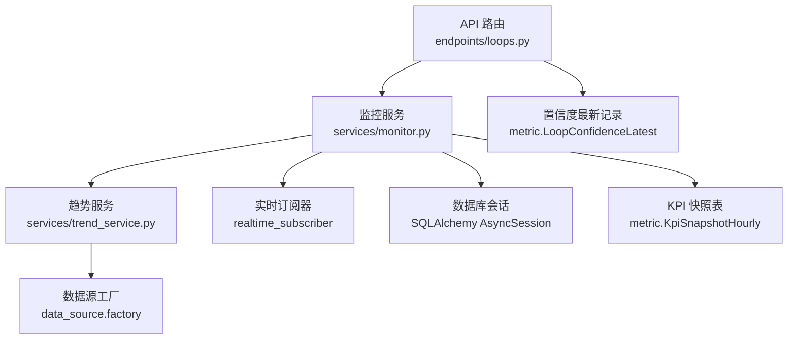
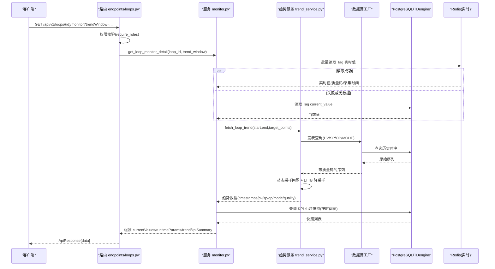
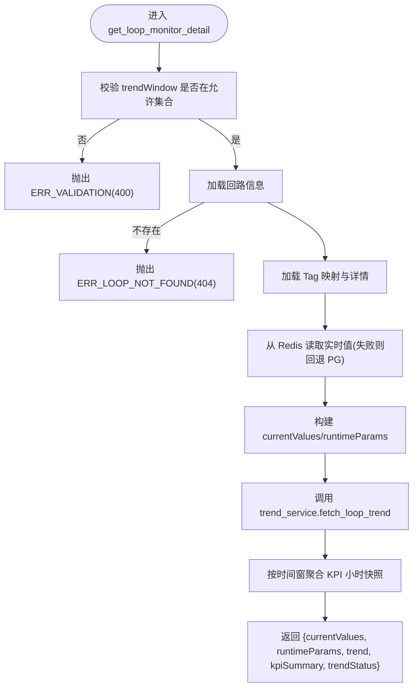
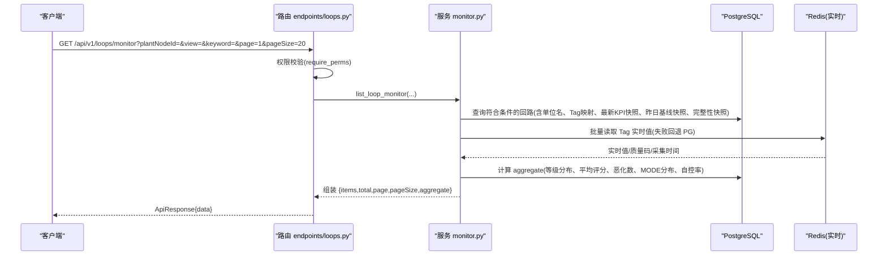
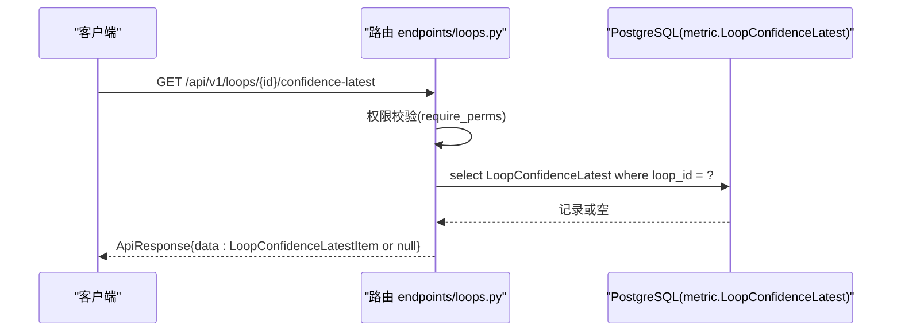
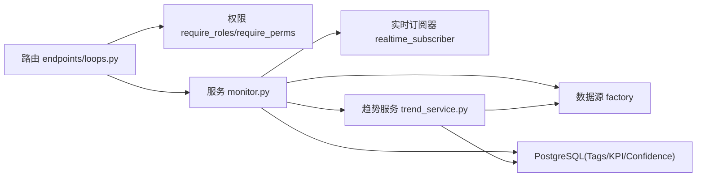

# 回路监控详情

<cite>
**本文引用的文件**
- [backend/app/api/v1/endpoints/loops.py](file://backend/app/api/v1/endpoints/loops.py)
- [backend/app/services/monitor.py](file://backend/app/services/monitor.py)
- [backend/app/services/trend_service.py](file://backend/app/services/trend_service.py)
- [backend/app/schemas/loop.py](file://backend/app/schemas/loop.py)
- [backend/app/models/metric.py](file://backend/app/models/metric.py)
</cite>

## 目录
1. [简介](#简介)
2. [项目结构](#项目结构)
3. [核心组件](#核心组件)
4. [架构总览](#架构总览)
5. [详细接口说明](#详细接口说明)
6. [依赖关系分析](#依赖关系分析)
7. [性能与实时性](#性能与实时性)
8. [故障排查指南](#故障排查指南)
9. [结论](#结论)
10. [附录：数据示例与使用场景](#附录数据示例与使用场景)

## 简介
本文件面向 CLPM-MVP 的“回路监控详情”能力，覆盖以下 API 与实现要点：
- 回路运行详情：GET /api/v1/loops/{id}/monitor
  - 返回当前 7 个 Tag（PV、SP、OP、MODE、PID_P、PID_I、PID_D）的最新值
  - 返回 PID 参数（P/I/D）与控制模式
  - 返回趋势波形数据（支持 last_1_hour 到 last_72_hours 多时间窗）
  - 返回 KPI 摘要与状态
- 监控列表：GET /api/v1/loops/monitor
  - 提供回路监控视图，包含实时 PV/SP/OP/MODE、质量码、评分、较昨日变化等
- 置信度评估最新记录：GET /api/v1/loops/{id}/confidence-latest
  - 返回最近一次可信度评估记录与 12 个子指标的可信度明细
- 权限控制：WS-D 性能优化策略下的角色/权限校验
- 数据聚合策略：KPI 快照聚合、LTTB 降采样、Redis 实时缓存回退
- 实时性保证：优先 Redis 实时值，失败回退数据库；趋势查询动态采样间隔

## 项目结构
与“回路监控详情”相关的后端代码主要分布在以下位置：
- 路由定义：backend/app/api/v1/endpoints/loops.py
- 服务实现：backend/app/services/monitor.py、backend/app/services/trend_service.py
- 响应模型：backend/app/schemas/loop.py（含 LoopConfidenceLatestItem）
- 数据模型：backend/app/models/metric.py（LoopConfidenceLatest）

图表来源
- [backend/app/api/v1/endpoints/loops.py:283-310](file://backend/app/api/v1/endpoints/loops.py#L283-L310)
- [backend/app/api/v1/endpoints/loops.py:520-533](file://backend/app/api/v1/endpoints/loops.py#L520-L533)
- [backend/app/api/v1/endpoints/loops.py:541-573](file://backend/app/api/v1/endpoints/loops.py#L541-L573)
- [backend/app/services/monitor.py:561-913](file://backend/app/services/monitor.py#L561-L913)
- [backend/app/services/monitor.py:916-1137](file://backend/app/services/monitor.py#L916-L1137)
- [backend/app/services/trend_service.py:226-424](file://backend/app/services/trend_service.py#L226-L424)

章节来源
- [backend/app/api/v1/endpoints/loops.py:1-21](file://backend/app/api/v1/endpoints/loops.py#L1-L21)
- [backend/app/api/v1/endpoints/loops.py:283-310](file://backend/app/api/v1/endpoints/loops.py#L283-L310)
- [backend/app/api/v1/endpoints/loops.py:520-533](file://backend/app/api/v1/endpoints/loops.py#L520-L533)
- [backend/app/api/v1/endpoints/loops.py:541-573](file://backend/app/api/v1/endpoints/loops.py#L541-L573)

## 核心组件
- 路由层：定义 /loops/monitor、/loops/{id}/monitor、/loops/{id}/confidence-latest 三个端点，并注入权限校验。
- 服务层：
  - list_loop_monitor：构建监控列表，聚合统计、实时值读取、KPI 快照聚合、较昨日增量计算。
  - get_loop_monitor_detail：获取单回路运行详情，包括 7 Tag 当前值、PID 参数、趋势数据、KPI 摘要。
  - trend_service.fetch_loop_trend：统一封装并行查询、动态采样间隔、质量码归一化、LTTB 降采样。
- 模型与 Schema：
  - LoopConfidenceLatestItem：描述 confidence-latest 响应结构。
  - KpiSnapshotHourly：用于 KPI 摘要聚合。
  - LoopLedger/LoopTagMapping/TagRegistry：用于 Tag 关联与当前值读取。

章节来源
- [backend/app/services/monitor.py:561-913](file://backend/app/services/monitor.py#L561-L913)
- [backend/app/services/monitor.py:916-1137](file://backend/app/services/monitor.py#L916-L1137)
- [backend/app/services/trend_service.py:226-424](file://backend/app/services/trend_service.py#L226-L424)
- [backend/app/schemas/loop.py:473-492](file://backend/app/schemas/loop.py#L473-L492)

## 架构总览

图表来源
- [backend/app/api/v1/endpoints/loops.py:520-533](file://backend/app/api/v1/endpoints/loops.py#L520-L533)
- [backend/app/services/monitor.py:916-1137](file://backend/app/services/monitor.py#L916-L1137)
- [backend/app/services/trend_service.py:226-424](file://backend/app/services/trend_service.py#L226-L424)

## 详细接口说明

### 接口一：回路运行详情
- 路径：GET /api/v1/loops/{id}/monitor
- 查询参数：
  - trendWindow：趋势数据时间窗，可选 last_1_hour、last_2_hours、last_4_hours、last_8_hours、last_24_hours、last_72_hours；默认 last_24_hours
- 权限：require_roles("ADMIN", "IC_ENGINEER", "PE_ENGINEER", "EXPERT")
- 功能：
  - 返回 7 个 Tag 当前值：pv、sp、op、mode、pid_p、pid_i、pid_d
  - 返回运行时参数：controlMode、pidP、pidI、pidD
  - 返回趋势数据：timestamps、pv、sp、op、mode、pvQuality、sampleInterval、downsampled
  - 返回 KPI 摘要：composite_score、auto_mode_rate、effective_auto_rate、steady_rate、accuracy_rate、fast_rate、oscillation_rate、saturation_rate、good_value_rate、status、algorithm_version、calculatedAt、confidence_level
  - 返回趋势状态：OK/EMPTY/PARTIAL
- 错误处理：
  - 非法 trendWindow → 400 ERR_VALIDATION
  - 回路不存在 → 404 ERR_LOOP_NOT_FOUND

图表来源
- [backend/app/services/monitor.py:916-1137](file://backend/app/services/monitor.py#L916-L1137)
- [backend/app/services/trend_service.py:226-424](file://backend/app/services/trend_service.py#L226-L424)

章节来源
- [backend/app/api/v1/endpoints/loops.py:520-533](file://backend/app/api/v1/endpoints/loops.py#L520-L533)
- [backend/app/services/monitor.py:916-1137](file://backend/app/services/monitor.py#L916-L1137)

### 接口二：监控列表
- 路径：GET /api/v1/loops/monitor
- 查询参数：
  - plantNodeId：按装置/单元筛选（递归子节点）
  - view：list/card
  - keyword：按位号/描述模糊查询
  - loopType：按回路类型筛选
  - loopId：精确查询指定回路（深链接解析）
  - page/pageSize：分页
- 权限：require_perms("loop:view")
- 功能：
  - 返回 items：每个回路包含 currentValues（pv/sp/op/mode/modeLabel/pvQuality/unit）、controlMode、score、scoreDelta、dayTrend、loopStatus、kpiStatus、confidenceLevel、effectiveAutoRate、kpiSummary、dataHealth（validRate、confidenceLevel、pvCompleteness、overallCompleteness、integrityStatus、missingColumns、lastIntegrityCheck）、loopType、isActive、readAt
  - 返回 aggregate：gradeCounts、avgScore、scoredCount、worsenedCount、modeDistribution、autoControlRate
  - 返回 total/page/pageSize/view

图表来源
- [backend/app/api/v1/endpoints/loops.py:283-310](file://backend/app/api/v1/endpoints/loops.py#L283-L310)
- [backend/app/services/monitor.py:561-913](file://backend/app/services/monitor.py#L561-L913)

章节来源
- [backend/app/api/v1/endpoints/loops.py:283-310](file://backend/app/api/v1/endpoints/loops.py#L283-L310)
- [backend/app/services/monitor.py:561-913](file://backend/app/services/monitor.py#L561-L913)

### 接口三：置信度评估最新记录
- 路径：GET /api/v1/loops/{id}/confidence-latest
- 权限：require_perms("loop:view")
- 功能：
  - 返回最近一次可信度评估记录（每回路一条），包含：
    - loop_id、eval_time、data_ts_start、data_ts_end、status、score、confidence_level、valid_rate、metrics（12 个子指标，键为 snake_case，形如 {"accuracy_rate": {"value": ...}, ...}）、algorithm_version、updated_at
  - 若无评估记录，返回 data=null（HTTP 200）

图表来源
- [backend/app/api/v1/endpoints/loops.py:541-573](file://backend/app/api/v1/endpoints/loops.py#L541-L573)
- [backend/app/schemas/loop.py:473-492](file://backend/app/schemas/loop.py#L473-L492)

章节来源
- [backend/app/api/v1/endpoints/loops.py:541-573](file://backend/app/api/v1/endpoints/loops.py#L541-L573)
- [backend/app/schemas/loop.py:473-492](file://backend/app/schemas/loop.py#L473-L492)

## 依赖关系分析
- 路由依赖：
  - require_roles / require_perms：权限控制
  - get_db：异步数据库会话
- 服务依赖：
  - realtime_subscriber.get_subscriber：读取 Redis 实时值
  - data_source.factory.get_provider：通过 Provider 进行宽表查询（TDengine/其他）
  - KpiSnapshotHourly：KPI 小时快照聚合
  - LoopConfidenceLatest：置信度评估记录
- 趋势服务依赖：
  - compute_sample_interval：根据时间范围计算采样间隔
  - lttb_downsample_multi_series：多序列 LTTB 降采样
  - _quality_to_label：质量码归一化

图表来源
- [backend/app/api/v1/endpoints/loops.py:283-310](file://backend/app/api/v1/endpoints/loops.py#L283-L310)
- [backend/app/api/v1/endpoints/loops.py:520-533](file://backend/app/api/v1/endpoints/loops.py#L520-L533)
- [backend/app/api/v1/endpoints/loops.py:541-573](file://backend/app/api/v1/endpoints/loops.py#L541-L573)
- [backend/app/services/monitor.py:561-913](file://backend/app/services/monitor.py#L561-L913)
- [backend/app/services/monitor.py:916-1137](file://backend/app/services/monitor.py#L916-L1137)
- [backend/app/services/trend_service.py:226-424](file://backend/app/services/trend_service.py#L226-L424)

章节来源
- [backend/app/api/v1/endpoints/loops.py:283-310](file://backend/app/api/v1/endpoints/loops.py#L283-L310)
- [backend/app/api/v1/endpoints/loops.py:520-533](file://backend/app/api/v1/endpoints/loops.py#L520-L533)
- [backend/app/api/v1/endpoints/loops.py:541-573](file://backend/app/api/v1/endpoints/loops.py#L541-L573)
- [backend/app/services/monitor.py:561-913](file://backend/app/services/monitor.py#L561-L913)
- [backend/app/services/monitor.py:916-1137](file://backend/app/services/monitor.py#L916-L1137)
- [backend/app/services/trend_service.py:226-424](file://backend/app/services/trend_service.py#L226-L424)

## 性能与实时性
- 实时值读取：
  - 优先从 Redis 读取 Tag 实时值（含 quality、collectTime），失败时回退到 PostgreSQL current_value
  - MODE 值经配置驱动映射转换为前端 ControlMode（Auto/Cascade/Manual）
- 趋势数据：
  - 动态采样间隔：根据时间窗和目标点数（默认 3600）计算采样间隔，避免过多数据点
  - LTTB 降采样：当数据点超过阈值（趋势服务中为 5000）触发多序列 LTTB 降采样，保持曲线形状
  - 质量码归一化：将不同来源的质量码统一为 GOOD/BAD/UNCERTAIN
- KPI 聚合：
  - 按时间窗聚合小时快照，采用 valid_rate 加权平均，状态取最差等级，算法版本取最新快照
- 权限与并发：
  - 路由层通过 require_roles/require_perms 进行权限控制，WS-D 阶段对 SPONSOR 限制下钻
  - 批量查询 Tag、KPI 快照、完整性快照，减少 N+1 查询

章节来源
- [backend/app/services/monitor.py:561-913](file://backend/app/services/monitor.py#L561-L913)
- [backend/app/services/monitor.py:916-1137](file://backend/app/services/monitor.py#L916-L1137)
- [backend/app/services/trend_service.py:226-424](file://backend/app/services/trend_service.py#L226-L424)

## 故障排查指南
- 400 错误（无效趋势时间窗）：
  - 检查 trendWindow 是否为 last_1_hour、last_2_hours、last_4_hours、last_8_hours、last_24_hours、last_72_hours 之一
- 404 错误（回路不存在）：
  - 检查 {id} 是否有效且存在
- 趋势为空：
  - 检查数据源是否推送历史数据；若 TDengine 无数据，返回 EMPTY 状态与空数组
- 实时值缺失：
  - 检查 Redis 连接与订阅器；若失败，自动回退到数据库 current_value
- 质量码异常：
  - 检查质量码来源（TDengine/OPC UA/OPC DA）是否被正确归一化为 GOOD/BAD/UNCERTAIN

章节来源
- [backend/app/services/monitor.py:916-932](file://backend/app/services/monitor.py#L916-L932)
- [backend/app/services/trend_service.py:331-342](file://backend/app/services/trend_service.py#L331-L342)
- [backend/app/services/monitor.py:166-194](file://backend/app/services/monitor.py#L166-L194)

## 结论
本方案通过分层架构与多重优化策略，实现了高可用、高性能的回路监控详情能力：
- 路由层清晰定义接口与权限
- 服务层统一处理实时值读取、趋势查询、KPI 聚合
- 趋势服务提供动态采样与 LTTB 降采样，保障前端渲染性能
- 置信度评估接口提供最新评估记录与子指标可信度
- 整体具备强实时性与容错能力，适用于生产环境监控场景

## 附录：数据示例与使用场景

### 接口一：回路运行详情（GET /api/v1/loops/{id}/monitor）
- 请求示例：
  - GET /api/v1/loops/{id}/monitor?trendWindow=last_24_hours
- 响应字段（data）：
  - loopId、tagName、loopStatus、kpiStatus
  - currentValues：pv、sp、op、mode、modeLabel、pvQuality、unit、readAt
  - runtimeParams：controlMode、pidP、pidI、pidD
  - trend：timestamps、pv、sp、op、mode、pvQuality、sampleInterval、downsampled
  - trendStatus：OK/EMPTY/PARTIAL
  - kpiSummary：composite_score、auto_mode_rate、effective_auto_rate、steady_rate、accuracy_rate、fast_rate、oscillation_rate、saturation_rate、good_value_rate、status、algorithm_version、calculatedAt、confidence_level

章节来源
- [backend/app/api/v1/endpoints/loops.py:520-533](file://backend/app/api/v1/endpoints/loops.py#L520-L533)
- [backend/app/services/monitor.py:916-1137](file://backend/app/services/monitor.py#L916-L1137)

### 接口二：监控列表（GET /api/v1/loops/monitor）
- 请求示例：
  - GET /api/v1/loops/monitor?plantNodeId={nodeId}&view=list&keyword=&loopType=&loopId=&page=1&pageSize=20
- 响应字段（data）：
  - view、items[]、total、page、pageSize、aggregate
  - items 每项包含：loopId、tagName、description、unitName、pvRange、pvUnit、opRange、opUnit、currentValues、controlMode、score、scoreDelta、dayTrend、loopStatus、kpiStatus、confidenceLevel、effectiveAutoRate、kpiSummary、dataHealth、loopType、isActive、readAt
  - aggregate：gradeCounts、avgScore、scoredCount、worsenedCount、modeDistribution、autoControlRate

章节来源
- [backend/app/api/v1/endpoints/loops.py:283-310](file://backend/app/api/v1/endpoints/loops.py#L283-L310)
- [backend/app/services/monitor.py:561-913](file://backend/app/services/monitor.py#L561-L913)

### 接口三：置信度评估最新记录（GET /api/v1/loops/{id}/confidence-latest）
- 请求示例：
  - GET /api/v1/loops/{id}/confidence-latest
- 响应字段（data）：
  - loop_id、eval_time、data_ts_start、data_ts_end、status、score、confidence_level、valid_rate、metrics（12 个子指标，snake_case 键）、algorithm_version、updated_at
  - 若无记录，data=null

章节来源
- [backend/app/api/v1/endpoints/loops.py:541-573](file://backend/app/api/v1/endpoints/loops.py#L541-L573)
- [backend/app/schemas/loop.py:473-492](file://backend/app/schemas/loop.py#L473-L492)