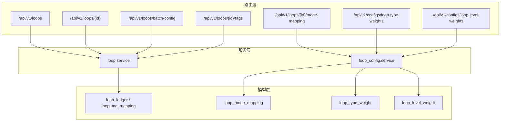
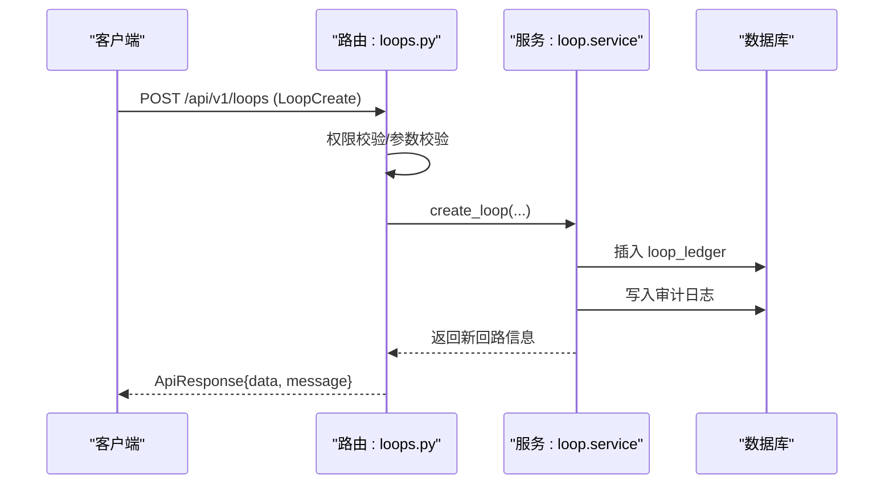
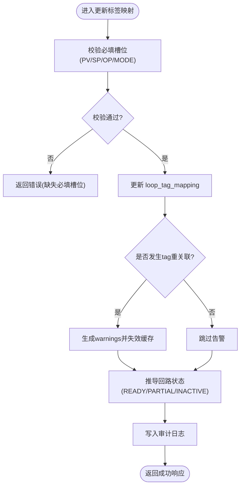
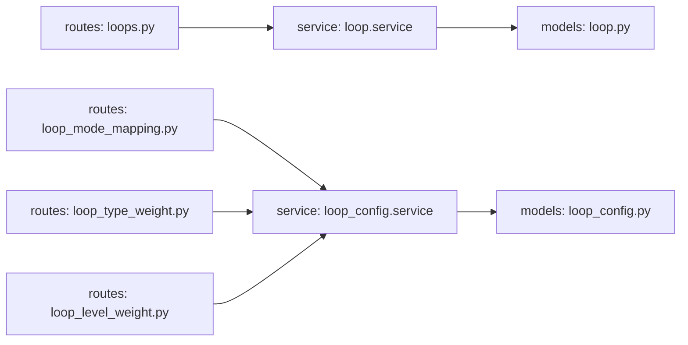

# 回路管理接口

<cite>
**本文引用的文件**
- [后端路由：回路与批量操作](file://backend/app/api/v1/endpoints/loops.py)
- [后端路由：投用定义（MODE映射）](file://backend/app/api/v1/endpoints/loop_mode_mapping.py)
- [后端路由：回路类型权重](file://backend/app/api/v1/endpoints/loop_type_weight.py)
- [后端路由：回路级别权重](file://backend/app/api/v1/endpoints/loop_level_weight.py)
- [数据模型：回路台账与Tag映射](file://backend/app/models/loop.py)
- [数据模型：回路配置表（投用定义/类型权重/级别权重）](file://backend/app/models/loop_config.py)
- [请求/响应模式：回路相关Schema](file://backend/app/schemas/loop.py)
- [请求/响应模式：批量操作Schema](file://backend/app/schemas/loop_batch.py)
- [服务层：回路核心逻辑（CRUD、状态推导、批量等）](file://backend/app/services/loop.py)
- [服务层：回路配置服务（投用定义/权重）](file://backend/app/services/loop_config.py)
</cite>

## 目录
1. [简介](#简介)
2. [项目结构](#项目结构)
3. [核心组件](#核心组件)
4. [架构总览](#架构总览)
5. [详细组件分析](#详细组件分析)
6. [依赖关系分析](#依赖关系分析)
7. [性能考虑](#性能考虑)
8. [故障排查指南](#故障排查指南)
9. [结论](#结论)
10. [附录](#附录)

## 简介
本文件为 CLPM-MVP 监控管理模块“回路管理”功能的 API 文档，覆盖回路的增删改查、标签映射、批量操作、状态管理与版本控制机制，并给出完整的 CRUD 示例、数据验证规则与错误码说明。同时涵盖回路配置管理（控制模式映射、采样频率、阈值设置、权重配置）的接口与行为约定。

## 项目结构
围绕“回路管理”的后端实现由四层构成：
- 路由层：FastAPI 路由暴露 REST 接口，负责参数校验、权限控制与响应封装。
- 服务层：业务编排与领域逻辑，包括回路 CRUD、状态推导、批量操作、缓存失效与审计日志。
- 模型层：PostgreSQL ORM 模型，定义回路台账、Tag 映射以及三类配置表（投用定义、类型权重、级别权重）。
- Schema 层：Pydantic 请求/响应模型，提供字段校验、别名映射与约束。

**图表来源**
- [后端路由：回路与批量操作:1-577](file://backend/app/api/v1/endpoints/loops.py#L1-L577)
- [后端路由：投用定义（MODE映射）:1-69](file://backend/app/api/v1/endpoints/loop_mode_mapping.py#L1-L69)
- [后端路由：回路类型权重:1-67](file://backend/app/api/v1/endpoints/loop_type_weight.py#L1-L67)
- [后端路由：回路级别权重:1-64](file://backend/app/api/v1/endpoints/loop_level_weight.py#L1-L64)
- [数据模型：回路台账与Tag映射:1-221](file://backend/app/models/loop.py#L1-L221)
- [数据模型：回路配置表（投用定义/类型权重/级别权重）:1-164](file://backend/app/models/loop_config.py#L1-L164)
- [服务层：回路核心逻辑（CRUD、状态推导、批量等）:1-800](file://backend/app/services/loop.py#L1-L800)
- [服务层：回路配置服务（投用定义/权重）:1-200](file://backend/app/services/loop_config.py#L1-L200)

**章节来源**
- [后端路由：回路与批量操作:1-577](file://backend/app/api/v1/endpoints/loops.py#L1-L577)
- [数据模型：回路台账与Tag映射:1-221](file://backend/app/models/loop.py#L1-L221)
- [数据模型：回路配置表（投用定义/类型权重/级别权重）:1-164](file://backend/app/models/loop_config.py#L1-L164)
- [服务层：回路核心逻辑（CRUD、状态推导、批量等）:1-800](file://backend/app/services/loop.py#L1-L800)
- [服务层：回路配置服务（投用定义/权重）:1-200](file://backend/app/services/loop_config.py#L1-L200)

## 核心组件
- 回路台账与 Tag 映射：定义回路基本信息、启用状态、重要等级、是否参评、OP 输出限位、DCS 型号关联、理想稳态时间、复杂回路分组与角色；Tag 映射支持 PV/SP/OP/MODE/PID_P/PID_I/PID_D 七类槽位。
- 回路配置：
  - 投用定义（MODE 值到控制模式的映射），用于自控率/有效自控率计算。
  - 回路类型权重（稳定型/慢速型/快速型/逻辑型），参与回路级综合评分。
  - 回路级别权重（一级/二级/三级），参与装置级聚合加权。
- 批量操作：批量更新监控/统计/等级/参评状态，或批量删除（硬删除）。
- 状态管理：根据 is_active 与必填 Tag 关联情况推导 READY/PARTIAL/INACTIVE。
- 版本控制：通过审计日志记录写操作的前后值与操作人；配置项更新均落库审计表。

**章节来源**
- [数据模型：回路台账与Tag映射:33-187](file://backend/app/models/loop.py#L33-L187)
- [数据模型：回路配置表（投用定义/类型权重/级别权重）:34-164](file://backend/app/models/loop_config.py#L34-L164)
- [服务层：回路核心逻辑（CRUD、状态推导、批量等）:180-208](file://backend/app/services/loop.py#L180-L208)
- [服务层：回路配置服务（投用定义/权重）:95-116](file://backend/app/services/loop_config.py#L95-L116)

## 架构总览
下图展示一次“创建回路”的典型调用链：前端发起 POST，路由层解析并校验请求体，调用服务层完成创建与状态推导，持久化至数据库并返回统一响应。

**图表来源**
- [后端路由：回路与批量操作:146-178](file://backend/app/api/v1/endpoints/loops.py#L146-L178)
- [服务层：回路核心逻辑（CRUD、状态推导、批量等）:151-172](file://backend/app/services/loop.py#L151-L172)
- [数据模型：回路台账与Tag映射:33-187](file://backend/app/models/loop.py#L33-L187)

## 详细组件分析

### 基本 CRUD 接口
- 列表查询：GET /api/v1/loops
  - 筛选：按装置/单元、控制方式、启用状态、回路状态、关键字、回路类型、控制类型、重要等级、监控状态、是否参评分页。
  - 返回：items、total、page、pageSize。
- 创建回路：POST /api/v1/loops
  - 必填：tagName（唯一）。可选：描述、所属单元、评分权重、启用状态、备注、回路类型、控制类型、重要等级、是否参评、APC 位号 ID、数据保留周期、OP 输出上下限、DCS 型号 ID、理想稳态时间、复杂回路分组与角色。
  - 权限：ADMIN/IC_ENGINEER/PE_ENGINEER。
- 更新回路：PUT /api/v1/loops/{id}
  - 可更新：描述、所属单元、评分权重、启用状态、备注、回路类型、控制类型、重要等级、是否参评、APC 位号 ID、数据保留周期、OP 输出上下限、DCS 型号 ID、理想稳态时间、复杂回路分组与角色。
  - 使用 model_fields_set 区分未传与显式置空，确保 PUT null 可清空 OP 限位等字段。
- 删除回路：DELETE /api/v1/loops/{id}
  - 仅 ADMIN。硬删除，级联解绑 Tag 映射并清理关联数据。

**章节来源**
- [后端路由：回路与批量操作:83-143](file://backend/app/api/v1/endpoints/loops.py#L83-L143)
- [后端路由：回路与批量操作:146-178](file://backend/app/api/v1/endpoints/loops.py#L146-L178)
- [后端路由：回路与批量操作:392-439](file://backend/app/api/v1/endpoints/loops.py#L392-L439)
- [后端路由：回路与批量操作:442-455](file://backend/app/api/v1/endpoints/loops.py#L442-L455)
- [请求/响应模式：回路相关Schema:45-176](file://backend/app/schemas/loop.py#L45-L176)

### 标签映射管理
- 获取标签映射：GET /api/v1/loops/{id}/tags
  - 返回 7 个槽位的当前关联状态（PV/SP/OP/MODE/PID_P/PID_I/PID_D）。
- 更新标签映射：PUT /api/v1/loops/{id}/tags
  - PV/SP/OP/MODE 必填，缺失时回路状态降级为 PARTIAL。
  - 若发生 tag 重关联，响应包含 warnings，提示历史数据在新 subtable 下重新开始。
  - 权限：ADMIN/IC_ENGINEER/PE_ENGINEER。

**章节来源**
- [后端路由：回路与批量操作:463-512](file://backend/app/api/v1/endpoints/loops.py#L463-L512)
- [请求/响应模式：回路相关Schema:379-427](file://backend/app/schemas/loop.py#L379-L427)
- [服务层：回路核心逻辑（CRUD、状态推导、批量等）:79-127](file://backend/app/services/loop.py#L79-L127)

### 批量操作接口
- 批量配置：POST /api/v1/loops/batch-config
  - 更新模式：updates 字段支持 isMonitored/isStatEnabled/importanceLevel/includeInEvaluation（isMonitored 与 isStatEnabled 互斥）。
  - 删除模式：action="delete"，硬删除并记录审计日志。
  - 权限：ADMIN。
- 批量分组：POST /api/v1/loops/batch-grouping
  - 将 2-20 个回路归为一个复杂控制回路，指定一个 MAIN 回路作为代表，其余为 SUB。
  - 权限：ADMIN/IC_ENGINEER。

**章节来源**
- [后端路由：回路与批量操作:186-275](file://backend/app/api/v1/endpoints/loops.py#L186-L275)
- [请求/响应模式：批量操作Schema:13-101](file://backend/app/schemas/loop_batch.py#L13-L101)
- [请求/响应模式：回路相关Schema:499-534](file://backend/app/schemas/loop.py#L499-L534)

### 控制模式映射（投用定义）
- 获取投用定义：GET /api/v1/loops/{loopId}/mode-mapping
  - 返回该回路所有 MODE 值与控制模式（AUTO/CAS/REMOTE/APC/MANUAL）的映射。
- 全量替换投用定义：PUT /api/v1/loops/{loopId}/mode-mapping
  - 采用“先删后建”策略保证幂等性。
  - 校验：modeValue 非负整数；modeLabel 在允许集合内；同一回路 modeValue 不重复。
  - 权限：ADMIN。

**章节来源**
- [后端路由：投用定义（MODE映射）:26-65](file://backend/app/api/v1/endpoints/loop_mode_mapping.py#L26-L65)
- [服务层：回路配置服务（投用定义/权重）:123-200](file://backend/app/services/loop_config.py#L123-L200)
- [数据模型：回路配置表（投用定义/类型权重/级别权重）:34-82](file://backend/app/models/loop_config.py#L34-L82)

### 权重配置接口
- 回路类型权重：GET/PUT /api/v1/configs/loop-type-weights
  - GET：获取全部类型权重（STABLE/SLOW/FAST/LOGIC）。
  - PUT：更新指定类型的 a/f/s 权重，要求总和≈1.0。
  - 权限：ADMIN。
- 回路级别权重：GET/PUT /api/v1/configs/loop-level-weights
  - GET：获取全部级别权重（1/2/3）。
  - PUT：更新指定级别的权重，要求 > 0。
  - 权限：ADMIN。

**章节来源**
- [后端路由：回路类型权重:30-63](file://backend/app/api/v1/endpoints/loop_type_weight.py#L30-L63)
- [后端路由：回路级别权重:29-60](file://backend/app/api/v1/endpoints/loop_level_weight.py#L29-L60)
- [数据模型：回路配置表（投用定义/类型权重/级别权重）:84-164](file://backend/app/models/loop_config.py#L84-L164)

### 状态管理与版本控制
- 状态推导：
  - INACTIVE：is_active=false。
  - PARTIAL：is_active=true 但 PV/SP/OP/MODE 任一缺失。
  - READY：is_active=true 且四个必填 Tag 均已关联。
- 版本控制：
  - 所有写操作记录审计日志（operator、operation_type、target_type、target_id、before_value、after_value）。
  - 投用定义替换会记录前后快照。

**章节来源**
- [服务层：回路核心逻辑（CRUD、状态推导、批量等）:180-208](file://backend/app/services/loop.py#L180-L208)
- [服务层：回路核心逻辑（CRUD、状态推导、批量等）:151-172](file://backend/app/services/loop.py#L151-L172)
- [服务层：回路配置服务（投用定义/权重）:95-116](file://backend/app/services/loop_config.py#L95-L116)

### 数据流与处理逻辑（流程图）
以下流程图展示“更新回路标签映射”的核心逻辑，包括必填校验、状态推导与缓存失效。

**图表来源**
- [后端路由：回路与批量操作:474-512](file://backend/app/api/v1/endpoints/loops.py#L474-L512)
- [服务层：回路核心逻辑（CRUD、状态推导、批量等）:79-127](file://backend/app/services/loop.py#L79-L127)
- [服务层：回路核心逻辑（CRUD、状态推导、批量等）:180-208](file://backend/app/services/loop.py#L180-L208)

## 依赖关系分析
- 路由与服务：
  - loops.py 依赖 loop.service 完成回路 CRUD、状态推导、批量操作与导入导出。
  - loop_mode_mapping.py 依赖 loop_config.service 完成投用定义的读取与替换。
  - loop_type_weight.py 与 loop_level_weight.py 依赖 loop_config.service 完成权重配置的读取与更新。
- 服务与模型：
  - loop.service 读写 loop_ledger 与 loop_tag_mapping，并引用 plant_node/tag_registry/dcs_model 等实体。
  - loop_config.service 读写 loop_mode_mapping、loop_type_weight、loop_level_weight。
- 外部依赖：
  - Redis 缓存用于实时 MODE 值与统计缓存。
  - TDengine 子表缓存会在 tag 重关联时失效。

**图表来源**
- [后端路由：回路与批量操作:1-577](file://backend/app/api/v1/endpoints/loops.py#L1-L577)
- [后端路由：投用定义（MODE映射）:1-69](file://backend/app/api/v1/endpoints/loop_mode_mapping.py#L1-L69)
- [后端路由：回路类型权重:1-67](file://backend/app/api/v1/endpoints/loop_type_weight.py#L1-L67)
- [后端路由：回路级别权重:1-64](file://backend/app/api/v1/endpoints/loop_level_weight.py#L1-L64)
- [服务层：回路核心逻辑（CRUD、状态推导、批量等）:1-800](file://backend/app/services/loop.py#L1-L800)
- [服务层：回路配置服务（投用定义/权重）:1-200](file://backend/app/services/loop_config.py#L1-L200)
- [数据模型：回路台账与Tag映射:1-221](file://backend/app/models/loop.py#L1-L221)
- [数据模型：回路配置表（投用定义/类型权重/级别权重）:1-164](file://backend/app/models/loop_config.py#L1-L164)

**章节来源**
- [后端路由：回路与批量操作:1-577](file://backend/app/api/v1/endpoints/loops.py#L1-L577)
- [后端路由：投用定义（MODE映射）:1-69](file://backend/app/api/v1/endpoints/loop_mode_mapping.py#L1-L69)
- [后端路由：回路类型权重:1-67](file://backend/app/api/v1/endpoints/loop_type_weight.py#L1-L67)
- [后端路由：回路级别权重:1-64](file://backend/app/api/v1/endpoints/loop_level_weight.py#L1-L64)
- [服务层：回路核心逻辑（CRUD、状态推导、批量等）:1-800](file://backend/app/services/loop.py#L1-L800)
- [服务层：回路配置服务（投用定义/权重）:1-200](file://backend/app/services/loop_config.py#L1-L200)
- [数据模型：回路台账与Tag映射:1-221](file://backend/app/models/loop.py#L1-L221)
- [数据模型：回路配置表（投用定义/类型权重/级别权重）:1-164](file://backend/app/models/loop_config.py#L1-L164)

## 性能考虑
- 列表查询优化：
  - 控制模式过滤下沉到 SQL 层（EXISTS 子查询），避免后置过滤导致 total 与分页错乱。
  - 批量查询 unit_name、Tag 关联状态、MODE 值（优先 Redis 缓存）。
  - 使用 WITH RECURSIVE CTE 一次性获取子孙节点并聚合统计，减少多次递归查询。
- 缓存策略：
  - 回路类型统计使用 Redis 短 TTL 缓存（60s ± 抖动），降低重复计算。
  - tag 重关联时清除 TDengine 子表解析缓存与 L1 缓存，保证一致性。
- 并发与幂等：
  - 投用定义替换采用“先删后建”，保证幂等。
  - 批量操作记录审计日志，便于追踪与回溯。

**章节来源**
- [服务层：回路核心逻辑（CRUD、状态推导、批量等）:259-343](file://backend/app/services/loop.py#L259-L343)
- [服务层：回路核心逻辑（CRUD、状态推导、批量等）:445-711](file://backend/app/services/loop.py#L445-L711)
- [服务层：回路核心逻辑（CRUD、状态推导、批量等）:104-127](file://backend/app/services/loop.py#L104-L127)
- [服务层：回路配置服务（投用定义/权重）:134-200](file://backend/app/services/loop_config.py#L134-L200)

## 故障排查指南
- 常见错误与定位：
  - 参数非法：plantNodeId 格式非法（应为 UUID）→ 检查查询参数。
  - 语义冲突：isActive 与 monitorStatus 同时传入且值不一致 → 统一为单一条件。
  - 必填槽位缺失：PV/SP/OP/MODE 任一缺失 → 更新标签映射补齐。
  - 投用定义无效：modeValue 非负整数、modeLabel 合法、无重复 → 修正请求体。
  - 权重求和异常：类型权重 a+f+s 应≈1.0 → 调整权重。
- 缓存与历史数据：
  - tag 重关联会导致历史数据在新 subtable 下重新开始，响应中 warnings 提示。
  - 若实时值读取失败，系统自动回退到数据库 current_value。
- 审计日志：
  - 所有写操作均有审计记录，可通过 operator、operation_type、target_type、target_id 定位变更。

**章节来源**
- [后端路由：回路与批量操作:112-143](file://backend/app/api/v1/endpoints/loops.py#L112-L143)
- [后端路由：回路与批量操作:474-512](file://backend/app/api/v1/endpoints/loops.py#L474-L512)
- [服务层：回路核心逻辑（CRUD、状态推导、批量等）:104-127](file://backend/app/services/loop.py#L104-L127)
- [服务层：回路配置服务（投用定义/权重）:153-177](file://backend/app/services/loop_config.py#L153-L177)

## 结论
本模块提供了完整的回路管理 API，覆盖基础 CRUD、标签映射、批量操作、状态推导与版本控制，并通过配置表实现了控制模式映射与权重体系的可配置化。结合缓存与审计机制，系统在性能与可追溯性方面具备良好支撑。建议在生产环境中严格遵循数据验证规则与权限控制，并在 tag 重关联时关注历史数据影响。

## 附录

### API 清单与示例
- 列表查询
  - 方法：GET
  - 路径：/api/v1/loops
  - 关键参数：plantNodeId、controlMode、isActive、status、keyword、loopType、controlType、importanceLevel、monitorStatus、includeInEvaluation、page、pageSize
  - 示例：GET /api/v1/loops?plantNodeId=...&page=1&pageSize=20
- 创建回路
  - 方法：POST
  - 路径：/api/v1/loops
  - 请求体：LoopCreate（tagName 必填）
  - 示例：POST /api/v1/loops { "tagName": "LOOP_001", "description": "温度控制回路", "unitId": "...", "scoreWeights": {...}, "isActive": true }
- 更新回路
  - 方法：PUT
  - 路径：/api/v1/loops/{id}
  - 请求体：LoopUpdate（支持部分更新与显式置空）
  - 示例：PUT /api/v1/loops/{id} { "description": "更新描述", "opOutputLowerLimit": null }
- 删除回路
  - 方法：DELETE
  - 路径：/api/v1/loops/{id}
  - 示例：DELETE /api/v1/loops/{id}
- 标签映射
  - 获取：GET /api/v1/loops/{id}/tags
  - 更新：PUT /api/v1/loops/{id}/tags { "pv": "...", "sp": "...", "op": "...", "mode": "..." }
- 批量配置
  - 方法：POST
  - 路径：/api/v1/loops/batch-config
  - 请求体：LoopBatchConfigRequest（更新模式或 action="delete"）
  - 示例：POST /api/v1/loops/batch-config { "loop_ids": ["..."], "updates": { "importanceLevel": 2 } }
- 投用定义
  - 获取：GET /api/v1/loops/{loopId}/mode-mapping
  - 替换：PUT /api/v1/loops/{loopId}/mode-mapping { "mappings": [{ "modeValue": 1, "modeLabel": "AUTO", "isAuto": true }] }
- 权重配置
  - 类型权重：GET/PUT /api/v1/configs/loop-type-weights/{loopType}
  - 级别权重：GET/PUT /api/v1/configs/loop-level-weights/{level}

**章节来源**
- [后端路由：回路与批量操作:83-178](file://backend/app/api/v1/endpoints/loops.py#L83-L178)
- [后端路由：回路与批量操作:186-275](file://backend/app/api/v1/endpoints/loops.py#L186-L275)
- [后端路由：投用定义（MODE映射）:26-65](file://backend/app/api/v1/endpoints/loop_mode_mapping.py#L26-L65)
- [后端路由：回路类型权重:30-63](file://backend/app/api/v1/endpoints/loop_type_weight.py#L30-L63)
- [后端路由：回路级别权重:29-60](file://backend/app/api/v1/endpoints/loop_level_weight.py#L29-L60)
- [请求/响应模式：回路相关Schema:45-176](file://backend/app/schemas/loop.py#L45-L176)
- [请求/响应模式：批量操作Schema:45-101](file://backend/app/schemas/loop_batch.py#L45-L101)

### 数据验证规则与错误码
- 字段校验
  - tagName：必填，长度 1-100，唯一。
  - importanceLevel：1/2/3。
  - controlType：STABLE/SLOW/FAST/LOGIC。
  - scoreWeights：六项权重之和必须为 100。
  - opOutputLowerLimit < opOutputUpperLimit，且在 OP Tag 量程范围内。
  - idealSettlingTime：0 < x ≤ 86400。
  - 批量 updates：isMonitored 与 isStatEnabled 互斥；至少一个字段非空。
  - 投用定义：modeValue 非负整数；modeLabel ∈ {AUTO,CAS,REMOTE,APC,MANUAL}；同一回路 modeValue 不重复。
  - 类型权重：a+f+s ≈ 1.0（误差±0.01）。
  - 级别权重：weight > 0。
- 错误码（示例）
  - ERR_PARAM：参数非法（如 plantNodeId 格式错误）。
  - ERR_LOOP_TAG_REQUIRED：必填槽位缺失。
  - ERR_TAG_NOT_FOUND：Tag 不存在于注册表。
  - ERR_MODE_MAPPING_INVALID：投用定义值无效。
  - ERR_MODE_MAPPING_DUPLICATE：投用定义重复。
  - ERR_WEIGHT_SUM_INVALID：权重求和不满足约束。
  - ERR_LOOP_TYPE_NOT_FOUND：类型权重不存在。
  - ERR_LOOP_LEVEL_NOT_FOUND：级别权重不存在。
  - ERR_WEIGHT_INVALID：级别权重无效。

**章节来源**
- [请求/响应模式：回路相关Schema:13-42](file://backend/app/schemas/loop.py#L13-L42)
- [请求/响应模式：批量操作Schema:13-83](file://backend/app/schemas/loop_batch.py#L13-L83)
- [服务层：回路配置服务（投用定义/权重）:153-177](file://backend/app/services/loop_config.py#L153-L177)
- [后端路由：回路类型权重:40-63](file://backend/app/api/v1/endpoints/loop_type_weight.py#L40-L63)
- [后端路由：回路级别权重:39-60](file://backend/app/api/v1/endpoints/loop_level_weight.py#L39-L60)