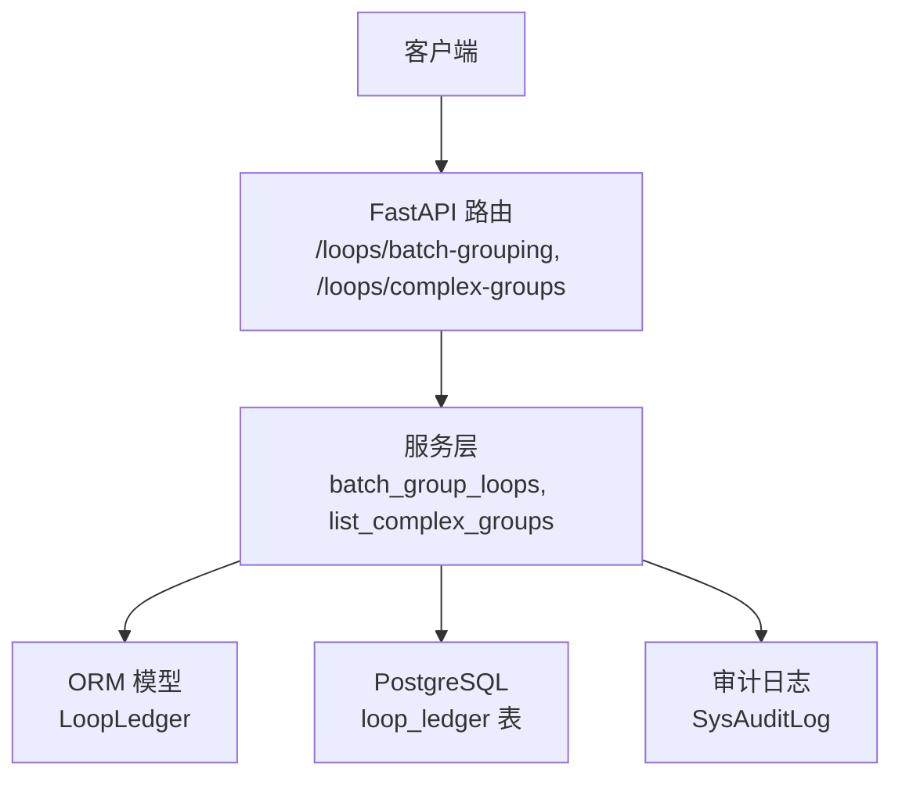
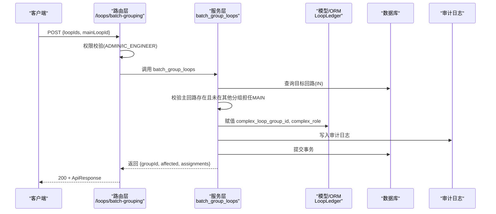
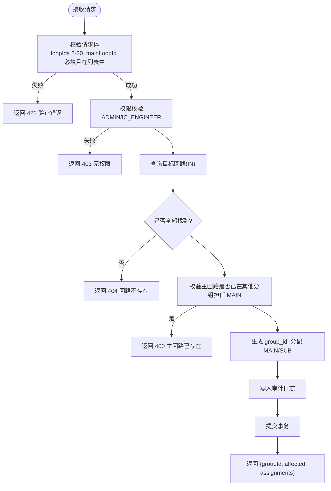
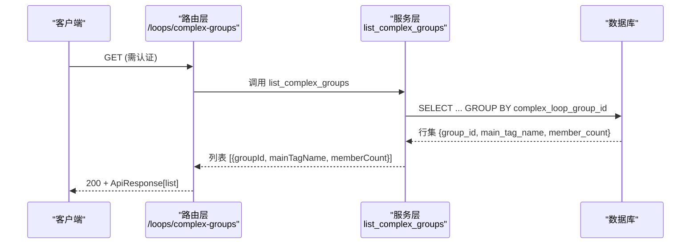
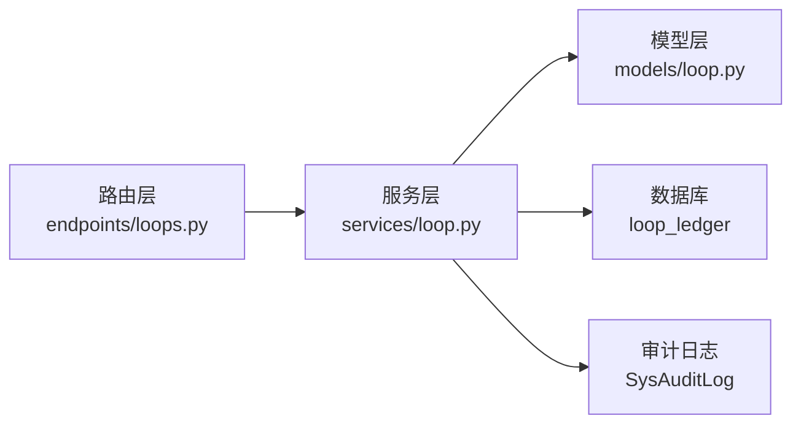

# 复杂回路分组

<cite>
**本文引用的文件**
- [backend/app/api/v1/endpoints/loops.py](file://backend/app/api/v1/endpoints/loops.py)
- [backend/app/schemas/loop.py](file://backend/app/schemas/loop.py)
- [backend/app/services/loop.py](file://backend/app/services/loop.py)
- [backend/app/models/loop.py](file://backend/app/models/loop.py)
- [backend/alembic/versions/b1c2d3e4f5a6_add_complex_loop_group.py](file://backend/alembic/versions/b1c2d3e4f5a6_add_complex_loop_group.py)
- [backend/tests/test_loop_complex_grouping.py](file://backend/tests/test_loop_complex_grouping.py)
</cite>

## 目录
1. [简介](#简介)
2. [项目结构](#项目结构)
3. [核心组件](#核心组件)
4. [架构总览](#架构总览)
5. [详细组件分析](#详细组件分析)
6. [依赖关系分析](#依赖关系分析)
7. [性能考虑](#性能考虑)
8. [故障排查指南](#故障排查指南)
9. [结论](#结论)
10. [附录：API 契约与使用示例](#附录api-契约与使用示例)

## 简介
本文档面向 CLPM-MVP 的“复杂回路分组”能力，覆盖概念、API 接口、业务规则、权限控制、数据一致性与性能优化策略，并提供实际应用场景与操作示例。复杂回路分组用于将多个物理上关联的单回路（如串级控制、超驰控制等）建模为一个“复杂控制回路组”，其中指定一个 MAIN 主回路作为聚合代表，其余为 SUB 子回路参与计算。

## 项目结构
复杂回路分组功能涉及 API 路由、请求/响应 Schema、服务层实现、模型定义与数据库迁移，以及测试用例。关键文件如下：
- API 路由：POST /api/v1/loops/batch-grouping、GET /api/v1/loops/complex-groups
- Schema：批量分组请求/响应、分组查询项
- 服务层：批量建立分组、查询分组列表
- 模型与迁移：loop_ledger 新增 complex_loop_group_id、complex_role 字段及约束、索引
- 测试：覆盖权限校验、参数校验、服务逻辑与返回结构

图表来源
- [backend/app/api/v1/endpoints/loops.py:248-275](file://backend/app/api/v1/endpoints/loops.py#L248-L275)
- [backend/app/services/loop.py:1600-1728](file://backend/app/services/loop.py#L1600-L1728)
- [backend/app/models/loop.py:139-186](file://backend/app/models/loop.py#L139-L186)

章节来源
- [backend/app/api/v1/endpoints/loops.py:1-21](file://backend/app/api/v1/endpoints/loops.py#L1-L21)
- [backend/app/schemas/loop.py:499-534](file://backend/app/schemas/loop.py#L499-L534)
- [backend/app/services/loop.py:1600-1728](file://backend/app/services/loop.py#L1600-L1728)
- [backend/app/models/loop.py:139-186](file://backend/app/models/loop.py#L139-L186)
- [backend/alembic/versions/b1c2d3e4f5a6_add_complex_loop_group.py:37-73](file://backend/alembic/versions/b1c2d3e4f5a6_add_complex_loop_group.py#L37-L73)

## 核心组件
- API 端点
  - POST /api/v1/loops/batch-grouping：批量建立复杂回路分组（仅 ADMIN / IC_ENGINEER）
  - GET /api/v1/loops/complex-groups：查询所有复杂回路分组（含主回路位号与组成员数）
- Schema
  - LoopBatchGroupingRequest：loopIds（2-20）、mainLoopId（必填且在 loopIds 中）
  - LoopBatchGroupingResult：groupId、affected、assignments（每个回路的 role：MAIN/SUB）
  - ComplexGroupItem：groupId、mainTagName、memberCount
- 服务层
  - batch_group_loops：校验、生成 group_id、分配角色、写审计、提交事务
  - list_complex_groups：按 group_id 聚合统计活跃回路的成员数与主回路位号
- 模型与约束
  - LoopLedger.complex_loop_group_id、complex_role
  - 检查约束：角色取值、分组与角色一致性
  - 索引：按 complex_loop_group_id 加速聚合查询

章节来源
- [backend/app/api/v1/endpoints/loops.py:248-275](file://backend/app/api/v1/endpoints/loops.py#L248-L275)
- [backend/app/schemas/loop.py:499-534](file://backend/app/schemas/loop.py#L499-L534)
- [backend/app/services/loop.py:1600-1728](file://backend/app/services/loop.py#L1600-L1728)
- [backend/app/models/loop.py:139-186](file://backend/app/models/loop.py#L139-L186)

## 架构总览
复杂回路分组的调用链从 FastAPI 路由开始，经权限校验后进入服务层执行业务逻辑，最终通过 ORM 写入数据库并记录审计日志。查询接口则直接通过 SQL 聚合统计分组信息。

图表来源
- [backend/app/api/v1/endpoints/loops.py:248-265](file://backend/app/api/v1/endpoints/loops.py#L248-L265)
- [backend/app/services/loop.py:1600-1694](file://backend/app/services/loop.py#L1600-L1694)
- [backend/app/models/loop.py:139-186](file://backend/app/models/loop.py#L139-L186)

## 详细组件分析

### 批量建立分组接口（POST /api/v1/loops/batch-grouping）
- 功能：将 2-20 个回路归并为一个复杂控制回路组，系统自动生成 group ID，指定一个 MAIN 主回路（聚合代表），其余自动为 SUB。
- 权限：仅 ADMIN 或 IC_ENGINEER 可调用；SPONSOR 将被拒绝（403）。
- 请求体：
  - loopIds：字符串数组，长度 2-20
  - mainLoopId：字符串，必须在 loopIds 中
- 响应体：
  - groupId：新分组 UUID
  - affected：受影响回路数量
  - assignments：每个回路的分配结果，包含 loopId、tagName、role（MAIN 在前，SUB 在后）
- 错误码：
  - 401：未认证
  - 403：无权限
  - 422：请求体验证失败（如 loopIds 长度不合法）
  - 400：业务校验失败（如主回路不在列表中、主回路已是其他分组 MAIN）
  - 404：部分回路不存在

图表来源
- [backend/app/api/v1/endpoints/loops.py:248-265](file://backend/app/api/v1/endpoints/loops.py#L248-L265)
- [backend/app/services/loop.py:1600-1694](file://backend/app/services/loop.py#L1600-L1694)
- [backend/tests/test_loop_complex_grouping.py:381-436](file://backend/tests/test_loop_complex_grouping.py#L381-L436)

章节来源
- [backend/app/api/v1/endpoints/loops.py:248-265](file://backend/app/api/v1/endpoints/loops.py#L248-L265)
- [backend/app/schemas/loop.py:499-525](file://backend/app/schemas/loop.py#L499-L525)
- [backend/app/services/loop.py:1600-1694](file://backend/app/services/loop.py#L1600-L1694)
- [backend/tests/test_loop_complex_grouping.py:381-436](file://backend/tests/test_loop_complex_grouping.py#L381-L436)

### 查询分组接口（GET /api/v1/loops/complex-groups）
- 功能：返回所有复杂回路分组信息，包含主回路位号与组成员数量。
- 权限：需要具备回路查看权限（loop:view）。
- 响应体：数组，每项包含
  - groupId：分组 UUID
  - mainTagName：主回路位号（MAIN 回路的 tagName）
  - memberCount：组成员数
- 数据来源：对 loop_ledger 表按 complex_loop_group_id 聚合，过滤 is_active=TRUE 的回路。

图表来源
- [backend/app/api/v1/endpoints/loops.py:268-275](file://backend/app/api/v1/endpoints/loops.py#L268-L275)
- [backend/app/services/loop.py:1697-1728](file://backend/app/services/loop.py#L1697-L1728)
- [backend/tests/test_loop_complex_grouping.py:439-482](file://backend/tests/test_loop_complex_grouping.py#L439-L482)

章节来源
- [backend/app/api/v1/endpoints/loops.py:268-275](file://backend/app/api/v1/endpoints/loops.py#L268-L275)
- [backend/app/schemas/loop.py:528-534](file://backend/app/schemas/loop.py#L528-L534)
- [backend/app/services/loop.py:1697-1728](file://backend/app/services/loop.py#L1697-L1728)
- [backend/tests/test_loop_complex_grouping.py:439-482](file://backend/tests/test_loop_complex_grouping.py#L439-L482)

### 复杂回路的业务逻辑
- 主回路（MAIN）：代表整体行为，在节点聚合时作为该复杂回路的代表进行去重与指标聚合。
- 子回路（SUB）：参与聚合计算，但不单独作为聚合代表。
- 分组约束：
  - 同一 group_id 下的回路视为一个物理控制回路（串级/超驰/NooM 等）。
  - 每组必须有一个且仅一个 MAIN；若尝试将已有 MAIN 重新分配到另一分组，将报错。
  - 普通单回路与复杂回路组互斥：complex_loop_group_id 与 complex_role 须同时为 NULL 或同时非 NULL。
- 创建/更新回路时可携带 complexLoopGroupId 与 complexRole，服务层会进行一致性校验。

章节来源
- [backend/app/models/loop.py:139-186](file://backend/app/models/loop.py#L139-L186)
- [backend/app/services/loop.py:1600-1694](file://backend/app/services/loop.py#L1600-L1694)
- [backend/tests/test_loop_complex_grouping.py:199-287](file://backend/tests/test_loop_complex_grouping.py#L199-L287)

### 权限控制
- 批量建立分组：要求角色为 ADMIN 或 IC_ENGINEER；否则返回 403。
- 查询分组列表：要求具备回路查看权限（loop:view）；未认证返回 401。
- 测试覆盖：
  - SPONSOR 无权调用批量分组（403）
  - 未认证调用返回 401
  - 合法用户成功调用返回 200

章节来源
- [backend/app/api/v1/endpoints/loops.py:248-275](file://backend/app/api/v1/endpoints/loops.py#L248-L275)
- [backend/tests/test_loop_complex_grouping.py:381-436](file://backend/tests/test_loop_complex_grouping.py#L381-L436)
- [backend/tests/test_loop_complex_grouping.py:439-482](file://backend/tests/test_loop_complex_grouping.py#L439-L482)

### 数据一致性保证
- 应用层校验：
  - 主回路必须在 loopIds 中
  - 主回路不能已是其他分组的 MAIN
  - 回路必须存在（IN 查询后比对数量）
- 数据库约束：
  - 角色取值限制（MAIN/SUB）
  - 分组与角色一致性（两者同 NULL 或同非 NULL）
- 事务与审计：
  - 批量赋值后统一提交事务
  - 写入审计日志，记录操作人、目标类型、目标 ID、前后值（本次为 after_value）

章节来源
- [backend/app/services/loop.py:1600-1694](file://backend/app/services/loop.py#L1600-L1694)
- [backend/app/models/loop.py:167-186](file://backend/app/models/loop.py#L167-L186)
- [backend/alembic/versions/b1c2d3e4f5a6_add_complex_loop_group.py:57-73](file://backend/alembic/versions/b1c2d3e4f5a6_add_complex_loop_group.py#L57-L73)

### 性能优化策略
- 单次 IN 查询：一次性获取所有目标回路，减少多次往返。
- 索引优化：为 complex_loop_group_id 建立索引，加速分组聚合查询。
- 聚合查询优化：使用 SQL 聚合函数提取主回路位号与成员数，避免应用层二次处理。
- 缓存与失效：Tag 重关联时会失效相关缓存；复杂回路分组不涉及实时数据缓存，但后续聚合计算可复用分组索引。

章节来源
- [backend/app/services/loop.py:1627-1630](file://backend/app/services/loop.py#L1627-L1630)
- [backend/app/services/loop.py:1697-1728](file://backend/app/services/loop.py#L1697-L1728)
- [backend/app/models/loop.py:185-186](file://backend/app/models/loop.py#L185-L186)

## 依赖关系分析
- 路由层依赖服务层：
  - batch_group_loops_endpoint → batch_group_loops
  - list_complex_groups_endpoint → list_complex_groups
- 服务层依赖模型与数据库：
  - 读取/写入 LoopLedger
  - 写入 SysAuditLog
- 数据库迁移提供 schema 基础：
  - 新增字段与约束、索引

图表来源
- [backend/app/api/v1/endpoints/loops.py:248-275](file://backend/app/api/v1/endpoints/loops.py#L248-L275)
- [backend/app/services/loop.py:1600-1728](file://backend/app/services/loop.py#L1600-L1728)
- [backend/app/models/loop.py:139-186](file://backend/app/models/loop.py#L139-L186)

章节来源
- [backend/app/api/v1/endpoints/loops.py:248-275](file://backend/app/api/v1/endpoints/loops.py#L248-L275)
- [backend/app/services/loop.py:1600-1728](file://backend/app/services/loop.py#L1600-L1728)
- [backend/app/models/loop.py:139-186](file://backend/app/models/loop.py#L139-L186)

## 性能考虑
- 批量分组：
  - 使用一次 IN 查询加载所有目标回路，避免 N+1 问题
  - 内存中分配角色并排序（MAIN 在前），减少前端展示成本
- 查询分组：
  - 使用 SQL 聚合，按 group_id 分组统计成员数与主回路位号
  - 通过索引加速 GROUP BY 与过滤 is_active=TRUE
- 审计日志：
  - 异步写入可能带来额外开销，但在 MVP 阶段以正确性优先
- 建议：
  - 对高频查询可增加短期缓存（如 Redis），注意失效策略
  - 对大批量分组可考虑分批提交，降低事务大小

[本节为通用性能讨论，不直接分析具体文件]

## 故障排查指南
- 401 未认证：检查请求头 Authorization 是否携带有效 token
- 403 无权限：确认当前用户角色是否为 ADMIN 或 IC_ENGINEER（批量分组）；查询分组需具备 loop:view 权限
- 422 请求体验证失败：检查 loopIds 长度是否在 2-20 之间，mainLoopId 是否必填且在 loopIds 中
- 400 业务校验失败：
  - 主回路不在列表中：ERR_COMPLEX_GROUP_MAIN_NOT_IN_LIST
  - 主回路已是其他分组 MAIN：ERR_COMPLEX_GROUP_MAIN_EXISTS
- 404 回路不存在：ERR_LOOP_NOT_FOUND（部分回路缺失）
- 数据不一致：
  - 检查 complex_loop_group_id 与 complex_role 是否同时为 NULL 或同时非 NULL
  - 检查角色取值是否为主流 MAIN/SUB

章节来源
- [backend/tests/test_loop_complex_grouping.py:381-436](file://backend/tests/test_loop_complex_grouping.py#L381-L436)
- [backend/tests/test_loop_complex_grouping.py:439-482](file://backend/tests/test_loop_complex_grouping.py#L439-L482)
- [backend/app/services/loop.py:1600-1694](file://backend/app/services/loop.py#L1600-L1694)

## 结论
复杂回路分组通过明确的 API 接口、严格的权限控制、完整的数据一致性约束与合理的性能优化，为串级控制、超驰控制等复杂控制结构的建模提供了可靠支撑。MAIN 主回路作为聚合代表，SUB 子回路参与计算，既满足业务需求，又便于后续扩展与维护。

[本节为总结，不直接分析具体文件]

## 附录：API 契约与使用示例

### 批量建立分组（POST /api/v1/loops/batch-grouping）
- 路径：/api/v1/loops/batch-grouping
- 方法：POST
- 认证：Bearer Token（ADMIN 或 IC_ENGINEER）
- 请求体：
  - loopIds：字符串数组，长度 2-20
  - mainLoopId：字符串，必须在 loopIds 中
- 响应体：
  - code：状态码（如 "0" 表示成功）
  - message：消息
  - data：
    - groupId：新分组 UUID
    - affected：受影响回路数
    - assignments：[{loopId, tagName, role}]，role 为 MAIN 或 SUB

示例（JSON）：
{
  "loopIds": ["aaaaaaaa-aaaa-aaaa-aaaa-aaaaaaaaaaaa", "bbbbbbbb-bbbb-bbbb-bbbb-bbbbbbbbbbbb"],
  "mainLoopId": "aaaaaaaa-aaaa-aaaa-aaaa-aaaaaaaaaaaa"
}

章节来源
- [backend/app/api/v1/endpoints/loops.py:248-265](file://backend/app/api/v1/endpoints/loops.py#L248-L265)
- [backend/app/schemas/loop.py:499-525](file://backend/app/schemas/loop.py#L499-L525)
- [backend/tests/test_loop_complex_grouping.py:418-436](file://backend/tests/test_loop_complex_grouping.py#L418-L436)

### 查询分组列表（GET /api/v1/loops/complex-groups）
- 路径：/api/v1/loops/complex-groups
- 方法：GET
- 认证：Bearer Token（需具备 loop:view 权限）
- 响应体：
  - code：状态码（如 "0" 表示成功）
  - message：消息
  - data：数组，每项包含
    - groupId：分组 UUID
    - mainTagName：主回路位号
    - memberCount：组成员数

示例（JSON）：
[
  {"groupId": "11111111-1111-1111-1111-111111111111", "mainTagName": "TIC-101", "memberCount": 2},
  {"groupId": "22222222-2222-2222-2222-222222222222", "mainTagName": "TIC-201", "memberCount": 3}
]

章节来源
- [backend/app/api/v1/endpoints/loops.py:268-275](file://backend/app/api/v1/endpoints/loops.py#L268-L275)
- [backend/app/schemas/loop.py:528-534](file://backend/app/schemas/loop.py#L528-L534)
- [backend/tests/test_loop_complex_grouping.py:442-482](file://backend/tests/test_loop_complex_grouping.py#L442-L482)

### 实际应用场景与操作示例
- 串级控制：主回路负责设定值调节，副回路负责输出控制。将主、副回路加入同一分组，主回路作为 MAIN，副回路为 SUB。
- 超驰控制：当某个条件触发时，超驰回路接管控制。将超驰回路与被控回路加入同一分组，根据业务选择 MAIN。
- 操作步骤：
  1. 准备 2-20 个回路 ID，确定主回路 ID
  2. 调用 POST /api/v1/loops/batch-grouping 建立分组
  3. 调用 GET /api/v1/loops/complex-groups 查看分组信息与成员数
  4. 后续聚合计算将以 MAIN 为代表进行去重与汇总

章节来源
- [backend/app/services/loop.py:1600-1694](file://backend/app/services/loop.py#L1600-L1694)
- [backend/app/services/loop.py:1697-1728](file://backend/app/services/loop.py#L1697-L1728)
- [backend/tests/test_loop_complex_grouping.py:350-378](file://backend/tests/test_loop_complex_grouping.py#L350-L378)