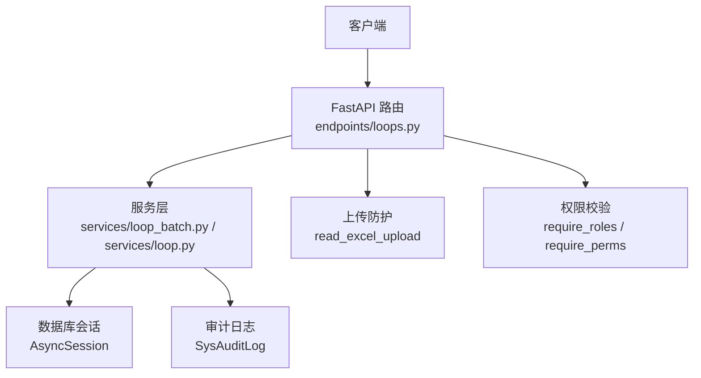
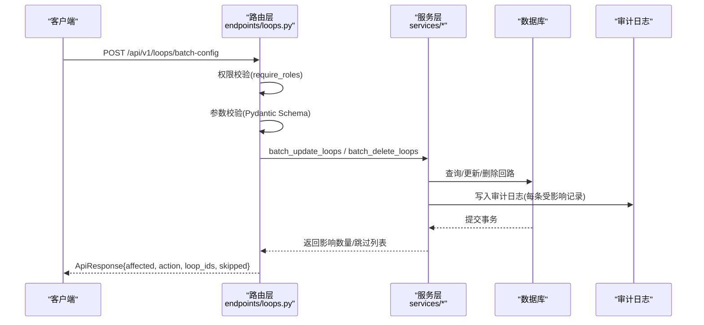
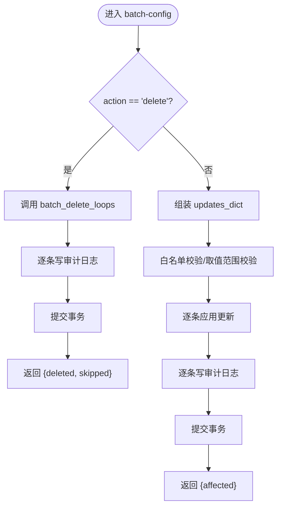
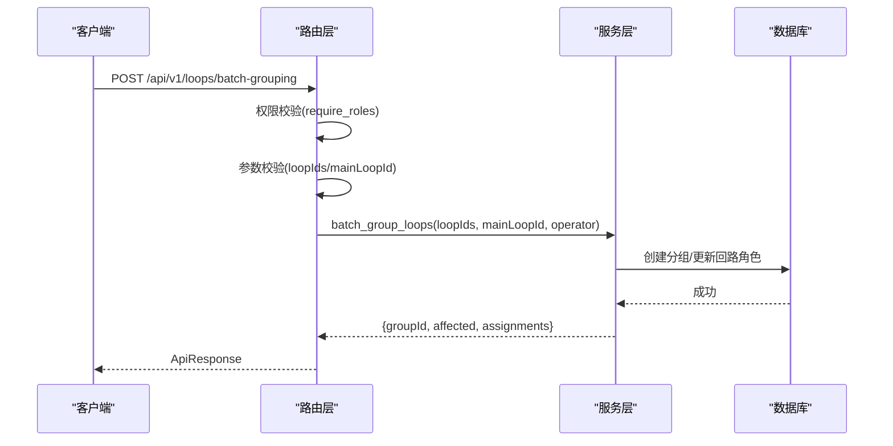
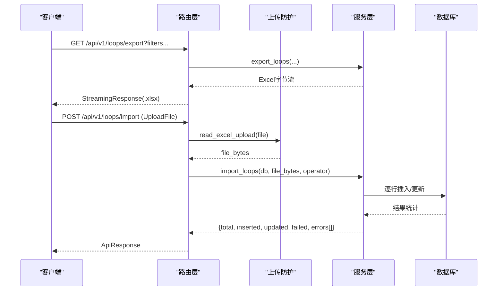
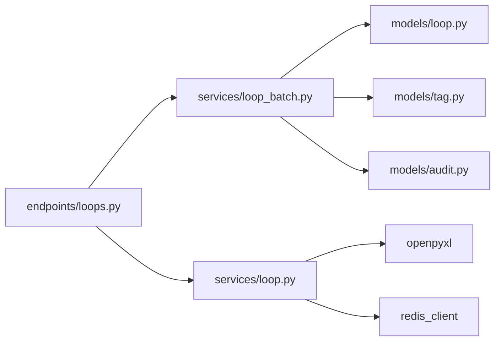

# 批量操作接口

<cite>
**本文引用的文件**
- [backend/app/api/v1/endpoints/loops.py](file://backend/app/api/v1/endpoints/loops.py)
- [backend/app/schemas/loop_batch.py](file://backend/app/schemas/loop_batch.py)
- [backend/app/schemas/loop.py](file://backend/app/schemas/loop.py)
- [backend/app/services/loop_batch.py](file://backend/app/services/loop_batch.py)
- [backend/app/services/loop.py](file://backend/app/services/loop.py)
- [backend/tests/test_loop_batch.py](file://backend/tests/test_loop_batch.py)
- [backend/tests/test_loop_complex_grouping.py](file://backend/tests/test_loop_complex_grouping.py)
</cite>

## 目录
1. [简介](#简介)
2. [项目结构](#项目结构)
3. [核心组件](#核心组件)
4. [架构总览](#架构总览)
5. [详细组件分析](#详细组件分析)
6. [依赖关系分析](#依赖关系分析)
7. [性能考虑](#性能考虑)
8. [故障排查指南](#故障排查指南)
9. [结论](#结论)
10. [附录：完整示例与最佳实践](#附录完整示例与最佳实践)

## 简介
本章节面向 CLPM-MVP 的“回路批量操作”能力，提供完整的 API 文档与实现说明。覆盖以下能力：
- 批量配置接口（POST /api/v1/loops/batch-config）：支持批量更新监控状态、统计启用、重要等级、参评状态等；也支持批量删除模式。
- 批量分组接口（POST /api/v1/loops/batch-grouping）：将多个回路归并为复杂控制回路组，支持指定主回路并自动分配角色。
- 批量导入导出接口：Excel 导入（POST /api/v1/loops/import）与导出（GET /api/v1/loops/export）。
- 权限控制、事务处理、错误处理与审计日志机制。
- 完整调用示例与最佳实践建议。

## 项目结构
批量操作相关代码主要分布在以下位置：
- 路由层：后端 FastAPI 路由定义在 endpoints/loops.py，集中声明固定路径优先的 /batch-config、/batch-grouping、/export、/import 等端点。
- 数据契约：请求/响应模型定义在 schemas/loop_batch.py 与 schemas/loop.py。
- 服务层：业务逻辑封装在 services/loop_batch.py（批量更新/删除）与 services/loop.py（导入/导出、复杂分组等）。
- 测试用例：验证行为与边界条件，位于 tests/test_loop_batch.py 与 tests/test_loop_complex_grouping.py。

图表来源
- [backend/app/api/v1/endpoints/loops.py:186-265](file://backend/app/api/v1/endpoints/loops.py#L186-L265)
- [backend/app/services/loop_batch.py:64-171](file://backend/app/services/loop_batch.py#L64-L171)
- [backend/app/services/loop.py:328-373](file://backend/app/services/loop.py#L328-L373)

章节来源
- [backend/app/api/v1/endpoints/loops.py:1-21](file://backend/app/api/v1/endpoints/loops.py#L1-L21)

## 核心组件
- 批量配置（Batch Config）
  - 功能：批量更新回路的监控状态、统计启用、重要等级、参评状态；或批量删除。
  - 入口：POST /api/v1/loops/batch-config
  - 权限：仅 ADMIN
  - 关键约束：isMonitored 与 isStatEnabled 互斥（当前共用 is_active 字段），action=delete 时不得同时提供 updates。
- 批量分组（Batch Grouping）
  - 功能：将 2-20 个回路归并为复杂控制回路组，指定一个 MAIN 回路，其余自动为 SUB。
  - 入口：POST /api/v1/loops/batch-grouping
  - 权限：ADMIN 或 IC_ENGINEER
- 导入导出（Import/Export）
  - 导出：GET /api/v1/loops/export，返回 .xlsx 流式下载。
  - 导入：POST /api/v1/loops/import，接收 .xlsx 文件，逐行处理（存在则更新，不存在则新建）。

章节来源
- [backend/app/api/v1/endpoints/loops.py:186-265](file://backend/app/api/v1/endpoints/loops.py#L186-L265)
- [backend/app/schemas/loop_batch.py:13-83](file://backend/app/schemas/loop_batch.py#L13-L83)
- [backend/app/schemas/loop.py:499-525](file://backend/app/schemas/loop.py#L499-L525)
- [backend/app/api/v1/endpoints/loops.py:328-373](file://backend/app/api/v1/endpoints/loops.py#L328-L373)

## 架构总览
批量操作的端到端流程如下：
- 客户端发起请求，经过权限校验与参数校验。
- 路由层调用服务层方法执行具体业务逻辑。
- 服务层进行数据一致性校验、写入数据库、记录审计日志。
- 返回统一 ApiResponse 包装的结果。

图表来源
- [backend/app/api/v1/endpoints/loops.py:186-240](file://backend/app/api/v1/endpoints/loops.py#L186-L240)
- [backend/app/services/loop_batch.py:64-171](file://backend/app/services/loop_batch.py#L64-L171)
- [backend/app/services/loop_batch.py:179-280](file://backend/app/services/loop_batch.py#L179-L280)

## 详细组件分析

### 批量配置接口（POST /api/v1/loops/batch-config）
- 功能概述
  - 更新模式：通过 updates 字段批量设置 is_monitored、is_stat_enabled、importance_level、include_in_evaluation。
  - 删除模式：action="delete"，批量硬删除回路（解绑 Tag 映射 + 级联清理关联数据）。
- 权限控制
  - 仅允许 ADMIN 角色调用。
- 参数校验
  - loop_ids 非空。
  - action=delete 时不能提供 updates。
  - 非删除模式必须提供 updates，且至少包含一个待更新字段。
  - is_monitored 与 is_stat_enabled 互斥（避免共用 is_active 字段的静默覆盖）。
- 事务与审计
  - 每个受影响的回路都会写入审计日志（before/after 快照）。
  - 批量更新/删除在同一会话中提交。
- 返回值
  - affected：受影响的数量。
  - action：update 或 delete。
  - loop_ids：本次操作的回路 ID 列表。
  - skipped：仅删除模式下返回跳过的条目（含原因）。

图表来源
- [backend/app/api/v1/endpoints/loops.py:186-240](file://backend/app/api/v1/endpoints/loops.py#L186-L240)
- [backend/app/services/loop_batch.py:64-171](file://backend/app/services/loop_batch.py#L64-L171)
- [backend/app/services/loop_batch.py:179-280](file://backend/app/services/loop_batch.py#L179-L280)

章节来源
- [backend/app/api/v1/endpoints/loops.py:186-240](file://backend/app/api/v1/endpoints/loops.py#L186-L240)
- [backend/app/schemas/loop_batch.py:13-83](file://backend/app/schemas/loop_batch.py#L13-L83)
- [backend/app/services/loop_batch.py:64-171](file://backend/app/services/loop_batch.py#L64-L171)
- [backend/app/services/loop_batch.py:179-280](file://backend/app/services/loop_batch.py#L179-L280)

### 批量分组接口（POST /api/v1/loops/batch-grouping）
- 功能概述
  - 将 2-20 个回路归并为复杂控制回路组，系统自动生成 group ID。
  - 指定 mainLoopId 作为 MAIN 回路，其余自动分配为 SUB。
- 权限控制
  - 允许 ADMIN 或 IC_ENGINEER 角色调用。
- 参数校验
  - loopIds 长度限制 2-20。
  - mainLoopId 必填且必须在 loopIds 中。
- 返回值
  - groupId：新创建的分组 ID。
  - affected：受影响回路数。
  - assignments：各回路的角色分配（MAIN/SUB）。

图表来源
- [backend/app/api/v1/endpoints/loops.py:248-265](file://backend/app/api/v1/endpoints/loops.py#L248-L265)
- [backend/app/schemas/loop.py:499-525](file://backend/app/schemas/loop.py#L499-L525)

章节来源
- [backend/app/api/v1/endpoints/loops.py:248-265](file://backend/app/api/v1/endpoints/loops.py#L248-L265)
- [backend/app/schemas/loop.py:499-525](file://backend/app/schemas/loop.py#L499-L525)
- [backend/tests/test_loop_complex_grouping.py:119-160](file://backend/tests/test_loop_complex_grouping.py#L119-L160)

### 导入导出接口（Excel）
- 导出（GET /api/v1/loops/export）
  - 支持按装置/单元、状态、关键词、控制类型、重要等级、参评状态、回路类型筛选。
  - 返回 .xlsx 文件流，Content-Type 为 Excel 二进制流。
  - 权限：ADMIN、IC_ENGINEER、PE_ENGINEER。
- 导入（POST /api/v1/loops/import）
  - 接收 .xlsx 文件，逐行处理：若回路编号已存在则更新，否则新建。
  - 返回 total、inserted、updated、failed、errors[]。
  - 权限：ADMIN、IC_ENGINEER。

图表来源
- [backend/app/api/v1/endpoints/loops.py:328-373](file://backend/app/api/v1/endpoints/loops.py#L328-L373)
- [backend/app/services/loop.py:328-373](file://backend/app/services/loop.py#L328-L373)

章节来源
- [backend/app/api/v1/endpoints/loops.py:328-373](file://backend/app/api/v1/endpoints/loops.py#L328-L373)
- [backend/app/services/loop.py:328-373](file://backend/app/services/loop.py#L328-L373)

## 依赖关系分析
- 路由层依赖
  - 权限校验：require_roles / require_perms。
  - 上传防护：read_excel_upload。
  - 服务层：loop_batch、loop 等服务函数。
- 服务层依赖
  - 数据库会话：AsyncSession。
  - 模型：LoopLedger、LoopTagMapping、TagRegistry、SysAuditLog。
  - 工具：openpyxl（导出）、Redis（缓存失效，部分场景）。
- 外部集成点
  - PostgreSQL 持久化。
  - TDengine 时序库（Tag 重关联时涉及 subtable 解析缓存失效）。

图表来源
- [backend/app/api/v1/endpoints/loops.py:27-73](file://backend/app/api/v1/endpoints/loops.py#L27-L73)
- [backend/app/services/loop_batch.py:17-24](file://backend/app/services/loop_batch.py#L17-L24)
- [backend/app/services/loop.py:19-31](file://backend/app/services/loop.py#L19-L31)

章节来源
- [backend/app/api/v1/endpoints/loops.py:27-73](file://backend/app/api/v1/endpoints/loops.py#L27-L73)
- [backend/app/services/loop_batch.py:17-24](file://backend/app/services/loop_batch.py#L17-L24)
- [backend/app/services/loop.py:19-31](file://backend/app/services/loop.py#L19-L31)

## 性能考虑
- 批量更新/删除
  - 使用 IN 查询一次性获取目标回路，减少往返。
  - 逐条写审计日志，但整体在一个会话中提交，降低锁竞争。
- 导入导出
  - 导出采用流式响应，避免大文件内存占用。
  - 导入逐行处理，便于错误隔离与统计。
- 缓存与一致性
  - Tag 重关联会触发 L1 DataBlock 与 subtable 解析缓存失效，确保历史数据访问一致性。

[本节为通用性能指导，不直接分析具体文件]

## 故障排查指南
- 常见错误码与场景
  - ERR_BATCH_EMPTY：批量操作传入的 loop_ids 为空。
  - ERR_BATCH_INVALID_FIELD：批量更新字段不在白名单或取值非法（如 importance_level 不为 1/2/3）。
  - 参数校验失败：Pydantic 校验（如 is_monitored 与 is_stat_enabled 同时传值、action=delete 时提供 updates）。
- 权限问题
  - 非 ADMIN 调用 batch-config 将被拒绝。
  - 非 ADMIN/IC_ENGINEER 调用 batch-grouping 将被拒绝。
  - 非授权角色调用 import/export 将被拒绝。
- 导入导出问题
  - 文件格式不支持或非 .xlsx：由上传防护拦截。
  - 导入失败：检查 errors[] 中的具体错误信息。
- 审计日志
  - 所有写操作均记录审计日志，可通过 SysAuditLog 表回溯变更前后值。

章节来源
- [backend/app/services/loop_batch.py:90-114](file://backend/app/services/loop_batch.py#L90-L114)
- [backend/app/schemas/loop_batch.py:31-83](file://backend/app/schemas/loop_batch.py#L31-L83)
- [backend/tests/test_loop_batch.py:179-200](file://backend/tests/test_loop_batch.py#L179-L200)

## 结论
CLPM-MVP 的批量操作接口提供了高效、安全的回路管理能力：
- 批量配置支持监控、统计、级别、参评等多维度更新，并提供批量删除能力。
- 批量分组支持复杂控制回路组的快速建立与角色自动分配。
- 导入导出接口满足台账的大规模迁移与备份需求。
- 完善的权限控制、事务处理、错误处理与审计日志机制保障数据安全与可追溯性。

[本节为总结性内容，不直接分析具体文件]

## 附录：完整示例与最佳实践

### 批量配置（POST /api/v1/loops/batch-config）
- 更新模式示例
  - 请求体：
    - loop_ids: ["loop-uuid-1", "loop-uuid-2"]
    - updates: { isMonitored: true }
  - 说明：将两个回路的监控状态设为启用。
- 删除模式示例
  - 请求体：
    - loop_ids: ["loop-uuid-1", "loop-uuid-2"]
    - action: "delete"
  - 说明：批量硬删除回路，返回 deleted 与 skipped 列表。
- 最佳实践
  - 分批次操作：每次不超过数百条，避免长事务。
  - 先校验再调用：前端对 loop_ids 去重与格式校验。
  - 谨慎使用 isMonitored 与 isStatEnabled 同时更新（当前互斥）。

章节来源
- [backend/app/schemas/loop_batch.py:45-83](file://backend/app/schemas/loop_batch.py#L45-L83)
- [backend/app/api/v1/endpoints/loops.py:186-240](file://backend/app/api/v1/endpoints/loops.py#L186-L240)

### 批量分组（POST /api/v1/loops/batch-grouping）
- 示例
  - 请求体：
    - loopIds: ["main-uuid", "sub1-uuid", "sub2-uuid"]
    - mainLoopId: "main-uuid"
  - 说明：将三个回路归为一组，main-uuid 为主回路，其余为子回路。
- 最佳实践
  - 保证 mainLoopId 在 loopIds 中。
  - 控制 loopIds 数量在 2-20 之间。
  - 分组后通过 complex-groups 查询确认成员与主回路位号。

章节来源
- [backend/app/schemas/loop.py:499-525](file://backend/app/schemas/loop.py#L499-L525)
- [backend/app/api/v1/endpoints/loops.py:248-265](file://backend/app/api/v1/endpoints/loops.py#L248-L265)

### 导入导出（Excel）
- 导出（GET /api/v1/loops/export）
  - 示例：GET /api/v1/loops/export?plantNodeId=xxx&status=READY&keyword=TAG
  - 说明：根据筛选条件导出 .xlsx 文件。
- 导入（POST /api/v1/loops/import）
  - 示例：POST /api/v1/loops/import (multipart/form-data, file=.xlsx)
  - 说明：逐行处理，返回 total、inserted、updated、failed、errors[]。
- 最佳实践
  - 导出前明确筛选条件，减少文件大小。
  - 导入前准备标准模板，确保列名与数据类型正确。
  - 导入失败时根据 errors[] 定位问题行并修正重试。

章节来源
- [backend/app/api/v1/endpoints/loops.py:328-373](file://backend/app/api/v1/endpoints/loops.py#L328-L373)