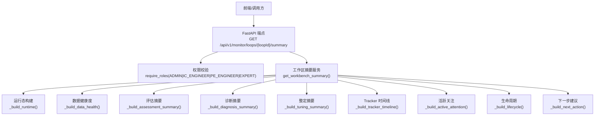
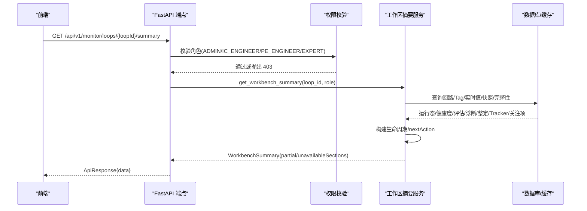
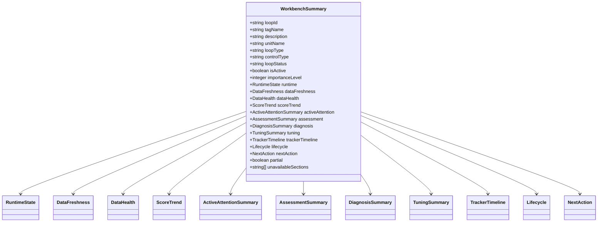

# 工作台摘要接口

<cite>
**本文引用的文件**
- [monitor.py](file://backend/app/api/v1/endpoints/monitor.py)
- [workbench_summary.py](file://backend/app/services/workbench_summary.py)
- [workbench_summary_schemas.py](file://backend/app/schemas/workbench_summary.py)
- [deps.py](file://backend/app/api/deps.py)
- [test_workbench_summary.py](file://backend/tests/test_workbench_summary.py)
</cite>

## 目录
1. [简介](#简介)
2. [项目结构](#项目结构)
3. [核心组件](#核心组件)
4. [架构总览](#架构总览)
5. [详细组件分析](#详细组件分析)
6. [依赖关系分析](#依赖关系分析)
7. [性能与容错特性](#性能与容错特性)
8. [故障排查指南](#故障排查指南)
9. [结论](#结论)
10. [附录：请求与响应规范](#附录请求与响应规范)

## 简介
本接口为 CLPM-MVP 监控管理模块的“工作台首屏摘要”聚合接口，一次返回首屏所需的全部数据：运行态、数据健康度、评分趋势、活跃关注、评估/诊断/整定摘要、Tracker 时间线、生命周期信息与 nextAction。接口具备角色权限控制（ADMIN/IC_ENGINEER/PE_ENGINEER/EXPERT），并内置 partial=true 的容错机制，当某个数据来源失败时仅标记 unavailableSections，不导致整页 500。

## 项目结构
- 路由层：FastAPI 端点定义在 monitor.py，暴露 GET /api/v1/monitor/loops/{loopId}/summary。
- 服务层：workbench_summary.py 实现聚合逻辑，包含运行态、数据新鲜度、数据健康度、评估/诊断/整定摘要、活跃关注、生命周期、nextAction 等构建器。
- 模型层：schemas/workbench_summary.py 定义所有响应数据结构与枚举。
- 权限层：deps.py 提供 require_roles 校验，限制访问角色。
- 测试：test_workbench_summary.py 覆盖部分失败容错、生命周期状态、nextAction 角色过滤等。

图表来源
- [monitor.py:83-97](file://backend/app/api/v1/endpoints/monitor.py#L83-L97)
- [workbench_summary.py:951-1139](file://backend/app/services/workbench_summary.py#L951-L1139)

章节来源
- [monitor.py:1-98](file://backend/app/api/v1/endpoints/monitor.py#L1-L98)
- [workbench_summary.py:1-1178](file://backend/app/services/workbench_summary.py#L1-L1178)
- [workbench_summary_schemas.py:1-353](file://backend/app/schemas/workbench_summary.py#L1-L353)
- [deps.py:135-153](file://backend/app/api/deps.py#L135-L153)

## 核心组件
- 路由端点：负责参数解析、权限校验、调用服务并返回统一 ApiResponse。
- 聚合服务：按顺序组装各子模块结果，捕获异常并记录 unavailableSections，最终输出 WorkbenchSummary。
- Schema 模型：严格定义字段类型、枚举值、描述信息，保证前后端契约一致。
- 权限控制：基于角色白名单限制访问；不同角色对 nextAction 的 enabled 状态进行差异化控制。

章节来源
- [monitor.py:83-97](file://backend/app/api/v1/endpoints/monitor.py#L83-L97)
- [workbench_summary.py:951-1139](file://backend/app/services/workbench_summary.py#L951-L1139)
- [workbench_summary_schemas.py:319-353](file://backend/app/schemas/workbench_summary.py#L319-L353)
- [deps.py:135-153](file://backend/app/api/deps.py#L135-L153)

## 架构总览

图表来源
- [monitor.py:83-97](file://backend/app/api/v1/endpoints/monitor.py#L83-L97)
- [workbench_summary.py:951-1139](file://backend/app/services/workbench_summary.py#L951-L1139)
- [deps.py:135-153](file://backend/app/api/deps.py#L135-L153)

## 详细组件分析

### 接口定义与权限控制
- 路径与方法：GET /api/v1/monitor/loops/{loopId}/summary
- 路径参数：
  - loopId：字符串 UUID，服务端会校验合法性，非法将返回 400。
- 权限：
  - 使用 require_roles("ADMIN", "IC_ENGINEER", "PE_ENGINEER", "EXPERT") 进行角色白名单校验。
  - 未授权角色将被拒绝（403）。
- 返回值：统一 ApiResponse 包裹的 WorkbenchSummary。

章节来源
- [monitor.py:83-97](file://backend/app/api/v1/endpoints/monitor.py#L83-L97)
- [deps.py:135-153](file://backend/app/api/deps.py#L135-L153)

### 运行态与数据新鲜度
- 运行态（RuntimeState）：
  - 字段包括 pv/sp/op/mode/mode_label/pv_quality/pv_unit/pv_range/op_range/read_at/control_mode。
  - 数据来源：Redis 实时缓存优先，回退到 Tag 注册表 current_value。
- 数据新鲜度（DataFreshness）：
  - 由服务端根据 readAt 与配置阈值 SIGNALR_STALL_TIMEOUT_SECONDS 计算 status（FRESH/DELAYED/UNKNOWN）。
  - threshold_seconds 复用实时链路停滞配置，reason 提供可读解释。

章节来源
- [workbench_summary_schemas.py:68-94](file://backend/app/schemas/workbench_summary.py#L68-L94)
- [workbench_summary.py:102-258](file://backend/app/services/workbench_summary.py#L102-L258)

### 数据健康度与评分趋势
- 数据健康度（DataHealth）：
  - valid_rate、confidence_level、pv_completeness、overall_completeness、integrity_status。
  - 数据来源：KpiSnapshotHourly、LoopConfidenceLatest、LoopIntegritySnapshot。
- 评分趋势（ScoreTrend）：
  - score、score_delta、day_trend、result_at、confidence_level、status。
  - day_trend 依据较昨日评分变化判定（NEW/WORSENED/IMPROVED/FLAT）。

章节来源
- [workbench_summary_schemas.py:101-120](file://backend/app/schemas/workbench_summary.py#L101-L120)
- [workbench_summary.py:287-343](file://backend/app/services/workbench_summary.py#L287-L343)
- [workbench_summary.py:1142-1178](file://backend/app/services/workbench_summary.py#L1142-L1178)

### 活跃关注项汇总
- ActiveAttentionSummary：
  - total、highest_priority、items（最多 3 条明细）。
  - 复用 monitor_attention 列表接口，按 loopId 精确筛选。

章节来源
- [workbench_summary_schemas.py:127-136](file://backend/app/schemas/workbench_summary.py#L127-L136)
- [workbench_summary.py:520-550](file://backend/app/services/workbench_summary.py#L520-L550)

### 评估/诊断/整定摘要
- 评估摘要（AssessmentSummary）：
  - 最新 KPI 快照，不含趋势数组；包含 score/confidence/status/result_at/time_window/summary。
- 诊断摘要（DiagnosisSummary）：
  - MVP 精简：已屏蔽诊断模块，恒返回 None。
- 整定摘要（TuningSummary）：
  - MVP 精简：已屏蔽整定模块，恒返回 None。

章节来源
- [workbench_summary_schemas.py:143-184](file://backend/app/schemas/workbench_summary.py#L143-L184)
- [workbench_summary.py:346-353](file://backend/app/services/workbench_summary.py#L346-L353)

### Tracker 时间线与实施前后对比
- TrackerTimeline：
  - 展示最新开放 Tracker 及其实施/验证状态；MVP 精简：已屏蔽整改模块，恒返回 None。
- EffectCompare（结构化实施前后对比）：
  - 复用 tracker.ab_compare_summary 存储快照；状态 PENDING/INCONCLUSIVE/COMPLETED；包含 score_change、core_kpi_changes、pid_before/after、time_window、confidence、reason。

章节来源
- [workbench_summary_schemas.py:191-277](file://backend/app/schemas/workbench_summary.py#L191-L277)
- [workbench_summary.py:361-513](file://backend/app/services/workbench_summary.py#L361-L513)

### 生命周期与 nextAction
- 生命周期（Lifecycle）：
  - 五阶段 MONITOR/ASSESS/DIAGNOSE/TUNE/VERIFY，每阶段含 stage/status/result_at/reason。
  - current_stage 为第一个未完成/阻塞/超期/进行中的阶段。
- nextAction（NextAction）：
  - 唯一主动作，按优先级规则生成；enabled/disabledReason 按角色控制。
  - 动作类型：OPEN_WORKBENCH/RUN_ASSESSMENT/RUN_DIAGNOSIS/CREATE_TRACKER/RUN_TUNING/RECORD_IMPLEMENTATION/VERIFY_EFFECT/IMPORT_DATA/FIX_TAG_CONFIG/CONTINUE_MONITORING/VIEW_DETAIL。

章节来源
- [workbench_summary_schemas.py:284-312](file://backend/app/schemas/workbench_summary.py#L284-L312)
- [workbench_summary.py:558-733](file://backend/app/services/workbench_summary.py#L558-L733)
- [workbench_summary.py:741-943](file://backend/app/services/workbench_summary.py#L741-L943)

### 主入口与容错机制
- 主入口 get_workbench_summary：
  - 依次构建各子模块，捕获异常并记录 unavailableSections。
  - 若任一来源失败，partial=true，对应字段置空或默认值，其他来源正常返回。
- 错误处理：
  - 非法 loopId → 400。
  - 回路不存在 → 404。
  - 权限不足 → 403。
  - 其他来源异常 → partial=true + unavailableSections。

章节来源
- [workbench_summary.py:951-1139](file://backend/app/services/workbench_summary.py#L951-L1139)
- [test_workbench_summary.py:502-698](file://backend/tests/test_workbench_summary.py#L502-L698)

## 依赖关系分析

图表来源
- [workbench_summary_schemas.py:319-353](file://backend/app/schemas/workbench_summary.py#L319-L353)

章节来源
- [workbench_summary_schemas.py:68-353](file://backend/app/schemas/workbench_summary.py#L68-L353)

## 性能与容错特性
- 性能优化：
  - 摘要禁止返回大数据（趋势数组、FFT 点、仿真曲线），详细数据延迟加载。
  - 运行态优先读取 Redis 缓存，降低数据库压力。
  - 数据新鲜度复用实时链路停滞配置，避免前端维护常量。
- 容错机制：
  - 单个来源失败不影响整体响应，partial=true 且 unavailableSections 列出失败来源。
  - 诊断/整定/Tracker 在 MVP 中已屏蔽，恒返回 None，减少外部依赖风险。
  - 活跃关注项失败时降级为 total=0、items=[]。

章节来源
- [workbench_summary.py:1-18](file://backend/app/services/workbench_summary.py#L1-L18)
- [workbench_summary.py:991-1139](file://backend/app/services/workbench_summary.py#L991-L1139)

## 故障排查指南
- 400 错误：
  - 原因：loopId 非合法 UUID。
  - 处理：检查传入参数格式。
- 404 错误：
  - 原因：回路不存在。
  - 处理：确认 loopId 是否正确，或先创建回路。
- 403 错误：
  - 原因：当前用户角色不在允许列表（ADMIN/IC_ENGINEER/PE_ENGINEER/EXPERT）。
  - 处理：检查用户角色或调整权限策略。
- partial=true：
  - 原因：一个或多个数据来源失败（如数据库/缓存不可用）。
  - 处理：查看 unavailableSections 定位失败来源，检查依赖服务健康状态。

章节来源
- [workbench_summary.py:967-981](file://backend/app/services/workbench_summary.py#L967-L981)
- [workbench_summary.py:991-1139](file://backend/app/services/workbench_summary.py#L991-L1139)
- [test_workbench_summary.py:502-698](file://backend/tests/test_workbench_summary.py#L502-L698)

## 结论
该接口以 BFF 聚合模式一次性返回工作台首屏所需全部数据，具备完善的权限控制与容错机制。通过 partial/unavailableSections 提升系统健壮性，通过 nextAction 与生命周期引导用户操作。MVP 阶段屏蔽了诊断/整定/Tracker 模块，简化依赖并聚焦核心能力。

## 附录：请求与响应规范

### 请求
- 方法：GET
- 路径：/api/v1/monitor/loops/{loopId}/summary
- 路径参数：
  - loopId：字符串 UUID，必填。
- 认证：需携带有效 JWT Token。
- 权限：角色需为 ADMIN/IC_ENGINEER/PE_ENGINEER/EXPERT。

### 响应
- 统一包装：ApiResponse{data: WorkbenchSummary}
- WorkbenchSummary 主要字段：
  - loopId、tagName、description、unitName、loopType、controlType、loopStatus、isActive、importanceLevel
  - runtime：运行态（pv/sp/op/mode/mode_label/pv_quality/pv_unit/pv_range/op_range/read_at/control_mode）
  - dataFreshness：数据新鲜度（status/threshold_seconds/reason）
  - dataHealth：数据健康度（valid_rate/confidence_level/pv_completeness/overall_completeness/integrity_status）
  - scoreTrend：评分趋势（score/score_delta/day_trend/result_at/confidence_level/status）
  - activeAttention：活跃关注汇总（total/highest_priority/items）
  - assessment：评估摘要（可选）
  - diagnosis：诊断摘要（MVP 为 None）
  - tuning：整定摘要（MVP 为 None）
  - trackerTimeline：Tracker 时间线（MVP 为 None）
  - lifecycle：生命周期（stages/currentStage）
  - nextAction：推荐下一步（action_type/label/reason/enabled/disabled_reason/target）
  - partial：是否有来源失败
  - unavailableSections：失败来源列表

### 不同角色下的响应差异示例
- ADMIN/IC_ENGINEER：
  - nextAction.enabled 可为 True（写权限充足）。
  - 例如：RUN_ASSESSMENT、RUN_DIAGNOSIS、CREATE_TRACKER、RECORD_IMPLEMENTATION、RUN_TUNING 可启用。
- PE_ENGINEER：
  - nextAction 写动作 disabled（无写权限），但结构相同。
  - 例如：RUN_ASSESSMENT 可能返回 enabled=false，disabledReason="当前角色无写权限"。
- EXPERT：
  - 可执行整定相关动作（RUN_TUNING），其他写动作可能受限。
  - 例如：RUN_TUNING.enabled=true，其他写动作 disabled。

章节来源
- [workbench_summary.py:741-943](file://backend/app/services/workbench_summary.py#L741-L943)
- [test_workbench_summary.py:648-698](file://backend/tests/test_workbench_summary.py#L648-L698)