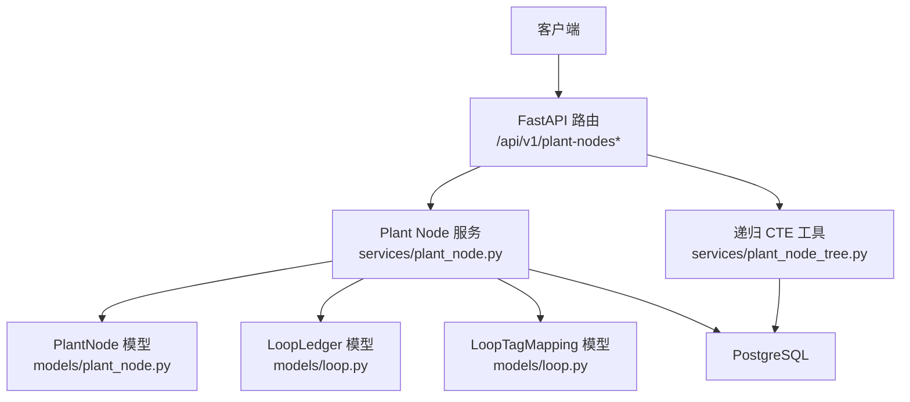
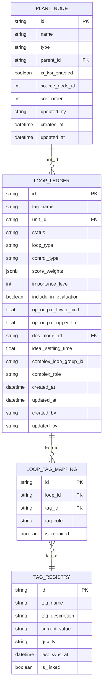
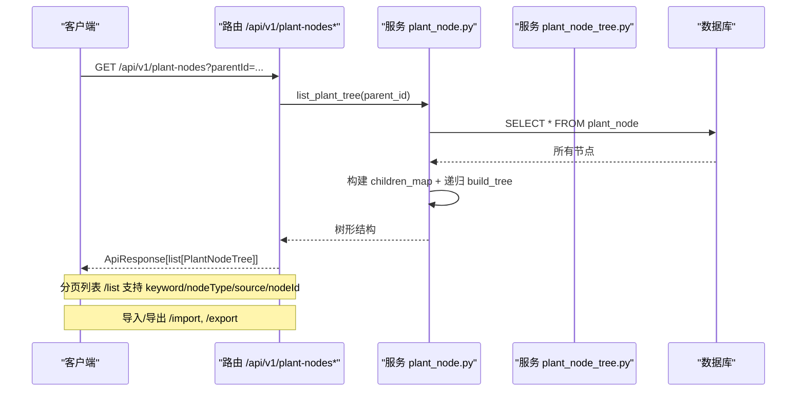
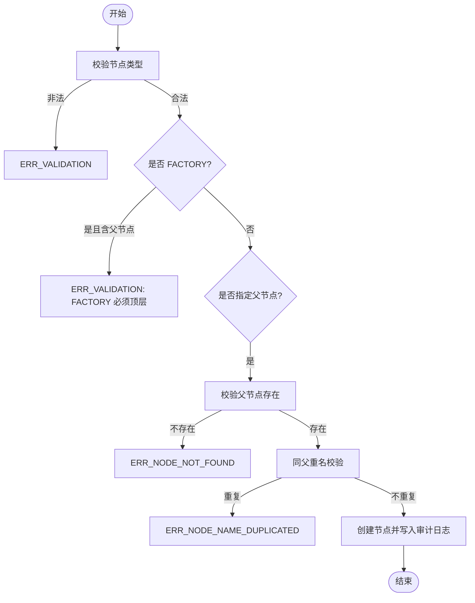
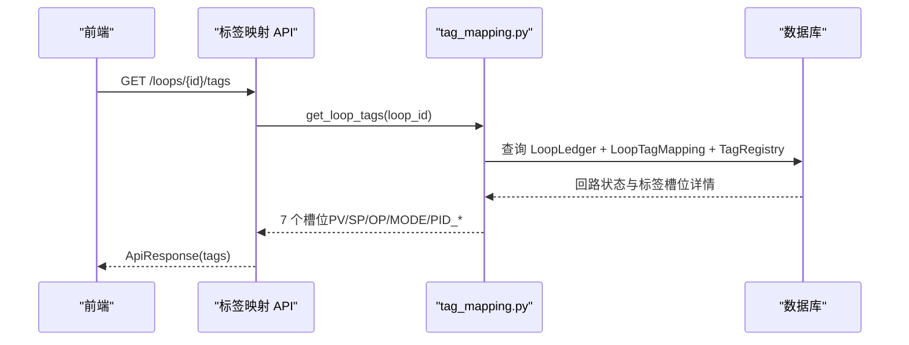
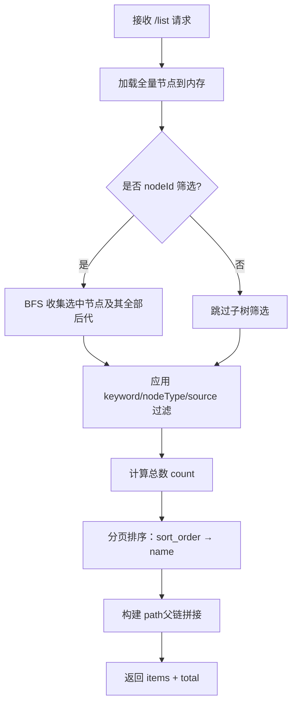
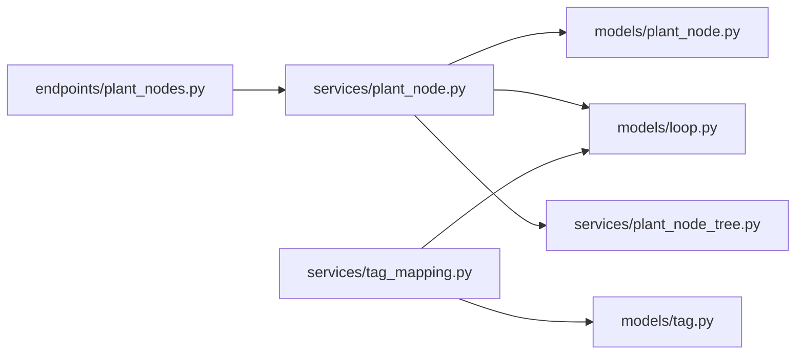

# 工厂节点接口

<cite>
**本文引用的文件**
- [backend/app/api/v1/endpoints/plant_nodes.py](file://backend/app/api/v1/endpoints/plant_nodes.py)
- [backend/app/models/plant_node.py](file://backend/app/models/plant_node.py)
- [backend/app/schemas/plant_node.py](file://backend/app/schemas/plant_node.py)
- [backend/app/services/plant_node.py](file://backend/app/services/plant_node.py)
- [backend/app/services/plant_node_tree.py](file://backend/app/services/plant_node_tree.py)
- [backend/app/models/loop.py](file://backend/app/models/loop.py)
- [backend/app/services/tag_mapping.py](file://backend/app/services/tag_mapping.py)
- [backend/tests/test_plant_node.py](file://backend/tests/test_plant_node.py)
</cite>

## 目录
1. [简介](#简介)
2. [项目结构](#项目结构)
3. [核心组件](#核心组件)
4. [架构总览](#架构总览)
5. [详细组件分析](#详细组件分析)
6. [依赖关系分析](#依赖关系分析)
7. [性能考虑](#性能考虑)
8. [故障排查指南](#故障排查指南)
9. [结论](#结论)
10. [附录：API 参考与示例](#附录api-参考与示例)

## 简介
本文件为 CLPM-MVP 监控管理模块的“工厂节点”功能提供完整的 API 文档。内容覆盖：
- 工厂节点树形结构接口：获取节点层级结构、节点详细信息、设备信息（通过回路关联）
- 节点关系管理：父子节点关系、节点类型定义、节点属性配置
- 节点与回路的关联：标签映射、数据源绑定、权限继承机制
- 节点树的遍历查询、搜索过滤和批量操作接口
- 节点结构图、API 调用示例与错误处理指南

## 项目结构
后端采用 FastAPI 分层设计：
- API 层：路由定义与参数校验
- 服务层：业务逻辑（树构建、CRUD、导入导出、递归子节点收集）
- 模型层：数据库实体（plant_node、loop_ledger、loop_tag_mapping）
- Schema 层：请求/响应数据结构定义

图表来源
- [backend/app/api/v1/endpoints/plant_nodes.py:1-258](file://backend/app/api/v1/endpoints/plant_nodes.py#L1-L258)
- [backend/app/services/plant_node.py:1-607](file://backend/app/services/plant_node.py#L1-L607)
- [backend/app/services/plant_node_tree.py:1-54](file://backend/app/services/plant_node_tree.py#L1-L54)
- [backend/app/models/plant_node.py:1-90](file://backend/app/models/plant_node.py#L1-L90)
- [backend/app/models/loop.py:33-187](file://backend/app/models/loop.py#L33-L187)

章节来源
- [backend/app/api/v1/endpoints/plant_nodes.py:1-258](file://backend/app/api/v1/endpoints/plant_nodes.py#L1-L258)
- [backend/app/services/plant_node.py:1-607](file://backend/app/services/plant_node.py#L1-L607)
- [backend/app/models/plant_node.py:1-90](file://backend/app/models/plant_node.py#L1-L90)

## 核心组件
- 路由端点：提供树形列表、分页列表、创建、更新、删除、Excel 导入/导出
- 服务函数：树构建、CRUD、导入导出、递归子节点 ID 收集
- 数据模型：工厂节点三层结构（FACTORY → AREA → UNIT），回路表与标签映射表
- Schema：统一的请求/响应结构，支持驼峰命名

章节来源
- [backend/app/api/v1/endpoints/plant_nodes.py:1-258](file://backend/app/api/v1/endpoints/plant_nodes.py#L1-L258)
- [backend/app/schemas/plant_node.py:1-105](file://backend/app/schemas/plant_node.py#L1-L105)
- [backend/app/models/plant_node.py:1-90](file://backend/app/models/plant_node.py#L1-L90)
- [backend/app/models/loop.py:33-187](file://backend/app/models/loop.py#L33-L187)

## 架构总览
工厂节点以三层树组织，回路挂在 UNIT 节点下；节点与回路通过 unit_id 关联；回路通过 loop_tag_mapping 将 PV/SP/OP/MODE/PID_* 等 Tag 角色与 tag_registry 绑定。

图表来源
- [backend/app/models/plant_node.py:26-90](file://backend/app/models/plant_node.py#L26-L90)
- [backend/app/models/loop.py:33-187](file://backend/app/models/loop.py#L33-L187)

## 详细组件分析

### 工厂节点树形结构接口
- 获取完整树或指定父节点的子树
- 分页列表：支持名称模糊搜索、类型筛选、来源筛选（AAS 同步/本地维护）、按选中节点及其子树筛选
- 导出 Excel：包含节点名称、类型、父节点名称、是否参评、层级路径
- 导入 Excel：逐行处理，存在则更新，不存在则新建，返回统计与错误明细

图表来源
- [backend/app/api/v1/endpoints/plant_nodes.py:49-159](file://backend/app/api/v1/endpoints/plant_nodes.py#L49-L159)
- [backend/app/services/plant_node.py:58-88](file://backend/app/services/plant_node.py#L58-L88)
- [backend/app/services/plant_node_tree.py:20-50](file://backend/app/services/plant_node_tree.py#L20-L50)

章节来源
- [backend/app/api/v1/endpoints/plant_nodes.py:49-159](file://backend/app/api/v1/endpoints/plant_nodes.py#L49-L159)
- [backend/app/services/plant_node.py:58-88](file://backend/app/services/plant_node.py#L58-L88)

### 节点 CRUD 与关系管理
- 创建节点：校验类型合法、FACTORY 必须顶层、父节点存在性、同父重名唯一约束
- 更新节点：改名时同父重名校验，支持设置是否纳入性能评估与排序
- 删除节点：存在子节点或关联回路时拒绝删除
- 父子关系：通过 parent_id 自引用实现三层结构（FACTORY→AREA→UNIT）
- 节点类型：限制为 FACTORY/AREA/UNIT
- 节点属性：is_kpi_enabled、sort_order、source_node_id（AAS 同步标记）、updated_by

图表来源
- [backend/app/services/plant_node.py:91-169](file://backend/app/services/plant_node.py#L91-L169)

章节来源
- [backend/app/services/plant_node.py:91-169](file://backend/app/services/plant_node.py#L91-L169)
- [backend/app/models/plant_node.py:26-90](file://backend/app/models/plant_node.py#L26-L90)

### 节点与回路的关联关系
- 节点与回路：LoopLedger.unit_id 指向 PlantNode.id，表示回路归属单元节点
- 标签映射：LoopTagMapping 将回路与 TagRegistry 的 PV/SP/OP/MODE/PID_P/PID_I/PID_D 槽位绑定
- 数据源绑定：TagRegistry 提供当前值、质量码、最后同步时间等运行时元数据
- 权限继承：节点本身无显式权限字段，但可通过节点层级与回路聚合进行访问控制（例如按装置/单元聚合指标）

图表来源
- [backend/app/services/tag_mapping.py:49-115](file://backend/app/services/tag_mapping.py#L49-L115)
- [backend/app/models/loop.py:190-221](file://backend/app/models/loop.py#L190-L221)

章节来源
- [backend/app/models/loop.py:33-187](file://backend/app/models/loop.py#L33-L187)
- [backend/app/services/tag_mapping.py:49-115](file://backend/app/services/tag_mapping.py#L49-L115)

### 节点树遍历、搜索过滤与批量操作
- 遍历查询：list_plant_tree 支持传入 parentId 获取子树；默认从顶层开始
- 搜索过滤：/list 支持 keyword（名称模糊）、nodeType（FACTORY/AREA/UNIT）、source（aas/local）、nodeId（含子树）
- 批量操作：/export 导出 Excel；/import 批量导入，逐行失败不影响其他行（SAVEPOINT）

图表来源
- [backend/app/api/v1/endpoints/plant_nodes.py:62-159](file://backend/app/api/v1/endpoints/plant_nodes.py#L62-L159)

章节来源
- [backend/app/api/v1/endpoints/plant_nodes.py:62-159](file://backend/app/api/v1/endpoints/plant_nodes.py#L62-L159)
- [backend/app/services/plant_node.py:308-371](file://backend/app/services/plant_node.py#L308-L371)
- [backend/app/services/plant_node.py:374-481](file://backend/app/services/plant_node.py#L374-L481)

## 依赖关系分析
- 路由依赖服务：plant_nodes.py 调用 plant_node.py 的服务函数
- 服务依赖模型：plant_node.py 使用 PlantNode、LoopLedger、SysAuditLog
- 递归工具：plant_node_tree.py 提供 WITH RECURSIVE CTE 一次性收集子孙节点 ID
- 标签映射：tag_mapping.py 依赖 LoopLedger、LoopTagMapping、TagRegistry

图表来源
- [backend/app/api/v1/endpoints/plant_nodes.py:1-258](file://backend/app/api/v1/endpoints/plant_nodes.py#L1-L258)
- [backend/app/services/plant_node.py:1-607](file://backend/app/services/plant_node.py#L1-L607)
- [backend/app/services/plant_node_tree.py:1-54](file://backend/app/services/plant_node_tree.py#L1-L54)
- [backend/app/services/tag_mapping.py:1-296](file://backend/app/services/tag_mapping.py#L1-L296)
- [backend/app/models/loop.py:33-187](file://backend/app/models/loop.py#L33-L187)

章节来源
- [backend/app/api/v1/endpoints/plant_nodes.py:1-258](file://backend/app/api/v1/endpoints/plant_nodes.py#L1-L258)
- [backend/app/services/plant_node.py:1-607](file://backend/app/services/plant_node.py#L1-L607)

## 性能考虑
- 树构建：一次查询全量节点后在内存中构建 children_map，避免 N 次 round-trip
- 递归子节点：使用 WITH RECURSIVE CTE 替代 Python 层多次查询，显著降低延迟
- 分页列表：先计数再分页，排序稳定（sort_order → name）
- 导入导出：Excel 流式处理，导入使用 SAVEPOINT 保证单行失败不影响整体事务

[本节为通用性能建议，无需具体文件引用]

## 故障排查指南
常见错误码与处理建议：
- ERR_VALIDATION：节点类型非法或 FACTORY 不能带父节点；检查请求体 type 与 parentId
- ERR_NODE_NOT_FOUND：父节点或目标节点不存在；确认 ID 正确
- ERR_NODE_NAME_DUPLICATED：同级重名；调整名称或父节点
- ERR_NODE_HAS_CHILDREN：删除节点前需先删除子节点；检查子树
- ERR_NODE_HAS_LOOPS：删除节点前需先解绑回路；检查 LoopLedger.unit_id
- ERR_LOOP_NOT_FOUND：回路不存在；检查 loop_id
- ERR_LOOP_TAG_REQUIRED：必填槽位（PV/SP/OP/MODE）至少提供一个；检查标签映射
- ERR_TAG_NOT_FOUND：Tag 不在 tag_registry；先注册 Tag

章节来源
- [backend/app/services/plant_node.py:91-169](file://backend/app/services/plant_node.py#L91-L169)
- [backend/app/services/plant_node.py:232-290](file://backend/app/services/plant_node.py#L232-L290)
- [backend/app/services/tag_mapping.py:49-115](file://backend/app/services/tag_mapping.py#L49-L115)
- [backend/app/services/tag_mapping.py:118-184](file://backend/app/services/tag_mapping.py#L118-L184)

## 结论
工厂节点模块提供了完整的树形结构管理与 CRUD 能力，并通过回路和标签映射实现了与生产数据的深度集成。借助递归 CTE 与内存索引优化，系统在大规模节点场景下仍保持良好性能。配合 Excel 导入导出，便于批量维护与迁移。

[本节为总结，无需具体文件引用]

## 附录：API 参考与示例

### 路由总览
- GET /api/v1/plant-nodes：获取工厂节点树（可传 parentId 限定子树）
- GET /api/v1/plant-nodes/list：分页列表（keyword/nodeType/source/nodeId/page/pageSize）
- POST /api/v1/plant-nodes：创建节点（仅 ADMIN）
- PUT /api/v1/plant-nodes/{nodeId}：更新节点（仅 ADMIN）
- DELETE /api/v1/plant-nodes/{nodeId}：删除节点（仅 ADMIN）
- GET /api/v1/plant-nodes/export：导出 Excel
- POST /api/v1/plant-nodes/import：导入 Excel

章节来源
- [backend/app/api/v1/endpoints/plant_nodes.py:49-258](file://backend/app/api/v1/endpoints/plant_nodes.py#L49-L258)

### 请求/响应结构
- 树节点：PlantNodeTree（id/name/type/parentId/children）
- 列表项：PlantNodeListItem（id/name/type/parentId/parentName/path/isKpiEnabled/sourceNodeId/sortOrder/updatedBy/updatedAt）
- 创建请求：PlantNodeCreate（name/type/parentId）
- 更新请求：PlantNodeUpdate（name/isKpiEnabled/sortOrder）
- 导入结果：PlantNodeImportResult（total/inserted/updated/failed/errors）

章节来源
- [backend/app/schemas/plant_node.py:10-105](file://backend/app/schemas/plant_node.py#L10-L105)

### 调用示例（概念性）
- 获取树：GET /api/v1/plant-nodes
- 分页列表：GET /api/v1/plant-nodes/list?keyword=加氢&nodeType=UNIT&page=1&pageSize=20
- 创建节点：POST /api/v1/plant-nodes {"name":"新单元","type":"UNIT","parentId":"<工厂ID>"}
- 更新节点：PUT /api/v1/plant-nodes/<节点ID> {"name":"新名称","isKpiEnabled":true,"sortOrder":10}
- 删除节点：DELETE /api/v1/plant-nodes/<节点ID>
- 导出：GET /api/v1/plant-nodes/export
- 导入：POST /api/v1/plant-nodes/import (multipart/form-data, file=.xlsx)

[本节为概念性示例，无需具体代码片段]

### 错误处理示例（概念性）
- 400 ERR_VALIDATION：类型非法或 FACTORY 有父节点
- 404 ERR_NODE_NOT_FOUND：父节点或目标节点不存在
- 409 ERR_NODE_NAME_DUPLICATED：同级重名
- 400 ERR_NODE_HAS_CHILDREN：存在子节点无法删除
- 400 ERR_NODE_HAS_LOOPS：存在关联回路无法删除
- 404 ERR_LOOP_NOT_FOUND：回路不存在
- 400 ERR_LOOP_TAG_REQUIRED：必填槽位未提供
- 404 ERR_TAG_NOT_FOUND：Tag 不存在

章节来源
- [backend/app/services/plant_node.py:91-169](file://backend/app/services/plant_node.py#L91-L169)
- [backend/app/services/plant_node.py:232-290](file://backend/app/services/plant_node.py#L232-L290)
- [backend/app/services/tag_mapping.py:49-115](file://backend/app/services/tag_mapping.py#L49-L115)
- [backend/app/services/tag_mapping.py:118-184](file://backend/app/services/tag_mapping.py#L118-L184)

### 测试用例参考
- 认证与授权：未认证返回 401；非 ADMIN 写操作返回 403
- 树列表：成功返回树结构
- 创建节点：成功返回新节点；同名冲突返回 409；非法类型返回 400
- 删除节点：存在子节点返回 400；节点不存在返回 404

章节来源
- [backend/tests/test_plant_node.py:55-200](file://backend/tests/test_plant_node.py#L55-L200)