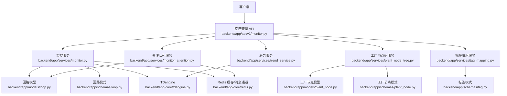
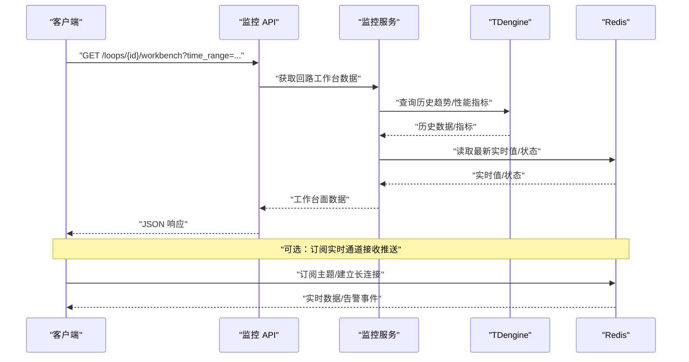
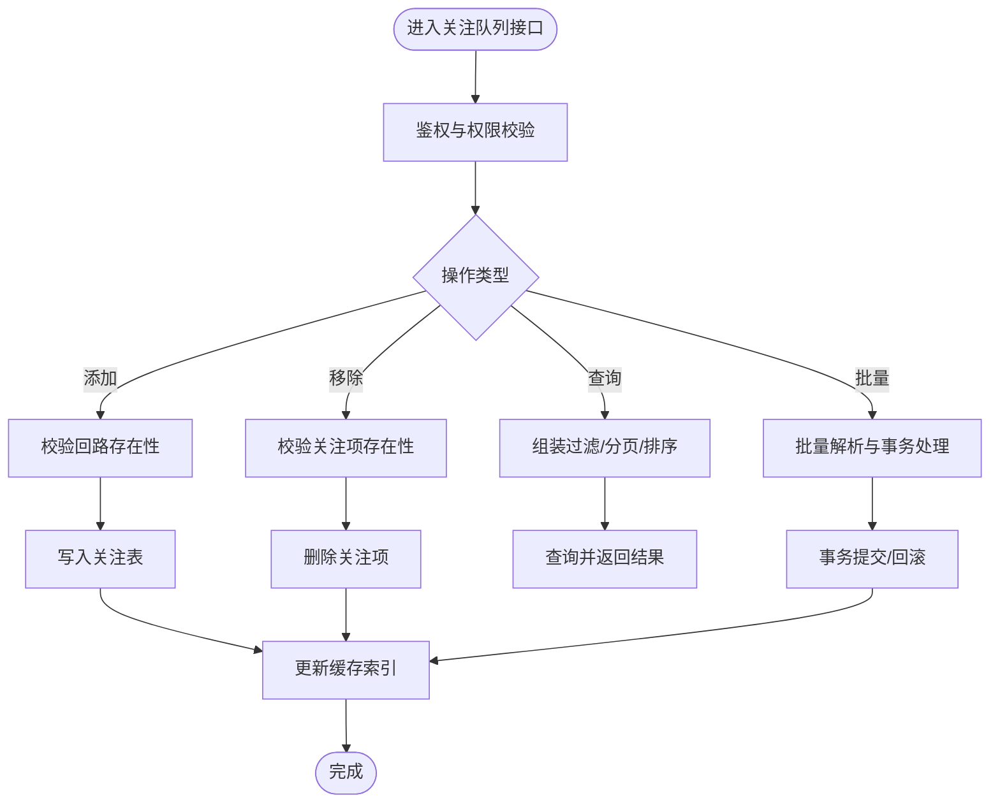
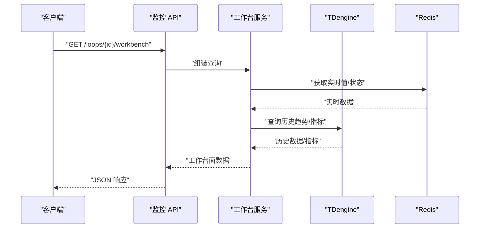
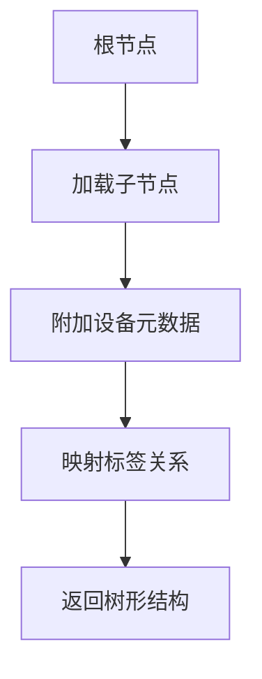
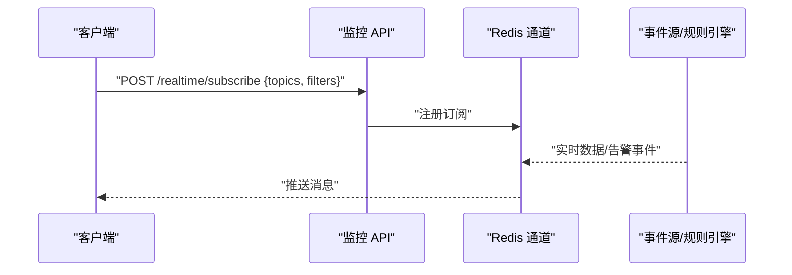
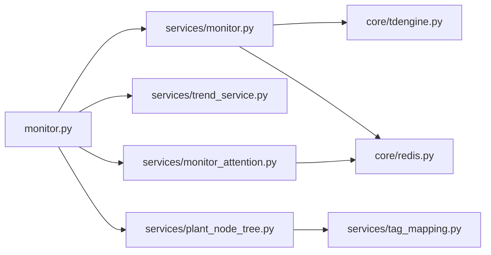

# 监控管理接口

<cite>
**本文引用的文件**
- [backend/app/api/v1/monitor.py](file://backend/app/api/v1/monitor.py)
- [backend/app/services/monitor.py](file://backend/app/services/monitor.py)
- [backend/app/schemas/monitor.py](file://backend/app/schemas/monitor.py)
- [backend/app/models/plant_node.py](file://backend/app/models/plant_node.py)
- [backend/app/services/plant_node_tree.py](file://backend/app/services/plant_node_tree.py)
- [backend/app/schemas/plant_node.py](file://backend/app/schemas/plant_node.py)
- [backend/app/services/tag_mapping.py](file://backend/app/services/tag_mapping.py)
- [backend/app/schemas/tag.py](file://backend/app/schemas/tag.py)
- [backend/app/models/loop.py](file://backend/app/models/loop.py)
- [backend/app/schemas/loop.py](file://backend/app/schemas/loop.py)
- [backend/app/services/loop.py](file://backend/app/services/loop.py)
- [backend/app/schemas/loop_batch.py](file://backend/app/schemas/loop_batch.py)
- [backend/app/services/monitor_attention.py](file://backend/app/services/monitor_attention.py)
- [backend/app/schemas/loop_data.py](file://backend/app/schemas/loop_data.py)
- [backend/app/services/trend_service.py](file://backend/app/services/trend_service.py)
- [backend/app/core/tdengine.py](file://backend/app/core/tdengine.py)
- [backend/app/core/redis.py](file://backend/app/core/redis.py)
- [backend/app/core/config.py](file://backend/app/core/config.py)
</cite>

## 目录
1. [简介](#简介)
2. [项目结构](#项目结构)
3. [核心组件](#核心组件)
4. [架构总览](#架构总览)
5. [详细组件分析](#详细组件分析)
6. [依赖关系分析](#依赖关系分析)
7. [性能考虑](#性能考虑)
8. [故障排查指南](#故障排查指南)
9. [结论](#结论)
10. [附录：API 参考与示例](#附录api-参考与示例)

## 简介
本文件为 CLPM-MVP 监控管理模块的完整 API 文档，覆盖以下能力：
- 关注队列管理：添加、移除、查询关注回路；支持批量操作与状态管理。
- 回路工作台：获取回路详细信息、实时数据、历史趋势、性能指标。
- 工厂节点树：节点层级结构、设备信息、标签映射关系。
- 实时监控：实时数据推送、状态变更通知、告警事件订阅。
- 通用能力：分页查询、过滤条件、排序选项。
- 错误处理：统一错误码、常见异常与恢复建议。

## 项目结构
后端采用 FastAPI 分层架构：路由层（API）→ 服务层（业务逻辑）→ 数据访问层（模型/时序库/缓存）。监控管理相关代码主要分布在：
- API 路由：backend/app/api/v1/monitor.py
- 服务实现：backend/app/services/monitor.py、plant_node_tree.py、tag_mapping.py、trend_service.py、monitor_attention.py
- 数据模型与模式：backend/app/models/*、backend/app/schemas/*
- 存储与中间件：backend/app/core/tdengine.py、redis.py、config.py

**图表来源**
- [backend/app/api/v1/monitor.py](file://backend/app/api/v1/monitor.py)
- [backend/app/services/monitor.py](file://backend/app/services/monitor.py)
- [backend/app/services/plant_node_tree.py](file://backend/app/services/plant_node_tree.py)
- [backend/app/services/tag_mapping.py](file://backend/app/services/tag_mapping.py)
- [backend/app/services/trend_service.py](file://backend/app/services/trend_service.py)
- [backend/app/services/monitor_attention.py](file://backend/app/services/monitor_attention.py)
- [backend/app/models/loop.py](file://backend/app/models/loop.py)
- [backend/app/models/plant_node.py](file://backend/app/models/plant_node.py)
- [backend/app/schemas/loop.py](file://backend/app/schemas/loop.py)
- [backend/app/schemas/plant_node.py](file://backend/app/schemas/plant_node.py)
- [backend/app/schemas/tag.py](file://backend/app/schemas/tag.py)
- [backend/app/core/tdengine.py](file://backend/app/core/tdengine.py)
- [backend/app/core/redis.py](file://backend/app/core/redis.py)

**章节来源**
- [backend/app/api/v1/monitor.py](file://backend/app/api/v1/monitor.py)
- [backend/app/services/monitor.py](file://backend/app/services/monitor.py)
- [backend/app/services/plant_node_tree.py](file://backend/app/services/plant_node_tree.py)
- [backend/app/services/tag_mapping.py](file://backend/app/services/tag_mapping.py)
- [backend/app/services/trend_service.py](file://backend/app/services/trend_service.py)
- [backend/app/services/monitor_attention.py](file://backend/app/services/monitor_attention.py)
- [backend/app/models/loop.py](file://backend/app/models/loop.py)
- [backend/app/models/plant_node.py](file://backend/app/models/plant_node.py)
- [backend/app/schemas/loop.py](file://backend/app/schemas/loop.py)
- [backend/app/schemas/plant_node.py](file://backend/app/schemas/plant_node.py)
- [backend/app/schemas/tag.py](file://backend/app/schemas/tag.py)
- [backend/app/core/tdengine.py](file://backend/app/core/tdengine.py)
- [backend/app/core/redis.py](file://backend/app/core/redis.py)

## 核心组件
- 监控管理 API：提供关注队列、回路工作台、工厂节点树、实时监控等端点。
- 关注队列服务：维护用户关注的回路集合，支持增删查改与批量操作。
- 回路工作台服务：聚合回路元数据、实时值、历史趋势与性能指标。
- 工厂节点树服务：构建并返回工厂层级节点、设备信息与标签映射。
- 趋势服务：从时序数据库查询历史数据，支持时间窗口、降采样与聚合。
- 实时通道：基于 Redis 发布/订阅或 SSE/WebSocket 推送实时数据与告警。

**章节来源**
- [backend/app/api/v1/monitor.py](file://backend/app/api/v1/monitor.py)
- [backend/app/services/monitor.py](file://backend/app/services/monitor.py)
- [backend/app/services/monitor_attention.py](file://backend/app/services/monitor_attention.py)
- [backend/app/services/trend_service.py](file://backend/app/services/trend_service.py)
- [backend/app/core/redis.py](file://backend/app/core/redis.py)

## 架构总览
监控管理模块遵循“请求-响应 + 实时推送”的双通道架构：
- HTTP 接口负责配置、查询、批处理等确定性操作。
- 实时通道通过 Redis 广播或长连接推送实时数据、状态变更与告警事件。

**图表来源**
- [backend/app/api/v1/monitor.py](file://backend/app/api/v1/monitor.py)
- [backend/app/services/monitor.py](file://backend/app/services/monitor.py)
- [backend/app/core/tdengine.py](file://backend/app/core/tdengine.py)
- [backend/app/core/redis.py](file://backend/app/core/redis.py)

## 详细组件分析

### 关注队列管理接口
- 功能范围
  - 添加关注：将指定回路加入关注列表。
  - 移除关注：从关注列表中删除回路。
  - 查询关注：分页、过滤、排序返回关注回路。
  - 批量操作：批量添加/移除关注。
  - 状态管理：支持启用/禁用关注项、标记优先级等。
- 典型参数
  - 分页：page、per_page
  - 过滤：loop_id、area、status、priority、enabled
  - 排序：created_at、priority、updated_at
- 关键流程
  - 添加/移除：校验回路存在性 → 写入关注表 → 更新缓存索引
  - 查询：组合过滤条件 → 分页排序 → 返回结果集
  - 批量：事务包裹多条记录，失败回滚并返回明细

**图表来源**
- [backend/app/api/v1/monitor.py](file://backend/app/api/v1/monitor.py)
- [backend/app/services/monitor_attention.py](file://backend/app/services/monitor_attention.py)
- [backend/app/models/loop.py](file://backend/app/models/loop.py)
- [backend/app/schemas/loop.py](file://backend/app/schemas/loop.py)
- [backend/app/schemas/loop_batch.py](file://backend/app/schemas/loop_batch.py)
- [backend/app/core/redis.py](file://backend/app/core/redis.py)

**章节来源**
- [backend/app/api/v1/monitor.py](file://backend/app/api/v1/monitor.py)
- [backend/app/services/monitor_attention.py](file://backend/app/services/monitor_attention.py)
- [backend/app/schemas/loop_batch.py](file://backend/app/schemas/loop_batch.py)

### 回路工作台接口
- 功能范围
  - 回路详细信息：名称、区域、控制类型、配置摘要等。
  - 实时数据：当前 PV、SP、MV、质量码、状态等。
  - 历史趋势：按时间窗口查询曲线数据，支持降采样与聚合。
  - 性能指标：稳定性、快速性、准确性、振荡率等。
- 典型参数
  - 时间范围：start_time、end_time
  - 采样：interval、aggregation
  - 指标：metrics[]
- 关键流程
  - 读取回路元数据 → 查询实时值（缓存/流式） → 查询历史趋势（TDengine） → 计算/汇总性能指标 → 返回工作台面

**图表来源**
- [backend/app/api/v1/monitor.py](file://backend/app/api/v1/monitor.py)
- [backend/app/services/monitor.py](file://backend/app/services/monitor.py)
- [backend/app/core/tdengine.py](file://backend/app/core/tdengine.py)
- [backend/app/core/redis.py](file://backend/app/core/redis.py)

**章节来源**
- [backend/app/api/v1/monitor.py](file://backend/app/api/v1/monitor.py)
- [backend/app/services/monitor.py](file://backend/app/services/monitor.py)
- [backend/app/core/tdengine.py](file://backend/app/core/tdengine.py)

### 工厂节点树接口
- 功能范围
  - 节点层级结构：工厂/车间/产线/设备/测点的树形组织。
  - 设备信息：设备属性、运行状态、关联回路数量。
  - 标签映射关系：设备与标签的绑定、别名、数据类型。
- 典型参数
  - 层级深度：depth
  - 过滤：node_type、status、area
  - 展开：expand_tags、include_metrics
- 关键流程
  - 构建根节点 → 递归加载子节点 → 附加设备与标签映射 → 返回树形结构

**图表来源**
- [backend/app/services/plant_node_tree.py](file://backend/app/services/plant_node_tree.py)
- [backend/app/models/plant_node.py](file://backend/app/models/plant_node.py)
- [backend/app/schemas/plant_node.py](file://backend/app/schemas/plant_node.py)
- [backend/app/services/tag_mapping.py](file://backend/app/services/tag_mapping.py)
- [backend/app/schemas/tag.py](file://backend/app/schemas/tag.py)

**章节来源**
- [backend/app/services/plant_node_tree.py](file://backend/app/services/plant_node_tree.py)
- [backend/app/services/tag_mapping.py](file://backend/app/services/tag_mapping.py)

### 实时监控接口
- 功能范围
  - 实时数据推送：回路 PV/SP/MV、质量码、状态等高频数据。
  - 状态变更通知：回路模式切换、报警触发/恢复。
  - 告警事件订阅：规则引擎产生的告警事件流。
- 典型参数
  - 主题：topics[]（如 loop_realtime、loop_status、alerts）
  - 过滤：loop_ids、areas、severity
  - 格式：json、protobuf（视前端而定）
- 关键流程
  - 客户端订阅主题 → 服务端监听数据源 → 过滤与格式化 → 推送至客户端

**图表来源**
- [backend/app/api/v1/monitor.py](file://backend/app/api/v1/monitor.py)
- [backend/app/core/redis.py](file://backend/app/core/redis.py)

**章节来源**
- [backend/app/api/v1/monitor.py](file://backend/app/api/v1/monitor.py)
- [backend/app/core/redis.py](file://backend/app/core/redis.py)

## 依赖关系分析
- 耦合度
  - API 层仅负责参数校验与路由分发，业务集中在服务层。
  - 服务层对模型与外部存储（TDengine、Redis）有明确依赖。
- 直接依赖
  - monitor.py → monitor.py 服务、trend_service.py、monitor_attention.py
  - plant_node_tree.py → plant_node 模型、tag_mapping.py
  - trend_service.py → tdengine.py
  - monitor_attention.py → redis.py、loop 模型
- 间接依赖
  - 认证、限流、日志等横切关注点由中间件注入。

**图表来源**
- [backend/app/api/v1/monitor.py](file://backend/app/api/v1/monitor.py)
- [backend/app/services/monitor.py](file://backend/app/services/monitor.py)
- [backend/app/services/trend_service.py](file://backend/app/services/trend_service.py)
- [backend/app/services/monitor_attention.py](file://backend/app/services/monitor_attention.py)
- [backend/app/services/plant_node_tree.py](file://backend/app/services/plant_node_tree.py)
- [backend/app/services/tag_mapping.py](file://backend/app/services/tag_mapping.py)
- [backend/app/core/tdengine.py](file://backend/app/core/tdengine.py)
- [backend/app/core/redis.py](file://backend/app/core/redis.py)

**章节来源**
- [backend/app/api/v1/monitor.py](file://backend/app/api/v1/monitor.py)
- [backend/app/services/monitor.py](file://backend/app/services/monitor.py)
- [backend/app/services/trend_service.py](file://backend/app/services/trend_service.py)
- [backend/app/services/monitor_attention.py](file://backend/app/services/monitor_attention.py)
- [backend/app/services/plant_node_tree.py](file://backend/app/services/plant_node_tree.py)
- [backend/app/services/tag_mapping.py](file://backend/app/services/tag_mapping.py)
- [backend/app/core/tdengine.py](file://backend/app/core/tdengine.py)
- [backend/app/core/redis.py](file://backend/app/core/redis.py)

## 性能考虑
- 查询优化
  - 使用索引字段进行过滤（loop_id、area、status、created_at）。
  - 合理设置 per_page，避免大页导致内存压力。
  - 历史趋势使用降采样与聚合减少数据量。
- 缓存策略
  - 热点回路实时值与状态缓存于 Redis，降低 DB 压力。
  - 关注队列索引缓存，提升批量查询效率。
- 并发与限流
  - 对实时订阅进行速率限制，防止风暴。
  - 批量操作使用事务与分批提交，提高吞吐与稳定性。
- 存储选择
  - 历史趋势与指标落时序库（TDengine），利用其压缩与聚合能力。
  - 实时通道使用 Redis Pub/Sub 或 Stream，保证低延迟。

[本节为通用指导，不直接分析具体文件]

## 故障排查指南
- 常见问题
  - 404 未找到：检查回路 ID、节点路径是否正确。
  - 400 参数错误：校验分页、时间范围、过滤字段是否合法。
  - 500 内部错误：查看服务日志，确认 TDengine/Redis 连通性。
  - 超时：增大超时阈值或缩小查询范围。
- 定位步骤
  - 开启请求追踪（Request ID），在日志中定位链路。
  - 检查 Redis 订阅是否成功，主题是否存在。
  - 验证 TDengine 查询语句与时间窗口。
- 恢复建议
  - 重试机制：对瞬时网络抖动进行指数退避重试。
  - 降级：当实时通道不可用时，返回最近一次快照数据。
  - 熔断：对下游服务异常进行熔断保护，避免雪崩。

**章节来源**
- [backend/app/core/config.py](file://backend/app/core/config.py)
- [backend/app/core/redis.py](file://backend/app/core/redis.py)
- [backend/app/core/tdengine.py](file://backend/app/core/tdengine.py)

## 结论
本模块以清晰的分层架构实现了监控管理的核心能力：关注队列、回路工作台、工厂节点树与实时监控。通过合理的分页、过滤、排序与缓存策略，兼顾了易用性与性能。建议在接入时严格遵循参数规范与错误处理约定，并结合监控与日志系统进行可观测性建设。

[本节为总结，不直接分析具体文件]

## 附录：API 参考与示例

### 关注队列管理
- 添加关注
  - 方法：POST
  - 路径：/monitor/attention/add
  - 请求体：包含 loop_id、priority、enabled 等字段
  - 响应：返回新增条目与状态码
- 移除关注
  - 方法：DELETE
  - 路径：/monitor/attention/remove
  - 请求体：包含 loop_id 列表
  - 响应：返回删除结果与状态码
- 查询关注
  - 方法：GET
  - 路径：/monitor/attention/list
  - 查询参数：page、per_page、loop_id、area、status、priority、enabled、sort_by、order
  - 响应：返回分页结果与总数
- 批量操作
  - 方法：POST
  - 路径：/monitor/attention/batch
  - 请求体：operations 数组，每项包含 type（add/remove）、loop_id、priority、enabled
  - 响应：返回每条操作的执行结果与错误明细

**章节来源**
- [backend/app/api/v1/monitor.py](file://backend/app/api/v1/monitor.py)
- [backend/app/services/monitor_attention.py](file://backend/app/services/monitor_attention.py)
- [backend/app/schemas/loop_batch.py](file://backend/app/schemas/loop_batch.py)

### 回路工作台
- 获取工作台面
  - 方法：GET
  - 路径：/monitor/loops/{id}/workbench
  - 查询参数：start_time、end_time、interval、aggregation、metrics[]
  - 响应：包含回路详情、实时数据、历史趋势、性能指标
- 获取实时数据
  - 方法：GET
  - 路径：/monitor/loops/{id}/realtime
  - 响应：PV、SP、MV、质量码、状态等
- 获取历史趋势
  - 方法：GET
  - 路径：/monitor/loops/{id}/trends
  - 查询参数：start_time、end_time、interval、aggregation、metrics[]
  - 响应：时间序列数据

**章节来源**
- [backend/app/api/v1/monitor.py](file://backend/app/api/v1/monitor.py)
- [backend/app/services/monitor.py](file://backend/app/services/monitor.py)
- [backend/app/services/trend_service.py](file://backend/app/services/trend_service.py)
- [backend/app/core/tdengine.py](file://backend/app/core/tdengine.py)

### 工厂节点树
- 获取节点树
  - 方法：GET
  - 路径：/monitor/nodes/tree
  - 查询参数：depth、node_type、status、area、expand_tags、include_metrics
  - 响应：树形结构，含节点、设备、标签映射
- 获取设备信息
  - 方法：GET
  - 路径：/monitor/nodes/{node_id}
  - 响应：设备属性、运行状态、关联回路数
- 获取标签映射
  - 方法：GET
  - 路径：/monitor/tags/mapping
  - 查询参数：node_id、tag_name、data_type
  - 响应：标签与设备的绑定关系

**章节来源**
- [backend/app/api/v1/monitor.py](file://backend/app/api/v1/monitor.py)
- [backend/app/services/plant_node_tree.py](file://backend/app/services/plant_node_tree.py)
- [backend/app/services/tag_mapping.py](file://backend/app/services/tag_mapping.py)
- [backend/app/models/plant_node.py](file://backend/app/models/plant_node.py)
- [backend/app/schemas/plant_node.py](file://backend/app/schemas/plant_node.py)
- [backend/app/schemas/tag.py](file://backend/app/schemas/tag.py)

### 实时监控
- 订阅实时通道
  - 方法：POST
  - 路径：/monitor/realtime/subscribe
  - 请求体：topics[]、filters{loop_ids、areas、severity}
  - 响应：订阅成功，后续通过通道推送消息
- 取消订阅
  - 方法：POST
  - 路径：/monitor/realtime/unsubscribe
  - 请求体：subscription_id
  - 响应：取消成功
- 推送内容
  - 实时数据：loop_id、timestamp、values{pv、sp、mv、quality}
  - 状态变更：loop_id、from_state、to_state、reason
  - 告警事件：alert_id、severity、message、loop_id、timestamp

**章节来源**
- [backend/app/api/v1/monitor.py](file://backend/app/api/v1/monitor.py)
- [backend/app/core/redis.py](file://backend/app/core/redis.py)

### 分页、过滤与排序
- 分页
  - page：起始页（默认 1）
  - per_page：每页条数（默认 20，最大受配置限制）
- 过滤
  - loop_id：精确匹配
  - area：区域筛选
  - status：状态筛选（如 active、inactive）
  - priority：优先级筛选
  - enabled：是否启用
- 排序
  - sort_by：排序字段（created_at、priority、updated_at）
  - order：asc 或 desc

**章节来源**
- [backend/app/api/v1/monitor.py](file://backend/app/api/v1/monitor.py)
- [backend/app/schemas/monitor.py](file://backend/app/schemas/monitor.py)

### 错误处理
- 统一错误码
  - 400：参数校验失败
  - 401：未授权
  - 403：无权限
  - 404：资源不存在
  - 429：请求过多
  - 500：内部错误
- 错误响应体
  - code：错误码
  - message：人类可读描述
  - details：详细错误信息（可选）
- 常见异常
  - 参数缺失或类型错误：检查请求体与查询参数
  - 下游服务不可用：检查 TDengine/Redis 连通性
  - 订阅失败：检查主题是否存在与权限

**章节来源**
- [backend/app/api/v1/monitor.py](file://backend/app/api/v1/monitor.py)
- [backend/app/core/config.py](file://backend/app/core/config.py)