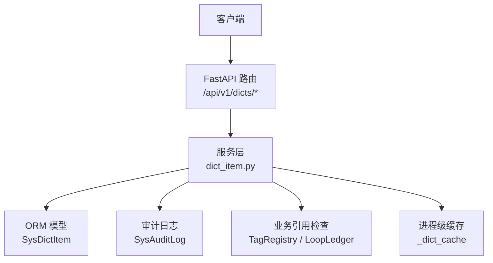
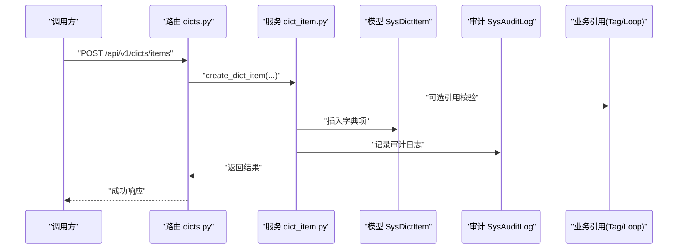
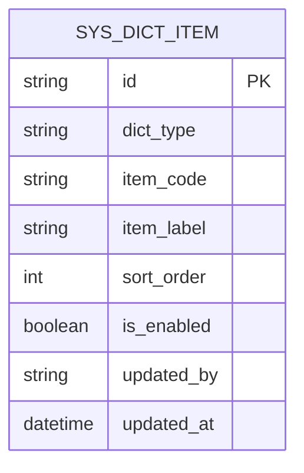
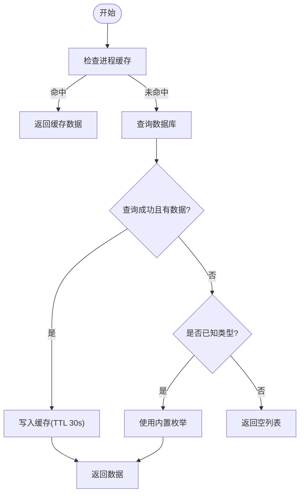
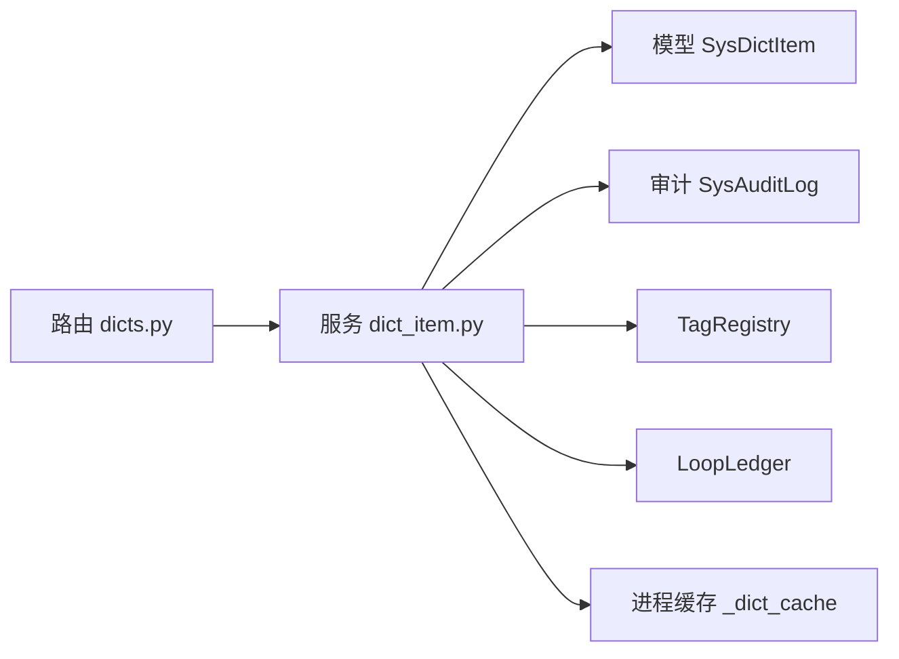

# 字典管理接口

<cite>
**本文引用的文件**
- [dicts.py](file://backend/app/api/v1/endpoints/dicts.py)
- [dict_item.py（服务）](file://backend/app/services/dict_item.py)
- [sys_dict_item.py（模型）](file://backend/app/models/sys_dict_item.py)
- [dict_item.py（模式）](file://backend/app/schemas/dict_item.py)
- [audit.py（审计日志）](file://backend/app/models/audit.py)
- [f2a3b4c5d6e7_add_sys_dict_item.py（迁移）](file://backend/alembic/versions/f2a3b4c5d6e7_add_sys_dict_item.py)
- [test_dict_item.py（测试）](file://backend/tests/test_dict_item.py)
</cite>

## 目录
1. [简介](#简介)
2. [项目结构](#项目结构)
3. [核心组件](#核心组件)
4. [架构总览](#架构总览)
5. [详细组件分析](#详细组件分析)
6. [依赖关系分析](#依赖关系分析)
7. [性能考虑](#性能考虑)
8. [故障排查指南](#故障排查指南)
9. [结论](#结论)
10. [附录：API 规范与示例](#附录api-规范与示例)

## 简介
本模块提供“通用字典项”管理能力，用于维护系统枚举与配置型字典。支持按字典类型分组、键值对维护、排序权重、启用/禁用控制，并提供读取端点供前端下拉框使用。当前已注册字典类型包括测点类型、参数类型、回路类型等，并内置兜底数据以保证在数据库不可用时的可用性。写操作会记录审计日志，并在写入后主动失效进程级缓存，确保后续读取可见最新数据。

## 项目结构
字典管理相关代码采用分层组织：
- API 层：路由定义、权限校验、请求/响应封装
- 服务层：业务逻辑、引用校验、缓存失效、审计记录
- 模型层：数据库表映射
- 模式层：Pydantic 请求/响应结构
- 迁移：建表与种子数据初始化

图表来源
- [dicts.py:1-120](file://backend/app/api/v1/endpoints/dicts.py#L1-L120)
- [dict_item.py（服务）:1-464](file://backend/app/services/dict_item.py#L1-L464)
- [sys_dict_item.py（模型）:1-47](file://backend/app/models/sys_dict_item.py#L1-L47)
- [audit.py（审计日志）:1-39](file://backend/app/models/audit.py#L1-L39)

章节来源
- [dicts.py:1-120](file://backend/app/api/v1/endpoints/dicts.py#L1-L120)
- [dict_item.py（服务）:1-464](file://backend/app/services/dict_item.py#L1-L464)
- [sys_dict_item.py（模型）:1-47](file://backend/app/models/sys_dict_item.py#L1-L47)
- [audit.py（审计日志）:1-39](file://backend/app/models/audit.py#L1-L39)

## 核心组件
- 路由端点：提供字典类型列表、字典项分页管理、字典项读取、创建、更新、删除
- 服务函数：实现字典读取（含缓存与回退）、归一化、引用校验、分页查询、CRUD 与审计
- 数据模型：sys_dict_item 表结构，包含字典类型、编码、显示名、排序、启用状态、更新信息
- 模式定义：Create/Update/Info 的 Pydantic 模型，约束字段长度与取值范围
- 审计日志：记录增删改操作的变更前后值与操作人

章节来源
- [dicts.py:1-120](file://backend/app/api/v1/endpoints/dicts.py#L1-L120)
- [dict_item.py（服务）:1-464](file://backend/app/services/dict_item.py#L1-L464)
- [sys_dict_item.py（模型）:1-47](file://backend/app/models/sys_dict_item.py#L1-L47)
- [dict_item.py（模式）:1-39](file://backend/app/schemas/dict_item.py#L1-L39)
- [audit.py（审计日志）:1-39](file://backend/app/models/audit.py#L1-L39)

## 架构总览
字典管理遵循“路由 → 服务 → 模型/外部引用 → 缓存/审计”的分层流程。读路径具备 TTL 缓存与回退机制；写路径进行引用校验并记录审计，随后失效对应字典类型的缓存。

图表来源
- [dicts.py:70-86](file://backend/app/api/v1/endpoints/dicts.py#L70-L86)
- [dict_item.py（服务）:276-333](file://backend/app/services/dict_item.py#L276-L333)
- [audit.py（审计日志）:15-39](file://backend/app/models/audit.py#L15-L39)

## 详细组件分析

### 数据模型与存储设计
- 表名：sys_dict_item
- 关键字段：
  - dict_type：字典类型编码（如 MEASURE_TYPE）
  - item_code：落库值（唯一于同类型下）
  - item_label：显示名（中文）
  - sort_order：排序权重
  - is_enabled：是否启用
  - updated_by / updated_at：变更记录
- 约束与索引：
  - (dict_type, item_code) 唯一约束
  - dict_type 索引
- 种子数据：MEASURE_TYPE 初始 7 项

图表来源
- [sys_dict_item.py（模型）:26-47](file://backend/app/models/sys_dict_item.py#L26-L47)
- [f2a3b4c5d6e7_add_sys_dict_item.py（迁移）:38-82](file://backend/alembic/versions/f2a3b4c5d6e7_add_sys_dict_item.py#L38-L82)

章节来源
- [sys_dict_item.py（模型）:1-47](file://backend/app/models/sys_dict_item.py#L1-L47)
- [f2a3b4c5d6e7_add_sys_dict_item.py（迁移）:1-95](file://backend/alembic/versions/f2a3b4c5d6e7_add_sys_dict_item.py#L1-L95)

### API 端点与权限
- GET /api/v1/dicts/types：列出已注册字典类型（需登录）
- GET /api/v1/dicts/{dictType}/items：获取字典项列表（需登录，默认仅启用项）
- GET /api/v1/dicts/items?dictType=&page=&pageSize=：分页管理列表（ADMIN）
- POST /api/v1/dicts/items：新建字典项（ADMIN）
- PUT /api/v1/dicts/items/{itemId}：更新字典项（ADMIN）
- DELETE /api/v1/dicts/items/{itemId}：删除字典项（ADMIN，被引用时拒绝）

权限说明：
- 读接口：需要登录用户
- 写接口：需要 ADMIN 角色

章节来源
- [dicts.py:35-116](file://backend/app/api/v1/endpoints/dicts.py#L35-L116)

### 服务层逻辑与缓存策略
- 读取字典项：
  - 优先从进程级缓存读取（TTL 30 秒）
  - 未命中则查库并按 sort_order 排序
  - 若查询异常或结果为空，针对已知类型回退内置枚举（MEASURE_TYPE/TAG_TYPE/LOOP_TYPE）
- 归一化：
  - 接受 code（大小写不敏感）或 label（中文），返回标准 code
- 引用校验：
  - 删除或禁用前检查是否被 TagRegistry 或 LoopLedger 引用
- 分页管理：
  - 返回 items、total、page、pageSize，并对已知类型附加 isReferenced 标记
- 写操作审计：
  - 创建/更新/删除均记录审计日志（before/after JSON）
- 缓存失效：
  - 写操作完成后调用 invalidate_dict_cache(dict_type) 失效对应类型缓存

图表来源
- [dict_item.py（服务）:87-125](file://backend/app/services/dict_item.py#L87-L125)

章节来源
- [dict_item.py（服务）:79-155](file://backend/app/services/dict_item.py#L79-L155)
- [dict_item.py（服务）:216-273](file://backend/app/services/dict_item.py#L216-L273)
- [dict_item.py（服务）:276-446](file://backend/app/services/dict_item.py#L276-L446)

### 版本控制、变更历史与回滚
- 变更历史：通过 sys_audit_log 记录每次字典项的创建、更新、删除，包含操作人、操作类型、目标标识、变更前/后值、操作时间
- 版本控制：当前未实现字典项的版本号字段；如需版本控制，可在模型中扩展 version 字段并在更新时递增
- 回滚机制：可基于审计日志中的 before_value/after_value 进行人工回滚；建议未来增加“撤销”接口以自动化回滚

章节来源
- [audit.py（审计日志）:15-39](file://backend/app/models/audit.py#L15-L39)
- [dict_item.py（服务）:157-176](file://backend/app/services/dict_item.py#L157-L176)
- [dict_item.py（服务）:314-324](file://backend/app/services/dict_item.py#L314-L324)
- [dict_item.py（服务）:388-395](file://backend/app/services/dict_item.py#L388-L395)
- [dict_item.py（服务）:431-443](file://backend/app/services/dict_item.py#L431-L443)

### 多语言支持与国际化
- 当前字典项的显示名（item_label）为单语言文本（中文）
- 如需多语言，建议在模型中扩展 i18n 字段（如 label_zh、label_en），或在独立表中维护多语言映射；读取接口可按当前语言返回对应 label
- 归一化接口 normalize_by_dict 目前支持中文 label 到 code 的映射，便于导入场景兼容中文输入

章节来源
- [sys_dict_item.py（模型）:26-47](file://backend/app/models/sys_dict_item.py#L26-L47)
- [dict_item.py（服务）:128-154](file://backend/app/services/dict_item.py#L128-L154)

### 字典分组管理与层级结构设计
- 分组：通过 dict_type 字段实现分组（如 MEASURE_TYPE、TAG_TYPE、LOOP_TYPE）
- 层级：当前为扁平结构（无 parent_id）；如需层级，可扩展 parent_id 与层级深度字段，并在读取接口中组装树形结构
- 标题映射：DICT_TYPE_TITLES 提供字典类型到中文标题的映射，用于前端展示

章节来源
- [dict_item.py（服务）:26-36](file://backend/app/services/dict_item.py#L26-L36)
- [dicts.py:35-41](file://backend/app/api/v1/endpoints/dicts.py#L35-L41)

### 导入导出与批量操作
- 导入：可通过 normalize_by_dict 将中文标签或大小写不敏感的 code 归一化为标准 code，再批量写入
- 导出：可使用分页管理列表接口获取字典项，结合 isReferenced 标记进行导出
- 批量操作：当前未提供专用批量接口；可通过多次调用创建/更新接口实现批量写入

章节来源
- [dict_item.py（服务）:128-154](file://backend/app/services/dict_item.py#L128-L154)
- [dicts.py:44-54](file://backend/app/api/v1/endpoints/dicts.py#L44-L54)

### 设计规范与命名约定
- 字典类型编码：使用大写英文常量（如 MEASURE_TYPE）
- 项编码（item_code）：使用大写英文，保证大小写不敏感匹配
- 显示名（item_label）：使用中文，便于前端展示
- 排序权重（sort_order）：非负整数，数值越小越靠前
- 启用状态（is_enabled）：默认启用，禁用前需通过引用校验

章节来源
- [dict_item.py（模式）:10-39](file://backend/app/schemas/dict_item.py#L10-L39)
- [dict_item.py（服务）:27-71](file://backend/app/services/dict_item.py#L27-L71)

## 依赖关系分析
- 路由依赖：
  - 认证与角色：get_current_user、require_roles("ADMIN")
  - 数据库会话：get_db
  - 服务函数：create/update/delete/list/get
- 服务依赖：
  - ORM：SysDictItem
  - 业务引用：TagRegistry、LoopLedger
  - 审计：SysAuditLog
  - 缓存：进程级 _dict_cache 与 TTL
- 迁移依赖：
  - 建表与种子数据：f2a3b4c5d6e7_add_sys_dict_item.py

图表来源
- [dicts.py:1-120](file://backend/app/api/v1/endpoints/dicts.py#L1-L120)
- [dict_item.py（服务）:1-464](file://backend/app/services/dict_item.py#L1-L464)
- [sys_dict_item.py（模型）:1-47](file://backend/app/models/sys_dict_item.py#L1-L47)
- [audit.py（审计日志）:1-39](file://backend/app/models/audit.py#L1-L39)

章节来源
- [dicts.py:1-120](file://backend/app/api/v1/endpoints/dicts.py#L1-L120)
- [dict_item.py（服务）:1-464](file://backend/app/services/dict_item.py#L1-L464)

## 性能考虑
- 进程级缓存：读取路径使用 30 秒 TTL 缓存，减少重复查询；写操作后主动失效对应类型缓存
- 排序与索引：按 sort_order 与 item_code 排序，dict_type 建立索引提升过滤效率
- 回退机制：数据库不可用时使用内置枚举，保障可用性
- 分页：管理列表支持 page/pageSize，避免一次性加载大量数据

章节来源
- [dict_item.py（服务）:73-125](file://backend/app/services/dict_item.py#L73-L125)
- [dict_item.py（服务）:216-273](file://backend/app/services/dict_item.py#L216-L273)

## 故障排查指南
- 401 未认证：访问读接口需携带有效令牌
- 403 禁止：写接口需 ADMIN 角色
- 400 重复编码：创建时同字典下 item_code 重复
- 404 不存在：更新/删除时 item_id 不存在
- 400 引用冲突：删除或禁用被业务数据引用的字典项
- 数据库不可用：读接口自动回退至内置枚举，确保功能可用

章节来源
- [dicts.py:70-116](file://backend/app/api/v1/endpoints/dicts.py#L70-L116)
- [dict_item.py（服务）:276-446](file://backend/app/services/dict_item.py#L276-L446)
- [test_dict_item.py:75-153](file://backend/tests/test_dict_item.py#L75-L153)

## 结论
本模块提供了稳定可靠的字典管理能力，涵盖分组、键值对维护、排序、启用/禁用、引用校验、审计日志与缓存优化。通过内置回退机制，系统在数据库异常时仍能提供基础能力。建议后续扩展多语言、版本控制与批量操作接口，以满足更复杂的业务需求。

## 附录：API 规范与示例

### 接口清单
- GET /api/v1/dicts/types
  - 描述：列出已注册字典类型
  - 权限：登录
  - 响应：字典类型列表（dictType、title）
- GET /api/v1/dicts/{dictType}/items
  - 描述：获取字典项列表（默认仅启用项）
  - 权限：登录
  - 参数：enabledOnly（布尔）
  - 响应：[{itemCode, itemLabel}]
- GET /api/v1/dicts/items?dictType=&page=&pageSize=
  - 描述：分页管理列表（含 isReferenced）
  - 权限：ADMIN
  - 响应：{items[], total, page, pageSize}
- POST /api/v1/dicts/items
  - 描述：新建字典项
  - 权限：ADMIN
  - 请求体：{dictType, itemCode, itemLabel, sortOrder?, isEnabled?}
  - 响应：{id, dictType, itemCode, itemLabel}
- PUT /api/v1/dicts/items/{itemId}
  - 描述：更新字典项（label/sortOrder/isEnabled）
  - 权限：ADMIN
  - 请求体：{itemLabel?, sortOrder?, isEnabled?}
  - 响应：{id, dictType, itemCode, itemLabel, sortOrder, isEnabled}
- DELETE /api/v1/dicts/items/{itemId}
  - 描述：删除字典项
  - 权限：ADMIN
  - 响应：{id, deleted}

### 调用示例（概念性）
- 获取测点类型列表：GET /api/v1/dicts/MEASURE_TYPE/items
- 新增字典项：POST /api/v1/dicts/items，请求体包含 dictType、itemCode、itemLabel
- 更新排序：PUT /api/v1/dicts/items/{itemId}，设置 sortOrder
- 禁用被引用项：DELETE 将被拒绝并返回引用错误

### 国际化配置指南
- 当前 item_label 为单语言文本；如需多语言，建议在模型中扩展多语言字段并在读取接口中按语言返回
- 归一化接口支持中文 label 到 code 的映射，便于导入场景

章节来源
- [dicts.py:35-116](file://backend/app/api/v1/endpoints/dicts.py#L35-L116)
- [dict_item.py（服务）:128-154](file://backend/app/services/dict_item.py#L128-L154)
- [dict_item.py（模式）:10-39](file://backend/app/schemas/dict_item.py#L10-L39)
- [test_dict_item.py:75-153](file://backend/tests/test_dict_item.py#L75-L153)