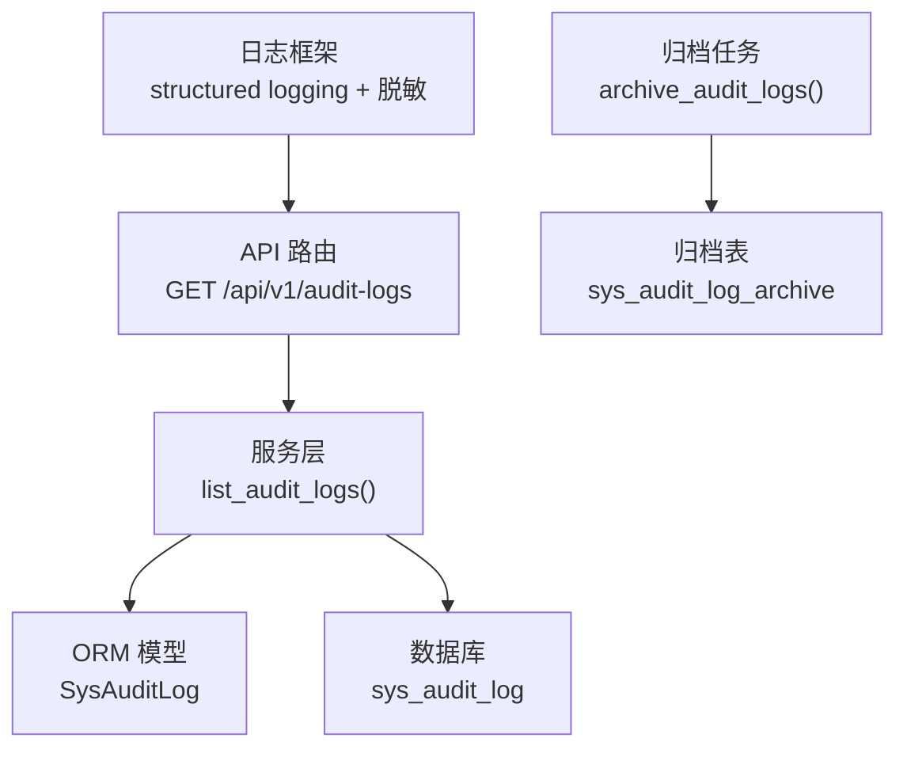
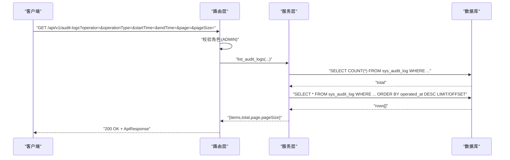
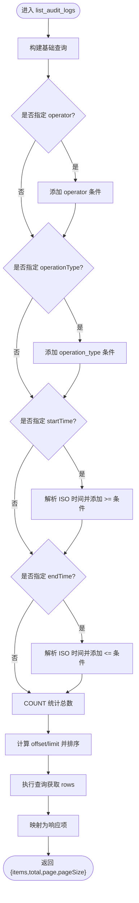
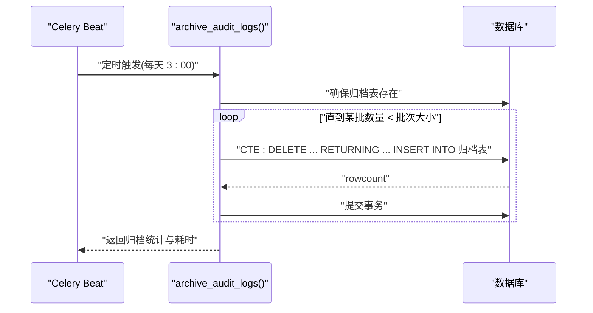
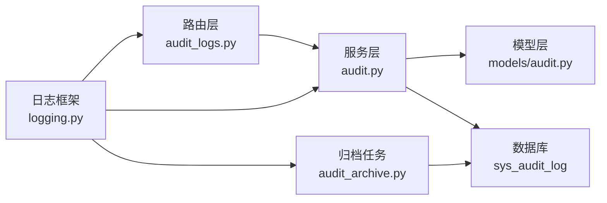

# 审计日志接口

<cite>
**本文引用的文件**
- [backend/app/api/v1/endpoints/audit_logs.py](file://backend/app/api/v1/endpoints/audit_logs.py)
- [backend/app/services/audit.py](file://backend/app/services/audit.py)
- [backend/app/models/audit.py](file://backend/app/models/audit.py)
- [backend/app/schemas/audit.py](file://backend/app/schemas/audit.py)
- [backend/app/tasks/audit_archive.py](file://backend/app/tasks/audit_archive.py)
- [backend/app/core/logging.py](file://backend/app/core/logging.py)
- [backend/tests/test_audit_logs.py](file://backend/tests/test_audit_logs.py)
</cite>

## 目录
1. [简介](#简介)
2. [项目结构](#项目结构)
3. [核心组件](#核心组件)
4. [架构总览](#架构总览)
5. [详细组件分析](#详细组件分析)
6. [依赖关系分析](#依赖关系分析)
7. [性能考虑](#性能考虑)
8. [故障排查指南](#故障排查指南)
9. [结论](#结论)
10. [附录](#附录)

## 简介
本模块提供系统级审计日志的只读查询能力，支持按操作人、操作类型与时间范围进行分页筛选。当前实现未暴露导出（CSV/JSON/PDF）与合规性检查接口；归档由后台任务自动执行，将超期日志从主表迁移至归档表以控制主表规模。日志输出采用结构化 JSON，并内置敏感信息脱敏机制。

## 项目结构
审计日志相关代码主要分布在以下位置：
- API 路由层：定义查询入口与权限控制
- 服务层：封装数据库查询、过滤与分页逻辑
- 数据模型层：定义审计日志表结构与索引
- 模式层：定义请求/响应数据结构
- 任务层：定时归档过期日志
- 日志框架：统一结构化日志与敏感信息脱敏

图表来源
- [backend/app/api/v1/endpoints/audit_logs.py:24-45](file://backend/app/api/v1/endpoints/audit_logs.py#L24-L45)
- [backend/app/services/audit.py:17-70](file://backend/app/services/audit.py#L17-L70)
- [backend/app/models/audit.py:15-38](file://backend/app/models/audit.py#L15-L38)
- [backend/app/tasks/audit_archive.py:33-92](file://backend/app/tasks/audit_archive.py#L33-L92)
- [backend/app/core/logging.py:33-61](file://backend/app/core/logging.py#L33-L61)

章节来源
- [backend/app/api/v1/endpoints/audit_logs.py:1-49](file://backend/app/api/v1/endpoints/audit_logs.py#L1-L49)
- [backend/app/services/audit.py:1-101](file://backend/app/services/audit.py#L1-L101)
- [backend/app/models/audit.py:1-39](file://backend/app/models/audit.py#L1-L39)
- [backend/app/schemas/audit.py:1-37](file://backend/app/schemas/audit.py#L1-L37)
- [backend/app/tasks/audit_archive.py:1-183](file://backend/app/tasks/audit_archive.py#L1-L183)
- [backend/app/core/logging.py:1-151](file://backend/app/core/logging.py#L1-L151)

## 核心组件
- 查询接口：仅 ADMIN 可访问的分页查询，支持 operator、operationType、startTime、endTime、page、pageSize 参数
- 数据模型：sys_audit_log 表，包含操作人、操作类型、目标类型/ID、变更前后值、操作时间等字段，并对常用查询列建立索引
- 服务模式：构建动态 SQL 条件、计数与分页，返回标准化列表结构
- 归档任务：Celery Beat 每日凌晨 3 点触发，批量将超过保留期的日志迁移到归档表，默认保留 90 天
- 日志框架：结构化 JSON 输出，DEBUG 下人类可读格式，内置敏感信息脱敏（password/token/Bearer/JWT 等）

章节来源
- [backend/app/api/v1/endpoints/audit_logs.py:24-45](file://backend/app/api/v1/endpoints/audit_logs.py#L24-L45)
- [backend/app/models/audit.py:15-38](file://backend/app/models/audit.py#L15-L38)
- [backend/app/services/audit.py:17-70](file://backend/app/services/audit.py#L17-L70)
- [backend/app/tasks/audit_archive.py:26-31](file://backend/app/tasks/audit_archive.py#L26-L31)
- [backend/app/core/logging.py:33-61](file://backend/app/core/logging.py#L33-L61)

## 架构总览
审计日志查询流程如下：
- 客户端发起 GET /api/v1/audit-logs，携带可选筛选参数
- 路由层校验角色（ADMIN），调用服务层
- 服务层根据传入参数构建查询语句，先 count 总数，再 offset/limit 分页
- 结果转换为响应模式后返回

图表来源
- [backend/app/api/v1/endpoints/audit_logs.py:24-45](file://backend/app/api/v1/endpoints/audit_logs.py#L24-L45)
- [backend/app/services/audit.py:17-70](file://backend/app/services/audit.py#L17-L70)
- [backend/app/models/audit.py:15-38](file://backend/app/models/audit.py#L15-L38)

## 详细组件分析

### 查询接口：GET /api/v1/audit-logs
- 路径与标签：/api/v1/audit-logs，标签为 audit-logs
- 权限：仅 ADMIN 可访问；非管理员或无令牌分别返回 403/401
- 查询参数
  - operator：按操作人筛选
  - operationType：按操作类型筛选
  - startTime：开始时间（ISO 8601）
  - endTime：结束时间（ISO 8601）
  - page：页码，最小 1
  - pageSize：每页条数，范围 1–100
- 响应体：ApiResponse 包裹 AuditLogListData，包含 items、total、page、pageSize
- 注意事项
  - 审计日志不可删除，仅提供只读查询
  - 当前未实现 clientIp 字段写入，响应中固定为 null

章节来源
- [backend/app/api/v1/endpoints/audit_logs.py:24-45](file://backend/app/api/v1/endpoints/audit_logs.py#L24-L45)
- [backend/app/schemas/audit.py:10-31](file://backend/app/schemas/audit.py#L10-L31)
- [backend/tests/test_audit_logs.py:57-159](file://backend/tests/test_audit_logs.py#L57-L159)

#### 查询流程图

图表来源
- [backend/app/services/audit.py:17-70](file://backend/app/services/audit.py#L17-L70)

### 数据模型与索引
- 表名：sys_audit_log
- 关键字段
  - id：主键（UUID 字符串）
  - operator：操作人
  - operation_type：操作类型
  - target_type/target_id：目标对象类型与标识
  - before_value/after_value：变更前后快照（JSON 文本）
  - operated_at：操作时间
- 索引：针对 operator、operation_type、operated_at、target_type 建立索引以提升查询性能

章节来源
- [backend/app/models/audit.py:15-38](file://backend/app/models/audit.py#L15-L38)

### 归档任务：audit_archive
- 调度：Celery Beat 每天凌晨 3 点触发
- 策略：将 operated_at 早于“当前时间 - 保留天数”的记录从主表移动到归档表
- 批处理：每批 1000 条，避免长事务锁表
- 表结构：归档表 sys_audit_log_archive 与主表一致，额外包含 archived_at 记录归档时间
- 失败处理：记录 ERROR 日志但不抛出异常，不影响其他任务

图表来源
- [backend/app/tasks/audit_archive.py:33-92](file://backend/app/tasks/audit_archive.py#L33-L92)
- [backend/app/tasks/audit_archive.py:116-163](file://backend/app/tasks/audit_archive.py#L116-L163)
- [backend/app/tasks/audit_archive.py:170-178](file://backend/app/tasks/audit_archive.py#L170-L178)

章节来源
- [backend/app/tasks/audit_archive.py:1-183](file://backend/app/tasks/audit_archive.py#L1-L183)

### 日志级别与敏感信息脱敏
- 日志级别
  - DEBUG 模式：根日志器设为 DEBUG，抑制高噪音框架日志，使用人类可读格式
  - 生产模式：根日志器设为 INFO，输出单行 JSON 便于外部采集
- 敏感信息脱敏
  - 对 password、token、Bearer、JWT 等常见敏感片段进行正则替换
  - 在 JSONFormatter 与 DebugFormatter 中均应用脱敏

章节来源
- [backend/app/core/logging.py:33-61](file://backend/app/core/logging.py#L33-L61)
- [backend/app/core/logging.py:117-145](file://backend/app/core/logging.py#L117-L145)

## 依赖关系分析
- 路由层依赖服务层与权限依赖注入
- 服务层依赖 ORM 模型与数据库会话
- 归档任务依赖 Celery 应用与异步数据库会话
- 日志框架被各模块共享，用于统一输出与脱敏

图表来源
- [backend/app/api/v1/endpoints/audit_logs.py:24-45](file://backend/app/api/v1/endpoints/audit_logs.py#L24-L45)
- [backend/app/services/audit.py:17-70](file://backend/app/services/audit.py#L17-L70)
- [backend/app/models/audit.py:15-38](file://backend/app/models/audit.py#L15-L38)
- [backend/app/tasks/audit_archive.py:116-163](file://backend/app/tasks/audit_archive.py#L116-L163)
- [backend/app/core/logging.py:117-145](file://backend/app/core/logging.py#L117-L145)

章节来源
- [backend/app/api/v1/endpoints/audit_logs.py:24-45](file://backend/app/api/v1/endpoints/audit_logs.py#L24-L45)
- [backend/app/services/audit.py:17-70](file://backend/app/services/audit.py#L17-L70)
- [backend/app/tasks/audit_archive.py:116-163](file://backend/app/tasks/audit_archive.py#L116-L163)
- [backend/app/core/logging.py:117-145](file://backend/app/core/logging.py#L117-L145)

## 性能考虑
- 查询优化
  - 利用已建立的索引（operator、operation_type、operated_at、target_type）提升过滤与排序效率
  - 分页通过 OFFSET/LIMIT 控制单次返回量，建议 pageSize ≤ 100
- 归档优化
  - 使用 CTE + DELETE ... RETURNING ... INSERT 原子化移动数据，减少锁竞争
  - 分批归档（每批 1000 条），避免长事务导致锁表
- 日志 I/O
  - 生产环境使用 JSON 单行输出，降低解析开销
  - DEBUG 模式下抑制高频框架日志，避免事件循环阻塞

[本节为通用性能建议，不直接分析具体文件]

## 故障排查指南
- 权限问题
  - 无令牌：返回 401
  - 非 ADMIN：返回 403
- 查询为空
  - 检查筛选条件是否正确（operator、operationType、时间范围）
  - 确认数据库中存在匹配记录
- 归档失败
  - 查看任务日志中的 ERROR 记录
  - 确认归档表是否存在（首次运行会自动创建）
- 日志过多或过慢
  - 调整根日志器级别
  - 在生产环境关闭 DEBUG，使用 JSON 输出

章节来源
- [backend/tests/test_audit_logs.py:115-137](file://backend/tests/test_audit_logs.py#L115-L137)
- [backend/app/tasks/audit_archive.py:151-163](file://backend/app/tasks/audit_archive.py#L151-L163)
- [backend/app/core/logging.py:117-145](file://backend/app/core/logging.py#L117-L145)

## 结论
当前审计日志模块提供安全、可控的只读查询能力，并通过后台任务实现日志归档，保障主表性能与容量。日志输出遵循结构化标准并内置敏感信息脱敏。后续如需扩展导出与合规性检查能力，可在现有服务层基础上增加相应端点与规则引擎。

[本节为总结性内容，不直接分析具体文件]

## 附录

### 接口规范摘要
- 接口：GET /api/v1/audit-logs
- 权限：ADMIN
- 查询参数
  - operator：字符串，可选
  - operationType：字符串，可选
  - startTime：ISO 8601 字符串，可选
  - endTime：ISO 8601 字符串，可选
  - page：整数 ≥ 1，默认 1
  - pageSize：整数 1–100，默认 20
- 响应体
  - code：状态码（由统一响应包装）
  - data：AuditLogListData
    - items：AuditLogItem[]
      - logId：字符串
      - operator：字符串
      - operationType：字符串
      - targetType：字符串或空
      - targetId：字符串或空
      - beforeValue：任意类型或空
      - afterValue：任意类型或空
      - operatedAt：ISO 8601 字符串或空
      - clientIp：字符串或空（当前固定为 null）
    - total：整数
    - page：整数
    - pageSize：整数

章节来源
- [backend/app/api/v1/endpoints/audit_logs.py:24-45](file://backend/app/api/v1/endpoints/audit_logs.py#L24-L45)
- [backend/app/schemas/audit.py:10-31](file://backend/app/schemas/audit.py#L10-L31)
- [backend/app/services/audit.py:65-70](file://backend/app/services/audit.py#L65-L70)

### 导出接口说明
- 当前仓库未实现审计日志导出接口（CSV/JSON/PDF）
- 如需导出，建议在服务层复用 list_audit_logs 的过滤与分页逻辑，并在路由层新增导出端点，按需生成 CSV/JSON/PDF 流式响应

[本节为概念性说明，不直接分析具体文件]

### 合规性检查接口说明
- 当前仓库未实现独立的合规性检查接口
- 可通过查询审计日志并结合业务规则进行离线评估；若需在线检查，可在服务层引入规则配置与判定逻辑，并在路由层暴露对应端点

[本节为概念性说明，不直接分析具体文件]

### 日志级别与脱敏
- 日志级别
  - DEBUG：人类可读格式，抑制高频框架日志
  - 生产：JSON 单行格式，便于采集与分析
- 敏感信息脱敏
  - 覆盖 password、token、Bearer、JWT 等常见敏感片段
  - 在格式化阶段统一应用，避免明文泄露

章节来源
- [backend/app/core/logging.py:33-61](file://backend/app/core/logging.py#L33-L61)
- [backend/app/core/logging.py:117-145](file://backend/app/core/logging.py#L117-L145)

### 常见审计场景查询示例
- 按操作人与时间范围查询
  - 示例：operator=admin&startTime=2026-01-01T00:00:00Z&endTime=2026-12-31T23:59:59Z&page=1&pageSize=20
- 按操作类型查询
  - 示例：operationType=USER_CREATE&page=1&pageSize=20
- 组合筛选
  - 示例：operator=admin&operationType=USER_UPDATE&startTime=2026-06-01T00:00:00Z&endTime=2026-06-30T23:59:59Z&page=1&pageSize=50

章节来源
- [backend/tests/test_audit_logs.py:92-113](file://backend/tests/test_audit_logs.py#L92-L113)