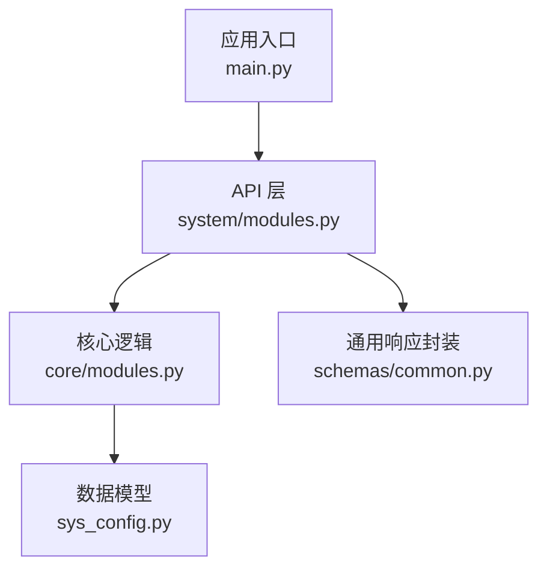
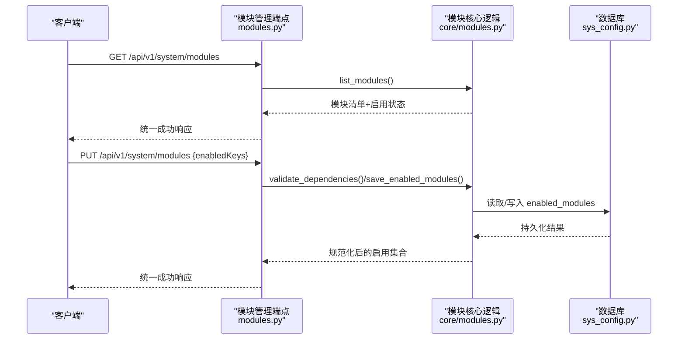
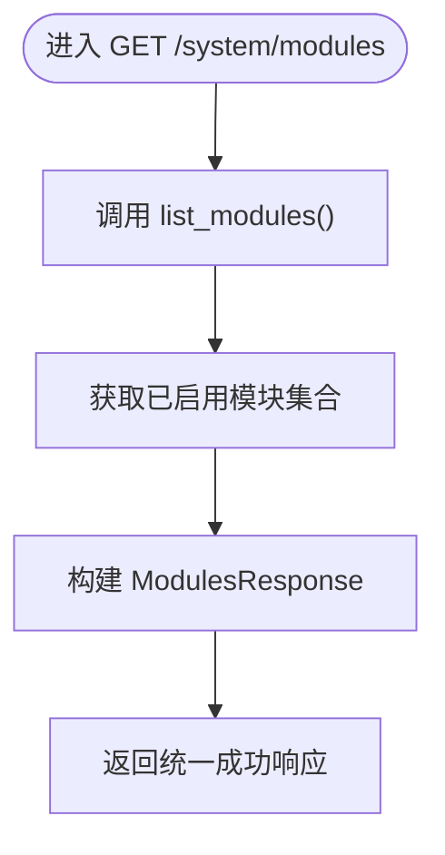
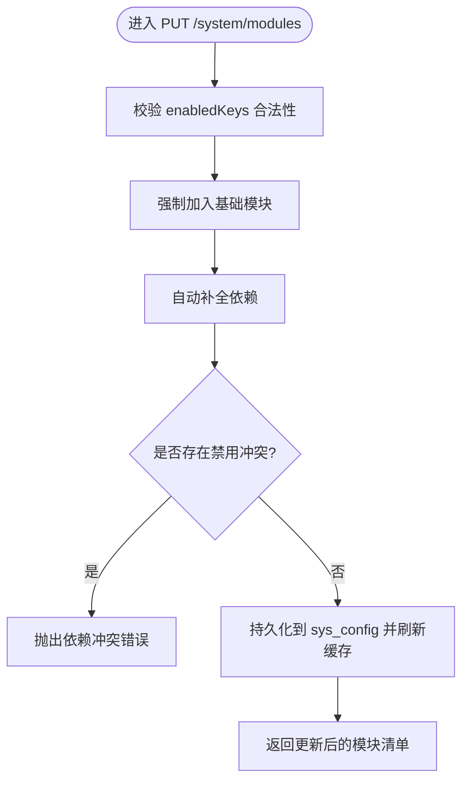
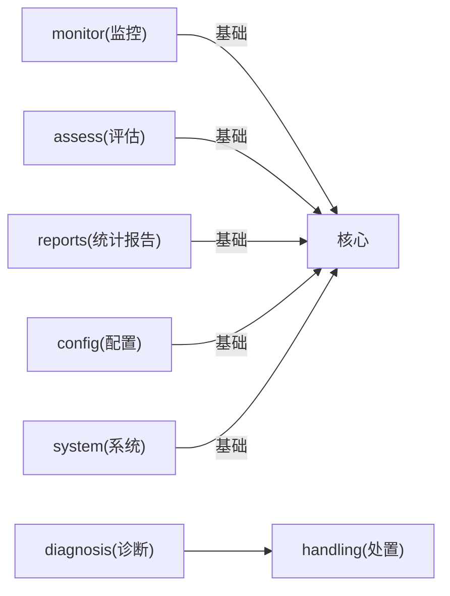

# 模块管理接口

<cite>
**本文引用的文件**
- [backend/app/api/v1/endpoints/system/modules.py](file://backend/app/api/v1/endpoints/system/modules.py)
- [backend/app/core/modules.py](file://backend/app/core/modules.py)
- [backend/app/models/sys_config.py](file://backend/app/models/sys_config.py)
- [backend/app/schemas/common.py](file://backend/app/schemas/common.py)
- [backend/app/main.py](file://backend/app/main.py)
</cite>

## 目录
1. [简介](#简介)
2. [项目结构](#项目结构)
3. [核心组件](#核心组件)
4. [架构总览](#架构总览)
5. [详细组件分析](#详细组件分析)
6. [依赖关系分析](#依赖关系分析)
7. [性能与热更新说明](#性能与热更新说明)
8. [故障排查指南](#故障排查指南)
9. [结论](#结论)
10. [附录：接口规范与示例](#附录接口规范与示例)

## 简介
本章节面向系统“模块管理”能力，提供模块列表查询、启用/禁用控制、依赖校验与冲突检测、配置持久化与缓存刷新等能力的完整 API 文档。当前实现覆盖：
- 模块清单与启用状态查询（支持按模块 key、名称、顺序、是否基础模块、依赖、启用状态进行筛选）
- 模块启用/禁用更新（含依赖自动补全、冲突校验、基础模块保护）
- 配置持久化到系统配置表，进程内缓存刷新
- 路由注册与访问控制（管理员权限）

注意：当前实现的启用/禁用变更需重启后端服务以生效（例如 Celery beat 调度变更需要重启）。

## 项目结构
模块管理相关代码主要分布在以下位置：
- 端点定义：system 模块的路由与请求/响应模型
- 核心逻辑：模块注册中心、缓存、依赖校验、持久化
- 数据模型：系统配置项存储
- 应用入口：路由挂载

图表来源
- [backend/app/api/v1/endpoints/system/modules.py:1-123](file://backend/app/api/v1/endpoints/system/modules.py#L1-L123)
- [backend/app/core/modules.py:1-239](file://backend/app/core/modules.py#L1-L239)
- [backend/app/models/sys_config.py](file://backend/app/models/sys_config.py)
- [backend/app/schemas/common.py](file://backend/app/schemas/common.py)
- [backend/app/main.py](file://backend/app/main.py)

章节来源
- [backend/app/api/v1/endpoints/system/modules.py:1-123](file://backend/app/api/v1/endpoints/system/modules.py#L1-L123)
- [backend/app/core/modules.py:1-239](file://backend/app/core/modules.py#L1-L239)
- [backend/app/main.py](file://backend/app/main.py)

## 核心组件
- 模块注册中心：维护模块元数据（key、name、order、base、deps）、进程内缓存、加载/保存逻辑、依赖校验工具
- 模块管理端点：提供 GET/PUT 接口，负责参数校验、权限控制、调用核心逻辑并返回统一响应
- 系统配置持久化：通过 sys_config 表存储已启用模块的 JSON 数组
- 通用响应封装：统一成功响应格式

章节来源
- [backend/app/core/modules.py:22-32](file://backend/app/core/modules.py#L22-L32)
- [backend/app/core/modules.py:96-129](file://backend/app/core/modules.py#L96-L129)
- [backend/app/core/modules.py:162-239](file://backend/app/core/modules.py#L162-L239)
- [backend/app/api/v1/endpoints/system/modules.py:31-48](file://backend/app/api/v1/endpoints/system/modules.py#L31-L48)
- [backend/app/api/v1/endpoints/system/modules.py:50-123](file://backend/app/api/v1/endpoints/system/modules.py#L50-L123)

## 架构总览
模块管理采用“端点 + 核心逻辑 + 数据模型”的分层设计：
- 端点层：接收请求、鉴权、参数校验、调用核心逻辑、组装响应
- 核心层：模块注册、缓存、依赖校验、持久化
- 数据层：系统配置表存储启用集合

图表来源
- [backend/app/api/v1/endpoints/system/modules.py:50-123](file://backend/app/api/v1/endpoints/system/modules.py#L50-L123)
- [backend/app/core/modules.py:162-239](file://backend/app/core/modules.py#L162-L239)
- [backend/app/models/sys_config.py](file://backend/app/models/sys_config.py)

## 详细组件分析

### 模块列表查询接口
- 路径与方法：GET /api/v1/system/modules
- 权限：当前登录用户（基于依赖注入）
- 功能：
  - 列出全部模块及其当前启用状态
  - 返回 enabledKeys（已启用模块 key 列表）
  - restartRequired 固定为 True（当前实现要求重启后生效）
- 筛选建议：
  - 前端可在客户端对 modules 列表按 name、base、deps、enabled 进行过滤
  - 服务端未暴露 query 参数，如需服务端筛选可扩展端点

图表来源
- [backend/app/api/v1/endpoints/system/modules.py:50-63](file://backend/app/api/v1/endpoints/system/modules.py#L50-L63)
- [backend/app/core/modules.py:114-129](file://backend/app/core/modules.py#L114-L129)

章节来源
- [backend/app/api/v1/endpoints/system/modules.py:50-63](file://backend/app/api/v1/endpoints/system/modules.py#L50-L63)
- [backend/app/core/modules.py:114-129](file://backend/app/core/modules.py#L114-L129)

### 模块启用/禁用接口（含依赖检查与热更新机制）
- 路径与方法：PUT /api/v1/system/modules
- 权限：ADMIN
- 功能：
  - 校验请求中的 enabledKeys，拒绝未知 key
  - 强制保留基础模块（base=True）
  - 自动补全依赖（如启用 handling 时自动启用 diagnosis）
  - 校验禁用冲突（若禁用某模块导致其他模块依赖缺失则拒绝）
  - 持久化到 sys_config.enabled_modules，并刷新进程内缓存
  - 返回更新后的模块清单与 enabledKeys
- 热更新说明：
  - 当前实现会刷新进程内缓存，但注释明确“启用/禁用需重启后端生效”，因此业务侧应遵循重启策略（尤其涉及 Celery beat 调度变更）

图表来源
- [backend/app/api/v1/endpoints/system/modules.py:66-123](file://backend/app/api/v1/endpoints/system/modules.py#L66-L123)
- [backend/app/core/modules.py:196-239](file://backend/app/core/modules.py#L196-L239)

章节来源
- [backend/app/api/v1/endpoints/system/modules.py:66-123](file://backend/app/api/v1/endpoints/system/modules.py#L66-L123)
- [backend/app/core/modules.py:162-239](file://backend/app/core/modules.py#L162-L239)

### 模块配置与动态配置管理
- 配置键：enabled_modules（JSON 数组字符串）
- 存储位置：sys_config 表
- 行为：
  - 解析失败或非法值回退默认（所有模块启用）
  - 基础模块强制启用
  - 写入后刷新进程内缓存
- 验证规则：
  - 仅允许 MODULES 中定义的 key
  - 基础模块不可禁用
  - 依赖必须满足（启用时自动补全；禁用时需无冲突）

章节来源
- [backend/app/core/modules.py:45-65](file://backend/app/core/modules.py#L45-L65)
- [backend/app/core/modules.py:196-239](file://backend/app/core/modules.py#L196-L239)
- [backend/app/models/sys_config.py](file://backend/app/models/sys_config.py)

### 模块版本管理与升级回滚策略
- 现状：当前仓库未提供模块版本管理、升级/回滚的专用 API
- 建议：
  - 在现有 enabled_modules 基础上扩展 version 字段，记录模块版本
  - 升级流程：校验兼容性 → 写入新版本 → 触发重启/热重载 → 健康检查
  - 回滚流程：识别异常 → 恢复上一版本 → 触发重启/热重载 → 健康检查
- 注意：当前实现未包含版本字段与回滚逻辑，需在后续迭代中补充

[本节为概念性说明，不直接分析具体文件]

### 模块间依赖关系处理、冲突检测与兼容性检查
- 依赖声明：MODULES 中每个模块可声明 deps 列表
- 自动补全：启用某模块时，其依赖会被自动加入
- 冲突检测：尝试禁用某模块时，若存在其他已启用模块依赖它，则拒绝并返回冲突信息
- 兼容性检查：当前未实现语义化的兼容性矩阵（如最小/最大兼容版本），建议在版本管理阶段引入

章节来源
- [backend/app/core/modules.py:22-32](file://backend/app/core/modules.py#L22-L32)
- [backend/app/core/modules.py:162-180](file://backend/app/core/modules.py#L162-L180)
- [backend/app/api/v1/endpoints/system/modules.py:95-108](file://backend/app/api/v1/endpoints/system/modules.py#L95-L108)

## 依赖关系分析
模块间的依赖关系由 MODULES 元数据声明，并在启用/禁用时进行校验与自动补全。

图表来源
- [backend/app/core/modules.py:22-32](file://backend/app/core/modules.py#L22-L32)

章节来源
- [backend/app/core/modules.py:22-32](file://backend/app/core/modules.py#L22-L32)

## 性能与热更新说明
- 进程内缓存：启用状态缓存在内存中，避免频繁读库
- 启动加载：应用启动时从 sys_config 异步加载并刷新缓存
- 写入路径：更新启用状态时写库并刷新缓存
- 热更新限制：尽管缓存已刷新，但当前实现要求重启后端服务以完全生效（特别是调度器变更）

章节来源
- [backend/app/core/modules.py:36-111](file://backend/app/core/modules.py#L36-L111)
- [backend/app/core/modules.py:183-193](file://backend/app/core/modules.py#L183-L193)
- [backend/app/core/modules.py:196-239](file://backend/app/core/modules.py#L196-L239)

## 故障排查指南
- 常见错误
  - 未知模块 key：请求中包含不在 MODULES 中的 key
  - 依赖冲突：禁用某模块导致其他模块依赖缺失
  - 基础模块被禁用：基础模块不可禁用，系统会自动强制启用
- 定位方法
  - 查看返回的错误码与消息（ERR_PARAM、ERR_MODULE_DEPENDENCY）
  - 检查 sys_config.enabled_modules 的值是否正确
  - 确认模块依赖声明是否符合预期
- 解决步骤
  - 修正请求中的 enabledKeys
  - 先禁用依赖模块再禁用被依赖模块
  - 重启后端服务使变更完全生效

章节来源
- [backend/app/api/v1/endpoints/system/modules.py:80-113](file://backend/app/api/v1/endpoints/system/modules.py#L80-L113)
- [backend/app/core/modules.py:162-239](file://backend/app/core/modules.py#L162-L239)

## 结论
当前模块管理实现了模块清单查询、启用/禁用控制、依赖校验与冲突检测、配置持久化与缓存刷新。对于版本管理、升级回滚、兼容性检查等高级能力，建议在后续迭代中扩展。生产环境请遵循“重启生效”的策略，确保调度器等组件正确加载新配置。

[本节为总结性内容，不直接分析具体文件]

## 附录：接口规范与示例

### 接口总览
- 模块列表查询
  - 方法：GET
  - 路径：/api/v1/system/modules
  - 权限：当前登录用户
  - 响应：统一成功响应，包含 modules、enabledKeys、restartRequired
- 模块启用/禁用更新
  - 方法：PUT
  - 路径：/api/v1/system/modules
  - 权限：ADMIN
  - 请求体：{ enabledKeys: string[] }
  - 响应：统一成功响应，包含更新后的 modules、enabledKeys、restartRequired

章节来源
- [backend/app/api/v1/endpoints/system/modules.py:50-123](file://backend/app/api/v1/endpoints/system/modules.py#L50-L123)
- [backend/app/schemas/common.py](file://backend/app/schemas/common.py)

### 请求与响应示例
- 查询模块列表
  - 请求：GET /api/v1/system/modules
  - 响应：{ code, message, data: { modules, enabledKeys, restartRequired } }
- 更新模块启用状态
  - 请求：PUT /api/v1/system/modules
  - 请求体：{ "enabledKeys": ["monitor","assess","diagnosis","handling","reports","config","system"] }
  - 响应：{ code, message, data: { modules, enabledKeys, restartRequired } }

章节来源
- [backend/app/api/v1/endpoints/system/modules.py:31-48](file://backend/app/api/v1/endpoints/system/modules.py#L31-L48)
- [backend/app/api/v1/endpoints/system/modules.py:50-123](file://backend/app/api/v1/endpoints/system/modules.py#L50-L123)

### 错误处理方案
- ERR_PARAM：请求中包含未知模块 key
- ERR_MODULE_DEPENDENCY：依赖冲突或禁用冲突
- 处理建议：根据错误消息调整 enabledKeys，必要时先调整依赖模块状态

章节来源
- [backend/app/api/v1/endpoints/system/modules.py:80-113](file://backend/app/api/v1/endpoints/system/modules.py#L80-L113)

### 模块开发规范与集成指南
- 模块注册：在 MODULES 中声明 key、name、order、base、deps
- 模块守卫：使用 require_module(key) 在可选模块专属端点前做守卫
- 权限控制：模块管理端点需 ADMIN 权限
- 集成要点：
  - 新增模块需考虑依赖关系与基础模块约束
  - 新增端点需结合 is_module_enabled 或 require_module 进行开关控制
  - 修改启用状态后需重启服务以确保调度器加载新配置

章节来源
- [backend/app/core/modules.py:22-32](file://backend/app/core/modules.py#L22-L32)
- [backend/app/core/modules.py:147-159](file://backend/app/core/modules.py#L147-L159)
- [backend/app/api/v1/endpoints/system/modules.py:66-78](file://backend/app/api/v1/endpoints/system/modules.py#L66-L78)