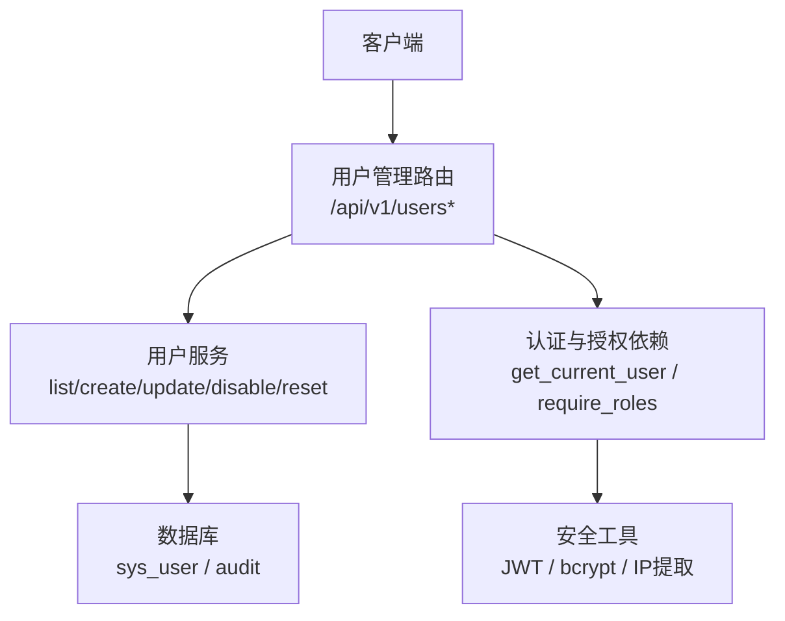
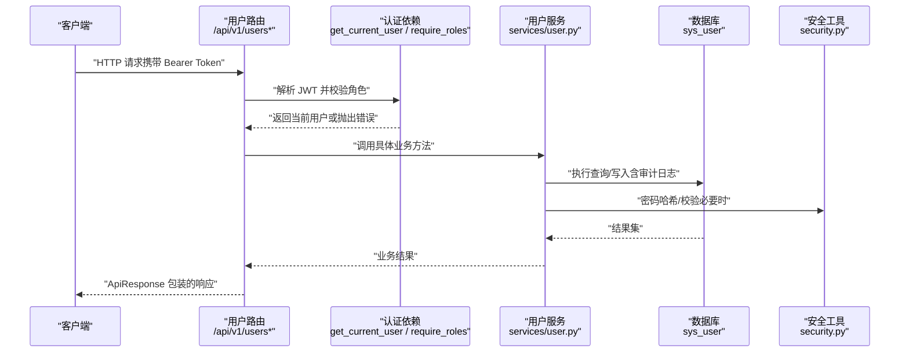
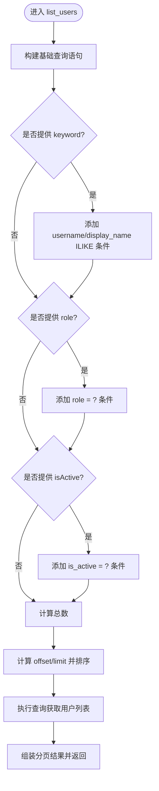
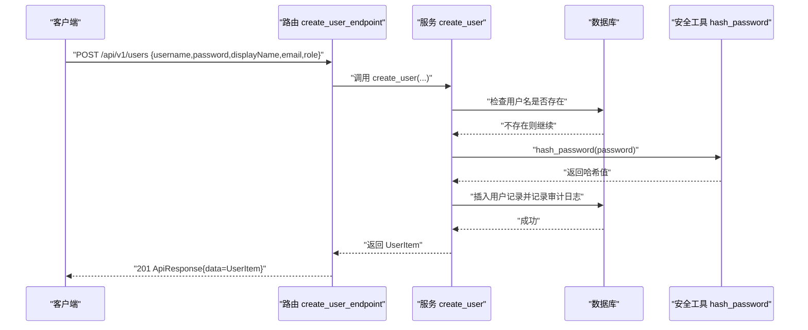
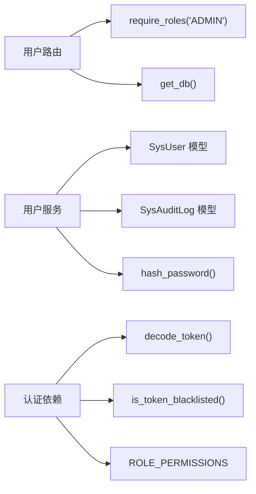

# 用户管理接口

<cite>
**本文引用的文件**
- [backend/app/api/v1/endpoints/users.py](file://backend/app/api/v1/endpoints/users.py)
- [backend/app/schemas/user.py](file://backend/app/schemas/user.py)
- [backend/app/services/user.py](file://backend/app/services/user.py)
- [backend/app/models/sys_user.py](file://backend/app/models/sys_user.py)
- [backend/app/api/v1/endpoints/auth.py](file://backend/app/api/v1/endpoints/auth.py)
- [backend/app/schemas/auth.py](file://backend/app/schemas/auth.py)
- [backend/app/core/security.py](file://backend/app/core/security.py)
- [backend/app/api/deps.py](file://backend/app/api/deps.py)
- [backend/tests/test_users.py](file://backend/tests/test_users.py)
</cite>

## 目录
1. [简介](#简介)
2. [项目结构](#项目结构)
3. [核心组件](#核心组件)
4. [架构总览](#架构总览)
5. [详细组件分析](#详细组件分析)
6. [依赖关系分析](#依赖关系分析)
7. [性能考虑](#性能考虑)
8. [故障排查指南](#故障排查指南)
9. [结论](#结论)
10. [附录：请求与响应示例、错误码与权限要求](#附录请求与响应示例错误码与权限要求)

## 简介
本文件为用户管理模块的 API 文档，覆盖以下能力：
- 用户列表查询：支持分页、用户名/姓名模糊查询、角色筛选、状态筛选。
- 用户创建：包含用户名、密码、显示名称、邮箱、角色等字段的校验规则。
- 用户更新：可修改字段与权限控制。
- 用户禁用：软删除机制（is_active=False）。
- 密码重置：安全策略与验证流程。
- 完整的请求/响应示例、错误码说明与权限要求。
- 最佳实践与安全建议。

## 项目结构
用户管理相关代码位于后端 FastAPI 应用中，采用“路由层 -> 服务层 -> 数据模型”的分层设计：
- 路由层：定义 HTTP 端点与参数校验（FastAPI + Pydantic）。
- 服务层：实现业务逻辑（分页、过滤、审计日志、密码哈希等）。
- 数据模型：ORM 映射到数据库表 sys_user。
- 认证与授权：JWT 鉴权、RBAC 角色校验、强制改密策略。

**图表来源**
- [backend/app/api/v1/endpoints/users.py:1-134](file://backend/app/api/v1/endpoints/users.py#L1-L134)
- [backend/app/services/user.py:1-320](file://backend/app/services/user.py#L1-L320)
- [backend/app/models/sys_user.py:1-49](file://backend/app/models/sys_user.py#L1-L49)
- [backend/app/api/deps.py:1-209](file://backend/app/api/deps.py#L1-L209)
- [backend/app/core/security.py:1-219](file://backend/app/core/security.py#L1-L219)

**章节来源**
- [backend/app/api/v1/endpoints/users.py:1-134](file://backend/app/api/v1/endpoints/users.py#L1-L134)
- [backend/app/services/user.py:1-320](file://backend/app/services/user.py#L1-L320)
- [backend/app/models/sys_user.py:1-49](file://backend/app/models/sys_user.py#L1-L49)
- [backend/app/api/deps.py:1-209](file://backend/app/api/deps.py#L1-L209)
- [backend/app/core/security.py:1-219](file://backend/app/core/security.py#L1-L219)

## 核心组件
- 路由层（users.py）：定义 GET/POST/PUT/DELETE 端点，统一返回 ApiResponse 包装。
- 服务层（user.py）：实现分页查询、过滤条件、创建/更新/禁用/重置密码的业务逻辑，并记录审计日志。
- 数据模型（sys_user.py）：用户表结构，包含唯一约束、检查约束与索引。
- 认证与授权（deps.py, auth.py, security.py）：JWT 签发与校验、角色权限校验、设备绑定、强制改密策略。
- 请求/响应模式（schemas/user.py, schemas/auth.py）：Pydantic 校验规则与数据结构。

**章节来源**
- [backend/app/api/v1/endpoints/users.py:1-134](file://backend/app/api/v1/endpoints/users.py#L1-L134)
- [backend/app/schemas/user.py:1-96](file://backend/app/schemas/user.py#L1-L96)
- [backend/app/services/user.py:1-320](file://backend/app/services/user.py#L1-L320)
- [backend/app/models/sys_user.py:1-49](file://backend/app/models/sys_user.py#L1-L49)
- [backend/app/api/deps.py:1-209](file://backend/app/api/deps.py#L1-L209)
- [backend/app/schemas/auth.py:1-194](file://backend/app/schemas/auth.py#L1-L194)
- [backend/app/core/security.py:1-219](file://backend/app/core/security.py#L1-L219)

## 架构总览
下图展示了用户管理接口的调用链路与关键组件交互：

**图表来源**
- [backend/app/api/v1/endpoints/users.py:1-134](file://backend/app/api/v1/endpoints/users.py#L1-L134)
- [backend/app/api/deps.py:1-209](file://backend/app/api/deps.py#L1-L209)
- [backend/app/services/user.py:1-320](file://backend/app/services/user.py#L1-L320)
- [backend/app/core/security.py:1-219](file://backend/app/core/security.py#L1-L219)

## 详细组件分析

### 用户列表查询（GET /api/v1/users）
- 功能：分页查询用户列表，仅 ADMIN 可访问。
- 分页参数：
  - page：页码，默认 1，最小值 1。
  - pageSize：每页条数，默认 20，范围 1~100。
- 筛选条件：
  - keyword：按用户名或姓名进行模糊匹配（大小写不敏感）。
  - role：按角色精确筛选（ADMIN/IC_ENGINEER/PE_ENGINEER/SPONSOR/EXPERT）。
  - isActive：按状态筛选（true/false）。
- 排序：按创建时间倒序。
- 权限：需要 ADMIN 角色。
- 返回：包含 items、total、page、pageSize 的分页数据。

**图表来源**
- [backend/app/services/user.py:58-102](file://backend/app/services/user.py#L58-L102)

**章节来源**
- [backend/app/api/v1/endpoints/users.py:40-59](file://backend/app/api/v1/endpoints/users.py#L40-L59)
- [backend/app/services/user.py:58-102](file://backend/app/services/user.py#L58-L102)
- [backend/app/models/sys_user.py:15-49](file://backend/app/models/sys_user.py#L15-L49)

### 用户创建（POST /api/v1/users）
- 功能：创建新用户，仅 ADMIN 可访问。
- 请求体字段与校验：
  - username：必填，长度 1~50，唯一性校验（重复返回 ERR_USER_DUPLICATE）。
  - password：必填，长度 8~64；生产环境需满足复杂度（大小写字母、数字、特殊字符），开发环境放宽至长度≥4。
  - displayName：必填，长度 1~100。
  - email：可选，最大长度 255。
  - role：必填，限定为 ADMIN/IC_ENGINEER/PE_ENGINEER/SPONSOR/EXPERT。
- 处理流程：
  - 检查用户名唯一性。
  - 使用 bcrypt 对密码进行哈希存储。
  - 设置 is_active=True。
  - 记录审计日志（USER_CREATE）。
  - 提交事务并返回新用户的 UserItem。
- 权限：需要 ADMIN 角色。

**图表来源**
- [backend/app/api/v1/endpoints/users.py:62-78](file://backend/app/api/v1/endpoints/users.py#L62-L78)
- [backend/app/services/user.py:105-159](file://backend/app/services/user.py#L105-L159)
- [backend/app/core/security.py:33-35](file://backend/app/core/security.py#L33-L35)
- [backend/app/schemas/user.py:11-33](file://backend/app/schemas/user.py#L11-L33)

**章节来源**
- [backend/app/api/v1/endpoints/users.py:62-78](file://backend/app/api/v1/endpoints/users.py#L62-L78)
- [backend/app/services/user.py:105-159](file://backend/app/services/user.py#L105-L159)
- [backend/app/schemas/user.py:11-33](file://backend/app/schemas/user.py#L11-L33)
- [backend/app/core/security.py:33-35](file://backend/app/core/security.py#L33-L35)
- [backend/tests/test_users.py:150-239](file://backend/tests/test_users.py#L150-L239)

### 用户更新（PUT /api/v1/users/{id}）
- 功能：部分更新用户信息，仅 ADMIN 可访问。
- 可修改字段：
  - displayName：可选，长度 1~100。
  - email：可选，最大长度 255。
  - role：可选，限定为 ADMIN/IC_ENGINEER/PE_ENGINEER/SPONSOR/EXPERT。
  - isActive：可选，布尔值。
- 处理流程：
  - 查找用户，不存在返回 ERR_USER_NOT_FOUND。
  - 更新指定字段，记录 updated_at。
  - 记录审计日志（USER_UPDATE），包含 before/after 快照。
  - 提交事务并返回更新后的 UserItem。
- 权限：需要 ADMIN 角色。

**章节来源**
- [backend/app/api/v1/endpoints/users.py:81-98](file://backend/app/api/v1/endpoints/users.py#L81-L98)
- [backend/app/services/user.py:162-212](file://backend/app/services/user.py#L162-L212)
- [backend/app/schemas/user.py:35-51](file://backend/app/schemas/user.py#L35-L51)
- [backend/tests/test_users.py:247-286](file://backend/tests/test_users.py#L247-L286)

### 用户禁用（DELETE /api/v1/users/{id}）
- 功能：禁用用户（软删除），仅 ADMIN 可访问。
- 机制：将 is_active 设置为 False，保留历史数据以便审计与追溯。
- 处理流程：
  - 查找用户，不存在返回 ERR_USER_NOT_FOUND。
  - 设置 is_active=False，记录 updated_at。
  - 记录审计日志（USER_DISABLE），包含 before/after 快照。
  - 提交事务并返回更新后的 UserItem。
- 权限：需要 ADMIN 角色。

**章节来源**
- [backend/app/api/v1/endpoints/users.py:101-113](file://backend/app/api/v1/endpoints/users.py#L101-L113)
- [backend/app/services/user.py:215-254](file://backend/app/services/user.py#L215-L254)
- [backend/tests/test_users.py:294-329](file://backend/tests/test_users.py#L294-L329)

### 密码重置（PUT /api/v1/users/{id}/reset-password）
- 功能：管理员重置用户密码，仅 ADMIN 可访问。
- 安全策略：
  - 新密码需满足复杂度要求（同创建密码策略）。
  - 使用 bcrypt 哈希存储，不保存明文。
  - 记录审计日志（USER_RESET_PASSWORD），标记 passwordChanged。
- 处理流程：
  - 查找用户，不存在返回 ERR_USER_NOT_FOUND。
  - 哈希新密码并更新 password_hash。
  - 记录 updated_at 与审计日志。
  - 提交事务并返回 {passwordChanged: true}。
- 权限：需要 ADMIN 角色。

**章节来源**
- [backend/app/api/v1/endpoints/users.py:116-130](file://backend/app/api/v1/endpoints/users.py#L116-L130)
- [backend/app/services/user.py:257-291](file://backend/app/services/user.py#L257-L291)
- [backend/app/schemas/user.py:54-63](file://backend/app/schemas/user.py#L54-L63)
- [backend/app/schemas/auth.py:43-90](file://backend/app/schemas/auth.py#L43-L90)
- [backend/tests/test_users.py:337-386](file://backend/tests/test_users.py#L337-L386)

### 认证与权限控制
- 登录与会话：
  - 登录返回 accessToken、refreshToken、tokenType、expiresIn 与用户信息。
  - 刷新令牌通过 refresh token 获取新的 access token。
  - 登出会将当前 access token 加入黑名单。
- 强制改密策略：
  - 若 must_change_password=True，除读操作与豁免路径外，拒绝写操作。
  - 豁免路径包括改密与登出，以及数据源配置相关接口。
- 角色与权限：
  - 所有用户管理端点均要求 ADMIN 角色。
  - 非 ADMIN 角色访问将返回 ERR_PERMISSION_DENIED（403）。
- 设备绑定：
  - Refresh Token 可绑定设备 IP，刷新时校验设备一致性，不一致则拒绝。

**章节来源**
- [backend/app/api/v1/endpoints/auth.py:69-148](file://backend/app/api/v1/endpoints/auth.py#L69-L148)
- [backend/app/api/deps.py:50-153](file://backend/app/api/deps.py#L50-L153)
- [backend/app/schemas/auth.py:98-167](file://backend/app/schemas/auth.py#L98-L167)
- [backend/app/core/security.py:77-195](file://backend/app/core/security.py#L77-L195)

## 依赖关系分析
- 路由层依赖：
  - get_db：异步数据库会话。
  - require_roles("ADMIN")：角色权限校验。
- 服务层依赖：
  - SysUser 模型：用户数据实体。
  - SysAuditLog：审计日志实体。
  - hash_password：密码哈希工具。
- 认证依赖：
  - get_current_user：JWT 解码、黑名单检查、账户状态检查、强制改密检查。
  - oauth2_scheme：自动注入 Authorization 头。
  - ROLE_PERMISSIONS：角色与权限码映射。

**图表来源**
- [backend/app/api/v1/endpoints/users.py:1-134](file://backend/app/api/v1/endpoints/users.py#L1-L134)
- [backend/app/services/user.py:1-320](file://backend/app/services/user.py#L1-L320)
- [backend/app/api/deps.py:1-209](file://backend/app/api/deps.py#L1-L209)
- [backend/app/core/security.py:1-219](file://backend/app/core/security.py#L1-L219)

**章节来源**
- [backend/app/api/v1/endpoints/users.py:1-134](file://backend/app/api/v1/endpoints/users.py#L1-L134)
- [backend/app/services/user.py:1-320](file://backend/app/services/user.py#L1-L320)
- [backend/app/api/deps.py:1-209](file://backend/app/api/deps.py#L1-L209)
- [backend/app/core/security.py:1-219](file://backend/app/core/security.py#L1-L219)

## 性能考虑
- 分页与计数：
  - 先 count 再 limit/offset 分页，避免全量加载。
  - 建议在 username、display_name、role、is_active 上建立合适索引以提升查询性能。
- 模糊查询：
  - 使用 ILIKE 进行大小写不敏感匹配，注意在大数据量下可能影响性能。
- 审计日志：
  - 每次写操作均记录审计日志，确保可追溯但会增加写入开销。
- 密码哈希：
  - bcrypt 哈希计算有一定 CPU 开销，合理设置并发与超时。
- 强制改密：
  - 首次登录强制改密可减少安全风险，但需在豁免路径中放行必要读操作以避免前端死锁。

[本节为通用性能讨论，不直接分析具体文件]

## 故障排查指南
- 常见错误码：
  - ERR_TOKEN_INVALID：未携带或无效 Token。
  - ERR_TOKEN_EXPIRED：Token 已过期。
  - ERR_ACCOUNT_DISABLED：账户已禁用。
  - ERR_PERMISSION_DENIED：权限不足（非 ADMIN 访问用户管理端点）。
  - ERR_USER_DUPLICATE：用户名重复。
  - ERR_USER_NOT_FOUND：用户不存在。
  - ERR_PASSWORD_CHANGE_REQUIRED：首次登录须先修改密码。
  - ERR_TOKEN_DEVICE_MISMATCH：Refresh Token 设备信息不匹配。
- 排查步骤：
  - 确认请求携带有效的 Bearer Token。
  - 检查当前用户角色是否为 ADMIN。
  - 检查用户状态 is_active 是否为 True。
  - 检查密码复杂度是否符合要求。
  - 查看审计日志以定位变更前后状态。

**章节来源**
- [backend/app/api/deps.py:50-153](file://backend/app/api/deps.py#L50-L153)
- [backend/app/services/user.py:105-291](file://backend/app/services/user.py#L105-L291)
- [backend/app/core/security.py:151-195](file://backend/app/core/security.py#L151-L195)
- [backend/tests/test_users.py:120-386](file://backend/tests/test_users.py#L120-L386)

## 结论
用户管理模块提供了完善的 CRUD 能力，具备严格的权限控制、密码安全策略与审计追踪。通过分页与过滤提升查询效率，通过软删除保障数据安全与可追溯性。建议在生产环境中严格遵循密码复杂度要求，并结合 RBAC 与强制改密策略提升系统安全性。

[本节为总结性内容，不直接分析具体文件]

## 附录：请求与响应示例、错误码与权限要求

### 通用响应格式
- 所有接口返回 ApiResponse 包装：
  - code：状态码（如 "0" 表示成功）。
  - message：提示信息。
  - data：业务数据。

### 用户列表查询
- 端点：GET /api/v1/users
- 权限：ADMIN
- 查询参数：
  - keyword：字符串，可选，模糊匹配用户名/姓名。
  - role：字符串，可选，限定为 ADMIN/IC_ENGINEER/PE_ENGINEER/SPONSOR/EXPERT。
  - isActive：布尔，可选，true/false。
  - page：整数，默认 1，最小 1。
  - pageSize：整数，默认 20，范围 1~100。
- 成功响应示例：
  - 200 ApiResponse{data:{items:[...], total: N, page: P, pageSize: S}}
- 失败示例：
  - 401 ApiResponse{code:"ERR_TOKEN_INVALID", message:"未携带认证 Token"}
  - 403 ApiResponse{code:"ERR_PERMISSION_DENIED", message:"权限不足，需要以下角色之一: ADMIN"}

**章节来源**
- [backend/app/api/v1/endpoints/users.py:40-59](file://backend/app/api/v1/endpoints/users.py#L40-L59)
- [backend/app/services/user.py:58-102](file://backend/app/services/user.py#L58-L102)
- [backend/tests/test_users.py:69-143](file://backend/tests/test_users.py#L69-L143)

### 用户创建
- 端点：POST /api/v1/users
- 权限：ADMIN
- 请求体字段：
  - username：字符串，必填，长度 1~50。
  - password：字符串，必填，长度 8~64，生产环境需满足复杂度。
  - displayName：字符串，必填，长度 1~100。
  - email：字符串，可选，最大长度 255。
  - role：字符串，必填，限定为 ADMIN/IC_ENGINEER/PE_ENGINEER/SPONSOR/EXPERT。
- 成功响应示例：
  - 201 ApiResponse{data:{id, username, displayName, email, role, isActive:true, ...}}
- 失败示例：
  - 409 ApiResponse{code:"ERR_USER_DUPLICATE", message:"用户名已存在: xxx"}
  - 422 校验失败（密码复杂度或角色非法）

**章节来源**
- [backend/app/api/v1/endpoints/users.py:62-78](file://backend/app/api/v1/endpoints/users.py#L62-L78)
- [backend/app/schemas/user.py:11-33](file://backend/app/schemas/user.py#L11-L33)
- [backend/app/services/user.py:105-159](file://backend/app/services/user.py#L105-L159)
- [backend/tests/test_users.py:150-239](file://backend/tests/test_users.py#L150-L239)

### 用户更新
- 端点：PUT /api/v1/users/{id}
- 权限：ADMIN
- 请求体字段（部分更新）：
  - displayName：可选，长度 1~100。
  - email：可选，最大长度 255。
  - role：可选，限定为 ADMIN/IC_ENGINEER/PE_ENGINEER/SPONSOR/EXPERT。
  - isActive：可选，布尔值。
- 成功响应示例：
  - 200 ApiResponse{data:{...更新后的用户信息...}}
- 失败示例：
  - 404 ApiResponse{code:"ERR_USER_NOT_FOUND", message:"用户不存在"}
  - 403 ApiResponse{code:"ERR_PERMISSION_DENIED", message:"权限不足..."}

**章节来源**
- [backend/app/api/v1/endpoints/users.py:81-98](file://backend/app/api/v1/endpoints/users.py#L81-L98)
- [backend/app/schemas/user.py:35-51](file://backend/app/schemas/user.py#L35-L51)
- [backend/app/services/user.py:162-212](file://backend/app/services/user.py#L162-L212)
- [backend/tests/test_users.py:247-286](file://backend/tests/test_users.py#L247-L286)

### 用户禁用
- 端点：DELETE /api/v1/users/{id}
- 权限：ADMIN
- 机制：软删除（is_active=False）
- 成功响应示例：
  - 200 ApiResponse{data:{...isActive:false...}}
- 失败示例：
  - 404 ApiResponse{code:"ERR_USER_NOT_FOUND", message:"用户不存在"}
  - 403 ApiResponse{code:"ERR_PERMISSION_DENIED", message:"权限不足..."}

**章节来源**
- [backend/app/api/v1/endpoints/users.py:101-113](file://backend/app/api/v1/endpoints/users.py#L101-L113)
- [backend/app/services/user.py:215-254](file://backend/app/services/user.py#L215-L254)
- [backend/tests/test_users.py:294-329](file://backend/tests/test_users.py#L294-L329)

### 密码重置
- 端点：PUT /api/v1/users/{id}/reset-password
- 权限：ADMIN
- 请求体字段：
  - newPassword：字符串，必填，长度 8~64，生产环境需满足复杂度。
- 成功响应示例：
  - 200 ApiResponse{data:{passwordChanged:true}}
- 失败示例：
  - 404 ApiResponse{code:"ERR_USER_NOT_FOUND", message:"用户不存在"}
  - 422 校验失败（密码复杂度）

**章节来源**
- [backend/app/api/v1/endpoints/users.py:116-130](file://backend/app/api/v1/endpoints/users.py#L116-L130)
- [backend/app/schemas/user.py:54-63](file://backend/app/schemas/user.py#L54-L63)
- [backend/app/services/user.py:257-291](file://backend/app/services/user.py#L257-L291)
- [backend/tests/test_users.py:337-386](file://backend/tests/test_users.py#L337-L386)

### 错误码汇总
- ERR_TOKEN_INVALID：Token 无效或未携带。
- ERR_TOKEN_EXPIRED：Token 已过期。
- ERR_ACCOUNT_DISABLED：账户已禁用。
- ERR_PERMISSION_DENIED：权限不足。
- ERR_USER_DUPLICATE：用户名重复。
- ERR_USER_NOT_FOUND：用户不存在。
- ERR_PASSWORD_CHANGE_REQUIRED：首次登录须先修改密码。
- ERR_TOKEN_DEVICE_MISMATCH：设备信息不匹配。

**章节来源**
- [backend/app/api/deps.py:50-153](file://backend/app/api/deps.py#L50-L153)
- [backend/app/services/user.py:105-291](file://backend/app/services/user.py#L105-L291)
- [backend/app/core/security.py:151-195](file://backend/app/core/security.py#L151-L195)

### 权限要求
- 所有用户管理端点均要求 ADMIN 角色。
- 非 ADMIN 角色访问将返回 403 与 ERR_PERMISSION_DENIED。
- 首次登录强制改密期间，除读操作与豁免路径外，写操作将被拒绝。

**章节来源**
- [backend/app/api/v1/endpoints/users.py:1-134](file://backend/app/api/v1/endpoints/users.py#L1-L134)
- [backend/app/api/deps.py:135-153](file://backend/app/api/deps.py#L135-L153)
- [backend/app/api/deps.py:118-130](file://backend/app/api/deps.py#L118-L130)

### 最佳实践与安全建议
- 密码策略：
  - 生产环境启用完整复杂度校验，避免弱密码。
  - 定期轮换密码，结合强制改密策略。
- 权限控制：
  - 严格限制用户管理端点为 ADMIN 角色。
  - 使用 RBAC 与权限码进行细粒度控制。
- 审计追踪：
  - 所有写操作记录审计日志，便于问题追溯。
- 数据安全：
  - 使用 HTTPS 传输，避免明文密码泄露。
  - 使用 bcrypt 哈希存储密码，不保存明文。
- 性能优化：
  - 合理使用分页与过滤，避免大表全量扫描。
  - 为常用查询字段建立索引。

[本节为通用建议，不直接分析具体文件]