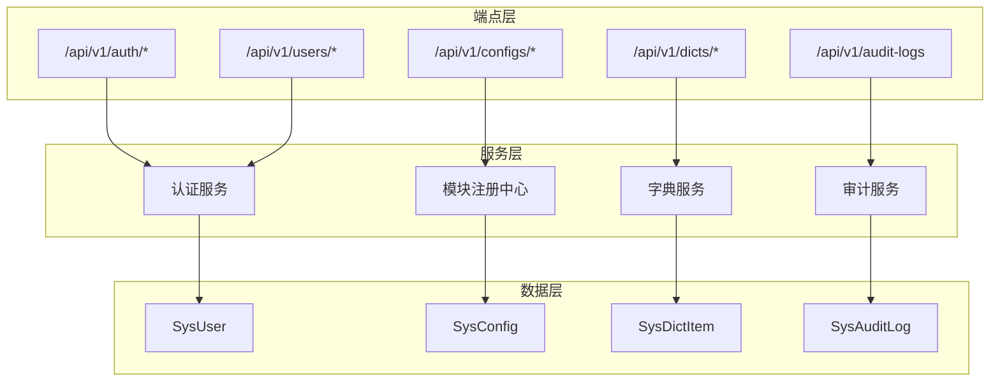
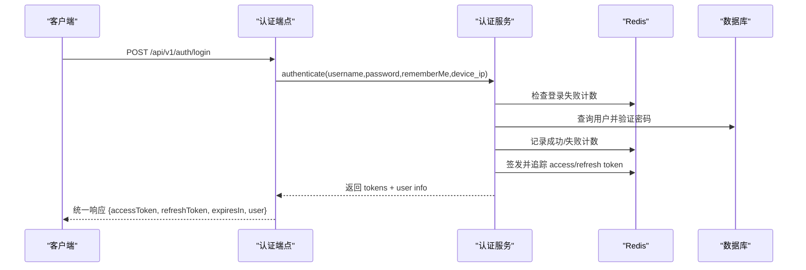
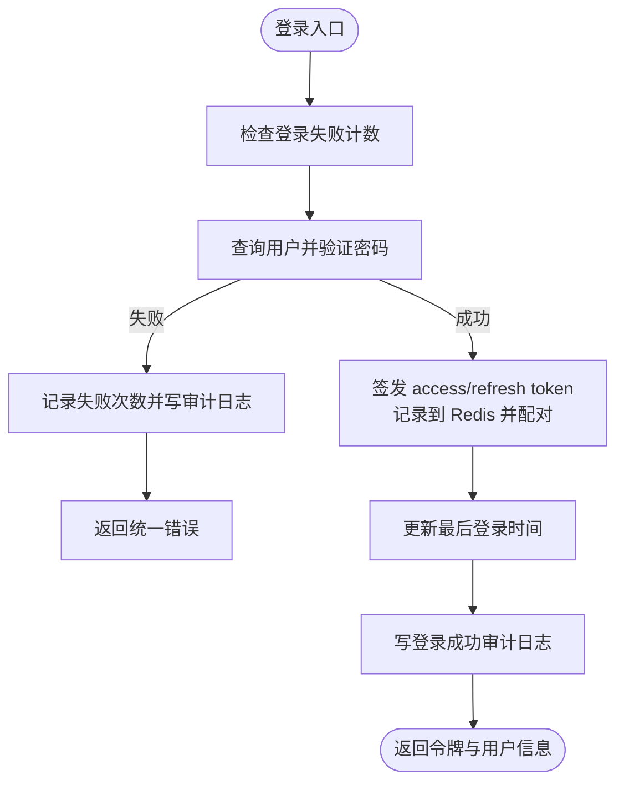
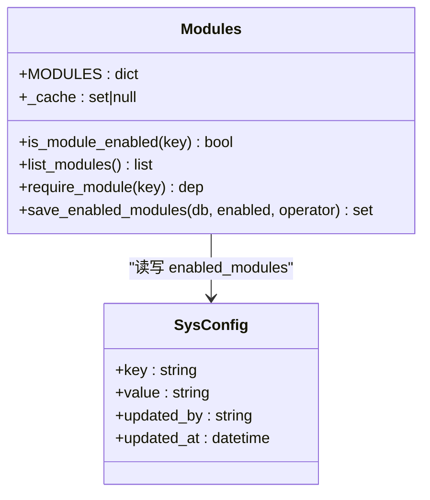
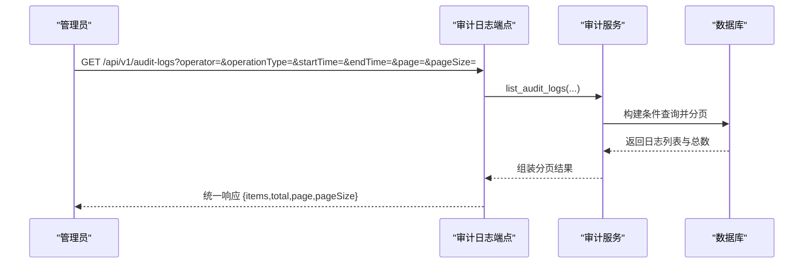
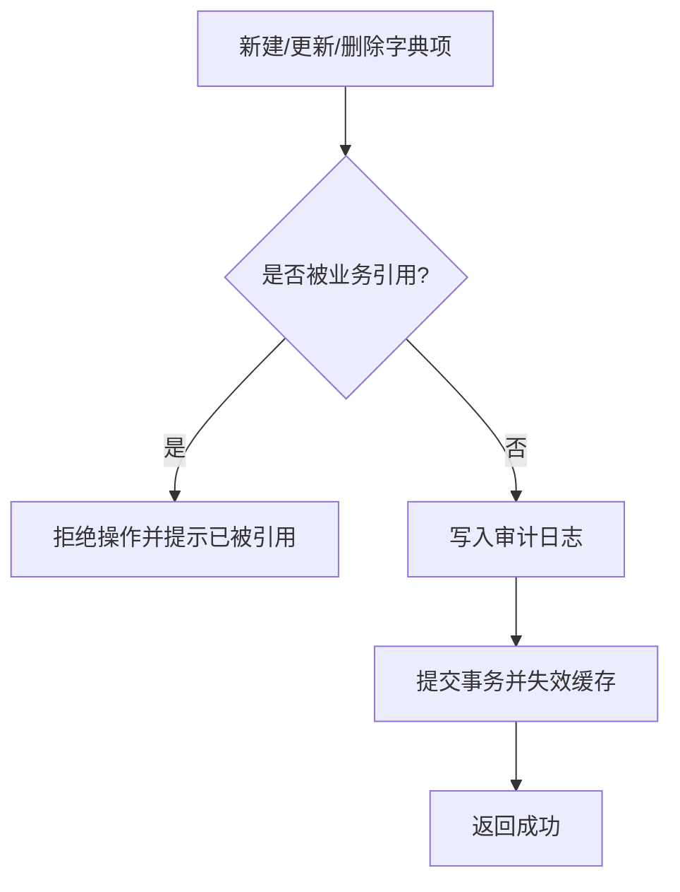
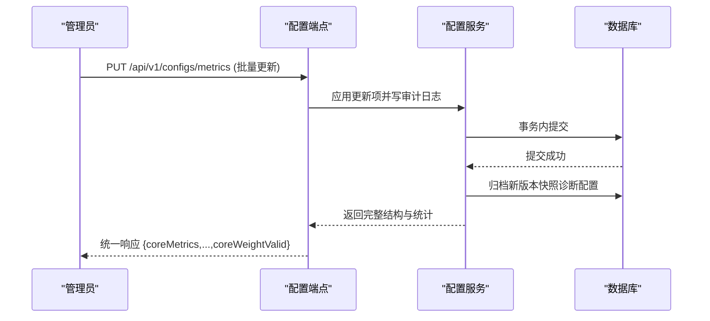
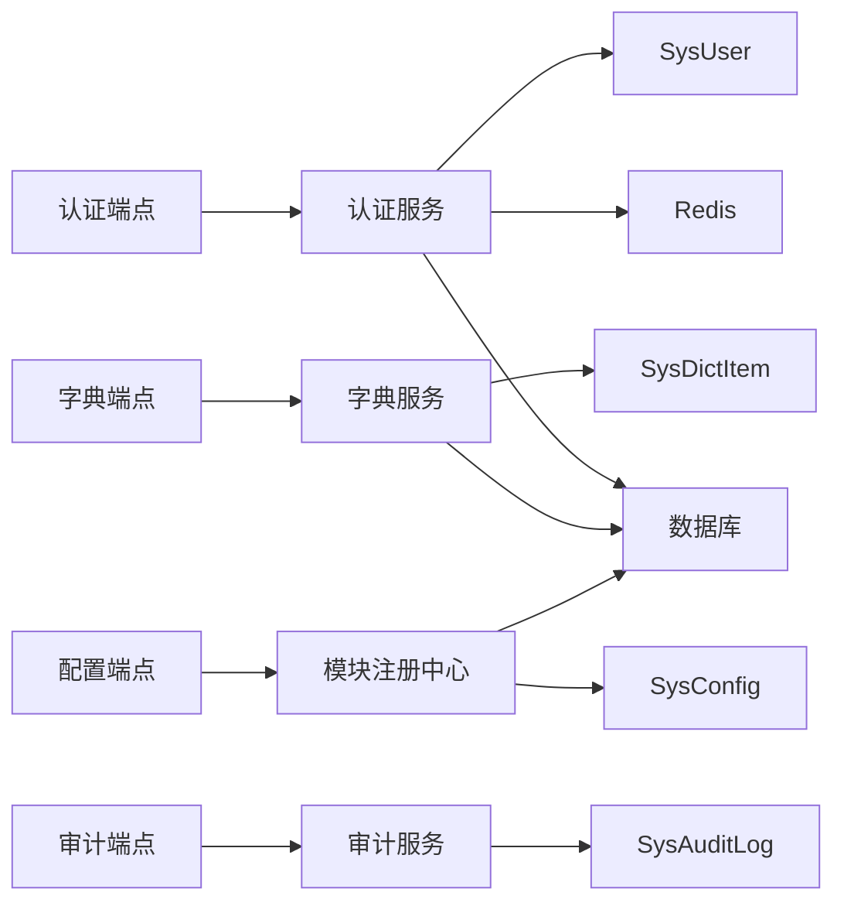

# 系统管理接口

<cite>
**本文引用的文件**
- [auth.py](file://backend/app/api/v1/endpoints/auth.py)
- [audit_logs.py](file://backend/app/api/v1/endpoints/audit_logs.py)
- [configs.py](file://backend/app/api/v1/endpoints/configs.py)
- [dicts.py](file://backend/app/api/v1/endpoints/dicts.py)
- [users.py](file://backend/app/api/v1/endpoints/users.py)
- [auth.py（服务）](file://backend/app/services/auth.py)
- [audit.py（服务）](file://backend/app/services/audit.py)
- [dict_item.py（服务）](file://backend/app/services/dict_item.py)
- [modules.py](file://backend/app/core/modules.py)
- [deps.py](file://backend/app/api/deps.py)
- [sys_user.py](file://backend/app/models/sys_user.py)
- [sys_config.py](file://backend/app/models/sys_config.py)
- [sys_dict_item.py](file://backend/app/models/sys_dict_item.py)
- [user.py（Schema）](file://backend/app/schemas/user.py)
- [auth.py（Schema）](file://backend/app/schemas/auth.py)
</cite>

## 目录
1. [简介](#简介)
2. [项目结构](#项目结构)
3. [核心组件](#核心组件)
4. [架构总览](#架构总览)
5. [详细组件分析](#详细组件分析)
6. [依赖关系分析](#依赖关系分析)
7. [性能考虑](#性能考虑)
8. [故障排查指南](#故障排查指南)
9. [结论](#结论)
10. [附录：API 清单与数据模型](#附录api-清单与数据模型)

## 简介
本文件为 CLPM-MVP 系统管理模块的完整 API 文档，覆盖以下能力：
- 用户管理：登录、刷新令牌、登出、当前用户信息、密码修改；用户 CRUD 与角色权限分配。
- 模块管理：模块启用/禁用、配置管理、热更新机制（进程内缓存 + DB 持久化）。
- 审计日志：操作记录查询、分页筛选、合规性检查基础能力。
- 字典管理：系统字典维护、动态配置、多语言支持（通过字典项 label 实现）。
- 系统配置与安全策略：指标/诊断配置批量读写、版本快照、RBAC 与强制改密。
- 运维与排障：常见问题定位、错误码说明、性能优化建议。

## 项目结构
系统管理相关代码主要位于后端 FastAPI 应用中，采用“端点 → 服务 → 模型/Schema”的分层组织：
- 端点层：定义 HTTP 路由、参数校验、权限守卫、统一响应封装。
- 服务层：业务逻辑、事务处理、缓存失效、审计写入。
- 模型层：ORM 实体（用户、配置、字典等）。
- Schema 层：请求/响应数据结构与校验规则。

**图表来源**
- [auth.py（端点）:1-148](file://backend/app/api/v1/endpoints/auth.py#L1-L148)
- [audit_logs.py:1-49](file://backend/app/api/v1/endpoints/audit_logs.py#L1-L49)
- [configs.py:1-800](file://backend/app/api/v1/endpoints/configs.py#L1-L800)
- [dicts.py:1-120](file://backend/app/api/v1/endpoints/dicts.py#L1-L120)
- [auth.py（服务）:1-585](file://backend/app/services/auth.py#L1-L585)
- [audit.py（服务）:1-101](file://backend/app/services/audit.py#L1-L101)
- [dict_item.py（服务）:1-464](file://backend/app/services/dict_item.py#L1-L464)
- [modules.py:1-239](file://backend/app/core/modules.py#L1-L239)
- [sys_user.py:1-49](file://backend/app/models/sys_user.py#L1-L49)
- [sys_config.py:1-27](file://backend/app/models/sys_config.py#L1-L27)
- [sys_dict_item.py:1-47](file://backend/app/models/sys_dict_item.py#L1-L47)

**章节来源**
- [auth.py（端点）:1-148](file://backend/app/api/v1/endpoints/auth.py#L1-L148)
- [audit_logs.py:1-49](file://backend/app/api/v1/endpoints/audit_logs.py#L1-L49)
- [configs.py:1-800](file://backend/app/api/v1/endpoints/configs.py#L1-L800)
- [dicts.py:1-120](file://backend/app/api/v1/endpoints/dicts.py#L1-L120)
- [modules.py:1-239](file://backend/app/core/modules.py#L1-L239)

## 核心组件
- 认证与授权：JWT 访问/刷新令牌、黑名单、设备绑定、首次登录强制改密、基于角色的权限控制（RBAC）。
- 模块注册中心：模块启用/禁用状态持久化到 sys_config，进程内缓存，依赖自动补全，未启用返回 404。
- 字典管理：可配置枚举，进程级 TTL 缓存，引用校验，多语言标签（label）。
- 审计日志：只读查询，按操作人/类型/时间范围过滤，分页。
- 配置管理：指标与诊断配置的批量读取/更新，事务性提交，版本快照归档。

**章节来源**
- [auth.py（服务）:1-585](file://backend/app/services/auth.py#L1-L585)
- [modules.py:1-239](file://backend/app/core/modules.py#L1-L239)
- [dict_item.py（服务）:1-464](file://backend/app/services/dict_item.py#L1-L464)
- [audit.py（服务）:1-101](file://backend/app/services/audit.py#L1-L101)
- [configs.py:1-800](file://backend/app/api/v1/endpoints/configs.py#L1-L800)

## 架构总览
系统管理模块遵循“端点 → 服务 → 数据”的分层架构，结合 RBAC 与模块开关进行安全与功能裁剪。

**图表来源**
- [auth.py（端点）:69-88](file://backend/app/api/v1/endpoints/auth.py#L69-L88)
- [auth.py（服务）:254-353](file://backend/app/services/auth.py#L254-L353)

**章节来源**
- [auth.py（端点）:1-148](file://backend/app/api/v1/endpoints/auth.py#L1-L148)
- [auth.py（服务）:1-585](file://backend/app/services/auth.py#L1-L585)

## 详细组件分析

### 用户管理与认证
- 登录：POST /api/v1/auth/login，返回访问令牌、刷新令牌与用户信息。
- 刷新令牌：POST /api/v1/auth/refresh，使用有效 refresh token 获取新令牌对。
- 登出：POST /api/v1/auth/logout，将当前 access token 及其配对的 refresh token 加入黑名单。
- 当前用户：GET /api/v1/auth/me，返回用户基本信息、权限与默认首页。
- 密码修改：PUT /api/v1/auth/password，修改成功后吊销该用户所有令牌，并清除首次登录强制改密标志。
- 用户 CRUD：通过 /api/v1/users/* 端点进行创建、更新、删除、分页查询（需管理员或相应权限）。
- 角色与权限：基于角色映射（ADMIN/IC_ENGINEER/PE_ENGINEER/SPONSOR/EXPERT），支持通配权限匹配。

**图表来源**
- [auth.py（服务）:254-353](file://backend/app/services/auth.py#L254-L353)

**章节来源**
- [auth.py（端点）:1-148](file://backend/app/api/v1/endpoints/auth.py#L1-L148)
- [auth.py（服务）:1-585](file://backend/app/services/auth.py#L1-L585)
- [deps.py:1-209](file://backend/app/api/deps.py#L1-L209)
- [user.py（Schema）:1-96](file://backend/app/schemas/user.py#L1-L96)
- [auth.py（Schema）:1-194](file://backend/app/schemas/auth.py#L1-L194)
- [sys_user.py:1-49](file://backend/app/models/sys_user.py#L1-L49)

### 模块管理（启用/禁用与热更新）
- 模块注册表：内置 8 个一级模块，基础模块不可禁用，依赖自动补全。
- 状态存储：启用集合以 JSON 数组形式保存在 sys_config.enabled_modules。
- 进程缓存：is_module_enabled() 使用进程内缓存，启动时从 DB 加载；保存后刷新缓存。
- 路由守卫：require_module("diagnosis") 等用于可选模块专属端点的访问控制，未启用返回 404。
- 热更新限制：启用/禁用需重启后端生效（Celery beat 调度变更需要重启）。

**图表来源**
- [modules.py:1-239](file://backend/app/core/modules.py#L1-L239)
- [sys_config.py:1-27](file://backend/app/models/sys_config.py#L1-L27)

**章节来源**
- [modules.py:1-239](file://backend/app/core/modules.py#L1-L239)
- [configs.py:1-800](file://backend/app/api/v1/endpoints/configs.py#L1-L800)

### 审计日志接口
- 查询：GET /api/v1/audit-logs，支持按操作人、操作类型、时间范围分页查询。
- 不可变性：仅暴露查询接口，无创建/更新/删除。
- 合规性：审计日志用于操作追溯与合规检查，可作为审计导出基础。

**图表来源**
- [audit_logs.py:1-49](file://backend/app/api/v1/endpoints/audit_logs.py#L1-L49)
- [audit.py（服务）:1-101](file://backend/app/services/audit.py#L1-L101)

**章节来源**
- [audit_logs.py:1-49](file://backend/app/api/v1/endpoints/audit_logs.py#L1-L49)
- [audit.py（服务）:1-101](file://backend/app/services/audit.py#L1-L101)

### 字典管理接口
- 类型列表：GET /api/v1/dicts/types，返回已注册字典类型及标题。
- 字典项管理：GET/POST/PUT/DELETE /api/v1/dicts/items，仅管理员可操作，含引用标记与引用校验。
- 前端下拉：GET /api/v1/dicts/{dict_type}/items，返回 [(code,label)] 列表，支持仅启用项。
- 多语言支持：通过 item_label 提供中文显示名，便于多语言展示。
- 缓存与回退：进程级 TTL 缓存（30s），查询异常或空时回退内置枚举。

**图表来源**
- [dicts.py:1-120](file://backend/app/api/v1/endpoints/dicts.py#L1-L120)
- [dict_item.py（服务）:1-464](file://backend/app/services/dict_item.py#L1-L464)

**章节来源**
- [dicts.py:1-120](file://backend/app/api/v1/endpoints/dicts.py#L1-L120)
- [dict_item.py（服务）:1-464](file://backend/app/services/dict_item.py#L1-L464)
- [sys_dict_item.py:1-47](file://backend/app/models/sys_dict_item.py#L1-L47)

### 系统配置与指标/诊断配置
- 指标配置：GET/PUT /api/v1/configs/metrics，批量获取/更新指标配置（3+1+8 结构），核心指标权重总和必须为 100%，事务性提交。
- 诊断配置：GET/PUT/POST/DELETE /api/v1/configs/diagnosis，批量获取/更新/新增/删除诊断配置，支持版本快照归档。
- 版本快照：每次 CRUD 在事务内归档全量快照至 sys_config（version/history），保证可回溯。
- 缓存失效：更新后主动失效相关缓存，确保一致性。

**图表来源**
- [configs.py:1-800](file://backend/app/api/v1/endpoints/configs.py#L1-L800)

**章节来源**
- [configs.py:1-800](file://backend/app/api/v1/endpoints/configs.py#L1-L800)

### 安全策略与权限控制
- JWT 令牌：access token 短期有效，refresh token 长期有效（记住登录 30 天），支持设备绑定。
- 黑名单：登出时将 access token 与其配对的 refresh token 加入黑名单。
- 强制改密：首次登录 must_change_password=True 时，禁止写操作（改密/登出豁免，读端点放行）。
- RBAC：基于角色映射与权限码匹配（模块:操作），支持通配符。

**章节来源**
- [auth.py（服务）:1-585](file://backend/app/services/auth.py#L1-L585)
- [deps.py:1-209](file://backend/app/api/deps.py#L1-L209)
- [auth.py（Schema）:1-194](file://backend/app/schemas/auth.py#L1-L194)

## 依赖关系分析
- 端点依赖：
  - 认证端点依赖 deps.get_current_user、require_roles、services.auth。
  - 审计日志端点依赖 services.audit。
  - 字典端点依赖 services.dict_item。
  - 配置端点依赖 core.modules.require_module 与事务性更新逻辑。
- 服务依赖：
  - 认证服务依赖 Redis（登录失败计数、令牌黑名单、用户令牌追踪）、数据库（用户查询与更新）。
  - 字典服务依赖数据库（字典项 CRUD、引用校验）与进程级缓存。
  - 模块注册中心依赖数据库（sys_config.enabled_modules）与进程缓存。
- 模型依赖：
  - SysUser：用户认证与权限。
  - SysConfig：系统配置与模块启用状态。
  - SysDictItem：字典项与多语言标签。
  - SysAuditLog：审计日志记录。

**图表来源**
- [auth.py（端点）:1-148](file://backend/app/api/v1/endpoints/auth.py#L1-L148)
- [audit_logs.py:1-49](file://backend/app/api/v1/endpoints/audit_logs.py#L1-L49)
- [dicts.py:1-120](file://backend/app/api/v1/endpoints/dicts.py#L1-L120)
- [configs.py:1-800](file://backend/app/api/v1/endpoints/configs.py#L1-L800)
- [auth.py（服务）:1-585](file://backend/app/services/auth.py#L1-L585)
- [audit.py（服务）:1-101](file://backend/app/services/audit.py#L1-L101)
- [dict_item.py（服务）:1-464](file://backend/app/services/dict_item.py#L1-L464)
- [modules.py:1-239](file://backend/app/core/modules.py#L1-L239)
- [sys_user.py:1-49](file://backend/app/models/sys_user.py#L1-L49)
- [sys_config.py:1-27](file://backend/app/models/sys_config.py#L1-L27)
- [sys_dict_item.py:1-47](file://backend/app/models/sys_dict_item.py#L1-L47)

**章节来源**
- [deps.py:1-209](file://backend/app/api/deps.py#L1-L209)
- [modules.py:1-239](file://backend/app/core/modules.py#L1-L239)

## 性能考虑
- 字典缓存：字典查询使用进程级 TTL 缓存（30s），减少数据库压力；写操作后主动失效缓存。
- 配置更新：批量更新采用事务性提交，避免部分成功导致的数据不一致；更新后失效相关缓存。
- 令牌管理：Redis 黑名单与用户令牌追踪，支持批量吊销与幂等刷新。
- 审计日志：分页查询与条件过滤，避免全表扫描；审计写入在事务中完成。

[本节为通用性能指导，不直接分析具体文件]

## 故障排查指南
- 登录失败过多：检查 Redis 登录失败计数与窗口期；确认用户名/密码正确。
- Token 无效/过期：检查 access/refresh token 是否有效；确认未进入黑名单；必要时重新登录。
- 账户禁用：检查用户 is_active 状态；联系管理员启用。
- 强制改密拦截：首次登录 must_change_password=True 时，仅允许改密/登出与读端点；请先修改密码。
- 模块未启用：检查 sys_config.enabled_modules；启用后需重启后端生效。
- 字典项被引用：删除/禁用前会校验业务引用；如需删除，先解除业务关联。
- 配置更新失败：检查核心指标权重总和是否为 100%；查看事务提交日志与错误码。

**章节来源**
- [auth.py（服务）:1-585](file://backend/app/services/auth.py#L1-L585)
- [modules.py:1-239](file://backend/app/core/modules.py#L1-L239)
- [dict_item.py（服务）:1-464](file://backend/app/services/dict_item.py#L1-L464)
- [configs.py:1-800](file://backend/app/api/v1/endpoints/configs.py#L1-L800)

## 结论
系统管理模块提供了完整的用户认证与授权、模块开关、字典管理、审计日志与配置管理能力。通过 RBAC、强制改密、令牌黑名单与模块依赖校验，保障了安全性与可维护性；通过事务性配置更新与版本快照，确保了数据的可追溯性与一致性。建议在部署与运维中关注模块启用状态、字典引用关系与审计日志，以提升系统的稳定性与合规性。

[本节为总结性内容，不直接分析具体文件]

## 附录：API 清单与数据模型

### API 清单
- 认证
  - POST /api/v1/auth/login
  - POST /api/v1/auth/refresh
  - POST /api/v1/auth/logout
  - GET /api/v1/auth/me
  - PUT /api/v1/auth/password
- 审计日志
  - GET /api/v1/audit-logs
- 字典
  - GET /api/v1/dicts/types
  - GET /api/v1/dicts/{dict_type}/items
  - GET /api/v1/dicts/items
  - POST /api/v1/dicts/items
  - PUT /api/v1/dicts/items/{item_id}
  - DELETE /api/v1/dicts/items/{item_id}
- 配置
  - GET /api/v1/configs/metrics
  - PUT /api/v1/configs/metrics
  - GET /api/v1/configs/diagnosis
  - PUT /api/v1/configs/diagnosis
  - POST /api/v1/configs/diagnosis
  - DELETE /api/v1/configs/diagnosis/{diag_id}
- 用户
  - /api/v1/users/*（创建、更新、删除、分页查询）

**章节来源**
- [auth.py（端点）:1-148](file://backend/app/api/v1/endpoints/auth.py#L1-L148)
- [audit_logs.py:1-49](file://backend/app/api/v1/endpoints/audit_logs.py#L1-L49)
- [dicts.py:1-120](file://backend/app/api/v1/endpoints/dicts.py#L1-L120)
- [configs.py:1-800](file://backend/app/api/v1/endpoints/configs.py#L1-L800)
- [users.py](file://backend/app/api/v1/endpoints/users.py)

### 数据模型
- SysUser：用户认证与权限（用户名、角色、邮箱、是否激活、首次改密标志、最后登录时间等）。
- SysConfig：系统键值配置（key/value/description/updated_by/updated_at）。
- SysDictItem：字典项（dict_type/item_code/item_label/sort_order/is_enabled/updated_by/updated_at）。
- SysAuditLog：审计日志（operator/operation_type/target_type/target_id/before_value/after_value/operated_at）。

**章节来源**
- [sys_user.py:1-49](file://backend/app/models/sys_user.py#L1-L49)
- [sys_config.py:1-27](file://backend/app/models/sys_config.py#L1-L27)
- [sys_dict_item.py:1-47](file://backend/app/models/sys_dict_item.py#L1-L47)
- [audit.py（服务）:1-101](file://backend/app/services/audit.py#L1-L101)