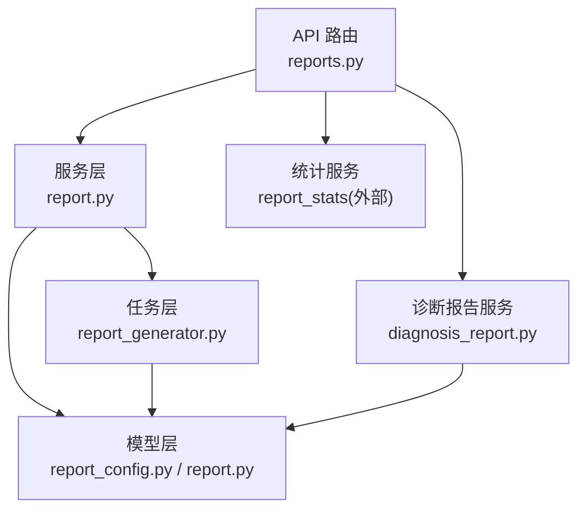
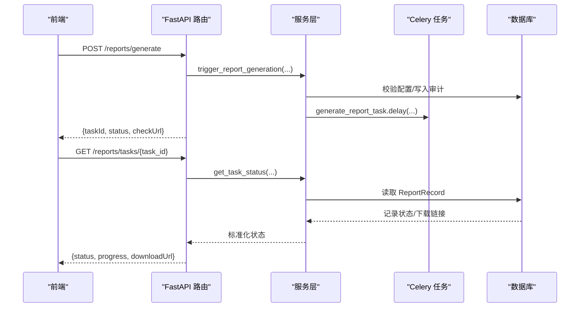
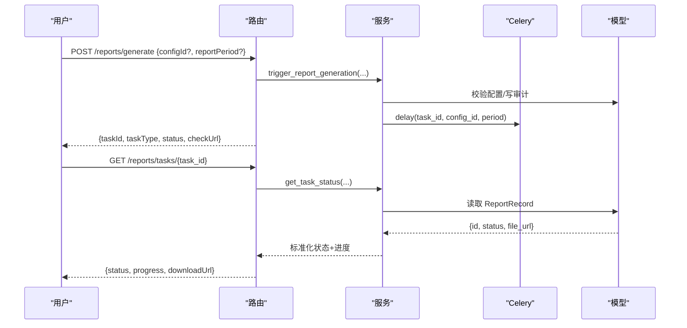
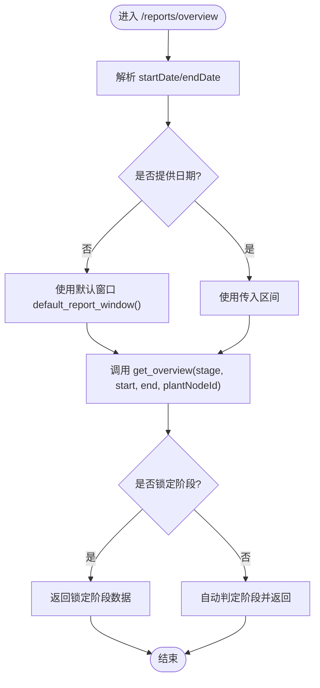
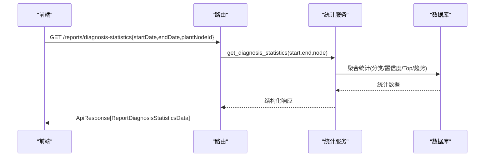
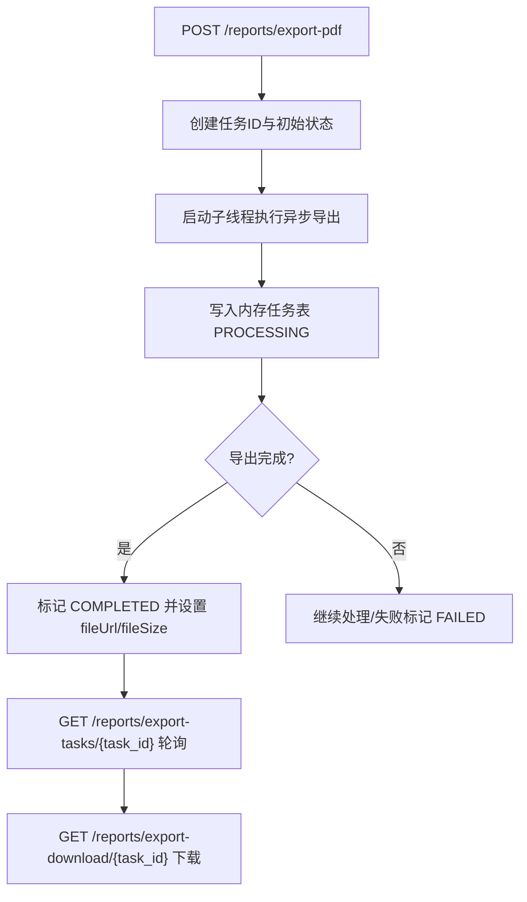
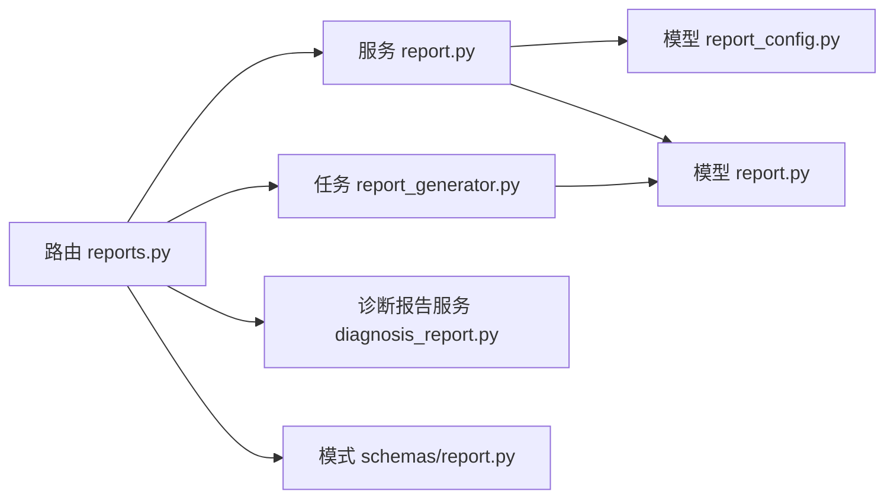

# 统计报告接口

<cite>
**本文引用的文件**
- [backend/app/api/v1/endpoints/reports.py](file://backend/app/api/v1/endpoints/reports.py)
- [backend/app/services/report.py](file://backend/app/services/report.py)
- [backend/app/schemas/report.py](file://backend/app/schemas/report.py)
- [backend/app/models/report.py](file://backend/app/models/report.py)
- [backend/app/models/report_config.py](file://backend/app/models/report_config.py)
- [backend/app/tasks/report_generator.py](file://backend/app/tasks/report_generator.py)
- [backend/app/services/diagnosis_report.py](file://backend/app/services/diagnosis_report.py)
</cite>

## 目录
1. [简介](#简介)
2. [项目结构](#项目结构)
3. [核心组件](#核心组件)
4. [架构总览](#架构总览)
5. [详细组件分析](#详细组件分析)
6. [依赖关系分析](#依赖关系分析)
7. [性能考虑](#性能考虑)
8. [故障排查指南](#故障排查指南)
9. [结论](#结论)
10. [附录：API 定义与使用示例](#附录api-定义与使用示例)

## 简介
本模块提供 CLPM-MVP 的统计报告能力，覆盖以下能力域：
- 报告生成接口：支持按配置或周期触发、异步执行、任务状态查询与下载链接。
- 管理总览接口：系统健康度、关键指标汇总、趋势分析（S1/S2/S3 自适应）。
- 绩效报告接口：性能评分、排名统计、对比分析。
- 收益分析报告：整定/处置前后 KPI 对比、自控率提升曲线、装置标杆（当前为技术指标口径）。
- 报告模板与订阅：报表配置（周期、接收人、内容模板）、定时生成（Celery Beat）、导出 PDF 异步任务。
- 定制与扩展：通过内容模板、阶段锁定、PDF 导出流程进行扩展。

## 项目结构
围绕“报告”的核心代码分布在以下位置：
- API 路由层：后端 REST 端点定义与入参校验。
- 服务层：报表配置 CRUD、任务调度、统计聚合计算。
- 模型层：报表配置与归档记录的数据表映射。
- 任务层：Celery 异步任务（报表生成、诊断统计导出、诊断建议书 PDF）。
- 模式层：Pydantic 请求/响应数据结构定义。

**图表来源**
- [backend/app/api/v1/endpoints/reports.py:1-480](file://backend/app/api/v1/endpoints/reports.py#L1-L480)
- [backend/app/services/report.py:1-302](file://backend/app/services/report.py#L1-L302)
- [backend/app/tasks/report_generator.py:1-918](file://backend/app/tasks/report_generator.py#L1-L918)
- [backend/app/services/diagnosis_report.py:1-512](file://backend/app/services/diagnosis_report.py#L1-L512)

**章节来源**
- [backend/app/api/v1/endpoints/reports.py:1-480](file://backend/app/api/v1/endpoints/reports.py#L1-L480)
- [backend/app/services/report.py:1-302](file://backend/app/services/report.py#L1-L302)
- [backend/app/tasks/report_generator.py:1-918](file://backend/app/tasks/report_generator.py#L1-L918)
- [backend/app/services/diagnosis_report.py:1-512](file://backend/app/services/diagnosis_report.py#L1-L512)

## 核心组件
- 报表配置管理：创建/更新/查询报表配置（周期、接收人、内容模板、启用状态），并记录审计日志。
- 报表生成：手动触发或定时触发，异步执行，返回 taskId，支持状态查询与下载。
- 管理总览：按阶段（S1/S2/S3）自适应返回健康度、KPI、趋势、问题回路等。
- 诊断统计：基于 DiagnosisRun 表的统计聚合（分类分布、置信度分布、Top 异常回路、趋势）。
- 收益报告：整定/处置前后 KPI 对比、自控率曲线、装置标杆（当前为技术指标口径）。
- PDF 导出：管理总览 PDF 异步导出，内存任务表 + 本地文件缓存，支持轮询与下载。

**章节来源**
- [backend/app/api/v1/endpoints/reports.py:116-251](file://backend/app/api/v1/endpoints/reports.py#L116-L251)
- [backend/app/services/report.py:57-213](file://backend/app/services/report.py#L57-L213)
- [backend/app/schemas/report.py:12-261](file://backend/app/schemas/report.py#L12-L261)

## 架构总览
整体采用 FastAPI 路由 + 服务层 + Celery 异步任务的解耦设计。报表配置持久化到数据库；实际生成的报告归档在 report_record；统计类接口直接聚合数据返回；PDF 导出通过独立线程调用异步协程完成。

**图表来源**
- [backend/app/api/v1/endpoints/reports.py:166-190](file://backend/app/api/v1/endpoints/reports.py#L166-L190)
- [backend/app/services/report.py:162-213](file://backend/app/services/report.py#L162-L213)
- [backend/app/tasks/report_generator.py:47-84](file://backend/app/tasks/report_generator.py#L47-L84)
- [backend/app/models/report.py:20-44](file://backend/app/models/report.py#L20-L44)

## 详细组件分析

### 报告生成接口
- 功能要点
  - 支持按配置 ID 或周期触发；默认周期 DAILY。
  - 异步执行，返回 taskId、checkUrl、estimatedSeconds。
  - 任务状态查询返回标准化状态（PROCESSING/RUNNING/SUCCESS/FAILED）与进度。
- 关键路径
  - 路由：POST /reports/generate、GET /reports/tasks/{task_id}
  - 服务：trigger_report_generation、get_task_status
  - 任务：generate_report_task（含重试策略、业务错误不重试）
  - 模型：ReportConfig、ReportRecord
- 时序图

**图表来源**
- [backend/app/api/v1/endpoints/reports.py:166-190](file://backend/app/api/v1/endpoints/reports.py#L166-L190)
- [backend/app/services/report.py:162-213](file://backend/app/services/report.py#L162-L213)
- [backend/app/tasks/report_generator.py:47-84](file://backend/app/tasks/report_generator.py#L47-L84)
- [backend/app/models/report.py:20-44](file://backend/app/models/report.py#L20-L44)

**章节来源**
- [backend/app/api/v1/endpoints/reports.py:116-190](file://backend/app/api/v1/endpoints/reports.py#L116-L190)
- [backend/app/services/report.py:57-213](file://backend/app/services/report.py#L57-L213)
- [backend/app/tasks/report_generator.py:47-197](file://backend/app/tasks/report_generator.py#L47-L197)
- [backend/app/models/report.py:20-44](file://backend/app/models/report.py#L20-L44)

### 管理总览接口
- 功能要点
  - 返回 stage（S1/S2/S3）、stageOrigin（AUTO/LOCK）、是否锁定、可用性、成熟度计数、KPI、健康趋势、Top 问题回路等。
  - 支持日期范围过滤与装置节点筛选；未填充字段以 null 占位保证骨架稳定。
- 关键路径
  - 路由：GET /reports/overview
  - 服务：get_overview（外部服务，按阶段聚合）
  - 阶段锁定：GET/PUT /reports/stage-lock（读全角色可访问，写仅 ADMIN）
- 流程图（阶段判定与锁定）

**图表来源**
- [backend/app/api/v1/endpoints/reports.py:198-218](file://backend/app/api/v1/endpoints/reports.py#L198-L218)
- [backend/app/api/v1/endpoints/reports.py:259-297](file://backend/app/api/v1/endpoints/reports.py#L259-L297)

**章节来源**
- [backend/app/api/v1/endpoints/reports.py:198-297](file://backend/app/api/v1/endpoints/reports.py#L198-L297)
- [backend/app/schemas/report.py:98-159](file://backend/app/schemas/report.py#L98-L159)

### 绩效报告接口（诊断统计）
- 功能要点
  - 基于 DiagnosisRun 表统计：总数、成功数、待审数、分类分布、置信度分布、Top 异常回路、趋势。
  - 支持日期范围与装置节点筛选。
- 关键路径
  - 路由：GET /reports/diagnosis-statistics
  - 服务：get_diagnosis_statistics（外部服务）
- 序列图

**图表来源**
- [backend/app/api/v1/endpoints/reports.py:221-237](file://backend/app/api/v1/endpoints/reports.py#L221-L237)
- [backend/app/schemas/report.py:161-203](file://backend/app/schemas/report.py#L161-L203)

**章节来源**
- [backend/app/api/v1/endpoints/reports.py:221-237](file://backend/app/api/v1/endpoints/reports.py#L221-L237)
- [backend/app/schemas/report.py:161-203](file://backend/app/schemas/report.py#L161-L203)

### 收益分析报告
- 功能要点
  - 整定/处置前后 KPI 对比（均值口径）、自控率提升曲线、装置标杆（loopCount、avgScore、avgAutoRate、avgDelta）。
  - 当前为技术指标口径，不包含经济收益金额。
- 关键路径
  - 路由：GET /reports/benefit
  - 服务：get_benefit（外部服务）
- 数据模型要点
  - ReportBenefitData、ReportBenefitKpiComparison、ReportBenefitCurvePoint、ReportBenefitBenchmarkItem

**章节来源**
- [backend/app/api/v1/endpoints/reports.py:240-251](file://backend/app/api/v1/endpoints/reports.py#L240-L251)
- [backend/app/schemas/report.py:205-239](file://backend/app/schemas/report.py#L205-L239)

### 报告模板管理与订阅推送
- 报表配置
  - 字段：名称、周期（SHIFT/DAILY/WEEKLY/MONTHLY）、接收人列表、内容模板、启用状态。
  - 支持创建、更新、查询，并记录审计日志。
- 定时生成
  - 通过 Celery Beat 注册 SHIFT/DAILY/WEEKLY/MONTHLY 周期任务，周期性触发报表生成。
- 订阅推送
  - 接收人列表用于后续邮件/消息推送（由上层通知服务消费配置后发送）。
- 关键路径
  - 路由：GET/POST/PUT /reports/configs
  - 服务：list_configs、create_config、update_config
  - 任务：Beat 条目注册与 generate_report_task

**章节来源**
- [backend/app/api/v1/endpoints/reports.py:116-163](file://backend/app/api/v1/endpoints/reports.py#L116-L163)
- [backend/app/services/report.py:57-159](file://backend/app/services/report.py#L57-L159)
- [backend/app/tasks/report_generator.py:91-117](file://backend/app/tasks/report_generator.py#L91-L117)
- [backend/app/models/report_config.py:27-55](file://backend/app/models/report_config.py#L27-L55)

### PDF 异步导出与管理总览下载
- 功能要点
  - 触发管理总览 PDF 导出，返回 taskId；支持轮询任务状态；完成后提供下载链接。
  - 使用内存任务表（带 TTL 清理）存储任务状态与临时文件引用；支持本地文件落盘。
- 关键路径
  - 路由：POST /reports/export-pdf、GET /reports/export-tasks/{task_id}、GET /reports/export-download/{task_id}
  - 内部：_async_pdf_export_wrapper 调用 overview PDF 导出任务
- 流程图

**图表来源**
- [backend/app/api/v1/endpoints/reports.py:338-476](file://backend/app/api/v1/endpoints/reports.py#L338-L476)

**章节来源**
- [backend/app/api/v1/endpoints/reports.py:338-476](file://backend/app/api/v1/endpoints/reports.py#L338-L476)

### 诊断建议书 PDF 生成（扩展）
- 功能要点
  - 基于 reportlab 生成中文 PDF，包含回路信息、诊断结果、性能指标、可能原因、解决方案推荐。
  - 支持异步任务封装与进度回写（TaskTracker）。
- 关键路径
  - 服务：generate_diagnosis_report
  - 任务：generate_diagnosis_pdf_task（含重试与失败兜底）

**章节来源**
- [backend/app/services/diagnosis_report.py:37-358](file://backend/app/services/diagnosis_report.py#L37-L358)
- [backend/app/tasks/report_generator.py:714-800](file://backend/app/tasks/report_generator.py#L714-L800)

## 依赖关系分析
- 路由依赖服务：reports.py 依赖 report.py 与 report_stats（外部）。
- 服务依赖模型：report.py 依赖 ReportConfig、ReportRecord。
- 任务依赖模型与服务：report_generator.py 依赖 ReportConfig、ReportRecord，并可调用诊断报告服务。
- 模式层统一约束：schemas/report.py 定义所有请求/响应结构，确保前后端契约一致。

**图表来源**
- [backend/app/api/v1/endpoints/reports.py:1-480](file://backend/app/api/v1/endpoints/reports.py#L1-L480)
- [backend/app/services/report.py:1-302](file://backend/app/services/report.py#L1-L302)
- [backend/app/tasks/report_generator.py:1-918](file://backend/app/tasks/report_generator.py#L1-L918)
- [backend/app/services/diagnosis_report.py:1-512](file://backend/app/services/diagnosis_report.py#L1-L512)
- [backend/app/schemas/report.py:1-261](file://backend/app/schemas/report.py#L1-L261)

**章节来源**
- [backend/app/api/v1/endpoints/reports.py:1-480](file://backend/app/api/v1/endpoints/reports.py#L1-L480)
- [backend/app/services/report.py:1-302](file://backend/app/services/report.py#L1-L302)
- [backend/app/tasks/report_generator.py:1-918](file://backend/app/tasks/report_generator.py#L1-L918)
- [backend/app/services/diagnosis_report.py:1-512](file://backend/app/services/diagnosis_report.py#L1-L512)
- [backend/app/schemas/report.py:1-261](file://backend/app/schemas/report.py#L1-L261)

## 性能考虑
- 异步优先：报表生成与 PDF 导出均通过 Celery/线程异步执行，避免阻塞请求。
- 重试策略：系统错误自动重试（指数退避+抖动），业务错误不重试，降低无效负载。
- 数据聚合：统计接口按时间窗与装置维度聚合，建议配合索引优化查询。
- 文件缓存：PDF 导出使用内存任务表与本地文件缓存，注意磁盘空间与过期清理。
- 默认窗口：未指定日期时采用默认窗口，减少大查询风险。

## 故障排查指南
- 报表任务不存在
  - 现象：查询任务状态返回 404。
  - 排查：确认 task_id 有效且未过期；检查 ReportRecord 是否存在。
- 报表配置不存在
  - 现象：触发生成时报错。
  - 排查：确认 config_id 存在且启用；查看审计日志定位操作者。
- PDF 导出失败
  - 现象：任务状态 FAILED 或下载 404。
  - 排查：检查内存任务表状态与本地文件是否存在；关注导出线程异常日志。
- 非法阶段锁定
  - 现象：PUT /reports/stage-lock 返回 400。
  - 排查：确认 stage 为 S1/S2/S3 或 None；管理员权限校验。

**章节来源**
- [backend/app/services/report.py:120-159](file://backend/app/services/report.py#L120-L159)
- [backend/app/services/report.py:269-292](file://backend/app/services/report.py#L269-L292)
- [backend/app/api/v1/endpoints/reports.py:278-297](file://backend/app/api/v1/endpoints/reports.py#L278-L297)
- [backend/app/api/v1/endpoints/reports.py:427-476](file://backend/app/api/v1/endpoints/reports.py#L427-L476)

## 结论
该统计报告模块通过清晰的层次划分与异步机制，实现了报表配置、生成、统计聚合与 PDF 导出的完整闭环。S1/S2/S3 自适应与阶段锁定增强了报告的稳定性与可控性。未来可在收益分析中引入经济指标，并结合更丰富的可视化模板进一步提升报告价值。

## 附录：API 定义与使用示例

### 报表配置管理
- 获取配置列表
  - 方法：GET
  - 路径：/api/v1/reports/configs
  - 权限：ADMIN
  - 响应：ApiResponse[list[ReportConfigItem]]
- 创建配置
  - 方法：POST
  - 路径：/api/v1/reports/configs
  - 权限：ADMIN
  - 请求体：ReportConfigCreateRequest
  - 响应：ApiResponse[ReportConfigItem]
- 更新配置
  - 方法：PUT
  - 路径：/api/v1/reports/configs/{config_id}
  - 权限：ADMIN
  - 请求体：ReportConfigUpdateRequest
  - 响应：ApiResponse[ReportConfigItem]

**章节来源**
- [backend/app/api/v1/endpoints/reports.py:116-163](file://backend/app/api/v1/endpoints/reports.py#L116-L163)
- [backend/app/schemas/report.py:12-63](file://backend/app/schemas/report.py#L12-L63)

### 报表生成与任务查询
- 触发生成
  - 方法：POST
  - 路径：/api/v1/reports/generate
  - 权限：ADMIN
  - 请求体：ReportGenerateRequest
  - 响应：ApiResponse[ReportGenerateData]
- 查询任务状态
  - 方法：GET
  - 路径：/api/v1/reports/tasks/{task_id}
  - 权限：ADMIN
  - 响应：ApiResponse[dict]（包含 status、progress、downloadUrl）

**章节来源**
- [backend/app/api/v1/endpoints/reports.py:166-190](file://backend/app/api/v1/endpoints/reports.py#L166-L190)
- [backend/app/schemas/report.py:65-90](file://backend/app/schemas/report.py#L65-L90)

### 管理总览
- 获取总览
  - 方法：GET
  - 路径：/api/v1/reports/overview
  - 参数：stage(S1|S2|S3)、startDate、endDate、plantNodeId
  - 响应：ApiResponse[ReportOverviewData]

**章节来源**
- [backend/app/api/v1/endpoints/reports.py:198-218](file://backend/app/api/v1/endpoints/reports.py#L198-L218)
- [backend/app/schemas/report.py:98-159](file://backend/app/schemas/report.py#L98-L159)

### 诊断统计
- 获取诊断统计
  - 方法：GET
  - 路径：/api/v1/reports/diagnosis-statistics
  - 参数：startDate、endDate、plantNodeId
  - 响应：ApiResponse[ReportDiagnosisStatisticsData]

**章节来源**
- [backend/app/api/v1/endpoints/reports.py:221-237](file://backend/app/api/v1/endpoints/reports.py#L221-L237)
- [backend/app/schemas/report.py:161-203](file://backend/app/schemas/report.py#L161-L203)

### 收益报告
- 获取收益报告
  - 方法：GET
  - 路径：/api/v1/reports/benefit
  - 参数：startDate、endDate、plantNodeId
  - 响应：ApiResponse[ReportBenefitData]

**章节来源**
- [backend/app/api/v1/endpoints/reports.py:240-251](file://backend/app/api/v1/endpoints/reports.py#L240-L251)
- [backend/app/schemas/report.py:205-239](file://backend/app/schemas/report.py#L205-L239)

### 阶段锁定
- 读取阶段锁定
  - 方法：GET
  - 路径：/api/v1/reports/stage-lock
  - 参数：plantNodeId
  - 响应：ApiResponse[ReportStageLockState]
- 设置阶段锁定
  - 方法：PUT
  - 路径：/api/v1/reports/stage-lock
  - 权限：ADMIN
  - 请求体：ReportStageLockUpdate
  - 响应：ApiResponse[ReportStageLockState]

**章节来源**
- [backend/app/api/v1/endpoints/reports.py:259-297](file://backend/app/api/v1/endpoints/reports.py#L259-L297)

### PDF 导出
- 触发导出
  - 方法：POST
  - 路径：/api/v1/reports/export-pdf
  - 权限：登录用户
  - 请求体：ReportPdfExportRequest
  - 响应：ApiResponse[ReportPdfExportTask]
- 查询导出任务状态
  - 方法：GET
  - 路径：/api/v1/reports/export-tasks/{task_id}
  - 权限：登录用户
  - 响应：ApiResponse[ReportPdfExportTask]
- 下载 PDF
  - 方法：GET
  - 路径：/api/v1/reports/export-download/{task_id}
  - 权限：登录用户
  - 响应：application/pdf

**章节来源**
- [backend/app/api/v1/endpoints/reports.py:338-476](file://backend/app/api/v1/endpoints/reports.py#L338-L476)