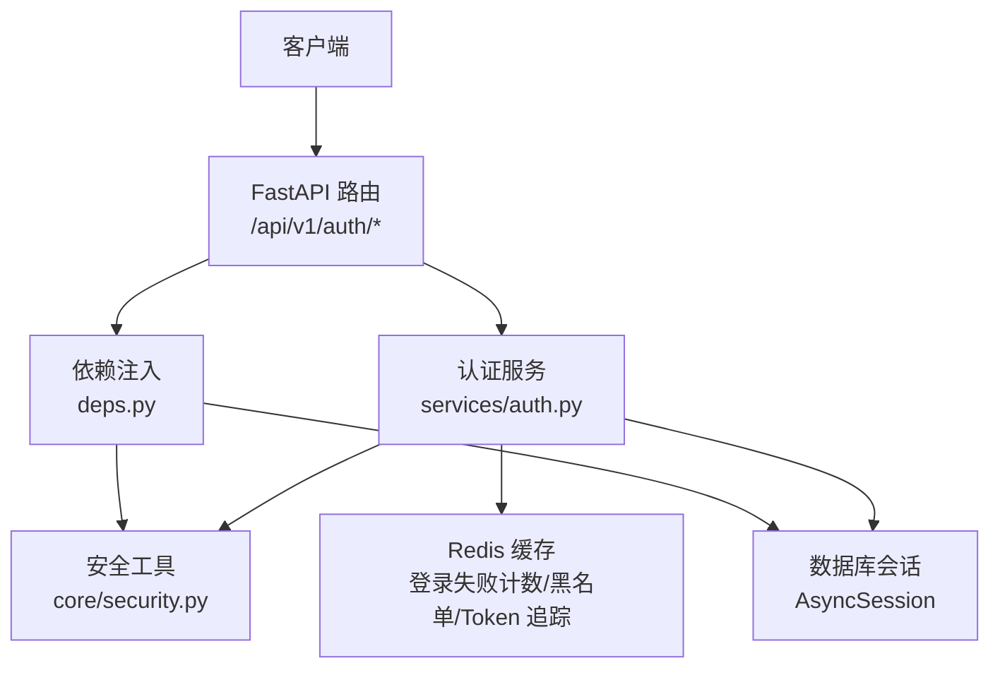
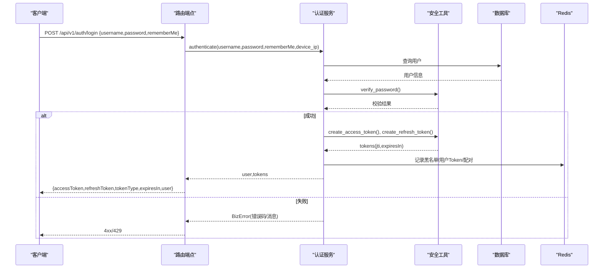
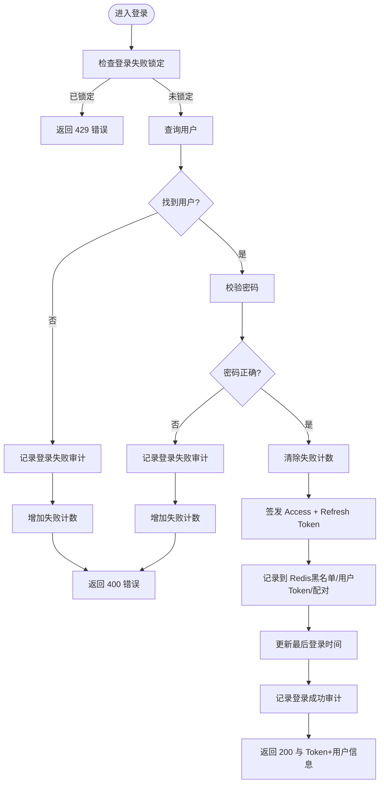
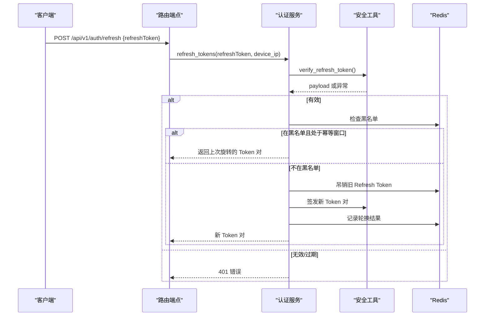
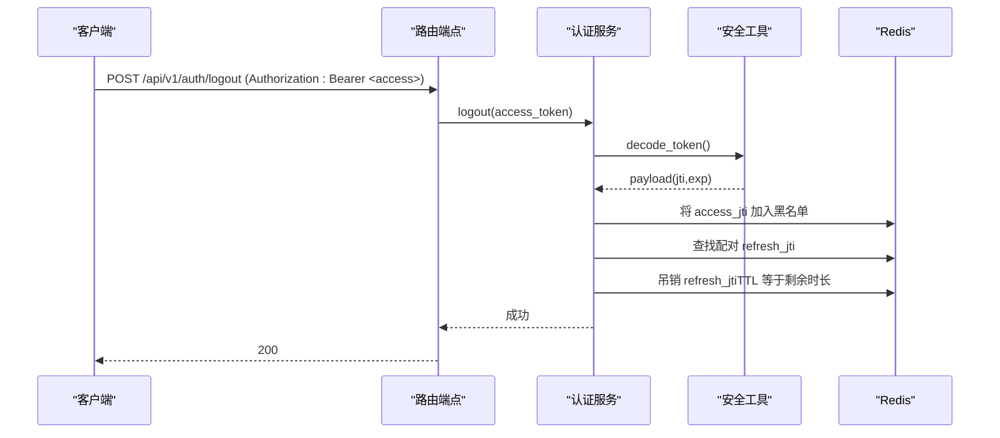
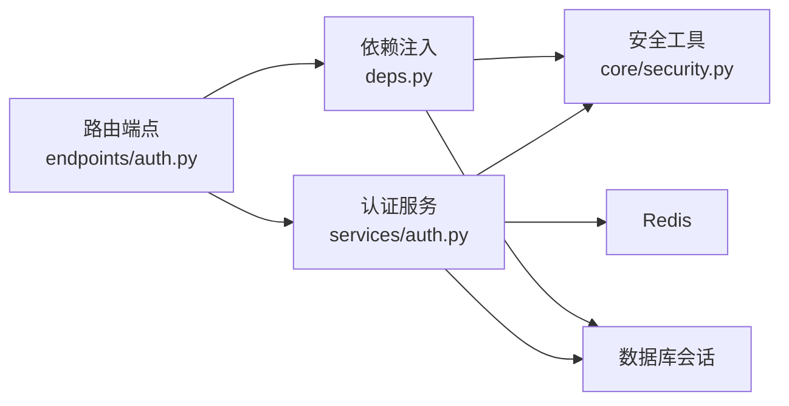

# 认证授权接口

<cite>
**本文引用的文件**
- [backend/app/api/v1/endpoints/auth.py](file://backend/app/api/v1/endpoints/auth.py)
- [backend/app/schemas/auth.py](file://backend/app/schemas/auth.py)
- [backend/app/services/auth.py](file://backend/app/services/auth.py)
- [backend/app/core/security.py](file://backend/app/core/security.py)
- [backend/app/api/deps.py](file://backend/app/api/deps.py)
- [backend/app/models/sys_user.py](file://backend/app/models/sys_user.py)
- [backend/app/schemas/common.py](file://backend/app/schemas/common.py)
</cite>

## 目录
1. [简介](#简介)
2. [项目结构](#项目结构)
3. [核心组件](#核心组件)
4. [架构总览](#架构总览)
5. [详细组件分析](#详细组件分析)
6. [依赖关系分析](#依赖关系分析)
7. [性能与安全考量](#性能与安全考量)
8. [故障排查指南](#故障排查指南)
9. [结论](#结论)
10. [附录：API 规范与示例](#附录api-规范与示例)

## 简介
本文件为 CLPM-MVP 认证授权模块的 API 文档，覆盖用户登录、Token 刷新、登出、获取当前用户信息、修改密码以及 RBAC 测试端点。重点说明：
- 登录接口的请求参数（用户名、密码、记住我）、响应格式（访问令牌、刷新令牌、用户信息）
- Token 刷新机制（访问令牌与刷新令牌的使用方式、设备绑定、轮换幂等）
- 权限验证实现原理（角色权限检查、资源访问控制）
- JWT 结构与有效期管理
- 安全最佳实践与常见错误处理方案
- 完整的 HTTP 请求示例（请求头、Body、状态码）

## 项目结构
认证授权相关代码主要分布在以下位置：
- 路由层：定义 /auth 系列端点
- 服务层：实现登录、刷新、登出、改密等业务逻辑
- 安全层：JWT 签发/校验、密码哈希、客户端 IP 提取
- 依赖注入：统一鉴权依赖（解析 Token、黑名单校验、角色/权限守卫）
- 数据模型：用户表结构
- 模式定义：请求/响应数据结构

图表来源
- [backend/app/api/v1/endpoints/auth.py:1-148](file://backend/app/api/v1/endpoints/auth.py#L1-L148)
- [backend/app/services/auth.py:1-585](file://backend/app/services/auth.py#L1-L585)
- [backend/app/core/security.py:1-219](file://backend/app/core/security.py#L1-L219)
- [backend/app/api/deps.py:1-209](file://backend/app/api/deps.py#L1-L209)

章节来源
- [backend/app/api/v1/endpoints/auth.py:1-148](file://backend/app/api/v1/endpoints/auth.py#L1-L148)
- [backend/app/schemas/auth.py:1-194](file://backend/app/schemas/auth.py#L1-L194)
- [backend/app/services/auth.py:1-585](file://backend/app/services/auth.py#L1-L585)
- [backend/app/core/security.py:1-219](file://backend/app/core/security.py#L1-L219)
- [backend/app/api/deps.py:1-209](file://backend/app/api/deps.py#L1-L209)
- [backend/app/models/sys_user.py:1-49](file://backend/app/models/sys_user.py#L1-L49)
- [backend/app/schemas/common.py:1-35](file://backend/app/schemas/common.py#L1-L35)

## 核心组件
- 路由端点：提供登录、刷新、登出、获取当前用户、修改密码、RBAC 测试
- 认证服务：实现登录校验、Token 签发与刷新、登出吊销、改密与批量吊销、角色权限映射
- 安全工具：JWT 签发/解码、密码哈希/校验、设备 IP 提取与校验
- 依赖注入：统一解析 Access Token、黑名单校验、角色/权限守卫、强制改密拦截
- 数据模型：用户实体（含角色、是否激活、首次改密标志、最后登录时间）
- 模式定义：登录/刷新/改密请求与响应的 Pydantic 模型

章节来源
- [backend/app/api/v1/endpoints/auth.py:1-148](file://backend/app/api/v1/endpoints/auth.py#L1-L148)
- [backend/app/services/auth.py:1-585](file://backend/app/services/auth.py#L1-L585)
- [backend/app/core/security.py:1-219](file://backend/app/core/security.py#L1-L219)
- [backend/app/api/deps.py:1-209](file://backend/app/api/deps.py#L1-L209)
- [backend/app/models/sys_user.py:1-49](file://backend/app/models/sys_user.py#L1-L49)
- [backend/app/schemas/auth.py:1-194](file://backend/app/schemas/auth.py#L1-L194)
- [backend/app/schemas/common.py:1-35](file://backend/app/schemas/common.py#L1-L35)

## 架构总览
认证授权的整体流程如下：
- 登录：校验用户名/密码，记录审计日志，签发 Access Token 与 Refresh Token，记录到 Redis 用于后续吊销与追踪
- 刷新：校验 Refresh Token（含设备绑定），吊销旧 Refresh Token，签发新 Token 对，支持并发幂等
- 登出：将 Access Token 加入黑名单，并联动吊销配对的 Refresh Token
- 鉴权：所有受保护端点通过依赖注入解析 Access Token，校验类型、黑名单、用户状态与首次改密策略
- 权限：基于角色到权限码的映射进行细粒度资源访问控制

图表来源
- [backend/app/api/v1/endpoints/auth.py:69-88](file://backend/app/api/v1/endpoints/auth.py#L69-L88)
- [backend/app/services/auth.py:254-353](file://backend/app/services/auth.py#L254-L353)
- [backend/app/core/security.py:99-143](file://backend/app/core/security.py#L99-L143)

## 详细组件分析

### 登录接口
- 路径与方法：POST /api/v1/auth/login
- 请求体字段：
  - username：字符串，必填
  - password：字符串，必填
  - rememberMe：布尔值，可选，默认 false；true 时刷新令牌有效期延长至 30 天
- 响应体：统一封装 ApiResponse，data 包含：
  - accessToken：字符串
  - refreshToken：字符串
  - tokenType：固定 Bearer
  - expiresIn：整数（秒）
  - user：用户信息对象（id、username、displayName、email、role、permissions、defaultHome、lastLoginAt、mustChangePassword）
- 行为要点：
  - 登录失败次数限制（15 分钟内最多 5 次），超限返回 429
  - 失败会写入审计日志
  - 成功后更新最后登录时间，并记录审计日志
  - 签发 Access Token（短效）与 Refresh Token（长效或 30 天），并记录到 Redis 以便后续吊销与追踪

图表来源
- [backend/app/services/auth.py:134-162](file://backend/app/services/auth.py#L134-L162)
- [backend/app/services/auth.py:254-353](file://backend/app/services/auth.py#L254-L353)
- [backend/app/api/v1/endpoints/auth.py:69-88](file://backend/app/api/v1/endpoints/auth.py#L69-L88)

章节来源
- [backend/app/api/v1/endpoints/auth.py:69-88](file://backend/app/api/v1/endpoints/auth.py#L69-L88)
- [backend/app/schemas/auth.py:98-129](file://backend/app/schemas/auth.py#L98-L129)
- [backend/app/services/auth.py:254-353](file://backend/app/services/auth.py#L254-L353)

### 刷新接口
- 路径与方法：POST /api/v1/auth/refresh
- 请求体字段：
  - refreshToken：有效的 Refresh Token
- 响应体：统一封装 ApiResponse，data 包含新的 accessToken、refreshToken、tokenType、expiresIn
- 行为要点：
  - 校验 Refresh Token 类型与签名，支持设备绑定校验（若 Token 绑定了设备 IP 且请求携带了设备 IP，则必须一致）
  - 若 Token 已被吊销但处于“轮换幂等窗口”内，直接返回之前签发的一对 Token
  - 吊销旧 Refresh Token，签发新 Token 对，并记录轮换结果以支持幂等

图表来源
- [backend/app/api/v1/endpoints/auth.py:91-103](file://backend/app/api/v1/endpoints/auth.py#L91-L103)
- [backend/app/services/auth.py:388-480](file://backend/app/services/auth.py#L388-L480)
- [backend/app/core/security.py:156-195](file://backend/app/core/security.py#L156-L195)

章节来源
- [backend/app/api/v1/endpoints/auth.py:91-103](file://backend/app/api/v1/endpoints/auth.py#L91-L103)
- [backend/app/schemas/auth.py:136-149](file://backend/app/schemas/auth.py#L136-L149)
- [backend/app/services/auth.py:388-480](file://backend/app/services/auth.py#L388-L480)
- [backend/app/core/security.py:156-195](file://backend/app/core/security.py#L156-L195)

### 登出接口
- 路径与方法：POST /api/v1/auth/logout
- 鉴权：需要携带有效的 Access Token
- 行为要点：
  - 将当前 Access Token 的 jti 加入黑名单
  - 根据签发时记录的配对关系，吊销对应的 Refresh Token
  - 防止已登出会话继续刷新出新 Access Token

图表来源
- [backend/app/api/v1/endpoints/auth.py:106-114](file://backend/app/api/v1/endpoints/auth.py#L106-L114)
- [backend/app/services/auth.py:483-520](file://backend/app/services/auth.py#L483-L520)

章节来源
- [backend/app/api/v1/endpoints/auth.py:106-114](file://backend/app/api/v1/endpoints/auth.py#L106-L114)
- [backend/app/services/auth.py:483-520](file://backend/app/services/auth.py#L483-L520)

### 获取当前用户信息
- 路径与方法：GET /api/v1/auth/me
- 鉴权：需要携带有效的 Access Token
- 响应体：统一封装 ApiResponse，data 为用户信息对象（包含权限列表与默认首页）

章节来源
- [backend/app/api/v1/endpoints/auth.py:117-120](file://backend/app/api/v1/endpoints/auth.py#L117-L120)
- [backend/app/schemas/auth.py:106-129](file://backend/app/schemas/auth.py#L106-L129)

### 修改密码
- 路径与方法：PUT /api/v1/auth/password
- 鉴权：需要携带有效的 Access Token
- 请求体字段：
  - oldPassword：旧密码
  - newPassword：新密码（需满足复杂度要求）
- 行为要点：
  - 校验旧密码
  - 新密码不能与旧密码相同
  - 更新密码并清除首次登录强制改密标志
  - 吊销该用户所有已存在的 Token（包括 Access 与 Refresh）

章节来源
- [backend/app/api/v1/endpoints/auth.py:123-136](file://backend/app/api/v1/endpoints/auth.py#L123-L136)
- [backend/app/schemas/auth.py:156-167](file://backend/app/schemas/auth.py#L156-L167)
- [backend/app/services/auth.py:523-563](file://backend/app/services/auth.py#L523-L563)

### RBAC 测试端点
- 路径与方法：GET /api/v1/auth/rbac-test
- 鉴权：仅 ADMIN 角色可访问
- 用途：用于测试角色访问控制守卫

章节来源
- [backend/app/api/v1/endpoints/auth.py:139-147](file://backend/app/api/v1/endpoints/auth.py#L139-L147)
- [backend/app/api/deps.py:135-153](file://backend/app/api/deps.py#L135-L153)

## 依赖关系分析
- 路由层依赖服务层与依赖注入：
  - 登录/刷新/登出/改密调用 services/auth 中的业务函数
  - 受保护端点通过 deps.get_current_user 解析并校验 Access Token
  - require_roles 与 require_perms 用于角色与权限码校验
- 服务层依赖安全工具与存储：
  - 使用 core/security 进行 JWT 签发/校验、密码哈希/校验、设备 IP 提取
  - 使用 Redis 记录登录失败计数、Token 黑名单、用户 Token 集合、Access-Refresh 配对、轮换幂等记录
- 数据模型与模式：
  - SysUser 提供用户实体字段（角色、是否激活、首次改密标志等）
  - schemas/auth 定义请求/响应结构

图表来源
- [backend/app/api/v1/endpoints/auth.py:1-148](file://backend/app/api/v1/endpoints/auth.py#L1-L148)
- [backend/app/services/auth.py:1-585](file://backend/app/services/auth.py#L1-L585)
- [backend/app/core/security.py:1-219](file://backend/app/core/security.py#L1-L219)
- [backend/app/api/deps.py:1-209](file://backend/app/api/deps.py#L1-L209)

章节来源
- [backend/app/api/v1/endpoints/auth.py:1-148](file://backend/app/api/v1/endpoints/auth.py#L1-L148)
- [backend/app/services/auth.py:1-585](file://backend/app/services/auth.py#L1-L585)
- [backend/app/core/security.py:1-219](file://backend/app/core/security.py#L1-L219)
- [backend/app/api/deps.py:1-209](file://backend/app/api/deps.py#L1-L209)

## 性能与安全考量
- 性能
  - 登录失败计数与黑名单使用 Redis，避免频繁数据库查询
  - 刷新轮换幂等窗口减少并发刷新导致的重复签发与误吊销
  - Token 配对记录确保登出时能精准吊销 Refresh Token，降低安全风险
- 安全
  - 密码复杂度校验（生产环境要求长度、大小写、数字、特殊字符）
  - 登录失败锁定（15 分钟最多 5 次）
  - 设备绑定校验（Refresh Token 绑定设备 IP，防止跨设备滥用）
  - 首次登录强制改密（禁止写操作直至完成改密）
  - 统一错误消息，防止用户名枚举攻击
  - 审计日志记录登录成功/失败事件

章节来源
- [backend/app/schemas/auth.py:15-90](file://backend/app/schemas/auth.py#L15-L90)
- [backend/app/services/auth.py:35-53](file://backend/app/services/auth.py#L35-L53)
- [backend/app/services/auth.py:134-162](file://backend/app/services/auth.py#L134-L162)
- [backend/app/core/security.py:51-69](file://backend/app/core/security.py#L51-L69)
- [backend/app/api/deps.py:34-48](file://backend/app/api/deps.py#L34-L48)

## 故障排查指南
- 常见问题与处理
  - 登录失败过多：等待锁定窗口结束（提示剩余分钟数）
  - Token 过期：重新登录或使用 Refresh Token 刷新
  - Token 无效：检查请求头 Authorization 是否正确设置
  - 设备不匹配：确认请求携带的设备 IP 与 Refresh Token 中绑定的设备一致
  - 账户禁用：联系管理员启用账户
  - 首次登录强制改密：先修改密码后再执行写操作
- 定位方法
  - 查看服务端错误码与消息（BizError 的 code/message）
  - 检查 Redis 中的登录失败计数、黑名单、用户 Token 集合
  - 核对 JWT 载荷字段（type、jti、exp、sub、device）

章节来源
- [backend/app/services/auth.py:134-162](file://backend/app/services/auth.py#L134-L162)
- [backend/app/services/auth.py:388-480](file://backend/app/services/auth.py#L388-L480)
- [backend/app/api/deps.py:50-132](file://backend/app/api/deps.py#L50-L132)
- [backend/app/core/security.py:151-205](file://backend/app/core/security.py#L151-L205)

## 结论
CLPM-MVP 认证授权模块采用标准 JWT 方案，结合 Redis 实现登录失败锁定、Token 黑名单、设备绑定与轮换幂等，提供了完善的登录、刷新、登出、改密与 RBAC 能力。通过统一的响应封装与清晰的错误码，便于前端集成与问题定位。建议在生产环境中严格配置密码复杂度、合理设置 Token 有效期，并结合审计日志进行安全监控。

## 附录：API 规范与示例

### 通用响应格式
- 统一封装 ApiResponse：{code, message, data}
- 成功时 code 为 "0"，message 为 "success"

章节来源
- [backend/app/schemas/common.py:10-35](file://backend/app/schemas/common.py#L10-L35)

### 登录接口
- 请求
  - 方法：POST
  - 路径：/api/v1/auth/login
  - 请求头：无特殊要求
  - Body：
    - username：字符串
    - password：字符串
    - rememberMe：布尔值（可选）
- 响应
  - 状态码：200（成功）、400（凭证错误）、429（尝试过多）
  - Data：
    - accessToken：字符串
    - refreshToken：字符串
    - tokenType：Bearer
    - expiresIn：整数（秒）
    - user：用户信息对象（包含 role、permissions、defaultHome、mustChangePassword 等）

章节来源
- [backend/app/api/v1/endpoints/auth.py:69-88](file://backend/app/api/v1/endpoints/auth.py#L69-L88)
- [backend/app/schemas/auth.py:98-129](file://backend/app/schemas/auth.py#L98-L129)

### 刷新接口
- 请求
  - 方法：POST
  - 路径：/api/v1/auth/refresh
  - 请求头：无特殊要求
  - Body：
    - refreshToken：字符串
- 响应
  - 状态码：200（成功）、401（Token 无效/过期/设备不匹配）
  - Data：
    - accessToken：字符串
    - refreshToken：字符串
    - tokenType：Bearer
    - expiresIn：整数（秒）

章节来源
- [backend/app/api/v1/endpoints/auth.py:91-103](file://backend/app/api/v1/endpoints/auth.py#L91-L103)
- [backend/app/schemas/auth.py:136-149](file://backend/app/schemas/auth.py#L136-L149)
- [backend/app/core/security.py:156-195](file://backend/app/core/security.py#L156-L195)

### 登出接口
- 请求
  - 方法：POST
  - 路径：/api/v1/auth/logout
  - 请求头：Authorization: Bearer <access_token>
- 响应
  - 状态码：200（成功）、401（Token 无效/过期）

章节来源
- [backend/app/api/v1/endpoints/auth.py:106-114](file://backend/app/api/v1/endpoints/auth.py#L106-L114)
- [backend/app/services/auth.py:483-520](file://backend/app/services/auth.py#L483-L520)

### 获取当前用户信息
- 请求
  - 方法：GET
  - 路径：/api/v1/auth/me
  - 请求头：Authorization: Bearer <access_token>
- 响应
  - 状态码：200（成功）、401（Token 无效/过期）、403（账户禁用/强制改密）

章节来源
- [backend/app/api/v1/endpoints/auth.py:117-120](file://backend/app/api/v1/endpoints/auth.py#L117-L120)
- [backend/app/api/deps.py:50-132](file://backend/app/api/deps.py#L50-L132)

### 修改密码
- 请求
  - 方法：PUT
  - 路径：/api/v1/auth/password
  - 请求头：Authorization: Bearer <access_token>
  - Body：
    - oldPassword：字符串
    - newPassword：字符串（需满足复杂度）
- 响应
  - 状态码：200（成功）、400（旧密码错误或新密码不符合要求）

章节来源
- [backend/app/api/v1/endpoints/auth.py:123-136](file://backend/app/api/v1/endpoints/auth.py#L123-L136)
- [backend/app/schemas/auth.py:156-167](file://backend/app/schemas/auth.py#L156-L167)
- [backend/app/services/auth.py:523-563](file://backend/app/services/auth.py#L523-L563)

### 权限验证与资源访问控制
- 角色权限映射：
  - ADMIN：拥有全部权限（通配符）
  - IC_ENGINEER、PE_ENGINEER、SPONSOR、EXPERT：按模块与操作授予权限码
- 权限码匹配规则：
  - 精确匹配或模块级通配（如 loop:* 匹配 loop:view）
- 依赖注入守卫：
  - require_roles：检查用户角色是否在允许列表中
  - require_perms：检查用户角色是否具备所需权限码

章节来源
- [backend/app/services/auth.py:58-127](file://backend/app/services/auth.py#L58-L127)
- [backend/app/api/deps.py:135-199](file://backend/app/api/deps.py#L135-L199)

### JWT Token 结构与有效期管理
- Access Token
  - 载荷字段：sub（用户 ID）、username、role、type=access、iat、exp、jti
  - 有效期：由配置项 ACCESS_TOKEN_EXPIRE_MINUTES 决定
- Refresh Token
  - 载荷字段：sub、type=refresh、iat、exp、jti、device（可选，设备 IP）
  - 有效期：默认 7 天；rememberMe=true 时为 30 天
- 吊销与黑名单：
  - 使用 jti 作为唯一标识，加入 Redis 黑名单
  - 登出时同时吊销 Access 与配对的 Refresh Token
- 设备绑定：
  - Refresh Token 可绑定设备 IP；刷新时若请求携带设备 IP，需与 Token 中设备一致

章节来源
- [backend/app/core/security.py:77-143](file://backend/app/core/security.py#L77-L143)
- [backend/app/core/security.py:151-205](file://backend/app/core/security.py#L151-L205)
- [backend/app/services/auth.py:356-385](file://backend/app/services/auth.py#L356-L385)
- [backend/app/services/auth.py:483-520](file://backend/app/services/auth.py#L483-L520)

### HTTP 请求示例（文本描述）
- 登录
  - 请求：POST /api/v1/auth/login
  - Body：{"username":"admin","password":"YourP@ssw0rd","rememberMe":false}
  - 响应：200，data 包含 accessToken、refreshToken、tokenType、expiresIn、user
- 刷新
  - 请求：POST /api/v1/auth/refresh
  - Body：{"refreshToken":"<refresh_token>"}
  - 响应：200，data 包含新的 accessToken、refreshToken、tokenType、expiresIn
- 登出
  - 请求：POST /api/v1/auth/logout
  - 请求头：Authorization: Bearer <access_token>
  - 响应：200
- 获取当前用户
  - 请求：GET /api/v1/auth/me
  - 请求头：Authorization: Bearer <access_token>
  - 响应：200，data 包含用户信息与权限
- 修改密码
  - 请求：PUT /api/v1/auth/password
  - 请求头：Authorization: Bearer <access_token>
  - Body：{"oldPassword":"OldP@ssw0rd","newPassword":"NewP@ssw0rd!"}
  - 响应：200

章节来源
- [backend/app/api/v1/endpoints/auth.py:69-147](file://backend/app/api/v1/endpoints/auth.py#L69-L147)
- [backend/app/schemas/auth.py:98-167](file://backend/app/schemas/auth.py#L98-L167)
- [backend/app/schemas/common.py:10-35](file://backend/app/schemas/common.py#L10-L35)