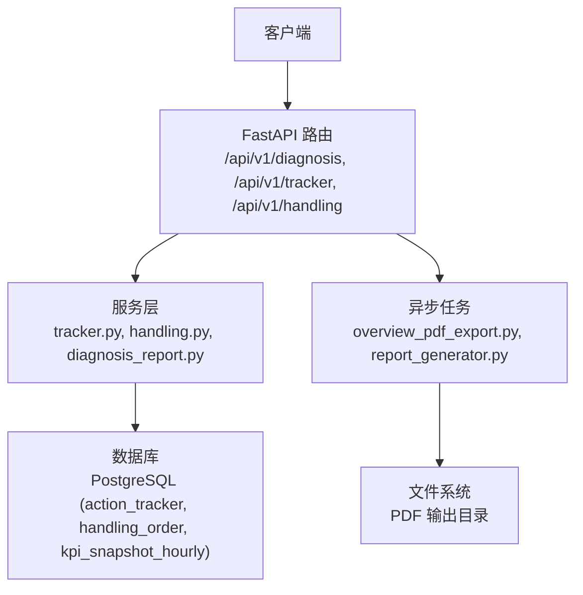
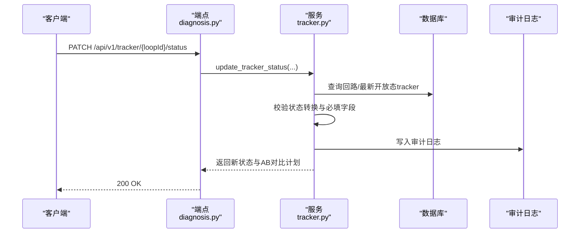
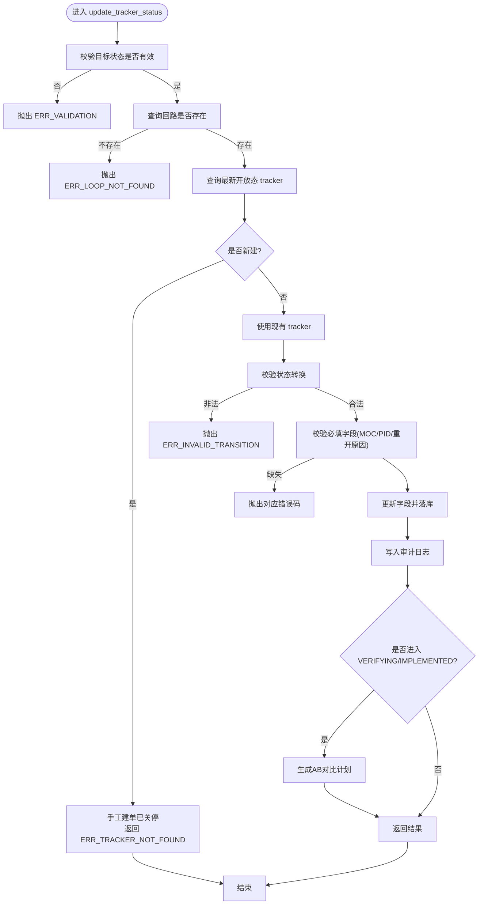
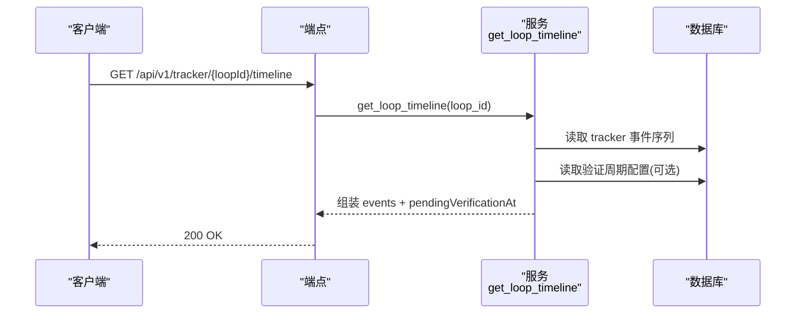
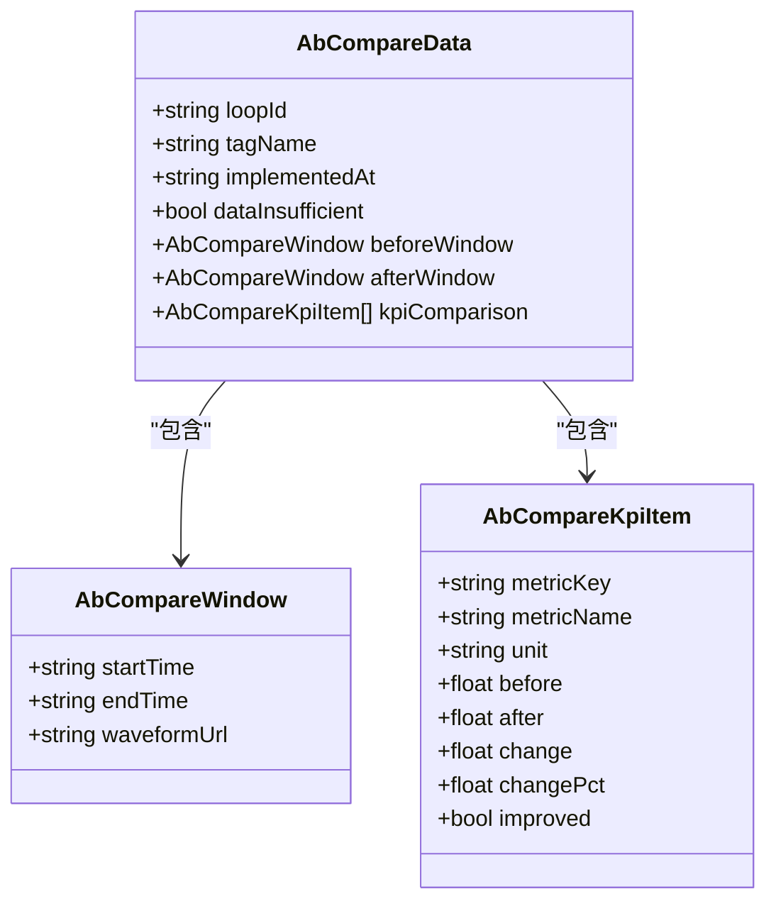
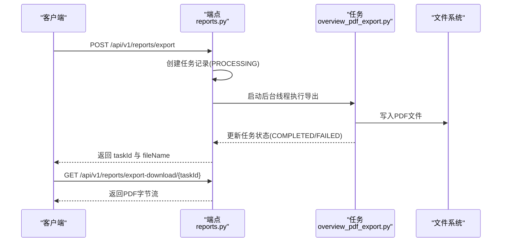
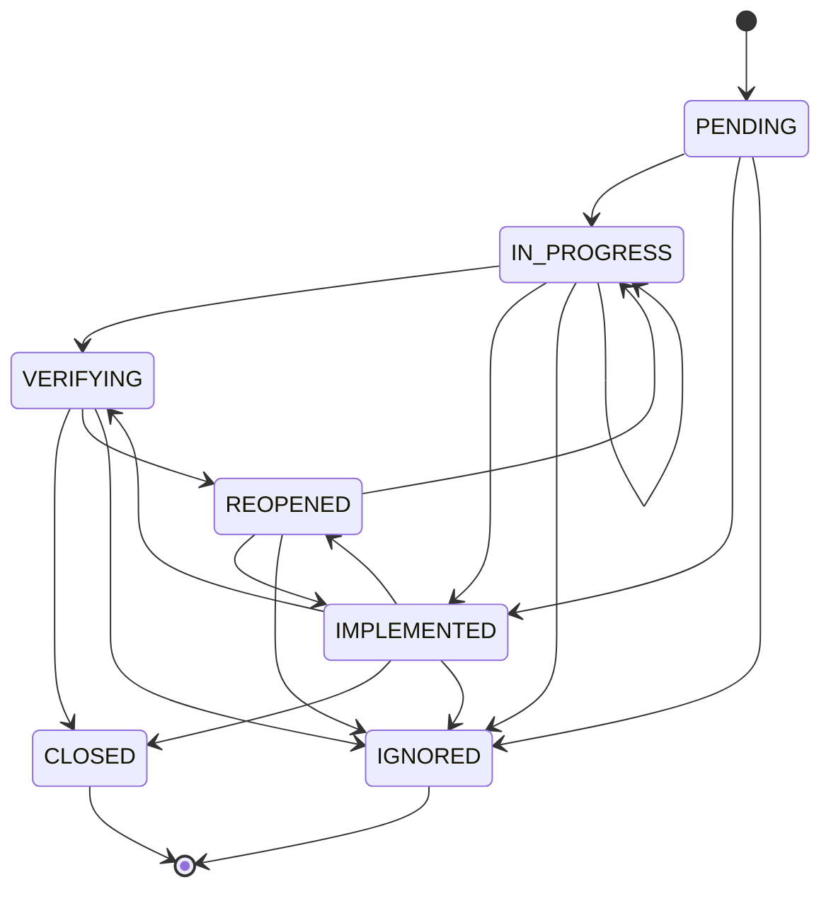
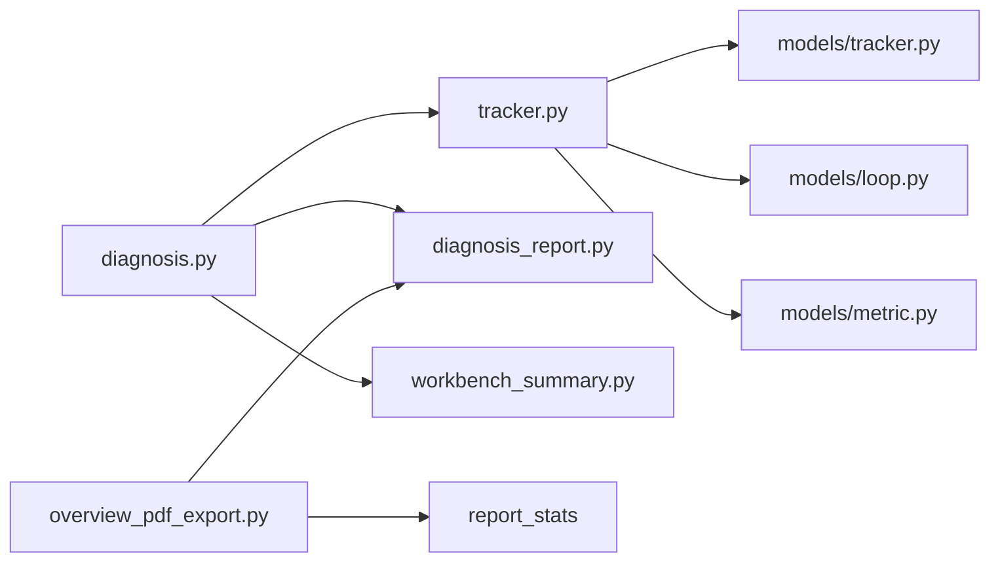

# 处置工作流接口

<cite>
**本文引用的文件**
- [diagnosis.py](file://backend/app/api/v1/endpoints/diagnosis.py)
- [tracker.py](file://backend/app/services/tracker.py)
- [tracker_model.py](file://backend/app/models/tracker.py)
- [handling.py](file://backend/app/api/v1/endpoints/handling.py)
- [test_diagnosis.py](file://backend/tests/test_diagnosis.py)
- [test_tracker_verification.py](file://backend/tests/test_tracker_verification.py)
- [overview_pdf_export.py](file://backend/app/tasks/overview_pdf_export.py)
- [report_generator.py](file://backend/app/tasks/report_generator.py)
- [diagnosis_report_service.py](file://backend/app/services/diagnosis_report.py)
- [workbench_summary.py](file://backend/app/services/workbench_summary.py)
</cite>

## 更新摘要
**变更内容**
- 移除了已废弃的 TRACKER 和 VERIFICATION 来源相关功能
- 更新了状态管理接口以反映新的处理-focused 架构
- 简化了时间线查询接口，移除了验证超期计算逻辑
- 调整了效果验证接口，专注于AB对比分析而非验证流程
- 更新了PDF导出功能说明，移除了与废弃来源相关的导出选项

## 目录
1. [简介](#简介)
2. [项目结构](#项目结构)
3. [核心组件](#核心组件)
4. [架构总览](#架构总览)
5. [详细组件分析](#详细组件分析)
6. [依赖关系分析](#依赖关系分析)
7. [性能考虑](#性能考虑)
8. [故障排查指南](#故障排查指南)
9. [结论](#结论)
10. [附录](#附录)

## 简介
本文件面向 CLPM-MVP 处置工作流系统，聚焦以下能力：
- 状态管理接口：PATCH /api/v1/tracker/{loopId}/status，更新处理状态与状态机转换规则。
- 时间线查询接口：GET /api/v1/tracker/{loopId}/timeline，获取处置时间线与事件追踪。
- 效果验证接口：AB对比分析、效果评估指标、验证配置管理。
- PDF导出功能：处置建议书生成、报告定制、批量导出。
- 工作流状态机设计、权限控制机制、审计日志记录。
- 工作流配置指南与故障排查方法。

**更新** 系统已从关注聚合中移除 TRACKER 和 VERIFICATION 来源，现在专注于处理导向的工作流架构。

## 项目结构
后端采用 FastAPI 路由分层：
- API 层：位于 backend/app/api/v1/endpoints，负责请求解析、鉴权、调用服务。
- 服务层：位于 backend/app/services，封装业务逻辑（状态机、AB对比、PDF导出等）。
- 模型层：SQLAlchemy 模型定义（如 ActionTracker）。
- 任务层：Celery/线程异步任务（PDF导出、统计报表等）。

**图表来源**
- [diagnosis.py:1059-1102](file://backend/app/api/v1/endpoints/diagnosis.py#L1059-L1102)
- [handling.py:1023-1061](file://backend/app/api/v1/endpoints/handling.py#L1023-L1061)
- [overview_pdf_export.py:39-47](file://backend/app/tasks/overview_pdf_export.py#L39-L47)

**章节来源**
- [diagnosis.py:1059-1102](file://backend/app/api/v1/endpoints/diagnosis.py#L1059-L1102)

## 核心组件
- 状态管理：update_tracker_status 实现 PENDING→IN_PROGRESS→VERIFYING→CLOSED 闭环，兼容历史 IMPLEMENTED 路径，支持 REOPENED 重开。
- 时间线：get_loop_timeline 聚合 tracker 事件并计算预计验证时间。
- AB对比：get_ab_compare 基于实施时刻前后窗口 KPI 均值对比，返回改善/恶化指标数与关键KPI变化。
- 效果验证：T+7d 周期任务自动回写 effect_verified 与 ab_compare_summary；提供验证配置管理接口。
- PDF导出：同步/异步两种模式，支持诊断建议书与管理总览导出。
- **更新** 处理工单系统：handling_order 作为主要的处置工作流载体，替代了原有的手工建单功能。

**章节来源**
- [tracker.py:89-397](file://backend/app/services/tracker.py#L89-L397)
- [tracker.py:740-948](file://backend/app/services/tracker.py#L740-L948)
- [handling.py:1023-1061](file://backend/app/api/v1/endpoints/handling.py#L1023-L1061)

## 架构总览
处置工作流以"状态机 + 事件 + 验证"为主线：
- 控制器（端点）接收请求，校验权限与参数。
- 服务层执行状态转换、AB对比、PDF生成。
- 数据持久化到 PostgreSQL，审计日志写入 SysAuditLog。
- 异步任务完成耗时操作（PDF导出、统计报表）。

**图表来源**
- [diagnosis.py:1059-1102](file://backend/app/api/v1/endpoints/diagnosis.py#L1059-L1102)
- [tracker.py:89-397](file://backend/app/services/tracker.py#L89-L397)

## 详细组件分析

### 状态管理接口：PATCH /api/v1/tracker/{loopId}/status
- 功能：更新处理状态，支持新建 tracker（无开放态时），强制校验状态转换与必填字段。
- 权限：仅 IC_ENGINEER 可操作（在端点层通过角色依赖注入控制）。
- 状态机：
  - 允许转换：PENDING→IN_PROGRESS/IMPLEMENTED/IGNORED；IN_PROGRESS→VERIFYING/IMPLEMENTED/IGNORED/IN_PROGRESS；VERIFYING→CLOSED/REOPENED/VERIFYING/IGNORED；REOPENED→IN_PROGRESS/IMPLEMENTED/IGNORED；IMPLEMENTED→CLOSED/REOPENED/VERIFYING/IGNORED；CLOSED/IGNORED为终态不可转换。
  - 兼容历史：存量 IMPLEMENTED 映射至 VERIFYING 流程。
- 必填字段：
  - VERIFYING：必须提供 MOC 关联或"不适用"说明，且必须填写新 PID 参数（P/I/D）。
  - REOPENED：必须填写重开原因。
- 审计：每次状态变更写入 SysAuditLog，包含 before/after 快照。
- 响应：返回 tracker 当前状态、实施详情、AB对比计划、负责人与计划时间等。

**更新** 手工建单功能已关停，当无开放态 tracker 时返回 ERR_TRACKER_NOT_FOUND 错误，引导用户使用处置工单流程。

**图表来源**
- [tracker.py:89-397](file://backend/app/services/tracker.py#L89-L397)

**章节来源**
- [tracker.py:89-397](file://backend/app/services/tracker.py#L89-L397)
- [diagnosis.py:1059-1102](file://backend/app/api/v1/endpoints/diagnosis.py#L1059-L1102)
- [test_diagnosis.py:1608-1634](file://backend/tests/test_diagnosis.py#L1608-L1634)

### 时间线查询接口：GET /api/v1/tracker/{loopId}/timeline
- 功能：获取单回路异常处置时间线，聚合 tracker 事件并按时间排序，计算预计验证时间。
- 数据来源：ActionTracker 事件序列；若当前处于 VERIFYING 且有 implemented_at，则根据 sys_config 中的验证周期计算 pendingVerificationAt。
- 返回字段：loopId、tagName、currentStatus、events、pendingVerificationAt。

**更新** 移除了验证超期计算逻辑，现在只关注处置事件的展示。

**图表来源**
- [tracker.py:740-948](file://backend/app/services/tracker.py#L740-L948)

**章节来源**
- [tracker.py:740-948](file://backend/app/services/tracker.py#L740-L948)
- [diagnosis.py:1105-1121](file://backend/app/api/v1/endpoints/diagnosis.py#L1105-L1121)

### 效果验证接口：AB对比分析与验证配置
- AB对比：
  - 接口：GET /api/v1/diagnosis/ab-compare
  - 窗口：支持 implementedAt 自动截取 [T-7d,T) 与 (T,T+7d]，或显式传入 before/after 窗口。
  - 指标：综合评分、平稳率、控制精度、有效自控率、好值率、振荡率、饱和率、粘滞指数等。
  - 数据不足：实施后窗口小时级快照少于24h时 dataInsufficient=true。
  - 扩展：includeDiagnosis=true 时返回 before/after 标签及标签变化。
- 效果评估：
  - 指标汇总：improvedCount、deterioratedCount、scoreChange、coreKpiChanges（排除 score，最多4项）。
  - 结论判定：改善多于恶化为 IMPROVED；恶化多于改善为 DETERIORATED；相等为 NO_CHANGE；数据不足为 INCONCLUSIVE。
- 验证配置管理：
  - 接口：用于读取/更新验证周期（默认24小时，可配置范围1~720小时）。
  - 用途：控制 IMPLEMENTED 后等待 N 小时触发验证的周期。

**更新** 移除了与废弃 TRACKER 和 VERIFICATION 来源相关的验证逻辑，专注于AB对比分析功能。

**图表来源**
- [diagnosis_schemas.py:553-585](file://backend/app/schemas/diagnosis.py#L553-L585)

**章节来源**
- [diagnosis.py:604-640](file://backend/app/api/v1/endpoints/diagnosis.py#L604-L640)
- [tracker.py:571-714](file://backend/app/services/tracker.py#L571-L714)

### PDF导出功能：处置建议书与报告定制
- 处置建议书：
  - 接口：POST /api/v1/tracker/{loopId}/export
  - 实现：复用诊断报告生成器，返回 PDF bytes 与文件名。
  - 文件名格式：CLPM-诊断建议书-{位号}-{日期}.pdf。
- 管理总览 PDF：
  - 接口：POST /api/v1/reports/export（异步）
  - 实现：后台线程执行导出，支持三阶段自适应模板，返回 taskId 与 fileName。
  - 下载：GET /api/v1/reports/export-download/{taskId}
- 报告定制：
  - 内容模板：支持 JSON 内容模板渲染。
  - 批量导出：通过 analytics/export 触发 Celery 任务，返回 task_id 供轮询。

**更新** 移除了与废弃来源相关的导出选项，专注于处置建议书的导出功能。

**图表来源**
- [reports_api.py:346-424](file://backend/app/api/v1/endpoints/reports.py#L346-L424)
- [overview_pdf_export.py:39-47](file://backend/app/tasks/overview_pdf_export.py#L39-L47)
- [report_generator.py:238-263](file://backend/app/tasks/report_generator.py#L238-L263)
- [diagnosis_report_service.py:341-387](file://backend/app/services/diagnosis_report.py#L341-L387)

**章节来源**
- [tracker.py:951-986](file://backend/app/services/tracker.py#L951-L986)
- [diagnosis.py:1124-1170](file://backend/app/api/v1/endpoints/diagnosis.py#L1124-L1170)

### 工作流状态机设计
- 状态集合：PENDING、IN_PROGRESS、VERIFYING、CLOSED、REOPENED、IMPLEMENTED、IGNORED。
- 转换规则：见 ALLOWED_TRANSITIONS 字典；终态 CLOSED/IGNORED 不可转换。
- 兼容性：历史 IMPLEMENTED 状态兼容迁移至 VERIFYING 流程。
- 约束：同一回路同一标签在开放态（PENDING/IN_PROGRESS/VERIFYING）下唯一。

**更新** 移除了与废弃 TRACKER 和 VERIFICATION 来源相关的状态转换逻辑。

**图表来源**
- [tracker_model.py:122-127](file://backend/app/models/tracker.py#L122-L127)
- [tracker.py:51-70](file://backend/app/services/tracker.py#L51-L70)

**章节来源**
- [tracker_model.py:122-127](file://backend/app/models/tracker.py#L122-L127)
- [tracker.py:51-70](file://backend/app/services/tracker.py#L51-L70)

### 权限控制机制
- 角色与权限：
  - 状态更新：IC_ENGINEER。
  - 阈值覆盖/模板应用：ADMIN/IC_ENGINEER（按 scope 限制）。
  - 诊断任务触发/归档/取消：ADMIN/IC_ENGINEER/PE_ENGINEER。
  - 配置变更审批：ADMIN/EXPERT。
- 实现方式：FastAPI 依赖注入 require_roles/require_perms。

**更新** 移除了与废弃来源相关的权限控制逻辑。

**章节来源**
- [diagnosis.py:1059-1102](file://backend/app/api/v1/endpoints/diagnosis.py#L1059-L1102)
- [diagnosis.py:1105-1121](file://backend/app/api/v1/endpoints/diagnosis.py#L1105-L1121)

### 审计日志记录
- 触发点：状态变更、配置变更、任务执行等。
- 内容：operator、operation_type、target_type、target_id、before_value、after_value、operated_at。
- 存储：SysAuditLog 表。

**更新** 移除了与废弃 TRACKER 和 VERIFICATION 来源相关的审计日志记录逻辑。

**章节来源**
- [tracker.py:315-328](file://backend/app/services/tracker.py#L315-L328)

## 依赖关系分析
- 端点依赖服务：diagnosis.py → tracker.py、diagnosis_report.py、workbench_summary.py。
- 服务依赖模型：ActionTracker、LoopLedger、KpiSnapshotHourly、SysConfig。
- 任务依赖服务：overview_pdf_export.py → report_stats、diagnosis_report.py。
- 测试覆盖：test_diagnosis.py 覆盖状态更新边界条件（无效状态、回路不存在）。

**更新** 移除了与废弃来源相关的依赖关系。

**图表来源**
- [diagnosis.py:1059-1102](file://backend/app/api/v1/endpoints/diagnosis.py#L1059-L1102)
- [tracker.py:22-31](file://backend/app/services/tracker.py#L22-L31)
- [overview_pdf_export.py:19-24](file://backend/app/tasks/overview_pdf_export.py#L19-L24)

**章节来源**
- [diagnosis.py:1059-1102](file://backend/app/api/v1/endpoints/diagnosis.py#L1059-L1102)
- [tracker.py:22-31](file://backend/app/services/tracker.py#L22-L31)

## 性能考虑
- 时间线查询：事件按时间排序，避免全表扫描；利用索引 idx_action_tracker_loop_created。
- AB对比：小时级快照聚合，数据不足时快速返回 dataInsufficient。
- PDF导出：异步任务避免阻塞请求；小文件内存缓存提升下载性能。
- 状态转换：最小化数据库往返，批量更新字段。

**更新** 移除了与废弃来源相关的性能优化逻辑。

## 故障排查指南
- 无效状态：返回 422，检查 status 是否在 VALID_STATUSES。
- 回路不存在：返回 404，确认 loopId 有效。
- 状态转换非法：返回 422，检查 ALLOWED_TRANSITIONS。
- 必填字段缺失：MOC/PID/重开原因缺失将返回对应错误码。
- 手工建单失败：返回 ERR_TRACKER_NOT_FOUND，需使用处置工单流程。
- PDF导出失败：检查任务状态与错误信息，确认文件系统权限。

**更新** 新增了手工建单失败的故障排查指南。

**章节来源**
- [test_diagnosis.py:1608-1634](file://backend/tests/test_diagnosis.py#L1608-L1634)
- [tracker.py:123-193](file://backend/app/services/tracker.py#L123-L193)

## 结论
本接口文档明确了处置工作流的状态管理、时间线查询、效果验证与PDF导出的核心能力，提供了状态机设计、权限控制与审计日志的实现要点，并给出性能优化与故障排查建议。**更新** 系统已从关注聚合中移除 TRACKER 和 VERIFICATION 来源，现在专注于处理导向的工作流架构，手工建单功能已关停，用户需通过处置工单流程进行操作。

## 附录
- 配置指南：
  - 验证周期：sys_config 中 TRACKER_VERIFICATION_INTERVAL_KEY，默认24小时，范围1~720小时。
  - 报告模板：content_template JSON 字符串，支持动态内容渲染。
- 最佳实践：
  - 状态更新前校验必填字段，避免后续流程中断。
  - AB对比窗口确保数据充足，必要时延长观察期。
  - PDF导出使用异步任务，前端轮询任务状态。
  - **更新** 使用处置工单流程替代手工建单，遵循新的工作流架构。

**更新** 新增了处置工单流程的使用指南。