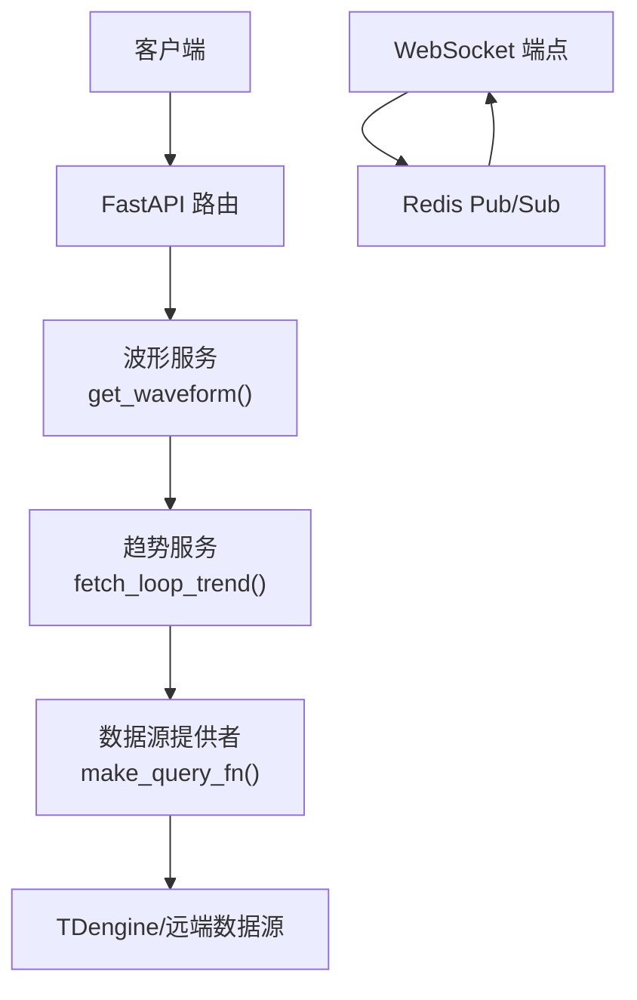
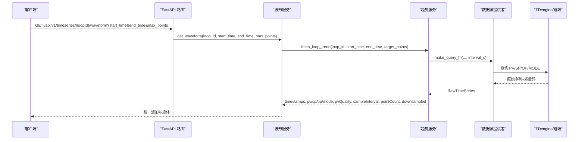
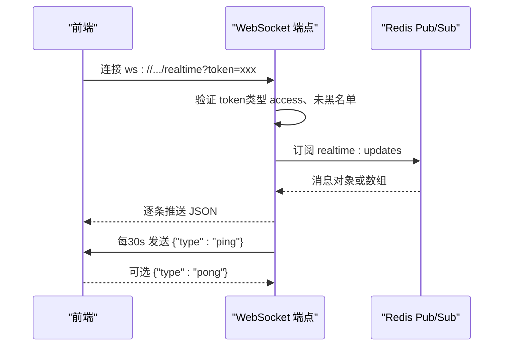
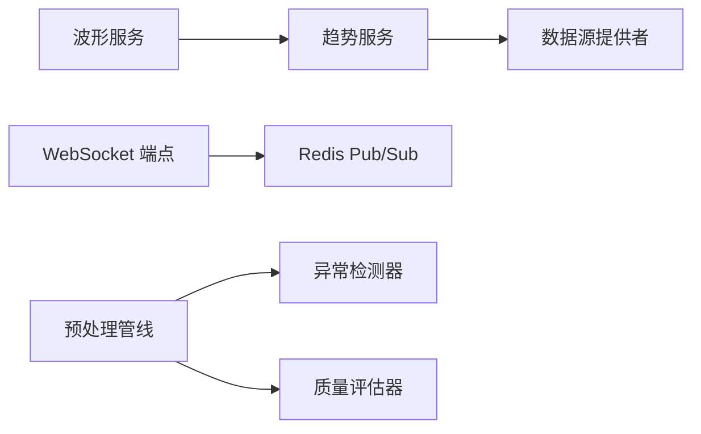

# 波形数据接口

<cite>
**本文引用的文件**
- [backend/app/services/waveform.py](file://backend/app/services/waveform.py)
- [backend/app/services/trend_service.py](file://backend/app/services/trend_service.py)
- [backend/app/api/v1/endpoints/ws_realtime.py](file://backend/app/api/v1/endpoints/ws_realtime.py)
- [backend/app/services/preprocessing/pipeline.py](file://backend/app/services/preprocessing/pipeline.py)
- [backend/app/core/exceptions.py](file://backend/app/core/exceptions.py)
</cite>

## 目录
1. [简介](#简介)
2. [项目结构](#项目结构)
3. [核心组件](#核心组件)
4. [架构总览](#架构总览)
5. [详细组件分析](#详细组件分析)
6. [依赖关系分析](#依赖关系分析)
7. [性能考虑](#性能考虑)
8. [故障排查指南](#故障排查指南)
9. [结论](#结论)
10. [附录](#附录)

## 简介
本文件为 CLPM-MVP 波形数据系统的 API 文档，聚焦于控制回路波形查询与实时推送能力。内容涵盖：
- 波形数据查询接口：GET /api/v1/timeseries/{loopId}/waveform（时间范围筛选、最大点数限制）
- 数据格式规范：时序数据结构、采样频率、数据质量标识
- 数据处理能力：数据清洗、异常值检测、插值补全策略说明
- 性能优化：数据压缩、分页加载、缓存机制建议
- 实时数据推送：WebSocket 连接管理、心跳、断线重连建议
- 分析与可视化：前端展示方案与工具建议

## 项目结构
后端通过服务层封装趋势与波形查询逻辑，提供统一的趋势数据获取能力；WebSocket 端点负责实时数据推送；预处理管线提供数据清洗与异常检测能力。

图表来源
- [backend/app/services/waveform.py:146-212](file://backend/app/services/waveform.py#L146-L212)
- [backend/app/services/trend_service.py:226-424](file://backend/app/services/trend_service.py#L226-L424)
- [backend/app/api/v1/endpoints/ws_realtime.py:63-136](file://backend/app/api/v1/endpoints/ws_realtime.py#L63-L136)

章节来源
- [backend/app/services/waveform.py:1-236](file://backend/app/services/waveform.py#L1-L236)
- [backend/app/services/trend_service.py:1-432](file://backend/app/services/trend_service.py#L1-L432)
- [backend/app/api/v1/endpoints/ws_realtime.py:1-136](file://backend/app/api/v1/endpoints/ws_realtime.py#L1-L136)

## 核心组件
- 波形查询服务：校验回路、解析时间、限制时间窗、调用趋势服务并归一化质量码，返回统一波形响应体。
- 趋势查询服务：动态计算采样间隔、并行/宽表查询 PV/SP/OP/MODE、质量码归一化、LTTB 降采样。
- WebSocket 实时推送：基于 Redis Pub/Sub 订阅实时消息，认证后向客户端推送单条或批量数据，支持心跳。
- 预处理管线：8 步流水线完成质量码识别、有效性标记、量程归一化、异常值检测、连续性检查、质量摘要等。

章节来源
- [backend/app/services/waveform.py:146-212](file://backend/app/services/waveform.py#L146-L212)
- [backend/app/services/trend_service.py:226-424](file://backend/app/services/trend_service.py#L226-L424)
- [backend/app/api/v1/endpoints/ws_realtime.py:36-136](file://backend/app/api/v1/endpoints/ws_realtime.py#L36-L136)
- [backend/app/services/preprocessing/pipeline.py:58-228](file://backend/app/services/preprocessing/pipeline.py#L58-L228)

## 架构总览
波形查询与实时推送两条主线：
- 历史/回放：HTTP 请求进入波形服务，经趋势服务从数据源拉取多序列数据，必要时进行 LTTB 降采样，返回统一时序结构。
- 实时：服务端通过 Redis Pub/Sub 接收上游实时数据，WebSocket 端点认证后转发给前端，维持心跳。

图表来源
- [backend/app/services/waveform.py:146-212](file://backend/app/services/waveform.py#L146-L212)
- [backend/app/services/trend_service.py:226-424](file://backend/app/services/trend_service.py#L226-L424)

## 详细组件分析

### 波形数据查询接口
- 路径与方法：GET /api/v1/timeseries/{loopId}/waveform
- 查询参数：
  - loopId：控制回路 ID（路径参数）
  - start_time：起始时间（ISO 8601）
  - end_time：结束时间（ISO 8601）
  - max_points：最大点数（可选，默认 5000）
- 业务规则：
  - 校验回路是否存在，不存在返回错误码 ERR_LOOP_NOT_FOUND
  - 时间窗不得超过 30 天，否则返回错误码 ERR_TS_001
  - 调用趋势服务获取多序列数据，并对 PV 质量码进行 Title Case 归一化（Good/Bad/Unknown）
- 响应字段：
  - loopId：字符串
  - tagName：位号名称
  - timeRange：{startTime, endTime}
  - timestamps：毫秒时间戳数组
  - pv/sp/op/mode：数值数组（pv 在 Bad 时为 null）
  - pvQuality：质量码数组（Good/Bad/Unknown）
  - downsampled：是否触发 LTTB 降采样
  - pointCount：点数
  - sampleInterval：实际采样间隔（秒）

章节来源
- [backend/app/services/waveform.py:146-212](file://backend/app/services/waveform.py#L146-L212)
- [backend/app/services/waveform.py:215-232](file://backend/app/services/waveform.py#L215-L232)

### 趋势查询服务（内部）
- 功能：
  - 动态计算采样间隔，确保点数不超过目标阈值
  - 并行/宽表查询 PV/SP/OP/MODE
  - 质量码归一化为 GOOD/BAD/UNCERTAIN
  - 超过阈值时执行 LTTB 多序列降采样（共享时间戳）
- 关键常量：
  - DEFAULT_TARGET_POINTS：默认目标点数 3600
  - LTTB_THRESHOLD：触发降采样的阈值 5000
- 返回值：包含 timestamps、pv/sp/op/mode、pvQuality、sampleInterval、pointCount、downsampled

章节来源
- [backend/app/services/trend_service.py:38-130](file://backend/app/services/trend_service.py#L38-L130)
- [backend/app/services/trend_service.py:204-224](file://backend/app/services/trend_service.py#L204-L224)
- [backend/app/services/trend_service.py:226-424](file://backend/app/services/trend_service.py#L226-L424)

### 预处理管线（数据清洗与异常检测）
- 8 步流程：
  1) 质量码识别：将原始质量码映射为 Good/Bad/Unknown
  2) 有效性标记：结合质量码与异常检测结果设置 valid 标记
  3) 量程归一化：PV/SP 使用 PV 量程，OP 使用 OP 量程归一化到百分比
  4) 异常值检测：对每个信号执行多种异常检测（如冻结、噪声、越界等）
  5) 缺失率统计：用于质量摘要
  6) 连续性检查：标记连续有效段，短段丢弃
  7) 指标掩码：按 mask_expression 生成有效索引（由 DataPlanner 调用）
  8) 质量摘要：汇总有效比例、连续段等信息
- 输出：DataBlock（含 signals、validity、outlier_reasons、quality_summary、consecutive_segments、loop_confidence_level、loop_valid_rate）

章节来源
- [backend/app/services/preprocessing/pipeline.py:1-438](file://backend/app/services/preprocessing/pipeline.py#L1-L438)

### 实时数据推送（WebSocket）
- 端点：WS /api/v1/ws/realtime
- 认证：通过 query 参数 token 进行 JWT 校验，拒绝 refresh token 与黑名单 token
- 数据流：订阅 Redis Pub/Sub 频道，接收单条或批量消息并转发至客户端
- 心跳：每 30 秒发送 ping，客户端可回复 pong
- 断线处理：捕获断开与异常，清理资源（取消心跳任务、取消订阅、关闭连接）

图表来源
- [backend/app/api/v1/endpoints/ws_realtime.py:36-136](file://backend/app/api/v1/endpoints/ws_realtime.py#L36-L136)

章节来源
- [backend/app/api/v1/endpoints/ws_realtime.py:1-136](file://backend/app/api/v1/endpoints/ws_realtime.py#L1-L136)

## 依赖关系分析
- 波形服务依赖趋势服务进行数据获取与降采样
- 趋势服务依赖数据源提供者抽象，屏蔽底层存储差异（TDengine/远端）
- WebSocket 端点依赖 Redis Pub/Sub 通道与 JWT 安全模块
- 预处理管线依赖质量评估、异常检测、阈值配置等子模块

图表来源
- [backend/app/services/waveform.py:146-212](file://backend/app/services/waveform.py#L146-L212)
- [backend/app/services/trend_service.py:226-424](file://backend/app/services/trend_service.py#L226-L424)
- [backend/app/api/v1/endpoints/ws_realtime.py:63-136](file://backend/app/api/v1/endpoints/ws_realtime.py#L63-L136)
- [backend/app/services/preprocessing/pipeline.py:58-228](file://backend/app/services/preprocessing/pipeline.py#L58-L228)

章节来源
- [backend/app/services/waveform.py:146-212](file://backend/app/services/waveform.py#L146-L212)
- [backend/app/services/trend_service.py:226-424](file://backend/app/services/trend_service.py#L226-L424)
- [backend/app/api/v1/endpoints/ws_realtime.py:63-136](file://backend/app/api/v1/endpoints/ws_realtime.py#L63-L136)
- [backend/app/services/preprocessing/pipeline.py:58-228](file://backend/app/services/preprocessing/pipeline.py#L58-L228)

## 性能考虑
- 数据压缩
  - 传输层：启用 GZIP/Deflate 压缩响应体，减少带宽占用
  - 数据层：LTTB 降采样（默认阈值 5000，目标点数 3600），保持视觉保真度
- 分页加载
  - 当前波形接口以时间范围与 max_points 控制数据量；如需更大范围，建议前端分时段多次请求（例如按小时/天切分）
- 缓存机制
  - 热点回路短时间窗口结果可缓存（Redis），键包含 loopId、start_time、end_time、max_points
  - 趋势服务已具备“预加载 Tag 映射”以减少重复查询开销
- 采样间隔优化
  - 根据时间范围动态计算采样间隔，避免过多数据点导致渲染卡顿
- 并发与批处理
  - 宽表查询一次性拉取多角色数据，降低往返次数
  - WebSocket 支持批量消息转发，减少网络开销

[本节为通用性能建议，不直接引用具体代码]

## 故障排查指南
- 常见错误码
  - ERR_LOOP_NOT_FOUND：回路不存在，检查 loopId 是否正确
  - ERR_TS_001：时间窗超过 30 天，缩短查询范围
- 数据质量问题
  - pvQuality 为 Bad 时 pv 值为 null，需在前端做空值处理
  - 若整体数据为空，检查数据源可用性与标签映射
- WebSocket 问题
  - 认证失败：确认 token 类型为 access 且未被加入黑名单
  - 断线重连：前端实现指数退避重连，收到 ping 无 pong 视为链路异常
- 日志定位
  - 趋势查询日志包含 sampleInterval、pointCount、downsampled 信息，便于定位性能瓶颈
  - 预处理管线在置信度 E 时会输出核心 tag 的 valid 统计与异常原因分布

章节来源
- [backend/app/services/waveform.py:159-179](file://backend/app/services/waveform.py#L159-L179)
- [backend/app/core/exceptions.py:1-200](file://backend/app/core/exceptions.py#L1-L200)
- [backend/app/services/trend_service.py:266-283](file://backend/app/services/trend_service.py#L266-L283)
- [backend/app/api/v1/endpoints/ws_realtime.py:36-75](file://backend/app/api/v1/endpoints/ws_realtime.py#L36-L75)

## 结论
本系统通过服务层抽象实现了稳定的波形查询与实时推送能力：
- 波形查询接口提供统一的数据结构与质量控制，支持时间范围与点数限制
- 趋势服务动态采样与 LTTB 降采样保障前端渲染性能
- WebSocket 提供低延迟实时数据通道，具备认证与心跳机制
- 预处理管线确保数据质量与一致性，为后续指标计算与分析奠定基础

[本节为总结性内容，不直接引用具体代码]

## 附录

### 接口定义与数据格式
- 请求
  - 方法：GET
  - 路径：/api/v1/timeseries/{loopId}/waveform
  - 参数：
    - loopId：字符串
    - start_time：ISO 8601 字符串
    - end_time：ISO 8601 字符串
    - max_points：整数（可选，默认 5000）
- 响应体字段
  - loopId：字符串
  - tagName：字符串
  - timeRange：{startTime, endTime}
  - timestamps：整数数组（毫秒）
  - pv/sp/op/mode：浮点或 null 数组
  - pvQuality：字符串数组（Good/Bad/Unknown）
  - downsampled：布尔
  - pointCount：整数
  - sampleInterval：整数（秒）

章节来源
- [backend/app/services/waveform.py:196-212](file://backend/app/services/waveform.py#L196-L212)
- [backend/app/services/trend_service.py:251-264](file://backend/app/services/trend_service.py#L251-L264)

### 实时推送协议
- 连接：ws://host/api/v1/ws/realtime?token={access_token}
- 消息格式：
  - 单条：{"tagCode": "...", "value": "...", "quality": 1, "collectTime": "..."}
  - 批量：数组形式的多条上述对象
- 心跳：
  - 服务端：{"type":"ping"}
  - 客户端：{"type":"pong"}（可选）

章节来源
- [backend/app/api/v1/endpoints/ws_realtime.py:63-136](file://backend/app/api/v1/endpoints/ws_realtime.py#L63-L136)

### 数据分析与可视化方案
- 前端展示
  - 折线图：PV/SP/OP/MODE 多序列叠加，Bad 点以断线或占位符显示
  - 缩放与平移：支持按时间轴缩放，按需二次请求
  - 质量指示：pvQuality 用于着色或标注异常区间
- 工具建议
  - 离线分析：导出 CSV/Parquet，使用 Python（pandas、matplotlib）或 R 进行分析
  - 在线看板：Grafana/Superset 对接 TDengine 或数据库，构建仪表盘
  - 算法验证：利用预处理管线的 quality_summary 与 outlier_reasons 辅助诊断

[本节为概念性内容，不直接引用具体代码]