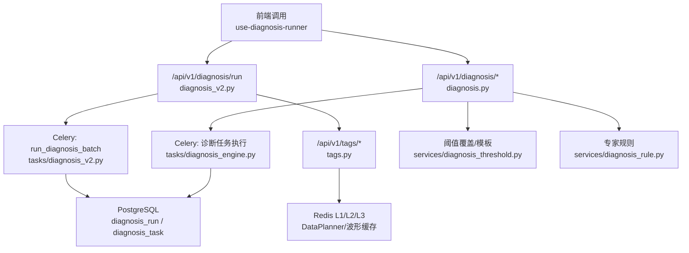
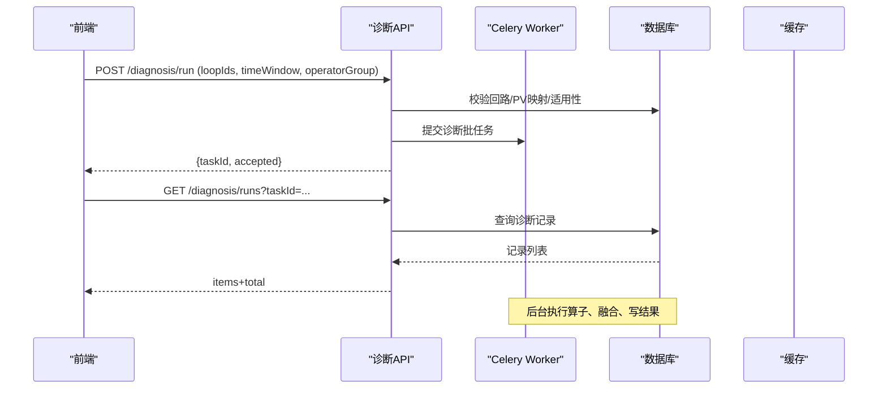
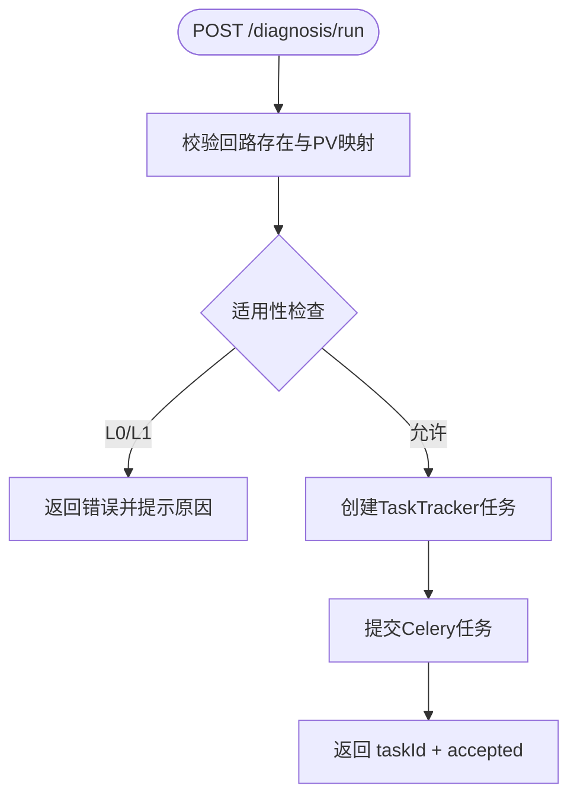
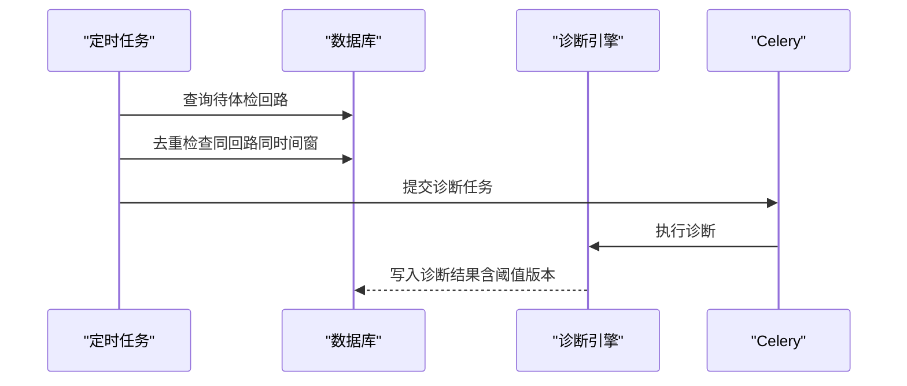
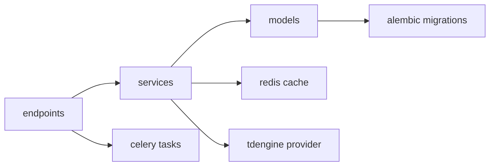

# 诊断中心接口

<cite>
**本文引用的文件**
- [diagnosis.py](file://backend/app/api/v1/endpoints/diagnosis.py)
- [diagnosis_v2.py](file://backend/app/api/v1/endpoints/diagnosis_v2.py)
- [tags.py](file://backend/app/api/v1/endpoints/tags.py)
- [diagnosis_trigger_config.py](file://backend/app/api/v1/endpoints/diagnosis_trigger_config.py)
- [diagnosis_engine.py](file://backend/app/tasks/diagnosis_engine.py)
- [diagnosis_schedule.py](file://backend/app/tasks/diagnosis_schedule.py)
- [diagnosis_threshold.py](file://backend/app/services/diagnosis_threshold.py)
- [diagnosis_rule.py](file://backend/app/services/diagnosis_rule.py)
- [tag_mapping.py](file://backend/app/services/tag_mapping.py)
- [tag.py](file://backend/app/services/tag.py)
- [diagnosis_run.py](file://backend/app/models/diagnosis_run.py)
- [diagnosis.py](file://backend/app/models/diagnosis.py)
- [01_schema.sql](file://db/postgresql/01_schema.sql)
- [e5f6g7h8i9j0_add_threshold_version.py](file://backend/alembic/versions/e5f6g7h8i9j0_add_threshold_version.py)
- [v6p1diag001_add_diagnosis_task.py](file://backend/alembic/versions/v6p1diag001_add_diagnosis_task.py)
- [use-diagnosis-runner.ts](file://frontend/apps/web-antd/src/views/diagnosis/composables/use-diagnosis-runner.ts)
</cite>

## 目录
1. [简介](#简介)
2. [项目结构](#项目结构)
3. [核心组件](#核心组件)
4. [架构总览](#架构总览)
5. [详细组件分析](#详细组件分析)
6. [依赖关系分析](#依赖关系分析)
7. [性能考虑](#性能考虑)
8. [故障排查指南](#故障排查指南)
9. [结论](#结论)
10. [附录](#附录)

## 简介
本文件为 CLPM-MVP 诊断中心模块的完整 API 文档，覆盖以下能力：
- 诊断引擎接口：触发诊断、查看进度、获取结果、证据链与算子结果。
- 诊断配置接口：阈值配置、规则管理、算子参数调优。
- 标签管理接口：位号映射、标签分类、批量导入导出。
- 诊断历史记录接口：执行记录查询、结果对比、版本管理。
- 任务调度与异步处理：Celery 任务、定时体检、失败重试与幂等。
- 结果缓存机制：L1/L2/L3 缓存策略与波形数据缓存。
- 诊断结果解读指南与常见问题排查方法。

## 项目结构
诊断中心由“API 端点 → 服务层 → 模型/迁移 → 任务与调度 → 缓存与外部存储”构成。MVP v2 提供新的诊断运行（run）接口；旧版诊断任务（task）接口保留用于兼容。

图表来源
- [diagnosis_v2.py:190-313](file://backend/app/api/v1/endpoints/diagnosis_v2.py#L190-L313)
- [diagnosis.py:648-787](file://backend/app/api/v1/endpoints/diagnosis.py#L648-L787)
- [diagnosis_engine.py:596-607](file://backend/app/tasks/diagnosis_engine.py#L596-L607)
- [tags.py:76-151](file://backend/app/api/v1/endpoints/tags.py#L76-L151)
- [diagnosis_threshold.py:252-289](file://backend/app/services/diagnosis_threshold.py#L252-L289)

章节来源
- [diagnosis_v2.py:1-845](file://backend/app/api/v1/endpoints/diagnosis_v2.py#L1-L845)
- [diagnosis.py:1-800](file://backend/app/api/v1/endpoints/diagnosis.py#L1-L800)
- [tags.py:1-800](file://backend/app/api/v1/endpoints/tags.py#L1-L800)

## 核心组件
- 诊断引擎接口（v2）：POST /diagnosis/run 发起诊断；GET /diagnosis/runs 列表；GET /diagnosis/runs/{id} 详情（含算子结果、证据链、置信度定义）。
- 诊断任务接口（旧版）：POST /diagnosis/trigger、GET /diagnosis/tasks、GET /diagnosis/tasks/{taskId}、归档/取消/重跑。
- 诊断配置接口：指标配置列表/更新、专家规则列表/更新、差异化阈值覆盖与模板套用、配置版本与回滚、关键配置审批流。
- 标签管理接口：测点清单分页、导入/导出、按回路匹配位号、批量删除。
- 诊断历史记录：runs 列表筛选、CSV 导出、AB 对比、统计报表导出。
- 触发条件配置：诊断触发阈值、并发数、最少点数、体检轨开关。

章节来源
- [diagnosis_v2.py:190-313](file://backend/app/api/v1/endpoints/diagnosis_v2.py#L190-L313)
- [diagnosis.py:160-466](file://backend/app/api/v1/endpoints/diagnosis.py#L160-L466)
- [diagnosis_trigger_config.py:41-103](file://backend/app/api/v1/endpoints/diagnosis_trigger_config.py#L41-L103)
- [tags.py:76-151](file://backend/app/api/v1/endpoints/tags.py#L76-L151)

## 架构总览
诊断中心采用“同步入口 + 异步执行 + 持久化记录 + 缓存加速”的分层架构。前端通过 use-diagnosis-runner 轮询任务状态并拉取结果；后端通过 Celery 执行诊断，落库后供查询与导出。

图表来源
- [diagnosis_v2.py:190-313](file://backend/app/api/v1/endpoints/diagnosis_v2.py#L190-L313)
- [diagnosis_v2.py:315-374](file://backend/app/api/v1/endpoints/diagnosis_v2.py#L315-L374)
- [use-diagnosis-runner.ts:1-50](file://frontend/apps/web-antd/src/views/diagnosis/composables/use-diagnosis-runner.ts#L1-L50)

## 详细组件分析

### 诊断引擎接口（MVP v2）
- 触发诊断
  - 路径：POST /api/v1/diagnosis/run
  - 功能：校验回路存在与 PV 关联、适用性门禁（L0/L1 阻断）、创建 TaskTracker 任务、提交 Celery 任务。
  - 返回：{taskId, accepted, conditionWarning?}
- 诊断记录列表
  - 路径：GET /api/v1/diagnosis/runs
  - 功能：按 loopId/category/severity/status/reviewStatus/taskId/时间范围分页查询。
- 诊断详情
  - 路径：GET /api/v1/diagnosis/runs/{run_id}
  - 功能：返回算子结果、融合结果、症状标签、证据图表、指标汇总、置信度定义、阈值版本等。
- 处置建议
  - 路径：GET/POST/PUT/DELETE /api/v1/diagnosis/runs/{run_id}/actions
  - 功能：系统自动建议（基于诊断/复核结论）与人工新增/修改/删除。
- 每回路最新概览
  - 路径：GET /api/v1/diagnosis/runs/latest
  - 功能：每回路一条最新诊断，附带 KPI 评分、诊断次序、复核信息。

图表来源
- [diagnosis_v2.py:190-313](file://backend/app/api/v1/endpoints/diagnosis_v2.py#L190-L313)

章节来源
- [diagnosis_v2.py:190-313](file://backend/app/api/v1/endpoints/diagnosis_v2.py#L190-L313)
- [diagnosis_v2.py:315-374](file://backend/app/api/v1/endpoints/diagnosis_v2.py#L315-L374)
- [diagnosis_v2.py:745-768](file://backend/app/api/v1/endpoints/diagnosis_v2.py#L745-L768)
- [diagnosis_v2.py:607-743](file://backend/app/api/v1/endpoints/diagnosis_v2.py#L607-L743)

### 诊断任务接口（旧版兼容）
- 触发诊断：POST /api/v1/diagnosis/trigger
- 任务列表：GET /api/v1/diagnosis/tasks（支持 status/triggerType/loopId/plantNodeId 筛选）
- 任务详情：GET /api/v1/diagnosis/tasks/{task_id}
- 任务操作：归档/取消/删除/重跑

章节来源
- [diagnosis.py:648-787](file://backend/app/api/v1/endpoints/diagnosis.py#L648-L787)

### 诊断配置接口
- 指标配置
  - 列表：GET /api/v1/diagnosis/metrics
  - 更新：PUT /api/v1/diagnosis/metrics/{diag_id}（仅 ADMIN）
- 专家规则
  - 列表：GET /api/v1/diagnosis/rules
  - 更新：PUT /api/v1/diagnosis/rules/{rule_id}（仅 ADMIN）
- 差异化阈值覆盖
  - 列表：GET /api/v1/diagnosis/threshold-overrides
  - 模板：GET /api/v1/diagnosis/threshold-templates
  - 覆盖保存/删除：POST/DELETE /threshold-overrides
  - 推荐：GET /threshold-recommendations?loopId=...
  - 一键套用：POST /threshold-templates/apply
- 配置版本与回滚
  - 版本历史：GET /metrics/{diag_id}/versions
  - 回滚：POST /metrics/{diag_id}/rollback（仅 ADMIN）
- 关键配置审批流
  - 变更请求：GET/POST /config-changes
  - 审批：POST /config-changes/{change_id}/approve|reject

章节来源
- [diagnosis.py:160-466](file://backend/app/api/v1/endpoints/diagnosis.py#L160-L466)
- [diagnosis_threshold.py:252-289](file://backend/app/services/diagnosis_threshold.py#L252-L289)
- [diagnosis_rule.py](file://backend/app/services/diagnosis_rule.py)

### 标签管理接口
- 测点清单
  - 分页：GET /api/v1/tags
  - 导出：GET /api/v1/tags/export
  - 导入：POST /api/v1/tags/import（Excel .xlsx）
  - 批量删除：POST /api/v1/tags/batch-delete（仅 ADMIN）
- 单测点 CRUD
  - 详情：GET /api/v1/tags/{tagId}
  - 更新：PUT /api/v1/tags/{tagId}
  - 删除：DELETE /api/v1/tags/{tagId}
- 位号映射
  - 自动匹配：GET /api/v1/tags/match-loop?loopTagName=...
  - 说明：支持 PV/SP/OP/MODE/PID_P/PID_I/PID_D，兼容 _ 与 - 分隔符。

章节来源
- [tags.py:76-151](file://backend/app/api/v1/endpoints/tags.py#L76-L151)
- [tags.py:199-258](file://backend/app/api/v1/endpoints/tags.py#L199-L258)
- [tag.py:695-739](file://backend/app/services/tag.py#L695-L739)
- [tag_mapping.py](file://backend/app/services/tag_mapping.py)

### 诊断历史记录接口
- 记录列表：GET /api/v1/diagnosis/runs（支持多条件筛选与分页）
- 记录详情：GET /api/v1/diagnosis/runs/{run_id}
- CSV 导出：GET /api/v1/diagnosis/export（按筛选条件，上限 5000 行）
- AB 对比：GET /api/v1/diagnosis/ab-compare（实施前后窗口对比，可选包含诊断标签变化）
- 统计报表：GET /analytics、POST /analytics/export（异步导出，返回 taskId）

章节来源
- [diagnosis_v2.py:315-374](file://backend/app/api/v1/endpoints/diagnosis_v2.py#L315-L374)
- [diagnosis_v2.py:771-800](file://backend/app/api/v1/endpoints/diagnosis_v2.py#L771-L800)
- [diagnosis.py:509-568](file://backend/app/api/v1/endpoints/diagnosis.py#L509-L568)

### 诊断任务调度与异步处理
- 手动触发：POST /diagnosis/run → 创建 TaskTracker 任务 → Celery 异步执行。
- 自动体检：定时任务周期性扫描低分回路，避免重复建任务（同回路同时间窗去重）。
- 任务状态：PENDING/RUNNING/SUCCESS/FAILED/CANCELLED，支持归档与取消。
- 审计与可追溯：配置变更写入审计日志，诊断结果记录阈值版本。

图表来源
- [diagnosis_engine.py:596-607](file://backend/app/tasks/diagnosis_engine.py#L596-L607)
- [e5f6g7h8i9j0_add_threshold_version.py:26-34](file://backend/alembic/versions/e5f6g7h8i9j0_add_threshold_version.py#L26-L34)
- [v6p1diag001_add_diagnosis_task.py:78-125](file://backend/alembic/versions/v6p1diag001_add_diagnosis_task.py#L78-L125)

章节来源
- [diagnosis_engine.py:596-607](file://backend/app/tasks/diagnosis_engine.py#L596-L607)
- [diagnosis_schedule.py](file://backend/app/tasks/diagnosis_schedule.py)

### 结果缓存机制
- 波形数据：通过 DataPlanner 获取 DataBlock，结合 Redis L1/L2/L3 缓存，支持 LTTB 降采样与质量策略。
- 指标计算：复用 Phase 2 架构，合并同 tagGroup 指标，减少查询次数。
- 阈值与配置：进程内缓存热路径读取，保存后立即刷新。

章节来源
- [tags.py:372-399](file://backend/app/api/v1/endpoints/tags.py#L372-L399)
- [tags.py:704-736](file://backend/app/api/v1/endpoints/tags.py#L704-L736)
- [diagnosis_trigger_config.py:41-103](file://backend/app/api/v1/endpoints/diagnosis_trigger_config.py#L41-L103)

## 依赖关系分析
- 端点与服务：诊断端点依赖 services 层进行业务编排；标签端点依赖 tag/tag_mapping 服务。
- 模型与迁移：diagnosis_run、diagnosis_task、diagnosis_threshold_override 等表结构与字段由迁移脚本维护。
- 外部依赖：Celery 异步执行、TDengine 时序数据、Redis 缓存、PostgreSQL 关系数据。

图表来源
- [diagnosis.py:91-138](file://backend/app/api/v1/endpoints/diagnosis.py#L91-L138)
- [tags.py:52-61](file://backend/app/api/v1/endpoints/tags.py#L52-L61)
- [01_schema.sql:1249-1263](file://db/postgresql/01_schema.sql#L1249-L1263)

章节来源
- [01_schema.sql:1249-1263](file://db/postgresql/01_schema.sql#L1249-L1263)
- [e5f6g7h8i9j0_add_threshold_version.py:26-34](file://backend/alembic/versions/e5f6g7h8i9j0_add_threshold_version.py#L26-L34)
- [v6p1diag001_add_diagnosis_task.py:78-125](file://backend/alembic/versions/v6p1diag001_add_diagnosis_task.py#L78-L125)

## 性能考虑
- 批量限制：单次诊断回路数不超过 50，防止资源滥用。
- 去重策略：同回路同时间窗的任务去重，避免重复诊断。
- 缓存命中：波形数据与指标计算使用 L1/L2/L3 缓存，显著降低延迟。
- 导出上限：CSV 导出限制 5000 行，保障响应时间。
- 降采样：超过 maxPoints 触发 LTTB 降采样，平衡精度与性能。

[本节为通用性能指导，不直接分析具体文件]

## 故障排查指南
- 触发诊断失败
  - 回路不存在或缺少 PV Tag 关联：检查回路元数据与映射。
  - 适用性不足（L0/L1）：先处理控制状态或数据质量问题。
- 任务无进展
  - 检查 Celery Worker 是否运行；查看任务状态与错误日志。
  - 确认定时任务是否启用且未重复去重。
- 阈值不生效
  - 检查阈值覆盖 scope 与优先级（loop_type → plant → loop → 全局默认）。
  - 查看配置版本历史与回滚记录。
- 波形数据异常
  - 校验时间窗（≤30 天）与 tagGroup；检查 DataPlanner 缓存与 TDengine 连接。
- 导出失败
  - 确认筛选条件与行数限制；检查异步任务状态。

章节来源
- [diagnosis_v2.py:190-313](file://backend/app/api/v1/endpoints/diagnosis_v2.py#L190-L313)
- [diagnosis_engine.py:596-607](file://backend/app/tasks/diagnosis_engine.py#L596-L607)
- [diagnosis_threshold.py:252-289](file://backend/app/services/diagnosis_threshold.py#L252-L289)
- [tags.py:704-736](file://backend/app/api/v1/endpoints/tags.py#L704-L736)

## 结论
诊断中心通过清晰的 API 分层、完善的配置管理与灵活的标签体系，实现了从触发到结果的全链路闭环。结合 Celery 异步执行与多级缓存，系统在可扩展性与性能之间取得平衡。建议在生产环境中关注适用性门禁、阈值覆盖策略与缓存命中率，以持续提升诊断准确性与效率。

[本节为总结性内容，不直接分析具体文件]

## 附录
- 前端轮询与进度展示：use-diagnosis-runner 实现细粒度轮询与页面可见性控制。
- 数据模型要点：diagnosis_run 记录单次诊断详情；diagnosis_task 管理任务生命周期；diagnosis_threshold_override 支持四级阈值覆盖。

章节来源
- [use-diagnosis-runner.ts:1-50](file://frontend/apps/web-antd/src/views/diagnosis/composables/use-diagnosis-runner.ts#L1-L50)
- [diagnosis_run.py](file://backend/app/models/diagnosis_run.py)
- [diagnosis.py:239-265](file://backend/app/models/diagnosis.py#L239-L265)
- [01_schema.sql:1249-1263](file://db/postgresql/01_schema.sql#L1249-L1263)