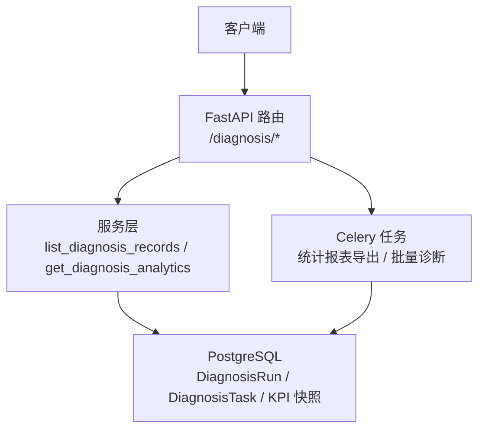
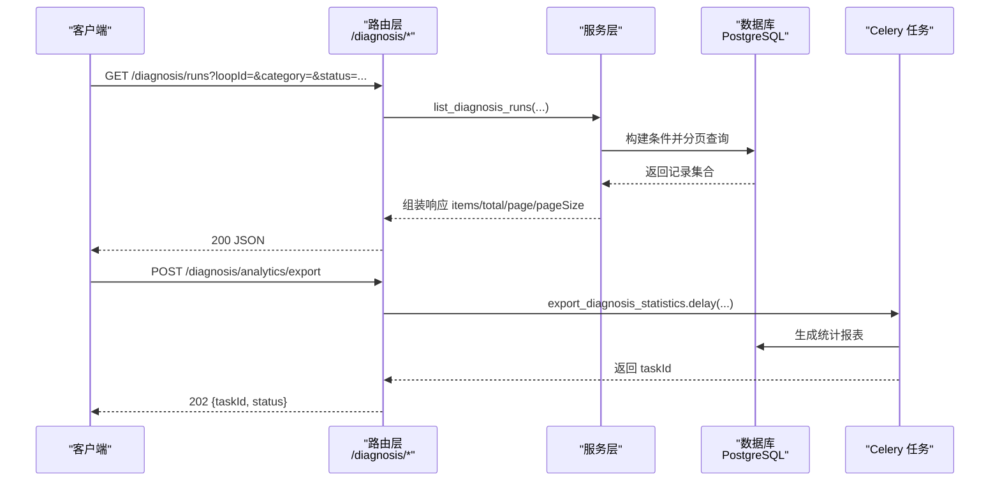
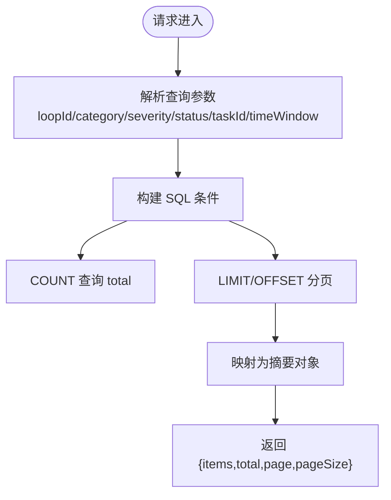
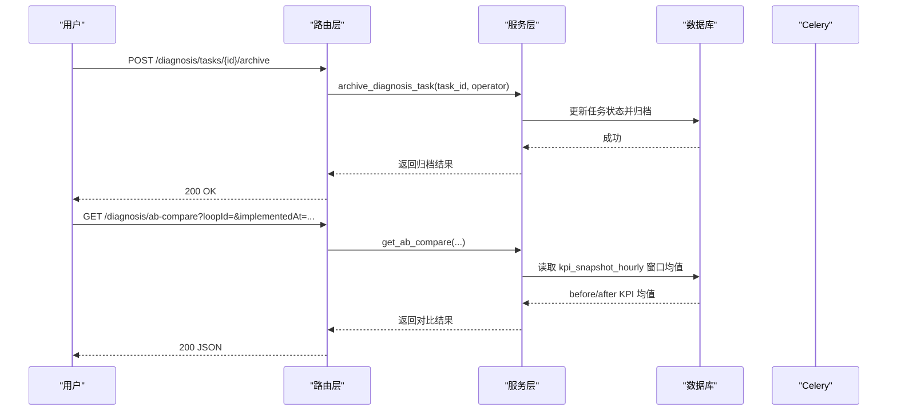
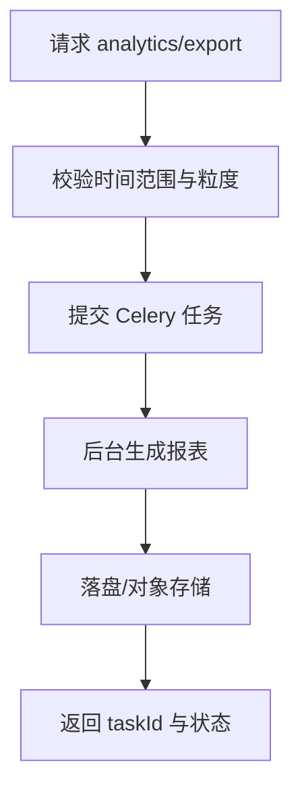
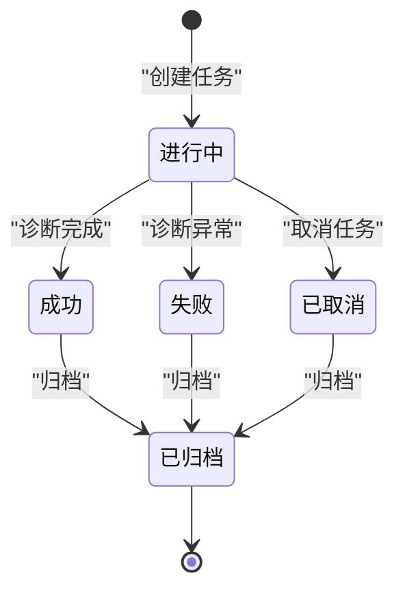
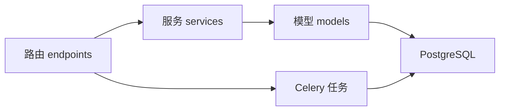

# 诊断历史接口

<cite>
**本文引用的文件**
- [backend/app/api/v1/endpoints/diagnosis.py](file://backend/app/api/v1/endpoints/diagnosis.py)
- [backend/app/api/v1/endpoints/diagnosis_v2.py](file://backend/app/api/v1/endpoints/diagnosis_v2.py)
- [backend/app/models/diagnosis_run.py](file://backend/app/models/diagnosis_run.py)
- [backend/app/schemas/diagnosis.py](file://backend/app/schemas/diagnosis.py)
- [backend/app/services/diagnosis.py](file://backend/app/services/diagnosis.py)
</cite>

## 目录
1. [简介](#简介)
2. [项目结构](#项目结构)
3. [核心组件](#核心组件)
4. [架构总览](#架构总览)
5. [详细组件分析](#详细组件分析)
6. [依赖关系分析](#依赖关系分析)
7. [性能考虑](#性能考虑)
8. [故障排查指南](#故障排查指南)
9. [结论](#结论)
10. [附录](#附录)

## 简介
本文件为 CLPM-MVP 诊断历史记录系统的 API 文档，聚焦以下能力：
- 诊断记录查询接口：GET /api/v1/diagnosis/records（已归档）与 GET /api/v1/diagnosis/runs（MVP v2 诊断运行记录），支持分页与筛选。
- 执行历史管理：任务执行记录、结果对比分析（A/B）、版本追溯（配置版本与回滚）。
- 统计分析：诊断趋势分析、性能指标统计、报告导出（CSV/PDF 异步）。
- 历史记录归档机制：自动归档策略、存储空间管理、数据保留政策（基于任务终态与索引优化）。
- 历史数据查询优化：缓存策略、SQL 索引、分页与过滤建议。
- 历史数据分析方法与最佳实践：时间窗选择、标签聚合、闭环时长与有效率趋势。

## 项目结构
后端采用 FastAPI 路由 + Pydantic Schema + SQLAlchemy 模型 + Celery 异步任务的典型分层：
- 路由层：定义 RESTful 端点与权限校验。
- 服务层：封装业务逻辑（列表、详情、统计、归档等）。
- 模型层：持久化实体（如 DiagnosisRun 一次诊断运行）。
- 任务层：异步导出与批量诊断执行。

**图表来源**
- [backend/app/api/v1/endpoints/diagnosis.py:473-568](file://backend/app/api/v1/endpoints/diagnosis.py#L473-L568)
- [backend/app/api/v1/endpoints/diagnosis_v2.py:315-374](file://backend/app/api/v1/endpoints/diagnosis_v2.py#L315-L374)
- [backend/app/models/diagnosis_run.py:21-103](file://backend/app/models/diagnosis_run.py#L21-L103)

**章节来源**
- [backend/app/api/v1/endpoints/diagnosis.py:1-150](file://backend/app/api/v1/endpoints/diagnosis.py#L1-L150)
- [backend/app/api/v1/endpoints/diagnosis_v2.py:1-130](file://backend/app/api/v1/endpoints/diagnosis_v2.py#L1-L130)

## 核心组件
- 诊断记录查询
  - MVP v2 记录列表：GET /api/v1/diagnosis/runs（分页、按回路/分类/严重等级/状态/任务ID/时间范围筛选）。
  - 旧版归档记录列表：GET /api/v1/diagnosis/records（已归档的诊断记录，由服务层 list_diagnosis_records 提供）。
- 执行历史管理
  - 任务列表与详情：GET /api/v1/diagnosis/tasks、GET /api/v1/diagnosis/tasks/{taskId}。
  - 任务归档：POST /api/v1/diagnosis/tasks/{taskId}/archive（仅终态可归档）。
  - A/B 对比：GET /api/v1/diagnosis/ab-compare（实施前后窗口 KPI 均值对比）。
  - 版本追溯：GET /api/v1/diagnosis/metrics/{diagId}/versions 与 POST /api/v1/diagnosis/metrics/{diagId}/rollback。
- 统计分析
  - 趋势与分布：GET /api/v1/diagnosis/analytics（标签分布、效率趋势、闭环时长分布）。
  - 统计导出：POST /api/v1/diagnosis/analytics/export（异步 PDF/CSV）；GET /api/v1/diagnosis/statistics/export（CSV 同步下载）。
- 历史记录归档机制
  - 自动归档：SUCCESS 完成即自动归档（任务列表含 archivedOnly/includeArchived 控制）。
  - 存储与保留：通过索引与归档策略降低热表压力；结合审计日志实现版本回溯。

**章节来源**
- [backend/app/api/v1/endpoints/diagnosis.py:473-771](file://backend/app/api/v1/endpoints/diagnosis.py#L473-L771)
- [backend/app/api/v1/endpoints/diagnosis_v2.py:315-374](file://backend/app/api/v1/endpoints/diagnosis_v2.py#L315-L374)
- [backend/app/models/diagnosis_run.py:21-103](file://backend/app/models/diagnosis_run.py#L21-L103)

## 架构总览
下图展示“诊断记录查询”的端到端流程，涵盖路由、服务、数据库与异步导出任务。

**图表来源**
- [backend/app/api/v1/endpoints/diagnosis_v2.py:315-374](file://backend/app/api/v1/endpoints/diagnosis_v2.py#L315-L374)
- [backend/app/api/v1/endpoints/diagnosis.py:533-568](file://backend/app/api/v1/endpoints/diagnosis.py#L533-L568)

## 详细组件分析

### 诊断记录查询接口
- GET /api/v1/diagnosis/runs（MVP v2）
  - 功能：获取诊断运行记录列表，支持 loopId/category/severity/status/taskId/timeWindow 筛选，分页返回。
  - 数据模型：DiagnosisRun（一次完整诊断结论，包含算子结果、融合结果、证据、指标汇总、版本信息等）。
  - 排序：按 created_at 倒序。
  - 复杂度：O(N log N) 排序 + O(1) 分页；总数统计为独立 count 查询。
- GET /api/v1/diagnosis/records（旧版归档）
  - 功能：获取已归档的诊断记录列表（由服务层 list_diagnosis_records 提供）。
  - 说明：该端点在路由注释中声明，具体实现位于服务层；常用于查看已完成归档的历史。

**图表来源**
- [backend/app/api/v1/endpoints/diagnosis_v2.py:315-374](file://backend/app/api/v1/endpoints/diagnosis_v2.py#L315-L374)
- [backend/app/models/diagnosis_run.py:21-103](file://backend/app/models/diagnosis_run.py#L21-L103)

**章节来源**
- [backend/app/api/v1/endpoints/diagnosis_v2.py:315-374](file://backend/app/api/v1/endpoints/diagnosis_v2.py#L315-L374)
- [backend/app/models/diagnosis_run.py:21-103](file://backend/app/models/diagnosis_run.py#L21-L103)

### 执行历史管理接口
- 任务执行记录
  - GET /api/v1/diagnosis/tasks：任务列表（默认未归档；includeArchived/archivedOnly 控制归档视图）。
  - GET /api/v1/diagnosis/tasks/{taskId}：任务详情（含关联诊断结果列表）。
  - POST /api/v1/diagnosis/tasks/{taskId}/run：对已有任务重新执行（不新建任务）。
  - POST /api/v1/diagnosis/tasks/{taskId}/archive：归档终态任务（SUCCESS/FAILED/CANCELLED）。
  - POST /api/v1/diagnosis/tasks/{taskId}/cancel：取消 PENDING/RUNNING 任务。
- 结果对比分析（A/B）
  - GET /api/v1/diagnosis/ab-compare：对比实施前后两窗口 KPI 均值，支持 includeDiagnosis 扩展字段。
- 版本追溯
  - GET /api/v1/diagnosis/metrics/{diagId}/versions：读取配置版本历史（来自审计日志）。
  - POST /api/v1/diagnosis/metrics/{diagId}/rollback：回滚到指定版本（需 ADMIN）。

**图表来源**
- [backend/app/api/v1/endpoints/diagnosis.py:648-771](file://backend/app/api/v1/endpoints/diagnosis.py#L648-L771)
- [backend/app/api/v1/endpoints/diagnosis.py:604-640](file://backend/app/api/v1/endpoints/diagnosis.py#L604-L640)

**章节来源**
- [backend/app/api/v1/endpoints/diagnosis.py:648-771](file://backend/app/api/v1/endpoints/diagnosis.py#L648-L771)
- [backend/app/api/v1/endpoints/diagnosis.py:604-640](file://backend/app/api/v1/endpoints/diagnosis.py#L604-L640)

### 统计分析接口
- 诊断趋势分析
  - GET /api/v1/diagnosis/analytics：标签分布、效率趋势、闭环时长分布，支持粒度 hour/day/week/month。
- 性能指标统计
  - 通过 KPI 快照（kpi_snapshot_hourly）计算窗口均值，用于 A/B 对比与趋势。
- 报告导出
  - POST /api/v1/diagnosis/analytics/export：异步导出 PDF/CSV，返回 taskId 供后续查询。
  - GET /api/v1/diagnosis/statistics/export：同步导出 CSV（UTF-8 with BOM）。

**图表来源**
- [backend/app/api/v1/endpoints/diagnosis.py:533-568](file://backend/app/api/v1/endpoints/diagnosis.py#L533-L568)

**章节来源**
- [backend/app/api/v1/endpoints/diagnosis.py:509-601](file://backend/app/api/v1/endpoints/diagnosis.py#L509-L601)

### 历史记录归档机制
- 自动归档策略
  - 任务终态（SUCCESS/FAILED/CANCELLED）可归档；任务列表支持 archivedOnly/includeArchived 切换视图。
- 存储空间管理
  - 使用索引（loop_id+created_at、primary_category、task_id）提升查询与归档效率。
  - 将归档后的记录从“任务视图”移入“记录视图”，减少热表扫描。
- 数据保留政策
  - 结合审计日志（sys_audit_log）保存配置版本历史，支持回滚。
  - 建议定期清理过期归档或迁移至冷存储（由运维策略决定）。

**图表来源**
- [backend/app/api/v1/endpoints/diagnosis.py:672-771](file://backend/app/api/v1/endpoints/diagnosis.py#L672-L771)
- [backend/app/models/diagnosis_run.py:74-103](file://backend/app/models/diagnosis_run.py#L74-L103)

**章节来源**
- [backend/app/api/v1/endpoints/diagnosis.py:672-771](file://backend/app/api/v1/endpoints/diagnosis.py#L672-L771)
- [backend/app/models/diagnosis_run.py:74-103](file://backend/app/models/diagnosis_run.py#L74-L103)

## 依赖关系分析
- 路由依赖
  - 权限：require_roles/require_perms 控制访问（ADMIN/IC_ENGINEER/PE_ENGINEER 等）。
  - 数据库会话：get_db 注入 AsyncSession。
- 服务依赖
  - 诊断服务：list_diagnosis_records、get_diagnosis_analytics、archive_diagnosis_task 等。
  - 追踪服务：get_ab_compare、export_tracker_pdf 等。
  - 报告服务：export_diagnosis_statistics、generate_diagnosis_report。
- 模型依赖
  - DiagnosisRun：一次诊断运行的完整上下文（算子结果、融合结果、证据、指标汇总、版本信息）。
  - LoopLedger：回路静态信息（名称、重要性等级等）。
  - KpiSnapshotHourly：KPI 小时级快照，用于 A/B 对比与趋势。

**图表来源**
- [backend/app/api/v1/endpoints/diagnosis.py:41-138](file://backend/app/api/v1/endpoints/diagnosis.py#L41-L138)
- [backend/app/models/diagnosis_run.py:21-103](file://backend/app/models/diagnosis_run.py#L21-L103)

**章节来源**
- [backend/app/api/v1/endpoints/diagnosis.py:41-138](file://backend/app/api/v1/endpoints/diagnosis.py#L41-L138)
- [backend/app/models/diagnosis_run.py:21-103](file://backend/app/models/diagnosis_run.py#L21-L103)

## 性能考虑
- 查询优化
  - 使用索引：loop_id+created_at、primary_category、task_id 显著提升筛选与分页性能。
  - 分页限制：pageSize 上限控制（v2 runs 最大 200），避免大页导致内存压力。
  - 时间窗筛选：startTime/endTime 精确过滤，减少扫描范围。
- 缓存策略
  - 对高频只读数据（如算法元数据、阈值模板）可引入 L1/L2/L3 缓存（参考 cache 模块）。
  - 统计报表导出走异步任务，避免阻塞请求线程。
- 性能调优建议
  - 合理设置时间粒度（hour/day/week/month）以平衡精度与性能。
  - 对 A/B 对比窗口，确保数据充足（不足时 dataInsufficient=true）。
  - 归档后减少热表写入，归档查询走独立视图或索引优化。

[本节为通用性能指导，不直接分析具体文件]

## 故障排查指南
- 常见错误
  - 参数非法：如 reviewStatus 仅支持 PENDING/REVIEWED；时间窗起点必须早于终点。
  - 资源不存在：诊断记录或处置建议不存在时返回 404。
  - 权限不足：非授权角色调用写操作会拒绝。
- 定位方法
  - 检查路由参数与类型（UUID、ISO 时间）。
  - 查看服务层日志与数据库查询计划（慢查询）。
  - 确认 Celery 任务状态（导出任务通过 taskId 查询）。

**章节来源**
- [backend/app/api/v1/endpoints/diagnosis_v2.py:315-374](file://backend/app/api/v1/endpoints/diagnosis_v2.py#L315-L374)
- [backend/app/api/v1/endpoints/diagnosis.py:533-568](file://backend/app/api/v1/endpoints/diagnosis.py#L533-L568)

## 结论
本系统提供了完整的诊断历史记录管理能力：
- 记录查询：支持 MVP v2 的运行记录与旧版归档记录，具备灵活筛选与分页。
- 执行历史：任务生命周期管理、A/B 对比、配置版本追溯。
- 统计分析：趋势分析、性能指标、异步导出。
- 归档机制：自动归档、索引优化、审计日志支持版本回滚。
- 性能与最佳实践：时间窗选择、分页限制、缓存与异步处理。

[本节为总结性内容，不直接分析具体文件]

## 附录
- 关键端点速查
  - 记录列表：GET /api/v1/diagnosis/runs
  - 归档记录：GET /api/v1/diagnosis/records（服务层实现）
  - 任务列表：GET /api/v1/diagnosis/tasks
  - 任务详情：GET /api/v1/diagnosis/tasks/{taskId}
  - 归档任务：POST /api/v1/diagnosis/tasks/{taskId}/archive
  - A/B 对比：GET /api/v1/diagnosis/ab-compare
  - 版本历史：GET /api/v1/diagnosis/metrics/{diagId}/versions
  - 版本回滚：POST /api/v1/diagnosis/metrics/{diagId}/rollback
  - 趋势分析：GET /api/v1/diagnosis/analytics
  - 异步导出：POST /api/v1/diagnosis/analytics/export
  - 同步导出：GET /api/v1/diagnosis/statistics/export

**章节来源**
- [backend/app/api/v1/endpoints/diagnosis.py:473-771](file://backend/app/api/v1/endpoints/diagnosis.py#L473-L771)
- [backend/app/api/v1/endpoints/diagnosis_v2.py:315-374](file://backend/app/api/v1/endpoints/diagnosis_v2.py#L315-L374)