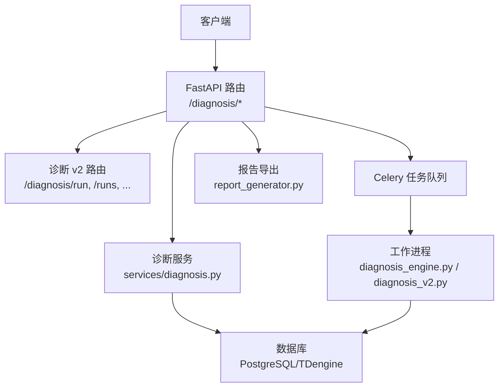
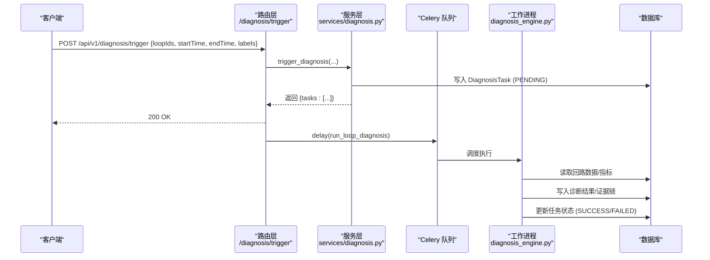
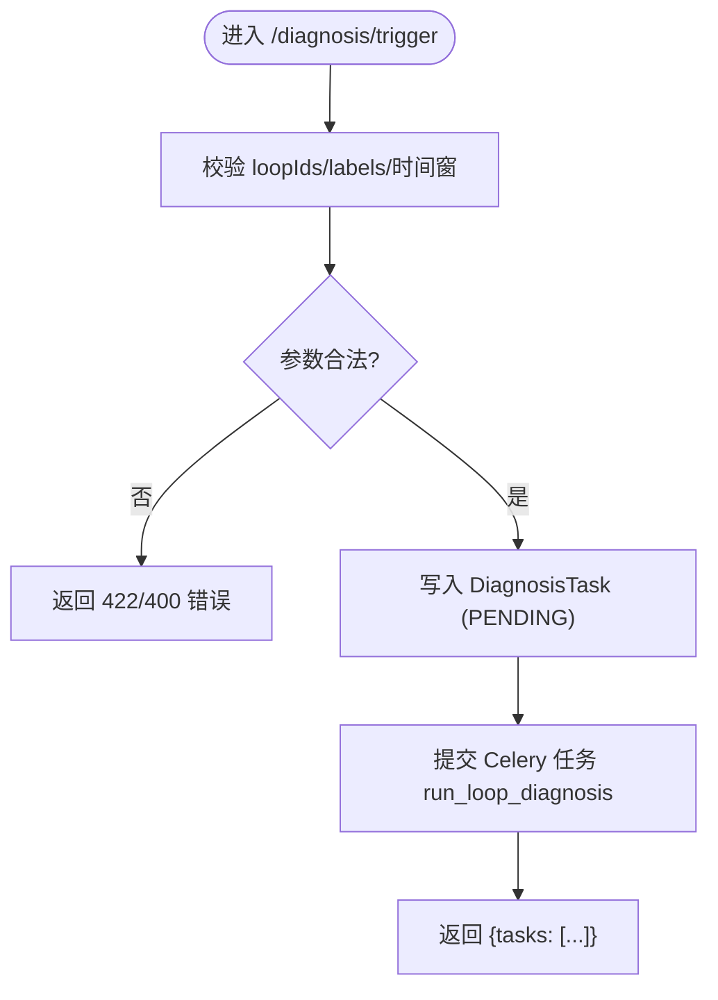
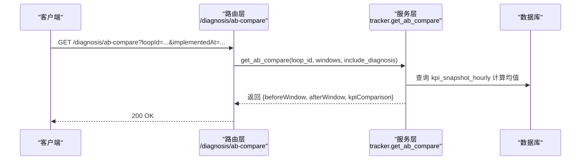
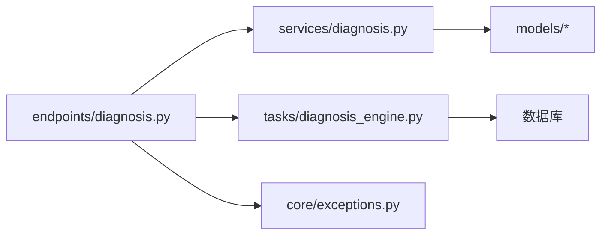

# 诊断引擎接口

<cite>
**本文引用的文件**
- [后端诊断端点](file://backend/app/api/v1/endpoints/diagnosis.py)
- [后端诊断 v2 端点](file://backend/app/api/v1/endpoints/diagnosis_v2.py)
- [诊断中心服务](file://backend/app/services/diagnosis.py)
- [诊断数据模型与 Schema](file://backend/app/schemas/diagnosis.py)
- [全局异常处理](file://backend/app/core/exceptions.py)
- [诊断任务执行 Celery 任务](file://backend/app/tasks/diagnosis_engine.py)
- [诊断 v2 批量任务](file://backend/app/tasks/diagnosis_v2.py)
- [报告生成器任务](file://backend/app/tasks/report_generator.py)
</cite>

## 目录
1. [简介](#简介)
2. [项目结构](#项目结构)
3. [核心组件](#核心组件)
4. [架构总览](#架构总览)
5. [详细组件分析](#详细组件分析)
6. [依赖关系分析](#依赖关系分析)
7. [性能考虑](#性能考虑)
8. [故障排查指南](#故障排查指南)
9. [结论](#结论)
10. [附录：请求响应示例与错误码](#附录请求响应示例与错误码)

## 简介
本文件为 CLPM-MVP 诊断引擎的 API 文档，覆盖以下能力：
- 诊断任务触发接口：POST /api/v1/diagnosis/trigger，支持批量回路、时间窗口配置、标签筛选。
- 诊断任务管理接口：任务列表查询、状态监控、执行详情、归档管理。
- 诊断结果获取接口：诊断详情查看、统计报表生成、CSV 导出。
- A/B 对比分析接口：实施前后效果对比、KPI 均值计算、数据完整性检查。
- 异步任务处理机制、错误处理策略、权限控制说明。
- 完整的请求/响应示例与常见错误码说明。

## 项目结构
诊断相关代码主要分布在以下模块：
- API 层：FastAPI 路由定义（旧版 endpoints/diagnosis.py 与新版 endpoints/diagnosis_v2.py）。
- 服务层：业务编排与数据聚合（services/diagnosis.py）。
- 模型与 Schema：Pydantic 校验与数据结构（schemas/diagnosis.py）。
- 任务层：Celery 异步任务（tasks/diagnosis_engine.py、tasks/diagnosis_v2.py、tasks/report_generator.py）。
- 异常处理：统一错误响应格式（core/exceptions.py）。

图表来源
- [后端诊断端点:1-150](file://backend/app/api/v1/endpoints/diagnosis.py#L1-L150)
- [后端诊断 v2 端点:1-120](file://backend/app/api/v1/endpoints/diagnosis_v2.py#L1-L120)
- [诊断中心服务:1-120](file://backend/app/services/diagnosis.py#L1-L120)
- [诊断任务执行 Celery 任务](file://backend/app/tasks/diagnosis_engine.py)
- [诊断 v2 批量任务](file://backend/app/tasks/diagnosis_v2.py)
- [报告生成器任务](file://backend/app/tasks/report_generator.py)

章节来源
- [后端诊断端点:1-150](file://backend/app/api/v1/endpoints/diagnosis.py#L1-L150)
- [后端诊断 v2 端点:1-120](file://backend/app/api/v1/endpoints/diagnosis_v2.py#L1-L120)
- [诊断中心服务:1-120](file://backend/app/services/diagnosis.py#L1-L120)

## 核心组件
- 诊断任务触发：POST /api/v1/diagnosis/trigger（手动触发，支持批量、时间窗、标签子集）。
- 诊断任务管理：GET /api/v1/diagnosis/tasks、GET /api/v1/diagnosis/tasks/{taskId}、POST /api/v1/diagnosis/tasks/{taskId}/run、POST /api/v1/diagnosis/tasks/{taskId}/archive、POST /api/v1/diagnosis/tasks/{taskId}/cancel、DELETE /api/v1/diagnosis/tasks/{taskId}。
- 诊断结果获取：GET /api/v1/diagnosis/{loopId}（详情）、GET /api/v1/diagnosis/analytics（统计）、POST /api/v1/diagnosis/analytics/export（异步导出）、GET /api/v1/diagnosis/statistics/export（CSV 导出）。
- A/B 对比分析：GET /api/v1/diagnosis/ab-compare（实施前后 KPI 均值对比，支持自动或显式窗口）。
- 诊断标签管理：GET /api/v1/diagnosis/tags、GET /api/v1/diagnosis/tags/{loopId}、PUT /api/v1/diagnosis/tags/{tagId}/resolve。
- 波形数据：GET /api/v1/timeseries/{loopId}/waveform。
- 处置跟踪：PATCH /api/v1/tracker/{loopId}/status、GET /api/v1/tracker/{loopId}/timeline、POST /api/v1/tracker/{loopId}/export。

章节来源
- [后端诊断端点:468-803](file://backend/app/api/v1/endpoints/diagnosis.py#L468-L803)
- [后端诊断端点:806-1563](file://backend/app/api/v1/endpoints/diagnosis.py#L806-L1563)
- [后端诊断 v2 端点:190-800](file://backend/app/api/v1/endpoints/diagnosis_v2.py#L190-L800)

## 架构总览
诊断引擎采用“路由-服务-任务”分层架构：
- 路由层负责参数校验、权限控制、调用服务。
- 服务层负责业务逻辑、数据聚合、审计日志。
- 任务层通过 Celery 异步执行诊断与报告导出，避免阻塞请求。

图表来源
- [后端诊断端点:648-670](file://backend/app/api/v1/endpoints/diagnosis.py#L648-L670)
- [诊断中心服务:1077-1177](file://backend/app/services/diagnosis.py#L1077-L1177)
- [诊断任务执行 Celery 任务](file://backend/app/tasks/diagnosis_engine.py)

## 详细组件分析

### 诊断任务触发接口：POST /api/v1/diagnosis/trigger
- 功能：为每个回路创建一条 DiagnosisTask 记录，并通过 Celery 异步执行诊断。
- 参数：
  - loopIds：必填，至少一个回路 ID。
  - startTime：可选，ISO 8601；默认最近 1 小时。
  - endTime：可选，ISO 8601；默认当前时间。
  - labels：可选，标签子集（仅接受 8 类标准标签，不含 MANUAL_REVIEW）；None/空视为全量。
- 权限：ADMIN、IC_ENGINEER、PE_ENGINEER。
- 返回：{tasks: [{taskId, loopId, status}, ...]}。
- 行为：
  - 校验 labels 合法性，非法标签返回 ERR_LABEL_INVALID。
  - 解析时间范围并落库。
  - 提交 Celery 任务 run_loop_diagnosis。

图表来源
- [后端诊断端点:648-670](file://backend/app/api/v1/endpoints/diagnosis.py#L648-L670)
- [诊断中心服务:1077-1177](file://backend/app/services/diagnosis.py#L1077-L1177)

章节来源
- [后端诊断端点:648-670](file://backend/app/api/v1/endpoints/diagnosis.py#L648-L670)
- [诊断中心服务:1077-1177](file://backend/app/services/diagnosis.py#L1077-L1177)

### 诊断任务管理接口
- 任务列表：GET /api/v1/diagnosis/tasks
  - 筛选：status、triggerType、loopId、plantNodeId、includeArchived、archivedOnly。
  - 分页：page、pageSize。
- 任务详情：GET /api/v1/diagnosis/tasks/{taskId}
  - 返回任务信息与关联的诊断结果列表。
- 重新执行：POST /api/v1/diagnosis/tasks/{taskId}/run
  - 重置任务状态为 PENDING，提交 Celery 任务。
- 归档：POST /api/v1/diagnosis/tasks/{taskId}/archive
  - 仅终态（SUCCESS/FAILED/CANCELLED）可归档。
- 取消：POST /api/v1/diagnosis/tasks/{taskId}/cancel
  - 仅 PENDING/RUNNING 可取消。
- 删除：DELETE /api/v1/diagnosis/tasks/{taskId}
  - RUNNING 不可删除，须先取消。

章节来源
- [后端诊断端点:672-803](file://backend/app/api/v1/endpoints/diagnosis.py#L672-L803)
- [诊断中心服务:1183-1599](file://backend/app/services/diagnosis.py#L1183-L1599)

### 诊断结果获取接口
- 诊断详情：GET /api/v1/diagnosis/{loopId}
  - 返回 8 类标签数组、证据链、特征值、综合评分等。
- 统计报表：GET /api/v1/diagnosis/analytics
  - 标签分布、效率趋势、闭环时长分布。
- 异步导出：POST /api/v1/diagnosis/analytics/export
  - 提交 Celery 任务，返回 taskId，前端轮询任务状态。
- CSV 导出：GET /api/v1/diagnosis/statistics/export
  - 返回 CSV 文件（UTF-8 with BOM），文件名包含日期范围。

章节来源
- [后端诊断端点:509-601](file://backend/app/api/v1/endpoints/diagnosis.py#L509-L601)
- [后端诊断端点:834-885](file://backend/app/api/v1/endpoints/diagnosis.py#L834-L885)
- [诊断中心服务:835-893](file://backend/app/services/diagnosis.py#L835-L893)

### A/B 对比分析接口：GET /api/v1/diagnosis/ab-compare
- 功能：实施前后两窗口 KPI 均值对比（基于 kpi_snapshot_hourly）。
- 参数：
  - loopId：必填。
  - implementedAt：可选，自动截取 [T-7d,T) 与 (T,T+7d]。
  - beforeStartTime/beforeEndTime/afterStartTime/afterEndTime：可选，显式窗口。
  - includeDiagnosis：可选，是否返回诊断标签对比。
- 返回：beforeWindow/afterWindow 的 KPI 均值、变化百分比、改善标志、数据不足标记。

图表来源
- [后端诊断端点:604-641](file://backend/app/api/v1/endpoints/diagnosis.py#L604-L641)

章节来源
- [后端诊断端点:604-641](file://backend/app/api/v1/endpoints/diagnosis.py#L604-L641)

### 异步任务处理机制
- 诊断任务：通过 Celery 的 delay() 提交 run_loop_diagnosis，异步执行诊断。
- 报告导出：POST /diagnosis/analytics/export 与 /diagnosis/{loopId}/report?async=true 提交 Celery 任务，返回 taskId。
- 任务状态：前端通过任务 ID 轮询任务状态（如 /api/v1/tasks/{taskId}）。

章节来源
- [后端诊断端点:533-568](file://backend/app/api/v1/endpoints/diagnosis.py#L533-L568)
- [后端诊断端点:957-1020](file://backend/app/api/v1/endpoints/diagnosis.py#L957-L1020)
- [报告生成器任务](file://backend/app/tasks/report_generator.py)

### 错误处理策略
- 统一错误格式：{"code": <error_code>, "message": <message>, "data": null}。
- 业务错误：抛出 BizError，携带稳定错误码与 HTTP 状态码。
- 参数校验：RequestValidationError 被捕获并脱敏，返回通用提示。
- 未处理异常：返回 500，错误码 ERR_INTERNAL。

章节来源
- [全局异常处理:1-187](file://backend/app/core/exceptions.py#L1-L187)

### 权限控制说明
- 诊断触发：ADMIN、IC_ENGINEER、PE_ENGINEER。
- 诊断详情/可视化/解读：ADMIN、IC_ENGINEER、PE_ENGINEER、EXPERT。
- 标签处理：IC_ENGINEER、PE_ENGINEER、ADMIN。
- 阈值覆盖/模板套用：ADMIN、IC_ENGINEER（按 scope 限制）。
- 配置变更审批：ADMIN/EXPERT。

章节来源
- [后端诊断端点:648-670](file://backend/app/api/v1/endpoints/diagnosis.py#L648-L670)
- [后端诊断端点:834-917](file://backend/app/api/v1/endpoints/diagnosis.py#L834-L917)
- [后端诊断端点:1473-1559](file://backend/app/api/v1/endpoints/diagnosis.py#L1473-L1559)

## 依赖关系分析
- 路由依赖服务：endpoints/diagnosis.py 调用 services/diagnosis.py。
- 服务依赖模型：services/diagnosis.py 使用 models.diagnosis、models.loop、models.tracker 等。
- 任务依赖数据库：Celery 任务从数据库读取数据并写回结果。
- 异常处理全局注册：core/exceptions.py 注册 BizError、RequestValidationError、HTTPException 处理器。

图表来源
- [后端诊断端点:1-150](file://backend/app/api/v1/endpoints/diagnosis.py#L1-L150)
- [诊断中心服务:1-120](file://backend/app/services/diagnosis.py#L1-L120)
- [全局异常处理:1-187](file://backend/app/core/exceptions.py#L1-L187)

章节来源
- [后端诊断端点:1-150](file://backend/app/api/v1/endpoints/diagnosis.py#L1-L150)
- [诊断中心服务:1-120](file://backend/app/services/diagnosis.py#L1-L120)
- [全局异常处理:1-187](file://backend/app/core/exceptions.py#L1-L187)

## 性能考虑
- 批量诊断：单次最多 50 个回路（v2 路由限制），避免过大负载。
- 时间窗口：波形查询最大 50000 点，超过 LTTB 降采样。
- 统计导出：异步任务避免长耗时阻塞请求。
- 分页与聚合：列表接口支持分页，聚合统计不受分页影响。

[本节提供一般性指导，不直接分析具体文件]

## 故障排查指南
- 参数校验失败：检查请求体字段类型、枚举值、长度限制。
- 任务无法归档：确认任务状态为终态（SUCCESS/FAILED/CANCELLED）。
- 任务无法取消：确认任务状态为 PENDING/RUNNING。
- 标签处理失败：确认标签存在且状态转换合法。
- 波形查询超时：缩短时间范围或降低 maxPoints。

章节来源
- [全局异常处理:122-187](file://backend/app/core/exceptions.py#L122-L187)
- [诊断中心服务:1508-1599](file://backend/app/services/diagnosis.py#L1508-L1599)

## 结论
CLPM-MVP 诊断引擎提供了完整的诊断任务触发、管理、结果获取与 A/B 对比能力，采用异步任务机制提升系统吞吐，统一错误处理与权限控制保障稳定性与安全性。建议在生产环境合理配置 Celery 并发与资源，结合监控告警确保任务健康运行。

[本节总结性内容，不直接分析具体文件]

## 附录：请求响应示例与错误码

### 请求示例
- 触发诊断：
  - POST /api/v1/diagnosis/trigger
  - 请求体：{"loopIds": ["uuid1", "uuid2"], "startTime": "2024-01-01T00:00:00Z", "endTime": "2024-01-01T23:59:59Z", "labels": ["OSCILLATION"]}
- 任务列表：
  - GET /api/v1/diagnosis/tasks?status=PENDING&page=1&pageSize=20
- 诊断详情：
  - GET /api/v1/diagnosis/{loopId}
- A/B 对比：
  - GET /api/v1/diagnosis/ab-compare?loopId={loopId}&implementedAt=2024-01-01T12:00:00Z

### 响应示例
- 触发诊断成功：
  - {"code": "OK", "message": "已触发 2 个诊断任务", "data": {"tasks": [{"taskId": "uuid", "loopId": "uuid", "status": "PENDING"}]}}
- 任务列表：
  - {"code": "OK", "message": null, "data": {"items": [...], "total": 10, "page": 1, "pageSize": 20}}
- 诊断详情：
  - {"code": "OK", "message": null, "data": {"loopId": "...", "tagName": "...", "diagnosisLabels": [...], "evidenceChain": {...}}}
- A/B 对比：
  - {"code": "OK", "message": null, "data": {"loopId": "...", "beforeWindow": {...}, "afterWindow": {...}, "kpiComparison": [...]}}

### 常见错误码
- ERR_VALIDATION：请求参数校验失败（422）。
- ERR_DIAG_TASK_NOT_FOUND：诊断任务不存在（404）。
- ERR_DIAG_TASK_NOT_ARCHIVABLE：任务不可归档（400）。
- ERR_DIAG_TASK_NOT_CANCELLABLE：任务不可取消（400）。
- ERR_LABEL_INVALID：标签不在允许范围内（400）。
- ERR_INTERNAL：服务内部错误（500）。

章节来源
- [后端诊断端点:648-803](file://backend/app/api/v1/endpoints/diagnosis.py#L648-L803)
- [后端诊断端点:806-1563](file://backend/app/api/v1/endpoints/diagnosis.py#L806-L1563)
- [全局异常处理:122-187](file://backend/app/core/exceptions.py#L122-L187)