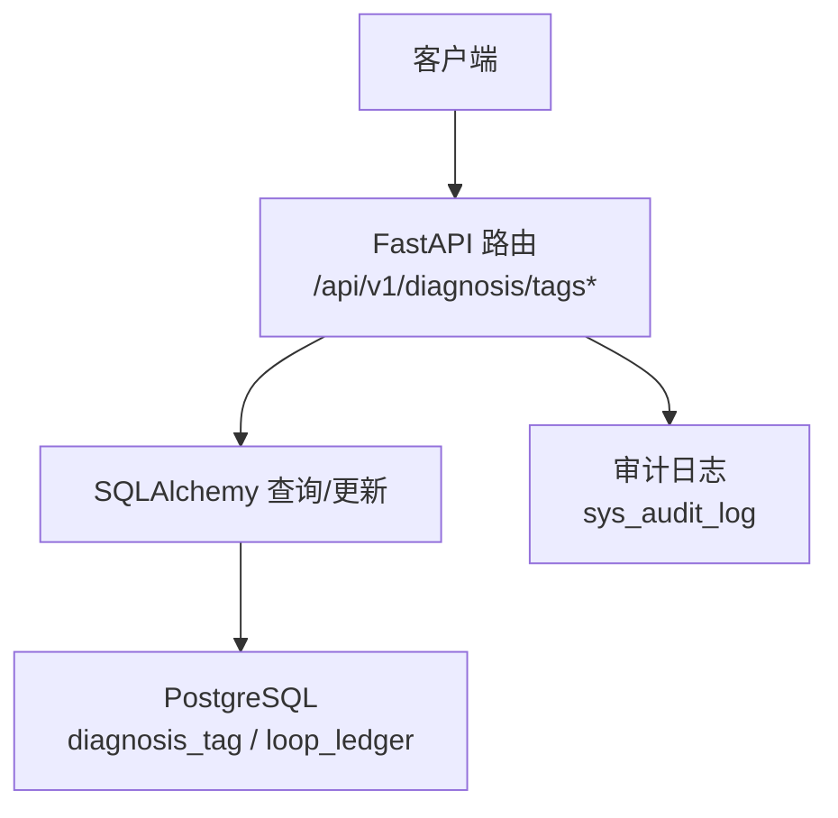
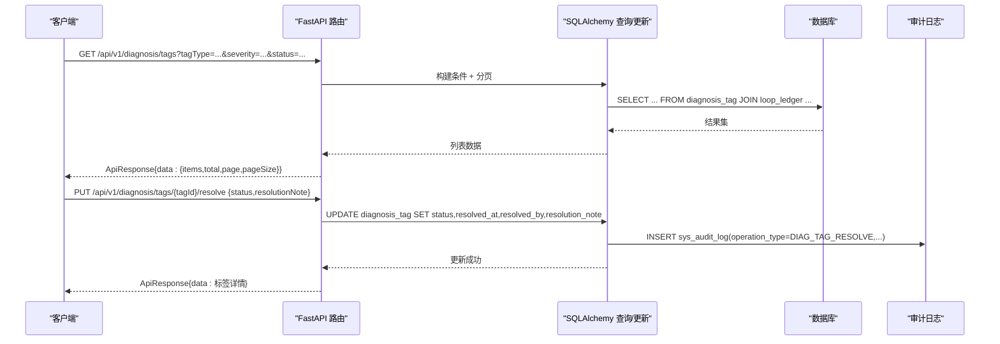
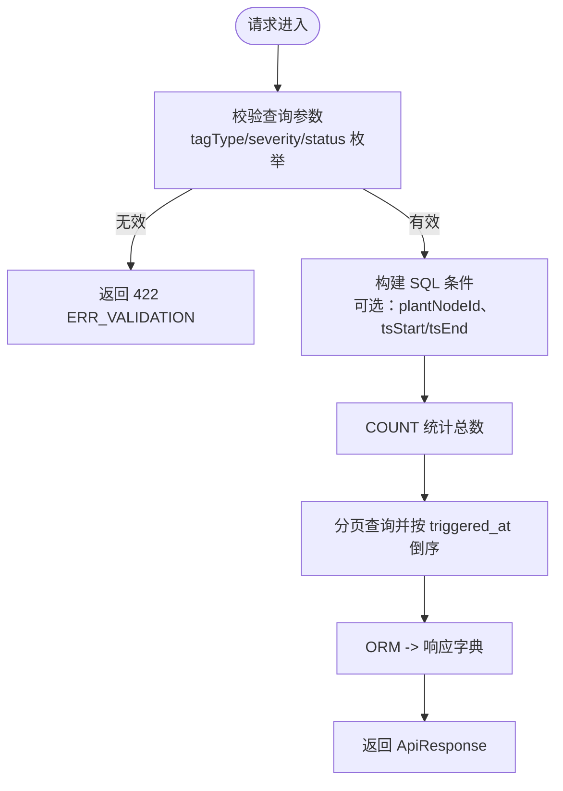
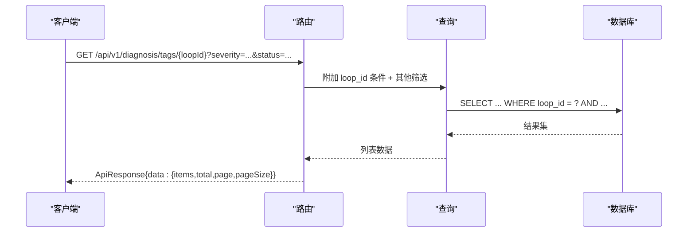
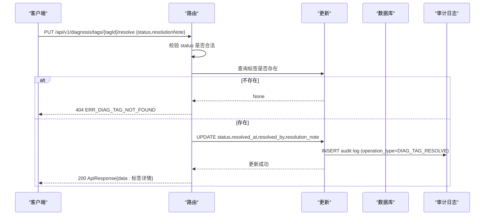
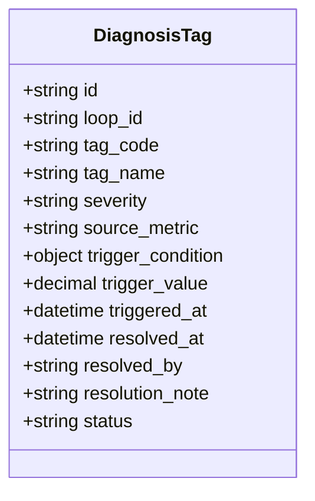
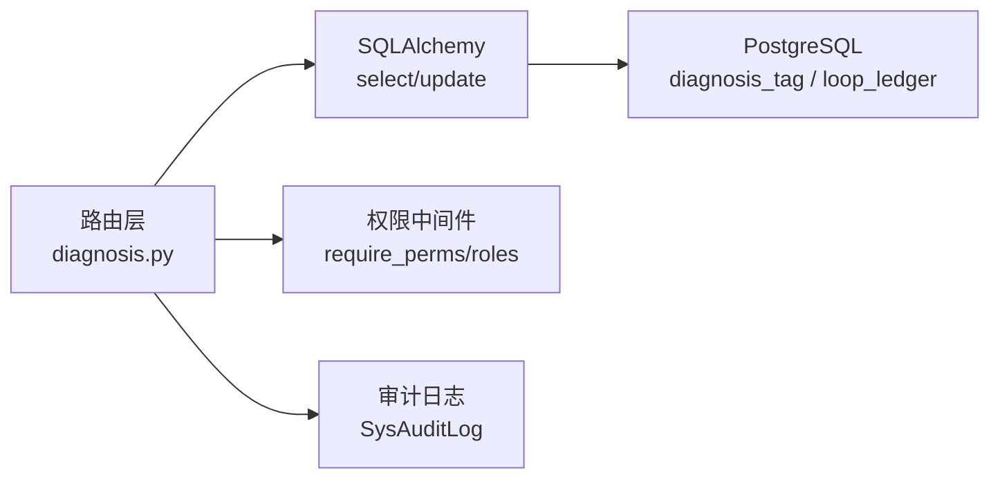

# 诊断标签接口

<cite>
**本文引用的文件**
- [diagnosis.py](file://backend/app/api/v1/endpoints/diagnosis.py)
- [diagnosis.py（模型）](file://backend/app/models/diagnosis.py)
- [test_api_diagnosis_tags.py](file://backend/tests/test_api_diagnosis_tags.py)
- [openapi_baseline.json](file://backend/tests/golden/openapi_baseline.json)
</cite>

## 目录
1. [简介](#简介)
2. [项目结构](#项目结构)
3. [核心组件](#核心组件)
4. [架构总览](#架构总览)
5. [详细组件分析](#详细组件分析)
6. [依赖关系分析](#依赖关系分析)
7. [性能考虑](#性能考虑)
8. [故障排查指南](#故障排查指南)
9. [结论](#结论)
10. [附录](#附录)

## 简介
本文件为 CLPM-MVP 诊断标签系统的 API 文档，聚焦以下能力：
- 标签查询接口：GET /api/v1/diagnosis/tags（获取所有诊断标签）、GET /api/v1/diagnosis/tags/{loopId}（按回路查询标签）
- 标签处理接口：PUT /api/v1/diagnosis/tags/{tagId}/resolve（标记标签已处理/抑制），并说明状态更新机制与审计记录
- 标签分类体系：故障类型、严重程度、影响范围等分类标准
- 标签生命周期管理：创建、更新、归档、删除操作说明
- 标签与回路的关联关系、批量操作支持、权限控制机制
- 使用规范与常见问题解决方案

## 项目结构
诊断标签相关能力集中在后端 FastAPI 路由中，并通过 SQLAlchemy ORM 访问数据库。关键位置如下：
- 路由定义与业务入口：backend/app/api/v1/endpoints/diagnosis.py
- 数据模型定义：backend/app/models/diagnosis.py（DiagnosisTag 等）
- 接口契约与响应结构：backend/tests/golden/openapi_baseline.json（OpenAPI 基线）
- 行为验证与用例：backend/tests/test_api_diagnosis_tags.py

图表来源
- [diagnosis.py:1407-1563](file://backend/app/api/v1/endpoints/diagnosis.py#L1407-L1563)
- [diagnosis.py（模型）:148-201](file://backend/app/models/diagnosis.py#L148-L201)

章节来源
- [diagnosis.py:1407-1563](file://backend/app/api/v1/endpoints/diagnosis.py#L1407-L1563)
- [diagnosis.py（模型）:148-201](file://backend/app/models/diagnosis.py#L148-L201)

## 核心组件
- 标签列表查询：支持多条件筛选（标签类型、严重等级、处理状态、装置节点、时间范围）与分页
- 回路标签查询：在列表查询基础上固定 loop_id 过滤，支持二次筛选
- 标签处理：将标签状态更新为 RESOLVED（已处理）或 SUPPRESSED（已抑制），记录处理人、时间与备注，并写入审计日志
- 数据模型：DiagnosisTag 承载标签实例，包含 tag_code、severity、status、trigger_condition、trigger_value、触发/处理时间戳等字段
- 权限控制：查询需具备 diagnosis:view 权限；处理标签需 IC_ENGINEER/PE_ENGINEER/ADMIN 角色

章节来源
- [diagnosis.py:1407-1563](file://backend/app/api/v1/endpoints/diagnosis.py#L1407-L1563)
- [diagnosis.py（模型）:148-201](file://backend/app/models/diagnosis.py#L148-L201)

## 架构总览
诊断标签接口的调用链路如下：
- 客户端发起请求到 FastAPI 路由
- 路由进行参数校验与权限检查
- 通过 SQLAlchemy 执行查询或更新
- 写操作同时生成审计日志
- 返回统一 ApiResponse 包装的 JSON

图表来源
- [diagnosis.py:1407-1563](file://backend/app/api/v1/endpoints/diagnosis.py#L1407-L1563)
- [diagnosis.py（模型）:148-201](file://backend/app/models/diagnosis.py#L148-L201)

## 详细组件分析

### 接口一：获取所有诊断标签
- 方法：GET
- 路径：/api/v1/diagnosis/tags
- 认证与权限：需要登录，且具备 diagnosis:view 权限
- 查询参数
  - tagType：标签类型，枚举值包括 OSCILLATION、VALVE_STICTION、OVERAGGRESSIVE、OVERCONSERVATIVE、EXTERNAL_DISTURBANCE、QUALITY_ABNORMAL、OUTPUT_SATURATION、MANUAL_REVIEW
  - severity：严重等级，枚举值 INFO、WARN、ERROR、CRITICAL
  - status：处理状态，枚举值 ACTIVE、RESOLVED、SUPPRESSED
  - plantNodeId：装置节点 ID（通过 JOIN loop_ledger.unit_id 筛选）
  - tsStart/tsEnd：ISO 8601 时间范围，用于筛选 triggered_at
  - page/pageSize：分页参数
- 响应体：ApiResponse[DiagnosisTagListResponse]，data 包含 items、total、page、pageSize
- 错误码
  - 401：未认证
  - 422：参数校验失败（如 tagType/severity/status 不在允许范围内）

图表来源
- [diagnosis.py:1407-1437](file://backend/app/api/v1/endpoints/diagnosis.py#L1407-L1437)
- [diagnosis.py:1282-1310](file://backend/app/api/v1/endpoints/diagnosis.py#L1282-L1310)
- [diagnosis.py:1346-1404](file://backend/app/api/v1/endpoints/diagnosis.py#L1346-L1404)

章节来源
- [diagnosis.py:1407-1437](file://backend/app/api/v1/endpoints/diagnosis.py#L1407-L1437)
- [diagnosis.py:1282-1310](file://backend/app/api/v1/endpoints/diagnosis.py#L1282-L1310)
- [diagnosis.py:1346-1404](file://backend/app/api/v1/endpoints/diagnosis.py#L1346-L1404)

### 接口二：按回路查询诊断标签
- 方法：GET
- 路径：/api/v1/diagnosis/tags/{loopId}
- 认证与权限：需要登录，且具备 diagnosis:view 权限
- 路径参数：loopId（UUID）
- 查询参数：同“接口一”，但自动附加 loop_id 过滤
- 响应体：同“接口一”
- 错误码：401、422

图表来源
- [diagnosis.py:1440-1470](file://backend/app/api/v1/endpoints/diagnosis.py#L1440-L1470)
- [diagnosis.py:1346-1404](file://backend/app/api/v1/endpoints/diagnosis.py#L1346-L1404)

章节来源
- [diagnosis.py:1440-1470](file://backend/app/api/v1/endpoints/diagnosis.py#L1440-L1470)

### 接口三：处理诊断标签（标记已处理/抑制）
- 方法：PUT
- 路径：/api/v1/diagnosis/tags/{tagId}/resolve
- 认证与权限：需要登录，且角色为 IC_ENGINEER、PE_ENGINEER 或 ADMIN
- 请求体：TagResolveRequest
  - status：目标状态，仅允许 RESOLVED 或 SUPPRESSED
  - resolutionNote：处理说明（可选）
- 响应体：ApiResponse[DiagnosisTagSchema]，data 为更新后的标签详情
- 错误码
  - 401：未认证
  - 403：无权限（非允许角色）
  - 404：标签不存在
  - 422：参数校验失败（status 不在允许范围内）

图表来源
- [diagnosis.py:1473-1563](file://backend/app/api/v1/endpoints/diagnosis.py#L1473-L1563)

章节来源
- [diagnosis.py:1473-1563](file://backend/app/api/v1/endpoints/diagnosis.py#L1473-L1563)

### 数据模型与分类体系
- DiagnosisTag 关键字段
  - id：主键 UUID
  - loop_id：关联回路
  - tag_code：标签代码（故障类型），如 OSCILLATION、VALVE_STICTION、OUTPUT_SATURATION、QUALITY_ABNORMAL 等
  - tag_name：标签名称
  - severity：严重等级，INFO/WARN/ERROR/CRITICAL
  - source_metric：来源指标代码（如 oscillation_rate）
  - trigger_condition：触发条件（JSONB），例如 {"threshold": 0.4, "window_minutes": 60}
  - trigger_value：触发阈值数值
  - triggered_at：触发时间
  - resolved_at：处理时间
  - resolved_by：处理人
  - resolution_note：处理说明
  - status：标签状态，ACTIVE/RESOLVED/SUPPRESSED
- 分类标准
  - 故障类型：由 tag_code 表示，后端维护白名单校验
  - 严重等级：INFO/WARN/ERROR/CRITICAL
  - 影响范围：可通过 plantNodeId 筛选至装置级，或通过 loop_id 限定到具体回路
  - 处理状态：ACTIVE（生效中）、RESOLVED（已处理）、SUPPRESSED（已抑制）

图表来源
- [diagnosis.py（模型）:148-201](file://backend/app/models/diagnosis.py#L148-L201)

章节来源
- [diagnosis.py（模型）:148-201](file://backend/app/models/diagnosis.py#L148-L201)

### 标签生命周期管理
- 创建：由诊断引擎或任务产生 DiagnosisTag 记录（当前接口不直接暴露创建端点）
- 更新：通过 resolve 接口更新状态为 RESOLVED 或 SUPPRESSED，并记录处理人与时间
- 归档：诊断任务完成后可归档，标签随任务归档策略可见（通过诊断记录列表查看）
- 删除：当前未提供直接删除标签的接口；如需清理，应结合任务归档与数据治理流程

章节来源
- [diagnosis.py:1473-1563](file://backend/app/api/v1/endpoints/diagnosis.py#L1473-L1563)

### 标签与回路的关联关系
- 每个标签属于一个回路（loop_id 外键）
- 列表查询支持通过 plantNodeId 关联 loop_ledger.unit_id 进行装置级筛选
- 回路标签查询强制限定 loop_id，便于快速定位某回路的诊断问题

章节来源
- [diagnosis.py:1346-1404](file://backend/app/api/v1/endpoints/diagnosis.py#L1346-L1404)
- [diagnosis.py:1440-1470](file://backend/app/api/v1/endpoints/diagnosis.py#L1440-L1470)

### 批量操作支持
- 当前标签接口未提供批量处理端点
- 可通过多次调用 resolve 接口实现批量处理（建议前端封装重试与并发控制）
- 若需更高吞吐，可在服务端扩展批量接口（未来增强方向）

章节来源
- [diagnosis.py:1473-1563](file://backend/app/api/v1/endpoints/diagnosis.py#L1473-L1563)

### 权限控制机制
- 查询接口：require_perms("diagnosis:view")，所有认证用户可查
- 处理接口：require_roles("IC_ENGINEER","PE_ENGINEER","ADMIN")，仅授权角色可处理标签
- 未认证请求返回 401；无权限返回 403

章节来源
- [diagnosis.py:1407-1563](file://backend/app/api/v1/endpoints/diagnosis.py#L1407-L1563)

## 依赖关系分析
- 路由依赖
  - FastAPI 路由注册于 diagnosis.py，前缀为 /diagnosis/tags
  - 依赖 get_db 获取异步会话
  - 依赖 require_perms/require_roles 进行权限校验
- 数据层依赖
  - 使用 SQLAlchemy select 构建查询，JOIN loop_ledger 以支持装置级筛选
  - 写操作后插入 SysAuditLog 记录审计日志
- 外部契约
  - OpenAPI 基线定义了响应结构与错误码

图表来源
- [diagnosis.py:1407-1563](file://backend/app/api/v1/endpoints/diagnosis.py#L1407-L1563)
- [openapi_baseline.json:5287-5292](file://backend/tests/golden/openapi_baseline.json#L5287-L5292)

章节来源
- [diagnosis.py:1407-1563](file://backend/app/api/v1/endpoints/diagnosis.py#L1407-L1563)
- [openapi_baseline.json:5287-5292](file://backend/tests/golden/openapi_baseline.json#L5287-L5292)

## 性能考虑
- 分页查询：默认 pageSize=20，最大 100，避免大结果集拖慢响应
- 索引优化：diagnosis_tag 表对 loop_id+status、severity+triggered_at 建立索引，提升筛选与排序效率
- 时间窗限制：建议在客户端限制 tsStart/tsEnd 范围，减少扫描量
- 并发处理：批量 resolve 建议前端限流与重试，避免瞬时高并发导致锁竞争

章节来源
- [diagnosis.py:1346-1404](file://backend/app/api/v1/endpoints/diagnosis.py#L1346-L1404)
- [diagnosis.py（模型）:189-201](file://backend/app/models/diagnosis.py#L189-L201)

## 故障排查指南
- 401 未认证：检查 Authorization 头是否正确携带 token
- 403 无权限：确认当前用户角色是否为 IC_ENGINEER/PE_ENGINEER/ADMIN
- 404 标签不存在：确认 tagId 是否正确，或标签已被删除/归档
- 422 参数校验失败：检查 tagType/severity/status 是否在允许范围内；时间格式是否符合 ISO 8601
- 审计日志缺失：确认写操作后是否提交事务；检查 SysAuditLog 插入逻辑

章节来源
- [test_api_diagnosis_tags.py:228-232](file://backend/tests/test_api_diagnosis_tags.py#L228-L232)
- [test_api_diagnosis_tags.py:388-421](file://backend/tests/test_api_diagnosis_tags.py#L388-L421)
- [test_api_diagnosis_tags.py:422-444](file://backend/tests/test_api_diagnosis_tags.py#L422-L444)

## 结论
诊断标签系统提供了清晰的查询与处理能力，支持多维度筛选、分页、权限控制与审计追踪。通过标准化的分类体系与生命周期管理，能够有效支撑故障定位与告警闭环。后续可考虑增加批量处理接口与更丰富的筛选维度，以提升运维效率。

## 附录

### API 参考摘要
- GET /api/v1/diagnosis/tags
  - 功能：获取所有诊断标签（分页）
  - 权限：diagnosis:view
  - 主要参数：tagType、severity、status、plantNodeId、tsStart、tsEnd、page、pageSize
  - 响应：ApiResponse[DiagnosisTagListResponse]
- GET /api/v1/diagnosis/tags/{loopId}
  - 功能：按回路查询诊断标签（分页）
  - 权限：diagnosis:view
  - 主要参数：同上，自动附加 loop_id
  - 响应：ApiResponse[DiagnosisTagListResponse]
- PUT /api/v1/diagnosis/tags/{tagId}/resolve
  - 功能：处理标签（RESOLVED/SUPPRESSED）
  - 权限：IC_ENGINEER/PE_ENGINEER/ADMIN
  - 请求体：status、resolutionNote（可选）
  - 响应：ApiResponse[DiagnosisTagSchema]

章节来源
- [diagnosis.py:1407-1563](file://backend/app/api/v1/endpoints/diagnosis.py#L1407-L1563)
- [openapi_baseline.json:5287-5292](file://backend/tests/golden/openapi_baseline.json#L5287-L5292)